# Moving Full Trust Code to the Cloud 
In this lab, you will investigate ways in which to replace full trust solutions using an app security principle, Windows Azure and new client-side APIs for SharePoint Online in the Office 365 environment.

## Prerequisites
1. You must have an Office 365 tenant and a Windows Azure account to complete this lab. If you do not have these, the lab for **O3651-7 Setting up your Developer environment in Office 365** shows you how to obtain them.

## Exercise 1: Create an App Security Principle and Configure Its Permissions
In this exercise you will create an app security principle in your Office 365 tenancy and configure it with the permissions that are required by the Console app that you will create in the next exercise.

1. Launch the browser.
2. Navigate to your Office 365 tenancy and log in with your credentials.
3. Navigate to the application page in a SharePoint site which allows you to create new app security principles by typing directly into the address bar of the browser to add a relative URL of **/_layouts/15/appregnew.aspx** to the end of the root URL of your developer site. Fill out this page with the following information.
	1. For **App Type** select **An app running on a web server**.
	2. Client the **Generate** button to create a new **Client Id**
	3. Client the **Generate** button to create a new **Client Secret**
	3. Enter an **App Title** of **SimpleTimerJob**
	4. Enter an **App Domain** of **localhost** which will effectively allow request to come from any URL during your testing. Note that the special domain of **localhost** should only be used in non-production environments in which you are testing and developing.
	5. Finally, click the **Create** button to create the new app security principle. 
	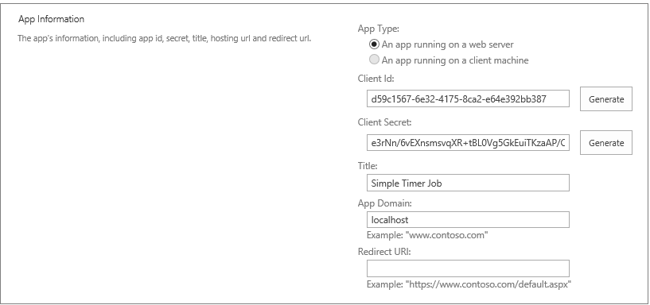
4. After creating the new app security principle, you will see a confirmation page like the one shown in the following screenshot which lists both the **Client Id** and the **Client Secret**. Copy and paste the the **Client Id** and the **Client Secret** into a new text document using a utility such as Notepad so you can copy-and-paste these values in later steps. 
  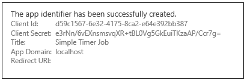

5. Navigate to the application page in a SharePoint site which allows you to configure an existing app security principles by typing directly into the address bar of the browser to add an relative URL of **/_layouts/15/appinv.aspx** to the end of the root URL of your developer site.
6. Copy and paste the **Client Id** of the app security principle you just created into the **App Id** textbox and click **Lookup**. When you do this, the page will retrieve other information about the app such as the **App Title** and the **App Domain**. 
  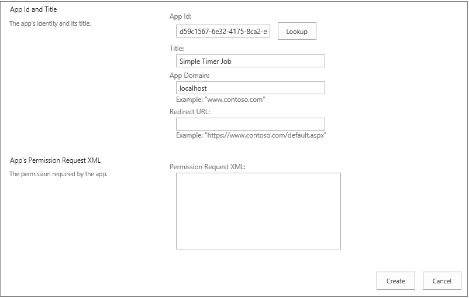

7. Enter the following XML snippet into the **Permission Request XML** textbox. If you would rather, you can copy-and-paste this XML from a text file named **PermissionRequestXML.txt** in the **Starter Files** folder for this lab. 

		<AppPermissionRequests AllowAppOnlyPolicy="true">
			<AppPermissionRequest 
				Scope="http://sharepoint/content/sitecollection/web" 
				Right="Manage" />
		</AppPermissionRequests>
8. You will notice that the XML you enter does not format inside the textbox in an elegant way but it will still work. Click the **Create** button to save the XML with the app permission configuration back to the SharePoint tenancy. 
  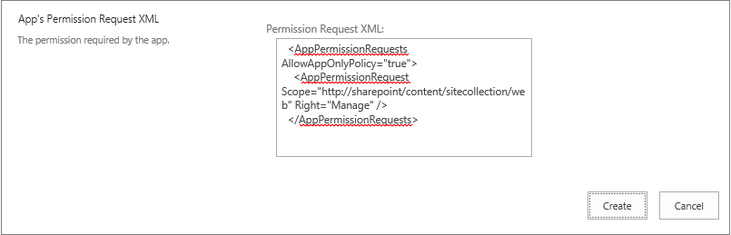

9. When you attempt to save the app security changes, SharePoint prompts you with a page titled **Do you trust Simple Timer Job?**. Click **Trust It** to confirm you want to save the app security configuration changes. 
  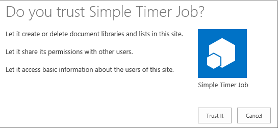

10. You have now successfully created and configured a new app security principle for your Office 365 site.

## Exercise 2: Create a Console App to Access a SharePoint Online Site
In this exercise you will use Visual Studio to create a simple console application that uses the app security principle you just created to establish its identity with your Office 365 developers site. In this exercise you will write the code in the app to change the look and feel of the site by configuring it to use a different theme.

1. In Visual Studio, click **Flie/New/Project**.
2. In the **New Project** dialog, select **Templates/Visual C#/Windows Desktop**. Then select **Console Application** and give the project a name of **SimpleTimerJob**. Click **OK** when you are done. 
     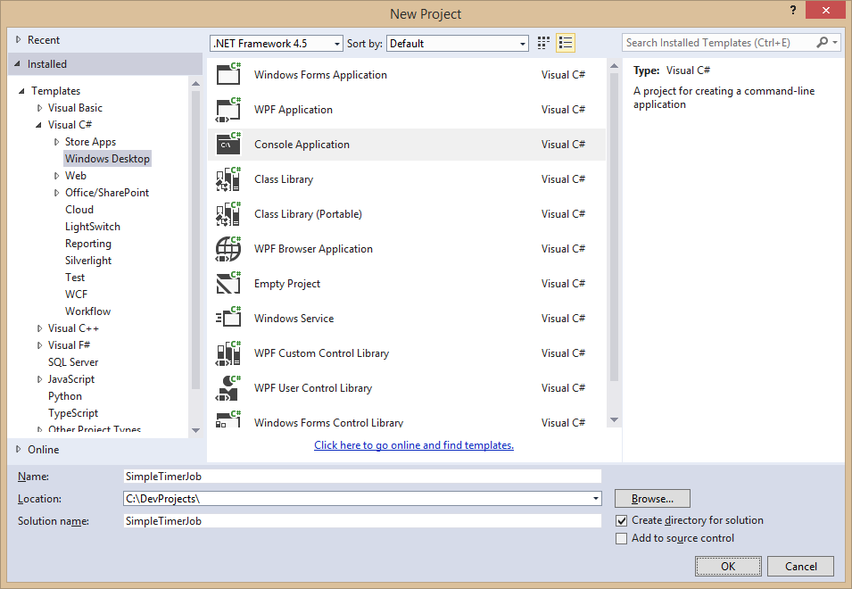
3. Once the **SimpleTimerJob** project has been created, right-click its project node in Solution Explorer and select **Manage NuGet Packages**. 
4. In the **Manage NuGet Packages** dialog, search for *"sharepoint app"* to find and install the package named **App for SharePoint Web Toolkit**. 
  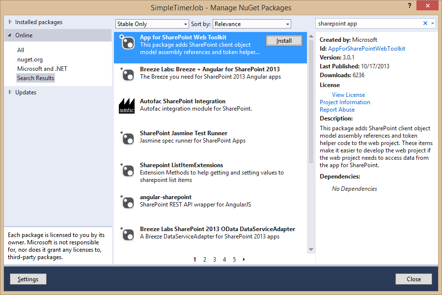

5. After adding the **App for SharePoint Web Toolkit** package, you should be able to examine the project references and verify that the project now has references to the two core assemblies of the SharePoint Client Object Model (CSOM) named **Microsoft.SharePoint.Client.dll** and **Microsoft.SharePoint.Client.Runtime.dll** 
  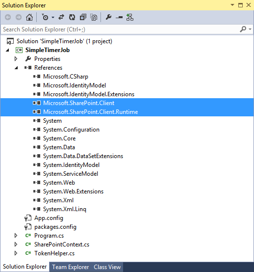

6. Locate and open the app configuration file named **App.config** file.
7. Add an **appSettings** section with values for **ClientId** and the **ClientSecret** and configure them with the correct values for the app security principle created in earlier steps. 

		<appSettings>
			<add key="ClientId" value="[[YOUR_VALUE]]"/>
			<add key="ClientSecret" value="[[YOUR_VALUE]]"/>
		</appSettings>
8. When you are done, your **app.config** file should look like the following screenshot with the exception of the values of the **ClientId** and the **ClientSecret**. 
  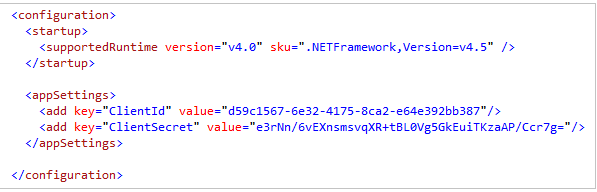

9. Open the console application's main logic file named **Program.cs**.
10. Add a **using** statement for **Microsoft.SharePoint.Client** namespace.
 
		using Microsoft.SharePoint.Client;

11. Inside the **Program** class, add a new static function named **URLCombine** with the following implementation. If you'd rather not type it in by hand, you can copy-and-paste this function from **URLCombine.cs.txt** inside the **Starter Files** folder for this lab.

		private static string URLCombine(string baseUrl, string relativeUrl) {
			if (baseUrl.Length == 0)
				return relativeUrl;
			if (relativeUrl.Length == 0)
				return baseUrl;
			return string.Format("{0}/{1}",
					baseUrl.TrimEnd(new char[] { '/', '\\' }),
					relativeUrl.TrimStart(new char[] { '/', '\\' }));
		}
11. Inside the **Program** class, add a new static function named **ApplyTheme** with the following implementation. If you'd rather not type it in by hand, you can copy-and-paste this function from **ApplyTheme.cs.txt** inside the **Starter Files** folder for this lab.

		private static void ApplyTheme(ClientContext clientContext) {
			Web currentWeb = clientContext.Web;
			clientContext.Load(currentWeb);
			clientContext.ExecuteQuery();

			//Apply Sketch theme
			currentWeb.ApplyTheme(
					URLCombine(currentWeb.ServerRelativeUrl, "/_catalogs/theme/15/palette007.spcolor"),
					URLCombine(currentWeb.ServerRelativeUrl, "/_catalogs/theme/15/fontscheme002.spfont"),
					URLCombine(currentWeb.ServerRelativeUrl, "/_layouts/15/images/image_bg007.jpg"),
					false);
			clientContext.ExecuteQuery();
		}

11. Rewrite the implementation of the **Main** function to match the following implementation. 

		static void Main(string[] args) {

			Uri siteUri = new Uri("https://[[YOUR_TENANCY]].sharepoint.com");
			string realm = TokenHelper.GetRealmFromTargetUrl(siteUri);

			string accessToken = TokenHelper.GetAppOnlyAccessToken(TokenHelper.SharePointPrincipal, 
                                                                   siteUri.Authority, realm).AccessToken;

			using (var clientContext = TokenHelper.GetClientContextWithAccessToken(siteUri.ToString(), accessToken)) {
				ApplyTheme(clientContext);
			}

			Console.WriteLine("The theme has now been updated...");

		}
12. Test the app in Visual Studio by pressing the **{F5}** key to begin a debugging sessions. You app should start and then run to completion.
13. In the browser, navigate to your Office 365 developers site. You should see that the theme of the site has been changed. That means your code ran successfully.
14. In your Office 365 developer site, change the theme back to the original out-of-the-box look and feel. Accomplish this by using the **Change the look** option in the **Site Settings** menu to change the Composed Look of the site back to the original **Office** theme.

## Exercise 3: Configure the Console App to Run in Windows Azure
In this exercise you will create a new Windows Azure Web Site and configure it with a WebJob to run the SimpleTimerJob console application from inside the Azure cloud.

1. Create a zip archive for Windows Azure deployment which contains the Console app and its dependency files.
   1. Launch Windows Explorer and navigate to the root folder of the **SimpleTimerJob** project that you created in the previous exercise.
   2. Navigate to the child folder inside the root project directory at the relative path of **SimpleTimerJob\bin\Debug**.
   3. Inspect the files that Visual Studio has added to the **Debug** folder. You should see the main EXE file named **SimpleTimerJob.exe** and an associated set of DLLs. 
     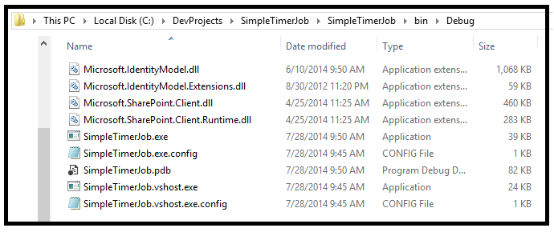
   4. In Windows Explorer, right-click on the **Debug** folder and select the **Send To > Compressed (zipped) file** command to create a new zip archive named **Debug.zip** which contains all the files required to deploy the Console app to Windows Azure. 
   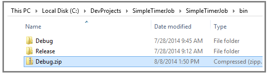

2. Log onto the Windows Azure manage portal at **https://manage.windowsazure.com** using your Azure account credentials.
3. Create a new Azure Web Site with a URL such as **SimpleTimerJobazurewebsites.net**. 
  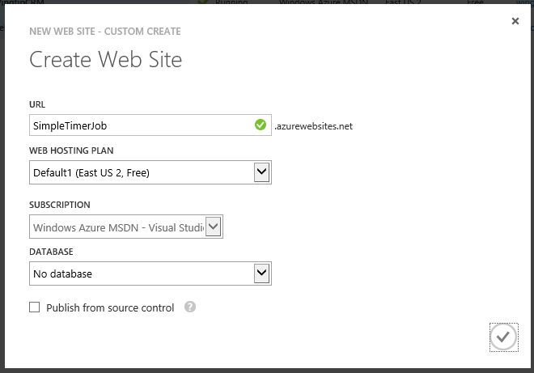

4. Once the new Web Site has been created, you should see the Web Site configuration page as shown in the following screenshot. Click the **WEBJOBS** link to display the empty list of WebJobs for the new Web Site. 
  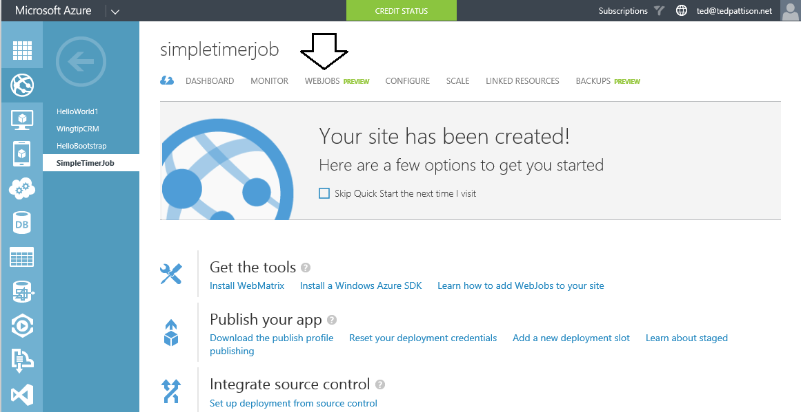

5. Create a new WebJob named **RunSimpleTimerJob**. Add the **Debug.zip** file created earlier in this exercise as the **CONTENT** file and configure the **How To Run** setting as **Run on demand** as shown in the following screenshot. When you are done, click the button with the check mark in the bottom right of the page to save your changes and create the new WebJob. 
  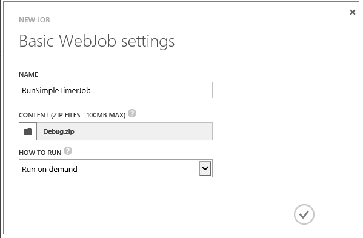

6. Run the **RunSimpleTimerJob** WebJob by selecting it and clicking the **RUN ONCE** button with the right arrow icon at the bottom center of the screen. 
  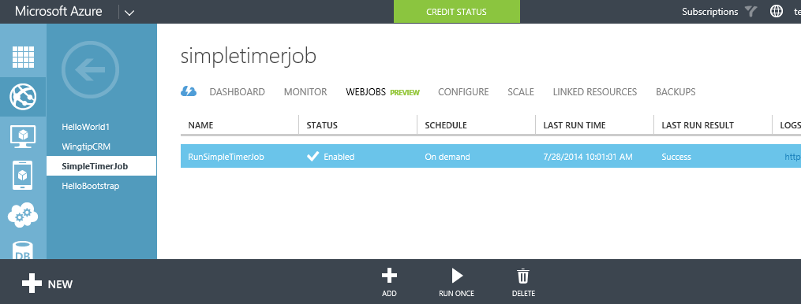

7. Inside the Windows Azure portal, verify that the WebJob ran successfully. 
  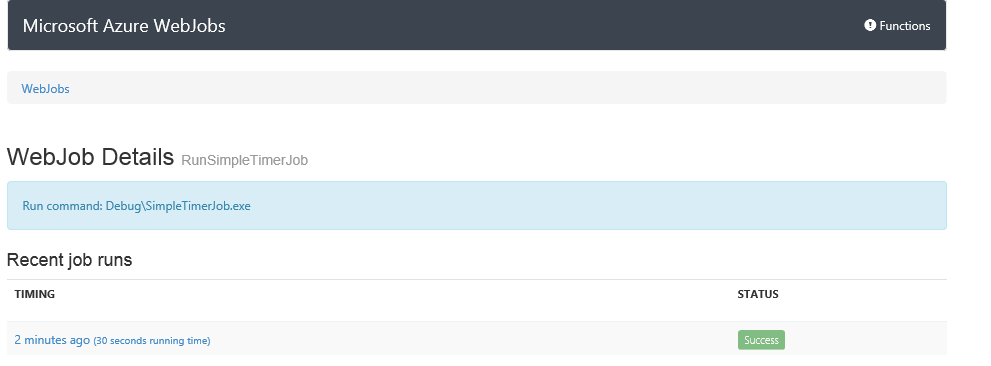

8. In the browser, navigate to your Office 365 developers site. You should see that the theme of the site has been changed. That means your code ran successfully from inside Windows Azure.
9. In your Office 365 developer site, change the theme back to the original out-of-the-box look and feel. Accomplish this by using the **Change the look** option in the **Site Settings** menu to change the site's look and feel back to the original **Office** theme.