#Setting up your on-premises environment for app development 

In this lab you will configure your SharePoint 2013 development environment to support the creation of Apps for SharePoint. When using Office 365, the Apps for SharePoint runtime environment is configured as part of the service. For on-premises deployments, this configuration is necessary before building Apps for SharePoint.

**Prerequisites**: Before you can start this lab, you must have a SharePoint 2013 farm installed. Information on installing and configuring SharePoint 2013 can be found on Technet: [Install and Configure SharePoint 2013](http://technet.microsoft.com/en-us/library/cc262957.aspx)

## Exercise 1: Configure the app domain name in DNS
*When an app is provisioned, it uses a DNS domain name that contains a unique identifier and an app domain that is used for all apps (for example, Apps-12345678ABCDEF.ContosoApps.com, where 12345678ABCDEF is a unique identifier for the app and WingtipApps.com is the app domain.). You must configure the app domain in DNS and create a wildcard Canonical Name (CNAME) entry in that domain to support these unique names.*

### Create the app domain:
1. Launch DNS Manager.
2. In DNS Manager, right-click Forward Lookup Zones, and then click New Zone….
3. In the New Zone Wizard, click Next.
4. In the Zone Type page, accept the default of Primary zone, and then click Next.
5. In the Active Directory Zone Replication Scope page, click Next.
6. In the Zone Name page, in the Zone name box type **wingtipapps.com**, and then click Next.
 
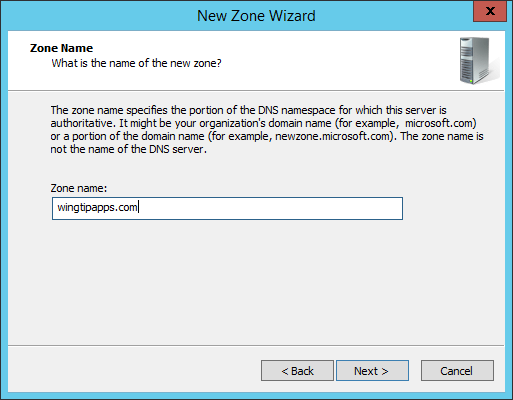

7. On the Dynamic Update page, click Next.
8. On the Completing the New Zone Wizard page, click Finish.

### Create the wildcard Alias (CNAME) record for the app domain:
1. In DNS Manager, expand the Forward Lookup Zones node. Right-click the domain **wingtipapps.com** and click New Alias (CNAME).
2. In the New Resource Record dialog box, in the Alias name (uses parent domain if left blank) box, type *. The Fully qualified domain name (FQDN) box will display *.wingtipapps.com.
3. Next to the Fully qualified domain name (FQDN) for target host box, type **wingtipserver.wingtip.com**.
4. Click OK.
 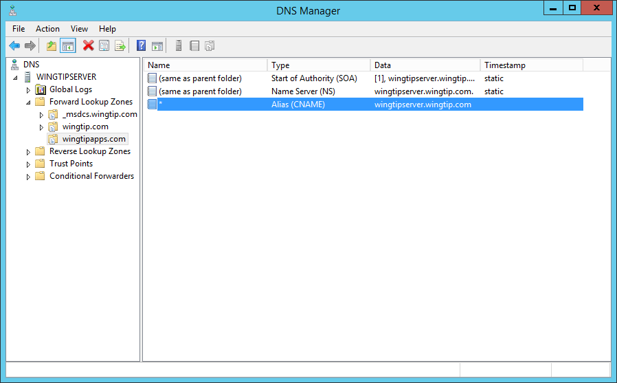

## Exercise 2: Configure SharePoint Service Applications
1. Launch SharePoint Central Administration
2. In SharePoint Central Administration, in the **Application Management** group, click **Manage service applications**.
3. Look for a service application with the type **App Management Service Application**. If the application is found, proceed to step 9.
4. If no service application with the type of **App Management Service Application** is found, click on the **New** button in the SharePoint ribbon.
 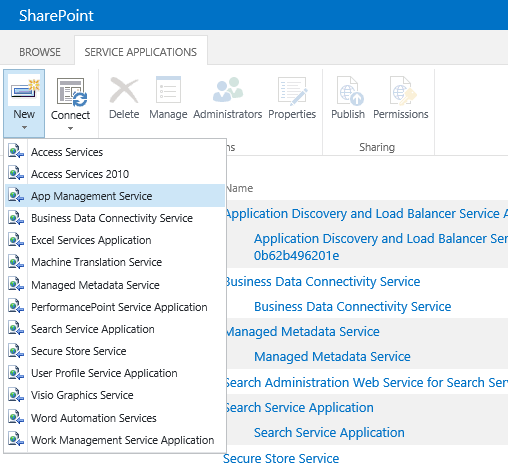
5. Choose App Management Service.
6. In the Service Application Name box enter **App Management Service**.
7. In the Application Pool section, choose **Use existing app pool** and select **SharePoint Web Services Default**.
8. Click OK.
9. Look for a service application with the type **Microsoft SharePoint Foundation Subscription Settings Service Application**. If the application is found, proceed to Step 13.
10. If no service application with the type **Microsoft SharePoint Foundation Subscription Settings Service Application** is found, Launch the **SharePoint 2013 Management Studio**
11. In **SharePoint 2013 Management Studio**, enter the following commands:
	
		$subscriptionSettingsServiceApplication = New-SPSubscriptionSettingsServiceApplication -ApplicationPool (Get-SPServiceApplicationPool "SharePoint Web Services Default") -Name "Site Subscription Settings Service Application" -DatabaseName "Sharepoint_SiteSubscriptionSettingsServiceDB" 
		New-SPSubscriptionSettingsServiceApplicationProxy -ServiceApplication $subscriptionSettingsServiceApplication

12. Review the Service Applications page to ensure both Service Applications have been created.
 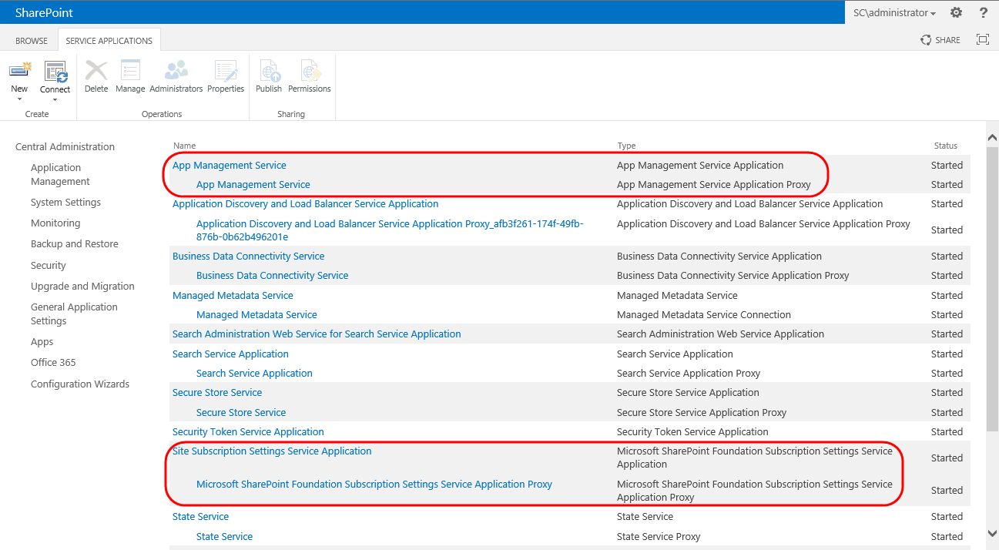
13. Ensure that the services are started. Launch **SharePoint 2013 Management Studio** and enter the following command:
 
		Get-SPServiceInstance | where{$_.GetType().Name -eq "AppManagementServiceInstance" -or $_.GetType().Name -eq "SPSubscriptionSettingsServiceInstance"} | Start-SPServiceInstance

14. In **SharePoint 2013 Management Studio**, enter the following commands to configure the URL for apps:

		Set-SPAppDomain wingtipapps.com
		Set-SPAppSiteSubscriptionName -Name "app" -Confirm:$false

## Exercise 3: Verify SharePoint-hosted Apps Configuration

*Developing Apps for SharePoint requires a Developer Site. If necessary, create a site collection using the Developer Site template.*
1. Using the browser, navigate to your on-premises developer site.
2. On your developer workstation, launch Visual Studio as administrator.
3. Create a new project in Visual Studio 2013 by selecting the menu command **File > New > Project**.
4. In the **New Project** dialog, find the **App for SharePoint 2013** project template under the **Templates > Visual C# >   Office / SharePoint > Apps** section. Enter a name of **Test SharePoint-Hosted app**, a location of **C:\DevProjects** and a Solution name of **Test SharePoint-Hosted app** and then click **OK** button.
 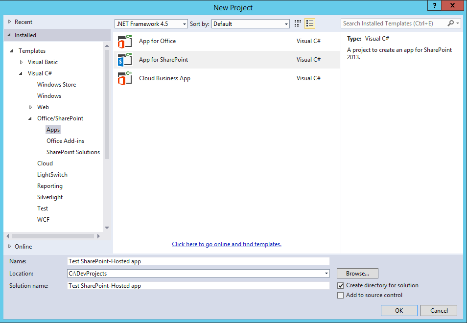

5. In the **New app for SharePoint** wizard, enter the URL for your on-premises Developer site and select **SharePoint-hosted** for the app hosting model. When done, complete the wizard by clicking the **Finish** button.
 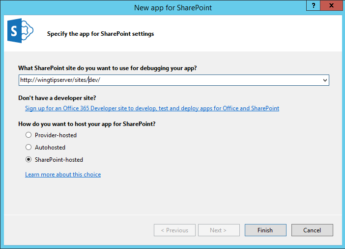
6.	Build and Test the Project by pressing **[F5]** or **Debug > Start Debugging**.
7.	The installation process for an app will take a moment to complete. If you watch the lower-left corner of Visual Studio, it will tell you what it is currently doing. If you want more information, click the Output tab at the bottom of Visual Studio to see a log of what is going on. If the Output tab isn’t present, select the window from the menu in Visual Studio 2013 using the menu command **View > Output**.
16.	Once the app has been installed, Internet Explorer will launch and navigate to the app’s start page **default.aspx** page.
 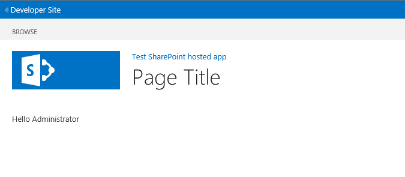
1. You have completed the configuration for SharePoint-hosted Apps.

## Exercise 4: Configure SharePoint for High-Trust Apps
*A high-trust app is a provider-hosted app for SharePoint that uses the digital certificates to establish trust between the remote web application and SharePoint. In this exercise, you will create that digital certificate and configure SharePoint to trust it for use in apps.*

1. In a text editor or Windows PowerShell editor, start a new file and add the following lines to it to create a certificate:

		$makecert = "C:\Program Files\Microsoft Office Servers\15.0\Tools\makecert.exe"
		$certmgr = "C:\Program Files\Microsoft Office Servers\15.0\Tools\certmgr.exe"

		# specify domain name for SSL certificate
		$domain = "wingtipapps.com"

		# create output directory to create SSL certificate file
		$outputDirectory = "c:\Certs\"
		New-Item $outputDirectory -ItemType Directory -Force -Confirm:$false | Out-Null

		# create file name for SSL certificate files
		$publicCertificatePath  =  $outputDirectory + $domain + ".cer"
		$privateCertificatePath = $outputDirectory + $domain + ".pfx"

		Write-Host 
		Write-Host "Creating .cer certificate file..."
		& $makecert -r -pe -n "CN=$domain" -b 01/01/2012 -e 01/01/2022 -eku 1.3.6.1.5.5.7.3.1 -ss my -sr localMachine -sky exchange -sp "Microsoft RSA SChannel Cryptographic Provider" -sy 12 $publicCertificatePath
	
		Write-Host 
		Write-Host "Registering certificate with IIS..."
		& $certmgr /add $publicCertificatePath /s /r localMachine root

		# get certificate to obtain thumbprint
		$publicCertificate = Get-PfxCertificate -FilePath $publicCertificatePath
		$publicCertificateThumbprint = $publicCertificate.Thumbprint

		Get-ChildItem cert:\\localmachine\my | Where-Object {$_.Thumbprint -eq $publicCertificateThumbprint} | ForEach-Object {
			Write-Host "  .. exporting private key for certificate (*.PFK)" -ForegroundColor Gray 
			$privateCertificateByteArray = $_.Export("PFX", "Password1")
			[System.IO.File]::WriteAllBytes($privateCertificatePath, $privateCertificateByteArray)
			Write-Host "  Certificate exported" -ForegroundColor Gray 
		}  

2. Save the file with the name CreateCertificateForAppHostServer.ps1.
3. Open **SharePoint 2013 Management Shell** as an administrators and run the file with the following line:

		./CreateCertificateForAppHostServer.ps1

4. In a text editor or Windows PowerShell editor, start a new file and add the following lines to it to create a certificate:

		$issuerID = "11111111-1111-1111-1111-111111111111"
		$realm = Get-SPAuthenticationRealm

		$registeredIssuerName = $issuerID + '@' + $realm

		Write-Host $registeredIssuerName 

		$publicCertificatePath = "C:\Certs\wingtipapps.com.cer"
		$publicCertificate = Get-PfxCertificate $publicCertificatePath

		Write-Host "Create token issuer"
		$secureTokenIssuer = New-SPTrustedSecurityTokenIssuer `
		                     -Name $issuerID `
		                     -RegisteredIssuerName $registeredIssuerName `
		                     -Certificate $publicCertificate `
		                     -IsTrustBroker

		$secureTokenIssuer  | select * | Out-File -FilePath "SecureTokenIssuer.txt"

		$serviceConfig = Get-SPSecurityTokenServiceConfig
		$serviceConfig.AllowOAuthOverHttp = $true
		$serviceConfig.Update()

		Write-Host "All done..."

2. Save the file with the name CreateTokenIssuer.ps1.
3. Open **SharePoint 2013 Management Shell** as an administrators and run the file with the following line:

		./CreateTokenIssuer.ps1

7. The script will save information about the SPTrustedSecurityTokenIssuer to a file named SecureTokenIssuer.txt. You may need this information for future reference.

## Exercise 5: Verify High-Trust configuration
1. Using the browser, navigate to your on-premises developer site.
2. On your developer workstation, launch Visual Studio as administrator.
3. Create a new project in Visual Studio 2013 by selecting the menu command **File > New > Project**.
4. In the **New Project** dialog, find the **App for SharePoint 2013** project template under the **Templates > Visual C# >   Office / SharePoint > Apps** section. Enter a name of **Test High-Trust App**, a location of **C:\DevProjects** and a Solution name of **Test High-Trust App** and then click **OK** button.
 

5.	Next, you will see the **New app for SharePoint wizard** which begins by prompting you with the **Specify the App for SharePoint Settings** page. Enter the URL to your on-premises developer site, configure the app's hosting model to be **Provider-hosted** and click **Next**.
  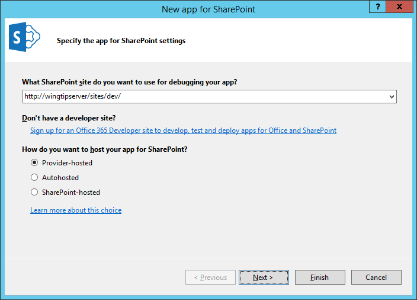

6. On the **Specify the web project type** page, select the **ASP.NET Web Forms Application** setting and click **Next**.
  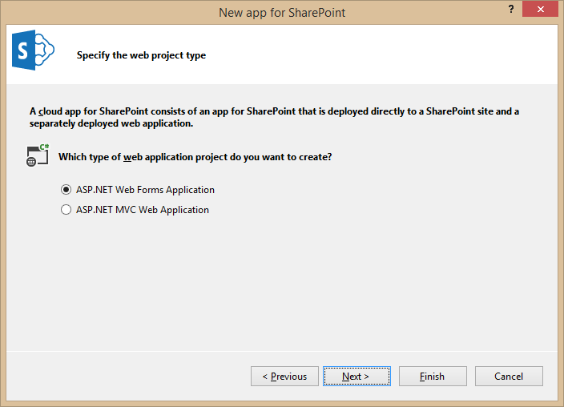

7.	On the **Configure authentication settings** page, complete the form as follows:

	* How do you want your app to authenticate: **Use a certificate**

	* Certificate location:**C:\Certs\wingtipapps.com.pfx** 

	* Password: **Password1**

	* Issuer ID: **11111111-1111-1111-1111-111111111111**

	Click **Finish**.
  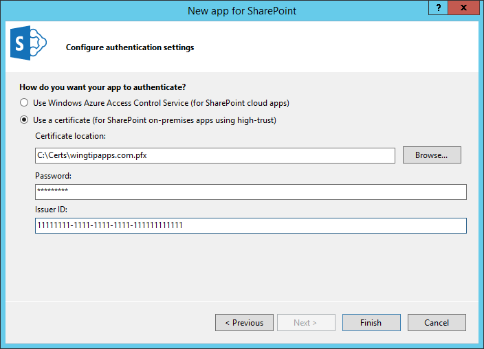

8.	Build and Test the Project by pressing **[F5]** or **Debug > Start Debugging**.
9.	The installation process for an app will take a moment to complete. If you watch the lower-left corner of Visual Studio, it will tell you what it is currently doing. If you want more information, click the Output tab at the bottom of Visual Studio to see a log of what is going on. If the Output tab isn’t present, select the window from the menu in Visual Studio 2013 using the menu command **View > Output**.
10.	Once the app has been installed, Visual Studio will display a Security Alert. Click **Yes** to trust the self-signed certificate on the machine and unblock the app for debugging.
 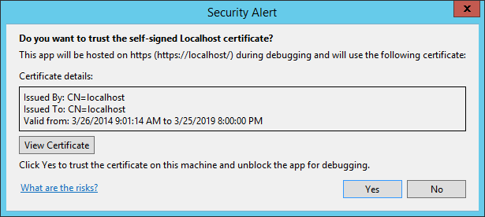
11.	Windows will display a Security Alert as Visual Studio installs the self-signed certificate. Click **Yes**
 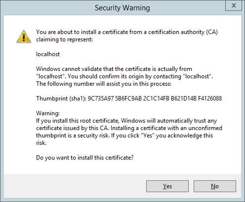
12.	Internet Explorer will launch and navigate to the app’s start page **default.aspx** page. You may be prompted to trust the app. If so, click **Trust it**
 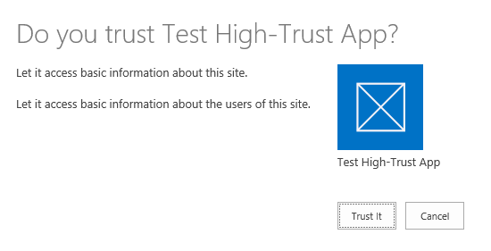
13. The app home page will display, which simply displays the name of the developer site.
 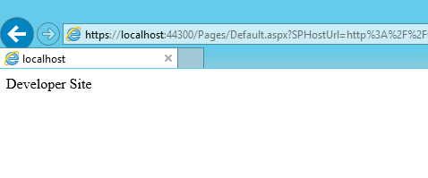
14. You have completed the configuration for High-trust, provider-hosted Apps.

## Exercise 6: Connect on-premises farm with Windows Azure Access Control Service (ACS)
> Prerequisites: Before starting this exercise, ensure that you have met the following prerequisites:

> * An Office 365 SharePoint site. If don’t have one yet and you want to set up a development environment quickly, you can [Sign up for an Office 365 Developer Site](http://msdn.microsoft.com/en-us/library/fp179924.aspx).
> * The 64-bit edition of [Microsoft Online Services Sign-In Assistant](http://www.microsoft.com/en-us/download/details.aspx?id=41950) installed on the computer where you installed SharePoint 2013.
> * [Microsoft Online Services Module for Windows Powershell (64-bit)](http://go.microsoft.com/fwlink/p/?linkid=236297) installed on the computer where you installed SharePoint 2013.

1. In a text editor or Windows PowerShell editor, start a new file and add the following lines to it to create a Powershell module:

		function Connect-SPFarmToAAD {
		param(
		    [Parameter(Mandatory)][String]   $AADDomain,
		    [Parameter(Mandatory)][String]   $SharePointOnlineUrl,
		    #Specify this parameter if you don’t want to use the default SPWeb returned
		    [Parameter()][String]            $SharePointWeb,
		    [Parameter()][System.Management.Automation.PSCredential] $O365Credentials,
		    #Use these switches if you’re replacing an existing connection to AAD.
		    [Parameter()][Switch]            $RemoveExistingACS,
		    [Parameter()][Switch]            $RemoveExistingSTS,
		    [Parameter()][Switch]            $RemoveExistingSPOProxy,
		    #Use this switch if you’re replacing the Office 365 SharePoint site.
		    [Parameter()][Switch]            $RemoveExistingAADCredentials,
		    #Use this switch if you don’t want to use SSL when you launch your app.
		    [Parameter()][Switch]            $AllowOverHttp
		)
		    #Prompt for credentials right away.
		    if (-not $O365Credentials) {
		        $O365Credentials = Get-Credential -Message "Admin credentials for $AADDomain"
		    }
			Add-PSSnapin Microsoft.SharePoint.PowerShell
			#Import the Microsoft Online Services Sign-In Assistant.
			Import-Module -Name MSOnline
			#Import the Microsoft Online Services Module for Windows Powershell.
			Import-Module MSOnlineExtended –force -verbose 
			#Set values for Constants.
			New-Variable -Option Constant -Name SP_APPPRINCIPALID -Value '00000003-0000-0ff1-ce00-000000000000' | Out-Null
			New-Variable -Option Constant -Name ACS_APPPRINCIPALID -Value '00000001-0000-0000-c000-000000000000' | Out-Null
			New-Variable -Option Constant -Name ACS_APPPROXY_NAME -Value ACS
			New-Variable -Option Constant -Name SPO_MANAGEMENT_APPPROXY_NAME -Value 'SPO App Management Proxy'
			New-Variable -Option Constant -Name ACS_STS_NAME -Value ACS-STS
			New-Variable -Option Constant -Name AAD_METADATAEP_FSTRING -Value 'https://accounts.accesscontrol.windows.net/{0}/metadata/json/1'
			New-Variable -Option Constant -Name SP_METADATAEP_FSTRING -Value '{0}/_layouts/15/metadata/json/1'
			#Get the default SPWeb from the on-premises farm if no $SharePointWeb parameter is specified.
			if ([String]::IsNullOrEmpty($SharePointWeb)) {
			    $SharePointWeb = Get-SPSite | Select-Object -First 1 | Get-SPWeb | Select-Object -First 1 | % Url
			}
			#Configure the realm ID for local farm so that it matches the AAD realm.
			$ACSMetadataEndpoint = $AAD_METADATAEP_FSTRING -f $AADDomain
			$ACSMetadata = Invoke-RestMethod -Uri $ACSMetadataEndpoint
			$AADRealmId = $ACSMetadata.realm
			Set-SPAuthenticationRealm -ServiceContext $SharePointWeb -Realm $AADRealmId
	    
			$LocalSTS = Get-SPSecurityTokenServiceConfig
			$LocalSTS.NameIdentifier = '{0}@{1}' -f $SP_APPPRINCIPALID,$AADRealmId
			$LocalSTS.Update()
			#Allow connections over HTTP if the switch is specified.
			if ($AllowOverHttp.IsPresent -and $AllowOverHttp -eq $True) {
			    $serviceConfig = Get-SPSecurityTokenServiceConfig
			    $serviceConfig.AllowOAuthOverHttp = $true
			    $serviceConfig.AllowMetadataOverHttp = $true
			    $serviceConfig.Update()
			}
			#Step 1: Set up the ACS proxy in the on-premises SharePoint farm. Remove the existing ACS proxy
			#if the switch is specified.
			if ($RemoveExistingACS.IsPresent -and $RemoveExistingACS -eq $True) {
			    Get-SPServiceApplicationProxy | ? DisplayName -EQ $ACS_APPPROXY_NAME | Remove-SPServiceApplicationProxy -RemoveData -Confirm:$false
			}
			if (-not (Get-SPServiceApplicationProxy | ? DisplayName -EQ $ACS_APPPROXY_NAME)) {
			    $AzureACSProxy = New-SPAzureAccessControlServiceApplicationProxy -Name $ACS_APPPROXY_NAME -MetadataServiceEndpointUri $ACSMetadataEndpoint -DefaultProxyGroup
			}
			#Remove the existing security token service if the switch is specified.
			if ($RemoveExistingSTS.IsPresent) {
			    Get-SPTrustedSecurityTokenIssuer | ? Name -EQ $ACS_STS_NAME | Remove-SPTrustedSecurityTokenIssuer -Confirm:$false
			}
			if (-not (Get-SPTrustedSecurityTokenIssuer | ? DisplayName -EQ $ACS_STS_NAME)) {
			    $AzureACSSTS = New-SPTrustedSecurityTokenIssuer -Name $ACS_STS_NAME -IsTrustBroker -MetadataEndPoint $ACSMetadataEndpoint
			}
			#Update the ACS Proxy for OAuth authentication.
			$ACSProxy = Get-SPServiceApplicationProxy | ? Name -EQ $ACS_APPPROXY_NAME
			$ACSProxy.DiscoveryConfiguration.SecurityTokenServiceName = $ACS_APPPRINCIPALID
			$ACSProxy.Update()
			#Retrieve the local STS signing key from JSON metadata.
			$SPMetadata = Invoke-RestMethod -Uri ($SP_METADATAEP_FSTRING -f $SharePointWeb)
			$SPSigningKey = $SPMetadata.keys | ? usage -EQ "Signing" | % keyValue
			$CertValue = $SPSigningKey.value
			    
			#Connect to Office 365.
			Connect-MsolService -Credential $O365Credentials
			#Remove existing connection to an Office 365 SharePoint site if the switch is specified.
			if ($RemoveExistingAADCredentials.IsPresent -and $RemoveExistingAADCredentials -eq $true) {
			    $msolserviceprincipal = Get-MsolServicePrincipal -AppPrincipalId $SP_APPPRINCIPALID
			    [Guid[]] $ExistingKeyIds = Get-MsolServicePrincipalCredential -ObjectId $msolserviceprincipal.ObjectId -ReturnKeyValues $false | % {if ($_.Type -ne "Other") {$_.KeyId}}
			    Remove-MsolServicePrincipalCredential -AppPrincipalId $SP_APPPRINCIPALID -KeyIds $ExistingKeyIds
			}
			#Step 2: Upload the local STS signing certificate
			New-MsolServicePrincipalCredential -AppPrincipalId $SP_APPPRINCIPALID -Type Asymmetric -Value $CertValue -Usage Verify
			#Step 3: Add the service principal name of the local web application, if necessary.
			$indexHostName = $SharePointWeb.IndexOf('://') + 3
			$HostName = $SharePointWeb.Substring($indexHostName)
			$NewSPN = '{0}/{1}' -f $SP_APPPRINCIPALID, $HostName
			$SPAppPrincipal = Get-MsolServicePrincipal -AppPrincipalId $SP_APPPRINCIPALID
			if ($SPAppPrincipal.ServicePrincipalNames -notcontains $NewSPN) {
			    $SPAppPrincipal.ServicePrincipalNames.Add($NewSPN)
			    Set-MsolServicePrincipal -AppPrincipalId $SPAppPrincipal.AppPrincipalId -ServicePrincipalNames $SPAppPrincipal.ServicePrincipalNames
			}
			#Remove the existing SharePoint Online proxy if the switch is specified.
			if ($RemoveExistingSPOProxy.IsPresent -and $RemoveExistingSPOProxy -eq $True) {
			    Get-SPServiceApplicationProxy | ? DisplayName -EQ $SPO_MANAGEMENT_APPPROXY_NAME | Remove-SPServiceApplicationProxy -RemoveData -Confirm:$false
			}
			#Step 4: Add the SharePoint Online proxy
			if (-not (Get-SPServiceApplicationProxy | ? DisplayName -EQ $SPO_MANAGEMENT_APPPROXY_NAME)) {
			    $spoproxy = New-SPOnlineApplicationPrincipalManagementServiceApplicationProxy -Name $SPO_MANAGEMENT_APPPROXY_NAME -OnlineTenantUri $SharePointOnlineUrl -DefaultProxyGroup
			}  
		}

2. Save the file with the name **SP-ACS.psm1** in the folder **C:\Windows\System32\WindowsPowerShell\v1.0\Modules\SP-ACS**. If you do not have permission to that location, the file can be saved in the alternative location of **C:\users\username\documents\windowspowershell\modules\SP-ACS**, where username is the farm administrator who will be performing the connection to ACS. 

	*The file has to be saved as ANSI format, not UTF-8. PowerShell may give syntax errors when it loads a file with a non-ANSI format. Windows Notepad and PowerShell Editor will default to saving it as ANSI.*

3. Open **SharePoint 2013 Management Shell** as Administrator.
4. Run the following command:

		Connect-SPFarmToAAD -AADDomain wtofficedevtraining.onmicrosoft.com -SharePointOnlineUrl https://wtofficedevtraining.sharepoint.com -SharePointWeb http://wingtipserver -AllowOverHttp
	
	**Note:** The URL specified for the -AADDomain parameter should match the Office 365 site mentioned in the prerequisites and the URL specified for the -SharePointWeb parameter must be the URL of the on-premises SharePoint web application in which you will be installing apps.

5. The script will prompt for the administrator credentials of the Office 365 Site. Enter the user account with the *.onmicrosoft.com domain.
 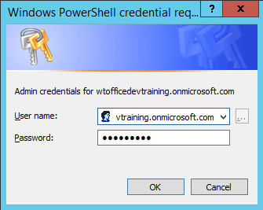

6. The script will configure Office 365 and Azure ACS to issue app authentication tokens and will configure the on-premises farm to accept tokens issued by ACS.

## Exercise 7: Verify Azure ACS-authenticated Apps

1. Using the browser, navigate to your on-premises developer site.
2. On your developer workstation, launch Visual Studio as administrator.
3. Create a new project in Visual Studio 2013 by selecting the menu command **File > New > Project**.
4. In the **New Project** dialog, find the **App for SharePoint 2013** project template under the **Templates > Visual C# >   Office / SharePoint > Apps** section. Enter a name of **Test ACS Auth App**, a location of **C:\DevProjects** and a Solution name of **Test ACS Auth App** and then click **OK** button.
 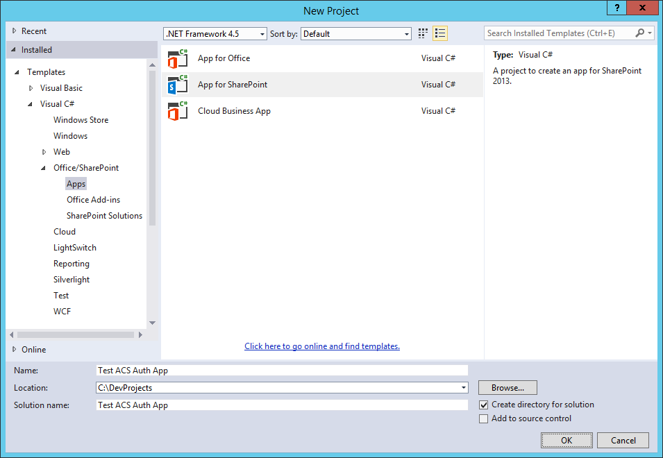

5.	Next, you will see the **New app for SharePoint wizard** which begins by prompting you with the **Specify the App for SharePoint Settings** page. Enter the URL to your on-premises developer site, configure the app's hosting model to be **Provider-hosted** and click **Next**.
  

6. On the **Specify the web project type** page, select the **ASP.NET Web Forms Application** setting and click **Next**.
  

7.	On the **Configure authentication settings** page, accept the default settings and click **Finish**.
  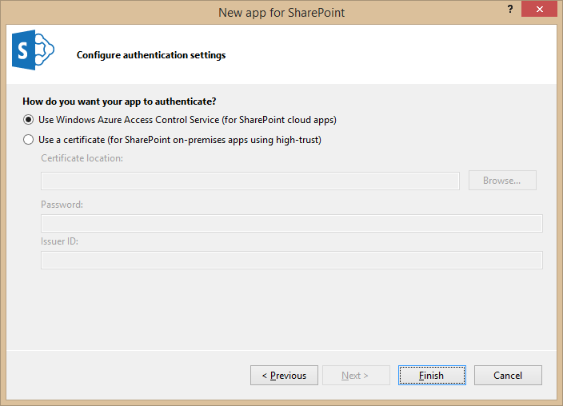

8.	Build and Test the Project by pressing **[F5]** or **Debug > Start Debugging**.
9.	The installation process for an app will take a moment to complete. If you watch the lower-left corner of Visual Studio, it will tell you what it is currently doing. If you want more information, click the Output tab at the bottom of Visual Studio to see a log of what is going on. If the Output tab isn’t present, select the window from the menu in Visual Studio 2013 using the menu command **View > Output**.
10.	Once the app has been installed, Visual Studio may display a Security Alert. Click **Yes** to trust the self-signed certificate on the machine and unblock the app for debugging. 
 
11.	Windows may display a Security Alert if Visual Studio installs the self-signed certificate. Click **Yes**
 
12.	Internet Explorer will launch and navigate to the app’s start page **default.aspx** page. You may be prompted to trust the app. If so, click **Trust it**
 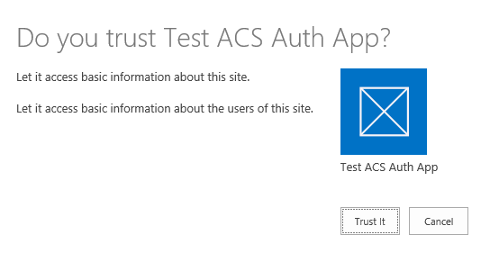
13. The app home page will display, which simply displays the name of the developer site.
 
14. You have completed the configuration for connecting an on-premises farm to ACS.
