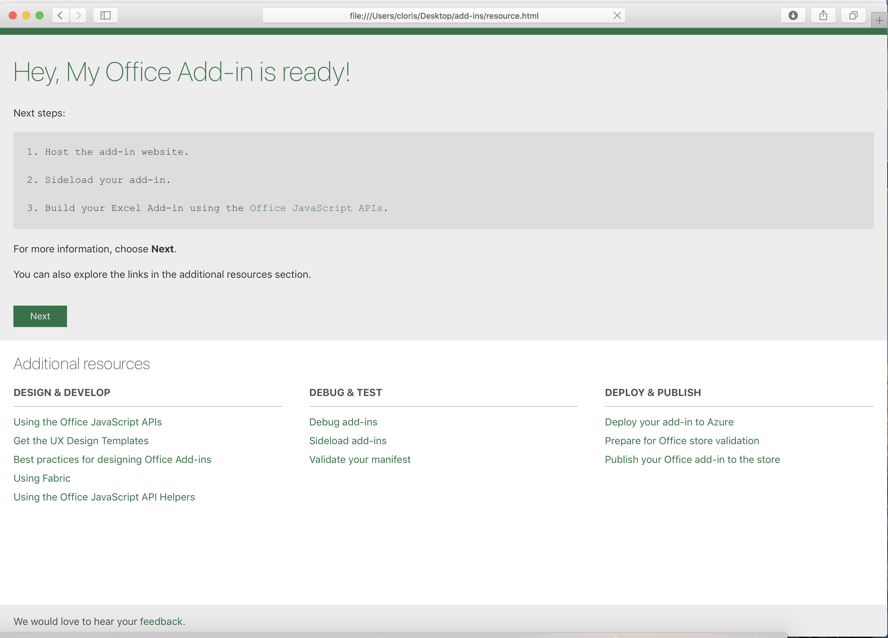
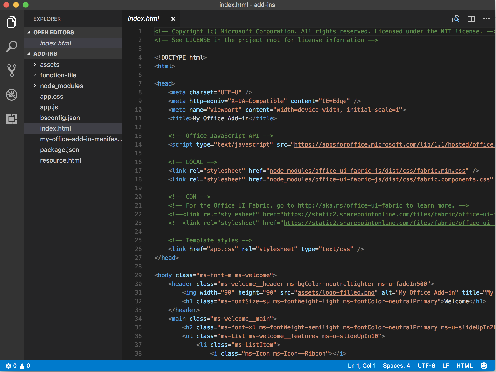
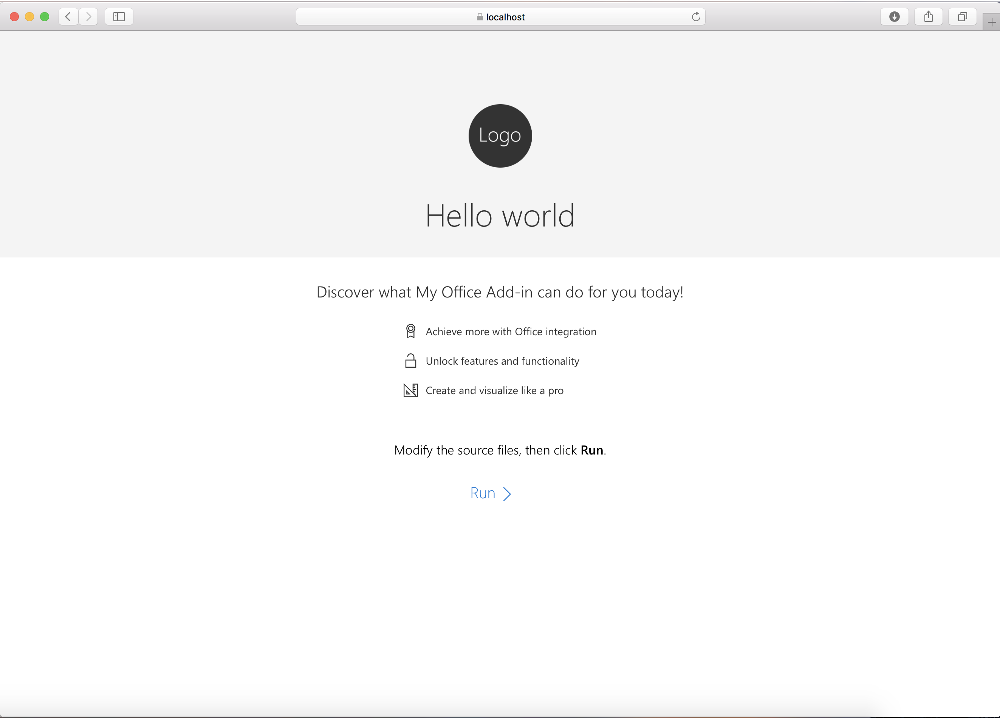
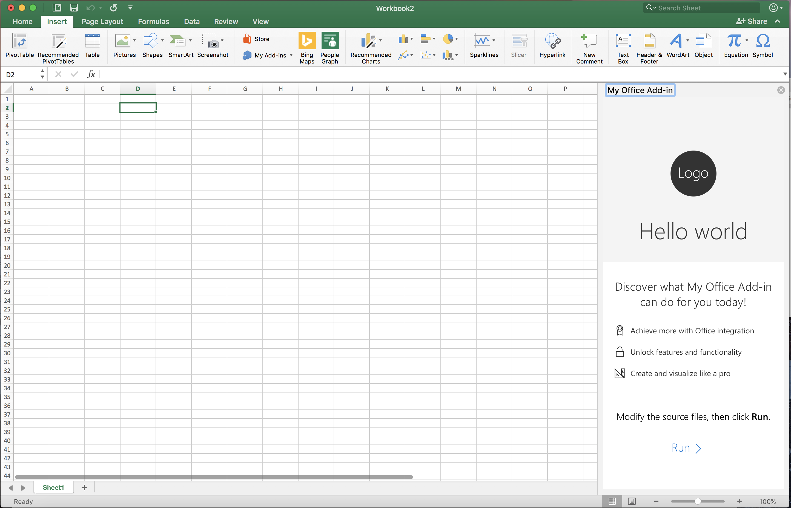
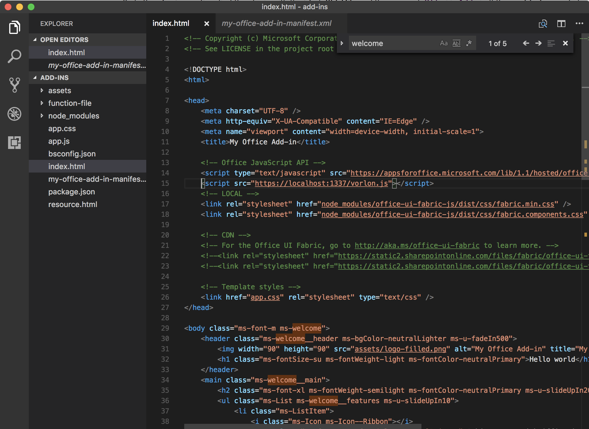
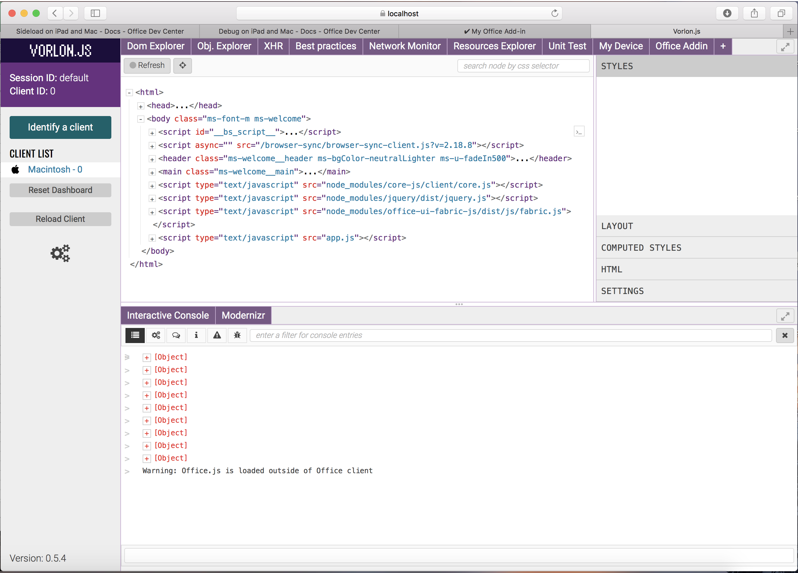
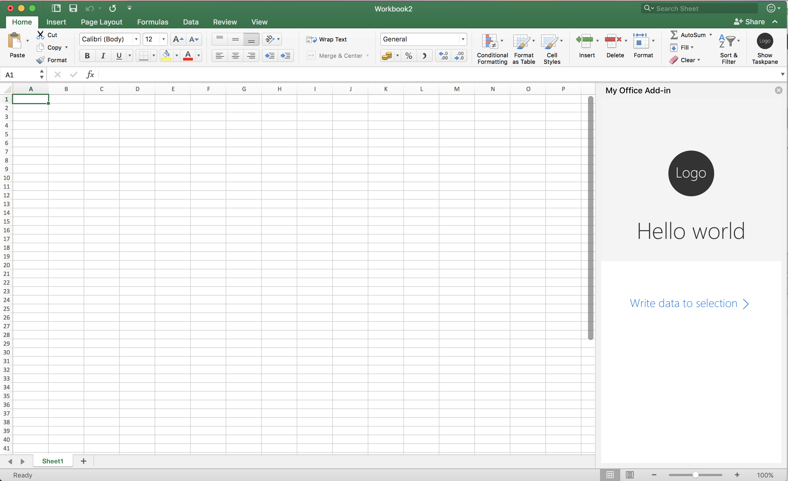
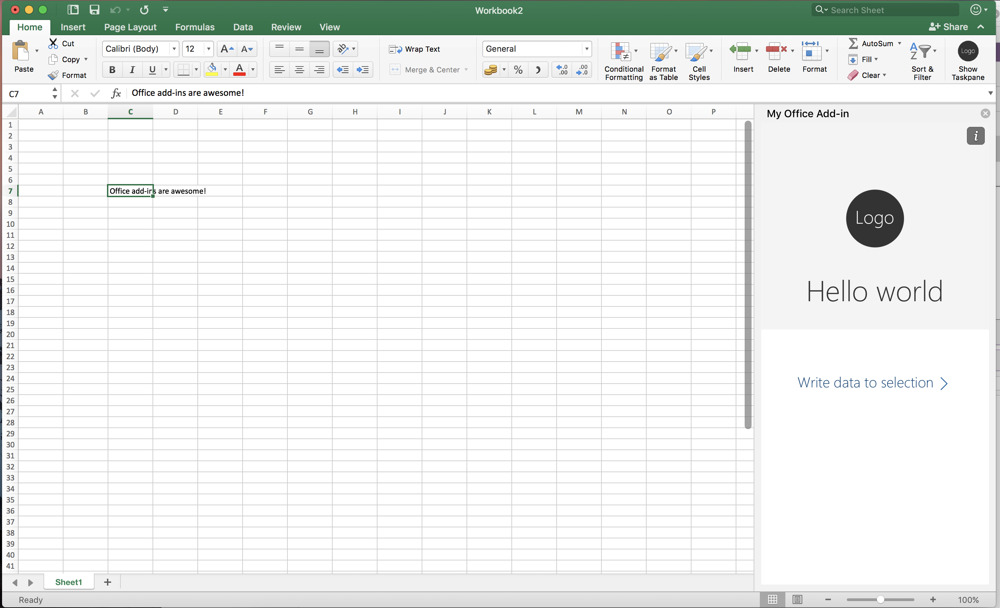
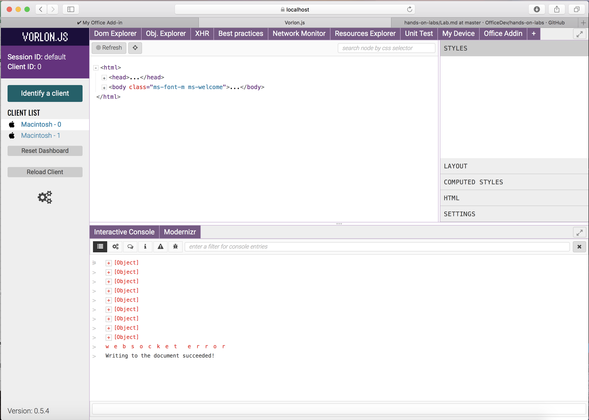

# Create, test, and debug your add-in on a Mac or iPad
In this lab, you will learn how to create a sample add-in on the Mac and then sideload it to test/validate using Excel on the Mac. You will also get hands-on experience debugging your add-in on the Mac using Vorlon.js.

**Prerequisites**
The following prerequisites have already been installed on Mac you are currently working on:
1. You must have node.js and VS Code [or your favorite code editor] installed on your Mac.
2. You must also have the latest versions of Office for Mac installed.

## Exercise 1: Create an add-in using Yeoman generator
*In this exercise, you will create a sample Hello World add-in using the Yeoman generator directly on your Mac.*

1. Create a folder for your add-in project in the **~/Desktop/add-ins** folder and go to that folder in the command prompt/terminal. 
2. Install yo (Yeoman) and generator-office globally using NPM if you have not installed.
	```cmd
	$ npm install -g yo generator-office
	```

3. Run the Yeoman generator for Office Add-ins to create the project scaffolding. Use the following command: 
	```cmd
	yo office
	```

4. When prompted, supply the following information:
   * Would you like to create a new subfolder for your project? (y/N) - **N**
   * What do you want to name your add-in? (My Office Add-in) - use default name
   * Which Office client application would you like to support? (Use arrow keys) - **Excel**
   * Would you like to create a new add-in? (Use arrow keys) - **yes**
   * Would you like to use TypeScript? (Y/n) - **n**
   * Choose a framework: (Use arrow keys)`,select **Jquery**
   * Would you like to open it now while we finish creating your project? (Y/n) - **y**

5. When all done, you can find the following screen shot.
	

6. Optionally, you can edit the code using your favorite code editor. We recommend VS Code, which includes IntelliSense support when you run the tsd install command from your project folder.
7. Use VS code open add-in code.
    

8. Open **index.html**, find **h1** in **header** content is **Welcome**, use **Hello world** instead of **Welcome**
9. You can host your add-in locally or use any web server. Make sure that the add-in is served using HTTPS and also update the add-in’s source location in the manifest. To help you get started, we have included browser-sync for your convenience. To learn more about it, see [browsersync.io](https://www.browsersync.io).  Run the following command to install browsersync.
    ```cmd
	$ npm install -g browser-sync
	```

10. Launch the local HTTPS site on **https://localhost:3000** by simply typing the following command in the command prompt/terminal:
    ```cmd
	$ npm start
	```
8. You will find **Helloworld** add-in look like as following screen shot.
    

## Exercise 2: Sideload an add-in into Excel for Mac
*In this exercise, we'll go through the process of sideloading an add-in on Excel for Mac.*

1. Open Terminal [shortcut on the desktop] and type
	```cmd
	cd ~/Library/Containers/com.microsoft.Excel/Data/Documents/wef
	```

2. You might have to create the **wef** folder if it doesn't already exist.
3. Type `open .` to open Finder
4. Copy the `my-office-add-in-manifest.xml` file from the root of the sample project folder to this folder.
5. Launch Excel.
6. Go to the Insert tab and click on the My Add-ins drop-down. Click on the **My Office Add-in** to open it Excel.
    

## Exercise 3: Debug HelloWorld add-in using VorlonJS
*In this exercise, we'll use Vorlon.js to debug your add-in on the Mac.*

1. Please reference the following link to install and set up up Vorlon.JS on a Mac and configure Vorlon.JS to use HTTPS
	> [Debug Office Add-ins on iPad and Mac](https://dev.office.com/docs/add-ins/testing/debug-office-add-ins-on-ipad-and-mac) 

2. Go to **~/Desktop/add-ins** folder that we created on above **Exercise 1**. 
3. Type `sudo vorlon` in Terminal to start the VorlonJS server.
4. To verify that Vorlon server is up and running, type `https://localhost:1337` in a browser. You should see the VorlonJS start page.
5. Open `index.html` of add-in. 
6. Add the following script tag to the <head> section:
	```script
	<script src="https://localhost:1337/vorlon.js"></script> 
	```
    

7. Launch Excel and **reload** your add-in.
8. You should now see the client connection on the Vorlon server page at `https://localhost:1337`.
9. Click on the client connect link to view the Vorlon debugger UI. You can now use the Dom Explorer and Obj. Explorer tabs to view/edit the source code on your add-in.
    

**Optional**
Install the office.js plug-in for Vorlon and use it to test Office APIs from this blog post: http://blogs.msdn.com/b/mim/archive/2016/02/18/vorlonjs-plugin-for-debugging-office-addin.aspx

## Exercise 4: Edit the add-in code

An Office Add-in is just a web app that is displayed within the Office UI and can interact with Office content using Office.js APIs. In this exercise, you'll edit the HTML and JavaScript of the add-in to get a sense for the entire lifecycle of an add-in project.

1. Launch VS Code.
2. Open the index.html file found in **~/Desktop/add-ins/**. 
3. Use the following html instead of **main** tag content:
	```
	<main class="ms-welcome__main">
	    <button id="write-data-to-selection" class="ms-welcome__action ms-Button ms-Button--hero ms-u-slideUpIn20">
	        <span class="ms-Button-label">Write data to selection</span>
	        <span class="ms-Button-icon"><i class="ms-Icon ms-Icon--ChevronRight"></i></span>
	    </button>
	     <br />
	</main>
	```

4. Save the index.html file.
5. Open the app.js file from the same folder.
6. **Remove** all script and **add** the following script:
 	```js
	'use strict';
	(function () {
	  // The initialize function must be run each time a new page is loaded
	  Office.initialize = function (reason) {
	    $(document).ready(function () {
	      $('#write-data-to-selection').click(writeDataToSelection);
	    });
	  };
	  function writeDataToSelection(){
	     Office.context.document.setSelectedDataAsync("Office add-ins are awesome!",
	      function(result){
	        if (result.status === Office.AsyncResultStatus.Succeeded) {
	          console.log("Writing to the document succeeded!");
	        } else {
	          console.log("Writing to the document failed: " + result.error.message);
	        }
	      }
	    );
	 }
	})();
 	```
 
7. Save the **app.js** file. 

8. Go back to Excel, click on the "i" in the top right corner of the add-in pane and then select "Reload". You should see the new button in your add-in.
	

9. Select an empty cell in the worksheet and click the new button that says "Write data to selection". You should see "Office add-ins are awesome!" written to the cell.
	

10. Console.log statements above should be visible in the VorlonJS console.
    

You have now completed building and debugging a new add-in entirely on the Mac. This Office add-in will run on all platform where Office supports add-ins.

