# Demo SimpleBindingDemo

1. Open SimpleBindingDemo solution using Visual Studio 2015
2. Select SimpleBindingDemo project. Set **Start Document** value to **TestDoc.xlsx**.

    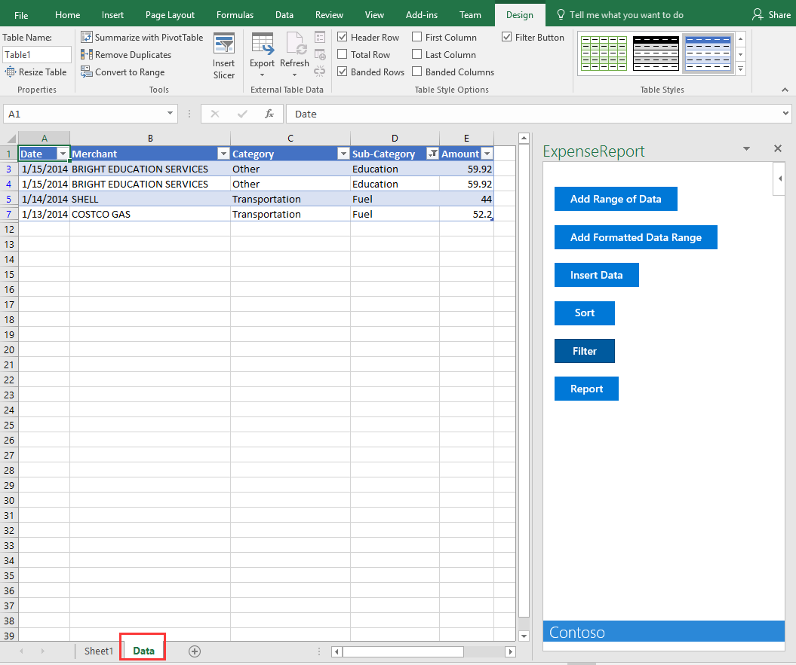

3. Press the **{F5}** key to run the project. The debugger should launch **TestDoc.xlsx** and you should see your Office Add-in in the task pane on the right side of Excel document.

    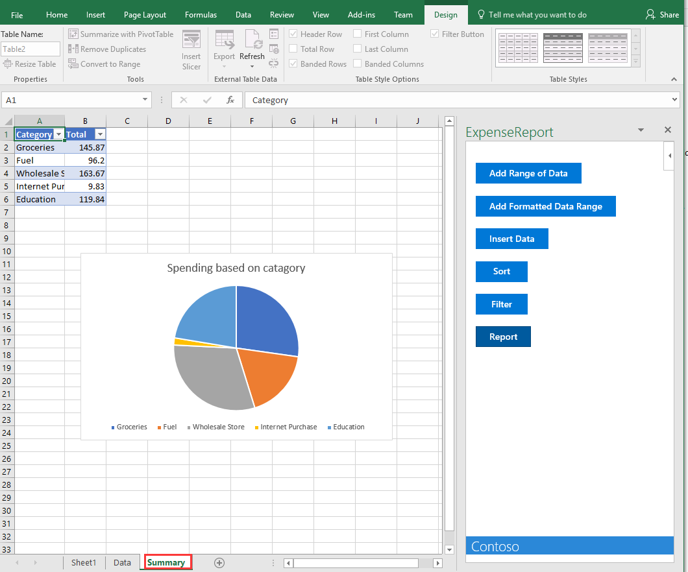

4. **Close** Add-in Panel.

    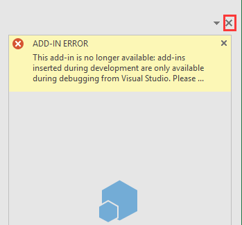

5. Click **Insert > Add-ins >My Add-ins**, select the **SimpleBindingDemo** Add-In.

    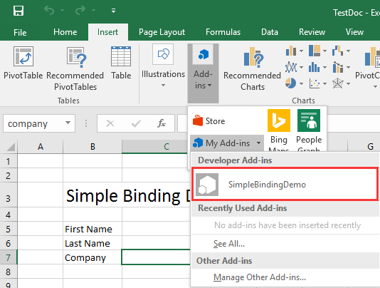

6. You can find **SimpleBindingDemo** Add-In as shown in the following screenshot.

    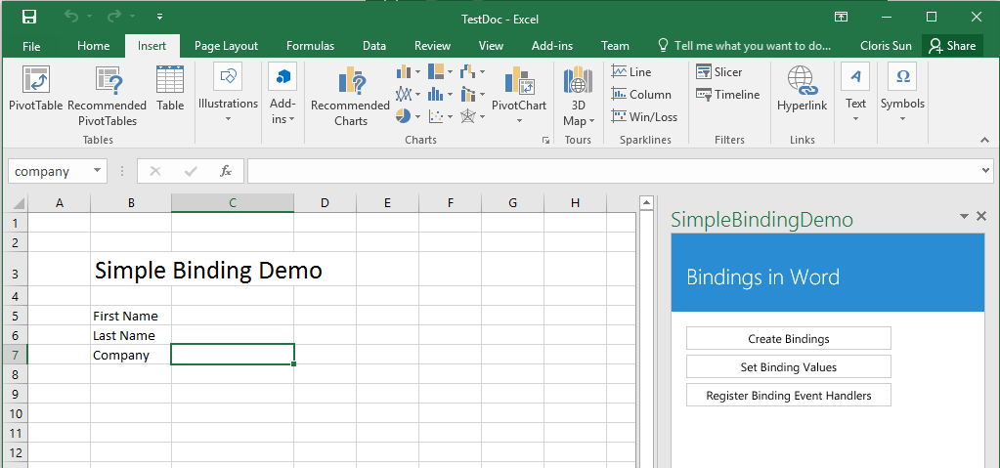

7. After click **Create Bindings** button, binding that id equal **firstName**, binding that id equal **lastName**, and binding that id equal **company** is created

9. After click **Set Binding Values** button, three bindings that above step created is set to value as following screenshot.
   
    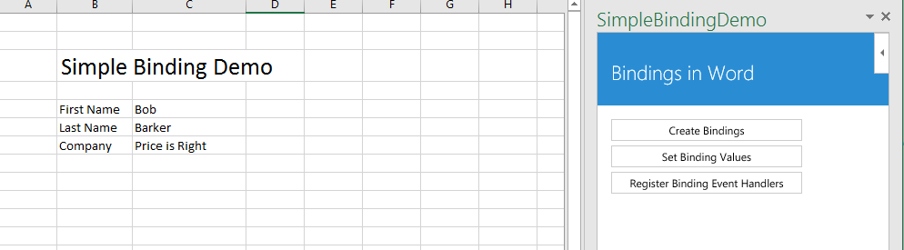

10. After click **Register Binding Event Handlers** button, if we change the value of **First Name**, **Last Name** or **Company**, 

    

   the message box is shown like the following screenshot to tell us binding value has been changed.

    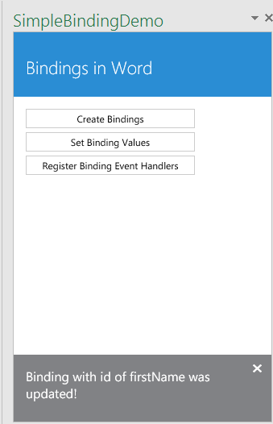

# Demo MyExcelApp

1. Open MyExcelApp solution using Visual Studio 2015
2. Select MyExcelApp project. Set **Start Document** value to **Book1.xlsx**.

    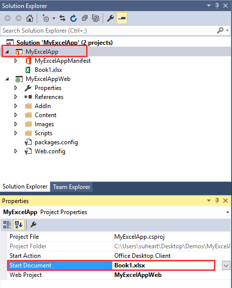

3. Press the **{F5}** key to run the project. The debugger should launch **Book1.xlsx** and you should see your Office Add-in in the task pane on the right side of Excel document.

    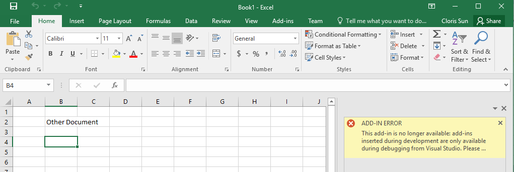

4. **Close** Add-in Panel.

    

5. Click **Insert > Add-ins >My Add-ins**, select the **MyExcelApp** Add-In.

6. You can find **MyExcelApp** Add-In as shown in the following screenshot.

    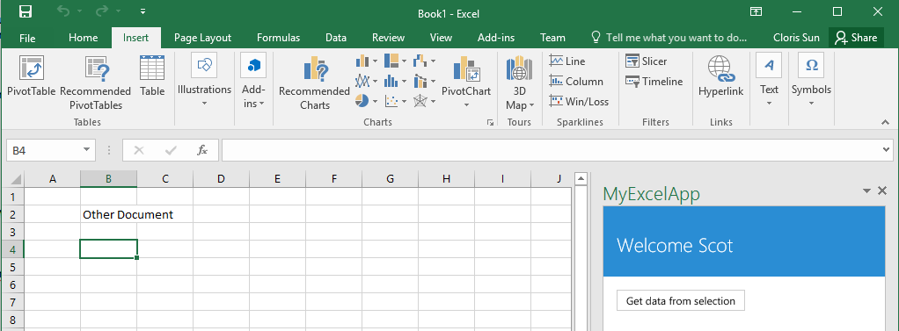

7. You can enter content to a cell. Then click **Get data from selection** button, the message box is shown like the following screenshot. 

    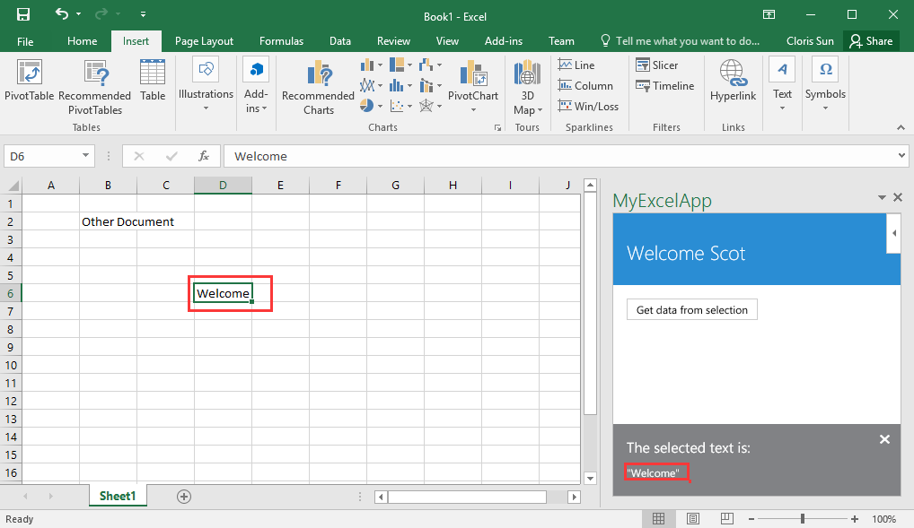
 
# Demo ExcelContentWriter

1. Open ExcelContentWriter solution using Visual Studio 2015

2. Press the **{F5}** key to run the project. The debugger should launch new Excel document and you should see **ExcelContentWriter** Add-in in the task pane on the right side of Excel document.

    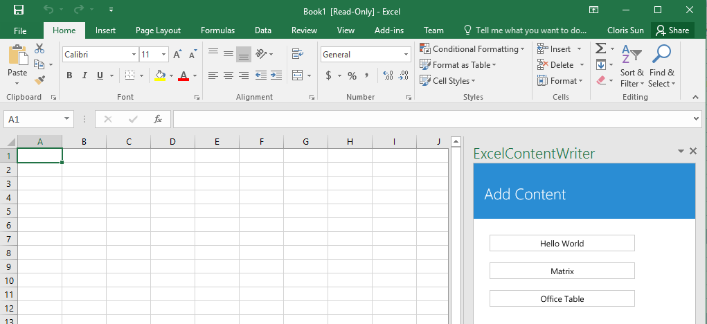

3. Click **Hello World** button, the selected cell value is set as **Hello world**.

    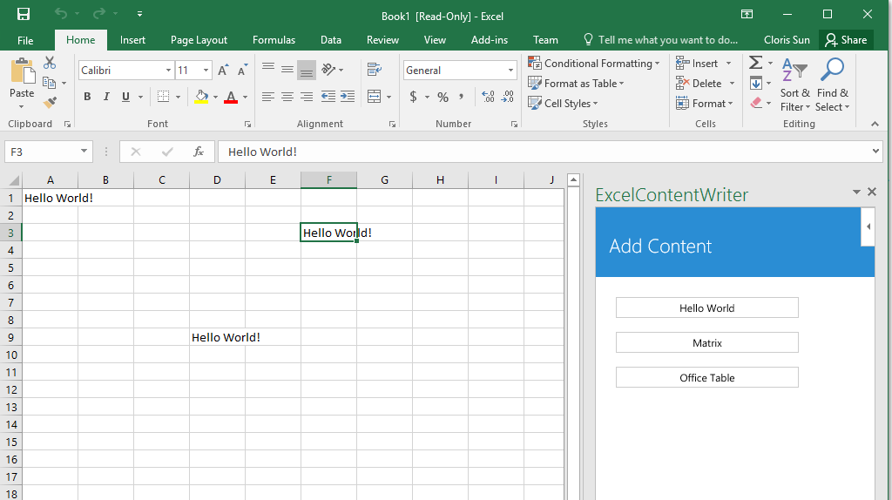

4. Click **Matrix** button, matrix value is set to cells from your selected cell.

    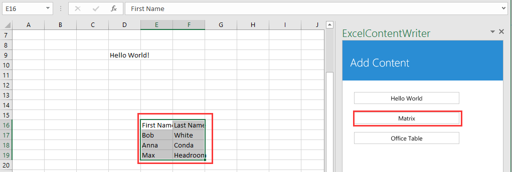

5. Click **Office Table** button, table value is set to cells from your selected cell.

    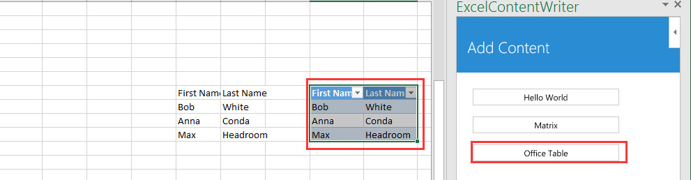