**Note: If you wish to see the MSAL version of these samples please [click here](MSAL%20Lab.md).**

# Deep Dive into Security and OAuth
In this lab, you will create Add-ins that use different approaches for OAuth authentication and examine the process flow. You will explore two different OAuth flows for obtaining an access token: the Authorization Code flow and the Client Credentials flow.

## Prerequisites
1. You must have an Office 365 tenant and Microsoft Azure subscription to complete this lab. If you do not have one, the lab for **O3651-7 Setting up your Developer environment in Office 365** shows you how to obtain a trial.
2. You must have [Fiddler](http://www.telerik.com/fiddler) installed.

## Exercise 1: Authorization Code Flow - OAuth in a Provider-Hosted SharePoint Add-In 
In this exercise you create a new Provider-hosted SharePoint Add-in and examine the OAuth Authorization Code flow.

1. If you do not have the **Office Developer Tools** installed, please install it from https://www.visualstudio.com/en-us/features/office-tools-vs.aspx.
2. Create the new solution in Visual Studio 2015:
  1. Launch **Visual Studio 2015** as administrator. 
  2. In Visual Studio select **File/New/Project**.
  3. In the New Project dialog:
    1. Select **Templates/Visual C#/Office/SharePoint**.
    2. Click **SharePoint Add-in**.
    3. Name the new project **ProviderHostedOAuth** and click **OK**.

       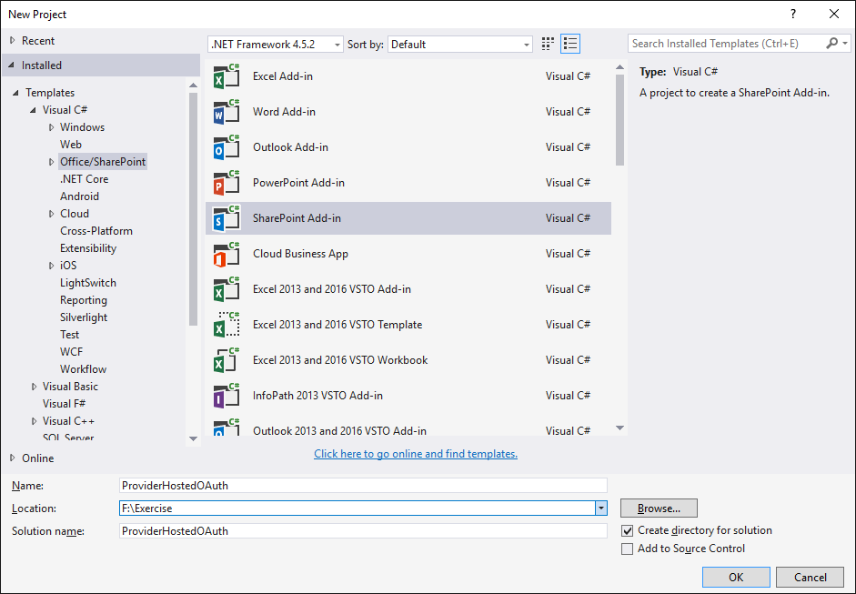

  4. In the **New App for SharePoint** wizard:
    1. Enter the address of a SharePoint site to use for testing the add-in (**NOTE:** The targeted site must be based on a Developer Site template)
    2. Select **Provider-Hosted** as the hosting model.
    3. Click **Next**.

       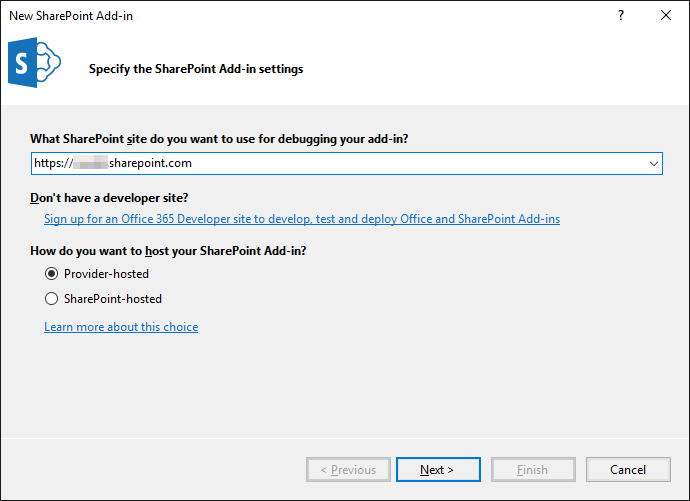
	4. Enter your Office 365 administrator credentials, and Click **Sign in**.

       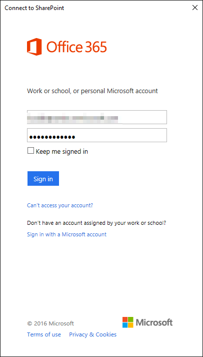
	5. Modify the target version if the system has detected a wrong result, and Click **Next**.

       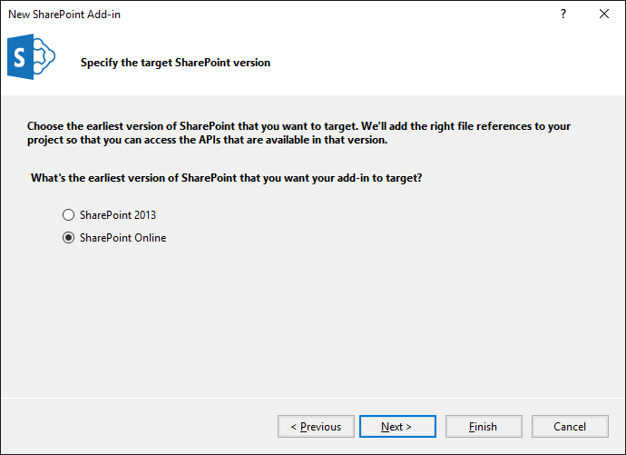
    6. Select **ASP.NET MVC Web Application**.
    7. Click **Next**.

       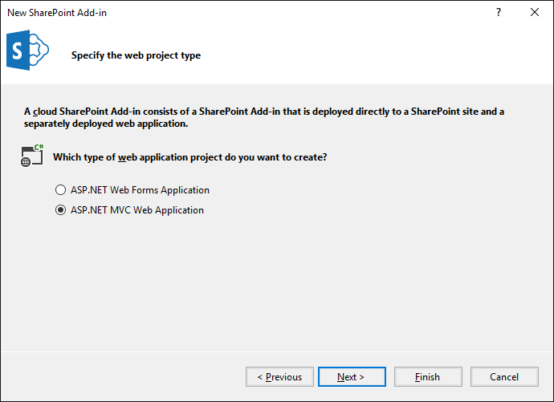

    8. Select the option labeled **Use Windows Azure Access Control Service (for SharePoint cloud add-ins)**.
    9. Click **Finish**.

       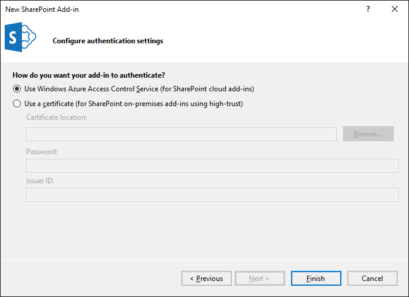

    10. After the new project is created, set breakpoints in **HomeController.cs** as shown.

       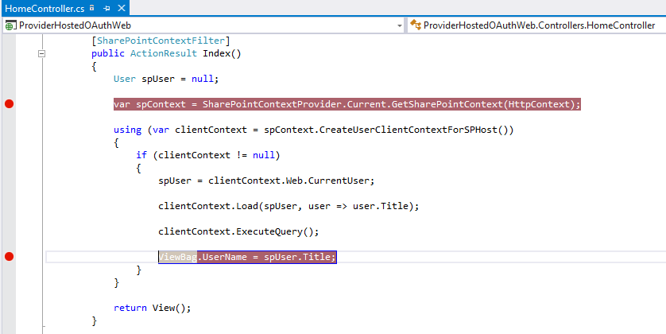

3. Start **Fiddler** to capture web traffic from your add-in.
  1. In Fiddler click **Tools/Fiddler Options**.
  2. Click **HTTPS**.
  3. Check the box entitled **Decrypt HTTPS Traffic**.
  4. When warned, click **Yes** to trust the Fiddler root certificate.

     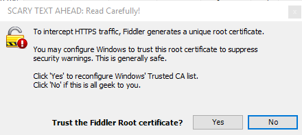

  5. Confirm any additional dialog boxes to install the certificate.
  6. Click **OK** to close the options dialog.
4. Debug the add-in by pressing **F5** in Visual Studio 2015.
  1. When prompted, sign into Office 365.
  2. When prompted, click **Trust It**.

     

  3. When the first breakpoint is hit, look for the session in Fiddler near the bottom of the list.

     

  4. Right click the session and select **Inspect in New Window**.
  5. Click the **WebForms** tab.

    > Notice that SharePoint has included the SPHostUrl, SPLanguage, SPClientTag, and SPProductNumber query string parameters in the initial call. These are known as the **Standard Tokens**.

  6. Notice that the context token is included in the body as **SPAppToken**.
 
     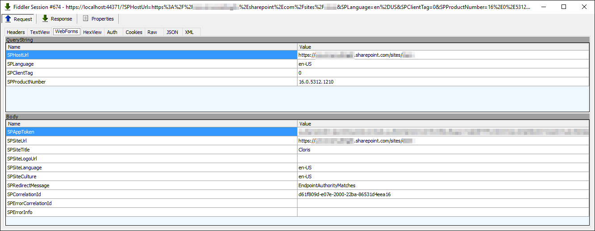
 
  7. Close the window.
  8. Return to Visual Studio, and press **F5** to continue debugging.
  9. When the second breakpoint is hit, look for the session in Fiddler near the bottom of the list.

     

  10. Right click the session and select **Inspect in New Window**.
  11. Click the **Headers** tab and examine the access token in the **Cookies/Login** section.

     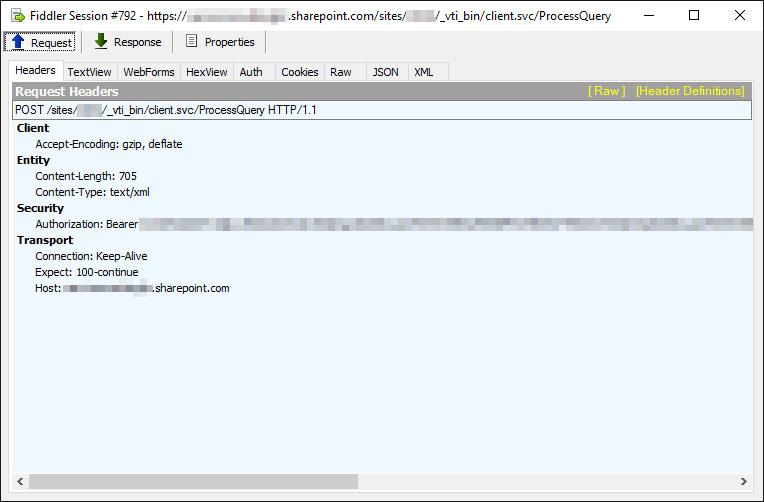

  12. Return to Visual Studio, and press **F5** to continue debugging.
  13. With the add-in still running, open a new browser window to **<SPSite>/_layouts/15/AppPrincipals.aspx**.
  14. Look for **ProviderHostedOAuth** in the list of registered add-ins to confirm that the add-in was registered during debugging.
  15. Stop debugging.

In this exercise you created a new provider-hosted SharePoint add-in and examined the OAuth Authorization Code flow.

## Exercise 2: Authorization Code Flow - OAuth with the Microsoft Graph APIs 
In this exercise you create a new web application and examine the OAuth Authorization Code flow.

1. Create the new solution in Visual Studio 2015:
  1. Launch **Visual Studio 2015** as administrator. 
  2. In Visual Studio select **File/New/Project**.
  3. In the New Project dialog:
    1. Select **Templates/Visual C#/Web**.
    2. Click **ASP.NET Web Application**.
    3. Name the new project **OfficeOAuth** and click **OK**.

       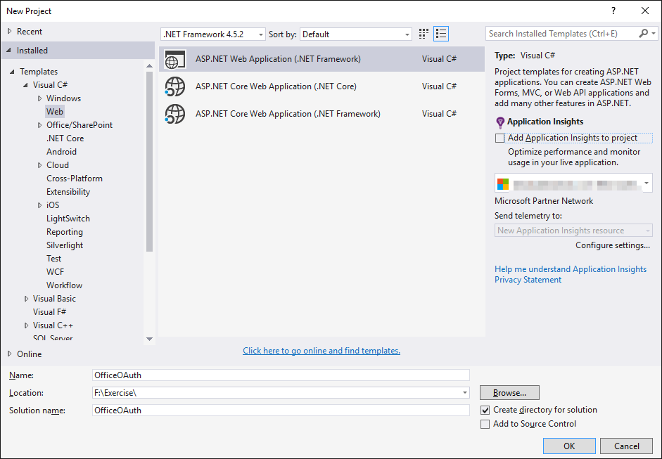

  4. In the **New ASP.NET Project** dialog, select **Web API**.
  5. Check **Host in the Cloud**.
  6. Click **Change Authentication**.
  7. In the **Change Authentication** dialog:
    1. Click **No Authentication**.
    2. Click **OK**.
  8. Click **OK**.

     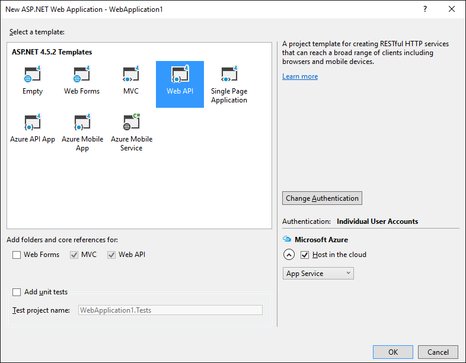

  9. In Create App Service dialog, **sign in** an account with **Microsoft Azure** subscription, make appropriate settings for **Web App Name**, **Subscription**, **Resource Group**, **App Service Plan**, click **Create**.

     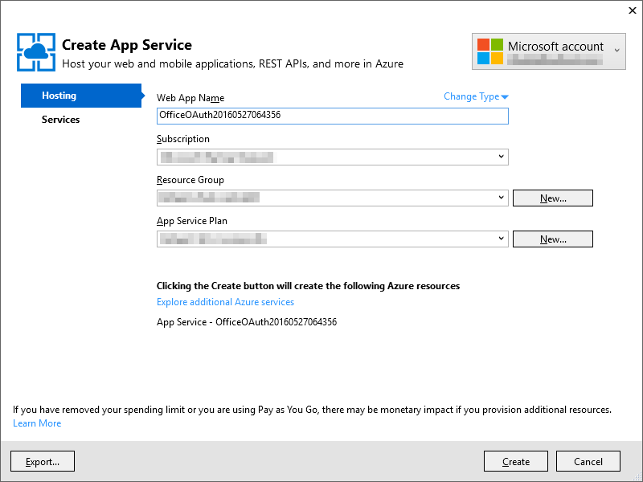

2. Add an Office 365 connection
  1. Right click the **OfficeOAuth** project and select **Add/Connected Service**.
  2. In the **Add Connected Service** dialog, select **Office 365 APIs**. Click **Configure**.
  
     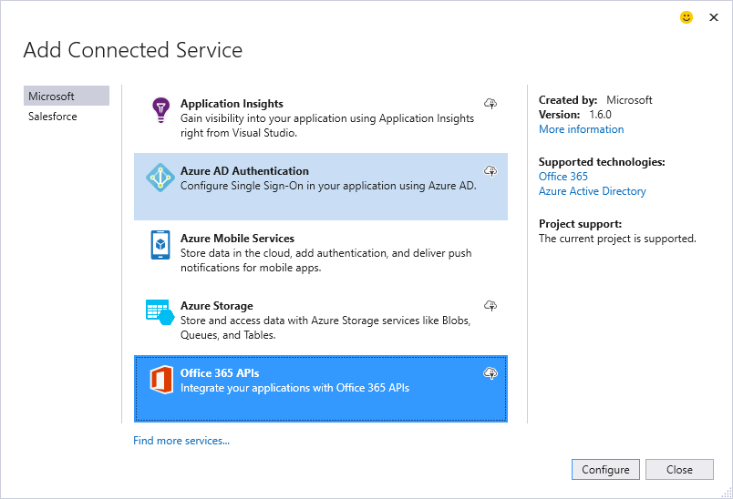

  3. In **Select Domain** section, input an Office 365 domain, click **Next**.
  4. If prompted, **sign in** an account with appropriate privileges to access the Office 365 domain.
  5. In **Configure Application** section, select **Create a new Azure AD application to access Office 365 API services**, uncheck **Configure Single Sign-On using Azure AD**, click **Next**.
  6. In **Calendar**, **Contacts**, **Mail**, **My Files**, **Sites** section, select nothing.
  7. In **Users and Groups**, only select **Sign you in and read your profile**, click **Finish**..

     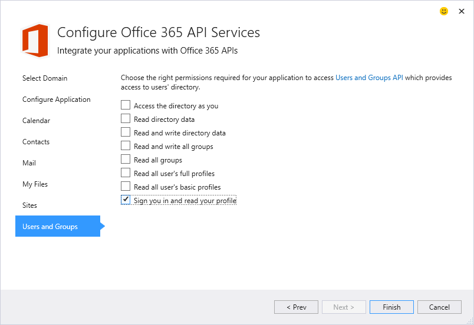

3. Examine the Microsoft Azure configuration.
  1. Log into the [Azure Management Portal](https://manage.windowsazure.com)
  2. Click **Active Directory**.
  3. Open your Azure Active Directory instance.
  4. Click **Applications** tab.
  5. Search for the application with the **ClientID** that was used by your project. You can find the **ClientID** by opening the **Web.config** file of your project.
  
     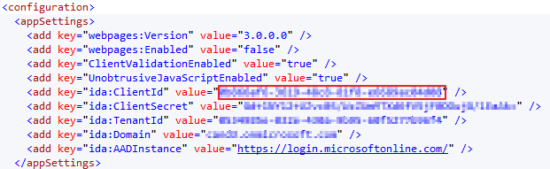

     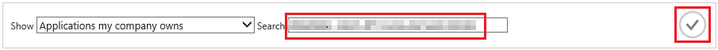

  6. Click on the application returned in the search results. This was the entry made for you by Visual Studio.
  7. Click **Configure**.
  8. Scroll to the section entitled **Permissions to Other Applications**.
  9. Examine the **Windows Azure Active Directory** permissions. These are the permissions you granted in Visual Studio.

     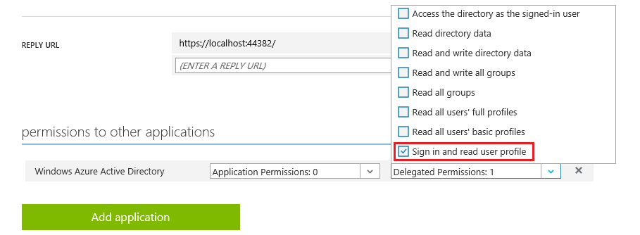

  10. Click **Add application**.
	
	  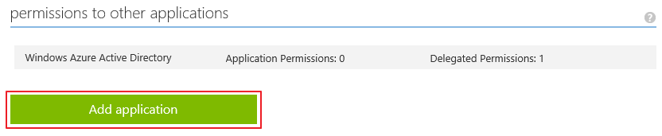

  11. Select **Microsoft Graph**. Click **the check mark icon** at the bottom of the page.

	  

  12. From **Delegated Permissions** select **Read user calendars**. Click **Save** at the bottom of the page.

	  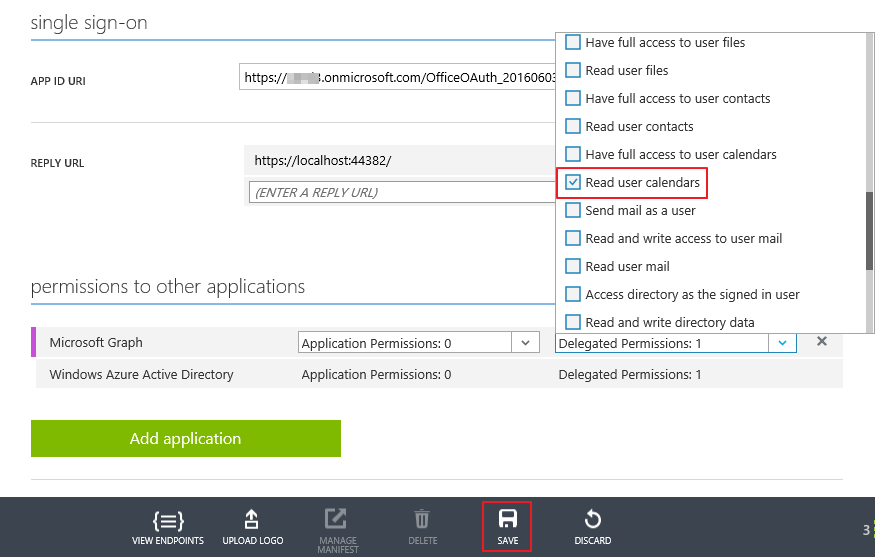

4. Install library **Microsoft.Graph**.
  1. Click **View/Other Windows/Package Manager Console**.
  2. In the **Package Manager Console**, execute the following command:
  	
    ````powershell
	Install-Package -Id Microsoft.Graph
    ````
5. Add class **SettingsHelper**.
  1. Right click **OfficeOAuth** project, select **Add/Class**.
  2. In the **Add Class** dialog, input **SettingsHelper** as the class name and click **Add**.
  3. Change the class to static.
  4. Add the following `using` statements after the existing `using` statements in the **SettingsHelper.cs** file:

    ````c#
	using System.Configuration;
    ````

  5. Input the code below into class **SettingsHelper**.
  
	````c#
	public static string ClientID
    {
        get { return ConfigurationManager.AppSettings["ida:ClientID"]; }
    }

    public static string ClientSecret
    {
        get { return ConfigurationManager.AppSettings["ida:ClientSecret"]; }
    }

    public static string AADInstance
    {
        get { return ConfigurationManager.AppSettings["ida:AADInstance"]; }
    }

    public static string TenantId
    {
        get { return ConfigurationManager.AppSettings["ida:TenantId"]; }
    }

    public static string Authority
    {
        get { return AADInstance + TenantId; }
    }
	````

	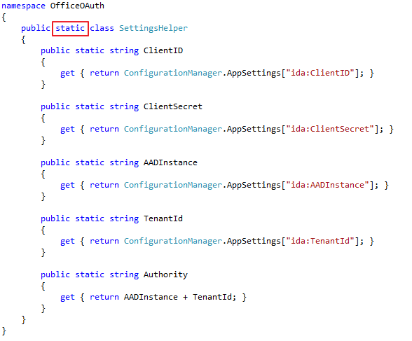
 	
6. Add class **CalendarAPISample**.
  1. Right click **OfficeOAuth** project, select **Add/Class**.
  2. In the **Add Class** dialog, input **CalendarAPISample** as the class name and click **Add**.
  3. Add the following `using` statements after the existing `using` statements in the **CalendarAPISample.cs** file:

    ````c#
	using System.Threading.Tasks;
	using System.Net.Http.Headers;
	using Microsoft.Graph;
	using Microsoft.IdentityModel.Clients.ActiveDirectory;
    ````

  4. Input the code below into class **CalendarAPISample**.
  	
    ````c#
    public static async Task<IOrderedEnumerable<Event>> GetCalendarEvents(string authCode)
    {
        var client = await EnsureClientCreated(authCode);
        var eventsResults = await client.Me.Events.Request(new Option[] { new QueryOption("$top", "10") }).GetAsync();
        return eventsResults.OrderBy(e => e.Start.DateTime);
    }

    public static async Task<GraphServiceClient> EnsureClientCreated(string authCode)
    {
        var graphToken = await GetAccessTokenByAuthenticationCodeAsync(authCode);
        var authenticationProvider = new DelegateAuthenticationProvider(
            (requestMessage) =>
            {
                requestMessage.Headers.Authorization = new AuthenticationHeaderValue("Bearer", graphToken);
                return Task.FromResult(0);
            });
        return new GraphServiceClient(authenticationProvider);
    }

    public static async Task<String> GetAccessTokenByAuthenticationCodeAsync(string authCode)
    {
        var authResult = await new AuthenticationContext(SettingsHelper.Authority)
            .AcquireTokenByAuthorizationCodeAsync(authCode,
            new Uri(HttpContext.Current.Request.Url.GetLeftPart(UriPartial.Authority)),
            new ClientCredential(SettingsHelper.ClientID, SettingsHelper.ClientSecret));
        return authResult.AccessToken;
    }
    ````

	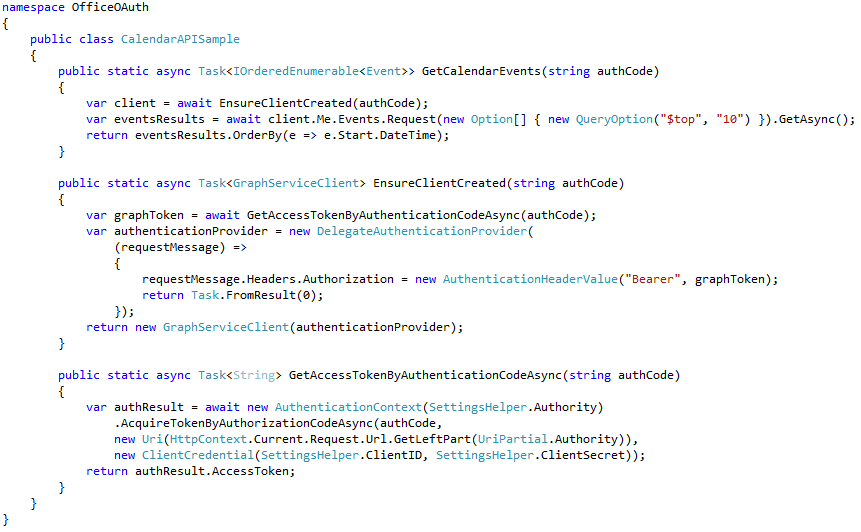

7. Update the Home Controller.
  1. Expand the **Controllers** folder and open **HomeController.cs**.
  2. Add the following `using` statements after the existing `using` statements in the **HomeController.cs** file:

    ````c#	
	using System.Threading.Tasks;
	using Microsoft.Graph;
    ````

  3. Replace the **Index** method with the following code
  
    ````c#
    public async Task<ActionResult> Index(string code)
    {
        if (string.IsNullOrEmpty(code))
        {
            var GraphResourceId = "https://graph.microsoft.com";

            string authorizationRequest = String.Format(
                "{0}/oauth2/authorize?response_type=code&client_id={1}&resource={2}&redirect_uri={3}&state={4}",
                SettingsHelper.Authority,
                Uri.EscapeDataString(SettingsHelper.ClientID),
                Uri.EscapeDataString(GraphResourceId),
                Uri.EscapeDataString(string.Format("{0}/", Request.Url.GetLeftPart(UriPartial.Authority))),
                Uri.EscapeDataString(Guid.NewGuid().ToString())
                );

            return new RedirectResult(authorizationRequest);
        }
        else
        {
            IOrderedEnumerable<Event> events = await CalendarAPISample.GetCalendarEvents(code);
            ViewBag.Events = events;
        }
        return View();
    }
    ````

8. Update the Index View.
  1. Expand the **Views/Home** folders and open **Index.cshtml**.
  2. Replace all of the code with the following:

    ````html
    <div style="margin:25px;">
      <table>
        <tr>
          <th>Start</th>
          <th>End</th>
          <th>Subject</th>
          <th>Location</th>
        </tr>
        @foreach (var Event in ViewBag.Events)
        {
          <tr>
            <td>
                <div style="width:200px;">@Event.Start.DateTime.ToString()</div>
            </td>
            <td>
                <div style="width:200px;">@Event.End.DateTime.ToString()</div>
            </td>
            <td>
                <div style="width:200px;">@Event.Subject</div>
            </td>
            <td>
                <div style="width:200px;">@Event.Location.DisplayName</div>
            </td>
        </tr>
        }
      </table>
    </div>
    ````

9. Debug the add-in.
  1. Start **Fiddler**.
  2. Press **F5** in Visual Studio 2015 to debug the application.
  3. When prompted, login to Office 365 with your managed account.
  4. Verify that the application displays your calendar information.
  5. In **Fiddler**, locate the session entry containing the query string parameter **code**. This is the Authorization Code returned from Azure Access Control Services.

     

  6. Right click the session and select **Inspect in New Window**.
  7. In the session window, click the **Web Forms** tab.
  8. Examine the authorization code.

     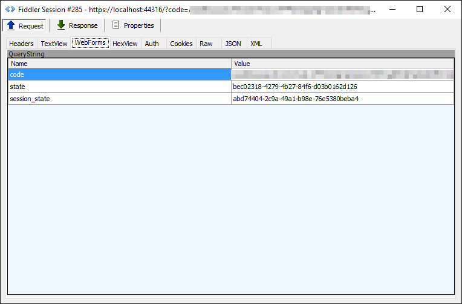

  9. Close the window.
  10. Stop debugging.

In this exercise you created a new web application and examined the OAuth Authorization Code Flow.

## Exercise 3: Client Credentials Flow - OAuth with the Microsoft Graph APIs 
In this exercise you create a new web application and examine the OAuth Client Credentials flow.

> **Note:** In order to fully demonstrate the capabilities of app-only permissions using the client credentials OAuth flow, you will need at least two users in your Office 365 tenant with some email in their Inbox.

### Configure Azure AD Application for App-Only Authentication
The first step is to create & configure an application in your Azure AD directory to support app-only permissions.

1. Locate the starter project in the Starter project folder within this lab located at [\\\O3652\O3652-7 Deep Dive into Security and OAuth\Starter Project](/Starter Project). Open the Visual Studio solution **ClientCredsAddin.sln** in Visual Studio 2015.
2. Update the web project to use SSL by default:
  1. In the **Solution Explorer** tool window, select the project and look at the **Properties** tool window. 
  2. Change the property **SSL Enabled** to **TRUE**.
  3. Copy the **SSL URL** property to the clipboard for use in the next step.
  4. Save your changes.

     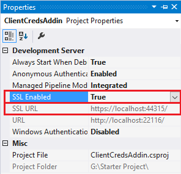

    > It is important to do this now because in the next step when you create the application in Azure AD, you want the reply URL to use HTTPS. If you did not do this now, you would have to manually make the changes the Visual Studio wizard is going to do for you in creating the app.
    
3. Configure the project to always go to the homepage of the web application when debugging:
  1. In the **Solution Explorer** right-click the project and select **Properties**.
  2. Select the **Web** tab in the left margin.
  3. Find the section **Start Action**.
  4. Click the radio button **Start URL** and enter the **URL** of the web project that you copied from the previous step.
  5. Save your changes.

4. Install library **Microsoft.Graph**.
  1. Click **View/Other Windows/Package Manager Console**.
  2. In the **Package Manager Console**, execute the following command:
  	
    ````powershell
	Install-Package -Id Microsoft.Graph
    ````
 
5. In the **Solution Explorer**, right click the **ClientCredsAddin** project and select **Add/Connected Service**.
  1. In the **Add Connected Service** dialog, select **Office 365 APIs**. Click **Configure**.
  2. In **Select Domain** section, input an Office 365 domain, click **Next**.
  3. If prompted, **sign in** an account with appropriate privileges to access the Office 365 domain.
  4. In **Configure Application** section, select **Create a new Azure AD application to access Office 365 API services**, uncheck **Configure Single Sign-On using Azure AD**, click **Next**.
  5. In **Calendar**, **Contacts**, **Mail**, **My Files**, **Sites** section, select nothing.
  6. In **Users and Groups**, only select **Sign you in and read your profile**, click **Finish**.

6. Now you need to create a public-private key-pair certificate. Do this by creating a self-signed certificate:
  1. Launch a Visual Studio Command Prompt: **Start / Visual Studio 2015 / Developer Command Prompt for VS2015**.
  2. In the command prompt, run the following commands to create a new self-signed certificate:

    ````command
    makecert -r -pe -n "CN=Contoso SuperApp Cert" -b 01/01/2016 -e 12/31/2016 -ss my -len 2048
    ````
     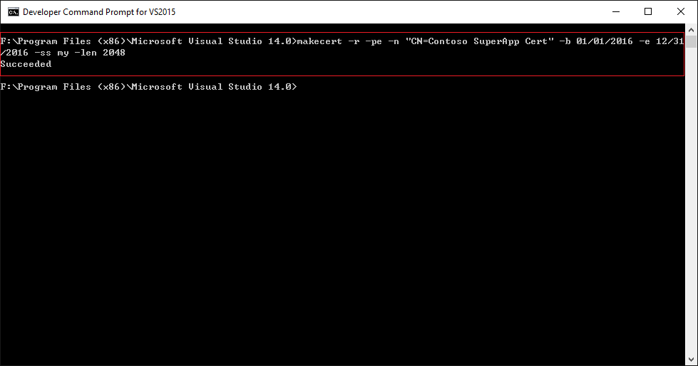
7. Next, extract the public & private keys from the machine's certificate store:
  1. Launch an MMC instance (**Start / Run / MMC **).
  2. In the menu, select **File / Add or Remove Snap-in...**.
  3. Select **Certificates**, click **Add** and **OK**. *If prompted, pick the current user or My user account option.*

     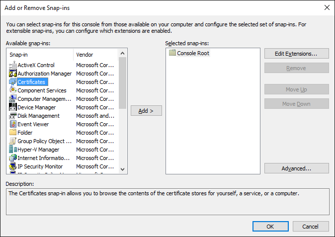

  4. Expand the tree to **Console Root / Certificates - Current User / Personal / Certificates**:
  5. Find the certificate you created by name, right-click and select **All Tasks / Export...**

     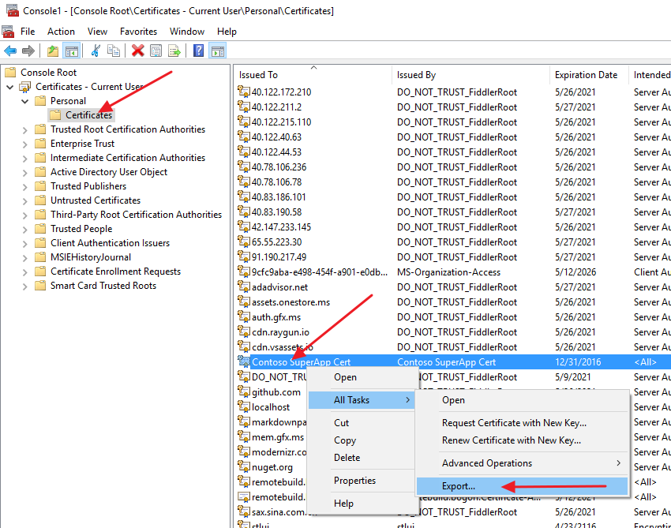

  6. Click **Next** on the wolcome page if it presents. 
  7. Export the public key by selecting **No, do not export the private key** and clicking **Next**.

     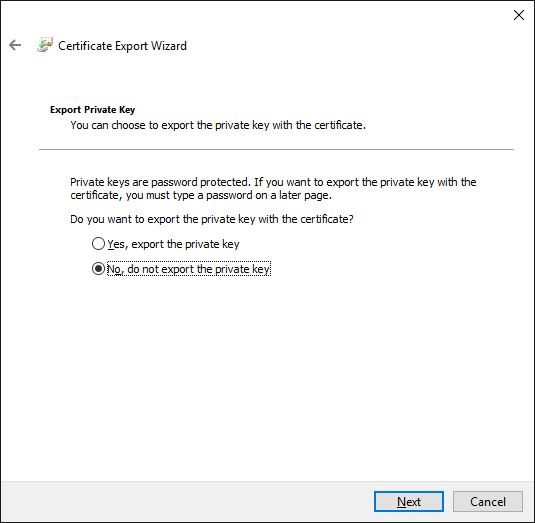

  8. Select **DER encoded binary X.509 (.CER)** and click **Next**.
  9. Save the file to you system as **ClientCredsAddin.cer**. This is the public key part of the certificate.
  10. Repeat the process above in finding the certificate and select **All Tasks / Export...**.
  11. This time, select **Yes, export the private key** and click **Next**.
  12. Select the format **Personal Information Exchange - PKCS #12 (.PFX)** and check the **Include all certificates in the certification path if possible**, finally clicking **Next**.

      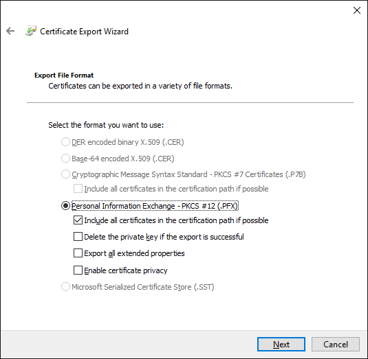

  13. On the **Security** page, check the **Password** option and enter a password you will remember, click **Next**.
  14. Finally click **Finish** and save the certificate to the file system as **CertCredsAddin.pfx**.

Now that you have the certificate public-private key pair, you need to add the public portion to the Azure AD application and that will be used by Azure AD to authenticate the request sent by the ASP.NET MVC web application

1. First, use PowerShell to extract the thumbprint & certificate value from the public certificate:
  1. Launch a PowerShell session.
  2. Enter the following PowerShell to extract the value (**$base64Value**), the thumbprint (**$base64Thumbprint**) & create a new unique ID for the key (**$keyId**). Make sure you save these values to a text file as you will need them in the next step:

    ````powershell
    $cer = New-Object System.Security.Cryptography.X509Certificates.X509Certificate2
    $cer.Import("<Path>\ClientCredsAddin.cer")
    $bin = $cer.GetRawCertData()

    $base64Value = [System.Convert]::ToBase64String($bin)
     
    $bin = $cer.GetCertHash()
    $base64Thumbprint = [System.Convert]::ToBase64String($bin)

    $keyid = [System.Guid]::NewGuid().ToString()

    $base64Thumbprint
    $keyid
    $base64Value
    ````
    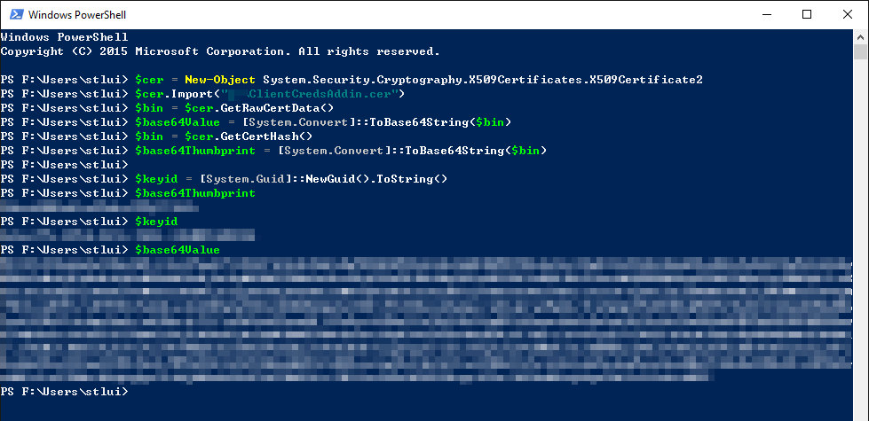
2. Now, update the application's registration in the Azure Management Portal:
  1. Open a browser and navigate to the Azure Management Portal at https://manage.windowsazure.com.
  2. In the left-hand navigation, scroll down to and click on **Active Directory**.
  3. Click on the name of your Azure AD directory & then click **Applications** in the toolbar. 
  4. Locate the name of the application you created using Visual Studio's *Connected Service* wizard (you may need to change the filter to **Applications my company owns** to get it to show up).
  5. Click the **Configure** tab on the top horizontal navigation for the app.
  
  > There is no user interface to add a certificate so you will add it manually to the manifest.
  
  1. At the bottom of the page, click the **Manage Manifest** button and select **Download Manifest** to download a JSON manifest of the application. 
    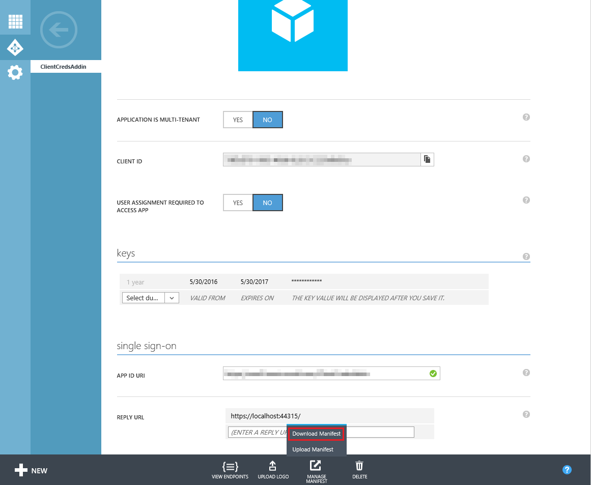
  2. Open the JSON file in a text editor & locate the section `"keyCredentials": [],`.
  3. Add a JSON object to this empty array that matches the following, but take care to update values **$base64Value**, **$base64Thumbprint** & **$keyId** from the values you obtained in PowerShell previously:

    ````
    "keyCredentials": [
      {
        "customKeyIdentifier": "$base64Thumbprint",
        "keyId": "$keyId",
        "type": "AsymmetricX509Cert",
        "usage": "Verify",
        "value":  "$base64Value"
      }
    ],
    ````
    > Copying directly from PowerShell inserts line breaks in long strings, you may want to copy the **$base64Thumbprint** value to Notepad in order to correctly format the long strings.
    
    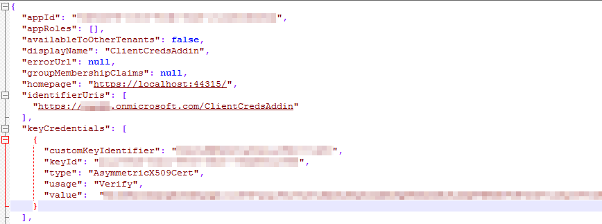
  4. Save your changes.
  5. Go back to the Azure Management Portal where your app is still selected.
  6. Click the **Manage Manifest** button and select **Upload Manifest**.
    
  7. Upload the JSON file you just modified.

  8. Now, modify the permissions for the application to grant the application app-only permissions.
    1. Scroll down to the **permissions to other applications** section. 
	    1. Click **Add application**. In the popup window, add **Microsoft Graph**
	       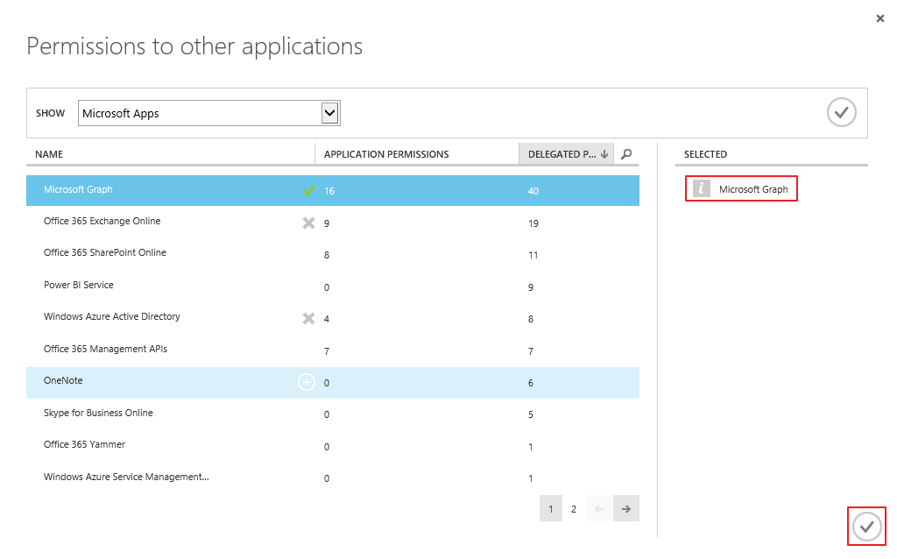
	    2. In the **Application Permissions** dropdown on the same line for **Microsoft Graph**, select the following permission:
	    	+ Read mail in all mailboxes
     		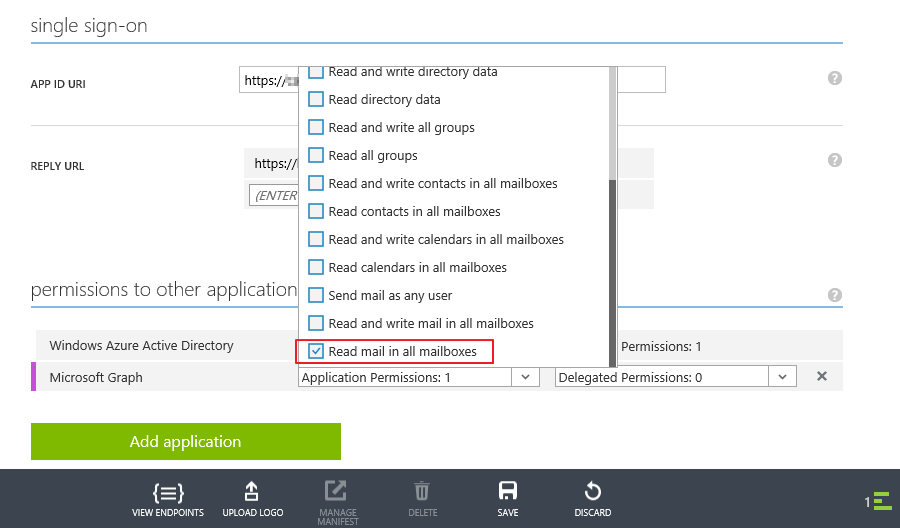
  	2. In the line for **Windows Azure Active Directory**, select the **Application Permissions** dropdown and add the following permission:

        + Read directory data
     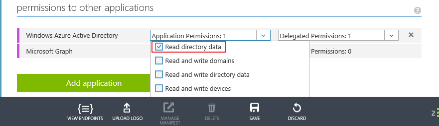
  9. Click the **Save** button at the bottom of the page.

### Setup the ASP.NET MVC Web Application for App-Only Authentication
Now that the application is configured with the public certificate & necessary permissions in Azure AD, you can now update the ASP.NET MVC application for app-only permissions and leverage the client credentials OAuth flow.

1. Ensure you have the starter project **ClientCredsAddin** open in Visual Studio.
2. Open the `web.config` and set the following values in the `<appSettings>` section:
  - **ida:CertPfxFilePath**: Enter `~/Content/CertCredsAddin.pfx` and copy the `CertCredsAddin.pfx` file to the **Content** folder in the project. *In a real application you will want to put this certificate in a safe place on your production server and not the root of the web application, but for this lab this is sufficient.*
  - **ida:CertPfxFilePassword**: Enter the password you used when exporting the private `CertCredsAddin.pfx` file.
    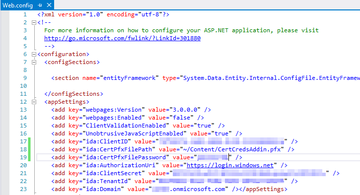
3. Assembly references are not added to the starter projects, rather they are added to the actual client projects. Therefore you need to add the following NuGet packages manually.
	1. Open the Package Manager Console: **View/Other Windows/Package Manager Console**.
	2. Click **Restore** to restore all missing NuGet packages.
	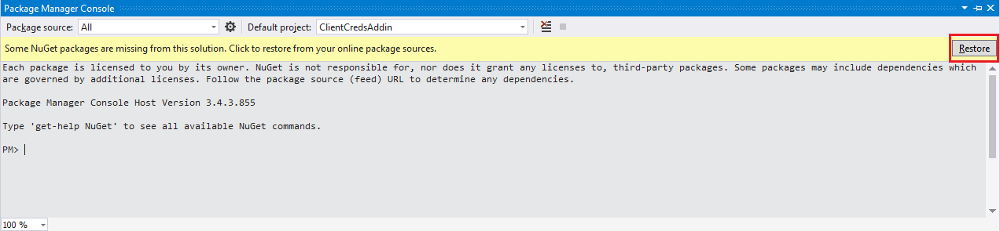
	
4. Create a MVC controller that will be used for all authentication routing for the web application:
  1. Right-click the **Controllers** folder and select **Add/Controller**.
    1. In the **Add Scaffold** dialog, select **MVC 5 Controller - Empty**.
    2. Click **Add**.
    3. When prompted for a name, enter **AccountController**.
    4. Click **Add**.
  2. Within the **AccountController** file, verify the following `using` statements are at the top of the file:

    ````c#
    using System;
    using System.Collections.Generic;
    using System.Linq;
    using System.Security.Claims;
    using System.Threading.Tasks;
    using System.Web;
    using System.Web.Mvc;
    using ClientCredsAddin.Models;
    using Microsoft.IdentityModel.Clients.ActiveDirectory;
    using ClientCredsAddin.Utils;
    ````

  3. Because apps that use application permissions & the client credentials flow require the global tenant administrator for the Azure AD directory to explicitly grant them access, add a route that will handle the user triggering this request by adding the following code to the **AccountController** class. Notice a few things in this method:
    - The request includes **response_type=code+id_token** which will retrieve OpenID token identifying the user who logged in and granted the consent.
    - The request specifies the user should be prompted to grant an administrator's consent to the application permissions as indicated by **prompt=admin_consent**.
    - Upon a successful authentication & granting the consent, redirect the app to **https://[MVC-App-Url-On-Localhost]/Account/Auth**, a route you will implement in a moment.

    ````c#
    public ActionResult AdminConsentApp() {

      string authorizationRequest = String.Format(
          "{0}oauth2/authorize?response_type=code+id_token&response_mode=form_post&prompt=admin_consent&client_id={1}&resource={2}&redirect_uri={3}&nonce={4}",
              SettingsHelper.AzureADAuthority,
              Uri.EscapeDataString(SettingsHelper.ClientId),
              Uri.EscapeDataString("https://graph.windows.net/"),
              Uri.EscapeDataString(String.Format("{0}/Account/Auth", this.Request.Url.GetLeftPart(UriPartial.Authority))),
              Uri.EscapeDataString(Guid.NewGuid().ToString())
              );

      return new RedirectResult(authorizationRequest);
    }
    ````

  4. Then you need to implement the route that Azure AD will send the user back to. Go ahead and add the following method to the **AccountController**, even though there will be some reference issues that we will implement in a moment. Take note of the following things:
    - You will create an `AuthHelper` class that will aid in obtaining app-only access tokens.
    - The method extracts values from the OpenID token returned from Azure AD.
    - An `AppState` class will be created that will contain the state information for the application & will be kept in a Session. *In a production app you might want to store this data in a server side cache for scalability and performance reasons.* 

    ````c#
    public async Task<ActionResult> Auth()
    {
        var authHelper = new AuthHelper();
        var appState = new AppState();

        // get id token from successful AzureAD auth
        var openIdToken = AuthHelper.OpenIdToken(Request.Form["id_token"]);
        appState.TenantId = openIdToken.TenantId;
        appState.TenantDomain = openIdToken.Domain;
        appState.LoggedOnUser = openIdToken.UserPrincipalName;

        // set app as authoirzed
        appState.AppIsAuthorized = true;

        // obtain access token for graph client
        var appOnlyGraphToken = await authHelper.GetAppOnlyAccessToken(SettingsHelper.GraphResourceId);
        appState.AppOnlyGraphToken = appOnlyGraphToken;

        // TODO LATER: get all users in the directory

        Session["ClientCredsAddinAppState"] = appState;

        return new RedirectResult("/Mail");
    }
    ````

  5. Create a new class **JwtToken** in the **Models** folder to represent the OpenID JWT token returned from Azure AD and add the following code to it:

    ````c#
    using Newtonsoft.Json;
	using System;
	using System.Collections.Generic;
	using System.Linq;
	using System.Web;
	
	namespace ClientCredsAddin.Models
	{
	    public class JwtToken
	    {
	        [JsonProperty(PropertyName = "tid")]
	        public string TenantId { get; set; }
	        [JsonProperty(PropertyName = "upn")]
	        public string UserPrincipalName { get; set; }
	        [JsonProperty(PropertyName = "domain")]
	        public string Domain
	        {
	            get
	            {
	                return (string.IsNullOrEmpty(UserPrincipalName))
	                  ? "string.Empty"
	                  : UserPrincipalName.Split('@')[1];
	            }
	        }
	    }
	}
    ````

  6. Create the `AuthHelper` utility class that will be used to handle the heavy lifting part of getting access tokens and processing OpenID tokens.
    1. Add a new class to the **Utils** folder named **AuthHelper.cs**.
    2. Ensure the following using statements are present at the top of the file:    
		````c#
		using System;
		using System.Collections.Generic;
		using System.Linq;
		using System.Web;
		using System.Net.Http.Headers;
		using System.Threading.Tasks;
		using System.IdentityModel.Tokens;
		using System.Security.Cryptography.X509Certificates;
		using Microsoft.Graph;
		using Microsoft.IdentityModel.Clients.ActiveDirectory;
		using Newtonsoft.Json;
		using ClientCredsAddin.Models;
		````
    3. Add the following methods to the `AuthHelper` class to process the OpenID JWT token returned from Azure AD:    
       ````c#
       public static JwtToken OpenIdToken(string idToken)
       {
         string encodedOpenIdToken = idToken;
         string decodedOpenIdToken = Base64UrlDecodeJwtTokenPayload(encodedOpenIdToken);

         return JsonConvert.DeserializeObject<JwtToken>(decodedOpenIdToken);
       }

       private static string Base64UrlDecodeJwtTokenPayload(string base64UrlEncodedJwtToken) {
         string payload = base64UrlEncodedJwtToken.Split('.')[1];

         return Base64UrlEncoder.Decode(payload);
       }
       ````
    4. Add the following method to the `AuthHelper` class to obtain an app-only OAuth access token from Azure AD for the specified resource:
       ````c#
       public async Task<string> GetAppOnlyAccessToken(string resource)
       {
         string authority = SettingsHelper.AzureADAuthority;
         var authContext = new Microsoft.IdentityModel.Clients.ActiveDirectory.AuthenticationContext(authority, false);

         // get certificate & password
         string certFile = HttpContext.Current.Server.MapPath(SettingsHelper.CertPfxFilePath);
         string certPassword = SettingsHelper.CertPfxFilePassword;
         var cert = new X509Certificate2(certFile, certPassword, X509KeyStorageFlags.MachineKeySet);
         var clientAssertionCert = new ClientAssertionCertificate(SettingsHelper.ClientId, cert);
      
         // authenticate
         var authResult = await authContext.AcquireTokenAsync(resource, clientAssertionCert);

         return authResult.AccessToken;
       }
       ````

    5. Add the following method to the `AuthHelper` class to create GraphServiceClient object:
       ````c#
       public static GraphServiceClient GetGraphServiceClient(string token)
	   {
	       var authenticationProvider = new DelegateAuthenticationProvider(
	           (requestMessage) =>
	           {
	               requestMessage.Headers.Authorization = new AuthenticationHeaderValue("Bearer", token);
	               return Task.FromResult(0);
	           });
	       return new GraphServiceClient(authenticationProvider);
	   }
       ````

  7. Finally, add a class to hold the application state that will be stored in the session state. Add a class named **AppState** to the **Models** folder and add the following code to it:

    ````c#
	using System;
	using System.Collections.Generic;
	using System.Linq;
	using System.Web;
	
	namespace ClientCredsAddin.Models
	{
	    public class AppState
	    {
	        public string TenantId { get; set; }
	        public string TenantDomain { get; set; }
	        public string LoggedOnUser { get; set; }
	        public bool AppIsAuthorized { get; set; }
	        public string AppOnlyGraphToken { get; set; }
	
	        public Dictionary<string, string> MailboxList { get; set; }
	
	        public AppState()
	        {
	            this.AppIsAuthorized = false;
	            this.MailboxList = new Dictionary<string, string>();
	        }
	    }
	}
    ````

### Get Users From Azure AD Directory with App-Only Permissions
With authentication setup with the application in Azure AD and in the ASP.NET MVC web application, you can add the code that will get some data to display in the interface.

1. First create a repository object that will handle retrieving users from the Azure AD directory using the  Microsoft Graph SDK:
  1. Add a new class named **GraphRepository** to the **Models** folder.
  2. Ensure the following `using` statements are present at the top of the file:

    ````c#
    using System;
	using System.Collections.Generic;
	using System.Linq;
	using System.Threading.Tasks;
	using ClientCredsAddin.Utils;
    ````

  3. Next, add the following method in the **GraphRepository** class to retrieve and return a collection of users from the Azure AD directory using the Microsoft Graph SDK:

    ````c#
    public async Task<Dictionary<string, string>> GetUsers(string graphToken)
    {
        var users = await AuthHelper.GetGraphServiceClient(graphToken).Users.Request().GetAsync();
        return users.Where(u => !string.IsNullOrEmpty(u.Mail) && u.Mail.EndsWith(SettingsHelper.AzureAdDomain)).ToDictionary(user => user.Id, user => user.Mail);
    }
    ````

  4. Go back to the **AccountController**. Find the `TODO LATER: get all users in the directory` comment in the `Auth()` route handler. Under this comment, add the following code that will retrieve the users from the directory:

    ````c#    
    var graphRepo = new GraphRepository();
    var users = await graphRepo.GetUsers(appOnlyGraphToken);
    appState.MailboxList = users;
    ````

### Retrieve Any User's Email Messages with App-Only Permissions
Now that you have the users in the directory, you can use the same app-only access token technique to get all the email messages for any user within the directory.

1. Create a repository object that will handle retrieving user messages using the Microsoft Graph SDK:
  1. Add a new class named **MessageRepository** to the **Models** folder.
  2. Ensure the following `using` statements are present at the top of the file:

    ````c#
    using System;
	using System.Collections.Generic;
	using System.Linq;
	using System.Threading.Tasks;
	using ClientCredsAddin.Utils;
    ````

  3. Next, add the following private field and constructor to the `MessageRepository` class to keep the app-only access token when creating the repository object:

    ````c#
    private string _accessToken = null;

    public MessageRepository(string accessToken) {
      _accessToken = accessToken;
    }
    ````

  4. Add the following method to retrieve all messages from the specified user's mailbox using the Microsoft Graph SDK:

    ````c#
    public async Task<List<string>> GetMessages(string userId)
    {
        var graphClient = AuthHelper.GetGraphServiceClient(_accessToken);
        var messages = await graphClient.Users[userId].Messages.Request().Top(10).Select("Subject").GetAsync();
        return messages.Select(m => m.Subject).ToList();
    }
    ````

### Display Any User's Emails
The ASP.NET MVC web application now contains all the *worker* code to authenticate, obtain access tokens and retrieve users and messages using different Microsoft Graph SDK APIs. The last step is to create a controller & view that brings it all together.

1. Add a controller to the web application:
  1. Right-click the **Controllers** folder and select **Add/Controller**.
    1. In the **Add Scaffold** dialog, select **MVC 5 Controller - Empty**.
    2. Click **Add**.
    3. When prompted for a name, enter **MailController**.
    4. Click **Add**.
  2. Within the **MailController** file, verify the following `using` statements are at the top of the file:

    ````c#
    using System;
    using System.Collections.Generic;
    using System.Linq;
    using System.Threading.Tasks;
    using System.Web;
    using System.Web.Mvc;
    using ClientCredsAddin.Models;
    using ClientCredsAddin.Utils;
    ````

  3. The first thing you need is a way to handle the admin constent required when using app-only permissions in Azure AD. Do this by adding the following method to the `MailController`. It leverages a custom attribute, `MultipleButton`, that is already present in the project that handles having multiple submit buttons in the view:

    ````c#
    [HttpPost]
    [MultipleButton(Name = "action", Argument = "GoAdminConsent")]
    public ActionResult Authorize() {
      return Redirect("/Account/AdminConsentApp");
    }
    ````

2. Add the view that will handle this requirement:
  1. Within the `MailController` class, right click the `View()` at the end of the `Index()` method and select **Add View**.
  2. Within the **Add View** dialog, set the following values:
    1. View Name: **Index**.
    2. Template: **Empty (without model)**.
      
      > Leave all other fields blank & unchecked.
    
  3. Click **Add**.
3. Within the **Views/Mail/Index.cshtml** file, delete all the code in the file and replace it with the following code:

    ````
    @model ClientCredsAddin.Models.MailViewModel
	@{
	    ViewBag.Title = "Index";
	}
	
	<h2>Index</h2>
	
	@if (Model.AppState.AppIsAuthorized == false)
	{
	    using (Html.BeginForm("", "Mail", FormMethod.Post))
	    {
	        <p>Force admin consent:</p>
	        <button type="submit" name="action:GoAdminConsent">Go Admin Consent</button>
	    }
	}
	
	@if (Model.AppState.AppIsAuthorized == true)
	{
	    <p>
	        <strong>Organization:</strong> [@Model.AppState.TenantDomain]<br />
	        <strong>Current logged in user:</strong> [@Model.AppState.LoggedOnUser]
	    </p>
	
	    using (Html.BeginForm("", "Mail", FormMethod.Post))
	    {
	        <p>
	            Select a mailbox:<br />
	            @Html.DropDownList("Mailbox", Model.UserListSelectors)
	            <button type="submit" name="action:viewMailboxMessages">View User's Emails</button>
	        </p>
	    }
	
	    if (Model.Messages.Count > 0)
	    {
	        <p>
	            <strong>Selected mailbox messages: </strong> [@Model.SelectedMailbox]<br />
	            <ul>
	                @foreach (var message in Model.Messages)
	                {
	                    <li>@message</li>
	                }
	            </ul>
	        </p>
	    }
	}
    ````

4. Notice that the code you just added to the view uses a custom view model object. Go ahead and add that:
  1. Add a new class named **MailViewModel** to the **Models** folder.
  2. Replace the code in the **MailViewModel** file with the following:

    ````c#
    using System;
    using System.Collections.Generic;
    using System.Linq;
    using System.Web;
    using System.Web.Mvc;

    namespace ClientCredsAddin.Models {
      public class MailViewModel {
        public string SelectedMailbox;
        public List<string> Messages;
        public AppState AppState;
        public List<SelectListItem> UserListSelectors;

        public MailViewModel() {
          SelectedMailbox = string.Empty;
          Messages = new List<string>();
        }
      }
    }
    ````

5. Implement the default route for the **MailController**:
  1. Go back to the `MailController` class within the **Controllers** folder.
  2. Update `Index()` route with the following code in the `MailController`:

    ````c#
    public ActionResult Index() {
      // try to load the app state (set if previously authenticated)
      //  if session value not present, create new app state
      var appState = Session["ClientCredsAddinAppState"] as AppState ?? new AppState();

      // create viewmodel for the view
      var viewModel = new MailViewModel {
        AppState = appState
      };

      // if logged in, get data and add to view model
      if (appState.AppIsAuthorized) {
        // create select list of all users
        viewModel.UserListSelectors = GetMailboxSelectOptions(appState.MailboxList);
      }

      return View(viewModel);
    }
    ````

  3. Add the utility method `GetMailboxSelectOptions()` to the `MailController` class. This will create select box options for the drop down list that you will later add to the view used to select a different mailbox:

    ````c#
    private List<SelectListItem> GetMailboxSelectOptions(Dictionary<string, string> mailboxList) {
      return mailboxList.Select(user => new SelectListItem {
        Text = user.Value,
        Value = user.Value
      }).ToList();
    }
    ````
6. Last but not least, go back to the `MailController` to add one last method that will handle when the user click the button to fetch the email messages from a user's mailbox:

    ````c#
    [HttpPost]
    [MultipleButton(Name = "action", Argument = "viewMailboxMessages")]
    public async Task<ActionResult> ListEmailMessages()
    {
        var appState = Session["ClientCredsAddinAppState"] as AppState;

        // get requested mailbox
        var requestedMailbox = Request.Form["Mailbox"];

        // build view model
        var viewModel = new MailViewModel
        {
            AppState = appState,
            SelectedMailbox = requestedMailbox,
            UserListSelectors = GetMailboxSelectOptions(appState.MailboxList)
        };

        // get messages
        var repo = new MessageRepository(viewModel.AppState.AppOnlyGraphToken);
        var mailBox = appState.MailboxList.Where(pair => pair.Value == requestedMailbox).FirstOrDefault();
        var results = await repo.GetMessages(mailBox.Key);

        viewModel.SelectedMailbox = requestedMailbox;
        viewModel.Messages = results;

        return View("Index", viewModel);
    }
    ````

7. Test the application by pressing **F5** in Visual Studio or using the **Debug / Start Debugging** menu item.
  1. When the browser launches, click the **Mail** menu item in the top navigation.
  2. Notice no mailboxes are shown because your application is not authenticated. Click the button **Go Admin Consent** to trigger the login & admin consent prompt for the global tenant administrator:

    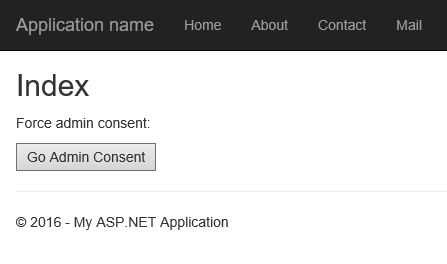

  3. Login to Azure AD using the credentials for the global tenant administrator for your Azure AD directory.
  4. Notice that after you successfully login, you are presented with the admin consent screen. This page is telling you the permissions it needs and how broad sweeping the permission request is as indicated by the message *If you agree, this app will have access to the specified resources for all users in your organization. No one else will be prompted.*

    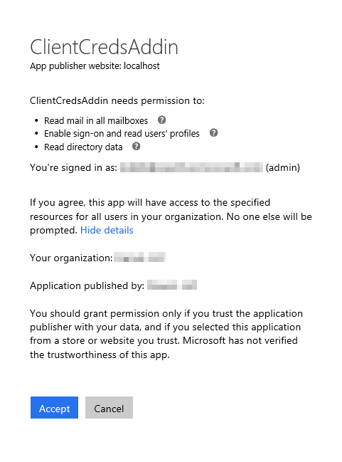

  5. Click **Accept** to grant the app permissions and to go back to your ASP.NET MVC web application.
  6. The app will take you back to the **Mail** controller and display the tenant and logged in user. Notice that it also now has a list of all the users in your directory within the drop down:

    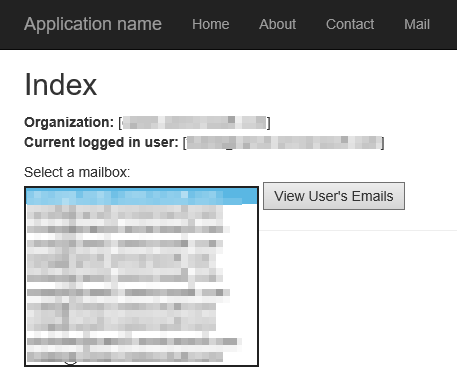

  7. Select one user and click the **View User's Emails** button. The page will reload and show a list of the subject lines of those emails:

    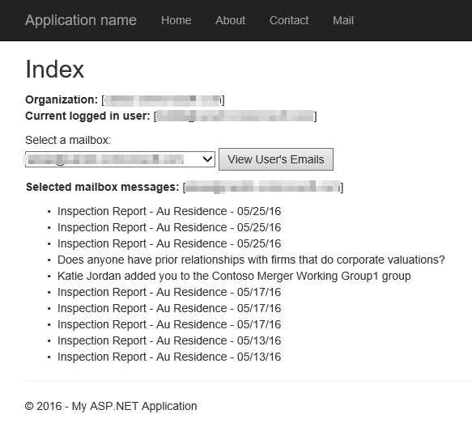

    Notice in the figure above, the currently logged in user's emails are being shown. 

    Now let's see how sweeping app-only permissions are

  8. Change to another user and click the **View User's Emails** button. Notice how you are now reading someone else's emails!

    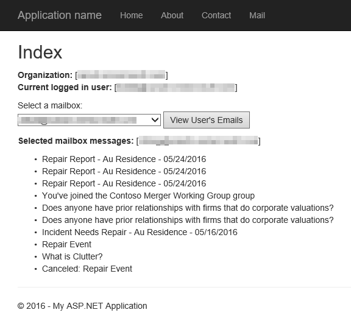

In this exercise you created a new web application and examined the OAuth Client Credentials flow.

**Congratulations! You have completed investigation OAuth in Office 365.**