# Deep Dive into Security and OAuth
In this lab, you will create add-ins that use different approaches for OAuth authentication and examine the process flow. You will explore two different OAuth flows for obtaining an access token: the Authorization Code flow and the Client Credentials flow.

## Prerequisites
1. You must have an Office 365 tenant and Microsoft Azure subscription to complete this lab. If you do not have one, the lab for **O3651-7 Setting up your Developer environment in Office 365** shows you how to obtain a trial.
1. You must have [Fiddler](http://www.telerik.com/fiddler) installed.

## Exercise 1: Authorization Code Flow - OAuth in Office 365 with the Microsoft Graph APIs 
In this exercise you create a new web application and examine the OAuth Authorization Code flow.

1. Create the new solution in Visual Studio 2015:
  1. Launch **Visual Studio 2015** as administrator. 
  1. In Visual Studio select **File/New/Project**.
  1. In the New Project dialog:
    1. Select **Templates/Visual C#/Web**.
    1. Click **ASP.NET Web Application**.
    1. Name the new project **OfficeOAuth** and click **OK**.

      

  1. In the **New ASP.NET Project** dialog, select **Web API**.
  1. Check **Host in the Cloud**.
  1. Click **Change Authentication**.
  1. In the **Change Authentication** dialog:
    1. Click **No Authentication**.
    1. Click **OK**.
  1. Click **OK**.

    

  1. In Create App Service dialog, **sign in** an account with **Microsoft Azure** subscription, make appropriate settings for **Web App Name**, **Subscription**, **Resource Group**, **App Service Plan**, click **Create**.

    

  1. In the **Solution Explorer** tool window, select the project and look at the **Properties** tool window.
  1. Copy and save the **URL** property to use later.

1. Register application for the Microsoft Graph
	1. Open [**Application Registration Portal**](https://apps.dev.microsoft.com) in web browser.
	2. Sign in with an administrator account of your Office 365 tenant.
	3. Click the **Add an app** button at the top right corner. 
	4. In the **New Application Registration** wizard, enter a name of **OfficeOAuth**. Click the **Create application** button to the next page.
	5. In the **OfficeOAuth Registration** page, click the **Add Platform** button.
	6. In the **Add Platform** wizard, select **Web**.
	7. In the **Redirect URIs** text box, enter the **URL** of the project you got in a previous step. 

		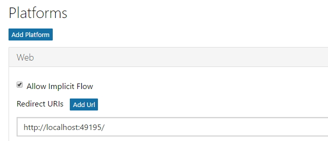

	8. Copy and save the **Application Id** to use later.

		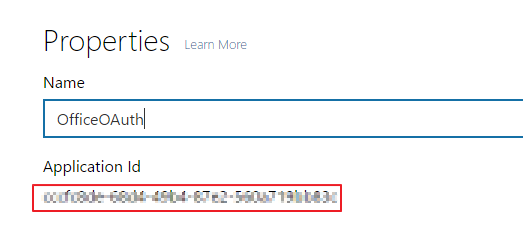

	9. In the **Application Secrets** section, click the **Generate New Password** button.
	10. In the **New Password Generated** popup, copy and save the password to use later.

		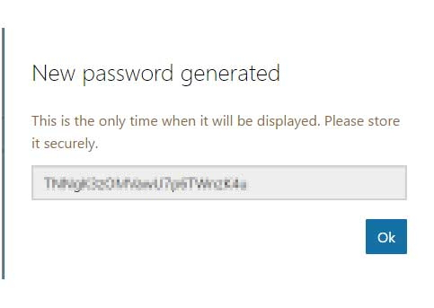

	11. Click the **Save** button at the bottom left corner.

1. Examine the App Registration in Microsoft Azure portal.
  1. Log into the [Azure Portal](https://portal.azure.com)
  1. Click **More services**.
  1. Click **App registrations**.

    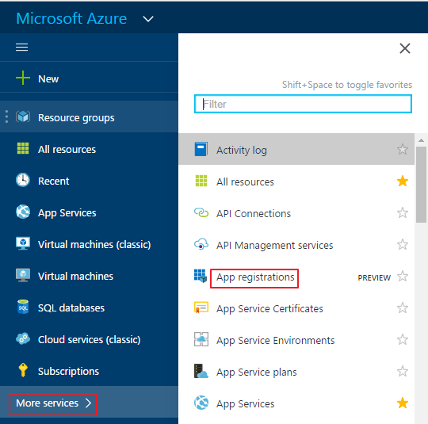

  1. Click **Applications** tab.
  1. Search for the app with the **Application Id** you got in a previous step.

    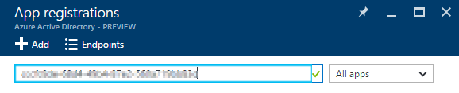

  1. Click on the application searched out. This entry was made when you registered the app in [**Application Registration Portal**](https://apps.dev.microsoft.com).
  1. Click Reply URLs in the **Settings** panel, you will see the reply URL you set when registered the app in [**Application Registration Portal**](https://apps.dev.microsoft.com).

    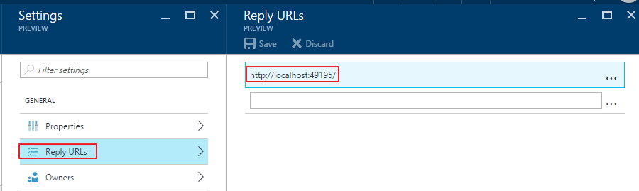

1. Install libraries **Microsoft.Graph** and **Microsoft Authentication Library**.
  1. Click **View/Other Windows/Package Manager Console**.
  1. In the **Package Manager Console**, execute the following commands:
  	
	    ````powershell
		Install-Package -Id Microsoft.Graph
		Install-Package -Id Microsoft.Identity.Client -Pre
	    ````

1. Update file **Web.config** in the project.
  1. Add a node inside **appSettings** section with key **AppId**, set its value to the **Application Id** you got in a previous step.
  1. Add a node inside **appSettings** section with key **AppPassword**, set its value to the **Application Password** you got in a previous step.

	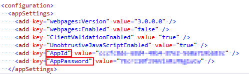

1. Add class **SettingsHelper**.
  1. Right click **OfficeOAuth** project, select **Add/Class**.
  1. In the **Add Class** dialog, input **SettingsHelper** as the class name and click **Add**.
  1. Change the class to static.
  1. Add the following `using` statements after the existing `using` statements in the **SettingsHelper.cs** file:

    ````c#
	using System.Configuration;
    ````

  1. Input the code below into class **SettingsHelper**.
  
	````c#
	public static string AppId
    {
        get { return ConfigurationManager.AppSettings["AppId"]; }
    }

    public static string AppPassword
    {
        get { return ConfigurationManager.AppSettings["AppPassword"]; }
    }
	````

	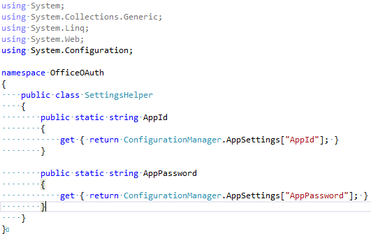
 	
1. Add class **CalendarAPISample**.
  1. Right click **OfficeOAuth** project, select **Add/Class**.
  1. In the **Add Class** dialog, input **CalendarAPISample** as the class name and click **Add**.
  1. Add the following `using` statements after the existing `using` statements in the **CalendarAPISample.cs** file:

    ````c#
	using System.Threading.Tasks;
	using System.Net.Http.Headers;
	using Microsoft.Graph;
	using Microsoft.Identity.Client;
    ````

  1. Input the code below into class **CalendarAPISample**.
  	
    ````c#
    public static async Task<IOrderedEnumerable<Event>> GetCalendarEvents(string authCode, string webUrl)
    {
        var client = await EnsureClientCreated(authCode, webUrl);
        var eventsResults = await client.Me.Events.Request(new Option[] { new QueryOption("$top", "10") }).GetAsync();
        return eventsResults.OrderBy(e => e.Start.DateTime);
    }

    public static async Task<GraphServiceClient> EnsureClientCreated(string authCode, string webUrl)
    {
        var graphToken = await GetAccessTokenByAuthenticationCodeAsync(authCode, webUrl);
        var authenticationProvider = new DelegateAuthenticationProvider(
            (requestMessage) =>
            {
                requestMessage.Headers.Authorization = new AuthenticationHeaderValue("Bearer", graphToken);
                return Task.FromResult(0);
            });
        return new GraphServiceClient(authenticationProvider);
    }

    public static async Task<String> GetAccessTokenByAuthenticationCodeAsync(string authCode, string webUrl)
    {
        ConfidentialClientApplication cca = new ConfidentialClientApplication(SettingsHelper.AppId, webUrl,
            new ClientCredential(SettingsHelper.AppPassword), null);

        string[] scopes = { "Calendars.Read" };
        var authResult = await cca.AcquireTokenByAuthorizationCodeAsync(scopes, authCode);
        return authResult.Token;
    }
    ````

	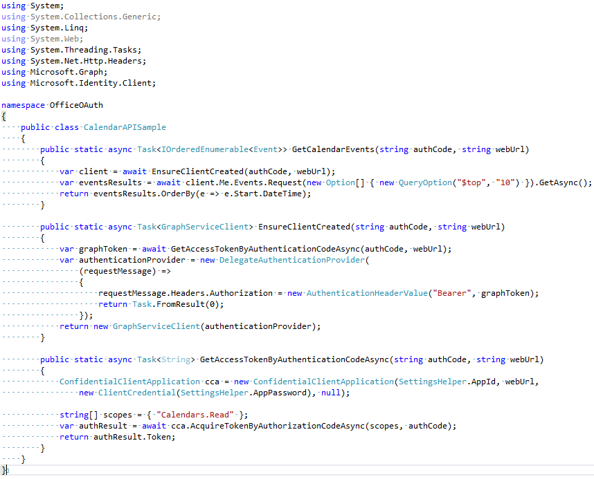

1. Update the Home Controller.
  1. Expand the **Controllers** folder and open **HomeController.cs**.
  1. Add the following `using` statements after the existing `using` statements in the **HomeController.cs** file:

    ````c#	
	using System.Threading.Tasks;
	using Microsoft.Graph;
    ````

  1. Replace the **Index** method with the following code
  
    ````c#
    public async Task<ActionResult> Index(string code)
    {
        var webUrl = string.Format("{0}/", Request.Url.GetLeftPart(UriPartial.Authority));
        if (string.IsNullOrEmpty(code))
        {
            var adAuthority = "https://login.microsoftonline.com";
            var scope = "Calendars.Read openid email profile offline_access";

            string authorizationRequest = String.Format(
                "{0}/common/oauth2/v2.0/authorize?response_type=code&client_id={1}&redirect_uri={2}&scope={3}&state={4}",
                adAuthority,
                Uri.EscapeDataString(SettingsHelper.AppId),
                Uri.EscapeDataString(webUrl),
                scope,
                Uri.EscapeDataString(Guid.NewGuid().ToString())
                );

            return new RedirectResult(authorizationRequest);
        }
        else
        {
            IOrderedEnumerable<Event> events = await CalendarAPISample.GetCalendarEvents(code, webUrl);
            ViewBag.Events = events;
        }
        return View();
    }
    ````

1. Update the Index View.
  1. Expand the **Views/Home** folders and open **Index.cshtml**.
  1. Replace all of the code with the following:

    ````html
    <div style="margin:25px;">
      <table>
        <tr>
          <th>Start</th>
          <th>End</th>
          <th>Subject</th>
          <th>Location</th>
        </tr>
        @foreach (var Event in ViewBag.Events)
        {
          <tr>
            <td>
                <div style="width:200px;">@Event.Start.DateTime.ToString()</div>
            </td>
            <td>
                <div style="width:200px;">@Event.End.DateTime.ToString()</div>
            </td>
            <td>
                <div style="width:200px;">@Event.Subject</div>
            </td>
            <td>
                <div style="width:200px;">@Event.Location.DisplayName</div>
            </td>
        </tr>
        }
      </table>
    </div>
    ````

1. Debug the add-in.
  1. Start **Fiddler**.
  1. Press **F5** in Visual Studio 2015 to debug the application.
  1. When prompted, login to Office 365 with your managed account.
  1. Verify that the application displays your calendar information.
  
	> **Note:** If you recieve the Newtonsoft.Json error, you must manually update the Newtonsoft.Json dll through NuGet.
	> 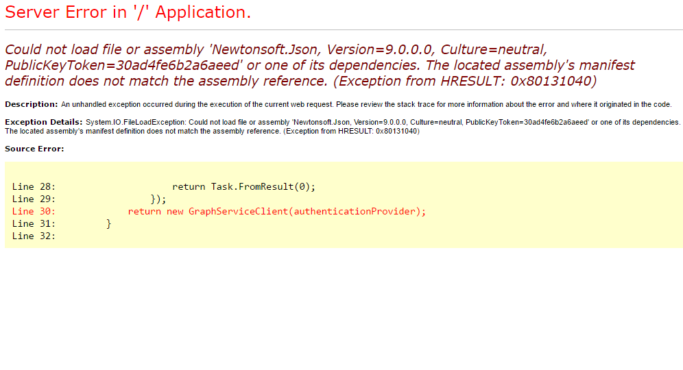
   

	````powershell
	Install-Package Newtonsoft.Json -Version 9.0.1
	````
   
  1. In **Fiddler**, locate the session entry containing the query string parameter **code**. This is the Authorization Code returned from Azure Access Control Services.

    

  1. Right click the session and select **Inspect in New Window**.
  1. In the session window, click the **Web Forms** tab.
  1. Examine the authorization code.

    

  1. Close the window.
  1. Stop debugging.

In this exercise you created a new web application and examined the OAuth Authorization Code Flow.


**Congratulations! You have completed investigation OAuth in Office 365.**

## Exercise 2: Client Credentials Flow - OAuth in Office 365 with the Microsoft Graph APIs 
In this exercise you use a web application to examine the OAuth Client Credentials flow.

> **Note:** In order to fully demonstrate the capabilities of app-only permissions using the client credentials OAuth flow, you will need at least two users in your Office 365 tenant with some email in their Inbox.

### Register Application and Configure it for App-Only Authentication
1. Locate the starter project in the MSAL Starter Project folder within this lab located at [\\\O3652\O3652-7 Deep Dive into Security and OAuth\MSAL Starter Project](./MSAL Starter Project). Open the Visual Studio solution **ClientCredsAddin.sln** in Visual Studio 2015.
2. In the **Solution Explorer** tool window, select the project and look at the **Properties** tool window.
3. Copy and save the **SSL URL** property to use later.
4. Register an application by same steps of **Exercise1 - Step#2**, except 3 differences:
	1. Set the **Redirect URI** to be the **SSL URL** of the project you got in the previous step suffixed with   
**Account/Auth**(e.g. https://localhost:44315/Account/Auth).
	2. In **Microsoft Graph Permissions** section, remove **User.Read** from **Delegated Permissions**, add **Directory.Read.All** and **Mail.Read** to **Application Permissions**. 

		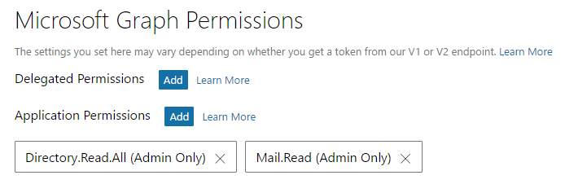

### Setup the ASP.NET MVC Web Application for App-Only Authentication
1. Ensure you have the starter project **ClientCredsAddin** open in Visual Studio.
2. Install libraries **Microsoft.Graph** and **Microsoft Authentication Library**.
  1. Click **View/Other Windows/Package Manager Console**.
  2. In the **Package Manager Console**, execute the following commands:
 	
    ````powershell
	Install-Package -Id Microsoft.Graph
	Install-Package -Id Microsoft.Identity.Client -Pre
    ````

3. Open the `web.config` and set the following values in the `<appSettings>` section:
  - **ida:ClientID**: Enter the application Id of the application you registered.
  - **ida:Password**: Enter the password you generated of the the application you registered.
  - **ida:AADTenantId**: Enter the Id of the azure tenant where your registered application is created.
  - **ida:AADDomain**: Enter the domain name in the azure tenant where your registered application is created. 

    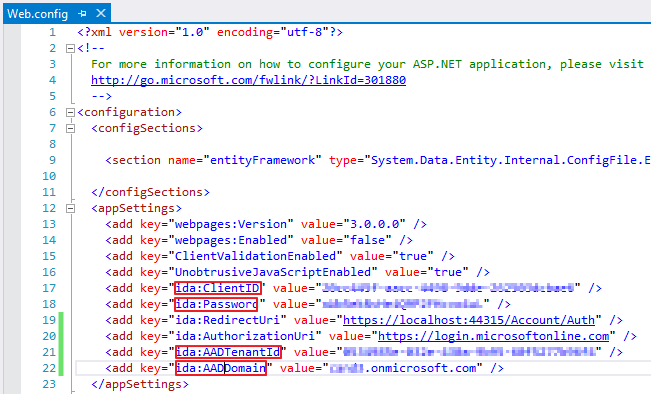

	> **Note:** You can log in https://portal.azure.com and hover the mouse over the account name at the top right corner to get the AADTenantId and AADDomain.

		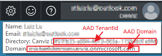
	
4. Create a MVC controller that will be used for all authentication routing for the web application:
  1. Right-click the **Controllers** folder and select **Add/Controller**.
    1. In the **Add Scaffold** dialog, select **MVC 5 Controller - Empty**.
    2. Click **Add**.
    3. When prompted for a name, enter **AccountController**.
    4. Click **Add**.
  2. Within the **AccountController** file, verify the following `using` statements are at the top of the file:

    ````c#
    using System;
    using System.Collections.Generic;
    using System.Linq;
    using System.Security.Claims;
    using System.Threading.Tasks;
    using System.Web;
    using System.Web.Mvc;
    using ClientCredsAddin.Models;
    using ClientCredsAddin.Utils;
    ````

  3. Because apps that use application permissions & the client credentials flow require the global tenant administrator for the Azure AD directory to explicitly grant them access, add a route that will handle the user triggering this request by adding the following code to the **AccountController** class.

 	> **Note:** Upon a successful authentication & granting the consent, redirect the app to **https://[MVC-App-Url-On-Localhost]/Account/Auth**, a route you will implement in a moment.

    ````c#
    public ActionResult AdminConsentApp()
    {
        string authorizationRequest = String.Format(
            "{0}adminconsent?client_id={1}&redirect_uri={2}&state={3}",
                SettingsHelper.AzureADAuthority,
                Uri.EscapeDataString(SettingsHelper.ClientId),
                Uri.EscapeDataString(String.Format("{0}/Account/Auth", this.Request.Url.GetLeftPart(UriPartial.Authority))),
                Uri.EscapeDataString(Guid.NewGuid().ToString())
                );

        return new RedirectResult(authorizationRequest);
    }
    ````

  4. Then you need to implement the route that Azure AD will send the user back to. Go ahead and add the following method to the **AccountController**, even though there will be some reference issues that we will implement in a moment. Take note of the following things:
    - You will create an `AuthHelper` class that will aid in obtaining app-only access tokens.
    - An `AppState` class will be created that will contain the state information for the application & will be kept in a Session. *In a production app you might want to store this data in a server side cache for scalability and performance reasons.* 

    ````c#
    public async Task<ActionResult> Auth()
    {
        var authHelper = new AuthHelper();
        var appState = new AppState();

        // set app as authoirzed
        appState.AppIsAuthorized = true;

        // obtain access token for graph client
        var appOnlyGraphToken = await authHelper.GetAppOnlyAccessToken();
        appState.AppOnlyGraphToken = appOnlyGraphToken;

        // TODO LATER: get all users in the directory

        Session["ClientCredsAddinAppState"] = appState;

        return new RedirectResult("/Mail");
    }
    ````
  
  5. Create the `AuthHelper` utility class that will be used to handle the heavy lifting part of getting access tokens.
    1. Add a new class to the **Utils** folder named **AuthHelper.cs**.
    2. Ensure the following using statements are present at the top of the file:
 
		````c#
		using System;
		using System.Collections.Generic;
		using System.Linq;
		using System.Web;
		using System.Configuration;
		using System.Net.Http.Headers;
		using System.Threading.Tasks;
		using Microsoft.Graph;
		using Microsoft.Identity.Client;
		using Newtonsoft.Json;
		using ClientCredsAddin.Models;
		````

    3. Add the following method to the `AuthHelper` class to obtain an app-only OAuth access token from Azure AD for the specified resource:
       ````c#
       public async Task<string> GetAppOnlyAccessToken()
	   {
	       var clientCredential = new ClientCredential(ConfigurationManager.AppSettings["ida:Password"]);
	
	       // authenticate
	       var authority = string.Format("https://login.microsoftonline.com/{0}/v2.0", SettingsHelper.AzureAdTenantId);
	       var cca = new ConfidentialClientApplication(authority, SettingsHelper.ClientId, SettingsHelper.RedirectUri, clientCredential, null);
	       string[] scopes = { "https://graph.microsoft.com/.default" };
	       var authResult = await cca.AcquireTokenForClient(scopes, null);
	
	       return authResult.Token;
	   }
       ````

    4. Add the following method to the `AuthHelper` class to create GraphServiceClient object:
       ````c#
       public static GraphServiceClient GetGraphServiceClient(string token)
	   {
	       var authenticationProvider = new DelegateAuthenticationProvider(
	           (requestMessage) =>
	           {
	               requestMessage.Headers.Authorization = new AuthenticationHeaderValue("Bearer", token);
	               return Task.FromResult(0);
	           });
	       return new GraphServiceClient(authenticationProvider);
	   }
       ````

  6. Finally, add a class to hold the application state that will be stored in the session state. Add a class named **AppState** to the **Models** folder and replace its content with the following code to:

    ````c#
	using System;
	using System.Collections.Generic;
	using System.Linq;
	using System.Web;
	
	namespace ClientCredsAddin.Models
	{
	    public class AppState
	    {
	        public string TenantId { get; set; }
	        public string TenantDomain { get; set; }
	        public string LoggedOnUser { get; set; }
	        public bool AppIsAuthorized { get; set; }
	        public string AppOnlyGraphToken { get; set; }
	
	        public Dictionary<string, string> MailboxList { get; set; }
	
	        public AppState()
	        {
	            this.AppIsAuthorized = false;
	            this.MailboxList = new Dictionary<string, string>();
	        }
	    }
	}
    ````

### Get Users From Azure AD Directory with App-Only Permissions
With authentication setup with the application in Azure AD and in the ASP.NET MVC web application, you can add the code that will get some data to display in the interface.

1. First create a repository object that will handle retrieving users from the Azure AD directory using the  Microsoft Graph SDK:
  1. Add a new class named **GraphRepository** to the **Models** folder.
  2. Ensure the following `using` statements are present at the top of the file:

    ````c#
    using System;
	using System.Collections.Generic;
	using System.Linq;
	using System.Threading.Tasks;
	using ClientCredsAddin.Utils;
    ````

  3. Next, add the following method in the **GraphRepository** class to retrieve and return a collection of users from the Azure AD directory using the Microsoft Graph SDK:

    ````c#
    public async Task<Dictionary<string, string>> GetUsers(string graphToken)
    {
        var users = await AuthHelper.GetGraphServiceClient(graphToken).Users.Request().GetAsync();
        return users.Where(u => !string.IsNullOrEmpty(u.Mail) && u.Mail.EndsWith(SettingsHelper.AzureAdDomain)).ToDictionary(user => user.Id, user => user.Mail);
    }
    ````

  4. Go back to the **AccountController**. Find the `TODO LATER: get all users in the directory` comment in the `Auth()` route handler. Under this comment, add the following code that will retrieve the users from the directory:

    ````c#    
    var graphRepo = new GraphRepository();
    var users = await graphRepo.GetUsers(appOnlyGraphToken);
    appState.MailboxList = users;
    ````

### Retrieve Any User's Email Messages with App-Only Permissions
Now that you have the users in the directory, you can use the same app-only access token technique to get all the email messages for any user within the directory.

1. Create a repository object that will handle retrieving user messages using the Microsoft Graph SDK:
  1. Add a new class named **MessageRepository** to the **Models** folder.
  2. Ensure the following `using` statements are present at the top of the file:

    ````c#
    using System;
	using System.Collections.Generic;
	using System.Linq;
	using System.Threading.Tasks;
	using ClientCredsAddin.Utils;
    ````

  3. Next, add the following private field and constructor to the `MessageRepository` class to keep the app-only access token when creating the repository object:

    ````c#
    private string _accessToken = null;

    public MessageRepository(string accessToken)
    {
        _accessToken = accessToken;
    }
    ````

  4. Add the following method to retrieve all messages from the specified user's mailbox using the Microsoft Graph SDK:

    ````c#
    public async Task<List<string>> GetMessages(string userId)
    {
        var graphClient = AuthHelper.GetGraphServiceClient(_accessToken);
        var messages = await graphClient.Users[userId].Messages.Request().Top(10).Select("Subject").GetAsync();
        return messages.Select(m => m.Subject).ToList();
    }
    ````

### Display Any User's Emails
The ASP.NET MVC web application now contains all the *worker* code to authenticate, obtain access tokens and retrieve users and messages using different Microsoft Graph SDK APIs. The last step is to create a controller & view that brings it all together.

1. Add a controller to the web application:
  1. Right-click the **Controllers** folder and select **Add/Controller**.
    1. In the **Add Scaffold** dialog, select **MVC 5 Controller - Empty**.
    2. Click **Add**.
    3. When prompted for a name, enter **MailController**.
    4. Click **Add**.
  2. Within the **MailController** file, verify the following `using` statements are at the top of the file:

    ````c#
    using System;
    using System.Collections.Generic;
    using System.Linq;
    using System.Threading.Tasks;
    using System.Web;
    using System.Web.Mvc;
    using ClientCredsAddin.Models;
    using ClientCredsAddin.Utils;
    ````

  3. The first thing you need is a way to handle the admin constent required when using app-only permissions in Azure AD. Do this by adding the following method to the `MailController`. It leverages a custom attribute, `MultipleButton`, that is already present in the project that handles having multiple submit buttons in the view:

    ````c#
    [HttpPost]
    [MultipleButton(Name = "action", Argument = "GoAdminConsent")]
    public ActionResult Authorize()
    {
        return Redirect("/Account/AdminConsentApp");
    }
    ````

2. Add the view that will handle this requirement:
  1. Within the `MailController` class, right click the `View()` at the end of the `Index()` method and select **Add View**.
  2. Within the **Add View** dialog, set the following values:
    1. View Name: **Index**.
    2. Template: **Empty (without model)**.
      
      > Leave all other fields blank & unchecked.
    
  3. Click **Add**.
3. Within the **Views/Mail/Index.cshtml** file, delete all the code in the file and replace it with the following code:

    ````
    @model ClientCredsAddin.Models.MailViewModel
	@{
	    ViewBag.Title = "Index";
	}
	
	<h2>Index</h2>
	
	@if (Model.AppState.AppIsAuthorized == false)
	{
	    using (Html.BeginForm("", "Mail", FormMethod.Post))
	    {
	        <p>Force admin consent:</p>
	        <button type="submit" name="action:GoAdminConsent">Go Admin Consent</button>
	    }
	}
	
	@if (Model.AppState.AppIsAuthorized == true)
	{
	
	    using (Html.BeginForm("", "Mail", FormMethod.Post))
	    {
	        <p>
	            Select a mailbox:<br />
	            @Html.DropDownList("Mailbox", Model.UserListSelectors)
	            <button type="submit" name="action:viewMailboxMessages">View User's Emails</button>
	        </p>
	    }
	
	    if (Model.Messages.Count > 0)
	    {
	        <p>
	            <strong>Selected mailbox messages: </strong> [@Model.SelectedMailbox]<br />
	            <ul>
	                @foreach (var message in Model.Messages)
	                {
	                    <li>@message</li>
	                }
	            </ul>
	        </p>
	    }
	}
    ````

4. Notice that the code you just added to the view uses a custom view model object. Go ahead and add that:
  1. Add a new class named **MailViewModel** to the **Models** folder.
  2. Replace the code in the **MailViewModel** file with the following:

    ````c#
    using System;
	using System.Collections.Generic;
	using System.Linq;
	using System.Web;
	using System.Web.Mvc;
	
	namespace ClientCredsAddin.Models
	{
	    public class MailViewModel
	    {
	        public string SelectedMailbox;
	        public List<string> Messages;
	        public AppState AppState;
	        public List<SelectListItem> UserListSelectors;
	
	        public MailViewModel()
	        {
	            SelectedMailbox = string.Empty;
	            Messages = new List<string>();
	        }
	    }
	}
    ````

5. Implement the default route for the **MailController**:
  1. Go back to the `MailController` class within the **Controllers** folder.
  2. Update `Index()` route with the following code in the `MailController`:

    ````c#
    public ActionResult Index()
    {
        // try to load the app state (set if previously authenticated)
        // if session value not present, create new app state
        var appState = Session["ClientCredsAddinAppState"] as AppState ?? new AppState();

        // create viewmodel for the view
        var viewModel = new MailViewModel
        {
            AppState = appState
        };

        // if logged in, get data and add to view model
        if (appState.AppIsAuthorized)
        {
            // create select list of all users
            viewModel.UserListSelectors = GetMailboxSelectOptions(appState.MailboxList);
        }

        return View(viewModel);
    }
    ````

  3. Add the utility method `GetMailboxSelectOptions()` to the `MailController` class. This will create select box options for the drop down list that you will later add to the view used to select a different mailbox:

    ````c#
    private List<SelectListItem> GetMailboxSelectOptions(Dictionary<string, string> mailboxList)
    {
        return mailboxList.Select(user => new SelectListItem
        {
            Text = user.Value,
            Value = user.Value
        }).ToList();
    }
    ````
6. Last but not least, go back to the `MailController` to add one last method that will handle when the user click the button to fetch the email messages from a user's mailbox:

    ````c#
    [HttpPost]
    [MultipleButton(Name = "action", Argument = "viewMailboxMessages")]
    public async Task<ActionResult> ListEmailMessages()
    {
        var appState = Session["ClientCredsAddinAppState"] as AppState;

        // get requested mailbox
        var requestedMailbox = Request.Form["Mailbox"];

        // build view model
        var viewModel = new MailViewModel
        {
            AppState = appState,
            SelectedMailbox = requestedMailbox,
            UserListSelectors = GetMailboxSelectOptions(appState.MailboxList)
        };

        // get messages
        var repo = new MessageRepository(viewModel.AppState.AppOnlyGraphToken);
        var mailBox = appState.MailboxList.Where(pair => pair.Value == requestedMailbox).FirstOrDefault();
        var results = await repo.GetMessages(mailBox.Key);

        viewModel.SelectedMailbox = requestedMailbox;
        viewModel.Messages = results;

        return View("Index", viewModel);
    }
    ````

7. Test the application by pressing **F5** in Visual Studio or using the **Debug / Start Debugging** menu item.
  1. When the browser launches, click the **Mail** menu item in the top navigation.
  2. Notice no mailboxes are shown because your application is not authenticated. Click the button **Go Admin Consent** to trigger the login & admin consent prompt for the global tenant administrator:

    

  3. Login to Azure AD using the credentials for the global tenant administrator for your Azure AD directory.
  4. Notice that after you successfully login, you are presented with the admin consent screen. This page is telling you the permissions it needs and how broad sweeping the permission request is as indicated by the message *If you agree, this app will have access to the specified resources for all users in your organization. No one else will be prompted.*

    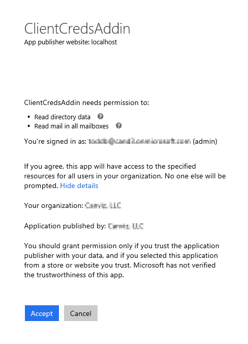

  5. Click **Accept** to grant the app permissions and to go back to your ASP.NET MVC web application.
  6. The app will take you back to the **Mail** controller and display the tenant and logged in user. Notice that it also now has a list of all the users in your directory within the drop down:

    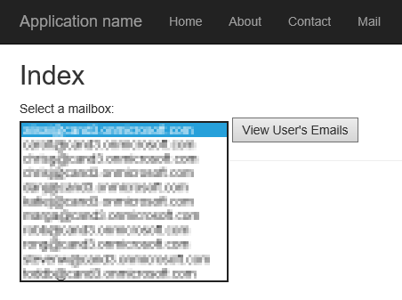

  7. Select one user and click the **View User's Emails** button. The page will reload and show a list of the subject lines of those emails:

    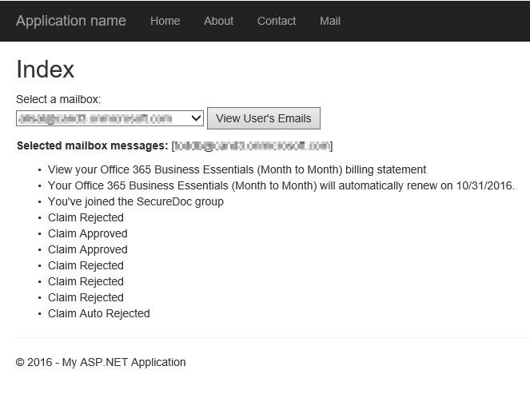

    Notice in the figure above, the currently logged in user's emails are being shown. 

    Now let's see how sweeping app-only permissions are

  8. Change to another user and click the **View User's Emails** button. Notice how you are now reading someone else's emails!

    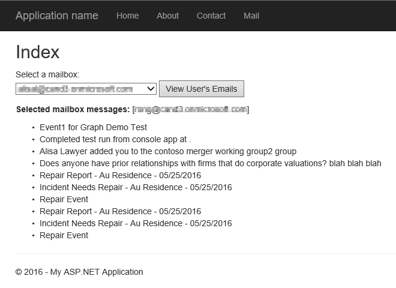

In this exercise you created a new web application and examined the OAuth Client Credentials flow.

**Congratulations! You have completed investigation OAuth in Office 365.**