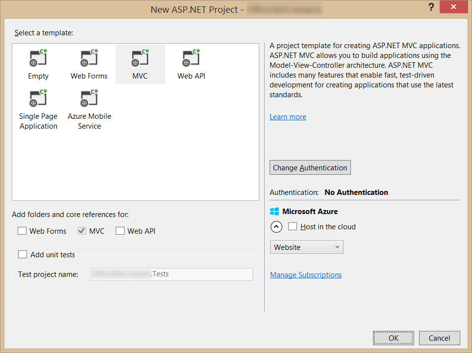
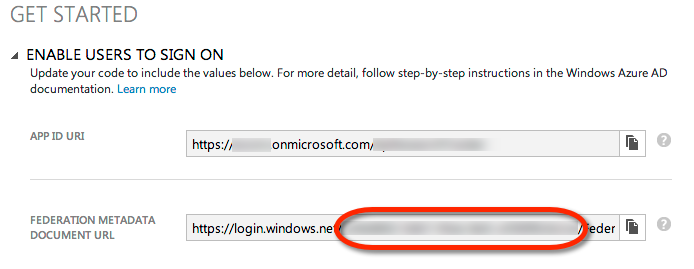
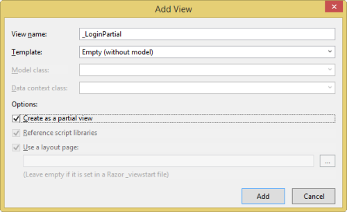
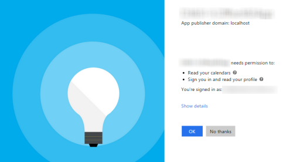
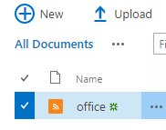
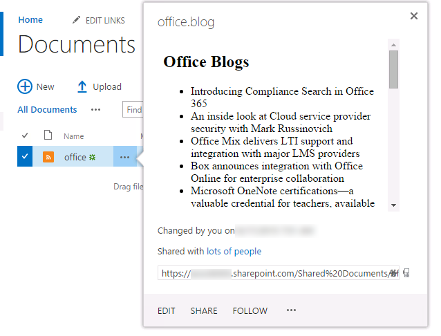
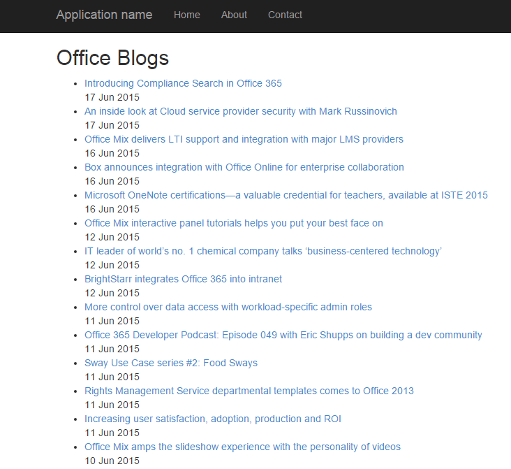

# Deep dive into the Office 365 File Handler Extensibility
In this lab, create a custom file handler to display the latest posts from a blog. This is done by adding a new file with a custom extension (`.rss`) that contains a single URL pointing to the RSS feed for the blog. The file handler will then render the posts from the remote feed in the preview and open views.

## Prerequisites
1. You must have an Office 365 tenant and Microsoft Azure subscription to complete this lab. If you do not have one, the lab for **O3651-7 Setting up your Developer environment in Office 365** shows you how to obtain a trial. You must also have access to an Exchange inbox within an Office 365 developer tenancy.
1. You must have the Office 365 API Tools version 1.3.41104.1 installed in Visual Studio 2013.

## Exercise 1: Create an ASP.NET MVC5 Application
In this exercise, you will create the ASP.NET MVC5 application and register it with Azure active Directory.

1. Launch **Visual Studio 2013** as administrator. 
1. In Visual Studio select **File/New/Project**.
1. In the **New Project** dialog, select **Templates/Visual C#/Web** and click **ASP.NET Web Application**. Name the new project **FileHander** and then click **OK**.  
1. In the **New ASP.NET Project** dialog, click **MVC** and then click **Change Authentication**.
1. Select **No Authentication** and click **OK**.

	

1. Once the **New ASP.NET Project** dialog appears like the following screenshot, click **OK**. 

	

1. Update the web project to use SSL by default:
  1. In the **Solution Explorer** tool window, select the project and look at the **Properties** tool window. 
  1. Change the property **SSL Enabled** to **TRUE**.
  1. Copy the **SSL URL** property to the clipboard for use in the next step.
  1. Save your changes.

    
    > It is important to do this now because in the next step when you create the application in Azure AD, you want the reply URL to use HTTPS. If you did not do this now, you would have to manually make the changes the Visual Studio wizard is going to do for you in creating the app.
    
1. Configure the project to always go to the homepage of the web application when debugging:
  1. In the **Solution Explorer** tool window & select **Properties**.
  1. Select the **Web** tab in the left margin.
  1. Find the section **Start Action**.
  1. Click the radio button **Start URL** and enter the SSL URL of the web project that you copied from the previous step.

1. In the **Solution Explorer**, right click the **FileHandler** project and select **Add/Connected Service**.
	1. In the **Services Manager** dialog:
    1. Click **Register Your App**.
    1. When prompted, login with your **Organizational Account**.
    1. Click **App Properties**.
	    1. Verify the option **Single Organization** is selected.
	    1. Make sure there is only a single URL listed in the **Redirect URIs** and it is the HTTPS URL of the web project.
	    1. Click **Apply**.
    1. Click **Contacts**.
	    1. Click **Permissions**.
	    1. Check **Have full access to users' contacts**.
	    1. Click **Apply**.
    1. Click **Users and Groups**.
	    1. Click **Enable sign-on and read user' profiles**.
	    1. Click **Apply**.
    1. Click **OK**.

1. The permissions necessary for a custom file handler are not present in the tools within Visual Studio, so you need to manually add them using the Azure Management Portal:
  1. Navigate to the Azure Management Portal (https://manage.windowsazure.com), login, select your tenant's Azure AD directory and find the app you created. It is likely named **FileHander.Office365App**.
  1. Scroll down to the **permissions to other applications** section. 
  1. Click the **Add Application** button.
  1. In the **Permissions to other applications** dialog, click the **PLUS** icon next to the **Office 365 Unified API** option.
  1. Click the **CHECK** icon in the lower left corner.
  1. For the new **Office 365 Unitied API** application permission entry, select the **Delegated Permissions** dropdown on the same line and then select the following permissions:
    - Read files that the user selects
    - Read and write files that the user selects
  1. Click the **Save** button at the bottom of the page.

## Exercise 2: Configure Web Application to use Azure AD and OWIN
In this exercise you will take the ASP.NET MVC web application you created in the previous exercise and configure it to use Azure AD & OpenID Connect for user & app authentication. You will do this by utilizing the OWIN framework. Once authenticated, you can use the access token returned by Azure AD to access the Office 365 APIs.

1. Obtain and store the Azure AD tenant ID in the `web.config`.
  1. Browse to the [Azure Management Portal](https://manage.windowsazure.com) and sign in with your **Organizational Account**.
  1. In the left-hand navigation, click **Active Directory**.
  1. Select the directory you share with your Office 365 subscription.
  1. Select the application you created for this lab. This is the name of the application in the **App Properties** dialog when you were adding the **Connected Service** in the last exercise.
  1. Select the **Quick Start** page for the in the top navigation... that's the left-most menu item that looks like a lightning bolt in a cloud:

    
 
  1. On the Quick Start page, expand the **Get Started** / **Enable Users to Sign On**. Locate the field **Federation Metadata Document URL**. Within that field value you will see a GUID immediately after the `login.windows.net` part of the URL. Copy just the GUID value to the clipboard.

    

  1. Open the `web.config` file in the project.
  1. Add the following node to the `<appSettings>` section, setting the value equal to the **directory tenant ID** you acquired in the previous step:

    ````xml
    <add key="ida:TenantId" value="######-####-####-####-############"/>
    ````

1. Now you need a few NuGet packages to enable OWIN OpenID Connect authentication & to create a secure token cache (using Entity Framework) in the application:
  1. Open the Package Manager Console: **View/Other Windows/Package Manager Console**.
  1. Enter each line below in the console, one at a time, pressing **ENTER** after each one. NuGet will install the package and all dependent packages:

    ````powershell
    PM> Install-Package -Id EntityFramework
    PM> Install-Package -Id Microsoft.IdentityModel.Clients.ActiveDirectory
    PM> Install-Package -Id Microsoft.Owin.Host.SystemWeb
    PM> Install-Package -Id Microsoft.Owin.Security.Cookies
    PM> Install-Package -Id Microsoft.Owin.Security.OpenIdConnect
    ````

1. Add a new model that will be used by our persistent token cache:
  1. Right-click **Models** folder in the project and select **Add/Class**.
  1. Name the class **PerWebUserCache.cs**.
  1. When the file has been created, add the following code to the class:

    ````c#
    [Key]
    public int EntryId { get; set; }
    public string webUserUniqueId { get; set; }
    public byte[] cacheBits { get; set; }
    public DateTime LastWrite { get; set; }
    ````

  1. At the top of the file, add the following `using` statement:

    ````c#
    using System.ComponentModel.DataAnnotations;
    ````

1. Add a new persistent data store that will be used for the token cache:
  1. Right-click the project and select **Add/New Folder**.
  1. Name the folder **Data**.
  1. Locate the [Lab Files](Lab Files) folder provided with this lab & find two files: `EFADALContext.cs` & `EFADALInitializer.cs`. Copy these two files to the **Data** folder you just created.

1. Add a token cache that leverages Entity Framework to store the user specific tokens in persistent storage:
  1. Right-click the project and select **Add/New Folder**.
  2. Name the folder **Utils**.
  1. Locate the [Lab Files](Lab Files) folder provided with this lab & find the file `EDADALTokenCache.cs`. Copy that file to the **Utils** folder.
  
    > Take a moment to examine this file. It uses the `DbContext` you added in the previous step to implement a `TokenCache` which you will use in a moment. This will store the token received from a successful authentication in a persistent store.

1. Add a helper class that will be used to harvest settings out of the `web.config` and create the necessary strings that will be used for authentication:
  1. Locate the [Lab Files](Lab Files) folder provided with this lab & find the file `SettingsHelper.cs`. Copy that file to the **Utils** folder.

1. Configure the app to run startup code when the OWIN libraries startup:
  1. Right-click the project and select **Add/Class**.
  1. Name the class **Startup.cs**.
  1. Add the following `using` statements after the existing `using` statements:

    ````c#
    using Owin;
    using Microsoft.Owin;
    ````

  1. Add the following assembly directive to call the `Startup.Configuration()` method when OWIN starts up. Note that you will only point to the class:

    ````c#
    [assembly:OwinStartup(typeof(FileHandler.Startup))]
    ````

  1. Update the signature of the `Startup` class to be a partial class as you will create another in the next step. Do this by adding the `partial` keyword after the `public` statement so it looks like the following:

    ````c#
    public partial class Startup {}
    ````

  1. Add the following `Confguration()` to the `Startup` class. This calls a method you will create in a moment:

    ````c#
    public void Configuration(IAppBuilder app)
    {
      ConfigureAuth(app);
    }
    ````

  1. Save your changes.
1. Create an authentication process when a user hits the website:
  1. Right-click the **App_Start** folder and select **Add/Class**.
  1. Name the class **Startup.Auth.cs**.
  1. When the file opens make the following two changes:
    1. Modify the namespace to just be `FileHandler`.
    1. Modify the class declaration to be a `partial` class named `Startup` so it looks like the following:

      ````c#
      public partial class Startup {}
      ````

  1. Add the following `using` statements after the existing `using` statements:

    ````c#
    using Microsoft.IdentityModel.Clients.ActiveDirectory;
    using Microsoft.Owin.Security;
    using Microsoft.Owin.Security.Cookies;
    using Microsoft.Owin.Security.OpenIdConnect;
    using Owin;
    using System.Configuration;
    using System.Threading.Tasks;
    using FileHandler.Utils;
    ````

  1. Add the following method to the `Startup` class:

    ````c#
    public void ConfigureAuth(IAppBuilder app) {}
    ````

  1. Configure the authentication type and settings for the app:

    ````c#
    app.SetDefaultSignInAsAuthenticationType(CookieAuthenticationDefaults.AuthenticationType);
    app.UseCookieAuthentication(new CookieAuthenticationOptions());
    ````

  1. Now configure the OWIN authentication process, force the user to go through the login process and collect the result returned from Azure AD:

    ````c#
    app.UseOpenIdConnectAuthentication(new OpenIdConnectAuthenticationOptions {
      ClientId = SettingsHelper.ClientId,
      Authority = SettingsHelper.AzureADAuthority,
      Notifications = new OpenIdConnectAuthenticationNotifications() {
        // when an auth code is received...
        AuthorizationCodeReceived = (context) => {
          // get the OpenID Connect code passed from Azure AD on successful auth
          string code = context.Code;

          // create the app credentials & get reference to the user
          ClientCredential creds = new ClientCredential(SettingsHelper.ClientId, SettingsHelper.ClientSecret);
          string userObjectId = context.AuthenticationTicket.Identity.FindFirst(System.IdentityModel.Claims.ClaimTypes.NameIdentifier).Value;

          // use the OpenID Connect code to obtain access token & refresh token...
          //  save those in a persistent store...
          EFADALTokenCache sampleCache = new EFADALTokenCache(userObjectId);
          AuthenticationContext authContext = new AuthenticationContext(SettingsHelper.AzureADAuthority, sampleCache);

          // obtain access token for the AzureAD graph
          Uri redirectUri = new Uri(HttpContext.Current.Request.Url.GetLeftPart(UriPartial.Path));
          AuthenticationResult authResult = authContext.AcquireTokenByAuthorizationCode(code, redirectUri, creds, SettingsHelper.AzureAdGraphResourceId);

          // successful auth
          return Task.FromResult(0);
        },
        AuthenticationFailed = (context) =>
        {
          context.HandleResponse();
          return Task.FromResult(0);
        }
      },
      TokenValidationParameters = new System.IdentityModel.Tokens.TokenValidationParameters
      {
        ValidateIssuer = false
      }
    });
    ````

  1. Save your changes.
1. With the authentication process wired up into the OWIN startup process, now implement a login controller to provide sign in & sign out functionality:
  1. Right-click the **Controllers** folder and select **Add/Controller**.
    1. In the **Add Scaffold** dialog, select **MVC 4 Controller - Empty**.
    1. Click **Add**.
    1. When prompted for a name, enter **AccountController**.
    1. Click **Add**.
  1. Within the **AccountController** file, add the following `using` statements to the top of the file:
  
    ````c#
    using FileHandler.Utils;
    using Microsoft.IdentityModel.Clients.ActiveDirectory;
    using Microsoft.Owin.Security;
    using Microsoft.Owin.Security.Cookies;
    using Microsoft.Owin.Security.OpenIdConnect;
    using System.Security.Claims;
    ````

  1. Delete the default `Index()` method from the `AcountController` class.
  1. Add a new function to provide a sign in route. This will simply initiate a login challenge using the OWIN framework that will take the user to the Azure AD login page. When this runs, if the user has not already given the app consent to access their Office 365 data, they will be prompted to grant the app consent at this time.

    ````c#
    public void SignIn() {
      if (!Request.IsAuthenticated) {
        HttpContext.GetOwinContext().Authentication.Challenge(new AuthenticationProperties { RedirectUri = "/" }, OpenIdConnectAuthenticationDefaults.AuthenticationType);
      }
    }
    ````

  1. Add a new function to provide a sign out route. This will log the user out of the site & clear the local cache of tokes: 

    ````c#
    public void SignOut() {
      // Remove all cache entries for this user and send an OpenID Connect sign-out request.
      string usrObjectId = ClaimsPrincipal.Current.FindFirst(SettingsHelper.ClaimTypeObjectIdentifier).Value;
      AuthenticationContext authContext = new AuthenticationContext(SettingsHelper.AzureADAuthority, new EFADALTokenCache(usrObjectId));
      authContext.TokenCache.Clear();

      HttpContext.GetOwinContext().Authentication.SignOut(
          OpenIdConnectAuthenticationDefaults.AuthenticationType, CookieAuthenticationDefaults.AuthenticationType);
    }
    ````

  1. Add a pair of functions to handle requesting consent for the application.

    ````c#
    public ActionResult ConsentApp() {
      string strResource = Request.QueryString["resource"];
      string strRedirectController = Request.QueryString["redirect"];

      string authorizationRequest = String.Format(
          "{0}oauth2/authorize?response_type=code&client_id={1}&resource={2}&redirect_uri={3}",
              Uri.EscapeDataString(SettingsHelper.AzureADAuthority),
              Uri.EscapeDataString(SettingsHelper.ClientId),
              Uri.EscapeDataString(strResource),
              Uri.EscapeDataString(String.Format("{0}/{1}", this.Request.Url.GetLeftPart(UriPartial.Authority), strRedirectController))
              );

      return new RedirectResult(authorizationRequest);
    }

    public ActionResult AdminConsentApp() {
      string strResource = Request.QueryString["resource"];
      string strRedirectController = Request.QueryString["redirect"];

      string authorizationRequest = String.Format(
          "{0}oauth2/authorize?response_type=code&client_id={1}&resource={2}&redirect_uri={3}&prompt={4}",
              Uri.EscapeDataString(SettingsHelper.AzureADAuthority),
              Uri.EscapeDataString(SettingsHelper.ClientId),
              Uri.EscapeDataString(strResource),
              Uri.EscapeDataString(String.Format("{0}/{1}", this.Request.Url.GetLeftPart(UriPartial.Authority), strRedirectController)),
              Uri.EscapeDataString("admin_consent")
              );

      return new RedirectResult(authorizationRequest);
    }
    ````

  1. Add one more function to the `AccountController` class to refresh the session and reissue the OWIN authentication challenge:
      
    ````c#
    public void RefreshSession() {
      string strRedirectController = Request.QueryString["redirect"];

      HttpContext.GetOwinContext().Authentication.Challenge(new AuthenticationProperties { RedirectUri = String.Format("/{0}", strRedirectController) }, OpenIdConnectAuthenticationDefaults.AuthenticationType);
    }
    ````

  1. Now that the **AccountController** is setup, the last step is to implement the user interface components to provide sign in and sign out capabilities.
    1. Locate the **Views/Shared** folder in the project.
    1. Right-click the folder and select **Add/View**.
    1. Complete the **Add View** dialog as shown in the following picture, then click **Add**:
      
      

    1. Add the following code to the **_LoginPartial.cshtml** file:

      ````asp
      @if (Request.IsAuthenticated) {
        <text>
          <ul class="nav navbar-nav navbar-right">
            <li class="navbar-text">
              Hello, @User.Identity.Name!
            </li>
            <li>
              @Html.ActionLink("Sign out", "SignOut", "Account")
            </li>
          </ul>
        </text>
      } else {
        <ul class="nav navbar-nav navbar-right">
          <li>@Html.ActionLink("Sign in", "SignIn", "Account", routeValues: null, htmlAttributes: new { id = "loginLink" })</li>
        </ul>
      }
      ````

    1. Open the **_Layout.cshtml** file found in the **Views/Shared** folder.
      1. Locate the part of the file that includes a few links at the top of the page... it should look similar to the following code:
      
        ````asp
        <div class="navbar-collapse collapse">
          <ul class="nav navbar-nav">
            <li>@Html.ActionLink("Home", "Index", "Home")</li>
            <li>@Html.ActionLink("About", "About", "Home")</li>
            <li>@Html.ActionLink("Contact", "Contact", "Home")</li>
          </ul>
        </div>
        ````

      1. Update the navigation control to add a reference to the login control you just created:

        ````asp
        <div class="navbar-collapse collapse">
          <ul class="nav navbar-nav">
            <li>@Html.ActionLink("Home", "Index", "Home")</li>
            <li>@Html.ActionLink("About", "About", "Home")</li>
            <li>@Html.ActionLink("Contact", "Contact", "Home")</li>
          </ul>
          @Html.Partial("_LoginPartial")
        </div>
        ````

1. At this point you can test the authentication flow for your application.
  1. In Visual Studio, press **F5**. The browser will automatically launch taking you to the HTTPS start page for the web application.
  1. To sign in, click the **Sign In** link the upper-right corner.
  1. Login using your **Organizational Account**.
  1. Upon a successful login, since this will be the first time you have logged into this app, Azure AD will present you with the common consent dialog that looks similar to the following image:

    

  1. Click **OK** to approve the app's permission request on your data in Office 365.
  1. You will then be redirected back to your web application. However notice in the upper right corner, it now shows your email address & the **Sign Out** link.

Congratulations... at this point your app is configured with Azure AD and leverages OpenID Connect and OWIN to facilitate the authentication process!

## Exercise 3: Code the File Handler
In this exercise, you will write the code to implement the custom file handler.

1. Add a reference to the **System.ServiceModel** assembly:
  1. Right-click the **References** node in the **Solution Explorer window and select **Add Reference**.
  1. Find the assembly **System.ServiceModel** and add it to the project.
1. Add a preview icon for the file handler:
  1. In the **Solution Explorer**, locate the **Content** folder in the **FileHandler** project.
  1. Locate the [Lab Files](Lab Files) folder provided with this lab & find the file `rss.png`. Copy that file to the **Content** folder.
1. Add a class to handle the activation parameters passed in from SharePoint:
  1. In the **Solution Explorer**, locate the **Models** folder in the **FileHandler** project.
  1. Locate the [Lab Files](Lab Files) folder provided with this lab & find the file `ActivationParameters.cs`. Copy that file to the **Models** folder.
1. Add a controller to handle the open and preview actions for the file handler.
  1. In the **Solution Explorer**, locate the **Controllers** folder in the **FileHandler** project.
  1. Right-click the **Controllers** folder and select **Add/Class**.
  1. In the **Add New Item** dialog, name the new class **BlogHandlerController** and click **Add** to create the new source file for the class.  
  1. Ensure the following using statements are listed in the top of the file:

    ````c#
    using System;
    using System.Collections.Generic;
    using System.IO;
    using System.Linq;
    using System.Net;
    using System.Security.Claims;
    using System.ServiceModel.Syndication;
    using System.Threading.Tasks;
    using System.Web;
    using System.Web.Mvc;
    using System.Web.Profile;
    using System.Xml;
    using FileHandler.Models;
    using FileHandler.Utils;
    using Microsoft.IdentityModel.Clients.ActiveDirectory;
        ````

  1. This controller will only be accessible to authenticated users, so decorate it with the **Authorize** attribute as follows:

    ````c#
    [Authorize]
    public class BlogHandlerController :Controller 
    {
    }
    ````

  1. Next, add a method to load the activation parameters that were posted form SharePoint:

    ````c#
    private ActivationParameters LoadActivationParameters()
    {
      ActivationParameters parameters = new ActivationParameters(Request.Form);
      return parameters;
    }
    ````

  1. Add a function that will be called when the preview function is requested:  
    ````c#
    public async Task<ActionResult> Preview() {
      var signInUserId = ClaimsPrincipal.Current.FindFirst(ClaimTypes.NameIdentifier).Value;
      var userObjectId = ClaimsPrincipal.Current.FindFirst(SettingsHelper.ClaimTypeObjectIdentifier).Value;

      var clientCredential = new ClientCredential(SettingsHelper.ClientId, SettingsHelper.ClientSecret);
      var userIdentifier = new UserIdentifier(userObjectId, UserIdentifierType.UniqueId);

      string token = null;
      AuthenticationContext authContext = new AuthenticationContext(SettingsHelper.AzureADAuthority, new EFADALTokenCache(signInUserId));

      // get the activation parameters submitted from SharePoint
      ActivationParameters parameters = this.LoadActivationParameters();

      // get access token for unified api
      var authResult = await authContext.AcquireTokenSilentAsync(parameters.ResourceId, clientCredential, userIdentifier);
      token = authResult.AccessToken;

      // get contents of the file in SharePoint
      HttpWebRequest request = (HttpWebRequest)WebRequest.Create(parameters.FileGet);
      request.Headers.Add(HttpRequestHeader.Authorization, "Bearer " + token);
      Stream responseStream = request.GetResponse().GetResponseStream();
      StreamReader srReader= new StreamReader(responseStream);
      var fileContents = srReader.ReadToEnd();

      // read XML feed
      XmlReader xmlReader = XmlReader.Create(fileContents);
      SyndicationFeed feed = SyndicationFeed.Load(xmlReader);
      xmlReader.Close();

      ViewBag.FeedTitle = feed.Title.Text;
      ViewBag.Posts = feed.Items;
      return View();
    }
    ````

  1. Add a new ASP.NET MVC view for the preview method:
    1. Right-click the `View()` near the end of the `Preview()` method and select **Add View**.
    1. Within the **Add View** dialog, set the following values:
      - **View Name:** Preview
      - **Template:** Empty (without model)
      - Click **Add**.
    1. Within the **Views/BlogHandler/Preview.cshtml** file, delete all the code and replace it with the following:

      ````html
      @model dynamic

      @{
        Layout = null;
      }

      <!DOCTYPE html>
      <html>
      <head>
        <meta charset="utf-8" />
        <meta name="viewport" content="width=device-width, initial-scale=1.0">
      </head>
      <body>

        <h2>@ViewBag.FeedTitle</h2>
        <ul>
          @{
            foreach (var post in ViewBag.Posts) {
              <li>@post.Title.Text</li>
            }
          }
          <li></li>
        </ul>


      </body>
      </html>      
      ````

  1. Add a function that will be called when the open function is requested:  
    ````c#
    public async Task<ActionResult> Open() {
      var signInUserId = ClaimsPrincipal.Current.FindFirst(ClaimTypes.NameIdentifier).Value;
      var userObjectId = ClaimsPrincipal.Current.FindFirst(SettingsHelper.ClaimTypeObjectIdentifier).Value;

      var clientCredential = new ClientCredential(SettingsHelper.ClientId, SettingsHelper.ClientSecret);
      var userIdentifier = new UserIdentifier(userObjectId, UserIdentifierType.UniqueId);

      string token = null;
      AuthenticationContext authContext = new AuthenticationContext(SettingsHelper.AzureADAuthority, new EFADALTokenCache(signInUserId));

      // get the activation parameters submitted from SharePoint
      ActivationParameters parameters = this.LoadActivationParameters();

      // get access token for unified api
      var authResult = await authContext.AcquireTokenSilentAsync(parameters.ResourceId, clientCredential, userIdentifier);
      token = authResult.AccessToken;

      // get contents of the file in SharePoint
      HttpWebRequest request = (HttpWebRequest)WebRequest.Create(parameters.FileGet);
      request.Headers.Add(HttpRequestHeader.Authorization, "Bearer " + token);
      Stream responseStream = request.GetResponse().GetResponseStream();
      StreamReader srReader = new StreamReader(responseStream);
      var fileContents = srReader.ReadToEnd();

      // read XML feed
      XmlReader xmlReader = XmlReader.Create(fileContents);
      SyndicationFeed feed = SyndicationFeed.Load(xmlReader);
      xmlReader.Close();

      ViewBag.FeedTitle = feed.Title.Text;
      ViewBag.Posts = feed.Items;
      return View();
    }
    ````

  1. Add a new ASP.NET MVC view for the preview method:
    1. Right-click the `View()` near the end of the `Open()` method and select **Add View**.
    1. Within the **Add View** dialog, set the following values:
      - **View Name:** Open
      - **Template:** Empty (without model)
      - Click **Add**.
    1. Within the **Views/BlogHandler/Open.cshtml** file, delete all the code and replace it with the following:

      ````html
      @model dynamic

      <h2>@ViewBag.FeedTitle</h2>
      <ul>
        @{
          foreach (var post in ViewBag.Posts) {
            <li>
              <a href="@post.Id">@post.Title.Text</a><br />
              @post.PublishDate.ToString("dd MMM yyyy")
            </li>
          }
        }
        <li></li>
      </ul>
      ````

### Register the File Handler
In order to get Office 365 to call the custom file handler, use the **Add-in Manager for Office 365 / Azure Active Directory**.

1. Navigate to the app: https://addinsmanager.azurewebsites.net/
1. Login using your Office 365 account.
1. Click the **See my File Handlers** button.
1. In the left-hand navigation, select the Azure AD application you created previously in this lab (*FileHandler.Office365App*).
1. Click the link **Register Add-In** and fill in the following fields:
  - **File Extension:** blog
  - **Open Endpoint:** https://localhost:44301/bloghandler/open
  - **Preview Endpoint:** https://localhost:44301/bloghandler/preview
  - **File Icon URI:** https://localhost:44301/content/rss.png
1. Click the button **Update Add-In**.

### Test the File Handler.
The last step is to test the file handler.

1. Press F5 in Visual Studio to start the web application that is used to host the file handler.
1. Create a text file named **office365.blog** and add the following URL to it:

  ````text
  https://blogs.office.com/feed
  ````

1. Navigate & login to a SharePoint site within your Office 365 tenant.
1. Locate a document library and upload the text file **office365.blog**.
1. After uploading the file, notice the icon for your file handler is showing:

  

1. Hover over the file & click the "dot-dot-dot" menu to see the preview handler... it look similar to the following figure that renders a preview of the file.

  

1. Now click the file to open it... you should see the open action for your custom file handler kick in to render the feed:

  

Congratulations! In this exercise you coded, deployed and tested your custom file handler for Office 365.


