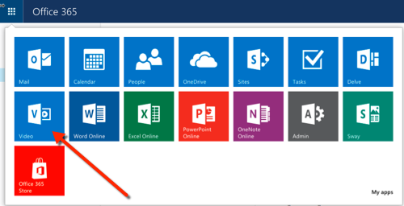
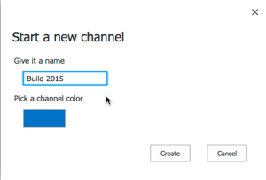
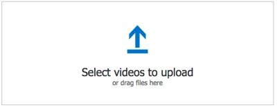
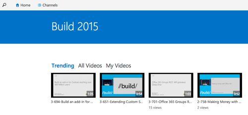
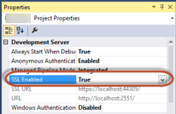
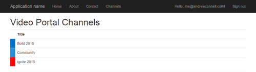
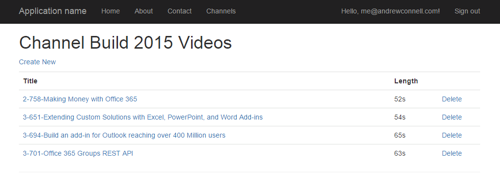
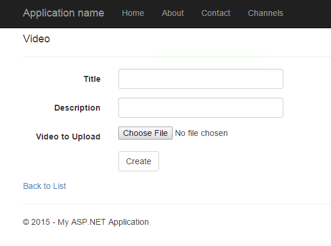
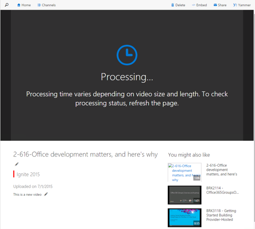

# Deep Dive into the Office 365 Video API
In this lab, you will create channels and upload videos to you Office 365 Video Portal. Then you will use the Video API to browse, upload and delete some videos to your Video Portal using a custom ASP.NET MVC Web application using the Video REST API.

## Prerequisites
1. You must have an Office 365 tenant and Microsoft Azure subscription to complete this lab. If you do not have one, the lab for **O3651-7 Setting up your Developer environment in Office 365** shows you how to obtain a trial. You must also have access to an Exchange inbox within an Office 365 developer tenancy.
1. You must have the Office 365 API Tools version 1.3.41104.1 installed in Visual Studio 2013.

## Other References
- See the [Property-Inspection-Code-Sample](https://github.com/OfficeDev/Property-Inspection-Code-Sample) as another example for working with the Video API.

## Exercise 1: Create Channels and Videos with the Video Portal Web Interface
In this exercise, you will use the Video Portal's Web interface to create some channels and upload some videos that will be used in later exercises in this lab.

1. Open a browser, navigate to https://portal.office.com and login using your Office 365 credentials.
1. Using the waffle menu in the top-left corner, open the App Launcher and select the **Video** tile to navigate to the Video Portal for your tenant.

  

1. Create two new channels:
  1. Click the **Channels** menu item in the top horizontal navigation.
  1. Click the **New Channel** menu item in the top horizontal navigation.
  1. Give the channel a name & assign it a unique color, then click the **Create** button. For this first channel we are using **Build 2015** and the color **blue**:

    

  1. Repeat the process creating a second channel. For the second channel, we used the name **Ignite 2015** and the color **red**.

1. Upload some videos to one of the channels:
  1. On the page that lists the channels, select the first channel.
  1. Click the **Upload** menu item in the top horizontal navigation.
  1. Next, click the icon on the **Select videos to upload** box and select a few videos from your computer to upload.

    

  1. Repeat the process to upload additional videos to the second channel.
  1. Once some videos have been uploaded when you navigate to a channel you should see a list of the videos you uploaded.

    

  > They may take some time to show up while they are processed by the system so be patient. The size of the videos will also impact the time it takes for them to be processed.

In this exercise, you used the Video Portal's Web interface to create channels and upload videos that will be used in later exercises in this lab.

## Exercise 2: Setup and Configure Visual Studio Project
In this exercise, you will take an existing ASP.NET MVC application and make some changes to prepare it to communicate with the Office 365 Video REST API.

1. Locate the Visual Studio solution **VideoApiWeb.sln** located in the [Starter Project](Starter Project) folder in this lab. Open this project in Visual Studio.
1. In the Solution Explorer, right-click the **VideoApiWeb** solution node and select **Manage Nuget Packages for Solution**.
1. Click the **Updates** tab.
1. Select the **Select all Packages** checkbox.
1. Click the **Update** button.
1. Click **OK**.
1. Click **I Accept**.
1. Update the web project to use SSL by default:
  1. In the **Solution Explorer** tool window, select the project and look at the **Properties** tool window. 
  1. Change the property **SSL Enabled** to **TRUE**.
  1. Copy the **SSL URL** property to the clipboard for use in the next step.
  1. Save your changes.

    

    > It is important to do this now because in the next step when you create the application in Azure AD, you want the reply URL to use HTTPS. If you did not do this now, you would have to manually make the changes the Visual Studio wizard is going to do for you in creating the app.
    
1. Configure the project to always go to the homepage of the web application when debugging:
  1. In the **Solution Explorer** tool window & select **Properties**.
  1. Select the **Web** tab in the left margin.
  1. Find the section **Start Action**.
  1. Click the radio button **Start URL** and enter the SSL URL of the web project that you copied from the previous step.

### Create AzureAD Application with Necessary Permissions
1. In the **Solution Explorer**, right click the **Office365Contacts** project and select **Add/Connected Service**.
  1. In the **Services Manager** dialog:
    1. Click **Register Your App**.
    1. When prompted, login with your **Organizational Account**.
    1. Click **App Properties**.
      1. Verify the option **Single Organization** is selected.
      1. Make sure there is only a single URL listed in the **Redirect URIs** and it is the HTTPS URL of the web project.
      1. Click **Apply**.
    1. Click **Users and Groups**.
      1. Click **Enable sign-on and read user' profiles**.
      1. Click **Apply**.
    1. Click **Sites**.
      1. Click **Permissions**.
      1. Check **Create or Delete Items and Lists in All Site Collections**.
      1. Check **Edit or Delete Items in All Site Collections**.
      1. Check **Read Items in All Site Collections**.
      1. Click **Apply**.
    1. Click **OK**.

### Update the web.config with Additional Settings for Azure AD, Office 365 and to Support Large File Uploads

1. Obtain and store the Azure AD tenant ID in the `web.config`.
  1. Browse to the [Azure Management Portal](https://manage.windowsazure.com) and sign in with your **Organizational Account**.
  1. In the left-hand navigation, click **Active Directory**.
  1. Select the directory you share with your Office 365 subscription.
  1. Select the application you created for this lab. This is the name of the application in the **App Properties** dialog when you were adding the **Connected Service** in the last exercise.
  1. Select the **Quick Start** page for the in the top navigation... that's the left-most menu item that looks like a lightning bolt in a cloud:

    
 
  1. On the Quick Start page, expand the **Get Started** / **Enable Users to Sign On**. Locate the field **Federation Metadata Document URL**. Within that field value you will see a GUID immediately after the `login.windows.net` part of the URL. Copy just the GUID value to the clipboard.

    

  1. Open the `web.config` file in the project.
  1. Add the following node to the `<appSettings>` section, setting the value equal to the **directory tenant ID** you acquired in the previous step:

    ````xml
    <add key="ida:AadTenantId" value="######-####-####-####-############"/>
    ````

1. Add your Office 365 tenant name to the `web.config`:
  1. Open the `web.config` file in the project.
  1. Add the following node to the `<appSettings>` section, setting the value equal to the ID of your Office 365 account:

    ````xml
    <add key="ida:O365TenantId" value="######"/>
    ````

    > For example, if the root of your Office 365 tenant is `https://contoso.sharepoint.com`, you would enter **contoso** in this setting.

1. Update the `web.config` to increase the execution timeout and maximum request that can be submitted to the site. *These are needed to programatically upload bigger files for the Video API*:
  1. Open the `web.config` file in the project.
  1. Locate the `<httpRuntime>` node add two attributes, `maxRequestLength` & `executionTimeout` so it looks like the following:

    ````xml
    <httpRuntime targetFramework="4.5" maxRequestLength="1048576" executionTimeout="3600" />
    ````

### Add Helper Classes Used Throughout the Lab
Next, add a few utility classes that will assist in collecting an access token for the Video API:

1. First, add a new folder **JsonHelpers** to the **Models** folder in the project.
1. Add two classes that will be used to deserialize JSON responses from the REST requests using the popular [JSON.NET](http://www.newtonsoft.com/json) to make it easier to work with them in a strongly-typed manner:
  1. Locate the `SpContextInfo.cs` file in the [Lab Files](Lab Files) and copy it into the **Models\JsonHelpers** folder.
  1. Locate the `VideoServiceDiscovery.cs` file in the [Lab Files](Lab Files) and copy it into the **Models\JsonHelpers** folder.

  > These classes were created using the **Paste JSON as Classes** utility in Visual Studio as explain in [this blog post](http://blogs.msdn.com/b/webdev/archive/2012/12/18/paste-json-as-classes-in-asp-net-and-web-tools-2012-2-rc.aspx). First issue a call to the REST API to get a sample response and then use this method to build these utility classes.

1. Locate the file `SpHelper.cs` in the [Lab Files](Lab Files) folder within the lab and copy it into the **Utils** folder within the Visual Studio project.

  > This contains one static methods:
    > * The method **GetVideoPortalUrl()** retrieves the Video Service API root endpoint from your SharePoint tenant in Office 365.

1. Locate the file `AadHelper.cs` in the [Lab Files](Lab Files) folder within the lab and copy it into the **Utils** folder within the Visual Studio project.

  > This contains one static methods:
    > * The method **GetAccessToken()** retrieves an OAuth bearer access token from Azure AD that is used for authenticating HTTP requests to the Video API.

In this exercise, you updated an existing ASP.NET MVC application to prepare it to communicate with the Office 365 Video REST API.


## Exercise 3: Add Channel Controller and View to the Project
In this exercise you will extend the ASP.NET MVC project to add support for browsing the channels in your Office 365 Video Portal.

### Add Utility Classes to the Project
Before adding some methods to retrieve channels, you need to create a few utility classes that are used for various purposes:

1. Add a custom model object class that will be used to bind items to the MVC view:
  1. Right-click the **Models** folder and select **Add/Class**.
  1. In the **Add New Item** dialog, name the new class **VideoChannel.cs**.
  1. Click **Add**.
  1. Update the file to match the same code as shown below:

    ````c#
    namespace VideoApiWeb.Models {
      public class VideoChannel {
        public string Id { get; set; }
        public string HtmlColor { get; set; }
        public string Title { get; set; }
        public string Description { get; set; }
        public string ServerRelativeUrl { get; set; }
      }
    }
    ````

1. Add a JSON deserializer utility class to the project to handle queries to the Video API:
  1. Locate the `VideoChannel.cs` file in the [Lab Files](Lab Files) folder in the lab and add it to the **Models/JsonHelpers** folder.

### Create Channel & Video Repository
Now you will create a repository object that will be used for all data access between the ASP.NET MVC application & the Office 365 REST API.

1. Right-click the **Models** folder and select **Add Class**.
1. Name the class **VideoChannelRepository** and click **OK**.
1. Add the following `using` statements to the top of the file:

  ````c#
  using Newtonsoft.Json;
  using VideoApiWeb.Models.JsonHelpers;
  using VideoApiWeb.Utils;
  ````

1. Add the following global private field & constructor to the newly created **VideoChannelRepository** class. This will setup an HTTP client with some defaults

  ````c#
  private HttpClient _client = null;

  public VideoChannelRepository(string accessToken) {
    _client = new HttpClient();
    _client.DefaultRequestHeaders.Add("Accept", "application/json;odata=verbose");
    _client.DefaultRequestHeaders.Add("Authorization", "Bearer " + accessToken);
  }
  ````

1. Add the following method to the **VideoChannelRepository**. This will query the Video REST API for all available channels and return them back in an alphabetically sorted list:

  ````c#
  public async Task<List<VideoChannel>> GetChannels(bool onlyEditable) {
    var query = onlyEditable
      ? await SpHelper.GetVideoPortalRootUrl() + "/_api/VideoService/CanEditChannels"
      : await SpHelper.GetVideoPortalRootUrl() + "/_api/VideoService/Channels";

    // create request for channels
    HttpRequestMessage request = new HttpRequestMessage(HttpMethod.Get, query);

    // issue request & get response 
    var response = await _client.SendAsync(request);
    string responseString = await response.Content.ReadAsStringAsync();
    // convert response to object
    var jsonResponse = JsonConvert.DeserializeObject<JsonHelpers.VideoChannelCollection>(responseString);

    // convert to model object
    var channels = new List<VideoChannel>();

    foreach (var videoChannel in jsonResponse.Data.Results) {
      var channel = new VideoChannel {
        Id = videoChannel.Id,
        HtmlColor = videoChannel.TileHtmlColor,
        Title = videoChannel.Title,
        Description = videoChannel.Description,
        ServerRelativeUrl = videoChannel.ServerRelativeUrl
      };
      channels.Add(channel);
    }

    return channels.OrderBy(vc => vc.Title).ToList();
  }
  ````

1. Add another method to the **VideoChannelRepository** that will query for a single channel by ID:

  ````c#
  public async Task<VideoChannel> GetChannel(string channelId) {
    var query = string.Format("{0}/_api/VideoService/Channels('{1}')", await SpHelper.GetVideoPortalRootUrl(), channelId);

    // issue request & get response 
    var response = await _client.GetAsync(query);
    string responseString = await response.Content.ReadAsStringAsync();
    // convert response to object
    var jsonResponse = JsonConvert.DeserializeObject<JsonHelpers.VideoChannelSingle>(responseString);

    var channel = new VideoChannel {
      Id = jsonResponse.Data.Id,
      HtmlColor = jsonResponse.Data.TileHtmlColor,
      Title = jsonResponse.Data.Title,
      Description = jsonResponse.Data.Description,
      ServerRelativeUrl = jsonResponse.Data.ServerRelativeUrl
    };

    return channel;
  }
  ````

### Add Channel Controller to Project
1. Right-click the **Controllers** folder and select **Add/Controller**.
  1. In the **Add Scaffold** dialog, select **MVC 5 Controller - Empty**.
  1. Click **Add**.
  1. When prompted for a name, enter **ChannelController**.
  1. Click **Add**.
1. Within the **ChannelController** class, add the following `using` statements to the top of the file:

  ````c#
  using VideoApiWeb.Models;
  using VideoApiWeb.Utils;
  ````

1. Next, update the public signature of the `Index()` method to look like the following to make it an asynchronous method call:

  ````c#
  public async Task<ActionResult> Index()
  ````

1. Make this function support authenticated requests only by adding an `[Authorize]` attribute just before the function.
1. Finally, add the following code to the `Index()` method to call the repository to get all the channels and return to them to the view:

  ````c#
  var accessToken = await AadHelper.GetAccessToken();
  var repo = new VideoChannelRepository(accessToken);

  var channels = await repo.GetChannels(false);

  return View(channels);
  ````

### Add Channel List View to Project
1. Within the `ChannelController` class, right click the `View()` at the end of the `Index()` method and select **Add View**.
  1. Within the **Add View** dialog, set the following values:
    - View Name: **Index**.
    - Template: **List**.
    - Model class: **VideoChannel (VideoApiWeb.Modules)**.
    - Data context class: <blank>
    - Create as partial view: **checked**
    - Reference script libraries: **unchecked**
  1. Click **Add**.
1. **Replace** all of the code in the file with the following:

  ````html
  @model IEnumerable<VideoApiWeb.Models.VideoChannel>

  <h1>Video Portal Channels</h1>

  <table class="table">
    <tr>
      <th></th>
      <th>
        @Html.DisplayNameFor(model => model.Title)
      </th>
      <th></th>
    </tr>

    @foreach (var item in Model) {
      <tr>
        <td style="width: 20px; background-color: @item.HtmlColor">&nbsp;</td>
        <td>
          @item.Title
          <br /><em>@Html.DisplayFor(modelItem => item.Description)</em>
        </td>
        <td>
        </td>
      </tr>
    }
  </table>
  ````

1. Update the Web application's navigation:
  1. Open the `_Layout.cshtml` file in the **Views/Shared** folder.
  1. Locate the navigation section that looks like the following:

    ````html
    <li>@Html.ActionLink("Home", "Index", "Home")</li>
    <li>@Html.ActionLink("About", "About", "Home")</li>
    <li>@Html.ActionLink("Contact", "Contact", "Home")</li>
    ````

  1. Add another list item to point to the new controller:
  
    ````html
    <li>@Html.ActionLink("Channels", "Index", "Channel")</li>
    ````

### Test the Channel Controller
1. Press **F5** to begin debugging.
1. When the web application loads, click the **Sign In** link in the top right navigation.
1. Once you've successfully signed into AzureAD, you will be taken back to your application. Click the **Channels** link in the navigation and after a few seconds you should see a list of your channels:

  

In this exercise you extended the ASP.NET MVC project to add support for browsing the channels in your Office 365 Video Portal.

## Exercise 4: Add Video Controller and View to the Project
In this exercise you will extend the ASP.NET MVC project to add support for browsing all the videos as well as adding and deleting videos from your Video Portal using the Video REST API.

1. First, add a new route setting to the routing configuration for the application:
  1. Open the `RouteConfig.cs` file within the **App_Start** folder.
  1. Add the following code to the `RegisterRoutes()` method, after the existing `MapRoute()` call:

    ````c#
    routes.MapRoute(
      name: "ChannelVideos",
      url: "Channel/{channelId}/Videos/{action}/{videoId}",
      defaults: new { controller="Video", videoId = UrlParameter.Optional }
      );
    ````

### Add Utility Classes to the Project
Before adding some methods to retrieve channels, you need to create a few utility classes that are used for various purposes:

1. Add a custom model object class that will be used to represent videos:
  1. Right-click the **Models** folder and select **Add/Class**.
  1. In the **Add New Item** dialog, name the new class **Video.cs**.
  1. Click **Add**.
  1. Update the file to match the same code as shown below:

    ````c#
    using System;
    using System.Collections.Generic;
    using System.Linq;
    using System.Web;

    namespace VideoApiWeb.Models {
      public class Video {
        public string ChannelId { get; set; }
        public string VideoId { get; set; }
        public string Title { get; set; }
        public string Description { get; set; }
        public int DurationInSeconds { get; set; }
        public string DisplayFormUrl { get; set; }
        public string FileName { get; set; }
        public byte[] FileContent { get; set; }
      }
    }
    ````

 1. Add a custom model object class that will be used to bind to the MVC view:
  1. Right-click the **Models** folder and select **Add/Class**.
  1. In the **Add New Item** dialog, name the new class **VideoListViewModel.cs**.
  1. Click **Add**.
  1. Update the file to match the same code as shown below:

    ````c#
    using System;
    using System.Collections.Generic;
    using System.Linq;
    using System.Web;

    namespace VideoApiWeb.Models {
      public class VideoListViewModel {
        public string ChannelId { get; set; }
        public string ChannelTitle { get; set; }
        public List<Video> Videos { get; set; } 
      }
    }
    ````

  1. Add a JSON deserializer utility class to the project to handle queries to the Video API:
    1. Locate the `ChannelVideos.cs` file in the [Lab Files](Lab Files) folder in the lab and add it to the **Models/JsonHelpers** folder.
  1. Add a JSON deserializer utility class to the project to submit new videos to the Video API:
    1. Locate the `NewVideoPlayload.cs` file in the [Lab Files](Lab Files) folder in the lab and add it to the **Models/JsonHelpers** folder.

### Update Channel & Video Repository
Now you will update the repository object you created previously that is used for all data access between the ASP.NET MVC application & the Office 365 REST API.

1. Open the file `VideoChannelRepository.cs` found within the **Models** folder.
1. Add the following method that will get a list of all videos in the specified channel:

  ````c#
  public async Task<List<Video>> GetChannelVideos(string channelId) {
    // create request for videos
    var query = string.Format("{0}/_api/VideoService/Channels('{1}')/Videos",
      await SpHelper.GetVideoPortalRootUrl(), channelId);

    // issue request & get response 
    var response = await _client.GetAsync(query);
    string responseString = await response.Content.ReadAsStringAsync();
    // convert response to object
    var jsonResponse = JsonConvert.DeserializeObject<JsonHelpers.ChannelVideosCollection>(responseString);

    // convert to model object
    var videos = new List<Video>();

    foreach (var channelVideo in jsonResponse.Data.Results) {
      var video = new Video {
        ChannelId = channelId,
        VideoId = channelVideo.ID,
        Title = channelVideo.Title,
        DisplayFormUrl = channelVideo.DisplayFormUrl,
        DurationInSeconds = channelVideo.VideoDurationInSeconds
      };
      videos.Add(video);
    }

    return videos.OrderBy(v => v.Title).ToList();
  }
  ````

1. Add the following method that will upload a new video to a channel. This method does two things:
  - It first creates a new video object in the Video Portal without the file. This acts as a placeholder to upload the video to.
  - It then uploads a video to the Video Portal in 2MB chunks, adding it to the placeholder record previously created.

    ````c#
    public async Task UploadVideo(Video video) {
      var videoServiceUrl = await SpHelper.GetVideoPortalRootUrl();

      // create new video object
      var newVideo = new JsonHelpers.NewVideoPayload {
        Title = video.Title,
        Description = video.Description,
        FileName = video.FileName,
        Metadata = new NewVideoPayloadMetadata { Type = "SP.Publishing.VideoItem" }
      };
      var newVideoJson = JsonConvert.SerializeObject(newVideo, Formatting.None, new JsonSerializerSettings { NullValueHandling = NullValueHandling.Ignore });

      // create video placeholder
      var placeholderRequestQuery = string.Format("{0}/_api/VideoService/Channels('{1}')/Videos", videoServiceUrl, video.ChannelId);
      var placeholderRequestBody = new StringContent(newVideoJson);
      placeholderRequestBody.Headers.ContentType = MediaTypeHeaderValue.Parse("application/json;odata=verbose");

      // issue request & get response 
      var createPlaceholderResponse = await _client.PostAsync(placeholderRequestQuery, placeholderRequestBody);
      string createPlaceholderResponseString = await createPlaceholderResponse.Content.ReadAsStringAsync();
      // convert response to object
      var jsonResponse = JsonConvert.DeserializeObject<JsonHelpers.ChannelVideosSingle>(createPlaceholderResponseString);


      // upload video
      const int fileUploadChunkSize = 2 * 1024 * 1024; // upload 2MB chunks
      long fileBytesUploaded = 0;
      bool canContinue = true;
      var fileUploadSessionId = Guid.NewGuid().ToString();

      string uploadVideoEndpoint = string.Format("{0}/_api/VideoService/Channels('{1}')/Videos('{2}')/GetFile()/StartUpload(uploadId=guid'{3}')",
                                      videoServiceUrl,
                                      video.ChannelId,
                                      jsonResponse.Data.ID,
                                      fileUploadSessionId);

      using (HttpResponseMessage startResponseMessage = await _client.PostAsync(uploadVideoEndpoint, null)) {
        canContinue = startResponseMessage.IsSuccessStatusCode;
      }

      // upload all but the last chunk
      var totalChunks = Math.Ceiling(video.FileContent.Length / (double)fileUploadChunkSize);
      while (fileBytesUploaded < fileUploadChunkSize * (totalChunks - 1)) {
        if (!canContinue) { break; }

        // read file in
        using (var videoFileReader = new BinaryReader(new MemoryStream(video.FileContent))) {
          // advance to the part of the video to show
          videoFileReader.BaseStream.Seek(fileBytesUploaded, SeekOrigin.Begin);

          // get a slice of the file to upload
          var videoSlice = videoFileReader.ReadBytes(Convert.ToInt32(fileUploadChunkSize));

          // upload slice
          string chunkUploadUrl = string.Format("{0}/_api/VideoService/Channels('{1}')/Videos('{2}')/GetFile()/ContinueUpload(uploadId=guid'{3}',fileOffset='{4}')",
                                    videoServiceUrl,
                                    video.ChannelId,
                                    jsonResponse.Data.ID,
                                    fileUploadSessionId, fileBytesUploaded);
          using (var fileContent = new StreamContent(new MemoryStream(videoSlice))) {
            using (HttpResponseMessage uploadResponseMessage = await _client.PostAsync(chunkUploadUrl, fileContent)) {
              canContinue = uploadResponseMessage.IsSuccessStatusCode;
              fileBytesUploaded += fileUploadChunkSize;
            }
          }
        }
      }

      // upload last chunk
      if (canContinue) {
        var lastBytesToUpload = video.FileContent.Length - fileBytesUploaded;
        using (var videoFileReader = new BinaryReader(new MemoryStream(video.FileContent))) {
          // jump to the part of the file to upload
          videoFileReader.BaseStream.Seek(fileBytesUploaded, SeekOrigin.Begin);

          // get the last slice of file to upload
          var videoSlice = videoFileReader.ReadBytes(Convert.ToInt32(lastBytesToUpload));
          string chunkUploadUrl = string.Format("{0}/_api/VideoService/Channels('{1}')/Videos('{2}')/GetFile()/FinishUpload(uploadId=guid'{3}',fileOffset='{4}')",
                                    videoServiceUrl,
                                    video.ChannelId,
                                    jsonResponse.Data.ID,
                                    fileUploadSessionId, fileBytesUploaded);
          using (var fileContent = new StreamContent(new MemoryStream(videoSlice))) {
            using (HttpResponseMessage uploadResponseMessage = await _client.PostAsync(chunkUploadUrl, fileContent)) {
              canContinue = uploadResponseMessage.IsSuccessStatusCode;
              fileBytesUploaded += fileUploadChunkSize;
            }
          }
        }
      }
    }
    ````

1. Lastly, add the following method that will delete the specified video in the specified channel:

  ````c#
  public async Task DeleteChannelVideo(string channelId, string videoId) {
    var videoServiceUrl = await SpHelper.GetVideoPortalRootUrl();

    // create request for videos
    var query = string.Format("{0}/_api/VideoService/Channels('{1}')/Videos('{2}')", await SpHelper.GetVideoPortalRootUrl(), channelId, videoId);

    // set request header method
    _client.DefaultRequestHeaders.Add("X-HTTP-Method", "DELETE");

    // issue request
    await _client.PostAsync(query, null);
  }
  ````

### Create a Video Controller
Create a controller for handing the listing, creation and deleting of videos in the Video Portal.

1. Right-click the **Controllers** folder and select **Add/Controller**.
  1. In the **Add Scaffold** dialog, select **MVC 5 Controller - Empty**.
  1. Click **Add**.
  1. When prompted for a name, enter **VideoController**.
  1. Click **Add**.
1. Within the **VideoController** class, add the following `using` statements to the top of the file:

  ````c#
  using VideoApiWeb.Models;
  using VideoApiWeb.Utils;
  ````

1. Replace the default `Index()` method with the following method. This method is asynchronous and requires the user to be authenticated. It first gets an access token & then collects information about the current channel and all videos in the channel. Finally, it creates a new view model object and sets some values used int he view before returning it to the view:

  ````c#
  [Authorize]
  public async Task<ActionResult> Index(string channelId) {
    var accessToken = await AadHelper.GetAccessToken();
    var repo = new VideoChannelRepository(accessToken);

    var channel = await repo.GetChannel(channelId);
    var videos = await repo.GetChannelVideos(channelId);

    var viewModel = new VideoListViewModel {
      ChannelId = channelId,
      ChannelTitle = channel.Title,
      Videos = videos
    };

    return View(viewModel);
  }
  ````

1. Next, add two methods to handle the creation of a video to the **VideoController** class. The first method will handle the request to create that will simply display the creation form. The second method handles the submission of the create form:

  ````c#
  [Authorize]
  [HttpGet]
  public async Task<ActionResult> Create(string channelId) {
    var video = new Video {
      ChannelId = channelId
    };

    return View(video);
  }

  [Authorize]
  [HttpPost]
  [ValidateAntiForgeryToken]
  public async Task<ActionResult> Create([Bind(Include = "ChannelId,Title,Description")] Video video, HttpPostedFileBase upload) {
    var accessToken = await AadHelper.GetAccessToken();
    var repo = new VideoChannelRepository(accessToken);

    // if a file is uploaded, add to video & upload
    if (upload != null && upload.ContentLength > 0) {
      video.FileName = upload.FileName;
      using (var reader = new System.IO.BinaryReader(upload.InputStream)) {
        video.FileContent = reader.ReadBytes(upload.ContentLength);
      }

      await repo.UploadVideo(video);
    }

    return RedirectToRoute("ChannelVideos", new RouteValueDictionary(new { channelId = video.ChannelId, action = "Index" }));
  }
  ````

1. Finally, to handle the deleting of a video, add the following method to the **VideoController** class. This will delete the specified video in the specified channel:

  ````c#
  [Authorize]
  public async Task<ActionResult> Delete(string channelId, string videoId) {
    var accessToken = await AadHelper.GetAccessToken();
    var repo = new VideoChannelRepository(accessToken);

    if (channelId != null && videoId != null) {
      await repo.DeleteChannelVideo(channelId, videoId);
    }

    // if channelid provided, use this
    if (channelId != null) {
      return RedirectToRoute("ChannelVideos", new RouteValueDictionary(new { channelId = channelId, action = "Index" }));
    } else {
      return RedirectToRoute("Default", new { controller = "Channel", action = "Index" });
    }
  }
  ````

1. Because this web application will use the antiforgery token when creating videos, you need to make sure the unique ID used by the token is a value in the user claim. This should be explicitly set so you don't assume the default one is there.
  1. Open the `global.asax.cs` file in your project.
  1. Add the following two statements to the end of the existing `using` statements:
    
    ````c#
    using System.Web.Helpers;
    using System.IdentityModel.Claims;
    ````

  1. Next, add the following line to the end of the `Application_Start()` method:
  
    ````c#
    AntiForgeryConfig.UniqueClaimTypeIdentifier = ClaimTypes.NameIdentifier;
    ````

## Add Video List & Creation Views to the Project.
1. Within the `VideoController` class, right click the `View()` at the end of the `Index()` method and select **Add View**.
  1. Within the **Add View** dialog, set the following values:
    - View Name: **Index**.
    - Template: **List**.
    - Model class: **VideoListViewModel (VideoApiWeb.Modules)**.
    - Data context class: <blank>
    - Create as partial view: **checked**
    - Reference script libraries: **unchecked**
  1. Click **Add**.
1. **Replace** all of the code in the file **Views\Videos\Index.cshtml** with the following:

  ````html
  @model VideoApiWeb.Models.VideoListViewModel

  <h1>Channel @Model.ChannelTitle Videos</h1>
  <p>
    @Html.ActionLink("Create New", "Create", new { channelId = Model.ChannelId})
  </p>
  <table class="table">
    <tr>
      <th>
        Title
      </th>
      <th>
        Length
      </th>
      <th></th>
    </tr>

    @foreach (var item in Model.Videos) {
      <tr>
        <td>
          <a href="@item.DisplayFormUrl">@item.Title</a>
        </td>
        <td>
          @Html.DisplayFor(modelItem => item.DurationInSeconds)s
        </td>
        <td>
          @Html.ActionLink("Delete", "Delete", new { channelId= item.ChannelId, videoId = item.VideoId })
        </td>
      </tr>
    }
  </table>
  ````

1. Within the `VideoController` class, right click the `View()` at the end of the `Index()` method and select **Add View**.
  1. Within the **Add View** dialog, set the following values:
    - View Name: **Index**.
    - Template: **Create**.
    - Model class: **Video (VideoApiWeb.Modules)**.
    - Data context class: <blank>
    - Create as partial view: **checked**
    - Reference script libraries: **unchecked**
  1. Click **Add**.
1. **Replace** all of the code in the file **Views\Videos\Index.cshtml** with the following:

  ````html
  @model VideoApiWeb.Models.Video

  @using (Html.BeginForm(Html.BeginForm("Create", "Video", null, FormMethod.Post, new {enctype = "multipart/form-data"}))) {
    @Html.AntiForgeryToken()

    <div class="form-horizontal">
      <h4>Video</h4>
      <hr />
      @Html.ValidationSummary(true, "", new { @class = "text-danger" })
      @Html.HiddenFor(model => model.ChannelId)

      <div class="form-group">
        @Html.LabelFor(model => model.Title, htmlAttributes: new { @class = "control-label col-md-2" })
        <div class="col-md-10">
          @Html.EditorFor(model => model.Title, new { htmlAttributes = new { @class = "form-control" } })
          @Html.ValidationMessageFor(model => model.Title, "", new { @class = "text-danger" })
        </div>
      </div>

      <div class="form-group">
        @Html.LabelFor(model => model.Description, htmlAttributes: new { @class = "control-label col-md-2" })
        <div class="col-md-10">
          @Html.EditorFor(model => model.Description, new { htmlAttributes = new { @class = "form-control" } })
          @Html.ValidationMessageFor(model => model.Description, "", new { @class = "text-danger" })
        </div>
      </div>

      <div class="form-group">
        @Html.Label("Video to Upload", new { @class = "control-label col-md-2" })
        <div class="col-md-10">
          <input type="file" id="Video" name="upload" />
        </div>
      </div>

      <div class="form-group">
        <div class="col-md-offset-2 col-md-10">
          <input type="submit" value="Create" class="btn btn-default" />
        </div>
      </div>
    </div>
  }

  <div>
    @Html.ActionLink("Back to List", "Index")
  </div>
  ````

1. Lastly, go back to the index view for the channel route (**Views\Channel\Index.cshtml**) and find the last empty table cell in the view. Update it to include the following link so users can navigate from a channel to the list of videos int he channel:

  ````html
  @Html.RouteLink("Videos", "ChannelVideos", new { channelId = item.Id, action = "Index" }, null)
  ````

### Test the Channel Controller
1. Press **F5** to begin debugging.
1. When the web application loads, click the **Sign In** link in the top right navigation.
1. Once you've successfully signed into AzureAD, you will be taken back to your application. Click the **Channels** link in the navigation and after a few seconds you should see a list of your channels:
1. Then click the **Videos** link to see a list of all the videos in that channel.

  

1. Now try uploading a video. Click the **Create new** link and upload a video. 

  

  > For this lab, it's recommend trying to upload a small video, one less than 10 MB as this lab was written to upload the video in one chunk. The API does support uploading chunks, but this lab was written to upload a single chunk for simplicity. Refer to the Video REST API for more information on uploading chunks.

1. Once the video has uploaded you will be taken to the video list page. If you click on the video you just uploaded, you will be taken it's page in the Video Portal:

  

1. Go back to the list of all the videos in a channel and click the **Delete** link next to the video you uploaded. Within a few seconds you should see the video is deleted and removed from the list.

In this exercise you extended the ASP.NET MVC project to add support for browsing all the videos as well as uploading and deleting videos from your Video Portal using the Video REST API.