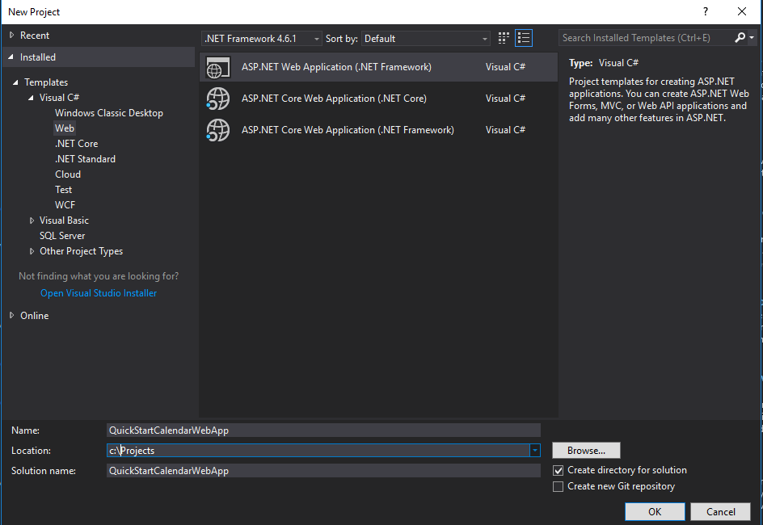
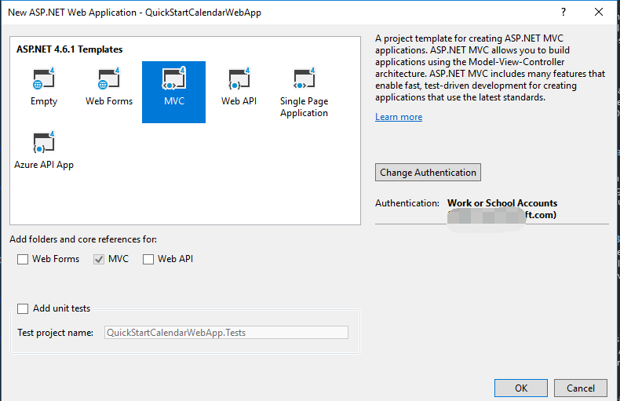
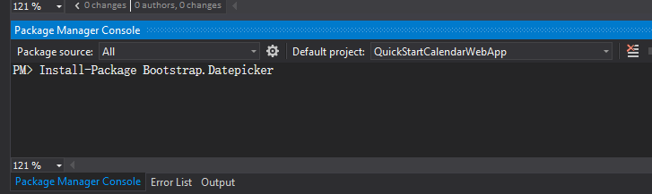

# Microsoft Graph for Calendar
In this lab, you will use the Microsoft Graph SDK to work with Office 365 calendars as part of an ASP.NET MVC5 application.

## Prerequisites
1. You must have an Office 365 tenant and Microsoft Azure subscription to complete this lab. If you do not have one, the lab for **O3651-7 Setting up your Developer environment in Office 365** shows you how to obtain a trial. 
2. You must have Visual Studio 2017.

## Lab Setup: Setting up your Exchange account with Sample Calendar Events for Testing
1. Using the browser, navigate to https://outlook.office365.com and log into your Office 365 mailbox.
2. Click the *waffle* icon in the top-left corner to open the App Launcher and click the **Calendar** tile.
3. Add some calendar items to your calendar if you don't have any in your mailbox.
4. Once you have verified that you have a set of calendar events for testing, you can move on to the next exercise.

## Exercise 1: Create an ASP.NET MVC5 Application
In this exercise, you will create the ASP.NET MVC5 application and register it with Azure active Directory.
1. Launch **Visual Studio 2017** as administrator.

2. In Visual Studio, click **File/New/Project**.

3. In the **New Project** dialog.

4. Select **Templates/Visual C#/Web**.

5. Select **ASP.NET Web Application**.

  

  Give the project the name **QuickStartCalendarWebApp** and Click **OK**.

6. In the **New ASP.NET Project** dialog

7. Click **MVC**.

8. Click **Change Authentication**.

9. Select **Work And School Accounts**.

10. Select **Cloud - Single Organization**

11. Input **Domain** of your O365 tenancy

12. Check **Read directory data** under Directory Access Permissions

13. Click **OK**.

   

   

14. Ensure the web project uses SSL by default:

15. In the **Solution Explorer** tool window, select the project and look at the **Properties** tool window. 

16. Ensure **SSL Enabled** is set to **TRUE**.

17. Copy the **SSL URL** property to the clipboard for use in the next step.

   
   > It is important to do this now because in the next step when you create the application in Azure AD, you want the reply URL to use HTTPS. If you did not do this now, you would have to manually make the changes the Visual Studio wizard is going to do for you in creating the app.

18. At this point you can test the authentication flow for your application.

19. In Visual Studio, press **F5**. The browser will automatically launch taking you to the HTTPS start page for the web application.

20. To sign in, click the **Sign In** link in the upper-right corner.

21. Login using your **Organizational Account**.

22. Upon a successful login, since this will be the first time you have logged into this app, Azure AD will present you with the common consent dialog that looks similar to the following image:


25. Click **Accept** to approve the app's permission request on your data in Office 365.
26. You will then be redirected back to your web application. However notice in the upper right corner, it now shows your email address & the **Sign Out** link.

Congratulations... at this point your app is configured with Azure AD and leverages OpenID Connect and OWIN to facilitate the authentication process!

27. Open the **Web.config** file and find the **appSettings** element. This is where you will need to add your appId and app secret you will generate in the next step.
28. Launch the Application Registration Portal by navigating your web browser and going to **apps.dev.microsoft.com**. to register a new application.
29. Sign into the portal using your Office 365 username and password.
30. Click **Add an App** and type **GraphCalendarQuickStart** for the application name.
31. Copy the **Application Id** and paste it into the value for **ida:AppId** in your project **web.config** file.
32. Under **Application Secrets** click **Generate New Password** to create a new client secret for your app.
33. Copy the displayed app password and paste it into the value for **ida:AppSecret** in your project **web.config** file.
34. Modify the **ida:AppScopes** value to include the required `https://graph.microsoft.com/calendars.readwrite` and `https://graph.microsoft.com/calendars.read` scopes.

```
<configuration>
  <appSettings>
    <!-- ... -->
    <add key="ida:AppId" value="paste application id here" />
    <add key="ida:AppSecret" value="paste application password here" />
    <!-- ... -->
    <!-- Specify scopes in this value. Multiple values should be comma separated. -->
    <add key="ida:AppScopes" value="https://graph.microsoft.com/calendars.read,https://graph.microsoft.com/calendars.readwrite" />
  </appSettings>
  <!-- ... -->
</configuration>
```

35. Add a redirect URL to enable testing on your localhost.
36. Right-click **QuickStartCalendarWebApp** and click **Properties** to open the project properties.
37. Click **Web** in the left navigation.
38. Copy the **Project Url** value.
39. Back on the Application Registration Portal page, click **Add Platform>Web**.
40. Paste the value of **Project Url** into the **Redirect URIs** field.
41. Scroll to the bottom of the page and click **Save**.
42. Press **F5** to compile and launch your new application in the default browser.

## Exercise 2: Access Calendar through Microsoft Graph SDK

In this exercise you will take the ASP.NET MVC web application you created in the previous exercise and configure it to use Azure AD & OpenID Connect for user & app authentication. You will do this by utilizing the OWIN framework. Once authenticated, you can use the access token returned by Azure AD to access the Microsoft Graph.

1. This exercise is based on the project located in the  **\\O3653\O3653-13 Deep Dive into Office 365 with the Microsoft Graph API for Calendar\Starter Project** folder. Open the project with Visual Studio 2017. 

   Notice: update web.config and add values for below items.  These values can be found on Exercise 1's web.config.

   ```
   <add key="ida:ClientId" value="" />
   <add key="ida:ClientSecret" value="" />
   <add key="ida:Domain" value="" />
   <add key="ida:TenantId" value="" />
   <add key="ida:AppId" value="" />
   <add key="ida:AppSecret" value="" />
   <add key="ida:PostLogoutRedirectUri" value="" />
   ```

2. In Visual Studio, right-click **QuickStartCalendarWebApp** > **Properties** to open the project properties. Click **Web** in the left navigation. Make sure **Project URL** is the same as Exercise 1.

3. Update **_Layout** file to add **Outlook Calendar API** link:

4. Open the **_Layout.cshtml** file found in the **Views/Shared** folder.

  Locate the part of the file that includes a few links at the top of the page... it should look similar to the following code:

  ```
  <div class="navbar-collapse collapse">
    <ul class="nav navbar-nav">
      <li>@Html.ActionLink("Home", "Index", "Home")</li>
      <li>@Html.ActionLink("About", "About", "Home")</li>
      <li>@Html.ActionLink("Contact", "Contact", "Home")</li>
    </ul>
    @Html.Partial("_LoginPartial")
  </div>
  ```

  Update that navigation to have a new link (the **Outlook Calendar API** link added below) as well as a reference to the login control you just created:

  ```
  <div class="navbar-collapse collapse">
    <ul class="nav navbar-nav">
      <li>@Html.ActionLink("Home", "Index", "Home")</li>
      <li>@Html.ActionLink("About", "About", "Home")</li>
      <li>@Html.ActionLink("Contact", "Contact", "Home")</li>
      <li>@Html.ActionLink("Outlook Calendar API", "Index", "Calendar")</li>
    </ul>
    @Html.Partial("_LoginPartial")
  </div>
  ```

  ​

### Create the Calendar controller and use the Graph SDK

1. Add a reference to the Microsoft Graph SDK to your project.

   1. In the **Solution Explorer** right-click the **QuickStartCalendarWebApp** project and select **Manage NuGet Packages...**.
   2. Click **Browse** and search for **Microsoft.Graph**.
   3. Select the Microsoft Graph SDK and click **Install**.

2. Add a reference to the Bootstrap DateTime picker to your project

   1. Click **Tools** - **NuGet Package Manager** - **Package Manage Console** in Visual Studio. 

   2. Type **Install-Package Bootstrap.Datepicker** and then press Enter key.

      

   3. Open the **App_Start/BundleConfig.cs** file and update the bootstrap script and CSS bundles. Replace these lines:

      ```csharp
      bundles.Add(new ScriptBundle("~/bundles/bootstrap").Include(
                "~/Scripts/bootstrap.js",
                "~/Scripts/respond.js"));

      bundles.Add(new StyleBundle("~/Content/css").Include(
                "~/Content/bootstrap.css",
                "~/Content/site.css"));
      ```

      with:

      ```csharp

                  bundles.Add(new ScriptBundle("~/bundles/bootstrap").Include(
                            "~/Scripts/bootstrap.js",
                            "~/Scripts/respond.js",
                            "~/Scripts/moment.js",
                            "~/Scripts/bootstrap-datepicker.js"));

                  bundles.Add(new StyleBundle("~/Content/css").Include(
                            "~/Content/bootstrap.css",
                            "~/Content/bootstrap-datepicker.css",
                            "~/Content/site.css"));
      ```

3. Create a new controller to process the requests for files and send them to Graph API.

   1. Find the **Controllers** folder under **QuickStartCalendarWebApp**, right-click it and select **Add>Controller**.
   2. Select **MVC 5 Controller - Empty** and click **Add**.
   3. Change the name of the controller to **CalendarController** and click **Add**.

4. Update **CalendarController.cs** with below using items. 

   ```csharp
   using System;
   using System.Collections.Generic;
   using System.Web.Mvc;
   using System.Configuration;
   using System.Threading.Tasks;
   using Microsoft.Graph;
   using QuickStartCalendarWebApp.Auth;
   using QuickStartCalendarWebApp.TokenStorage;
   ```

5. Add the following code to the `CalendarController` class to initialize a new
   `GraphServiceClient` and generate an access token for the Graph API:

```csharp
             private GraphServiceClient GetGraphServiceClient()
        {
            string userObjId = AuthHelper.GetUserId(System.Security.Claims.ClaimsPrincipal.Current);
            SessionTokenCache tokenCache = new SessionTokenCache(userObjId, HttpContext);

            string authority = string.Format(ConfigurationManager.AppSettings["ida:AADInstance"], "common", "/v2.0");

            AuthHelper authHelper = new AuthHelper(
                authority,
                ConfigurationManager.AppSettings["ida:AppId"],
                ConfigurationManager.AppSettings["ida:AppSecret"],
                tokenCache);

            // Request an accessToken and provide the original redirect URL from sign-in
            GraphServiceClient client = new GraphServiceClient(new DelegateAuthenticationProvider(async (request) =>
            {
                string accessToken = await authHelper.GetUserAccessToken(Url.Action("Index", "Home", null, Request.Url.Scheme));
                request.Headers.TryAddWithoutValidation("Authorization", "Bearer " + accessToken);
            }));

            return client;
        }
```

### Work with EventList

1. Replace the following code in the `CalenderController` class 

   ```csharp
         // GET: Calendar
         public ActionResult Index()
         {
             return View();
         }
   ```

   with the following code to get all events for the next 7 days in your mailbox.

   ```csharp
         // GET: Me/Calendar
                [Authorize]
           public async Task<ActionResult> Index(int? pageSize, string nextLink)
           {
               if (!string.IsNullOrEmpty((string)TempData["error"]))
               {
                   ViewBag.ErrorMessage = (string)TempData["error"];
               }

               pageSize = pageSize ?? 10;

               var client = GetGraphServiceClient();

               // In order to use a calendar view, you must specify
               // a start and end time for the view. Here we'll specify
               // the next 7 days.
               DateTime start = DateTime.Today;
               DateTime end = start.AddDays(6);

               // These values go into query parameters in the request URL,
               // so add them as QueryOptions to the options passed ot the
               // request builder.
               List<Option> viewOptions = new List<Option>();
               viewOptions.Add(new QueryOption("startDateTime",
                 start.ToUniversalTime().ToString("s", System.Globalization.CultureInfo.InvariantCulture)));
               viewOptions.Add(new QueryOption("endDateTime",
                 end.ToUniversalTime().ToString("s", System.Globalization.CultureInfo.InvariantCulture)));

               var request = client.Me.CalendarView.Request(viewOptions).Top(pageSize.Value);
               if (!string.IsNullOrEmpty(nextLink))
               {
                   request = new UserCalendarViewCollectionRequest(nextLink, client, null);
               }

               try
               {
                   var results = await request.GetAsync();

                   ViewBag.NextLink = null == results.NextPageRequest ? null :
                     results.NextPageRequest.GetHttpRequestMessage().RequestUri;

                   return View(results);
               }
               catch (ServiceException ex)
               {
                   TempData["message"] = ex.Error.Message;
                   return RedirectToAction("Index", "Error");
               }
           }
   ```

2. Add the following code to the `CalenderController` class to display details of an event.

   ```csharp
                 [Authorize]
           public async Task<ActionResult> Detail(string eventId)
           {
               var client = GetGraphServiceClient();

               var request = client.Me.Events[eventId].Request();

               try
               {
                   var result = await request.GetAsync();

                   TempData[eventId] = result.Body.Content;

                   return View(result);
               }
               catch (ServiceException ex)
               {
                   TempData["message"] = ex.Error.Message;
                   return RedirectToAction("Index", "Error");
               }
           }

           public async Task<ActionResult> GetEventBody(string eventId)
           {
               return Content(TempData[eventId] as string);
           }

   ```

3. Add the following code to the `CalendarController` class to add a new event in the calendar.

```csharp
               [Authorize]
        [HttpPost]
        public async Task<ActionResult> AddEvent(string eventId, string attendees, string subject, string body, string start, string end, string location)
        {
            if (string.IsNullOrEmpty(subject) || string.IsNullOrEmpty(start)
              || string.IsNullOrEmpty(end) || string.IsNullOrEmpty(location))
            {
                TempData["error"] = "Please fill in all fields";
            }

            else
            {
                bool IsPersonalAppointment = true;
                List<Attendee> eventAttendees = new List<Attendee>();
                if (!string.IsNullOrEmpty(attendees))
                {
                    IsPersonalAppointment = false;


                    if (!buildRecipients(attendees, eventAttendees))

                    {
                        TempData["error"] = "Please provide valid email addresses";
                    }
                }

                var client = GetGraphServiceClient();

                var request = client.Me.Events.Request();

                ItemBody CurrentBody = new ItemBody();
                CurrentBody.Content = (string.IsNullOrEmpty(body) ? "" : body);
                Event newEvent = new Event()
                {
                    Subject = subject,
                    Body = CurrentBody,
                    Start = new DateTimeTimeZone() { DateTime = start, TimeZone = "UTC" },
                    End = new DateTimeTimeZone() { DateTime = end, TimeZone = "UTC" },
                    Location = new Location() { DisplayName = location }
                };
                if (!IsPersonalAppointment)
                    newEvent.Attendees = eventAttendees;

                try
                {
                    await request.AddAsync(newEvent);
                }
                catch (ServiceException ex)
                {
                    TempData["error"] = ex.Error.Message;
                }
            }

            return RedirectToAction("Index", new { eventId = eventId });
        }

        const string SEMICOLON = ";";
        const string PERIOD = ".";
        const string AT = "@";
        const string SPACE = " ";

        private bool buildRecipients(string strAttendees, List<Attendee> Attendees)
        {
            int iSemiColonPos = -1;
            string strTemp = strAttendees.Trim();
            string strEmailAddress = null;
            Attendee attendee = new Attendee();

            while (strTemp.Length != 0)
            {
                iSemiColonPos = strTemp.IndexOf(SEMICOLON);
                if (iSemiColonPos != -1)
                {
                    strEmailAddress = strTemp.Substring(0, iSemiColonPos);
                    strTemp = strTemp.Substring(iSemiColonPos + 1).Trim();
                }
                else
                {
                    strEmailAddress = strTemp;
                    strTemp = "";
                }
                int iAt = strEmailAddress.IndexOf(AT);
                int iPeriod = strEmailAddress.LastIndexOf(PERIOD);
                if ((iAt != -1) && (iPeriod != -1) && (strEmailAddress.LastIndexOf(SPACE) == -1) && (iPeriod > iAt))
                {
                    EmailAddress mailAddress = new EmailAddress();
                    mailAddress.Address = strEmailAddress;
                    Attendee eventAttendee = new Attendee();
                    eventAttendee.EmailAddress = mailAddress;
                    Attendees.Add(eventAttendee);
                }
                else
                {
                    return false;
                }
                strEmailAddress = null;

            }
            return true;
        }

```

1. Add the following code to the `CalendarController` class to Accept an event.

   ```csharp
             // Accept Calendar event
           [Authorize]
           [HttpPost]
           public async Task<ActionResult> Accept(string eventId)
           {
               var client = GetGraphServiceClient();

               var request = client.Me.Events[eventId].Accept().Request();

               try
               {
                   await request.PostAsync();
               }
               catch (ServiceException ex)
               {
                   TempData["message"] = ex.Error.Message;
                   return RedirectToAction("Index", "Error");
               }

               return RedirectToAction("Detail", new { eventId = eventId });
           }
   ```

2. Add the following code to the `CalendarController` class to TentativelyAccept an event.

   ```csharp
           [Authorize]
           [HttpPost]
           public async Task<ActionResult> Tentative(string eventId)
           {
               var client = GetGraphServiceClient();

               var request = client.Me.Events[eventId].TentativelyAccept().Request();

               try
               {
                   await request.PostAsync();
               }
               catch (ServiceException ex)
               {
                   TempData["message"] = ex.Error.Message;
                   return RedirectToAction("Index", "Error");
               }

               return RedirectToAction("Detail", new { eventId = eventId });
           }

   ```

3. Add the following code to the `CalendarController` class to Decline an event.

   ```csharp
           [Authorize]
           [HttpPost]
           public async Task<ActionResult> Decline(string eventId)
           {
               var client = GetGraphServiceClient();

               var request = client.Me.Events[eventId].Decline().Request();

               try
               {
                   await request.PostAsync();
               }
               catch (ServiceException ex)
               {
                   TempData["message"] = ex.Error.Message;
                   return RedirectToAction("Index", "Error");
               }

               return RedirectToAction("Index");
           }
   ```

   ​

### Create the EventList view

In this section, you'll connect the CalendarController you created in the previous section
to an MVC view that will display the events in your calendar and allow you to add an event to it.

1. Create a new **View** for CalendarList.

   1. Expand **Views** folder in **QuickStartCalendarWebApp** and select the folder **Calendar**.  
   2. Right-click **Calendar** and select **Add** then **New Item**.
   3. Select **MVC 5 View Page (Razor)** and change the filename **Index.cshtml** and click **Add**.
   4. **Replace** all of the code in the **Calendar/Index.cshtml** with the following:

   ```asp
   @model IEnumerable<Microsoft.Graph.Event>
   @{ ViewBag.Title = "Index"; }
   <h2>Calendar (Next 7 Days)</h2>
   @section scripts {
       <script type="text/javascript">
   $(function () {
       //$('#start-picker').datetimepicker({ format: 'YYYY-MM-DDTHH:mm:ss', sideBySide: true });
       //    $('#end-picker').datetimepicker({ format: 'YYYY-MM-DDTHH:mm:ss', sideBySide: true });
       $('#start-picker input').datepicker();
           $('#end-picker input').datepicker();
   });
       </script>
   }
   <div class="row" style="margin-top:50px;">
       <div class="col-sm-12">
           @if (!string.IsNullOrEmpty(ViewBag.ErrorMessage))
           {
               <div class="alert alert-danger">@ViewBag.ErrorMessage</div>
           }
           <div class="panel panel-default">
               <div class="panel-body">
                   <form class="form-inline" action="/Calendar/AddEvent" method="post">
                       <div class="form-group">
                           <input type="text" class="form-control" name="attendees" id="attendees" placeholder="To" />
                       </div>
                       <div class="form-group">
                           <input type="text" class="form-control" name="subject" id="subject" placeholder="Subject" />
                       </div>
                       <div class="form-group">
                           <input type="text" class="form-control" name="body" id="body" placeholder="body" />
                       </div>
                       <div class="form-group">
                           <div class="input-group date" id="start-picker">
                               <input type="text" class="form-control" name="start" id="start" placeholder="Start Time (UTC)" />
                               <span class="input-group-addon">
                                   <span class="glyphicon glyphicon-calendar"></span>
                               </span>
                           </div>
                       </div>
                       <div class="form-group">
                           <div class="input-group date" id="end-picker">
                               <input type="text" class="form-control" name="end" id="end" placeholder="End Time (UTC)" />
                               <span class="input-group-addon">
                                   <span class="glyphicon glyphicon-calendar"></span>
                               </span>
                           </div>
                       </div>
                       <div class="form-group">
                           <input type="text" class="form-control" name="location" id="location" placeholder="Location" />
                       </div>
                       <input type="hidden" name="eventId" value="@Request.Params["eventId"]" />
                       <button type="submit" class="btn btn-default">Add Event</button>
                   </form>
               </div>
           </div>
           <div class="table-responsive">
               <table id="calendarTable" class="table table-striped table-bordered">
                   <thead>
                       <tr>
                           <th>Subject</th>
                           <th>Start</th>
                           <th>End</th>
                           <th>Location</th>
                           <th>Response</th>
                       </tr>
                   </thead>
                   <tbody>
                       @foreach (var calendarEvent in Model)
                       {
                           <tr>
                               <td>
                                   @{
                                       RouteValueDictionary idVal = new RouteValueDictionary();
                                       idVal.Add("eventId", calendarEvent.Id);
                                       if (!string.IsNullOrEmpty(calendarEvent.Subject))
                                       {
                                           @Html.ActionLink(calendarEvent.Subject, "Detail", idVal)
                                       }
                                       else
                                       {
                                           @Html.ActionLink("(no subject)", "Detail", idVal)
                                       }
                                   }
                               </td>
                               <td>
                                   @string.Format("{0} ({1})", calendarEvent.Start.DateTime, calendarEvent.Start.TimeZone)
                               </td>
                               <td>
                                   @string.Format("{0} ({1})", calendarEvent.End.DateTime, calendarEvent.End.TimeZone)
                               </td>
                               <td>
                                   @{
                                       if (null != calendarEvent.Location)
                                       {
                                           @calendarEvent.Location.DisplayName
                                       }
                                   }
                               </td>
                               <td>
                                   @{
                                       if (null != calendarEvent.ResponseStatus.Response)
                                       {
                                           @calendarEvent.ResponseStatus.Response.Value
                                       }
                                   }
                               </td>
                           </tr>
                                       }
                   </tbody>
               </table>
           </div>
           <div class="btn btn-group-sm">
               @{
                   Dictionary<string, object> attributes = new Dictionary<string, object>();
                   attributes.Add("class", "btn btn-default");

                   if (null != ViewBag.NextLink)
                   {
                       RouteValueDictionary routeValues = new RouteValueDictionary();
                       routeValues.Add("nextLink", ViewBag.NextLink);
                       @Html.ActionLink("Next Page", "Index", "Calendar", routeValues, attributes);
                   }
               }
           </div>

       </div>
   </div>
   ```

2. Create a new **View** to get event details and either Accept or TentativelyAccept or Decline it.

   1. Expand the **Views** folder in **QuickStartCalendarWebApp**. Right-click **Calendar** and select
      **Add** then **New Item**.
   2. Select **MVC 5 View Page (Razor)** and change the filename **Detail.cshtml** and click **Add**.
   3. **Replace** all of the code in the **Calendar/Detail.cshtml** with the following:

   ```asp
   @model Microsoft.Graph.Event
   @{ ViewBag.Title = "Detail"; }
   <h2>@Model.Subject</h2>
   @section scripts {
       <script type="text/javascript">
   $(function () {
     $('#start-picker').datetimepicker({ format: 'YYYY-MM-DDTHH:mm:ss', sideBySide: true });
     $('#end-picker').datetimepicker({ format: 'YYYY-MM-DDTHH:mm:ss', sideBySide: true });
   });
       </script>
   }
   <div class="row" style="margin-top:50px;">
       <div class="col-sm-12">
           @if (!string.IsNullOrEmpty(ViewBag.ErrorMessage))
           {
               <div class="alert alert-danger">@ViewBag.ErrorMessage</div>
           }
           <div class="panel panel-default">
               <div class="panel-body">
                   <table>
                       <tbody>
                           <tr>
                               <form class="form-inline" action="/Calendar/Accept" method="post">
                                   <input type="hidden" name="eventId" value="@Request.Params["eventId"]" />
                                   <button type="submit" name="Accept" class="btn btn-default">Accept</button>
                               </form>
                               <form class="form-inline" action="/Calendar/Tentative" method="post">
                                   <input type="hidden" name="eventId" value="@Request.Params["eventId"]" />
                                   <button type="submit" name="Tentative" class="btn btn-default">Tentative</button>
                               </form>
                               <form class="form-inline" action="/Calendar/Decline" method="post">
                                   <input type="hidden" name="eventId" value="@Request.Params["eventId"]" />
                                   <button type="submit" name="Decline" class="btn btn-default">Decline</button>
                               </form>
                           </tr>
                       </tbody>
                   </table>
               </div>
           </div>
           <div class="table-responsive">
               <table id="calendarTable" class="table table-striped table-bordered">
                   <tbody>
                       <tr>
                           <td>Organizer:</td>
                           <td>
                               @Model.Organizer.EmailAddress.Name
                           </td>
                       </tr>
                       <tr>
                           <td>Start:</td>
                           <td>
                               @string.Format("{0} ({1})", Model.Start.DateTime, Model.Start.TimeZone)
                           </td>
                       </tr>
                       <tr>
                           <td>End:</td>
                           <td>
                               @string.Format("{0} ({1})", Model.End.DateTime, Model.End.TimeZone)
                           </td>
                       </tr>
                       <tr>
                           <td>Location:</td>
                           <td>
                               @{
                                   if (null != Model.Location)
                                   {
                                       @Model.Location.DisplayName
                                   }
                               }
                           </td>
                       </tr>
                       <tr>
                           <td>Response:</td>
                           <td>
                               @{
                                   if (null != Model.ResponseStatus.Response)
                                   {
                                       @Model.ResponseStatus.Response.Value
                                   }
                               }
                           </td>
                       </tr>
                       <tr>
                           <td class="auto-style12">Web link:</td>
                           <td>
                               @{
                                   if (null != Model.WebLink)
                                   {
                                       <a href="@Model.WebLink">Message OWA link </a>
                                   }
                               }
                           </td>
                       </tr>
                   <td>Body:</td>
                   <td>
                       <div>
                           <iframe id="mailBody" width="800" src="@(string.Format("/Calendar/GetEventBody/?eventId={0}", Model.Id))" class="auto-style9" />
                       </div>
                   </td>
                   </tr>
                   </tbody>
               </table>
           </div>
           <div class="btn btn-group-sm">
               @{
                   Dictionary<string, object> attributes = new Dictionary<string, object>();
                   attributes.Add("class", "btn btn-default");

                   if (null != ViewBag.NextLink)
                   {
                       RouteValueDictionary routeValues = new RouteValueDictionary();
                       routeValues.Add("nextLink", ViewBag.NextLink);
                       @Html.ActionLink("Next Page", "Index", "Calendar", routeValues, attributes);
                   }
               }
           </div>

       </div>
   </div>
   ```

### Run the app

1. Press **F5** to begin debugging.
2. When prompted, login with your Office 365 administrator account.
3. Click the **Outlook Calendar API** link in the navigation bar at the top of the page.
4. Try the app!

**Congratulations dedicated quick start developer!** In this exercise, you created an MVC application that uses Microsoft Graph to view and manage Events in your mailbox. This quick start ends here. Don't stop here - there's plenty more to explore with the Microsoft Graph.

Next Steps and Additional Resources:

See this training and more on `http://dev.office.com/` and `http://dev.outlook.com`
Learn about and connect to the Microsoft Graph at `https://graph.microsoft.io`