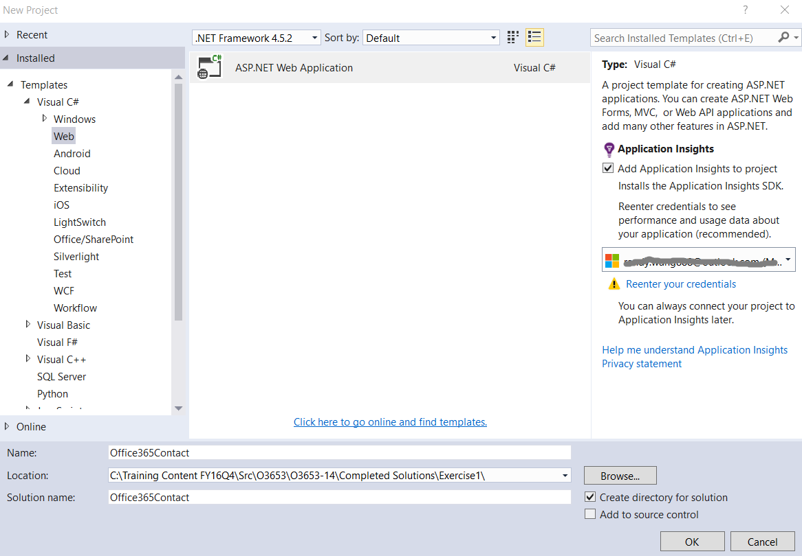
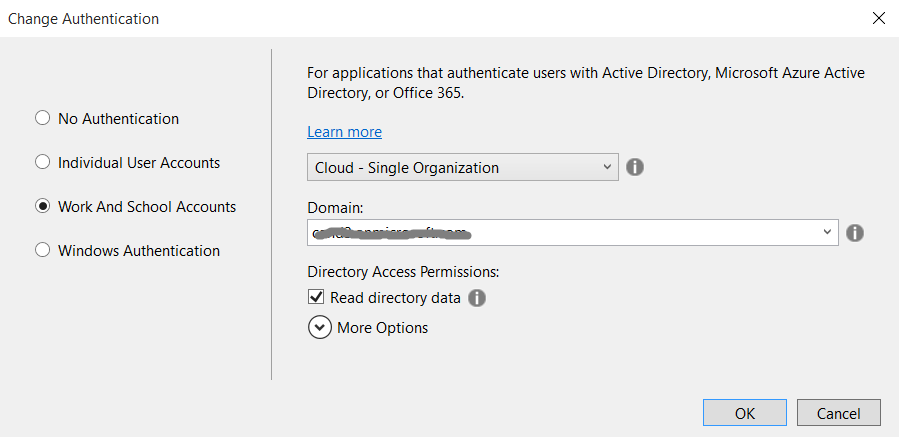
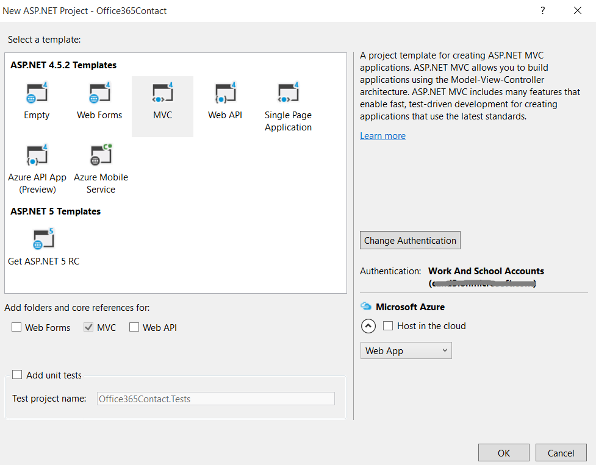
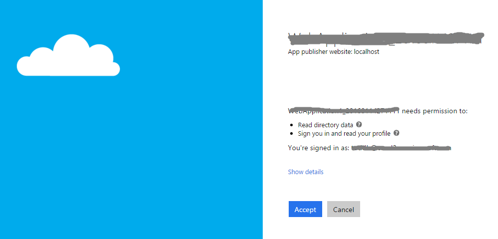
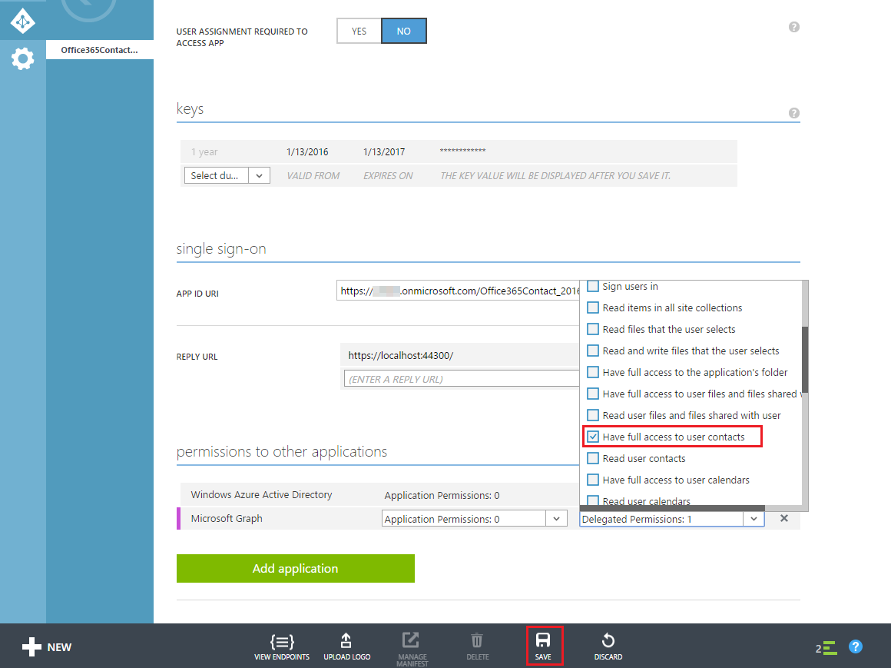
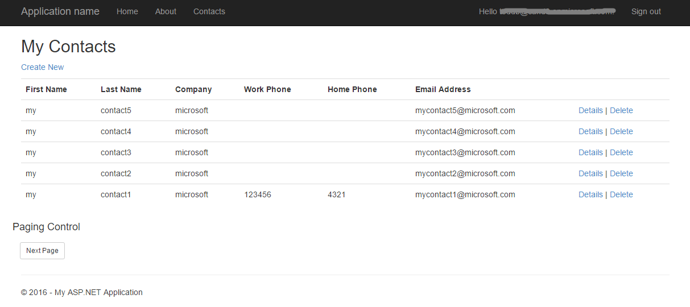
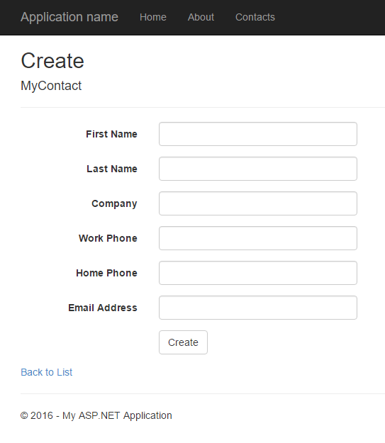
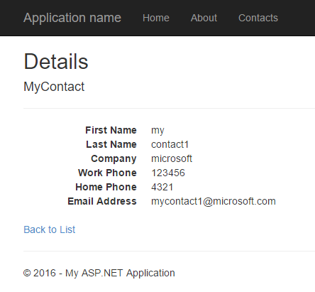

# Deep Dive into Office 365 with the Microsoft Graph API for Contacts
In this lab, you will use the Microsoft Graph SDK to program against Office 365 contacts as part of an ASP.NET MVC5 application.

## Prerequisites
1. You must have an Office 365 tenant and Microsoft Azure subscription to complete this lab. If you do not have one, the lab for **O3651-7 Setting up your Developer environment in Office 365** shows you how to obtain a trial. You must also have access to an Exchange inbox within an Office 365 developer tenancy.
1. You must have Visual Studio 2015.

## Lab Setup: Setting up your Exchange account with Sample Contacts for Testing
1. Using the browser, navigate to https://outlook.office365.com and log into your Office 365 mailbox.
1. Click the *waffle* icon in the top-left corner to open the App Launcher and click the **People** tile.
1. Add some contacts to your mailbox if you don't have any.
1. Once you have verified that you have a set of contact items for testing, you can move on to the next exercise.

## Exercise 1: Create an ASP.NET MVC5 Application
In this exercise, you will create the ASP.NET MVC5 application and register it with Azure active Directory.
1. Launch **Visual Studio 2015** as administrator.
1. In Visual Studio, click **File/New/Project**.
1. In the **New Project** dialog
  1. Select **Templates/Visual C#/Web**.
  1. Select **ASP.NET Web Application**.

    

  1. Give the project the name **Office365Contact** and Click **OK**.
1. In the **New ASP.NET Project** dialog
  1. Click **MVC**.
  2. Click **Change Authentication**.
  3. Select **Work And School Accounts**.
  4. Select **Cloud - Single Organization**
  5. Input **Domain** of your O365 tenancy
  6. Check **Read directory data** under Directory Access Permissions 
  7. Click **OK**.
  8. Uncheck **Host in the cloud**
  9. Click **OK**.

    

    

1. Ensure the web project uses SSL by default:
  1. In the **Solution Explorer** tool window, select the project and look at the **Properties** tool window. 
  1. Ensure **SSL Enabled** is set to **TRUE**.
  1. Copy the **SSL URL** property to the clipboard for use in the next step.
  1. Save your changes.

    
    > It is important to do this now because in the next step when you create the application in Azure AD, you want the reply URL to use HTTPS. If you did not do this now, you would have to manually make the changes the Visual Studio wizard is going to do for you in creating the app.
    
1. Configure the project to always go to the homepage of the web application when debugging:
  1. In the **Solution Explorer** tool window, select **Properties**.
  1. Select the **Web** tab in the left margin.
  1. Find the section **Start Action**.
  1. Click the radio button **Start URL** and enter the SSL URL of the web project that you copied from the previous step.
  
1. At this point you can test the authentication flow for your application.
  1. In Visual Studio, press **F5**. The browser will automatically launch taking you to the HTTPS start page for the web application.

   > **Note:** 
   > 1. If you receive an error that indicates ASP.NET could not connect to the SQL database, please see the [SQL Server Database Connection Error Resolution document](../../SQL-DB-Connection-Error-Resolution.md) to quickly resolve the issue. 
   > 2. If you receive an error of assembly 'System.Spatial', please right click the project, select **Manage Nuget Packages**, then update System.Spatial to the latest version.
   	
       
  1. To sign in, click the **Sign In** link in the upper-right corner.
  1. Login using your **Organizational Account**.
  1. Upon a successful login, since this will be the first time you have logged into this app, Azure AD will present you with the common consent dialog that looks similar to the following image:

    

  1. Click **Accept** to approve the app's permission request on your data in Office 365.
  1. You will then be redirected back to your web application. However notice in the upper right corner, it now shows your email address & the **Sign Out** link.
Congratulations... at this point your app is configured with Azure AD and leverages OpenID Connect and OWIN to facilitate the authentication process!

## Exercise 2: Configure Web Application to use Azure AD and OWIN
In this exercise you will take the ASP.NET MVC web application you created in the previous exercise and configure it to use Azure AD & OpenID Connect for user & app authentication. You will do this by utilizing the OWIN framework. Once authenticated, you can use the access token returned by Azure AD to access the Microsoft Graph.

1. Grant App Necessary Permissions.

  1. Browse to the [Azure Management Portal](https://manage.windowsazure.com) and sign in with your **Organizational Account**.
  1. In the left-hand navigation, click **Active Directory**.
  1. Select the directory you share with your Office 365 subscription.
  1. Select the application you created for this lab.
  1. Open **Configure** tab
  1. Scroll down to the **permissions to other applications** section. 
  1. Click the **Add Application** button.
  1. In the **Permissions to other applications** dialog, click the **PLUS** icon next to the **Microsoft Graph** option.
  1. Click the **CHECK** icon in the lower right corner.
  1. For the new **Microsoft Graph** application permission entry, select the **Delegated Permissions** dropdown on the same line and then select the following permissions:
    * **Have full access to user contacts**    
  1. Click the **Save** button at the bottom of the page.

     
1. Add a helper class that will be used to harvest settings out of the `web.config` and create the necessary strings that will be used for authentication:

  1. Right-click the project and select **Add/New Folder**. Give the folder the name **Utils**. 
  1. Locate the [\\\O3653\O3653-14 Deep Dive into Office 365 with the Microsoft Graph API for Contacts\Lab Files](./Lab Files) folder provided with this lab and find the file [`SettingsHelper.cs`](./Lab Files/SettingsHelper.cs). Drag the [`SettingsHelper.cs`](./Lab Files/SettingsHelper.cs) file to the **Utils** folder in the project.
     
1. Update **_Layout** file to update **Contact** link:
    1. Open the **_Layout.cshtml** file found in the **Views/Shared** folder.
      1. Locate the part of the file that includes a few links at the top of the page... it should look similar to the following code:
      
        ````asp
        <div class="navbar-collapse collapse">
            <ul class="nav navbar-nav">
                <li>@Html.ActionLink("Home", "Index", "Home")</li>
                <li>@Html.ActionLink("About", "About", "Home")</li>
                <li>@Html.ActionLink("Contact", "Contact", "Home")</li>
            </ul>
            @Html.Partial("_LoginPartial")
        </div>
        ````

      1. Update that navigation so the **Contacts** link points to the Contact controller (the **Contacts** link added below) :

        ````asp
        <div class="navbar-collapse collapse">
            <ul class="nav navbar-nav">
                <li>@Html.ActionLink("Home", "Index", "Home")</li>
                <li>@Html.ActionLink("About", "About", "Home")</li>
                <li>@Html.ActionLink("Contacts", "Index", "Contact")</li>
            </ul>
            @Html.Partial("_LoginPartial")
        </div>
        ````

        > The **Contacts** link will not work yet... you will add that in the next exercise.

## Exercise 3: Code the Contact API
In this exercise, you will create a repository object for wrapping CRUD operations associated with the Contact API.

1. In the **Solution Explorer**, locate the **Models** folder in the **Office365Contact** project.
1. Right-click the **Models** folder and select **Add/Class**.
1. In the **Add New Item** dialog, name the new class **MyContact** and click **Add** to create the new source file for the class.  
    1. At the top of the source file **MyContact.cs**, add the following using statement just after the using statements that are already there.

	````c#
	using System.ComponentModel;	
	````

    1. Implement the new class **MyContact** using the following class definition.
		
    ````c#
    public class MyContact {
	    public string Id { get; set; }
	    [DisplayName("First Name")]
	    public string GivenName { get; set; }
	    [DisplayName("Last Name")]
	    public string Surname { get; set; }
	    [DisplayName("Company")]
	    public string CompanyName { get; set; }
	    [DisplayName("Work Phone")]
	    public string BusinessPhone { get; set; }
	    [DisplayName("Home Phone")]
	    public string HomePhone { get; set; }
	    [DisplayName("Email Address")]
	    public string EmailAddress { get; set; }
	}
    ````

1. Assembly references are not added to the shared projects in ASP.NET MVC, rather they are added to the actual client projects. Therefore you need to add the following NuGet packages manually.
	1. Open the Package Manager Console: **View/Other Windows/Package Manager Console**.
	1. Enter each line below in the console, one at a time, pressing **ENTER** after each one. NuGet will install the package and all dependent packages:
	
		````powershell
        Install-Package Microsoft.Graph	
		````

1. Right-click the **Models** folder and select **Add/Class**. In the **Add New Item** dialog, name the new class **MyContactRepository** and click **Add** to create the new source file for the class.    
    1. **Use** the following using statements instead of the **MyContactRepository** class old using statements.
		
	````c#
	using System;
	using System.Collections.Generic;
	using System.Security.Claims;
	using System.Threading.Tasks;
	using Office365Contact.Utils;
	using System.Net.Http.Headers;
	using Microsoft.IdentityModel.Clients.ActiveDirectory;
	using System.Linq;
	using Microsoft.Graph;
	````

    1. **Add** a function named **GetGraphAccessTokenAsync** to the **MyContactRepository** class with the following implementation to get access token for Microsoft Graph Authentication.
		
    ````c#
    private async Task<string> GetGraphAccessTokenAsync()
    {
        var signInUserId = ClaimsPrincipal.Current.FindFirst(ClaimTypes.NameIdentifier).Value;
        var userObjectId = ClaimsPrincipal.Current.FindFirst(SettingsHelper.ClaimTypeObjectIdentifier).Value;

        var clientCredential = new ClientCredential(SettingsHelper.ClientId, SettingsHelper.ClientSecret);
        var userIdentifier = new UserIdentifier(userObjectId, UserIdentifierType.UniqueId);

        AuthenticationContext authContext = new AuthenticationContext(SettingsHelper.AzureAdAuthority, new ADALTokenCache(signInUserId));
        var result = await authContext.AcquireTokenSilentAsync(SettingsHelper.AzureAdGraphResourceURL, clientCredential, userIdentifier);
        return result.AccessToken;
    }
    ````

    1. **Add** a function named **GetGraphServiceAsync** to the **MyContactRepository** class with the following implementation to get Graph service client.
    
    ````c#
    private async Task<GraphServiceClient> GetGraphServiceAsync()
    {
        var accessToken = await GetGraphAccessTokenAsync();
        var graphserviceClient = new GraphServiceClient(SettingsHelper.GraphResourceUrl,
                                      new DelegateAuthenticationProvider(
                                                    (requestMessage) =>
                                                    {
                                                        requestMessage.Headers.Authorization = new AuthenticationHeaderValue("bearer", accessToken);
                                                        return Task.FromResult(0);
                                                    }));

        return graphserviceClient;
    }
    ````

    1. **Add** a function named **GetContacts** to the **MyContactRepository** class to retrieve and return a list of **MyContact** objects.
		
    ````c#
    public async Task<List<MyContact>> GetContacts(int pageIndex, int pageSize)
    {
         try
            {
                var graphServiceClient = await GetGraphServiceAsync();
                var requestContacts = await graphServiceClient.Me.Contacts.Request().Top(pageSize).Skip(pageIndex * pageSize).GetAsync();
                var contactsResults = requestContacts.CurrentPage.Select(x => new MyContact
                {
                    Id = x.Id,
                    GivenName = x.GivenName,
                    Surname = x.Surname,
                    CompanyName = x.CompanyName,
                    EmailAddress = x.EmailAddresses.Count() > 0 ? x.EmailAddresses.First().Address: string.Empty,
                    BusinessPhone = x.BusinessPhones.Count() > 0 ? x.BusinessPhones.First() : string.Empty,
                    HomePhone = x.HomePhones.Count() > 0 ? x.HomePhones.First() : string.Empty
                }).ToList();
                return contactsResults;
            }
            catch (Exception el)
            {
                return null;
            }
    }
    ````

    1. Add a **GetContact** function to the **MyContactRepository** class to get a specific contact:

    ````c#
    public async Task<MyContact> GetContact(string id)
    {
        try
        {
            var graphServiceClient = await GetGraphServiceAsync();
            var requestContact = await graphServiceClient.Me.Contacts[id].Request().GetAsync();
            var contactResult = new MyContact
            {
                Id = requestContact.Id,
                GivenName = requestContact.GivenName,
                Surname = requestContact.Surname,
                CompanyName = requestContact.CompanyName,
                EmailAddress = requestContact.EmailAddresses.Count() > 0 ? requestContact.EmailAddresses.First().Address : string.Empty,
                BusinessPhone = requestContact.BusinessPhones.Count() > 0 ? requestContact.BusinessPhones.First() : string.Empty,
                HomePhone = requestContact.HomePhones.Count() > 0 ? requestContact.HomePhones.First() : string.Empty
            };
            return contactResult;
        }
        catch (Exception el)
        {
            return null;
        }
    }
    ````

    1. Add a **DeleteContact** function to the **MyContactRepository** class to delete a contact.

    ````c#
    public async Task DeleteContact(string id)
    {
        try
        {
            var graphServiceClient = await GetGraphServiceAsync();
            await graphServiceClient.Me.Contacts[id].Request().DeleteAsync();
        }
        catch (Exception el)
        {
        }
        return;
    }
    ````

    1. Add a **AddContact** function  to the **MyContactRepository** class to create a new contact.

    ````c#
    public async Task AddContact(MyContact myContact)
    {
        try
        {
            var graphServiceClient = await GetGraphServiceAsync();
            var requestContact = new Microsoft.Graph.Contact
            {
                GivenName = myContact.GivenName,
                Surname = myContact.Surname,
                CompanyName = myContact.CompanyName,
            };
            var emailList = new List<EmailAddress>();
            emailList.Add(new EmailAddress { Address = myContact.EmailAddress, Name = myContact.EmailAddress });
            requestContact.EmailAddresses = emailList;
            var businessPhonesList = new List<string>();
            businessPhonesList.Add(myContact.BusinessPhone);
            requestContact.BusinessPhones = businessPhonesList;
            var homePhonesList = new List<string>();
            homePhonesList.Add(myContact.HomePhone);
            requestContact.HomePhones = homePhonesList;
            await graphServiceClient.Me.Contacts.Request().AddAsync(requestContact);
        }
        catch (Exception el)
        {
        }
        return;
    }
    ````    

At this point you have created the repository that will be used to talk to the Microsoft Graph SDK.

## Exercise 4: Code the MVC Application
In this exercise, you will code the **ContactController** of the MVC application to display contacts as well as adding behavior for adding and deleting contacts.

1. Right-click the **Controllers** folder and select **Add/Controller**.
  1. In the **Add Scaffold** dialog, select **MVC 5 Controller - Empty**.
  1. Click **Add**.
  1. When prompted for a name, enter **ContactController**.
  1. Click **Add**.
1. Within the **ContactController** file, use the following `using` statements instead of the old using statements :

    ````c#
    using System;
	using System.Collections.Generic;
	using System.Linq;
	using System.Web;
	using System.Web.Mvc;
	using Office365Contact.Models;
	using System.Threading.Tasks;
    ````

1. Within the `ContactController` class, add the following field to get a reference to the repository you previously created:

    ````c#
    readonly MyContactRepository _repo = new MyContactRepository();
    ````

1. Within the `ContactController` class, add a route handler and view to list all the contacts:
  1. **Replace** the **Index** method with the following code to read contacts.
      
    ````c#
    [Authorize]
    public async Task<ActionResult> Index(int? pageNumber)
    {
		// setup paging
        const int pageSize = 5;
        if (pageNumber == null)
            pageNumber = 1;

        List<MyContact> contacts = null;
        contacts = await _repo.GetContacts((int)pageNumber - 1, pageSize);

        ViewBag.pageNumber = pageNumber;
        if (contacts != null)
            ViewBag.morePagesAvailable = contacts.Count < pageSize ? false : true;

        return View(contacts);
    }
    ````

    > Notice how the route handler takes in an optional parameter for the page number. This will be used to implement paging for the controller. Right now the page size is small, set to 5, for demonstration purposes.
 
  1. Finally, update the view to display the results.
    1. Within the `ContactController` class, right click the `View()` at the end of the `Index()` method and select **Add View**.
    1. Within the **Add View** dialog, set the following values:
      1. View Name: **Index**.
      1. Template: **Empty (without model)**.
        
        > Leave all other fields blank & unchecked.
      
      1. Click **Add**.
    1. Within the **Views/Contact/Index.cshtml** file, delete all the code in the file and replace it with the following code:
      
        ````html
        @model IEnumerable<Office365Contact.Models.MyContact>
		@{ViewBag.Title = "Index";}
		<h2>My Contacts</h2>
		<p>
		    @Html.ActionLink("Create New", "Create")
		</p>
		<table class="table">
		    <tr>
		        <th>@Html.DisplayNameFor(model => model.GivenName)</th>
		        <th>@Html.DisplayNameFor(model => model.Surname)</th>
		        <th>@Html.DisplayNameFor(model => model.CompanyName)</th>
		        <th>@Html.DisplayNameFor(model => model.BusinessPhone)</th>
		        <th>@Html.DisplayNameFor(model => model.HomePhone)</th>
		        <th>@Html.DisplayNameFor(model => model.EmailAddress)</th>
		        <th></th>
		    </tr>
		    @foreach (var item in Model)
		    {
		        <tr>
		            <td>@Html.DisplayFor(modelItem => item.GivenName)</td>
		            <td>@Html.DisplayFor(modelItem => item.Surname)</td>
		            <td>@Html.DisplayFor(modelItem => item.CompanyName)</td>
		            <td>@Html.DisplayFor(modelItem => item.BusinessPhone)</td>
		            <td>@Html.DisplayFor(modelItem => item.HomePhone)</td>
		            <td>@Html.DisplayFor(modelItem => item.EmailAddress)</td>
		            <td>
		                @Html.ActionLink("Details", "Details", new { id = item.Id }) |
		                @Html.ActionLink("Delete", "Delete", new { id = item.Id })
		            </td>
		        </tr>
		    }
		</table>
		<div class="row">
		    <h4>Paging Control</h4>
		    <div class="btn btn-group-sm">
		        @{
		            var pageLinkAttributes = new Dictionary<string, object> { { "class", "btn btn-default" } };
		
		            int pageNumber = ViewBag.pageNumber;
		
		            // do prev link if not on first page
		            if (pageNumber > 1)
		            {
		                var routeValues = new RouteValueDictionary { { "pageNumber", pageNumber - 1 } };
		                @Html.ActionLink("Previous Page", "Index", "Contact", routeValues, pageLinkAttributes);
		            }		
		
		            // do next link if current page = max page size
		            if (ViewBag.morePagesAvailable)
		            {
		                var routeValues = new RouteValueDictionary { { "pageNumber", pageNumber + 1 } };
		                @Html.ActionLink("Next Page", "Index", "Contact", routeValues, pageLinkAttributes);
		            }
		        }
		    </div>
		</div>
        ````  
1. Test the new view:
  1. In **Visual Studio**, hit **F5** to begin debugging.

  > **Note:** If you receive an error that indicates ASP.NET could not connect to the SQL database, please see the [SQL Server Database Connection Error Resolution document](../../SQL-DB-Connection-Error-Resolution.md) to quickly resolve the issue. 

  1. When prompted, log in with your **Organizational Account**.
  1. Once the application is loaded click the **Contacts link** in the top menu bar.
  1. Verify that your application displays Contacts from your Office 365 account.  

    

  1. Close the browser window, terminate the debugging session and return to Visual Studio.

1. Add a route handler to delete a contact:
  1. In the **ContactController.cs** file, add an action method named **Delete** using the following code to delete a contact.

    ````c#
    [Authorize]
    public async Task<ActionResult> Delete(string id)
    {
        if (id != null)
        {
            await _repo.DeleteContact(id);
        }

        return Redirect("/Contact");

    }
    ````

1. Add a route handler and views to handle creating contacts:
  1. In the **ContactController.cs** file, add an action method named **Create** using the following code to create a new contact. Notice how you are adding two items, when the create form is requested (the `HttpGet` option) and one for when the form is submitted (the `HttpPost` option).

    ````c#
    [HttpGet]
    [Authorize]
    public async Task<ActionResult> Create()
    {
        var myContact = new MyContact();
        return View(myContact);
    }

    [HttpPost]
    [Authorize]
    public async Task<ActionResult> Create(MyContact myContact)
    {

        await _repo.AddContact(myContact);
        return Redirect("/Contact");
    }
    ````

  1. Within the `ContactController` class, right click the `View(myContact)` at the end of the `Create()` method and select **Add View**.
  1. In the **Add View** dialog, set the following options on the dialog and click **Add**.
    + View name: **Create**
    + Template: **Create**
    + Model class: **MyContact (Office365Contact.Models)**
    + Create as partial view: **unchecked**
    + Reference script libraries: **unchecked**
    + Use a layout page: **checked**
    + Click **Add**
  1. Open the **Create.cshtml** file. Delete all the code in the file and replace it with the following code:

    ````html
    @model Office365Contact.Models.MyContact
	@{
	    ViewBag.Title = "Create";
	}
	<h2>Create</h2>
	
	@using (Html.BeginForm())
	{
	    <div class="form-horizontal">
	        <h4>MyContact</h4>
	        <hr />
	        @Html.ValidationSummary(true, "", new { @class = "text-danger" })
	        <div class="form-group">
	            @Html.LabelFor(model => model.GivenName, htmlAttributes: new { @class = "control-label col-md-2" })
	            <div class="col-md-10">
	                @Html.EditorFor(model => model.GivenName, new { htmlAttributes = new { @class = "form-control" } })
	                @Html.ValidationMessageFor(model => model.GivenName, "", new { @class = "text-danger" })
	            </div>
	        </div>
	        <div class="form-group">
	            @Html.LabelFor(model => model.Surname, htmlAttributes: new { @class = "control-label col-md-2" })
	            <div class="col-md-10">
	                @Html.EditorFor(model => model.Surname, new { htmlAttributes = new { @class = "form-control" } })
	                @Html.ValidationMessageFor(model => model.Surname, "", new { @class = "text-danger" })
	            </div>
	        </div>
	        <div class="form-group">
	            @Html.LabelFor(model => model.CompanyName, htmlAttributes: new { @class = "control-label col-md-2" })
	            <div class="col-md-10">
	                @Html.EditorFor(model => model.CompanyName, new { htmlAttributes = new { @class = "form-control" } })
	                @Html.ValidationMessageFor(model => model.CompanyName, "", new { @class = "text-danger" })
	            </div>
	        </div>
	        <div class="form-group">
	            @Html.LabelFor(model => model.BusinessPhone, htmlAttributes: new { @class = "control-label col-md-2" })
	            <div class="col-md-10">
	                @Html.EditorFor(model => model.BusinessPhone, new { htmlAttributes = new { @class = "form-control" } })
	                @Html.ValidationMessageFor(model => model.BusinessPhone, "", new { @class = "text-danger" })
	            </div>
	        </div>
	        <div class="form-group">
	            @Html.LabelFor(model => model.HomePhone, htmlAttributes: new { @class = "control-label col-md-2" })
	            <div class="col-md-10">
	                @Html.EditorFor(model => model.HomePhone, new { htmlAttributes = new { @class = "form-control" } })
	                @Html.ValidationMessageFor(model => model.HomePhone, "", new { @class = "text-danger" })
	            </div>
	        </div>
	        <div class="form-group">
	            @Html.LabelFor(model => model.EmailAddress, htmlAttributes: new { @class = "control-label col-md-2" })
	            <div class="col-md-10">
	                @Html.EditorFor(model => model.EmailAddress, new { htmlAttributes = new { @class = "form-control" } })
	                @Html.ValidationMessageFor(model => model.EmailAddress, "", new { @class = "text-danger" })
	            </div>
	        </div>
	        <div class="form-group">
	            <div class="col-md-offset-2 col-md-10">
	                <input type="submit" value="Create" class="btn btn-default" />
	            </div>
	        </div>
	    </div>
	}
	<div>
	    @Html.ActionLink("Back to List", "Index")
	</div>
	@section Scripts {
	    @Scripts.Render("~/bundles/jqueryval")
	}
    ````

1. Test the new view:
  1. In **Visual Studio**, hit **F5** to begin debugging.

  	> **Note:** If you receive an error that indicates ASP.NET could not connect to the SQL database, please see the [SQL Server Database Connection Error Resolution document](../../SQL-DB-Connection-Error-Resolution.md) to quickly resolve the issue.

  1. When Prompted, log in with your **Organizational Account**.  
  1. Once the application is loaded click the **Contacts link** in the top menu bar.
  1. Click the **Delete** link. The contact would be deleted successfully. 
  1. Click the **Create New** link. You should see the form below. Fill the form out to add a new contact and click the **Create button**.

    

  1. Close the browser window, terminate the debugging session and return to Visual Studio.

1. Add a route handler and view to handle showing the details of a selected contact:
  1. In the **ContactController.cs** file, add an action method named **Details** using the following code to view a contact.

    ````c#
    [Authorize]
    public async Task<ActionResult> Details(string id)
    {

        var myContact = await _repo.GetContact(id);
        return View(myContact);
    }
    ````
  1. Within the `ContactController` class, right click the `View(myContact)` at the end of the `Details()` method and select **Add View**.
  1. In the **Add View** dialog, set the following options on the dialog and click **Add**.
    + View name: **Details**
    + Template: **Details**
    + Model class: **MyContact (Office365Contact.Models)**
    + Create as partial view: **unchecked**
    + Reference script libraries: **unchecked**
    + Use a layout page: **checked**
    + Click **Add**
  1. Open the **Details.cshtml** file and make sure the code looks like the following code to build a form that will display a contact:

    ````html
    @model Office365Contact.Models.MyContact
	@{
	    ViewBag.Title = "Details";
	}
	<h2>Details</h2>
	<div>
	    <h4>MyContact</h4>
	    <hr />
	    <dl class="dl-horizontal">
	        <dt>
	            @Html.DisplayNameFor(model => model.GivenName)
	        </dt>
	        <dd>
	            @Html.DisplayFor(model => model.GivenName)
	        </dd>
	        <dt>
	            @Html.DisplayNameFor(model => model.Surname)
	        </dt>
	        <dd>
	            @Html.DisplayFor(model => model.Surname)
	        </dd>
	        <dt>
	            @Html.DisplayNameFor(model => model.CompanyName)
	        </dt>
	        <dd>
	            @Html.DisplayFor(model => model.CompanyName)
	        </dd>
	        <dt>
	            @Html.DisplayNameFor(model => model.BusinessPhone)
	        </dt>
	        <dd>
	            @Html.DisplayFor(model => model.BusinessPhone)
	        </dd>
	        <dt>
	            @Html.DisplayNameFor(model => model.HomePhone)
	        </dt>
	        <dd>
	            @Html.DisplayFor(model => model.HomePhone)
	        </dd>
	        <dt>
	            @Html.DisplayNameFor(model => model.EmailAddress)
	        </dt>
	        <dd>
	            @Html.DisplayFor(model => model.EmailAddress)
	        </dd>
	    </dl>
	</div>
	<p>
	    @Html.ActionLink("Back to List", "Index")
	</p>
    ````
1. Test the new view:
  1. In **Visual Studio**, hit **F5** to begin debugging.

  	> **Note:** If you receive an error that indicates ASP.NET could not connect to the SQL database, please see the [SQL Server Database Connection Error Resolution document](../../SQL-DB-Connection-Error-Resolution.md) to quickly resolve the issue.

  1. When Prompted, log in with your **Organizational Account**.
  1. Once the application is loaded click the **Contacts link** in the top menu bar.
  1. Click the **Details** link for one of the contacts and verify the information about the contact is displayed. 

    

  1. Close the browser window, terminate the debugging session and return to Visual Studio.

Congratulations! You have completed working with the Microsoft Graph SDK with Contacts.