# Deep Dive into Excel - Microsoft Graph
In this lab, you will use Microsoft Graph to work with an Excel workbook stored in OneDrive.

## Prerequisites
1. You must have an Office 365 tenant and Microsoft Azure subscription to complete this lab. If you do not have one, the lab for **O3651-7 Setting up your Developer environment in Office 365** shows you how to obtain a trial. 
2. You must have Visual Studio 2015.

## Exercise 1: Create a new project that uses Azure Active Directory v2 authentication
In this first step, you will create a new ASP.NET MVC project using the **Graph AAD Auth v2 Starter Project** template, register a new application in the developer portal, and log in to your app and generate access tokens for calling the Graph API.

### Create an ASP.NET MVC5 Application

In this exercise, you will create the ASP.NET MVC5 application and register it with Azure active Directory.

1. Launch **Visual Studio 2017** as an administrator. 

2. In Visual Studio select **File/New/Project**.

3. In the **New Project** dialog, select **Templates/Visual C#/Web** and click **ASP.NET Web Application**. Name the new project **GraphExcel** and then click **OK**.  

   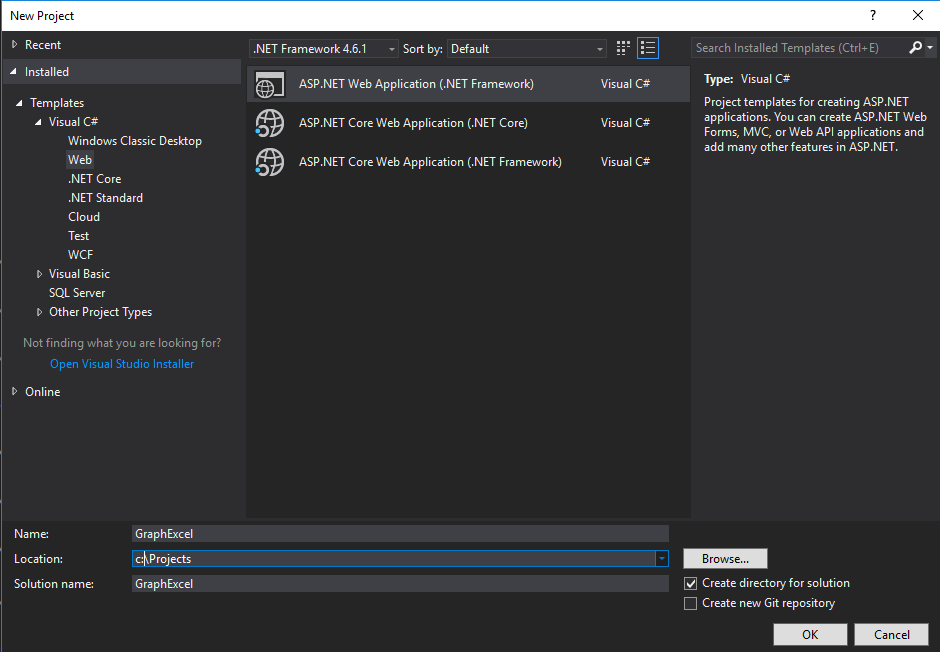

   > NOTE: Make sure you enter the exact same name for the Visual Studio Project that is specified in these lab instructions.  The Visual Studio Project name becomes part of the namespace in the code.  The code inside these instructions depends on the namespace matching the Visual Studio Project name specified in these instructions.  If you use a different project name the code will not compile unless you adjust all the namespaces to match the Visual Studio Project name you enter when you create the project.

4. In the **New ASP.NET Project** dialog, click **MVC** and then click **Change Authentication**.

5. Select **Work And School Accounts**, check **Read directory data** and click **OK**.

 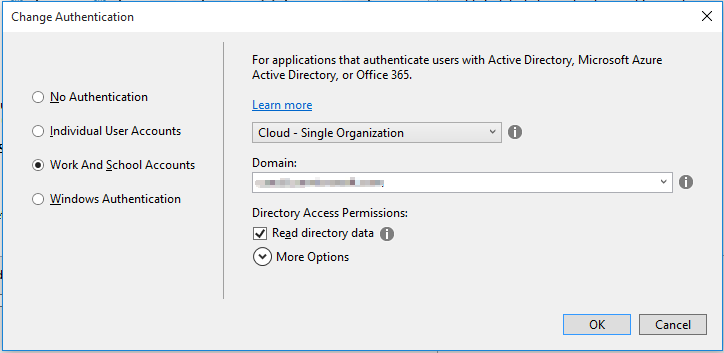

6. At this point you can test the authentication flow for your application.

   In Visual Studio, press **F5**. The browser will automatically launch taking you to the HTTPS start page for the web application.

- To sign in, click the **Sign In** link in the upper-right corner.

- Login using your **Organizational Account**.

- Upon a successful login, since this will be the first time you have logged into this app, Azure AD will present you with the common consent dialog that looks similar to the following image:

  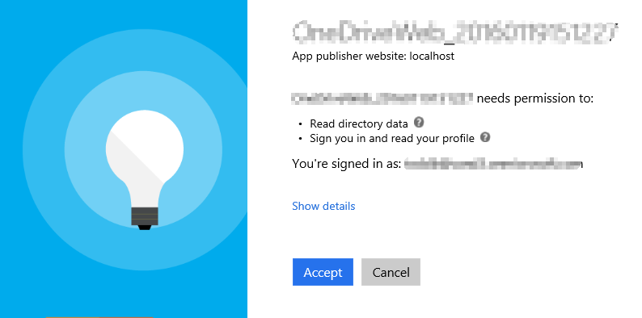

- Click **Accept** to approve the app's permission request on your data in Office 365.

- You will then be redirected back to your web application. However notice in the upper right corner, it now shows your email address & the **Sign Out** link.

- In Visual Studio, press **Shift+F5** to stop debugging.

​          Congratulations... at this point your app is configured with Azure AD and leverages OpenID Connect and OWIN to facilitate the authentication process!

7. Open the **Web.config** file in the root directory and find the **appSettings** element. This is where you will add the app ID and app secret that you will generate in the next step.

8. Launch the Application Registration Portal by opening a browser to [apps.dev.microsoft.com](https://apps.dev.microsoft.com/) to register a new application.

9. Sign into the portal using your Office 365 username and password. The **Graph AAD Auth v2 Starter Project** template allows you to sign in with either a Microsoft account or an Office 365 for business account, but the "People" features work only with business and school accounts.

10. Click **Add an app**, type **OneNoteGraphQuickStart** for the application name, and then click **Create application**.

11. Copy the **Application Id** and paste it into the value for **ida:AppId** in your project's **Web.config** file.

12. Under **Application Secrets** click **Generate New Password** to create a new client secret for your app.

13. Copy the displayed app password and paste it into the value for **ida:AppSecret** in your project's **Web.config** file.

14. Set the **ida:AppScopes** value to *Notes.ReadWrite*. 

    Note: Add the key **ida:AppId**, **ida:AppSecret** as following if they don't exist.

    ```
    <configuration>
      <appSettings>
        <!-- ... -->   
        <add key="ida:AppId" value="4b63ba37..." />
        <add key="ida:AppSecret" value="AthR0e75..." />
        <!-- ... -->
        <!-- Specify scopes in this value. Multiple values should be comma separated. -->
        <add key="ida:AppScopes" value="User.Read, Files.ReadWrite" />
      </appSettings>
      <!-- ... -->
    </configuration>
    ```

15. In Visual Studio, right-click **GraphExcel** > **Properties** to open the project properties.

16. Click **Web** in the left navigation.

17. Copy the **Project Url** value.

18. Back on the Application Registration Portal page, click **Add Platform** > **Web**.

19. Paste the project URL into the **Redirect URIs** field.

20. At the bottom of the page, click **Save**.

21. Press F5 to compile and launch your new application in the default browser.

22. When the Graph and AAD v2 Auth Endpoint Starter page appears, sign in with your Office 365 account.

23. Review the permissions the application is requesting, and click **Accept**.

24. Now that you are signed into your application, exercise 1 is complete!

## Exercise 2: Access the Excel file in OneDrive for Business through Microsoft Graph SDK
1. This exercise is based on the project located in the  **\\O3653\O3653-16 Excel - Microsoft Graph\Starter Project** folder. Open the project with Visual Studio 2017. 

   Notice: update web.config and add values for below items.  These values can be found on Exercise 1's web.config.

   ```
   <add key="ida:ClientId" value="" />
   <add key="ida:ClientSecret" value="" />
   <add key="ida:Domain" value="" />
   <add key="ida:TenantId" value="" />
   <add key="ida:AppId" value="" />
   <add key="ida:AppSecret" value="" />
   <add key="ida:PostLogoutRedirectUri" value="" />
   ```

2. In Visual Studio, right-click **GraphExcel** > **Properties** to open the project properties. Click **Web** in the left navigation. Make sure **Project URL** is the same as Exercise 1.

3. Upload the Excel workbook to OneDrive, we will access the Excel workbook in later exercises. 

   1. Open your SharePoint site and click the **OneDrive** button to go to the OneDrive site.
      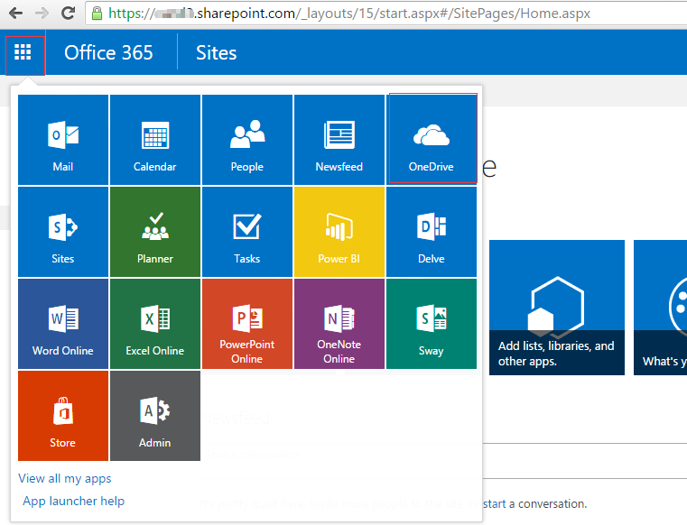

   2. Locate the **\\O3653\O3653-16 Excel - Microsoft Graph\Lab Files** folder provided with this lab and find the **ToDoList.xlsx** file. Drag the **ToDoList.xlsx** file to OneDrive's Root folder.
      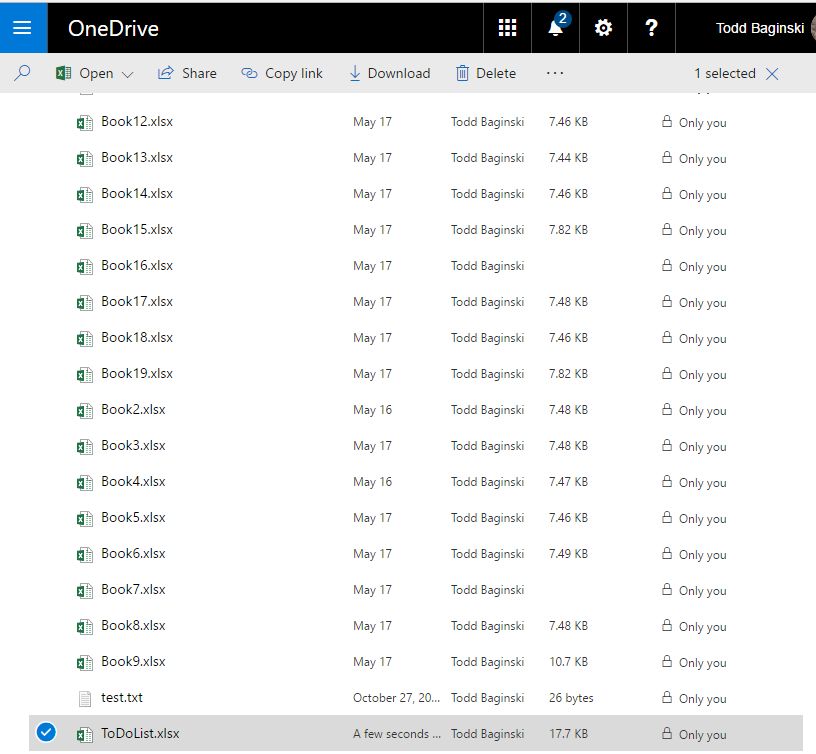

4. Update **_Layout** file to add **To Do List** link:
   1. In Visual Studio, open the **_Layout.cshtml** file found in the **Views/Shared** folder.
      1. Locate the part of the file that includes a few links at the top of the page... it should look similar to the following code:

        ````asp
        <div class="navbar-collapse collapse">
            <ul class="nav navbar-nav">
                <li>@Html.ActionLink("Home", "Index", "Home")</li>
                <li>@Html.ActionLink("About", "About", "Home")</li>
                <li>@Html.ActionLink("Contact", "Contact", "Home")</li>
            </ul>
            @Html.Partial("_LoginPartial")
        </div>
        ````
      2. Add a new link that says To Do List to the menu.  When you are done the code will look like this.

        ````asp
        <div class="navbar-collapse collapse">
            <ul class="nav navbar-nav">
                <li>@Html.ActionLink("Home", "Index", "Home")</li>
                <li>@Html.ActionLink("About", "About", "Home")</li>
                <li>@Html.ActionLink("Contact", "Contact", "Home")</li>
                <li>@Html.ActionLink("To Do List", "Index", "ToDoList")</li>
            </ul>
            @Html.Partial("_LoginPartial")
        </div>
        ````

        > **Note:** The **To Do List** link will not work yet... you will add that in the next exercise.

## 
### Add models and helper.

1. In the **Solution Explorer**, locate the **Models** folder in the **GraphExcel** project.

2. Right-click the **Models** folder and select **Add/Class**.

3. In the **Add New Item** dialog, name the new class **ToDoItem** and click **Add** to create the new source file for the class.

4. At the top of the source file **ToDoItem.cs**, replace the existing using statements with these using statements.

 ````c#
 using System;
 using System.Collections.Generic;
 using System.ComponentModel.DataAnnotations;
 using System.Linq;
 using System.Web;
 using Newtonsoft.Json.Serialization;
 using Newtonsoft.Json;	
 ````

5. Implement the new class **ToDoItem** using the following class definition.
    ​	
    ````c#
        public class ToDoItem
        {
            [JsonProperty("index")]
            public string Id { get; set; }
            [Required]
            public string Title { get; set; }

            [Required]
            public string Status { get; set; }

            [Required]
            public string Priority { get; set; }

            [Required]
            public string PercentComplete { get; set; }

            [Required]
            public string StartDate { get; set; }

            [Required]
            public string EndDate { get; set; }

            [DataType(DataType.MultilineText)]
            public string Notes { get; set; }

            public ToDoItem(
                string id,
                string title,
                string priority,
                string status,
                string percentComplete,
                string startDate,
                string endDate,
                string notes)
            {
                Id = id;
                Title = title;
                Priority = priority;
                Status = status;
                if (!percentComplete.EndsWith("%"))
                    PercentComplete = percentComplete + "%";
                else
                    PercentComplete = percentComplete;

                StartDate = startDate;
                EndDate = endDate;
                Notes = notes;
            }

            public ToDoItem() { }
        }
    ````

6. Right-click the project and select **Add/New Folder**. Give the folder the name **Helpers**. 

7. Right-click the **Helpers** folder and select **Add/Class**.

8. In the **Add New Item** dialog, name the new class **ExcelAPIHelper** and click **Add** to create the new source file for the class.

9. **ExcelAPIHelper.cs** contents

 ​

 ````c#
 using Newtonsoft.Json.Linq;
 using System;
 using System.Collections.Generic;
 using System.Linq;
 using System.Net.Http;
 using System.Net.Http.Headers;
 using System.Threading.Tasks;
 using GraphExcel.Models;
 using Newtonsoft.Json;
 using System.Drawing;
 using System.IO;
 using System.Web;
 using System.Web.Mvc;

 namespace GraphExcel
 {
     public class RESTAPIHelper
     {
         private static string restURLBase = "https://graph.microsoft.com/testexcel/me/drive/items/";
         private static string fileId = null;

         public static async Task LoadWorkbook(string accessToken)
         {
             try
             {
                 var fileName = "ToDoList.xlsx";
                 var serviceEndpoint = "https://graph.microsoft.com/v1.0/me/drive/root/children";
                 //string fileId = null;

                 String absPath = HttpContext.Current.Server.MapPath("Assets/ToDo.xlsx");
                 HttpClient client = new HttpClient();
                 client.DefaultRequestHeaders.Authorization = new AuthenticationHeaderValue("Bearer", accessToken);
                 //client.DefaultRequestHeaders.Add("Authorization", "Bearer " + accessToken);

                 var filesResponse = await client.GetAsync(serviceEndpoint + "?$select=name,id");

                 if (filesResponse.IsSuccessStatusCode)
                 {
                     var filesContent = await filesResponse.Content.ReadAsStringAsync();

                     JObject parsedResult = JObject.Parse(filesContent);

                     foreach (JObject file in parsedResult["value"])
                     {

                         var name = (string)file["name"];
                         if (name.Contains("ToDoList.xlsx"))
                         {
                             fileId = (string)file["id"];
                             restURLBase = "https://graph.microsoft.com/testexcel/me/drive/items/" + fileId + "/workbook/worksheets('ToDoList')/";
                             return;
                         }
                     }

                 }

                 else
                 {
                     Console.WriteLine("Could not get user files:" + filesResponse.StatusCode);
                 }

                 // We know that the file doesn't exist, so upload it and create the necessary worksheets, tables, and chart.
                 var excelFile = File.OpenRead(absPath);
                 byte[] contents = new byte[excelFile.Length];
                 excelFile.Read(contents, 0, (int)excelFile.Length); excelFile.Close();
                 var contentStream = new MemoryStream(contents);


                 var contentPostBody = new StreamContent(contentStream);
                 contentPostBody.Headers.Add("Content-Type", "application/octet-stream");


                 // Endpoint for content in an existing file.
                 var fileEndpoint = new Uri(serviceEndpoint + "/" + fileName + "/content");

                 var requestMessage = new HttpRequestMessage(HttpMethod.Put, fileEndpoint)
                 {
                     Content = contentPostBody
                 };

                 HttpResponseMessage response = await client.SendAsync(requestMessage);

                 if (response.IsSuccessStatusCode)
                 {
                     var responseContent = await response.Content.ReadAsStringAsync();
                     var parsedResponse = JObject.Parse(responseContent);
                     fileId = (string)parsedResponse["id"];
                     restURLBase = "https://graph.microsoft.com/testexcel/me/drive/items/" + fileId + "/workbook/worksheets('ToDoList')/";

                     var workbookEndpoint = "https://graph.microsoft.com/testexcel/me/drive/items/" + fileId + "/workbook";

                     //Get session id

                     var sessionJson = "{" +
                         "'saveChanges': true" +
                         "}";
                     var sessionContentPostbody = new StringContent(sessionJson);
                     sessionContentPostbody.Headers.Clear();
                     sessionContentPostbody.Headers.Add("Content-Type", "application/json");
                     var sessionResponseMessage = await client.PostAsync(workbookEndpoint + "/createsession", sessionContentPostbody);
                     var sessionResponseContent = await sessionResponseMessage.Content.ReadAsStringAsync();
                     JObject sessionObject = JObject.Parse(sessionResponseContent);
                     var sessionId = (string)sessionObject["id"];

                     client.DefaultRequestHeaders.Add("Workbook-Session-Id", sessionId);


                     var worksheetsEndpoint = "https://graph.microsoft.com/testexcel/me/drive/items/" + fileId + "/workbook/worksheets";

                     //Worksheets
                     var toDoWorksheetJson = "{" +
                                                 "'name': 'ToDoList'," +
                                                 "}";

                     var toDoWorksheetContentPostBody = new StringContent(toDoWorksheetJson);
                     toDoWorksheetContentPostBody.Headers.Clear();
                     toDoWorksheetContentPostBody.Headers.Add("Content-Type", "application/json");
                     var toDoResponseMessage = await client.PostAsync(worksheetsEndpoint, toDoWorksheetContentPostBody);


                     var summaryWorksheetJson = "{" +
                             "'name': 'Summary'" +
                             "}";

                     var summaryWorksheetContentPostBody = new StringContent(summaryWorksheetJson);
                     summaryWorksheetContentPostBody.Headers.Clear();
                     summaryWorksheetContentPostBody.Headers.Add("Content-Type", "application/json");
                     var summaryResponseMessage = await client.PostAsync(worksheetsEndpoint, summaryWorksheetContentPostBody);

                     //ToDoList table in ToDoList worksheet
                     var toDoListTableJson = "{" +
                             "'address': 'A1:H1'," +
                             "'hasHeaders': true" +
                             "}";

                     var toDoListTableContentPostBody = new StringContent(toDoListTableJson);
                     toDoListTableContentPostBody.Headers.Clear();
                     toDoListTableContentPostBody.Headers.Add("Content-Type", "application/json");
                     var toDoListTableResponseMessage = await client.PostAsync(worksheetsEndpoint + "('ToDoList')/tables/$/add", toDoListTableContentPostBody);

                     //New table in Summary worksheet
                     var summaryTableJson = "{" +
                             "'address': 'A1:B1'," +
                             "'hasHeaders': true" +
                             "}";

                     var summaryTableContentPostBody = new StringContent(summaryTableJson);
                     summaryTableContentPostBody.Headers.Clear();
                     summaryTableContentPostBody.Headers.Add("Content-Type", "application/json");
                     var summaryTableResponseMessage = await client.PostAsync(worksheetsEndpoint + "('Summary')/tables/$/add", summaryTableContentPostBody);

                     var patchMethod = new HttpMethod("PATCH");


                     //Rename Table1 in ToDoList worksheet to "ToDoList"
                     var toDoListTableNameJson = "{" +
                             "'name': 'ToDoList'," +
                             "}";

                     var toDoListTableNamePatchBody = new StringContent(toDoListTableNameJson);
                     toDoListTableNamePatchBody.Headers.Clear();
                     toDoListTableNamePatchBody.Headers.Add("Content-Type", "application/json");


                     var toDoListRequestMessage = new HttpRequestMessage(patchMethod, worksheetsEndpoint + "('ToDoList')/tables('Table1')") { Content = toDoListTableNamePatchBody };
                     var toDoListTableNameResponseMessage = await client.SendAsync(toDoListRequestMessage);


                     //Rename ToDoList columns
                     var colToDoOneNameJson = "{" +
                             "'values': [['Id'], [null]] " +
                             "}";

                     var colToDoOneNamePatchBody = new StringContent(colToDoOneNameJson);
                     colToDoOneNamePatchBody.Headers.Clear();
                     colToDoOneNamePatchBody.Headers.Add("Content-Type", "application/json");
                     var colToDoOneNameRequestMessage = new HttpRequestMessage(patchMethod, worksheetsEndpoint + "('ToDoList')/tables('ToDoList')/Columns('1')") { Content = colToDoOneNamePatchBody };
                     var colToDoOneNameResponseMessage = await client.SendAsync(colToDoOneNameRequestMessage);

                     var colToDoTwoNameJson = "{" +
                             "'values': [['Title'], [null]] " +
                             "}";

                     var colToDoTwoNamePatchBody = new StringContent(colToDoTwoNameJson);
                     colToDoTwoNamePatchBody.Headers.Clear();
                     colToDoTwoNamePatchBody.Headers.Add("Content-Type", "application/json");
                     var colToDoTwoNameRequestMessage = new HttpRequestMessage(patchMethod, worksheetsEndpoint + "('ToDoList')/tables('ToDoList')/Columns('2')") { Content = colToDoTwoNamePatchBody };
                     var colToDoTwoNameResponseMessage = await client.SendAsync(colToDoTwoNameRequestMessage);

                     var colToDoThreeNameJson = "{" +
                             "'values': [['Priority'], [null]] " +
                             "}";

                     var colToDoThreeNamePatchBody = new StringContent(colToDoThreeNameJson);
                     colToDoThreeNamePatchBody.Headers.Clear();
                     colToDoThreeNamePatchBody.Headers.Add("Content-Type", "application/json");
                     var colToDoThreeNameRequestMessage = new HttpRequestMessage(patchMethod, worksheetsEndpoint + "('ToDoList')/tables('ToDoList')/Columns('3')") { Content = colToDoThreeNamePatchBody };
                     var colToDoThreeNameResponseMessage = await client.SendAsync(colToDoThreeNameRequestMessage);

                     var colToDoFourNameJson = "{" +
                             "'values': [['Status'], [null]] " +
                             "}";

                     var colToDoFourNamePatchBody = new StringContent(colToDoFourNameJson);
                     colToDoFourNamePatchBody.Headers.Clear();
                     colToDoFourNamePatchBody.Headers.Add("Content-Type", "application/json");
                     var colToDoFourNameRequestMessage = new HttpRequestMessage(patchMethod, worksheetsEndpoint + "('ToDoList')/tables('ToDoList')/Columns('4')") { Content = colToDoFourNamePatchBody };
                     var colToDoFourNameResponseMessage = await client.SendAsync(colToDoFourNameRequestMessage);

                     var colToDoFiveNameJson = "{" +
                             "'values': [['PercentComplete'], [null]] " +
                             "}";

                     var colToDoFiveNamePatchBody = new StringContent(colToDoFiveNameJson);
                     colToDoFiveNamePatchBody.Headers.Clear();
                     colToDoFiveNamePatchBody.Headers.Add("Content-Type", "application/json");
                     var colToDoFiveNameRequestMessage = new HttpRequestMessage(patchMethod, worksheetsEndpoint + "('ToDoList')/tables('ToDoList')/Columns('5')") { Content = colToDoFiveNamePatchBody };
                     var colToDoFiveNameResponseMessage = await client.SendAsync(colToDoFiveNameRequestMessage);

                     var colToDoSixNameJson = "{" +
                             "'values': [['StartDate'], [null]] " +
                             "}";

                     var colToDoSixNamePatchBody = new StringContent(colToDoSixNameJson);
                     colToDoSixNamePatchBody.Headers.Clear();
                     colToDoSixNamePatchBody.Headers.Add("Content-Type", "application/json");
                     var colToDoSixNameRequestMessage = new HttpRequestMessage(patchMethod, worksheetsEndpoint + "('ToDoList')/tables('ToDoList')/Columns('6')") { Content = colToDoSixNamePatchBody };
                     var colToDoSixNameResponseMessage = await client.SendAsync(colToDoSixNameRequestMessage);

                     var colToDoSevenNameJson = "{" +
                             "'values': [['EndDate'], [null]] " +
                             "}";

                     var colToDoSevenNamePatchBody = new StringContent(colToDoSevenNameJson);
                     colToDoSevenNamePatchBody.Headers.Clear();
                     colToDoSevenNamePatchBody.Headers.Add("Content-Type", "application/json");
                     var colToDoSevenNameRequestMessage = new HttpRequestMessage(patchMethod, worksheetsEndpoint + "('ToDoList')/tables('ToDoList')/Columns('7')") { Content = colToDoSevenNamePatchBody };
                     var colToDoSevenNameResponseMessage = await client.SendAsync(colToDoSevenNameRequestMessage);

                     var colToDoEightNameJson = "{" +
                             "'values': [['Notes'], [null]] " +
                             "}";

                     var colToDoEightNamePatchBody = new StringContent(colToDoEightNameJson);
                     colToDoEightNamePatchBody.Headers.Clear();
                     colToDoEightNamePatchBody.Headers.Add("Content-Type", "application/json");
                     var colToDoEightNameRequestMessage = new HttpRequestMessage(patchMethod, worksheetsEndpoint + "('ToDoList')/tables('ToDoList')/Columns('8')") { Content = colToDoEightNamePatchBody };
                     var colToDoEightNameResponseMessage = await client.SendAsync(colToDoEightNameRequestMessage);

                     //Rename Summary columns
                     var colSumOneNameJson = "{" +
                             "'values': [['Status'], [null]] " +
                             "}";

                     var colSumOneNamePatchBody = new StringContent(colSumOneNameJson);
                     colSumOneNamePatchBody.Headers.Clear();
                     colSumOneNamePatchBody.Headers.Add("Content-Type", "application/json");
                     var colSumOneNameRequestMessage = new HttpRequestMessage(patchMethod, worksheetsEndpoint + "('Summary')/tables('2')/Columns('1')") { Content = colSumOneNamePatchBody };
                     var colSumOneNameResponseMessage = await client.SendAsync(colSumOneNameRequestMessage);

                     var colSumTwoNameJson = "{" +
                             "'values': [['Count'], [null]] " +
                             "}";

                     var colSumTwoNamePatchBody = new StringContent(colSumTwoNameJson);
                     colSumTwoNamePatchBody.Headers.Clear();
                     colSumTwoNamePatchBody.Headers.Add("Content-Type", "application/json");
                     var colSumTwoNameRequestMessage = new HttpRequestMessage(patchMethod, worksheetsEndpoint + "('Summary')/tables('2')/Columns('2')") { Content = colSumTwoNamePatchBody };
                     var colSumTwoNameResponseMessage = await client.SendAsync(colSumTwoNameRequestMessage);

                     //Set numberFormat to text for the two date fields

                     var dateRangeJSON = "{" +
                         "'numberFormat': '@'" +
                         "}";
                     var datePatchBody = new StringContent(dateRangeJSON);
                     datePatchBody.Headers.Clear();
                     datePatchBody.Headers.Add("Content-Type", "application/json");
                     var dateRequestMessage = new HttpRequestMessage(patchMethod, worksheetsEndpoint + "('ToDoList')/range(address='$F1:$G1000')") { Content = datePatchBody };
                     var dateResponseMessage = await client.SendAsync(dateRequestMessage);


                     //Add rows to summary table

                     var summaryTableNSRowJson = "{" +
                             "'values': [['Not started', '=COUNTIF(ToDoList[PercentComplete],[@Status])']]" +
                         "}";
                     var summaryTableNSRowContentPostBody = new StringContent(summaryTableNSRowJson, System.Text.Encoding.UTF8);
                     summaryTableNSRowContentPostBody.Headers.Clear();
                     summaryTableNSRowContentPostBody.Headers.Add("Content-Type", "application/json");

                     var summaryTableNSRowResponseMessage = await client.PostAsync(worksheetsEndpoint + "('Summary')/tables('2')/rows", summaryTableNSRowContentPostBody);

                     var summaryTableNSRowTwoJson = "{" +
                             "'values': [['In-progress', '=COUNTIF(ToDoList[PercentComplete],[@Status])']]" +
                         "}";
                     var summaryTableNSRowTwoContentPostBody = new StringContent(summaryTableNSRowTwoJson, System.Text.Encoding.UTF8);
                     summaryTableNSRowTwoContentPostBody.Headers.Clear();
                     summaryTableNSRowTwoContentPostBody.Headers.Add("Content-Type", "application/json");

                     var summaryTableNSRowTwoResponseMessage = await client.PostAsync(worksheetsEndpoint + "('Summary')/tables('2')/rows", summaryTableNSRowTwoContentPostBody);

                     var summaryTableNSRowThreeJson = "{" +
                             "'values': [['Completed', '=COUNTIF(ToDoList[PercentComplete],[@Status])']]" +
                         "}";
                     var summaryTableNSRowThreeContentPostBody = new StringContent(summaryTableNSRowThreeJson, System.Text.Encoding.UTF8);
                     summaryTableNSRowThreeContentPostBody.Headers.Clear();
                     summaryTableNSRowThreeContentPostBody.Headers.Add("Content-Type", "application/json");

                     var summaryTableNSRowThreeResponseMessage = await client.PostAsync(worksheetsEndpoint + "('Summary')/tables('2')/rows", summaryTableNSRowThreeContentPostBody);

                     //Add chart to Summary worksheet
                     var chartJson = "{" +
                         "\"type\": \"Pie\", " +
                         "\"sourcedata\": \"A1:B4\", " +
                         "\"seriesby\": \"Auto\"" +
                         "}";

                     var chartContentPostBody = new StringContent(chartJson);
                     chartContentPostBody.Headers.Clear();
                     chartContentPostBody.Headers.Add("Content-Type", "application/json");
                     var chartCreateResponseMessage = await client.PostAsync(worksheetsEndpoint + "('Summary')/charts/$/add", chartContentPostBody);

                     //Update chart position and title
                     var chartPatchJson = "{" +
                         "'left': 99," +
                         "'name': 'Status'," +
                         "}";

                     var chartPatchBody = new StringContent(chartPatchJson);
                     chartPatchBody.Headers.Clear();
                     chartPatchBody.Headers.Add("Content-Type", "application/json");
                     var chartPatchRequestMessage = new HttpRequestMessage(patchMethod, worksheetsEndpoint + "('Summary')/charts('Chart 1')") { Content = chartPatchBody };
                     var chartPatchResponseMessage = await client.SendAsync(chartPatchRequestMessage);

                     //Close workbook session
                     var closeSessionJson = "{}";
                     var closeSessionBody = new StringContent(closeSessionJson);
                     sessionContentPostbody.Headers.Clear();
                     sessionContentPostbody.Headers.Add("Content-Type", "application/json");
                     var closeSessionResponseMessage = await client.PostAsync(workbookEndpoint + "/closesession", closeSessionBody);

                 }

                 else
                 {
                     Console.WriteLine("We could not create the file. The request returned this status code: " + response.StatusCode);

                 }

             }

             catch (Exception e)
             {
                 Console.WriteLine(e.Message);

             }
         }

         public static async Task<List<ToDoItem>> GetToDoItems(string accessToken)
         {
             List<ToDoItem> todoItems = new List<ToDoItem>();

             using (var client = new HttpClient())
             {
                 //client.BaseAddress = new Uri(restURLBase);
                 client.DefaultRequestHeaders.Accept.Clear();
                 client.DefaultRequestHeaders.Authorization = new AuthenticationHeaderValue("Bearer", accessToken);
                 client.DefaultRequestHeaders.Accept.Add(new MediaTypeWithQualityHeaderValue("application/json"));

                 // New code:
                 HttpResponseMessage response = await client.GetAsync(restURLBase + "tables('ToDoList')/Rows");
                 if (response.IsSuccessStatusCode)
                 {
                     string resultString = await response.Content.ReadAsStringAsync();

                     dynamic x = Newtonsoft.Json.JsonConvert.DeserializeObject(resultString);
                     JArray y = x.value;

                     todoItems = BuildList(todoItems, y);
                 }
             }

             return todoItems;
         }

         private static List<ToDoItem> BuildList(List<ToDoItem> todoItems, JArray y)
         {
             foreach (var item in y.Children())
             {
                 var itemProperties = item.Children<JProperty>();

                 //Get element that holds row collection
                 var element = itemProperties.FirstOrDefault(xx => xx.Name == "values");
                 JProperty index = itemProperties.FirstOrDefault(xxx => xxx.Name == "index");

                 //The string array of row values
                 JToken values = element.Value;

                 //linq query to get rows from results
                 var stringValues = from stringValue in values select stringValue;
                 //rows
                 foreach (JToken thing in stringValues)
                 {
                     IEnumerable<string> rowValues = thing.Values<string>();

                     //Cast row value collection to string array
                     string[] stringArray = rowValues.Cast<string>().ToArray();


                     try
                     {
                         ToDoItem todoItem = new ToDoItem(
                              stringArray[0],
                              stringArray[1],
                              stringArray[3],
                              stringArray[4],
                              stringArray[2],
                              stringArray[5],
                              stringArray[6],
                         stringArray[7]);
                         todoItems.Add(todoItem);
                     }
                     catch (FormatException f)
                     {
                         Console.WriteLine(f.Message);
                     }
                 }
             }

             return todoItems;

         }

         public static async Task<ToDoItem> CreateToDoItem(
                                                  string accessToken,
                                                  string title,
                                                  string priority,
                                                  string status,
                                                  string percentComplete,
                                                  string startDate,
                                                  string endDate,
                                                  string notes)
         {
             ToDoItem newTodoItem = new ToDoItem();

             //int id = new Random().Next(1, 1000);
             string id = Guid.NewGuid().ToString();

             var priorityString = "";

             switch (priority)
             {
                 case "1":
                     priorityString = "High";
                     break;
                 case "2":
                     priorityString = "Normal";
                     break;
                 case "3":
                     priorityString = "Low";
                     break;
             }

             var statusString = "";

             switch (status)
             {
                 case "1":
                     statusString = "Not started";
                     break;
                 case "2":
                     statusString = "In-progress";
                     break;
                 case "3":
                     statusString = "Completed";
                     break;
             }
             using (var client = new HttpClient())
             {
                 client.BaseAddress = new Uri(restURLBase);
                 client.DefaultRequestHeaders.Authorization = new AuthenticationHeaderValue("Bearer", accessToken);
                 using (var request = new HttpRequestMessage(HttpMethod.Post, restURLBase))
                 {
                     //Create 2 dimensional array to hold the row values to be serialized into json
                     object[,] valuesArray = new object[1, 8] { { id, title, percentComplete.ToString(), priorityString, statusString, startDate, endDate, notes } };

                     //Create a container for the request body to be serialized
                     RequestBodyHelper requestBodyHelper = new RequestBodyHelper();
                     requestBodyHelper.index = null;
                     requestBodyHelper.values = valuesArray;

                     //Serialize the final request body
                     string postPayload = JsonConvert.SerializeObject(requestBodyHelper);

                     //Add the json payload to the POST request
                     request.Content = new StringContent(postPayload, System.Text.Encoding.UTF8);


                     using (HttpResponseMessage response = await client.PostAsync("tables('ToDoList')/rows", request.Content))
                     {
                         if (response.IsSuccessStatusCode)
                         {
                             string resultString = await response.Content.ReadAsStringAsync();
                             dynamic x = Newtonsoft.Json.JsonConvert.DeserializeObject(resultString);
                         }
                     }
                 }
             }
             return newTodoItem;
         }

         public static async Task<FileContentResult> getChartImage(string accessToken)
         {
             FileContentResult returnValue = null;
             using (var client = new HttpClient())
             {
                 client.BaseAddress = new Uri("https://graph.microsoft.com/testexcel/me/drive/items/" + fileId + "/workbook/worksheets('Summary')/");
                 client.DefaultRequestHeaders.Accept.Clear();
                 client.DefaultRequestHeaders.Accept.Add(new MediaTypeWithQualityHeaderValue("application/json"));
                 client.DefaultRequestHeaders.Authorization = new AuthenticationHeaderValue("Bearer", accessToken);
                 string chartId = null;


                 //Take the first chart off the charts collection, since we know there is only one
                 HttpResponseMessage chartsResponse = await client.GetAsync("charts");

                 var responseContent = await chartsResponse.Content.ReadAsStringAsync();
                 var parsedResponse = JObject.Parse(responseContent);
                 chartId = (string)parsedResponse["value"][0]["id"];

                 HttpResponseMessage response = await client.GetAsync("charts('" + chartId + "')/Image(width=0,height=0,fittingMode='fit')");

                 if (response.IsSuccessStatusCode)
                 {
                     string resultString = await response.Content.ReadAsStringAsync();

                     dynamic x = JsonConvert.DeserializeObject(resultString);
                     JToken y = x.Last;
                     Bitmap imageBitmap = StringToBitmap(x["value"].ToString());
                     ImageConverter converter = new ImageConverter();
                     byte[] bytes = (byte[])converter.ConvertTo(imageBitmap, typeof(byte[]));
                     returnValue = new FileContentResult(bytes, "image/bmp");
                 }
                 return returnValue;
             }
         }

         public static Bitmap StringToBitmap(string base64ImageString)
         {
             Bitmap bmpReturn = null;
             byte[] byteBuffer = Convert.FromBase64String(base64ImageString);
             MemoryStream memoryStream = new MemoryStream(byteBuffer);

             memoryStream.Position = 0;

             bmpReturn = (Bitmap)Bitmap.FromStream(memoryStream);
             memoryStream.Close();
             memoryStream = null;
             byteBuffer = null;
             return bmpReturn;


         }
     }
     public class RequestBodyHelper
     {
         public object index;
         public object[,] values;
     }
 }
 ````

At this point you have created the **ExcelAPIHelper** that will be used to communicate with the Microsoft Graph.

## 
### Add new controllers


1. Under `Controllers` folder, add the following two C# files.
   1. ToDoListController.cs - this is the controller that manages the main page actions.
   2. ChartController.cs - this is the controller that manages the chart page actions. 

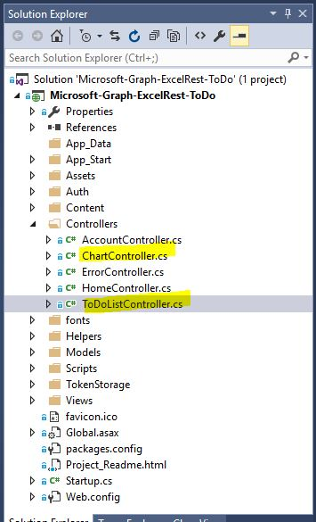

##### `ToDoListController.cs` contents

```csharp
using System.Collections.Generic;
using System.Web.Mvc;
using System.Threading.Tasks;
using System;
using GraphExcel.TokenStorage;
using GraphExcel.Auth;
using System.Configuration;

namespace GraphExcel.Controllers
{
    public class ToDoListController : Controller
    {

        //
        // GET: ToDoList
        public async Task<ActionResult> Index()
        {
            string accessToken = await GetAccessToken();

            await RESTAPIHelper.LoadWorkbook(accessToken);

            return View(await RESTAPIHelper.GetToDoItems(accessToken));
        }

        // GET: ToDoList/Create
        public ActionResult Create()
        {
            var priorityList = new SelectList(new[]
                                          {
                                              new {ID="1",Name="High"},
                                              new{ID="2",Name="Normal"},
                                              new{ID="3",Name="Low"},
                                          },
                            "ID", "Name", 1);
            ViewData["priorityList"] = priorityList;

            var statusList = new SelectList(new[]
                              {
                                              new {ID="1",Name="Not started"},
                                              new{ID="2",Name="In-progress"},
                                              new{ID="3",Name="Completed"},
                                          },
                "ID", "Name", 1);
            ViewData["statusList"] = statusList;

            return View();
        }

        // POST: ToDoList/Create
        [HttpPost]
        public async Task<ActionResult> Create(FormCollection collection)
        {
            try
            {
                string accessToken = await GetAccessToken();

                await RESTAPIHelper.CreateToDoItem(
                    accessToken,
                    collection["Title"],
                    collection["PriorityDD"],
                    collection["StatusDD"],
                    collection["PercentComplete"],
                    collection["StartDate"],
                    collection["EndDate"],
                    collection["Notes"]);
                return RedirectToAction("Index");
            }
            catch
            {
                return View();
            }
        }

        private async Task<string> GetAccessToken()
        {
            string userObjId = AuthHelper.GetUserId(System.Security.Claims.ClaimsPrincipal.Current);
            SessionTokenCache tokenCache = new SessionTokenCache(userObjId, HttpContext);

            string tenantId = System.Security.Claims.ClaimsPrincipal.Current.FindFirst("http://schemas.microsoft.com/identity/claims/tenantid").Value;
            string authority = "common";
            AuthHelper authHelper = new AuthHelper(authority, ConfigurationManager.AppSettings["ida:AppId"], ConfigurationManager.AppSettings["ida:AppSecret"], tokenCache);
            return await authHelper.GetUserAccessToken(Url.Action("Index", "Home", null, Request.Url.Scheme));
        }
    }
}
```

##### `ChartController.cs` contents

```csharp
using System;
using System.Collections.Generic;
using System.Linq;
using System.Web;
using System.Web.Mvc;
using System.Threading.Tasks;
using GraphExcel.TokenStorage;
using GraphExcel.Auth;
using System.Configuration;

namespace GraphExcel.Controllers
{
    public class ChartController : Controller
    {
        public async Task<FileResult> GetChart()
        {
            string userObjId = System.Security.Claims.ClaimsPrincipal.Current.FindFirst("http://schemas.microsoft.com/identity/claims/objectidentifier").Value;
            SessionTokenCache tokenCache = new SessionTokenCache(userObjId, HttpContext);

            string tenantId = System.Security.Claims.ClaimsPrincipal.Current.FindFirst("http://schemas.microsoft.com/identity/claims/tenantid").Value;
            string authority = "common";
            AuthHelper authHelper = new AuthHelper(authority, ConfigurationManager.AppSettings["ida:AppId"], ConfigurationManager.AppSettings["ida:AppSecret"], tokenCache);
            string accessToken = await authHelper.GetUserAccessToken(Url.Action("Index", "Home", null, Request.Url.Scheme));


            return await RESTAPIHelper.getChartImage(accessToken);
        }
    }
}
```

#### Add views

Create new views for To-Do list and Chart pages. 

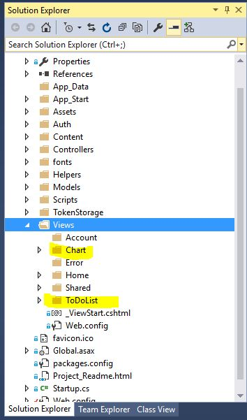

##### Create `Chart` folder and add view `View.cshtml`

`View.cshtml`

```cshtml
@{
    ViewBag.Title = "View";
    Layout = "~/Views/Shared/_Layout.cshtml";
}

<h2>Percent Complete Chart</h2>


```

##### Create `ToDoList` folder and view `Create.cshtml` and `Index.cshtml`

`Create.cshtml`

```cshtml
@model GraphExcel.Models.ToDoItem

@{
    ViewBag.Title = "Create";
    Layout = "~/Views/Shared/_Layout.cshtml";
}

<h2>Create</h2>

@using (Html.BeginForm())
{

    <div class="form-horizontal">
        <h4>ToDoItem</h4>
        <hr />
        @Html.ValidationSummary(true, "", new { @class = "text-danger" })
        <div class="form-group">
            @Html.LabelFor(model => model.Title, htmlAttributes: new { @class = "control-label col-md-2" })
            <div class="col-md-10">
                @Html.EditorFor(model => model.Title, new { htmlAttributes = new { @class = "form-control" } })
                @Html.ValidationMessageFor(model => model.Title, "", new { @class = "text-danger" })
            </div>
        </div>

        <div class="form-group">
            @Html.LabelFor(model => model.Priority, htmlAttributes: new { @class = "control-label col-md-2" })
            <div class="col-md-10">
                @Html.DropDownList("PriorityDD", ViewData["priorityList"] as SelectList)
            </div>
        </div>

        <div class="form-group">
            @Html.LabelFor(model => model.Status, htmlAttributes: new { @class = "control-label col-md-2" })
            <div class="col-md-10">
                @Html.DropDownList("StatusDD", ViewData["statusList"] as SelectList)
            </div>
        </div>

        <div class="form-group">
            @Html.LabelFor(model => model.PercentComplete, htmlAttributes: new { @class = "control-label col-md-2" })
            <div class="col-md-10">
                @Html.EditorFor(model => model.PercentComplete, new { htmlAttributes = new { @class = "form-control" } })
            </div>

        </div>

        <div class="form-group">
            @Html.LabelFor(model => model.StartDate, htmlAttributes: new { @class = "control-label col-md-2" })
            <div class="col-md-10">
                @Html.EditorFor(model => model.StartDate, new { htmlAttributes = new { @class = "form-control" } })
                @Html.ValidationMessageFor(model => model.StartDate, "", new { @class = "text-danger" })
            </div>
        </div>

        <div class="form-group">
            @Html.LabelFor(model => model.EndDate, htmlAttributes: new { @class = "control-label col-md-2" })
            <div class="col-md-10">
                @Html.EditorFor(model => model.EndDate, new { htmlAttributes = new { @class = "form-control" } })
                @Html.ValidationMessageFor(model => model.EndDate, "", new { @class = "text-danger" })
            </div>
        </div>

        <div class="form-group">
            @Html.LabelFor(model => model.Notes, htmlAttributes: new { @class = "control-label col-md-2" })
            <div class="col-md-10">
                @Html.EditorFor(model => model.Notes, new { htmlAttributes = new { @class = "form-control" } })
                @Html.ValidationMessageFor(model => model.Notes, "", new { @class = "text-danger" })
            </div>
        </div>

        <div class="form-group">
            <div class="col-md-offset-2 col-md-10">
                <input type="submit" value="Create" class="btn btn-default" />
            </div>
        </div>
    </div>
}


<div>
    @Html.ActionLink("Back to To Do List", "Index")
</div>


<link rel="stylesheet" href="//code.jquery.com/ui/1.11.4/themes/smoothness/jquery-ui.css">
<script src="//code.jquery.com/jquery-1.10.2.js"></script>
<script src="//code.jquery.com/ui/1.11.4/jquery-ui.js"></script>
<script>
    var now = new Date();
    var startDate = now.toLocaleDateString();
    $('#StartDate').val(startDate);
    $('#StartDate').datepicker({ dateFormat: 'm/d/yy' }).toLocaleString();
    $('#EndDate').datepicker({ dateFormat: 'm/d/yy' }).toLocaleString();;
    $('#PercentComplete').val(0);
</script>

```

`Index.cshtml`

```cshtml
@model IEnumerable<GraphExcel.Models.ToDoItem>

@{
    ViewBag.Title = "Index";
    Layout = "~/Views/Shared/_Layout.cshtml";
}

<h2>To Do List</h2>

<table class="table">
    <tr>
        <th>
            @Html.DisplayNameFor(model => model.Id)
        </th>
        <th>
            @Html.DisplayNameFor(model => model.Title)
        </th>
        <th>
            @Html.DisplayNameFor(model => model.Priority)
        </th>
        <th>
            @Html.DisplayNameFor(model => model.Status)
        </th>
        <th>
            @Html.DisplayNameFor(model => model.PercentComplete)
        </th>
        <th>
            @Html.DisplayNameFor(model => model.StartDate)
        </th>
        <th>
            @Html.DisplayNameFor(model => model.EndDate)
        </th>
        <th>
            @Html.DisplayNameFor(model => model.Notes)
        </th>
        <th></th>
    </tr>

    @foreach (var item in Model)
    {
        <tr>
            <td>
                @Html.DisplayFor(modelItem => item.Id)
            </td>
            <td>
                @Html.DisplayFor(modelItem => item.Title)
            </td>
            <td>
                @Html.DisplayFor(modelItem => item.Priority)
            </td>
            <td>
                @Html.DisplayFor(modelItem => item.Status)
            </td>
            <td>
                @Html.DisplayFor(modelItem => item.PercentComplete)
            </td>
            <td>
                @Html.DisplayFor(modelItem => item.StartDate)
            </td>
            <td>
                @Html.DisplayFor(modelItem => item.EndDate)
            </td>
            <td>
                @Html.DisplayFor(modelItem => item.Notes)
            </td>
        </tr>
    }

</table>

<p>
    @Html.ActionLink("Charts", "GetChart", "Chart")
</p>

<p>
    <span>@Html.ActionLink("Refresh", "Index")</span><span> | </span><span></span>@Html.ActionLink("Add new", "Create")<span></span>
</p>

```

##### Summary of key methods

- `LoadWorkbook` uploads a new Excel workbook to your OneDrie Business under the root folder.
  - As part of this workbook, a new table is created to host the to-do tasks. It consists of specific columns such as Id, task dates, name, completion%, etc.  
- `GetToDoItems` retrieves all the tasks entered in the tasks table. 
- `CreateToDoItem` creates a new task entered in the user interface.   
- `getChartImage` downloads the chart with analysis data.

### Run project

Once above updates are made, run the project (F5 or Press Run Project button). Preferably use private browser mode to experience the full application flow. 

The application launches on your local host and shows the starter page. 


Proceed to sign-in and authorize the app. Once authorized, the application shows the greeting page with menu options. Click on the `ToDoList` link from the top menu bar.    
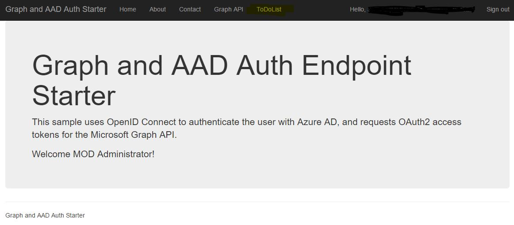

The app uploads `ToDoList.xlsx` and displays task listing page. Since there are no tasks added yet, you will see blank listing.  


Click on the `Add new` link to create a new task. Add few tasks with various stages of status. 
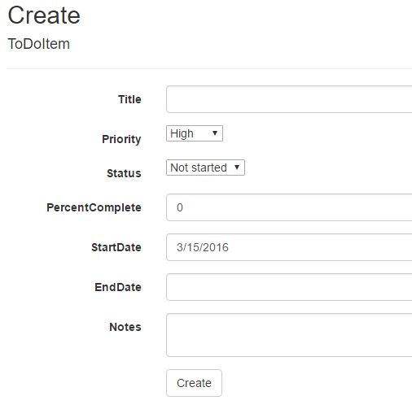

After adding each task, the app shows the updated task listing. If the newly added task is not updated, click the `Refresh` link after few moments. 

A sample list tasks are shown below.  
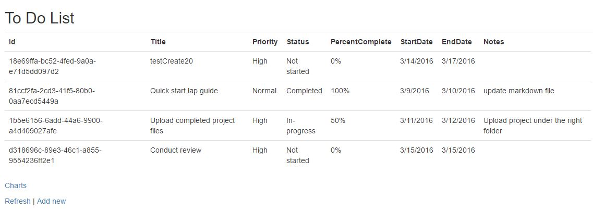

Click on the `Charts' link to see the breakdown of tasks using a pie chart created and downloaded (as image) using the Excel API.


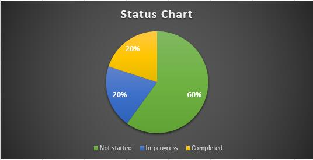

#### View source Excel file

As a last step, you can login to the OneDrive Business account and open the `ToDoList.xlsx` in the browser to see the updates made by the app. **Do not open the file using the Excel desktop application as it will result in edit conflict for future updates made using the app**. 

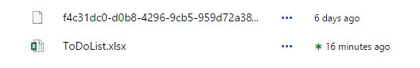

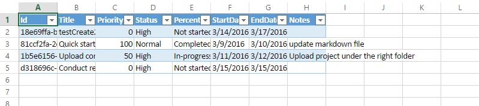

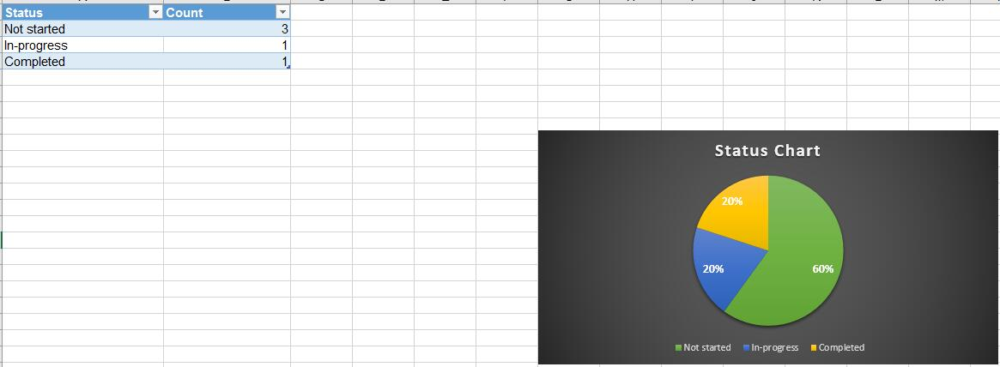

## Overview of Excel API

### Usage scenario

- User maintains or stores Excel files in OneDrive Business. 
- User authorizes a web/mobile application to read/update OneDrive file contents.
- App can access the Excel file contents and make updates over the OneDrive files REST API available through Microsoft Graph. 
- A `/workbook` segment is added in the URL at the end of file identifier to distinguish the Excel API call and access workbook's data model. Example: 
  `https://graph.microsoft.com/v1.0/me/files/{id}/workbook/worksheets/Sheet1/tables`
- Using Excel REST API, App reads or updates the Excel file content as necessary. Any updates made to the file is saved to the document on OneDrive. 

Note: 

- A workbook corresponds to one Excel document. Only one document can be addressed at a time. 
- The Excel API doesn’t allow user to create or delete the document itself. For those functionalities, regular OneDrive files API can be used. 

### Platform support

Currently, the Excel REST APIs are supported on any Excel workbook stored on your OneDrive Business document library or Group's document library. 

### Excel REST object model

There are several resources available as part of Excel API. Below list shows some of the top level important objects.

- Workbook: Workbook is the top level object which contains related workbook objects such as worksheets, tables, named items, etc.
- Worksheet: The Worksheet object is a member of the Worksheets collection. The Worksheets collection contains all the Worksheet objects in a workbook.
- Range: Range represents a cell, a row, a column, a selection of cells containing one or more contiguous blocks of cells.  
- Table: Represents collection of organized cells designed to make management of the data easy. 
  - TableColumn: Represents a column in the table
  - TableRow: Represents a row in the table. 
- Chart: Represents a chart object in a workbook, which is a visual representation of underlying data.  
- NamedItem: Represents a defined name for a range of cells or a value. Names can be primitive named objects (as seen in the type below), range object, etc.
- Application: Represents the Excel application that manages the workbook. Get the calculation mode of the workbook and perform calculation.
- Create Session: Create Excel workbook sessions. It is a good practice to create workbook session and pass it along with the request as part of the request header as it allows the server to link the API request to an existing in-memory copy of the file on the server. If a session ID is not provided, the server dynamically creates a session behind the scene. However, this requires additional server side processing and could add to the latency of the response. Session ID has a life span which gets extended with each usage or regresh. Once a session ID has expired, a new session session ID needs to be created. If an expired or invalid session token is provided as part of the request, the API will return an error indicating that the session ID is not valid.        