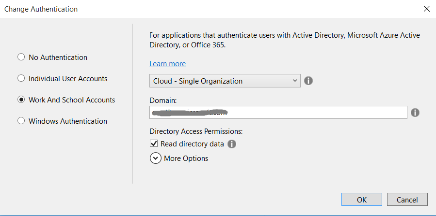
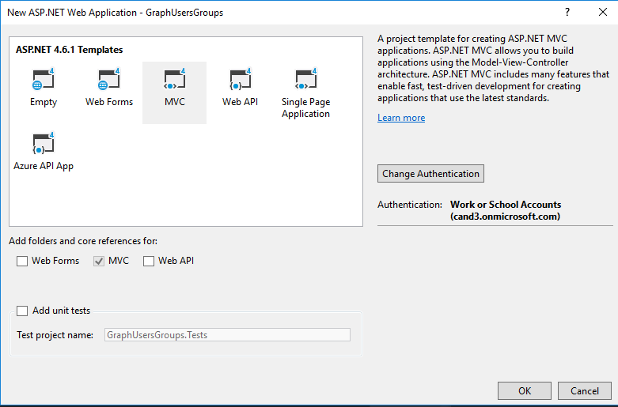
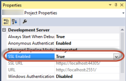
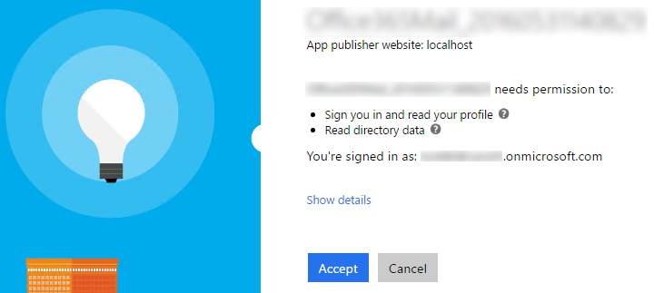
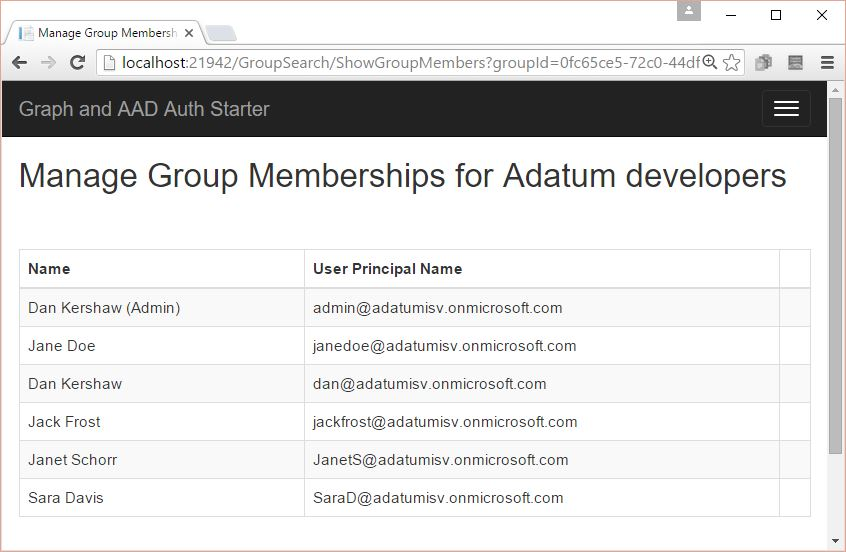

# Connect to Microsoft Graph to manage groups and users

In this lab, you will learn how to use the Microsoft Graph to build user centric applications and create an ASP.NET MVC application that uses the Microsoft Graph client SDK to create a basic group management experience. It will search for groups in your tenant's directory, show their members, and get member details such as their photo. In a bonus exercise, you will learn how to add more users to a group (through a people picker) and remove users from a group.

## Get an Office 365 developer environment
To complete the exercises below, you will require an Office 365 developer environment. Use the Office 365 tenant that you have been provided with for Microsoft Ignite.

## Exercise 1: Create an ASP.NET MVC5 Application

1. In this exercise, you will create the ASP.NET MVC5 application and register it with Azure active Directory.

2. Launch **Visual Studio 2017** as administrator.

3. In Visual Studio, click **File/New/Project**.

4. In the **New Project** dialog.

5. Select **Templates/Visual C#/Web**.

6. Select **ASP.NET Web Application**. Give the project the name **GraphUsersGroups** and Click **OK**.

7. In the **New ASP.NET Project** dialog

8. Click **MVC**.

9. Click **Change Authentication**

10. Select **Work And School Accounts**.

11. Select **Cloud - Single Organization**

12. Input **Domain** of your O365 tenancy

13. Check **Read directory data** under Directory Access Permissions

14. Click **OK**.

   

   

   15. Ensure the web project uses SSL by default:

   16. In the **Solution Explorer** tool window, select the project and look at the **Properties** tool window. 

   17. Ensure **SSL Enabled** is set to **TRUE**.

   18. Copy the **SSL URL** property to the clipboard for use in the next step.

       

       > It is important to do this now because in the next step when you create the application in Azure AD, you want the reply URL to use HTTPS. If you did not do this now, you would have to manually make the changes the Visual Studio wizard is going to do for you in creating the app.

   19. At this point you can test the authentication flow for your application.

   20. In Visual Studio, press **F5**. The browser will automatically launch taking you to the HTTPS start page for the web application.

   21. To sign in, click the **Sign In** link in the upper-right corner.

   22. Login using your **Organizational Account**.

   23. Upon a successful login, since this will be the first time you have logged into this app, Azure AD will present you with the common consent dialog that looks similar to the following image:

   

   24. Click **Accept** to approve the app's permission request on your data in Office 365.

   You will then be redirected back to your web application. However notice in the upper right corner, it now shows your email address & the **Sign Out** link.

   Congratulations... at this point your app is configured with Azure AD and leverages OpenID Connect and OWIN to facilitate the authentication process!

   25. Open the **Web.config** file and find the **appSettings** element. This is where you will need to add your appId and app secret you will generate in the next step.
   26. Launch the Application Registration Portal by navigating your web browser and going to **apps.dev.microsoft.com**. to register a new application.
   27. Sign into the portal using your Office 365 username and password.
   28. Click **Add an App** and type **GraphUsersGroups** for the application name.
   29. Copy the **Application Id** and paste it into the value for **ida:AppId** in your project **web.config** file.
   30. Under **Application Secrets** click **Generate New Password** to create a new client secret for your app.
   31. Copy the displayed app password and paste it into the value for **ida:AppSecret** in your project **web.config** file.
   32. Modify the **ida:AppScopes** value to include the required `User.Read, User.ReadBasic.All, Group.ReadWrite.All`  scopes.

   ```
   <configuration>
     <appSettings>
       <!-- ... -->
       <add key="ida:AppId" value="paste application id here" />
       <add key="ida:AppSecret" value="paste application password here" />
       <!-- ... -->
       <!-- Specify scopes in this value. Multiple values should be comma separated. -->
      <add key="ida:AppScopes" value="User.Read, User.ReadBasic.All, Group.ReadWrite.All" />
     </appSettings>
     <!-- ... -->
   </configuration>
   ```

   33. Add a redirect URL to enable testing on your localhost.
   34. Right-click **GraphUsersGroups** and click **Properties** to open the project properties.
   35. Click **Web** in the left navigation.
   36. Copy the **Project Url** value.
   37. Back on the Application Registration Portal page, click **Add Platform>Web**.
   38. Paste the value of **Project Url** into the **Redirect URIs** field.
   39. Scroll to the bottom of the page and click **Save**.
   40. Press **F5** to compile and launch your new application in the default browser.

## Exercise 2: Implement group search bar and view group memberships using the Microsoft Graph SDK

1. This exercise is based on the project located in the  **\\O3653\O3653-17 Users and Groups\Starter Project** folder. Open the project with Visual Studio 2017. 

    Notice: update web.config and add values for below items.  These values can be found on Exercise 1's web.config.

    ```
    <add key="ida:ClientId" value="" />
    <add key="ida:ClientSecret" value="" />
    <add key="ida:Domain" value="" />
    <add key="ida:TenantId" value="" />
    <add key="ida:AppId" value="" />
    <add key="ida:AppSecret" value="" />
    <add key="ida:PostLogoutRedirectUri" value="" />
    ```

2. In Visual Studio, right-click **GraphUsersGroups**> **Properties** to open the project properties. Click **Web** in the left navigation. Make sure **Project URL** is the same as Exercise 1.

3. Add a reference to the Microsoft Graph SDK to your project

    1. In the Solution Explorer right-click on the **GraphUsersGroups** project and select **Manage NuGet Packages...**
    2. Click Browse and search for Microsoft.Graph.
    3. Select the Microsoft Graph SDK and click **Install**.

4. Create a new controller
    1. Right-click the **Controllers** folder and choose **Add** > **New Scaffolded Item...**
    2. In the **Add Scaffold** dialog, select **MVC 5 Controller - Empty**, and choose **Add**.
    3. In the **Add Controller** dialog, name the controller `GroupSearchController` and choose **Add**..

5. Create an associated view by right-clicking the function **Index()**, **Add View**, and click **Add**. The view is created at **Views\GroupSearch\Index.cshtml**.

6. In **GroupSearchController.cs**, replace the auto-generated **using** directives with

    ```c#
    using System;
    using System.Collections.Generic;
    using System.Web.Mvc;
    using System.Configuration;
    using System.Web.Routing;
    using System.Threading.Tasks;
    using System.Security.Claims;
    using Microsoft.Graph;
    using GraphUsersGroups.TokenStorage;
    using GraphUsersGroups.Auth;
    ```

7. In **GroupSearchController.cs**, insert code into the **GroupSearchController** class to initialize a **GraphServiceClient**, later used to make our calls to Microsoft Graph. The **GraphServiceClient** is initialized by obtaining an access token through the `GetUserAccessToken` helper function.

    ```c#
    public static string appId = ConfigurationManager.AppSettings["ida:AppId"];
    public static string appSecret = ConfigurationManager.AppSettings["ida:AppSecret"];
    public static string aadInstance = ConfigurationManager.AppSettings["ida:AADInstance"];

    private GraphServiceClient GetGraphServiceClient()
    {
        string userObjId = ClaimsPrincipal.Current.FindFirst("http://schemas.microsoft.com/identity/claims/objectidentifier").Value;
        string tenantID = ClaimsPrincipal.Current.FindFirst("http://schemas.microsoft.com/identity/claims/tenantid").Value;
        string authority = "common";
        SessionTokenCache tokenCache = new SessionTokenCache(userObjId, HttpContext);

        // Create an authHelper using the the app Id and secret and the token cache.
        AuthHelper authHelper = new AuthHelper(authority,appId,appSecret,tokenCache);

        // Request an accessToken and provide the original redirect URL from sign-in.
        GraphServiceClient client = new GraphServiceClient(new DelegateAuthenticationProvider(async (request) =>
        {
            string accessToken = await authHelper.GetUserAccessToken(Url.Action("Index", "Home", null, Request.Url.Scheme));
            request.Headers.TryAddWithoutValidation("Authorization", "Bearer " + accessToken);
        }));

        return client;
    }
    ```

8. In **GroupSearchController.cs**, insert code into the **Index()** function to render the view the first time the page loads.

    ```csharp
        // GET: GroupSearch
        public ActionResult Index()
        {
            // Return an empty list of groups when the page first loads.
            List<Group> groups = new List<Group>();
            return View(groups);
        }
    ```

9. In the same file, add the following function to make the Graph query for groups. The view passes a **searchString** and this function builds the query and returns the results to the view.

    ```csharp
        [HttpPost]
        public async Task<ActionResult> Index(FormCollection fc, string searchString)
        {
            // Search for users with name or mail that includes searchString.
            var client = GetGraphServiceClient();

            List<Group> groups = new List<Group>();

            // Graph query for groups, filtering by displayName, mail, and mailNickname.
            // Only query for displayName, userPrincipalName, id of matching users through select.
            try
            {
                var result = await client.Groups.Request().Top(10).Filter("startswith(displayName,'" + searchString +
                "') or startswith(mail,'" + searchString +
                "') or startswith(mailNickname,'" + searchString + "')").Select("displayName,description,id").GetAsync();

                // Add users to the list and return to the view.
                foreach (Group _group in result)
                {
                    groups.Add(_group);
                }
            }
            catch (Exception)
            {
                return View("Error");
            }
            return View(groups);
        }
    ```

10. In the same file, add the following function that will make a query to Graph to get the members of the selected group. Initially this won't feature any paging, but will get the first 10 members. We'll add paging later.
 ```csharp
 [Authorize]
 // GET group members and page through the results (10 at a time)
 public async Task<ActionResult> GroupMembers(string groupId, string nextLink)
 {
     // Show the profile of a user after a user is clicked from the search.
     var client = GetGraphServiceClient();
     List<User> userMembers = new List<User>();
     IGroupMembersCollectionWithReferencesPage members = new GroupMembersCollectionWithReferencesPage();
     IGroupMembersCollectionWithReferencesRequest membersRequest = null;

     try
     {

         if (groupId != null)
         {
             var group = await client.Groups[groupId].Request().Select("displayName,id").GetAsync();
             ViewBag.groupId = groupId;
             ViewBag.groupName = group.DisplayName;
             membersRequest = client.Groups[groupId].Members.Request().Top(10);
         }
         members = await membersRequest.GetAsync();

         foreach (DirectoryObject d in members.CurrentPage)
         {
             User u = d as User;
             userMembers.Add(u);
         }
     }
     catch (Exception)
     {
         // no users?
     }
     return View(userMembers);
 }
 ```

11. Replace the contents of **Views\GroupSearch\Index.cshtml** with the following code. This renders a search bar and a table to display the group results.

     ```xml
     @using Microsoft.Graph
     @model List<Group>
     @{
         ViewBag.Title = "Find a group";
     }
     <h2>@ViewBag.Title</h2>

     @using (Html.BeginForm())
     {
         <div class="input-group">
             <input type="text" name="searchString" class="form-control" placeholder="Search by name or email...">
             <span class="input-group-btn">
                 <input type="submit" value="Search" class="btn btn-default" />
             </span>
         </div>
     }
     <table class="table table-bordered table-striped table-hover">
         @foreach (var group in Model)
         {
             <tr onclick="location.href = '@(Url.Action("GroupMembers", "GroupSearch", new { groupId = group.Id, nextLink = "" }))'">
                 <td>
                     @Html.DisplayFor(modelItem => group.DisplayName)
                 </td>
                 <td>
                     @Html.DisplayFor(modelItem => group.Description)
                 </td>
             </tr>
         }

     </table>
     ```

12. Add the following code to **Views\Shared\\_Layout.cshtml**, directly under the line ``` <li>@Html.ActionLink("Contact", "Contact", "Home")</li>``` to add a link to the navbar at the top of the page.

     ```xml
     @if (Request.IsAuthenticated)
     {
     <li>@Html.ActionLink("Group Management", "Index", "GroupSearch")</li>
     }
     ```

13. Finally, let's create a new view to display the group memberships of a selected group. Right-click **Views>GroupSearch**, select **Add** and **View**, click **Add** and name it **GroupMembers**. Replace the contents of this file with the following.  Note that we have some placeholders for further functionality that we'll add later.

     ```xml
     @using Microsoft.Graph
     @model List<User>
     @{
         ViewBag.Title = "Manage Group Memberships";
     }
     <h2>@ViewBag.Title for @ViewBag.groupName</h2>

     @* Add new members here *@ 

     <div class="row" style="margin-top:50px;">
         <div class="col-sm-12">
             <div class="table-responsive">
                 <table id="membersTable" class="table table-bordered table-striped table-hover">
                     <thead>
                         <tr>
                             <th>Name</th>
                             <th>User Principal Name</th>
                             <th></th>
                         </tr>
                     </thead>
                     <tbody>
                         @foreach (var user in Model)
                         {
                             <tr>
                                 <td>
                                     @Html.DisplayFor(modelItem => user.DisplayName)
                                 </td>
                                 <td>
                                     @Html.DisplayFor(modelItem => user.UserPrincipalName)
                                 <td>
                                     @* Add a remove button here *@
                                 </td>
                             </tr>
                         }
                     </tbody>
                 </table>
             </div>
             <div class="btn btn-group-sm">
                 @* Add a next page button here (paging) *@
             </div>     
         </div>
     </div>
     ```

14. Press **F5** to debug your app! First sign in, then explore the navbar **Group Management** link. Search for groups by complete or incomplete name or email. Try typing *a* and pressing the search button. Then click a group to expand its group memberships. You should see something like this:

     

## Exercise 3: Paged members and a detailed user profile page
In this step, we'll enable selecting a user from the group members search results table, for whom we'll show more details.  We'll also add in paging and a new button to allow you to page through the results. 
1. Go back to the **GroupSearchController** and find the **GroupMembers** function. Find the `members = await membersRequest.GetAsync();` line, and replace with following code.  This will manage the next link paging.
    ```csharp
    if (nextLink != null)
    {
        membersRequest = new GroupMembersCollectionWithReferencesRequest(nextLink, client, null);
    }
    members = await membersRequest.GetAsync();
    if (members.NextPageRequest != null)
    {
        ViewBag.NextLink = members.NextPageRequest.GetHttpRequestMessage().RequestUri;
    }
    else
    {
        ViewBag.NextLink = null;
    }
    ```
2. Create a new controller for user functionality.
     1. Right-click the **Controllers** folder and choose **Add** > **New Scaffolded Item...**
     2. In the **Add Scaffold** dialog, select **MVC 5 Controller - Empty**, and choose **Add**. 
     3. In the **Add Controller** dialog, name the controller `UserSearchController` and choose **Add**. 

3. Right-click the folder **Models**, **Add**, **Class**, and name it **Profile.cs**. Replace the contents of this class with the following.

    ```csharp
    using System;
    using System.Collections.Generic;
    using System.Linq;
    using System.Web;

    namespace GraphUsersGroups.Models
    {
        using Microsoft.Graph;
        using System;

        public class Profile
        {
            public String photo { get; set; }
            public User user { get; set; }
        }

        public class GroupModel
        {
            public static String groupId { get; set; }
        }
    }
    ```
4. Replace the existing `using` directives in **UserSearchController.cs** with the following:

    ```csharp
    using System;
    using System.IO;
    using System.Collections.Generic;
    using System.Configuration;
    using System.Web.Mvc;
    using System.Threading.Tasks;
    using System.Security.Claims;
    using Microsoft.Graph;
    using GraphUsersGroups.TokenStorage;
    using GraphUsersGroups.Auth;
    using GraphUsersGroups.Models;
    ```
5. Add the following code to **UserSearchController.cs**. This is like the code we added in **GroupSearchController** to acquire an access token and a function to get more profile information of the selected user and their photo. This is passed to a new view through a Profile object we created earlier.
    ```csharp
    public static string appId = ConfigurationManager.AppSettings["ida:AppId"];
    public static string appSecret = ConfigurationManager.AppSettings["ida:AppSecret"];
    public static string aadInstance = ConfigurationManager.AppSettings["ida:AADInstance"];

    private GraphServiceClient GetGraphServiceClient()
    {
        string userObjId = ClaimsPrincipal.Current.FindFirst("http://schemas.microsoft.com/identity/claims/objectidentifier").Value;
        string tenantID = ClaimsPrincipal.Current.FindFirst("http://schemas.microsoft.com/identity/claims/tenantid").Value;
        string authority = "common";
        SessionTokenCache tokenCache = new SessionTokenCache(userObjId, HttpContext);

        // Create an authHelper using the the app Id and secret and the token cache.
        AuthHelper authHelper = new AuthHelper(
            authority,
            appId,
            appSecret,
            tokenCache);

        // Request an accessToken and provide the original redirect URL from sign-in.
        GraphServiceClient client = new GraphServiceClient(new DelegateAuthenticationProvider(async (request) =>
        {
            string accessToken = await authHelper.GetUserAccessToken(Url.Action("Index", "Home", null, Request.Url.Scheme));
            request.Headers.TryAddWithoutValidation("Authorization", "Bearer " + accessToken);
        }));

        return client;
    }
    public async Task<ActionResult> ShowProfile(string userId)
    {
        // Show the profile of a user after a user is clicked from the search.
        var client = GetGraphServiceClient();
        Profile profile = new Profile();

        try {
            // Graph query for user details by userId.
            profile.user = await client.Users[userId].Request().GetAsync();
            profile.photo = "";

            // Graph query for user photo by userId.
            var photo = await client.Users[userId].Photo.Content.Request().GetAsync();

            if (photo != null)
            {
                // Convert to MemoryStream for ease of rendering.
                using (MemoryStream stream = (MemoryStream)photo)
                {
                    string toBase64Photo = Convert.ToBase64String(stream.ToArray());
                    profile.photo = "data:image/jpeg;base64, " + toBase64Photo;
                }
            }
        }
        catch (Exception)
        {
            // no photo
        }
        finally
        {
            
        }

        return View(profile);
    }
    ```
6. Create a new view under **Views\UserSearch** and name it **ShowProfile**. This view will display a user profile include their photo, if they have one. Replace the contents of this file with the following:
    ```xml
    @model GraphUsersGroups.Models.Profile
    @{
        ViewBag.Title = "User profile details";
    }

    <h2>Profile</h2>

    @{if (Model.user.GivenName != null && Model.user.Surname != null)
        {
            <h3> @Model.user.GivenName @Model.user.Surname </h3>
        }
    }
    @{ if (Model.photo != "")
        {
            <div style="height: 200px">
                
            </div>
        }
        else
        {
            <h4> No photo on record </h4>
        }
    }

    <table class="table table-bordered table-striped">
        <tr>
            <td>Display name</td>
            <td>
                @if (!string.IsNullOrEmpty(Model.user.DisplayName))
                {
                    @Html.DisplayFor(modelItem => Model.user.DisplayName)
                }
            </td>
        </tr>
        <tr>
            <td>Mail</td>
            <td>
                @if (!string.IsNullOrEmpty(Model.user.Mail))
                {
                    @Html.DisplayFor(modelItem => Model.user.Mail)
                }
            </td>
        </tr>
        <tr>
            <td>Job title</td>
            <td>
                @if (!string.IsNullOrEmpty(Model.user.JobTitle))
                {
                    @Html.DisplayFor(modelItem => Model.user.JobTitle)
                }
            </td>
        </tr>
        <tr>
            <td>Mobile phone</td>
            <td>
                @if (!string.IsNullOrEmpty(Model.user.MobilePhone))
                {
                    @Html.DisplayFor(modelItem => Model.user.MobilePhone)
                }
            </td>
        </tr>
        <tr>
            <td>Office</td>
            <td>
                @if (!string.IsNullOrEmpty(Model.user.OfficeLocation))
                {
                    @Html.DisplayFor(modelItem => Model.user.OfficeLocation)
                }
            </td>
        </tr>
    </table>
    ```

7. Now, finish tying this all together.  Go back to the **Views\GroupSearch GroupMembers** view and replace the first `<tr>` under the `foreach` statement with the following. This will allow you to click a member of a group, and show more details about that user.
    ```xml
    <tr onclick="location.href = '@(Url.Action("ShowProfile", "UserSearch", new { userId = user.Id }))'">
    ```
8. Finally, we need to connect the paging with a next button control in the **GroupMembers** view. Find the comment that says *Add a next button* and replace with:
    ```xml
    @{ 
    Dictionary<string, object> attributes2 = new Dictionary<string, object>();
    attributes2.Add("class", "btn btn-default");

    if (null != ViewBag.NextLink)
    {
        RouteValueDictionary routeValues3 = new RouteValueDictionary();
        routeValues3.Add("groupId", "");
        routeValues3.Add("nextLink", ViewBag.NextLink);
        @Html.ActionLink("Next Page", "GroupMembers","GroupSearch", routeValues3, attributes2);
        }
    }
    ```
9. Press **F5** to compile and try the new ShowProfile page. Search for groups, view the members, and page through them and click a user to see their details.

***
**Congratulations on creating your GraphUsersGroups app!** You created an MVC application that uses Microsoft Graph to search groups and view users in your tenant. Don't stop here - there's plenty more to explore with the Microsoft Graph.  
- See this training and more on `http://dev.office.com/`
- Learn about and connect to the Microsoft Graph at `https://graph.microsoft.io`
- Or try some option bonus exercises below

## Exercise 4: Optional Bonus
This step is entirely optional. Here we'll add code that will allow you to add new users to a group (with a people picker), and buttons that allow you to remove users from a group.

1. First, let's add the code to add a member to a group and to remove a member from a group.  We'll add this to our trusty **GroupSearchController**. Each function routes the user back to the GroupMembers view after adding or removing a member. 
    ```csharp
    [Authorize]
    // ADD group member
    public async Task<ActionResult> AddMember(string id, string groupId)
    {
        var client = GetGraphServiceClient();

        // Get the user as a directory object.
        DirectoryObject memberToAdd = await client.DirectoryObjects[id].Request().GetAsync();

        // Build a request to identify a particular member object in the group.
        var request = client.Groups[groupId].Members.References.Request();

        // Submit the add request.
        await request.AddAsync(memberToAdd);

        RouteValueDictionary routeValues = new RouteValueDictionary();
        routeValues.Add("groupId", groupId);
        routeValues.Add("nextLink", null);
        return RedirectToAction("GroupMembers", "GroupSearch", routeValues);
    }

    [Authorize]
    // REMOVE group member
    public async Task<ActionResult> RemoveMember(string id, string groupId)
    {
        var client = GetGraphServiceClient();

        // Build a request to identify a particular member object in the group.
        var request = client.Groups[groupId].Members[id].Reference.Request();

        // Submit the remove request.
        await request.DeleteAsync();

        RouteValueDictionary routeValues = new RouteValueDictionary();
        routeValues.Add("groupId", groupId);
        routeValues.Add("nextLink", null);
        return RedirectToAction("GroupMembers", "GroupSearch", routeValues);
    }
    ```
2. We'll also add another function that will route a request to a people picker experience to pick a user to add to the group.
    ```csharp
    public async Task<ActionResult> FindUserForGroup(string groupId)
    {

        RouteValueDictionary routeValues = new RouteValueDictionary();
        routeValues.Add("groupId", groupId);

        return RedirectToAction("Index", "UserSearch", routeValues);
    }
    ```
3. For the people picking experience, we'll need to create an associated `Index` view opening the **UserSearchController** and right-clicking the function **Index()** under **Controllers\UserSearch, **Add View**, and click **Add**. The view is created at **Views\UserSearch\Index.cshtml**. We'll be updating this later.

4. Now, add a function to search for a user, based on an input search string. So in **UserSearchController**...
    1. Add the following function, that uses the Graph to search for users.
    ```csharp
    [HttpPost]
    public async Task<ActionResult> Index(FormCollection fc, string searchString)
    {
        // Search for users with name or mail that includes searchString.
        var client = GetGraphServiceClient();

        List<User> people = new List<User>();

        // Graph query for users, filtering by displayName, givenName, surname, UPN, mail, and mailNickname.
        // Only query for displayName, userPrincipalName, id of matching users through select.
        try
        {
            var result = await client.Users.Request().Top(7).Filter("startswith(displayName,'" + searchString +
            "') or startswith(givenName,'" + searchString +
            "') or startswith(surname,'" + searchString +
            "') or startswith(userPrincipalName,'" + searchString +
            "') or startswith(mail,'" + searchString +
            "') or startswith(mailNickname,'" + searchString + "')").Select("displayName,userPrincipalName,id").GetAsync();

            // Add users to the list and return to the view.
            foreach (User u in result)
            {
                people.Add(u);
            }
        }
        catch (Exception)
        {
            return View("Error");
        }
        return View(people);
    }
    ```
    2. Update the existing `Index()` function and replace with:
    ```csharp
    // GET: UserSearch
    public ActionResult Index(string groupId)
    {
        // Need to pass the originating groupId to the view
        GroupModel.groupId = groupId;

        // Return an empty list of people when the page first loads
        List<User> people = new List<User>();
        return View(people);
    }
    ```
5. Now we've updated the controller, update the **UserSearch Index** view.  This will light up a view for the people picker. Picking a user from the search results will invoke the AddMember function from above, and add that user to the group, before returning to the **GroupMembers** view.
    ```xml
    @using Microsoft.Graph
    @using GraphUsersGroups.Models
    @model List<User>
    @{
    ViewBag.Title = "Find a user to add to the group";
    }
    <h2>@ViewBag.Title</h2>

    @using (Html.BeginForm())
    {
    <div class="input-group">
        <input type="text" name="searchString" class="form-control" placeholder="Search by name or email...">
        <span class="input-group-btn">
            <input type="submit" value="Search" class="btn btn-default" />
        </span>
    </div>
    }
    <table class="table table-bordered table-striped table-hover">
    @foreach (var _user in Model)
    {
            <tr onclick="location.href = '@(Url.Action("AddMember", "GroupSearch", new { id = _user.Id, groupId = GroupModel.groupId }))'">
                <td>
                    @Html.DisplayFor(modelItem => _user.DisplayName)
                </td>
                <td>
                    @Html.DisplayFor(modelItem => _user.UserPrincipalName)
                </td>
            </tr>
        }  
    </table>
    ```
6. Finally, we need to add buttons for both adding members and removing members to the **GroupMembers** view.
    1. Add a button for adding members, by replacing the "Add new members here" comment with:
    ```xml
    @{
    Dictionary<string, object> attributes4 = new Dictionary<string, object>();
    RouteValueDictionary routeValues4= new RouteValueDictionary();
    routeValues4.Add("groupId", ViewBag.groupId);
    attributes4.Add("class", "btn btn-default");
    @Html.ActionLink("Add member", "FindUserForGroup", "GroupSearch", routeValues4, attributes4);
    }
    ```
    2. Add a button on each row in the **membersTable** to enable removal, by replacing the "Add a remove button here" with:
    ```xml
    @{ 
    Dictionary<string, object> attributes1 = new Dictionary<string, object>();
    attributes1.Add("class", "btn btn-warning");

    RouteValueDictionary routeValues1 = new RouteValueDictionary();
    routeValues1.Add("id", user.Id);
    routeValues1.Add("groupId", ViewBag.groupId);
    @Html.ActionLink("Remove", "RemoveMember", "GroupSearch", routeValues1, attributes1);
    }
    ```
7. That should do it. Press **F5** and debug. You should now see an **Add member** button, that when clicked takes you to a people picking experience. Choose a user, and then see that you arrive back at the same membership view, but with your new user. Click the **Remove** button, and you should see the screen refresh without the removed user.

***
**Congratulations, dedicated quick start developer!** This quick start ends here. Don't stop here - there's plenty more to explore with the Microsoft Graph.

## Next Steps and Additional Resources:  
- See this training and more on `http://dev.office.com/`
- Learn about and connect to the Microsoft Graph at `https://graph.microsoft.io`
