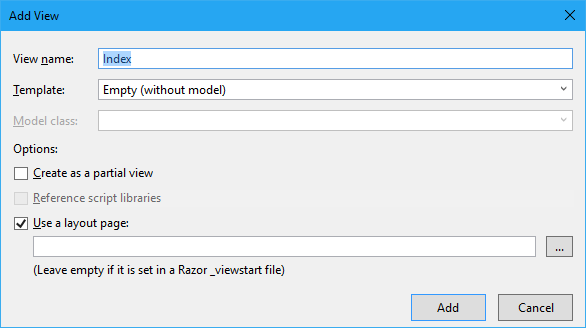

# Connect to people with the Microsoft Graph, find contacts if you don't know the spelling
In this lab, Learn how to use the machine learning powered People API in Microsoft Graph to find a contact or colleague even if you don’t know how to spell their name. You will use the Microsoft Graph to integrate the Office 365 People API with an ASP.NET MVC application.

## Prerequisites
1. You must have an Office 365 tenant and Microsoft Azure subscription to complete this lab. If you do not have one, the lab for **O3651-7 Setting up your Developer environment in Office 365** shows you how to obtain a trial.
2. You must have Visual Studio 2017 with the ASP.NET and web application components installed.

## Exercise 1: Add the PeopleController and call the People API
1. Launch Visual Studio 2017.
	1. Locate the [StarterFiles\PeopleGraphWeb](StarterFiles\PeopleGraphWeb) folder that contains a starter project. The starter project is an ASP.NET MVC5 web application that you will update to call the Microsoft Graph API.
	2. Open the **PeopleGraphWeb** solution in Visual Studio 2017.
	3. Open the **Web.config** file and find the **appSettings** element. This is where you will need to add your appId and app secret you will generate in the next steps.
	4. Set the value for **ida:Domain** with your domain of your tenant(e.g. example.onmicrosoft.com) in your project's **Web.config** file
  
2. Launch the Application Registration Portal by opening a browser and navigating to https://apps.dev.microsoft.com to register a new application.
	1. Sign into the portal using your Office 365 work account username and password.
	2. Click **Add an App** and type **PeopleGraphWeb** for the application name.
	3. Copy the **Application Id** and paste it into the value for **ida:AppId** in your project's **Web.config** file.
	4. Under **Application Secrets** click **Generate New Password** to create a new client secret for your app.
	5. Copy the displayed app password and paste it into the value for **ida:AppSecret** in your project's **Web.config** file.
	6. Under **Platforms**, click **Add Platform**, select **Web** in the popup window.
	7. Copy the value for **ida:PostLogoutRedirectUri** in your project's **Web.config** file and paste it into the **Redirect URLs** and **Logout URL** for the application in the Application Registration Portal.
	8. Save the changes for the application in the Application Registration Portal.
	9. Save the **Web.config** file in your project.

3. In visual studio, open **Solution Explorer**, right-click the **Controllers** folder and select **Add > New Scaffolded Item**. 
	1. Select **MVC5 Controller - Empty** and click **Add**.
	2. Name the controller **PeopleController** and click **Add**.
	3. Copy the following `using` statements to the top of the **PeopleController** file, replacing the existing ones:

		````c#
		using System;
		using System.Collections.Generic;
		using System.Configuration;
		using System.Linq;
		using System.Security.Claims;
		using System.Threading.Tasks;
		using System.Web.Mvc;
		using System.Net.Http;
		using Newtonsoft.Json;
		using PeopleGraphWeb.Auth;
		using PeopleGraphWeb.Models;
		using PeopleGraphWeb.TokenStorage;
		````

	4. Add the following code inside the **PeopleController** class:

		````c#
		private static string _msGraphEndpoint = "https://graph.microsoft.com/beta";
		````

	5. Add the following helper functions that will handle authentication to the **PeopleController** class.

		````c#
		private async Task<string> GetToken()
		{
		    string userObjId = AuthHelper.GetUserId(System.Security.Claims.ClaimsPrincipal.Current);
		    SessionTokenCache tokenCache = new SessionTokenCache(userObjId, HttpContext);
		
		   var authority = ConfigurationManager.AppSettings["ida:AADInstance"] + "common";
		   var appId = ConfigurationManager.AppSettings["ida:AppId"];
		   var appSecret = ConfigurationManager.AppSettings["ida:AppSecret"];
		   AuthHelper authHelper = new AuthHelper(authority, appId, appSecret, tokenCache);
		   var redirectUri = ConfigurationManager.AppSettings["ida:PostLogoutRedirectUri"];
		   return await authHelper.GetUserAccessToken(redirectUri);
		}
		
		private HttpClient GetHttpClient(string token)
		{
		    var client = new HttpClient();
		    client.DefaultRequestHeaders.Add("Accept", "application/json");
		
		    // set the access token on all requests to the Microsoft Graph API
		    client.DefaultRequestHeaders.Add("Authorization", "Bearer " + token);
		    return client;
		}

        private async Task<string> SendRequestAsync(string token, string query)
        {
            var client = GetHttpClient(token);
            // create request
            var request = new HttpRequestMessage(HttpMethod.Get, query);

            // issue request & get response
            var response = await client.SendAsync(request);
            return await response.Content.ReadAsStringAsync();
        }
		````

	6. Add the following helper functions that will retrieve people to the **PeopleController** class.

		````c#
        private async Task<IEnumerable<People>> GetPeopleByUserAsync(string token, string userId)
        {
            // create query
            var query = string.IsNullOrEmpty(userId) ? _msGraphEndpoint + "/me/people" : string.Format("{0}/users/{1}/people", _msGraphEndpoint, userId);
            string content = await SendRequestAsync(token, query);
            var peoples = JsonConvert.DeserializeObject<Collection<People>>(content);
            return peoples.value;
        }
		````

	7. **Replace** the **Index** method with the following code to retrieve people.
      
		````c#
		public async Task<ActionResult> Index(string userId)
		{
		    var token = await GetToken();
		    if (!string.IsNullOrEmpty(token))
		    {
		        var model = await GetPeopleByUserAsync(token, userId);
		        return View(model);
		    }
		    return RedirectToAction("SignOut", "Account");
		}
		````

	8. Save the file.

4. Add the view for the Index action. 
	1. Within the **PeopleController** class, right click the `View(model)` method inside the `Index()` action and select **Add View**.
   
	2. Make sure the following properties are entered in the **Add View** dialog:
		1. View Name: **Index**.
		2. Template: **Empty (without model)**.
		3. Leave all other fields default.

		

	3. Click **Add**.
	4. Within the **Views/People/Index.cshtml** file, replace all the code in the file with the following code:
      
		````html
		@model IEnumerable<PeopleGraphWeb.Models.People>
		
		@{
		    ViewBag.Title = "People";
		}
		
		@if (Model != null && Model.Any())
		{
		    <table class="table">
		        <tr>
		            <th>Display Name</th>
		            <th></th>
		        </tr>
		
		        @foreach (var item in Model)
		        {
		            <tr>
		                <td>
		                    @item.DisplayName
		                </td>
		                <td>
		                    @Html.ActionLink("Details", "Details", new { userId = ViewBag.UserId, peopleId = item.Id })
		                </td>
		            </tr>
		        }
		
		    </table>
		}
		else
		{
		    <p>No relevant people for this user.</p>
		}
		````

	5. Save the file.   

### Edit the default layout to point to our new controller
1. Open the **_Layout.cshtml** file found in the **Views/Shared** folder.
2. Locate the part of the file that includes links at the top of the page:
  
	````html
	<ul class="nav navbar-nav">
		<li>@Html.ActionLink("Home", "Index", "Home")</li>
		<li>@Html.ActionLink("About", "About", "Home")</li>
		<li>@Html.ActionLink("Contact", "Contact", "Home")</li>
	</ul>
	````

3. Update that navigation to have two new links (the **Insights** and **Users** links added below). 

	````html
	<ul class="nav navbar-nav">
		<li>@Html.ActionLink("Home", "Index", "Home")</li>
		<li>@Html.ActionLink("About", "About", "Home")</li>
		<li>@Html.ActionLink("Contact", "Contact", "Home")</li>
		<li>@Html.ActionLink("People", "Index", "People")</li>
	</ul>
	````

### Verify that the project works

1. Press **F5** to begin debugging.
2. Sign in with your Office 365 account, review the permissions the application you are requesting, and click **Accept**.
3. Click the **People** link at the top of the page.
3. Verify that your application displays the top relevant people for the current logged-in user.
4. Stop debugging.

	> **NOTE**: The web application enabled SSL by default. However, since a default certificate is not configured for your computer, your browser will report a certificate error. Depending on the browser you are using, you will need to add an exception (for example: Mozilla, Firefox) or click Advanced and select to proceed to the website (for example: Microsoft Edge, Google Chrome).

## Exercise 2: Add support for people search and the details page

1. In **PeopleController** class, add the following helper function that will get details of a specific people:

	```c#
    private async Task<People> GetPeopleDetailByUserAsync(string token, string userId, string peopleId)
    {
        // create query
        var query = string.IsNullOrEmpty(userId) ? _msGraphEndpoint + "/me/people" : string.Format("{0}/users/{1}/people", _msGraphEndpoint, userId);
        query += "/" + peopleId;
        string content = await SendRequestAsync(token, query);
        return JsonConvert.DeserializeObject<People>(content);
    }

    private async Task<IEnumerable<People>> SearchPeopleAsync(string token, string searchText)
    {
        // create query
        var query = _msGraphEndpoint + "/me/people?$search=" + searchText;

        string content = await SendRequestAsync(token, query);
        var peoples = JsonConvert.DeserializeObject<Collection<People>>(content);
        return peoples.value;
    }
	```
  
2. In **PeopleController** class, add the **Search** and **Details** actions:

	```c#
    public async Task<ActionResult> Search(string searchText)
    {
        var token = await GetToken();
        if (!string.IsNullOrEmpty(token))
        {
            var model = await SearchPeopleAsync(token, searchText);
            return View("Index", model);
        }
        return RedirectToAction("SignOut", "Account");
    }

    public async Task<ActionResult> Details(string userId, string peopleId)
    {
        var token = await GetToken();
        if (!string.IsNullOrEmpty(token))
        {
            var model = await GetPeopleDetailByUserAsync(token, userId, peopleId);
            return View(model);
        }
        return RedirectToAction("SignOut", "Account");
    }
	```
  
3. Add the Details view.
	1. Within the **PeopleController** class, right click the `View(model)` method inside the `Details()` action and select **Add View**.
   
	2. Make sure the following properties are entered in the **Add View** dialog:
		1. View Name: **Details**.
		2. Template: **Empty (without model)**.
		3. Leave all other fields default.

	3. Click **Add**.
	4. Within the **Views/People/Details.cshtml** file, replace all the code in the file with the following code:
      
	````html
	@model PeopleGraphWeb.Models.People
			  
	@{
	  ViewBag.Title = "People Details";
	}
	
	<table class="table">
	  <tr>
	      <th>Display Name</th>
	      <th>Title</th>
	      <th>Department</th>
	  </tr>
	  <tr>
	     <td>@Model.DisplayName</td>
	      <td>@Model.Title</td>
	      <td>@Model.Department</td>
	  </tr>
	
	</table>
	````

	5. Save the file.  

4. Update the Index view to support search. In **Views/People/Index.cshtml**, locate the code `@if (Model != null && Model.Any())` and add the following code right above it:
  
	 ````html
	@if (string.IsNullOrEmpty(ViewBag.UserId))
	{
	    using (Html.BeginForm("Search", "People", FormMethod.Get))
	    {
	        @Html.Label("Seach:")
	        @Html.TextBox("searchText")
	        <input type="submit" value="Search" />
	    }
	}
	````

	> **NOTE**: This allows the user to enter search strings that will be passed to the search action. The search form is only shown when the page is showing people of the current logged in user, because search is not supported for people of other users.

4. Verify the search and details features work.
	1. Press **F5** to begin debugging.
	2. Sign in with your Office 365 account and click the **People** link at the top of the page.
	3. Verify that your application displays the top relevant people for the current logged-in user.
	4. Click **Details** for a user and verify the details are shown.
	5. Go back to the index page and enter a search term into the **Search** field, then click **Search** button.
	6. Check the returned fuzzy matched result.

## Exercise 3: Add support for working with related people
1. In **Views/People/Index.cshtml**, add a new column to the table that links to the related people action:
	 ````html
	<td>
	    @Html.ActionLink("Related People", "Index", new { userId = item.Id }) 
	</td> 
	 ````

  The table should now look like this:

	 ````html
	<table class="table">
	    <tr>
	        <th>Display Name</th>
	        <th></th>
	        <th></th>
	    </tr>
	  
	    @foreach (var item in Model)
	    {
	        <tr>
	            <td>
	                @item.DisplayName
	            </td>
	            <td>
	                @Html.ActionLink("Details", "Details", new { id = item.Id })
	            </td>
	            <td>
	                @Html.ActionLink("Related People", "Index", new { userId = item.Id }) 
	            </td> 
	        </tr>
	    }
	
	</table>
	 ````
      
2. Verify the related people feature works.
  1. Press **F5** to begin debugging.
  2. Sign in with your Office 365 account and click the **People** link at the top of the page.
  3. Click **Related People** for a user and verify the related contacts are shown.
  4. Verify the search and details features work for related people.

