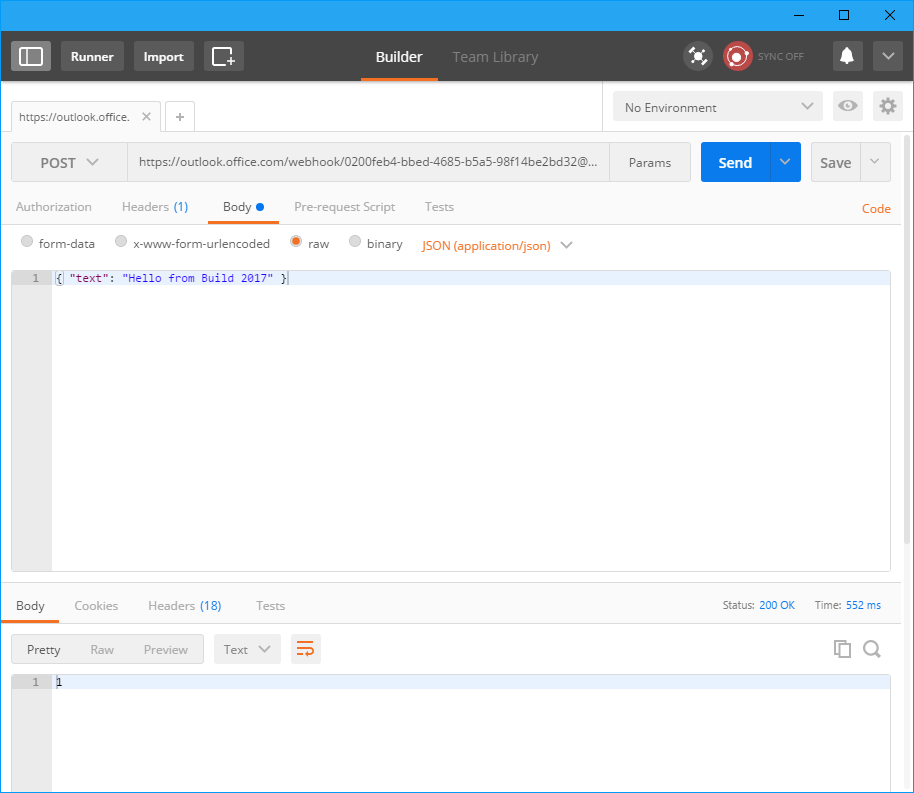
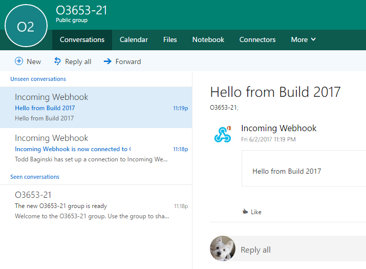
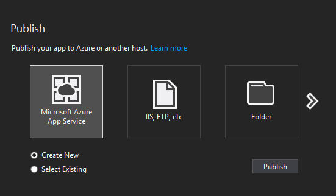
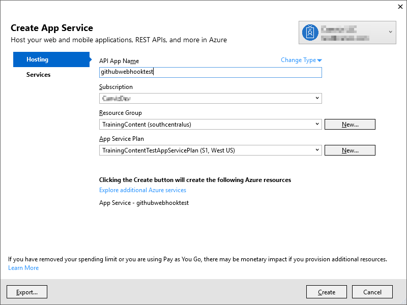

# Learn how to build Office 365 Connectors using Webhooks #
Office 365 Connectors are a great way to get useful information and content into your Office 365 Group. From tracking a team's progress in Trello, to following important hashtags in Twitter, Office 365 Connectors make it easier for an Office 365 group to stay in sync with the content they care about and get more done. Developers can build connectors through incoming webhooks to generate rich connector cards.   Connector cards can be short text-based messages, or use "sections" to display rich or specially-formatted information. Outlook takes care of all the UX for you and renders the message automatically. When more content is added to the payload, the card scales gracefully. 

In this lab, you will learn how to post messages to Office 365 Groups using incoming webhooks.  To illustrate using a real world scenario, you will also build an application that receives Github notifications from your favorite repos and post them as connector messages to your Office 365 group. 

## Prerequisites ##
1. You must have an Office 365 tenant and Microsoft Azure subscription to complete this lab. If you do not have one, the lab for **O3651-7 Setting up your Developer environment in Office 365** shows you how to obtain a trial.
2. You must have Visual Studio 2017 installed.
3. You must have [Postman](https://www.getpostman.com/) installed.
4. Your user must have at least one Office 365 group. If you don’t have an Office 365 Group, this is how you create one:
	- Sign in to Outlook Web App @ http://Outlook.Office.com using your Office 365 administrator or user credentials.
	- Browse to the Groups and click the **plus (+)** button to create a new Office 365 group. Give a name for the group, and you may keep it public.

## Exercise 1: Post a Connector Card message (JSON) to the Group ##

1. Go to your Office 365 Group. Click **Connectors** on the menu bar, find **Incoming Webhook**. 
	
2. Click **Add** to create a new configuration, provide a name and click **Create**. This will generate a webhook URL for the group.  
	
3. Copy the generated URL and save it, as you will need it later. Select **Done** to create the incoming webhook.
	
4. Open Postman, do the following:
	- Change the request method to **POST**.
	- Set the request URL to the **webhook URL** from **Step 3**.
	- Choose **Body** tab, select **raw**. In the dropdown list at the right, select **JSON(application/json)**.
	- Set the body to **{ "text": "Hello from Build 2017" }**.

5. Click **Send** button. Wait for a while, you will see the response

	
	
6. Go back to your Office 365 Group. Review the connector card message in the Group Conversations that was sent using the incoming webhook. 

	
	
8. Optional: Change the JSON card format to further customize the layout, buttons, and colors.  For example, under potential actions, rename the button or change the target URL.

9. To learn more about the connector card format, visit https://dev.outlook.com/Connectors/GetStarted.
	
	
### Sample Connector Card Message JSON Payload

````json
{
  "@context": "http://schema.org/extensions",
  "@type": "MessageCard",
  "themeColor": "0072C6",
  "title": "Visit the Outlook Dev Portal",
  "text": "Click **Learn More** to learn more about Actionable Messages!",
  "potentialAction": [
    {
      "@type": "ActionCard",
      "name": "Send Feedback",
      "inputs": [
        {
          "@type": "TextInput",
          "id": "feedback",
          "isMultiline": true,
          "title": "Let us know what you think about Actionable Messages"
        }
      ],
      "actions": [
        {
          "@type": "HttpPOST",
          "name": "Send Feedback",
          "isPrimary": true,
          "target": "http://..."
        }
      ]
    },
    {
      "@type": "OpenUri",
      "name": "Learn More",
      "targets": [
        { "os": "default", "uri": "https://docs.microsoft.com/en-us/outlook/actionable-messages" }
      ]
    }
  ]
}
````

## Exercise 2: Build an ASP.net application to receive incoming notifications from Github service and post them as connector card messages in Office 365 groups ##
	
1. Start Visual Studio 2017 and select **New>Project**. Under Templates for Visual C#, select **Web** and select the **ASP.net Web application** template. Provide a project name. Select **empty** for the ASP.net template type and select the **Web API** checkbox. Click **OK** to create the solution.

2. Right click on the project in Visual Studio, select **Manage NuGet Packages**.
3. Choose **Browse** tab, search **Microsoft.AspNet.WebHooks.Receivers.GitHub** and install it.
4. Open the **WebApiConfig.cs** file in folder **App_Start**, add the following code at the end of the function****:

	````c#
	config.InitializeReceiveGitHubWebHooks();
	````

5. Navigate to **Lab Files**,copy all the files in this directory to the **Models** folder in your Visual Studio project. Right click on the Models folder, select **Add > Existing** item and add all these files into your Visual Studio project.
	        
6. Right click on the project in Visual Studio, select **Add > New Folder**. Name the new folder to **WebHookHandlers**.
7. Right click on the folder **WebHookHandlers** in Visual Studio, select **Add > Class**. Name the new class to **GitHubWebHookHandler.cs**.
8. Open the **GitHubWebHookHandler.cs** file, replace the existing code in this file with the following code:

	````c#
	using System;
	using System.Collections.Generic;
	using System.Linq;
	using System.Net.Http;
	using System.Text;
	using System.Threading.Tasks;
	using System.Web;
	using GithubTest;
	using Microsoft.AspNet.WebHooks;
	using Newtonsoft.Json.Linq;
	
	namespace WebApplication1.WebHookHandlers
	{
	    public class GitHubWebHookHandler : WebHookHandler
	    {
	        // Office 365 Group webhook URL
	        public const string groupWebHookURL = @"<Office 365 Group webhook URL>";
	
	        public override Task ExecuteAsync(string receiver, WebHookHandlerContext context)
	        {
	            // make sure we're only processing the intended type of hook
	            if ("GitHub".Equals(receiver, System.StringComparison.CurrentCultureIgnoreCase))
	            {
	                // todo: replace this placeholder functionality with your own code
	                string action = context.Actions.First();
	                JObject incoming = context.GetDataOrDefault<JObject>();
	                string connectorCardPayload = ConnectorCard.ConvertGithubJsonToConnectorCard(incoming.ToString());
	                var body = PostRequest(connectorCardPayload).Result;
	            }
	
	            return Task.FromResult(true);
	        }
	
	        private static async Task<HttpResponseMessage> PostRequest(string payload)
	        {
	            var targetUri = new Uri(groupWebHookURL);
	            var httpClient = new HttpClient();
	            return await httpClient.PostAsync(groupWebHookURL,
	                 new StringContent(payload, Encoding.UTF8, "application/json"));
	        }
	    }
	}
	````

9. In the same **GitHubWebHookHandler.cs** file, find the string variable groupWebHookURL.  Copy and paste the Office 365 group webhook URL that you previously got from Exercise #1 (Step 3).

10. Go to http://www.sha1-online.com and generate a new SHA key. Copy the generated key and save it, as you will need it later. 

11. Open **Web.config** file, inside **appSettings** node, add the following setting:

	````xml
	<add key="MS_WebHookReceiverSecret_GitHub" value="<SHA key>" />
	````

	> **Note:** Replace the **&lt;SHA key&gt;** placeholder with the SHA key generated in step 10.

12. Publish the web site to Azure
	1. In the **Solution Explorer**, right click the project and select **Publish**.
	2. In the **Publish** dialog, select **Microsoft Azure App Service** and **Create New**, click **Publish**.

	

	3. In the **Create App Service** dialog, sign in with an account with proper permissions, input **API App Name**, select the proper **Subscription**, **Resource Group**, **App Service Plan**, then click **Create**.

	

	4. Wait until the publish finished.

13. Go to https://github.com. Create a new github repository (unless you already have one for testing purposes). Navigate to the repository. Click  **Settings**. Select **Webhooks** on the left side. Click the **Add webhook** button. Provide the full webhook URL of your ASP.net application. To get this url, append "/api/webhooks/incoming/Github" to the URL of your Azure web application (as an example, the full webhook URL would be `http://githubwebhooktest.azurewebsites.net/api/webhooks/incoming/Github`). You will receive notifications from Github service at this URL.  

14. For **Content type**, select **application/json**.

15. For the **Secret**, enter the SHA1 key you got earlier.

16. Under **Which events would you like to trigger this webhook?**, select **Let me select individual events**. Select the **Issues** checkbox. You will receive notification only when issues are opened, edited, closed, reopened, assigned, unassigned, labeled, unlabeled, milestoned, or demilestoned. For this exercise, we will focus on the experience for issue creation. Click the **Add webhook** button to save your Github webhook configuration.

17. Optional: To debug the incoming webhook from Github service, place a breakpoint on the ExecuteAsync function of the GithubWebhookHandler.cs file of your Visual Studio project. To do this, republish your web application with **Debug** configuration(it's published with **Release** configuration by default), open **server explorer** in Visual Studio, find and right-click your web application under **App service**, and attach the debugger. 

18. Create a new issue for your repository. This will trigger the incoming webhook in your ASP.net application. You should now receive connector card messages for new github issues in your Office 365 group inbox.

**Congratulations on completing this exercise!** Try building your own connector and submit it to Office 365. Customize the card message experience to show your own brand and style, and the sender avatar will show your logo (instead of "incoming webhook"). 
Check out dev.outlook.com/connectors for more developer information, code samples, and instructions for submitting and listing your connector in the Office 365 Connectors catalog.


