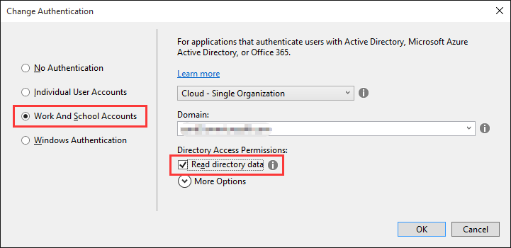

# Microsoft Graph for OneNote Services
In this lab, you will use Microsoft Graph to program against the Office 365 OneNote Service as part of an ASP.NET MVC5 application.

## Prerequisites
1. You must have an Office 365 tenant and Microsoft Azure subscription to complete this lab. If you do not have one, the lab for **O3651-7 Setting up your Developer environment in Office 365** shows you how to obtain a trial.
2. You must have Visual Studio 2017 installed.
3. Your user must have at least one OneNote notebook with a section and a page.

## Exercise 1: Create a new project that uses Azure Active Directory v2 authentication

In this first step, you will create a new ASP.NET MVC project using the **Graph AAD Auth v2 Starter Project** template, register a new application in the developer portal, and log in to your app and generate access tokens for calling the Graph API.

### Create an ASP.NET MVC5 Application
In this exercise, you will create the ASP.NET MVC5 application and register it with Azure active Directory.

1. Launch **Visual Studio 2017** as an administrator. 
2. In Visual Studio select **File/New/Project**.
3. In the **New Project** dialog, select **Templates/Visual C#/Web** and click **ASP.NET Web Application**. Name the new project **OneNoteDev** and then click **OK**.  

    
    > NOTE: Make sure you enter the exact same name for the Visual Studio Project that is specified in these lab instructions.  The Visual Studio Project name becomes part of the namespace in the code.  The code inside these instructions depends on the namespace matching the Visual Studio Project name specified in these instructions.  If you use a different project name the code will not compile unless you adjust all the namespaces to match the Visual Studio Project name you enter when you create the project.

4. In the **New ASP.NET Project** dialog, click **MVC** and then click **Change Authentication**.
5. Select **Work And School Accounts**, check **Read directory data** and click **OK**.

 

6. At this point you can test the authentication flow for your application.

  In Visual Studio, press **F5**. The browser will automatically launch taking you to the HTTPS start page for the web application.


  To sign in, click the **Sign In** link in the upper-right corner.

  Login using your **Organizational Account**.

  Upon a successful login, since this will be the first time you have logged into this app, Azure AD will present you with the common consent dialog that looks similar to the following image:

​	Click **Accept** to approve the app's permission request on your data in Office 365.


​	You will then be redirected back to your web application. However notice in the upper right corner, it now shows 	your email address & the **Sign Out** link.

​	In Visual Studio, press **Shift+F5** to stop debugging.

​        Congratulations... at this point your app is configured with Azure AD and leverages OpenID Connect and OWIN to facilitate the authentication process!

7. Open the **Web.config** file in the root directory and find the **appSettings** element. This is where you will add the app ID and app secret that you will generate in the next step.

8. Launch the Application Registration Portal by opening a browser to [apps.dev.microsoft.com](https://apps.dev.microsoft.com/) to register a new application.

9. Sign into the portal using your Office 365 username and password. The **Graph AAD Auth v2 Starter Project** template allows you to sign in with either a Microsoft account or an Office 365 for business account, but the "People" features work only with business and school accounts.

10. Click **Add an app**, type **OneNoteGraphQuickStart** for the application name, and then click **Create application**.

11. Copy the **Application Id** and paste it into the value for **ida:AppId** in your project's **Web.config** file.

12. Under **Application Secrets** click **Generate New Password** to create a new client secret for your app.

13. Copy the displayed app password and paste it into the value for **ida:AppSecret** in your project's **Web.config** file.

14. Set the **ida:AppScopes** value to *Notes.ReadWrite*.  

    Note: Add the key **ida:AppId**, **ida:AppSecret** as following if they don't exist.

    ```
    <configuration>
      <appSettings>
        <!-- ... -->   
        <add key="ida:AppId" value="4b63ba37..." />
        <add key="ida:AppSecret" value="AthR0e75..." />
        <!-- ... -->
        <!-- Specify scopes in this value. Multiple values should be comma separated. -->
        <add key="ida:AppScopes" value="Notes.ReadWrite" />
      </appSettings>
      <!-- ... -->
    </configuration>
    ```

15. In Visual Studio, right-click **OneNoteDev** > **Properties** to open the project properties.

16. Click **Web** in the left navigation.

17. Copy the **Project Url** value.

18. Back on the Application Registration Portal page, click **Add Platform** > **Web**.

19. Paste the project URL into the **Redirect URIs** field.

20. At the bottom of the page, click **Save**.

21. Press F5 to compile and launch your new application in the default browser.

22. When the Graph and AAD v2 Auth Endpoint Starter page appears, sign in with your Office 365 account.

23. Review the permissions the application is requesting, and click **Accept**.

24. Now that you are signed into your application, exercise 1 is complete!

## Exercise 2: Create the Notebook Repository Class

### Create the OneNote API Repository
In this step you will create a repository class that will handle all communication with the OneNote API to interact with notebooks in your OneDrive for Business store.

1. This exercise is based on the project located in the  **\\O3653\O3653-7 Deep Dive into the Office 365 APIs for OneNote services\Starter Project\OneNoteDev** folder. Open the project with Visual Studio 2017. 

   Notice: update web.config and add values for below items.  These values can be found on Exercise 1's web.config.

       <add key="ida:ClientId" value="" />
       <add key="ida:ClientSecret" value="" />
       <add key="ida:Domain" value="" />
       <add key="ida:TenantId" value="" />
       <add key="ida:AppId" value="" />
       <add key="ida:AppSecret" value="" />
       <add key="ida:PostLogoutRedirectUri" value="" />

2. In Visual Studio, right-click **OneNoteDev** > **Properties** to open the project properties. Click **Web** in the left navigation. Make sure **Project URL** is the same as Exercise 1.

  

3. This exercise will heavily leverage the OneNote REST API. To simplify working with the REST services, we will use the popular [JSON.NET](http://www.newtonsoft.com/json) JSON framework for .NET.

4. Create a new folder in the project's **Models** folder named **JsonHelpers**.

5. Copy all the C# files provided with this lab, located in the **O3653\O3653-7 Deep Dive into the Office 365 APIs for OneNote services\Labs\Labfiles** folder, into this new **JsonHelpers** folder you just added in your project.

  > **Note:** These files were created using the handy utility in Visual Studio: [Paste JSON as Classes](http://blogs.msdn.com/b/webdev/archive/2012/12/18/paste-json-as-classes-in-asp-net-and-web-tools-2012-2-rc.aspx).

6. Create model objects for the OneNote notebook, section & page:

7. Add a new class named **Notebook** to the **Models** folder in the project.

8. Add the following code to the `Notebook` class:

  ````c#
      public Notebook() {
          Sections = new List<Section>();
      }

      public string Id { get; set; }
      public string Name { get; set; }
      public string NotebookUrl { get; set; }
      public string ClientUrl { get; set; }
      public string WebUrl { get; set; }
      public bool IsDefault { get; set; }
      public DateTime CreatedDateTime { get; set; }
      public DateTime LastModifiedDateTime { get; set; }
      public string SectionsUrl { get; set; }
      public string SectionGroupsUrl { get; set; }
      public List<Section> Sections { get; set; }
  ````

9. Add a new class named **Section** to the **Models** folder in the project.

10. Add the following code to the `Section` class:

  ````c#
      public Section() {
      Pages = new List<NotePage>();
      }

      public string Id { get; set; }
      public string Name { get; set; }
      public DateTime CreatedDateTime { get; set; }
      public DateTime LastModifiedDateTime { get; set; }
      public string PagesUrl { get; set; }
      public List<NotePage> Pages { get; set; }
  ````

11. Add a new class named **NotePage** to the **Models** folder in the project.

12. Add the following code to the `NotePage` class:

   ````c#
       public string Id { get; set; }
       public string Name { get; set; }
       public DateTime CreatedDateTime { get; set; }
       public DateTime LastModifiedDateTime { get; set; }
       public string ContentUrl { get; set; }
       public string Content { get; set; }
       public string PageUrl { get; set; }
       public string WebUrl { get; set; }
       public string ClientUrl { get; set; }
   ````

13. Create the repository class for communicating with the OneNote via Microsoft Graph:

14. Add a new class to the **Models** folder named **NotebookRepository**.

15. Ensure the following `using` statements are present at the top of the `NotebookRepository` class:

   ````c#
   using System.Collections.Generic;
   using System.Linq;
   using System.Threading.Tasks;
   using System.Net.Http;
   using Newtonsoft.Json;
   ````

16. Add the following private fields and class constructor to the `NotebookRepository` class:

   ````c#
           private HttpClient _client;

           private string _msGraphResourceId = string.Empty;
           private string _msGraphEndpoint = string.Empty;

           public NotebookRepository(string accessToken)
           {
               _client = new HttpClient();
               _client.DefaultRequestHeaders.Add("Accept", "application/json");

               // set the access token on all requests to the Microsoft Graph API
               _client.DefaultRequestHeaders.Add("Authorization", "Bearer " + accessToken);

               _msGraphEndpoint = "https://graph.microsoft.com/beta";
               _msGraphResourceId = "https://graph.microsoft.com/";
           }
   ````

17. Add a method to get a list of all OneNote notebooks for the currently logged in user's OneDrive for Business store. Add the following code to the `NotebookRepository` class:

   ````c#
               public async Task<IEnumerable<Notebook>> GetNotebooks()
           {

               // create query
               var query = _msGraphEndpoint + "/me/onenote/notebooks";

               // create request
               var request = new HttpRequestMessage(HttpMethod.Get, query);

               // issue request & get response
               var response = await _client.SendAsync(request);
               string responseString = await response.Content.ReadAsStringAsync();
               var jsonResponse = JsonConvert.DeserializeObject<JsonHelpers.NotebooksJson>(responseString);

               // convert to model object
               var notebooks = new List<Notebook>();

               // check for null if the user's OneDrive for Business is not provisioned
               if (jsonResponse.Notebooks != null)
               {
                   foreach (var notebook in jsonResponse.Notebooks)
                   {
                       var item = new Notebook
                       {
                           Id = notebook.Id,
                           Name = notebook.Name,
                           NotebookUrl = notebook.NotebookUrl,
                           IsDefault = notebook.IsDefault,
                           CreatedDateTime = notebook.CreatedTime,
                           LastModifiedDateTime = notebook.LastModifiedTime,
                           SectionsUrl = notebook.SectionsUrl,
                           SectionGroupsUrl = notebook.SectionGroupsUrl,
                           ClientUrl = notebook.Links.OneNoteClientUrl.href,
                           WebUrl = notebook.Links.OneNoteWebUrl.href
                       };

                       notebooks.Add(item);
                   }
               }

               return notebooks.OrderBy(n => n.Name).ToList();
           }
   ````

18. Add the following code to get a single notebook based on the ID specified:

   ````c#
               public async Task<Notebook> GetNotebook(string notebookid)
           {

               // create query
               var query = string.Format("{0}/me/onenote/notebooks/?$top=1&$filter=id eq '{1}'", _msGraphEndpoint, notebookid);

               // create request
               var request = new HttpRequestMessage(HttpMethod.Get, query);

               // issue request & get response
               var response = await _client.SendAsync(request);
               string responseString = await response.Content.ReadAsStringAsync();
               var jsonResponse = JsonConvert.DeserializeObject<JsonHelpers.NotebooksJson>(responseString).Notebooks[0];

               // convert to model object
               var notebook = new Notebook
               {
                   Id = jsonResponse.Id,
                   Name = jsonResponse.Name,
                   NotebookUrl = jsonResponse.NotebookUrl,
                   IsDefault = jsonResponse.IsDefault,
                   CreatedDateTime = jsonResponse.CreatedTime,
                   LastModifiedDateTime = jsonResponse.LastModifiedTime,
                   SectionsUrl = jsonResponse.SectionsUrl,
                   SectionGroupsUrl = jsonResponse.SectionGroupsUrl,
                   ClientUrl = jsonResponse.Links.OneNoteClientUrl.href,
                   WebUrl = jsonResponse.Links.OneNoteWebUrl.href
               };

               return notebook;
           }
   ````

19. Add the following code to get all the sections in the specified notebook using the Microsoft Graph. This should go in the `NotebookRepository` class.

   ````c#
               public async Task<Notebook> GetNotebookSections(string notebookid)
           {
               var notebook = await GetNotebook(notebookid);
               return await GetNotebookSections(notebook);
           }

           public async Task<Notebook> GetNotebookSections(Notebook notebook)
           {

               // create query
               var query = notebook.SectionsUrl;

               // create request
               var request = new HttpRequestMessage(HttpMethod.Get, query);

               // issue request & get response
               var response = await _client.SendAsync(request);
               string responseString = await response.Content.ReadAsStringAsync();
               var jsonResponse = JsonConvert.DeserializeObject<JsonHelpers.SectionsJson>(responseString);

               // convert to model object
               foreach (var item in jsonResponse.Sections)
               {
                   var section = new Section
                   {
                       Id = item.Id,
                       Name = item.Name,
                       CreatedDateTime = item.CreatedTime,
                       LastModifiedDateTime = item.LastModifiedTime,
                       PagesUrl = item.PagesUrl
                   };
                   notebook.Sections.Add(section);
               }

               return notebook;
           }
   ````

   1. Next, add the following code to load all the pages within the specified notebook section. This should also be added to the `NotebookRepository` class.

   ````c#
              public async Task<Notebook> GetNotebookPages(string notebookid, string sectionid)
           {
               var notebook = await GetNotebook(notebookid);
               notebook = await GetNotebookSections(notebook);
               return await GetNotebookPages(notebook, sectionid);
           }

           public async Task<Notebook> GetNotebookPages(Notebook notebook, string sectionid)
           {

               // create query for the specified section...
               var section = notebook.Sections.First(s => s.Id == sectionid);

               // create request to get all the pages in the section
               var request = new HttpRequestMessage(HttpMethod.Get, section.PagesUrl);

               // issue request & get response
               var response = await _client.SendAsync(request);

               // convert to JSON object
               string responseString = await response.Content.ReadAsStringAsync();
               var jsonPages = JsonConvert.DeserializeObject<JsonHelpers.PagesJson>(responseString);

               // loop through all pages
               foreach (var jsonPage in jsonPages.Pages)
               {
                   // convert pages to model objects
                   var page = new NotePage
                   {
                       Id = jsonPage.Id,
                       Name = jsonPage.Title,
                       CreatedDateTime = jsonPage.CreatedTime,
                       LastModifiedDateTime = jsonPage.LastModifiedTime,
                       PageUrl = jsonPage.PageUrl,
                       ClientUrl = jsonPage.Links.OneNoteClientUrl.href,
                       WebUrl = jsonPage.Links.OneNoteWebUrl.href,
                       ContentUrl = jsonPage.ContentUrl
                   };

                   // get the body of the page
                   request = new HttpRequestMessage(HttpMethod.Get, page.ContentUrl);
                   response = await _client.SendAsync(request);
                   page.Content = await response.Content.ReadAsStringAsync();

                   // add page to section
                   section.Pages.Add(page);
               }

               return notebook;
           }
   ````

20. And finally, add the following method to delete a specified page:

   ````c#
        public async Task DeletePage(string id)
           {

               // create query
               var query = string.Format("{0}/me/onenote/pages/{1}", _msGraphEndpoint, id);

               // create request
               var request = new HttpRequestMessage(HttpMethod.Delete, query);

               // issue request & get response
               await _client.SendAsync(request);
           }
   ````

### Add Navigation
In this step you will create a link on home page to navigate to notebooks list page

1. Locate the **Views/Shared** folder in the project.
2. Open the **_Layout.cshtml** file found in the **Views/Shared** folder.
    1. Locate the part of the file that includes a few links at the top of the page... it should look similar to the following code:

    ````asp
    <div class="navbar-collapse collapse">
        <ul class="nav navbar-nav">
            <li>@Html.ActionLink("Home", "Index", "Home")</li>
            <li>@Html.ActionLink("About", "About", "Home")</li>
            <li>@Html.ActionLink("Contact", "Contact", "Home")</li>
        </ul>
        @Html.Partial("_LoginPartial")
    </div>
    ````

    1. Update that navigation to have a new link (the **Files (Graph)** link added below) as well as a reference to the login control you just created:

    ````asp
    <div class="navbar-collapse collapse">
        <ul class="nav navbar-nav">
            <li>@Html.ActionLink("Home", "Index", "Home")</li>
            <li>@Html.ActionLink("About", "About", "Home")</li>
            <li>@Html.ActionLink("Contact", "Contact", "Home")</li>
            <li>@Html.ActionLink("Notebooks", "Index", "Notebook")</li>
        </ul>
        @Html.Partial("_LoginPartial")
    </div>
    ````

## Exercise 3: Create Controllers and Views

### Add Notebook Controller & View

In this step you will create the ASP.NET MVC controller and view for OneNote notebooks.

1. Right-click the **Controllers** folder in the project and select **Add / Controller**.
2. In the **Add Scaffold** dialog, select **MVC 5 Controller - Empty**.
3. Click **Add**.
4. When prompted for a name, enter **NotebookController**.
5. Click **Add**.
6. Within the `NotebookController` class, replace using statement with below:

 ````c#
 using System.Web.Mvc;
 using System.Configuration;
 using System.Threading.Tasks;
 using OneNoteDev.Auth;
 using OneNoteDev.Models;
 using OneNoteDev.TokenStorage;
 ````

3. Update `Index()` action as following to support viewing all notebooks:

    ````c#
            [Authorize]
            public async Task<ActionResult> Index()
            {
                // Get an access token for the request.
                string userObjId = AuthHelper.GetUserId(System.Security.Claims.ClaimsPrincipal.Current); 
                SessionTokenCache tokenCache = new SessionTokenCache(userObjId, HttpContext);
                string authority = string.Format(ConfigurationManager.AppSettings["ida:AADInstance"], "common", "/v2.0");
                
                AuthHelper authHelper = new AuthHelper(authority, ConfigurationManager.AppSettings["ida:AppId"], ConfigurationManager.AppSettings["ida:AppSecret"], tokenCache);
                string accessToken = await authHelper.GetUserAccessToken("/Notebook/Index");

                // Make the request.
                var repository = new NotebookRepository(accessToken);
                var myNotebooks = await repository.GetNotebooks();

                return View(myNotebooks);
            }
    ````

4. Now add a view to render a list of the notebooks.

5. Right-click the **Notebook** folder under **Views** in Visual Studio solution explorer and select **Add** - **MVC5 View Page**. Name it as **Index.cshtml** and click **Add**.

6. **Replace** all of the code in the file with the following:

 ````html
 @model IEnumerable<OneNoteDev.Models.Notebook>

 <h1>
     OneNote Notebooks
 </h1>

 <table class="table">
     <tr>
         <th>
             @Html.DisplayNameFor(model => model.Name)
         </th>
         <th>
             @Html.DisplayNameFor(model => model.CreatedDateTime)
         </th>
         <th>
             @Html.DisplayNameFor(model => model.LastModifiedDateTime)
         </th>
         <th></th>
     </tr>

     @foreach (var item in Model)
     {
         <tr>
             <td>
                 @Html.DisplayFor(modelItem => item.Name)
             </td>
             <td>
                 @Html.DisplayFor(modelItem => item.CreatedDateTime)
             </td>
             <td>
                 @Html.DisplayFor(modelItem => item.LastModifiedDateTime)
             </td>
             <td>
                 @Html.RouteLink("View Sections", "Section", new { notebookid = item.Id, action = "Index" })
             </td>
         </tr>
     }
 </table>
 ````

### Add Notebook Section Controller & View
In this step you will create the ASP.NET MVC controller and view for OneNote notebook sections.

1. Right-click the **Controllers** folder in the project and select **Add / Controller**.
2. In the **Add Scaffold** dialog, select **MVC 5 Controller - Empty**.
3. Click **Add**.
4. When prompted for a name, enter **SectionController**.
5. Click **Add**.
6. Within the `SectionController` class, replace using statement with below:

 ````c#
 using System.Linq;
 using System.Web.Mvc;
 using System.Configuration;
 using System.Threading.Tasks;
 using OneNoteDev.Auth;
 using OneNoteDev.Models;
 using OneNoteDev.TokenStorage;
 ````

3. Update `Index()` action as following to support viewing all notebook sections:

    ````c#
      [Authorize]
            public async Task<ActionResult> Index(string notebookid)
            {
                // Get an access token for the request.
                string userObjId = AuthHelper.GetUserId(System.Security.Claims.ClaimsPrincipal.Current);
                SessionTokenCache tokenCache = new SessionTokenCache(userObjId, HttpContext);
                string authority = string.Format(ConfigurationManager.AppSettings["ida:AADInstance"], "common", "/v2.0");

                AuthHelper authHelper = new AuthHelper(authority, ConfigurationManager.AppSettings["ida:AppId"], ConfigurationManager.AppSettings["ida:AppSecret"], tokenCache);
                string accessToken = await authHelper.GetUserAccessToken("/Section/Index");

                // Make the request.
                var repository = new NotebookRepository(accessToken);
                var notebook = await repository.GetNotebookSections(notebookid);

                ViewBag.CurrentNotebookTitle = notebook.Name; ViewBag.CurrentNotebookId = notebook.Id;

                return View(notebook.Sections.OrderBy(s => s.Name).ToList());
            }
    ````

4. Now add a view to render a list of the notebook sections.
5. Right-click the **Section** folder under **Views** in Visual Studio solution explorer and select **Add** - **MVC5 View Page**. Name it as **Index.cshtml** and click **Add**.
6. **Replace** all of the code in the file with the following:

 ````html
 @model IEnumerable<OneNoteDev.Models.Section>

 <h1>
     Sections within Notebook: @ViewBag.CurrentNotebookTitle
 </h1>

 <table class="table">
     <tr>
         <th>
             @Html.DisplayNameFor(model => model.Name)
         </th>
         <th>
             @Html.DisplayNameFor(model => model.CreatedDateTime)
         </th>
         <th>
             @Html.DisplayNameFor(model => model.LastModifiedDateTime)
         </th>
         <th></th>
     </tr>

     @foreach (var item in Model)
     {
         <tr>
             <td>
                 @Html.DisplayFor(modelItem => item.Name)
             </td>
             <td>
                 @Html.DisplayFor(modelItem => item.CreatedDateTime)
             </td>
             <td>
                 @Html.DisplayFor(modelItem => item.LastModifiedDateTime)
             </td>
             <td>
                 @Html.RouteLink("View Pages", "Page", new { notebookid = ViewBag.CurrentNotebookId, sectionid = item.Id, action = "Index" })
             </td>
         </tr>
     }
 </table>
 ````

6. For this controller you will need to create a special route.
7. Open the file **App_Start / RouteConfig.cs**.
8. Add the following code before the existing *default* route:

  ````c#
              routes.MapRoute(
                "Section",
                "Notebooks/{notebookid}/Section/{action}",
                new { controller = "Section", action = "Index" }
              );
  ````

### Add Notebook Pages Controller & View
In this step you will create the ASP.NET MVC controller and view for pages within OneNote notebook sections.

1. Right-click the **Controllers** folder in the project and select **Add / Controller**.
2. In the **Add Scaffold** dialog, select **MVC 5 Controller - Empty**.
3. Click **Add**.
4. When prompted for a name, enter **PageController**.
5. Click **Add**.
6. Within the `PageController` class, replace using statement with below:

 ````c#
 using System.Linq;
 using System.Web.Mvc;
 using System.Configuration;
 using System.Threading.Tasks;
 using OneNoteDev.Auth;
 using OneNoteDev.Models;
 using OneNoteDev.TokenStorage;
 ````

3. Update `Index()` action as following to support viewing all pages within a notebook section:

 ````c#
         [Authorize]
         public async Task<ActionResult> Index(string notebookid, string sectionid)
         {

             // Get an access token for the request.
             string userObjId = AuthHelper.GetUserId(System.Security.Claims.ClaimsPrincipal.Current);
             SessionTokenCache tokenCache = new SessionTokenCache(userObjId, HttpContext);
             string authority = string.Format(ConfigurationManager.AppSettings["ida:AADInstance"], "common", "/v2.0");

             AuthHelper authHelper = new AuthHelper(authority, ConfigurationManager.AppSettings["ida:AppId"], ConfigurationManager.AppSettings["ida:AppSecret"], tokenCache);
             string accessToken = await authHelper.GetUserAccessToken("/Page/Index");

             // Make the request.
             var repository = new NotebookRepository(accessToken);
             var notebook = await repository.GetNotebookPages(notebookid, sectionid);

             ViewBag.CurrentNotebookTitle = notebook.Name;
             ViewBag.CurrentNotebookId = notebook.Id;

             var section = notebook.Sections.First(s => s.Id == sectionid);

             ViewBag.CurrentSectionTitle = section.Name;

             return View(section.Pages);
         }
 ````

4. Add the following action to support deleting a page:

 ````c#
         [Authorize]
         public async Task<ActionResult> Delete(string id)
         {

             // Get an access token for the request.
             string userObjId = AuthHelper.GetUserId(System.Security.Claims.ClaimsPrincipal.Current);
             SessionTokenCache tokenCache = new SessionTokenCache(userObjId, HttpContext);
             string authority = string.Format(ConfigurationManager.AppSettings["ida:AADInstance"], "common", "/v2.0");

             AuthHelper authHelper = new AuthHelper(authority, ConfigurationManager.AppSettings["ida:AppId"], ConfigurationManager.AppSettings["ida:AppSecret"], tokenCache);
             string accessToken = await authHelper.GetUserAccessToken("/Page/Delete");

             // Make the request.
             var repository = new NotebookRepository(accessToken);
             if (id != null)
             {
                 await repository.DeletePage(id);
             }
             return Redirect("/");
         }
 ````

5. Now add a view to render a list of the notebook sections.
6. 1. Right-click the **Page** folder under **Views** in Visual Studio solution explorer and select **Add** - **MVC5 View Page**. Name it as **Index.cshtml** and click **Add**.
7. **Replace** all of the code in the file with the following:

 ````html
 @model IEnumerable<OneNoteDev.Models.NotePage>

 <h1>
     Pages within Notebook: @ViewBag.CurrentNotebookTitle, Section: @ViewBag.CurrentSectionTitle
 </h1>

 <table class="table">
     <tr>
         <th>
             @Html.DisplayNameFor(model => model.Name)
         </th>
         <th>
             @Html.DisplayNameFor(model => model.CreatedDateTime)
         </th>
         <th>
             @Html.DisplayNameFor(model => model.LastModifiedDateTime)
         </th>
         <th></th>
     </tr>

     @foreach (var item in Model)
     {
         <tr>
             <td>
                 @Html.DisplayFor(modelItem => item.Name)
             </td>
             <td>
                 @Html.DisplayFor(modelItem => item.CreatedDateTime)
             </td>
             <td>
                 @Html.DisplayFor(modelItem => item.LastModifiedDateTime)
             </td>
             <td>
                 <a href="@item.WebUrl" target="_blank">View in OneNote Web Client</a> |
                 @Html.ActionLink("Delete", "Delete", new { id = item.Id })
             </td>
         </tr>
     }
 </table>
 ````

7. For this controller you will need to create a special route.
8. Open the file **App_Start / RouteConfig.cs**.
9. Add the following code before the route you previously added for the sections:

  ````c#
              routes.MapRoute(
                "Page",
                "Notebooks/{notebookid}/Section/{sectionid}/{action}",
                new { controller = "Page", action = "Index", id = UrlParameter.Optional }
              );
  ````

## Exercise 4: Test the Application

The last step is to test the application you just created!

1. Press **F5** in Visual Studio to launch the application.
2. When the browser loads, click the **Sign in** link in the upper right corner and login using your Office 365 credentials.

 After logging in you will be taken back to your ASP.NET MVC application. 

3. Click the **Notebooks** link in the top navigation. You will see a list of notebooks that are currently in your OneDrive for Business store listed.
4. Click one of the notebook's **View Sections** links. You will see a list of the sections within the selected notebook.
5. Click one of the section's **View Pages** links. You will see a list of the pages within that section.
6. Click one of the page's **View in OneNote Web Client** links to see a new browser window load the notebook's page within the browser.
7. Go back to your application and click one of the page's **Delete** links. The page will be deleted and you will be taken back to the homepage of the application. If you navigate back to the list of pages within the section, you will see the page is no longer listed.

Congratulations! You have created an ASP.NET MVC application that uses the Microsoft Graph to interact with OneNote Notebooks found within a user's OneDrive for Business store.


