# Creating Cross-Platform Apps using Xamarin and Visual Studio
In this lab, you will learn how to use MSAL to authenticate, how to use the Microsoft Graph API to get contacts and files, and how to use the Microsoft Graph API to send emails in a Xamarin app built with Visual Studio 2017.

## Prerequisites
1. You must have an Office 365 tenant and Windows Azure subscription to complete this lab. If you do not have one, the lab for **O3651-7 Setting up your Developer environment in Office 365** shows you how to obtain a trial.
2. You must have Visual Studio 2017 installed with the **Mobile development with .NET** and **Universal Windows Platform development** components.

## Lab Setup: Register the sample on the app registration portal
1. Open a web browser and navigate to [https://apps.dev.microsoft.com](https://apps.dev.microsoft.com "apps.dev.microsoft.com").
2. Sign in using your Office 365 account.
3. Create an app, and add the **Mobile platform** for your app, copy the **Application Id** assigned to your app, you'll need it later.
4. Add the following Microsoft Graph permissions.
   - Mail.Send
   - Mail.ReadWrite
   - Files.Read
   - Files.ReadWrite
   - Sites.Read.All
   - Contacts.Read
   - User.Read.All
   - User.Read

	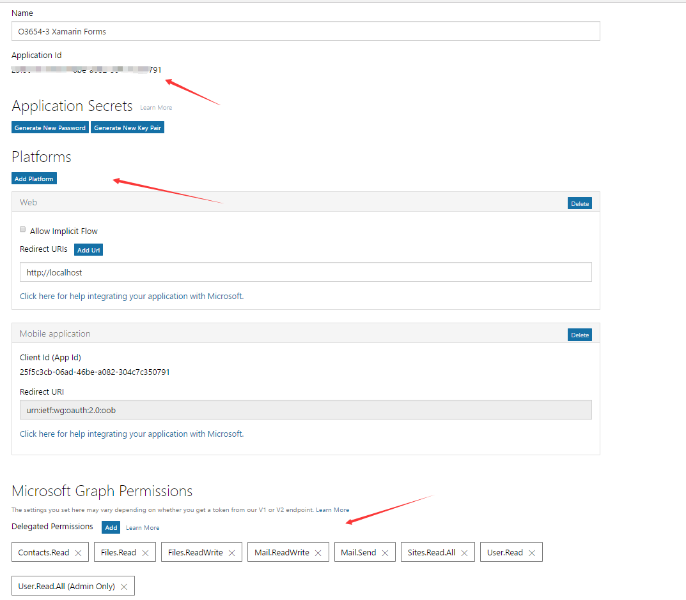

5. Make sure your Office 365 account has some contacts.
6. Make sure your contacts have some files shared with you on OneDrive.

## Exercise 1: MSAL AUTHENTICATION
In this exercise, we will show how to use MSAL to authenticate Microsoft Accounts and Azure Active Directory accounts via the converged MSA and Azure AD authentication endpoints.

1. Open the the **XamarinLab.sln** solution in the [**Starter Project/XamarinLab**](./Starter Project/XamarinLab) folder with Visual Studio 2017.  Make sure you open Visual Studio as an Administrator. 
2. Open the **Package Manager Console** and install  the **Microsoft.Identity.Client** library for Android, iOS and UWP platforms by running the following command once for each project.

	````powershell
	Install-Package -Id Microsoft.Identity.Client -Pre
	````

	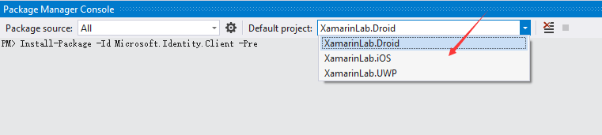
	
	> **Note:** the release version of **Microsoft.Identity.Client** is not available now, you have to use **-Pre** option to include the prerelease version.

3. In the **XamarinLab** project, open the **App.xaml.cs** file.
4. Set the value of **ClientID** to the **Application Id** you copied in a previous step.

	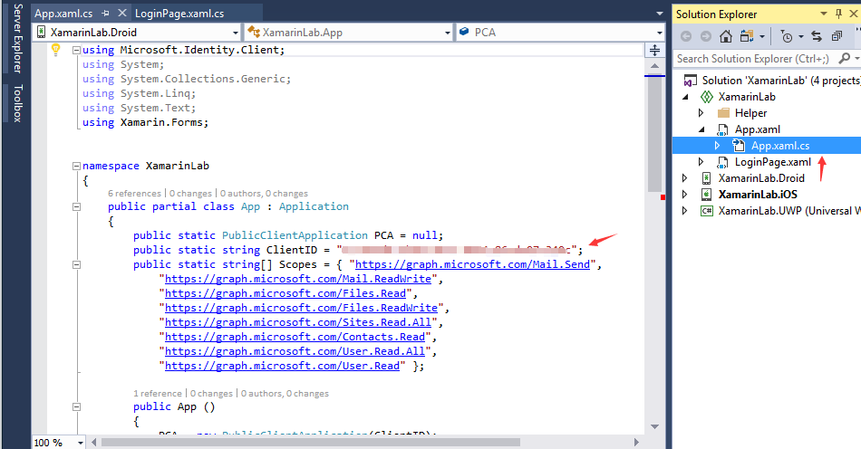

4.  In the **App** constructor method, add the following code to initialize the **PublicClientApplication** instance.

    ```c#
	PCA = new PublicClientApplication(ClientID);
	```

    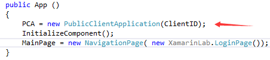

5.  Open the **AuthenticationHelper.cs** file in the **Helper** folder.

	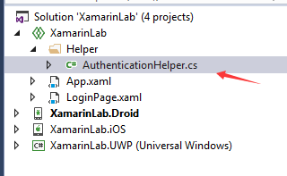

6.  Add the **SignIn** function to sign in users.

    ```c#
    public static async Task<string> SignIn()
    {
        AuthenticationResult authResult = await App.PCA.AcquireTokenAsync(App.Scopes);
        userToken = authResult.Token;
        expiration = authResult.ExpiresOn;
        return userToken;
    }
	```

7.  Add the **SignOut** function to sign users out.

    ```c#
    public static void SignOut()
    {
        foreach (var user in App.PCA.Users)
        {
            user.SignOut();
        }
    }
	```

	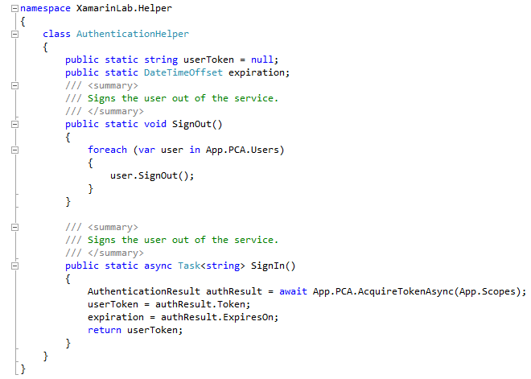 

8.  The structure of the solution is straightforward. All the application logic and UX reside in XamarinLab, XamarinLab.Droid and XamarinLab.iOS both include a LoginPageRenderer.cs class, which is used for assigning values at runtime to the PlatformParameters property of the login page. The PlatformParameters construct is used by MSAL for understanding at runtime on which platform it is running - so that it can select the right authentication UX and token storage. Please note, MSAL does not need PlatformParameters for UWP apps. XamarinLab.Droid requires one extra line of code to be added in the MainActivity.cs file:

    ```c#
	AuthenticationAgentContinuationHelper.SetAuthenticationAgentContinuationEventArgs(requestCode, resultCode, data);
	```

	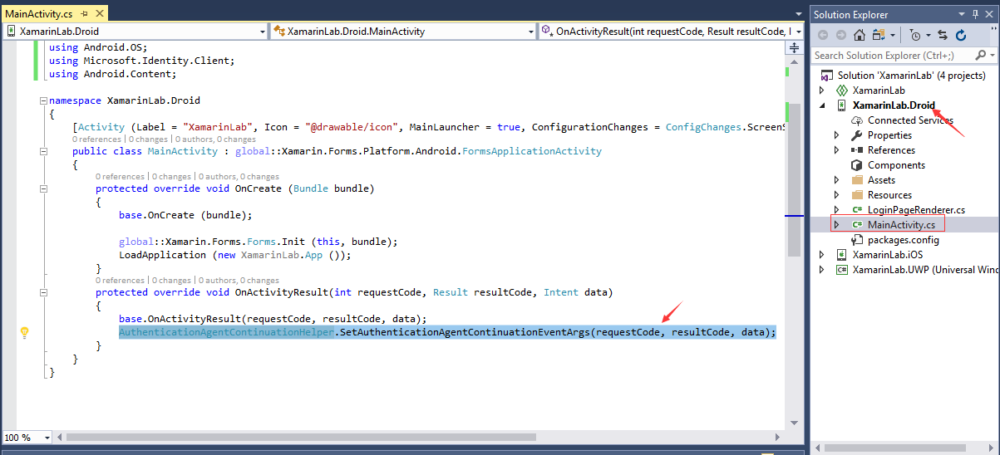

9. Include the **LoginPageRenderer.cs** file from the [**Starter Project/Src/Android**](./Starter Project/Src/Android) folder to the **XamarinLab.Droid** project and include the **LoginPageRenderer.cs** file from the [**Starter Project/Src/iOS**](./Starter Project/Src/iOS) folder to the **XamarinLab.iOS** project.

	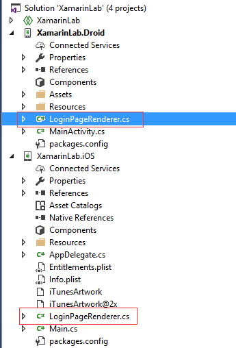

10. Open the **XamarinLab** project, add the following method to the **LoginPage.xaml.cs** file.

    ```c#
    protected override void OnAppearing()
    {
        base.OnAppearing();
        App.PCA.PlatformParameters = platformParameters;
    }
	```

	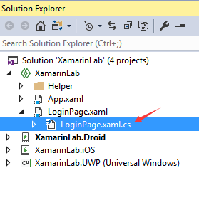

11. Update the **SignInButton_Clicked** method in the **LoginPage.xaml.cs** file to match the following code:

    ```c#
    private async void SignInButton_Clicked(object sender, EventArgs e)
    {
        try
        {
            string token = await AuthenticationHelper.SignIn();
            await DisplayAlert("Success", token, "Ok");
        }
        catch{
            await DisplayAlert("Error", "Sign On failed", "Ok");
        }

    }
	```

12. Update the **SignOutButton_Clicked** method in the **LoginPage.xaml.cs** file to match the following code:

    ```c#
    private async void SignOutButton_Clicked(object sender, EventArgs e)
    {
        AuthenticationHelper.SignOut();
        await DisplayAlert("Success", "Sign Out Successfully", "Ok");
    }
	```

13. Select the **XamarinLab.Droid** project and set it as the StartUp project.

	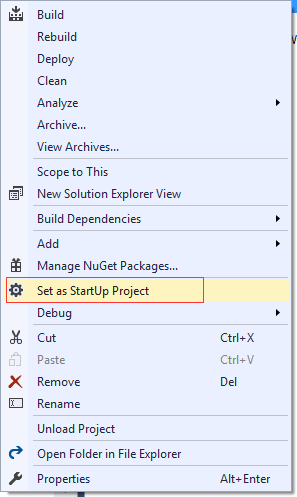
 
14. Select the following android emulator, and click the arrow to run the app.

    

15. When the Login page appears click the **SIGN IN** button.

	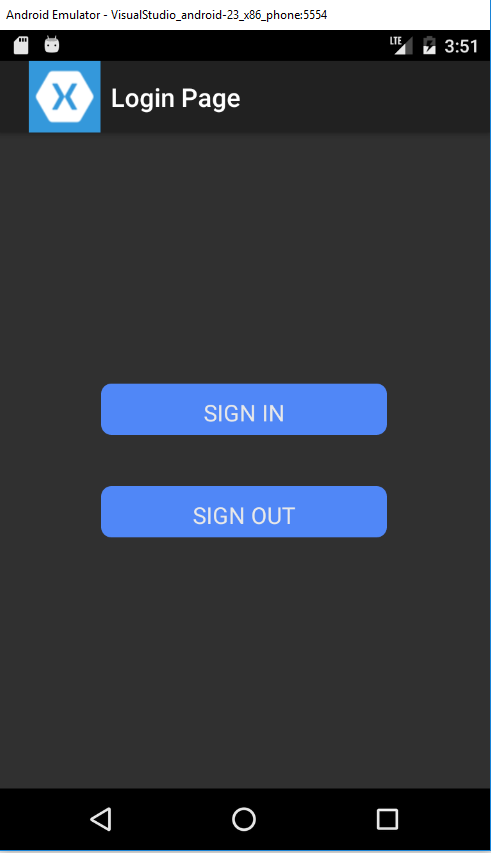

16. Enter your Office 365 account and password, then click Sign In.

	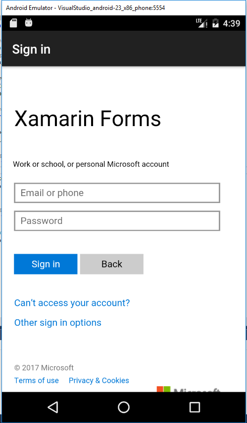

17. Accept the app permission.

18. After you sign in successfully the user token is displayed in the alert box.

	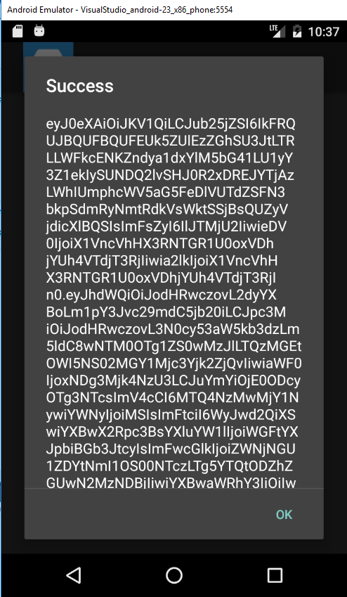

19. In the alert box, click the **OK** button to return to the login page.
20. Click the **SIGN OUT** button to sign out.

	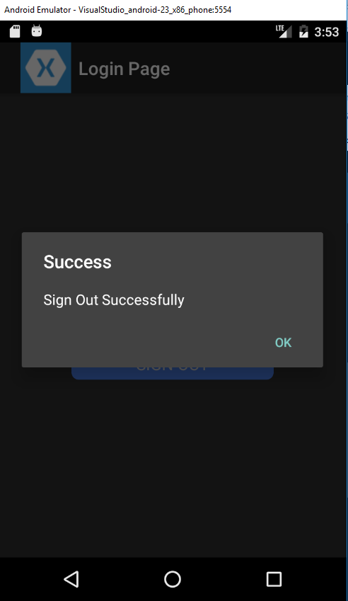


## Exercise 2: Use the Microsoft Graph API to work with Contacts and OneDrive
In this exercise, you will use Microsoft Graph SDK to retrieve a user's Contacts.

1. Open the the **XamarinLab.sln** solution.
2. Include the **Util.cs** file from the [**Starter Project/Src**](./Starter Project/Src) folder in the **Helper** folder in the **XamarinLab** project.
3. Include the **MainPage.xaml** and **MainPage.xaml.cs** files from the [**Starter Project/Src**](./Starter Project/Src) folder in the **XamarinLab** project.
4. Open the **Properties** window for the **MainPage.xaml.cs** file, then set the **Build Action** to **Embedded resource**, and **Custom Tool** to **MSBuild:UpdateDesignTimeXaml**.

    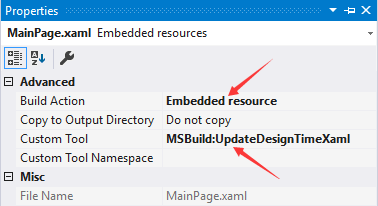

	>**Note:** You can select **Embedded resource** in a dropdown list for **Build Action**, but you need manually input **MSBuild:UpdateDesignTimeXaml** for **Custom Tool**.

5. Include the **ContactsPage.xaml** and **ContactsPage.xaml.cs** files from the [**Starter Project/Src**](./Starter Project/Src) folder in the **XamarinLab** project. Set the **ContactsPage.xaml**'s properties.  Set **Build Action** to **Embedded resource** and **Custom Tool** to **MSBuild:UpdateDesignTimeXaml**.
6. Include the **FilesPage.xaml** and **FilesPage.xaml.cs** files from the [**Starter Project/Src**](./Starter Project/Src) folder in the **XamarinLab** project.  Set **FilesPage.xaml**'s properties.  Set **Build Action** to **Embedded resource** and **Custom Tool** to **MSBuild:UpdateDesignTimeXaml**.

    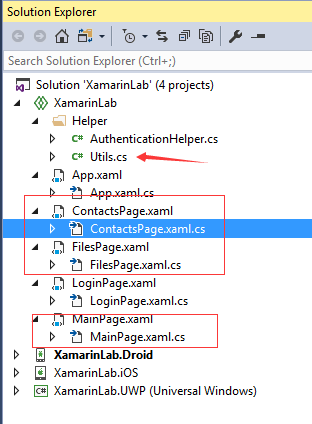

6. Open the **Package Manager Console**, then install the packages **System.Net.Http** and **Microsoft.Graph** for Android and iOS platforms by running the following commands once for each project.
   
	```powershell
	Install-Package System.Net.Http
	Install-Package Microsoft.Graph
    ```

    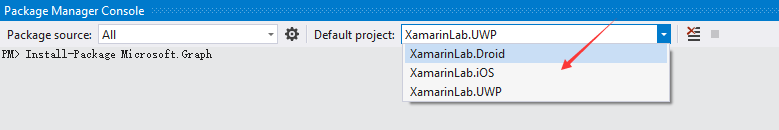

6. Open the **Package Manager Console**, then install the packages **Microsoft.Graph** and **Newtonsoft.Json** for the UWP platform by running the following commands.
   
	```powershell
	Install-Package Microsoft.Graph
	Install-Package Newtonsoft.Json
    ```

7. Open the **LoginPage.xaml.cs** in the **XamarinLab** project.  In the **SignInButton_Clicked** method, add code to navigate to the **MainPage** after a user has signed in successfully.

    ```c#
    private async void SignInButton_Clicked(object sender, EventArgs e)
    {
        try
        {
            using (var scope = new ActivityIndicatorScope(activityIndicator, activityIndicatorPanel, true))
            {
                string token = await AuthenticationHelper.SignIn();
                await Navigation.PushAsync(new MainPage());
            }
        }
        catch{
            await DisplayAlert("Error", "Sign On failed", "Ok");
        }
    }
	```

8. In the **AuthenticationHelper.cs** file, add the following `using` statements.

	```c#
    using Microsoft.Graph;
	using System.Net.Http.Headers;
    ```

9. Add a static variable to the **AuthenticationHelper** class to store the **GraphServiceClient**.

    ```c#
    private static GraphServiceClient graphClient = null;
    ```

9. Add the **GetTokenForUserAsync** method to the **AuthenticationHelper** class to get user token.

    ```c#
	public static async Task<string> GetTokenForUserAsync()
	{
		if (userToken == null || expiration <= DateTimeOffset.UtcNow.AddMinutes(5))
		{
		    await SignIn();
		}
		
		return userToken;
	}
    ```

10. Add the **GetGraphServiceClient** method to the **AuthenticationHelper** class to get the Microsoft Graph service client.
    ```c#
    public static GraphServiceClient GetGraphServiceClient()
    {
        if (graphClient == null)
        {
            // Create Microsoft Graph client.
            try
            {
                graphClient = new GraphServiceClient(
                    "https://graph.microsoft.com/v1.0",
                    new DelegateAuthenticationProvider(
                        async (requestMessage) =>
                        {
                            var token = await GetTokenForUserAsync();
                            requestMessage.Headers.Authorization = new AuthenticationHeaderValue("bearer", token);
                        }));
                return graphClient;
            }

            catch (Exception ex)
            {
            }
        }

        return graphClient;
    }
    ```
11. Open the **MainPage.xaml.cs** file in the **XamarinLab** project.  Add the code to navigate to the contacts page when a user selects contacts menu on the main page. To do this, replace the **OnItemTapped** method with the following code.
    ```c#
    private async void OnItemTapped(object sender, ItemTappedEventArgs e)
    {
        if (e == null) return;
        if (e.Item.ToString().Equals("Contacts"))
        {
            await Navigation.PushAsync(new ContactsPage());
        }
        else {
        }
    }
    ```
12. Open the **ContactsPage.xaml.cs** file in the **XamarinLab** project.  Add the code to get contacts.  To do this, replace the **OnAppearing** method with the following code.
    ```c#
    protected async override void OnAppearing()
    {
        base.OnAppearing();
        if (this.contactModelList.Count == 0) {
            using (var scope = new ActivityIndicatorScope(activityIndicator, activityIndicatorPanel, true))
            {
                var graphClient = AuthenticationHelper.GetGraphServiceClient();

                var contactsList = await graphClient.Me.Contacts.Request().Select("Id,DisplayName,EmailAddresses").GetAsync();
                foreach (var contact in contactsList)
                {
                    CantactViewModel model = new CantactViewModel()
                    {
                        Id = contact.Id,
                        DisplayName = contact.DisplayName,
                        EmailAddress = contact.EmailAddresses.FirstOrDefault().Address
                    };
                    this.contactModelList.Add(model);
                }
            }
        }
    }
    ```
13 Open the **ContactsPage.xaml.cs** file in the **XamarinLab** project.  Add the code to navigate to the files page when a user selects a contacts.  To do this, replace the **OnItemTapped** method with the following code.
    ```c#
    protected async void OnItemTapped(object sender, ItemTappedEventArgs e)
    {
        if (e == null) return;
        CantactViewModel model = e.Item as CantactViewModel;
        await Navigation.PushAsync(new FilesPage(model.EmailAddress));
    }
    ```
14. Open the **FilesPage.xaml.cs** file in the **XamarinLab** project.  Add the code to get a contact's files.  To do this, replace the **OnAppearing** method with the following code.
    ```c#
	protected async override void OnAppearing()
    {
        base.OnAppearing();
        if (this.fileModelList.Count == 0) {
            using (var scope = new ActivityIndicatorScope(activityIndicator, activityIndicatorPanel, true))
            {
                var graphClient = AuthenticationHelper.GetGraphServiceClient();
                var user = await graphClient.Users.Request().Filter($"mail eq '{contactEmail}'").Select("Id").GetAsync();
                var userId = user.SingleOrDefault().Id;
                var driveItems = await graphClient.Users[userId].Drive.Root.Children.Request().GetAsync();
                foreach (var item in driveItems)
                {
                    string lastDateTime = item.LastModifiedDateTime != null ? ((DateTimeOffset)item.LastModifiedDateTime).LocalDateTime.ToString("MM/dd/yy H:mm:ss") : "";
                    FileViewModel model = new FileViewModel()
                    {
                        Name = item.Name,
                        LastModifiedDateTime = $"Last Modified: {lastDateTime}"
                    };
                    this.fileModelList.Add(model);
                }
            }
        }
    }
    ```

13. Select the following **android** emulator, and click the arrow to run the app.
14. After signing in successfully the **Main page** is displayed.
	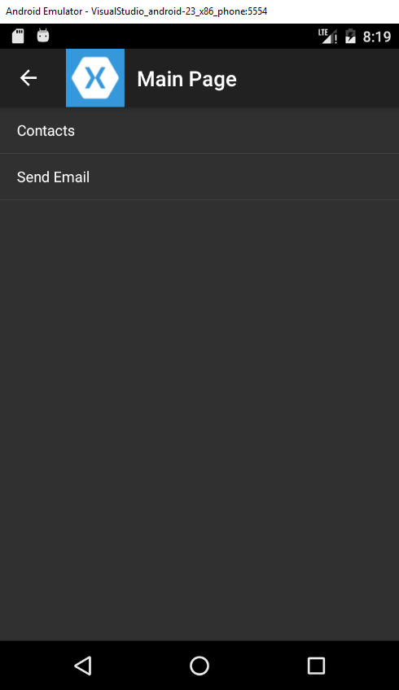
15. Select the **Contacts** menu on **Main Page** to see the contacts on the **Contacts Page**.
	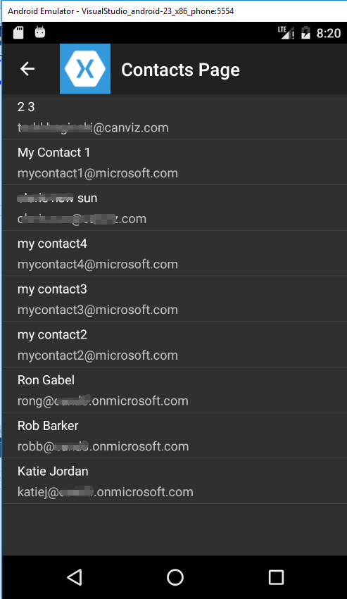
16. Select a contact that has some files shared with you on OneDrive to see the files displayed on the **Files Page**.
	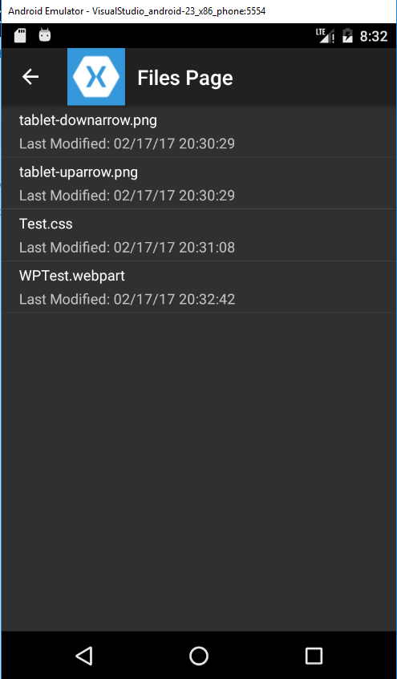

## Exercise 3: Use the Microsoft Graph SDK to send email through Exchange

In this exercise, you will use the Microsoft Graph SDK to send email.

1. Open the **XamarinLab.sln** solution.
2. Copy the **Starter Project/Src/MailPage.xaml** and the **MailPage.xaml.cs** files.  Paste and include the files to the **XamarinLab** project folder.  Set the **Build Action** property to **Embedded resource** and the **Custom Tool** property to **MSBuild:UpdateDesignTimeXaml**.
	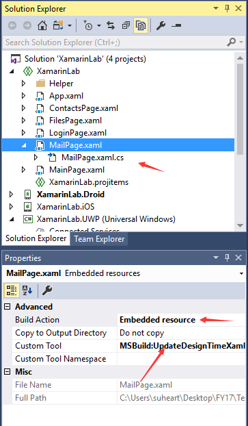
3. Open the **MainPage.xaml.cs** file in the **XamarinLab** project. Add code to navigate to the mail page when a user clicks the **Send Email** menu on the main page.  To do this, replace the **OnItemTapped** method with the following code.
    ```c#
    private async void OnItemTapped(object sender, ItemTappedEventArgs e)
    {
        if (e == null) return;
        if (e.Item.ToString().Equals("Contacts"))
        {
            await Navigation.PushAsync(new ContactsPage());
        }
        else
        {
            await Navigation.PushAsync(new MailPage());
        }
    }
    ```
4. Open the **MailPage.xaml.cs** file in the **XamarinLab** project.  Add the code to send email.  To do this, replace the **SendButton_Clicked** method with the following code.
 	```c#
 	private async void SendButton_Clicked(object sender, EventArgs e)
    {
        try
        {
            if (this.emailAdressEntry.Text.Length > 0)
            {
                using (var scope = new ActivityIndicatorScope(activityIndicator, activityIndicatorPanel, true))
                {
                    var graphClient = AuthenticationHelper.GetGraphServiceClient();
                    var newMessage = new Message { Subject = this.subjectEntry.Text };
                    var email = new EmailAddress
                    {
                        Name = this.emailAdressEntry.Text,
                        Address = this.emailAdressEntry.Text
                    };
                    var tolist = new List<Recipient>();
                    tolist.Add(new Recipient { EmailAddress = email });
                    newMessage.ToRecipients = tolist;
                    newMessage.Subject = this.subjectEntry.Text;
                    newMessage.Body = new ItemBody
                    {
                        ContentType = BodyType.Text,
                        Content = this.bodyEntry.Text
                    };
                    await graphClient.Me.SendMail(newMessage, true).Request().PostAsync();
                    await DisplayAlert("Success", "Send mail successfully.", "Ok");
                }
            }
        }
        catch (Exception ex)
        {
            await DisplayAlert("Error", "Sign On failed", "Ok");
        }
    }
    ```
4. Select the following **android** emulator, and click the arrow to run the app.
5. After signing in successfully click **Send Email** on the **Main page**
6. Enter an email address, subject, and body.
7. Click the **Send** button to send the email.
   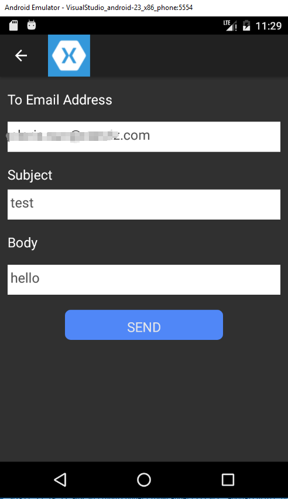

**Congratulations! You have completed working with the Microsoft Graph API and SDK in a Xamarin Forms app.**