Configuring your Office 365 Tenant
==================================

## Overview

The lab steps through the steps required to configure your Office 365 Tenant for authentication from your Android or iOS app.

## Objectives

- Connect your Office 365 Azure Active Directory to your Azure subscription.
- Add an Azure Active Directory Application to your Office 365 Tenant's Active Directory to allow authentication from your Android or iOS app.

## Prerequisites
1. You must have an Office 365 tenant and Azure Subscription to complete this lab. If you do not have one, the lab for **[O3651-7 Setting up your Developer environment in Office 365](https://github.com/OfficeDev/TrainingContent/blob/master/O3651/O3651-7%20Setting%20up%20your%20Developer%20environment%20in%20Office%20365/Lab.md)** shows you how to obtain a trial.

## Tasks

The hands-on lab includes the following exercises:

- [**Task 1:**](#task1) Connect your Office 365 Azure Active Directory  to your Azure subscription

- [**Task 2:**](#task2) Create a new Azure Active Directory Application in your Office 365 Azure Active Directory for your Android or iOS app

## Task 1: Connect your Office 365 Azure Active Directory to your Azure subscription

Here we will associate your Azure account with your Office 365 tenant as a global administrator.
This gives you the ability to manage the Office 365 directory using the Azure  Management Portal.

01. Sign into the [Azure Portal](https://manage.windowsazure.com/)

02. Click **+ New**

    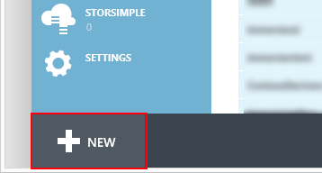

03. Select **App Services > Active Directory > Directory > Custom Create**

    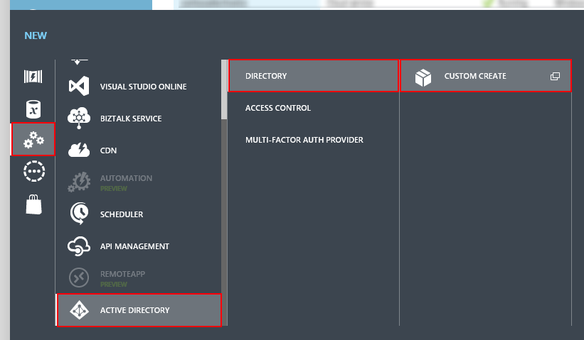

04. Fill out the following form and click **Complete**.

    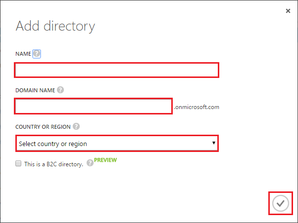

You have successfully created an Azure Active Directory.

## Task 2: Create a new Azure Active Directory Application in your Office 365 directory for your Android or iOS app

Here we will create an Azure Active Directory Application in your Office 365 directory to allow your Android or iOS app to authenticate
and interact with the Microsoft Graph and SharePoint APIs

01. When you're signed back in, navigate to your Office 365 directory in the Active Directory extension.

    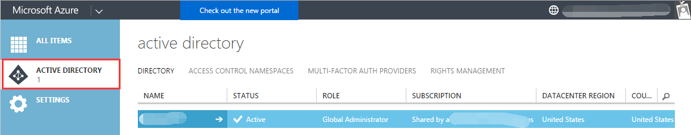

02. And then navigate to the **Applications** tab.

    

03. Select **Add** from the action bar to add a new Application.
    
    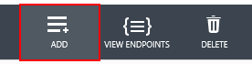

04. Select **Add an application from my Organization is developing**.
    
    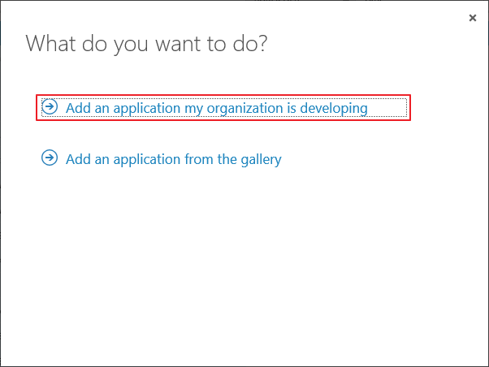

05. Enter a name for the application, and select **Native Client Application**. Click **the arrow icon on the bottom-right corner of the page**.

    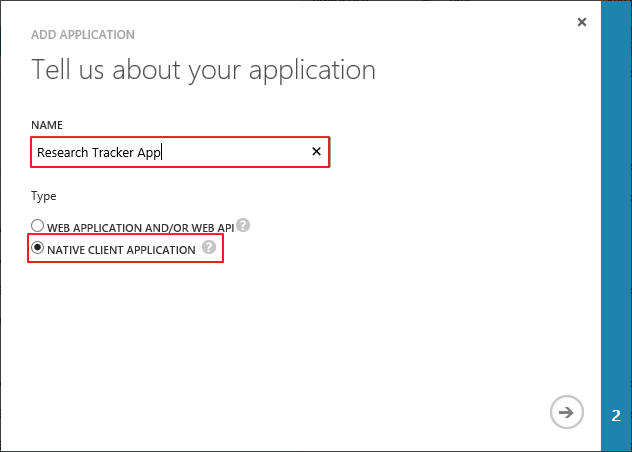

06. Enter the following redirect URI for the application:

        http://example.com/redirect

    **NOTE:** this url does not need to resolve to anything, but we will later configure our mobile app with 
    this same url.

    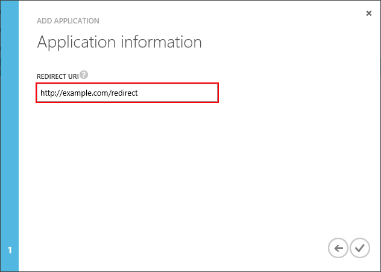

07. Click **the check mark icon on the bottom-right corner of the page**.

08. The application is created. Navigate to the **Configure** tab.

    

09. And copy down the **Client Id**.

    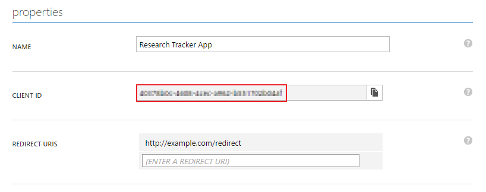

10. Finally, scroll to the bottom of the screen. In the **Permissions to other applications** section, click **Add application**.
	
	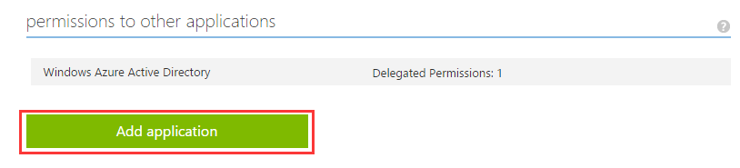

11. Select **Microsoft Graph**. Click **the check mark icon**

	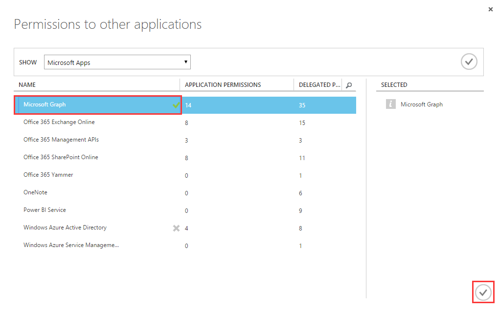

12. From **Delegated Permissions** select the following:

    * Read and write access to users' mail
    * Send mail as a user
    * Have full access to users' calendars
    * Have full access to users' contacts
    * Have full access to all files user can access

    This configures your app to have delegated permission to access user data in
    Microsoft Graph.

	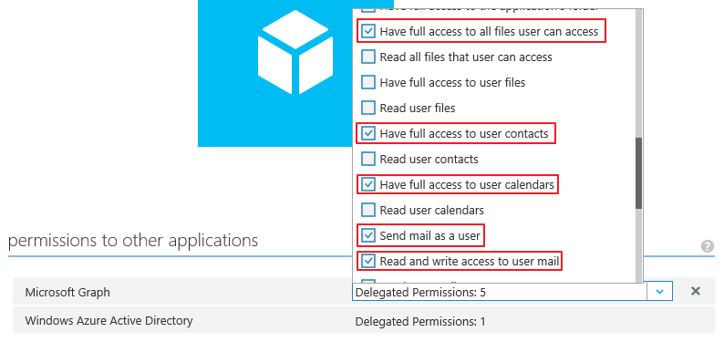

13. Click **Add application**

14. Select **Office 365 SharePoint Online**. Click **the check mark icon**.
	
	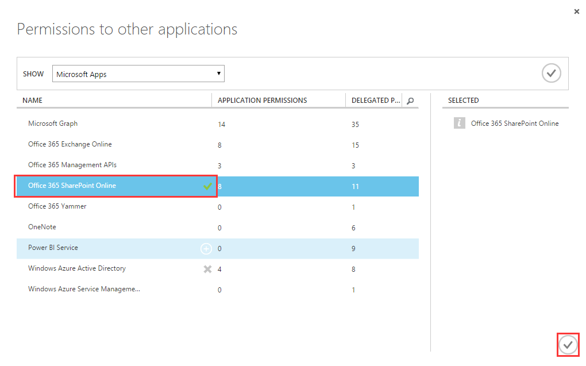

15. From **Delegated Permissions** select the following:

    * Read and write items and lists in all site collections

    This configures your app to have delegated permission to access user data in SharePoint.

    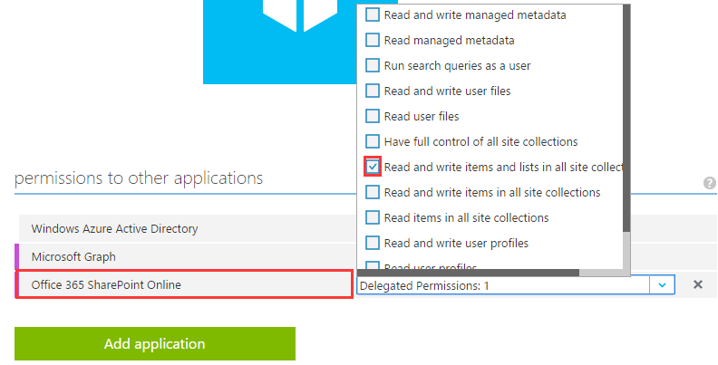

16. Click **Save** to save the changes.

    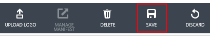

You have successfully created an Azure Active Directory Application in your Office 365 directory to allow your Android or iOS app to authenticate
and interact with the Microsoft Graph and SharePoint APIs
