Authentication with Office 365
==============================

## Overview

The lab lets students create, configure and run an Android App which demonstrates authentication
with Office 365 using the Azure Active Directory Authentication Library (ADAL) for Android.

## Objectives

- Learn how to authenticate with Azure Active Directory from an Android app by using the 
  **Azure Active Directory Authentication Library (ADAL) for Android**

## Prerequisites

- [Git version control tool][git-scm]
- [Android Studio][android-studio]
- Android API Level 23 installed [using the Android SDK Manager][sdk-manager]
- Complete the [\\\O3654\O3654-4 Android\01 AAD Prereqs](../01 AAD Prereqs) module.
    - You must have an Office 365 tenant linked to your Windows Azure subscription to complete this lab.

[git-scm]: http://git-scm.com
[android-studio]: http://developer.android.com/sdk/installing/studio.html
[sdk-manager]: http://developer.android.com/tools/help/sdk-manager.html

## Exercises

The hands-on lab includes the following exercises:

- [**Exercise 1:**](#exercise1) Create a new Android app and add the ADAL

- [**Exercise 2:**](#exercise2) Use the ADAL to acquire an auth token for Office 365 Exchange


<a name="exercise1"></a>
## Exercise 1: Create a new Android app and add the ADAL

Here we will create a new empty Android app, and add the Active Directory Authentication Library for Android (ADAL) to it.

Then, we'll use the ADAL to authenticate and obtain an access token.

### Task 1 - Create a new Android app

01. Launch Android Studio and create a new project.

    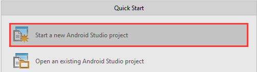

02. Fill out the new project wizard according the screenshots below:

    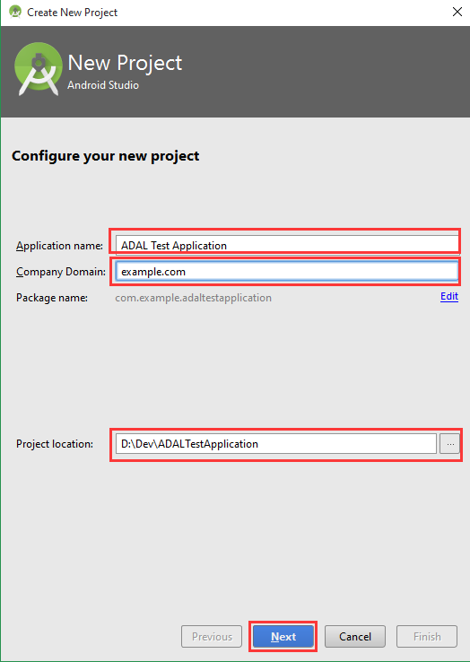
    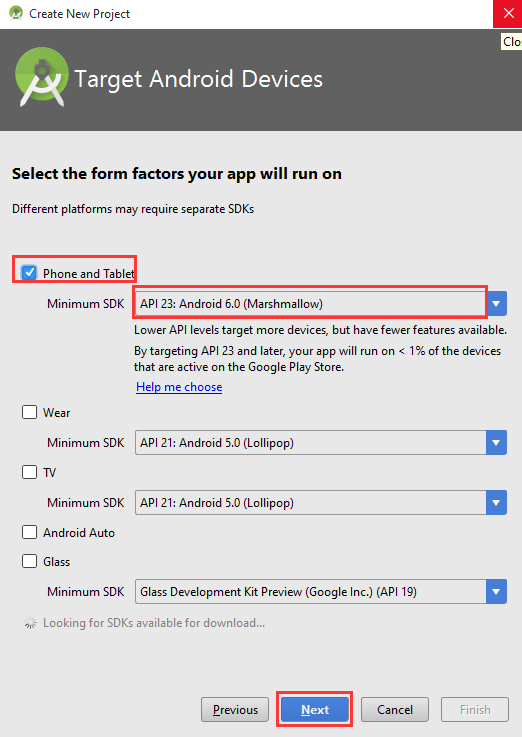
    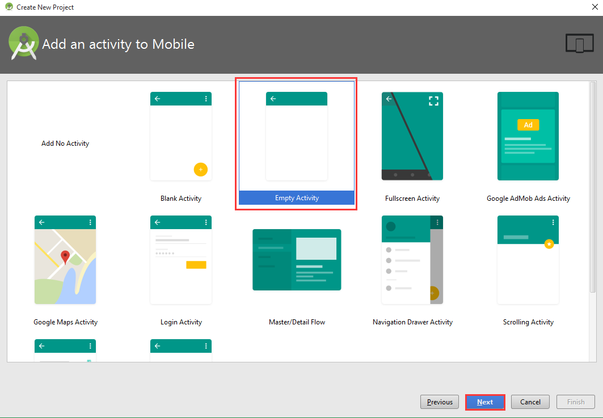
	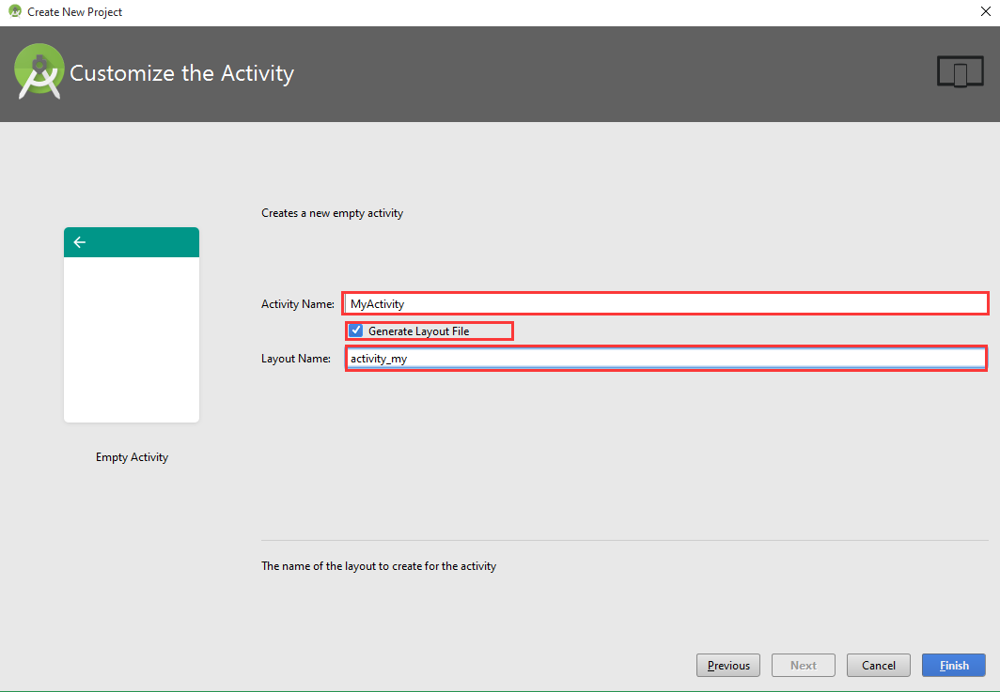

04. Click **Finish** to complete the wizard and create your new Android project.


### Task 2 - Create an AVD/emulator and launch the app for debugging

In this task we will create an AVD (Android Virtual Device) in order to test our app. If you have already created an
AVD you may skip this Task.

01. Launch the AVD Manager and click **Create Virtual Device...**.

    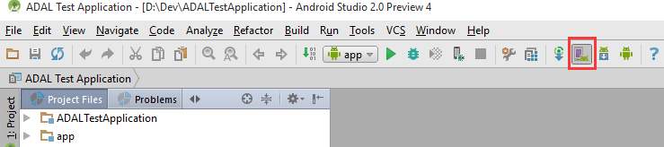
	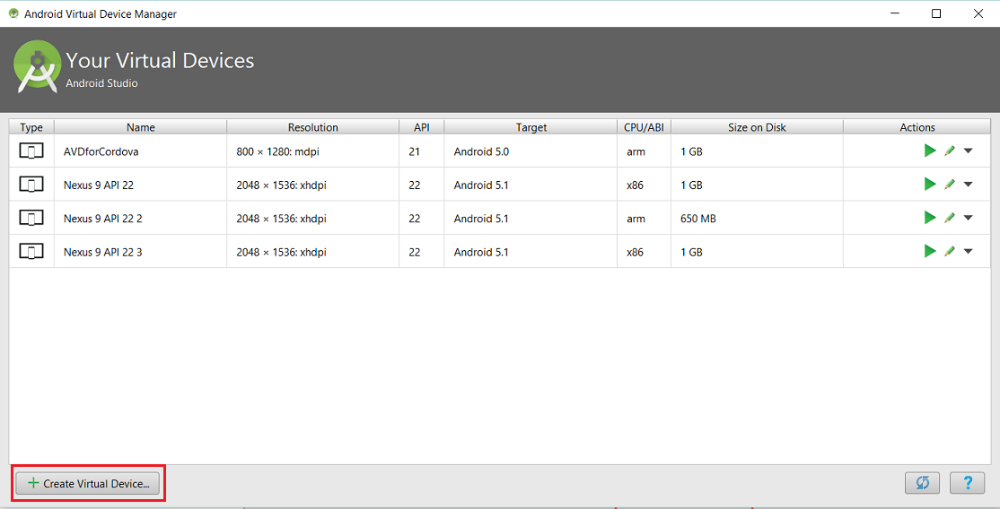

02. Fill out the new AVD wizard, selecting the following:

	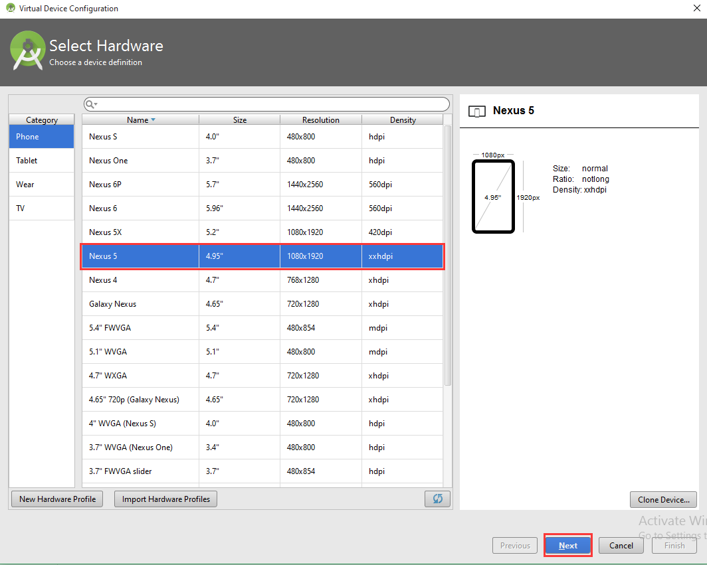
	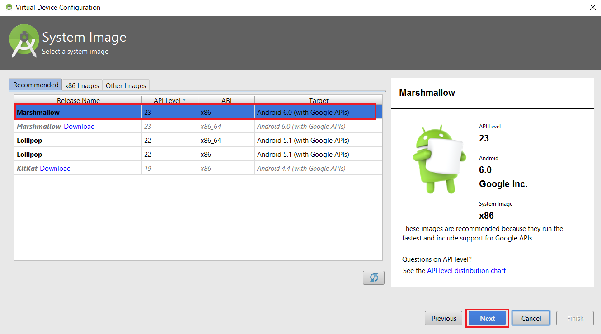
	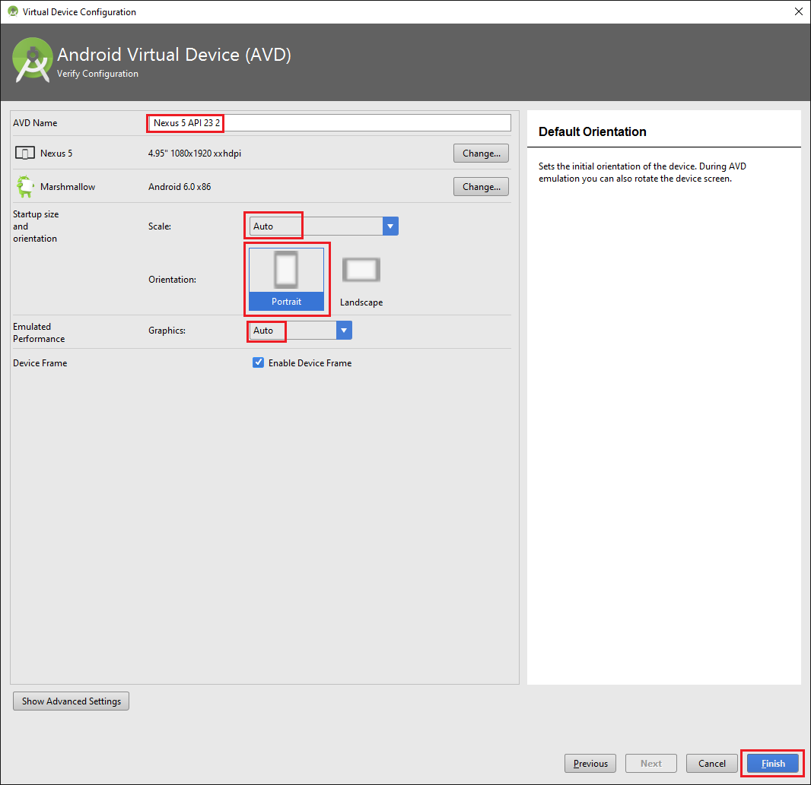

03. Select the newly created AVD and click **Start** to start it.

	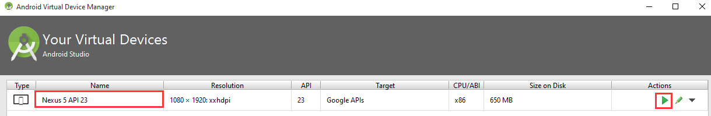

04. When the emulator is running, return to Android Studio and select **Run > Debug 'app'**.

    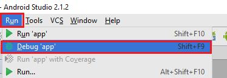

05. When prompted, select your emulator from the list and click **OK** to deploy the app and start debugging it.

    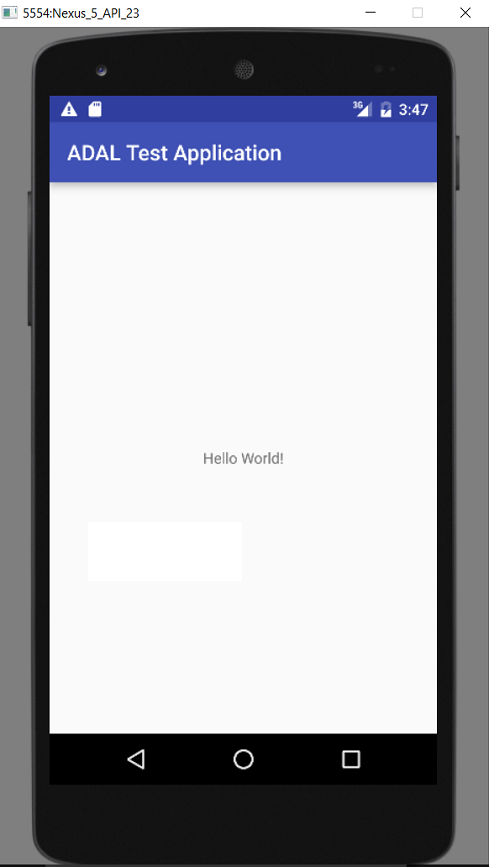

Done! The emulator runs separately from Android Studio and can be shared between multiple instances of 
Android Studio, Eclipse and even Visual Studio with Xamarin for Android.

### Task 3 - Add the Active Directory Authentication Library to your project

01. Open the `build.gradle` file for the ADAL test app.

    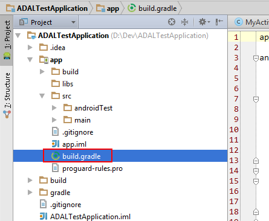

02. Add the following line to the `dependencies` section:

        compile 'com.microsoft.aad:adal:1.0.5'

    This is a reference to [ADAL v1.0.5 in the Maven repository](http://mvnrepository.com/artifact/com.microsoft.aad/adal/1.0.5).

03. Android Studio will prompt you to perform a Gradle sync - click **Sync Now** to do so.

    This triggers Android Studio to automatically download and configure the ADAL library from the Maven repository.
    
    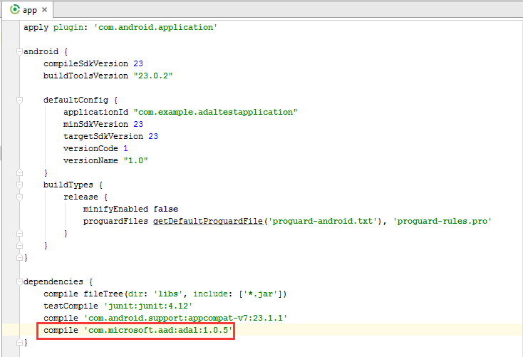

04. Next we must add the `android.permission.INTERNET` permission to the Android Manifest. From the `src/main`
    folder, open the **AndroidManifest.xml** file.

    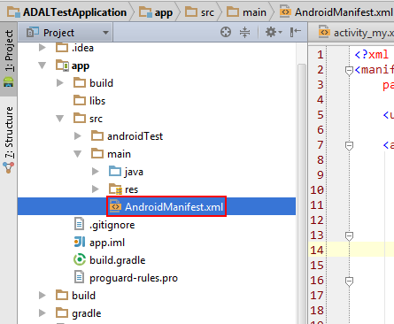

05. Add the following XML block to the `<manifest />` element:

        <uses-permission android:name="android.permission.INTERNET" />

    The result should look like this:

    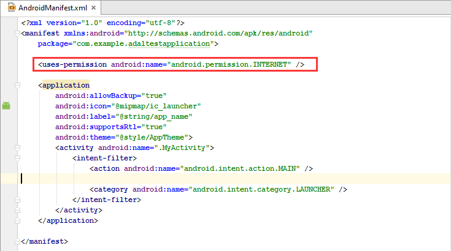


You've now completed the basic steps required to prepare your app to use the ADAL library. In the next task,
we'll take a look at authenticating a user and retrieving an Access Token.

<a name="exercise2"></a>
## Exercise 2: Use the ADAL to acquire an auth token for Office 365 Exchange

Now that we've got the library, let's add some code to authenticate a user.

### Task 1: Acquire a new token

01. Navigate to the **activity_my.xml** layout file. You can find layouts in the `src/main/res/layout` folder.

    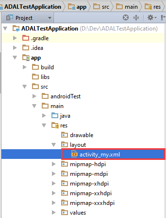

02. Replace the "Hello world" TextView with the following Button definition:

    ```xml
    <Button
        android:id="@+id/get_access_token"
        android:layout_width="wrap_content"
        android:layout_height="wrap_content"
        android:text="Get Access Token" />
    ```

03. Next, navigate to the **MyActivity** class. You can find activities in the `src/main/java` folder.

    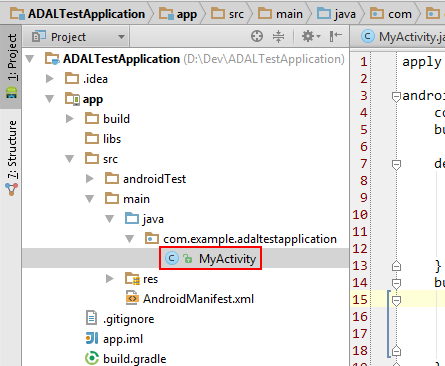

04. Add the following member fields to the class:

    > **Note:** Make sure to use the correct constants in the following code block!

    **CLIENT_ID** = The client ID created in the Prerequisites lab

    **REDIRECT_URI** = The redirect URI entered in the Prerequisites lab

    ```java
    //The resource we want to authenticate for
    private static final String RESOURCE = "https://graph.microsoft.com/";
    private static final String CLIENT_ID = "YOUR CLIENT ID";
    private static final String REDIRECT_URI = "http://example.com/redirect";
    //Local instance variables
    private AuthenticationContext mAuthContext;
    private Button mGetAccessTokenButton;
    ```

05. Make sure you import the following class.
    	
	```java
	import android.app.Activity;
	import android.app.AlertDialog;
	import android.content.Context;
	import android.content.Intent;
	import android.os.Bundle;
	import android.text.TextUtils;
	import android.view.View;
	import android.widget.Button;
	import android.widget.Toast;
	import com.microsoft.aad.adal.AuthenticationCallback;
	import com.microsoft.aad.adal.AuthenticationContext;
	import com.microsoft.aad.adal.AuthenticationResult;
	import com.microsoft.aad.adal.PromptBehavior;
	import java.security.NoSuchAlgorithmException;
	import javax.crypto.NoSuchPaddingException;
	```

    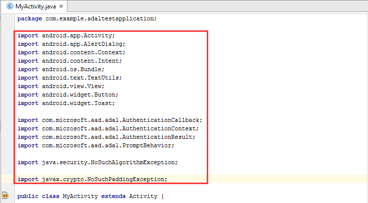

06. Add the following code to the `onCreate` method.

    ```java
    //Create an authentication context...
    final String AUTHORITY = "https://login.windows.net/common";
    final boolean VALIDATE_AUTHORITY = false;
    final Context context = getApplicationContext();
    try {
        mAuthContext = new AuthenticationContext(context, AUTHORITY, VALIDATE_AUTHORITY);
    }
    catch (NoSuchAlgorithmException e) {
        //This error should not occur in normal operation, but we cannot continue if it does
        throw new RuntimeException("Error creating authentication context", e);
    }
    catch (NoSuchPaddingException e) {
        //This error should not occur in normal operation, but we cannot continue if it does
        throw new RuntimeException("Error creating authentication context", e);
    }
    
    //Hook up the "Get Access Token" button
    mGetAccessTokenButton = (Button) findViewById(R.id.get_access_token);
    mGetAccessTokenButton.setOnClickListener(new View.OnClickListener() {
        public void onClick(View view) {
            startAuthentication();
        }
    });
    ```

    We will define the `startAuthentication()` function in a moment.
    
07. Add the following method declaration to the class:

    ```java
    @Override
    protected void onActivityResult(int requestCode, int resultCode, Intent data) {
        super.onActivityResult(requestCode, resultCode, data);
        mAuthContext.onActivityResult(requestCode, resultCode, data);
    }
    ```

    This is required to complete any authentication flow started by the `AuthenticationContext`.

08. Add the `startAuthentication` method to the class.

    ```java
    private void startAuthentication() {        
        mAuthContext.acquireToken(
            this,
            RESOURCE,
            CLIENT_ID,
            REDIRECT_URI,
            PromptBehavior.Always,
            new AuthenticationCallback<AuthenticationResult>() {
                public void onSuccess(AuthenticationResult authenticationResult) {
                    handleSuccess(authenticationResult);
                }
                public void onError(Exception e) {
                    handleError(e.toString());
                }
            }
        );
    }
    ```

09. And to finish, implement the two result handling functions:

    ```java
    private void handleSuccess(AuthenticationResult authenticationResult) {
        String message = String.format(
                "User Id: %1$s\nExpires on: %2$s\nAccess Token: %3$s...\nRefresh Token: %4$s...",
                authenticationResult.getUserInfo().getUserId(),
                authenticationResult.getExpiresOn().toString(),
                authenticationResult.getAccessToken().substring(0, 10),
                authenticationResult.getRefreshToken().substring(0, 10)
        );
        new AlertDialog.Builder(this)
                .setTitle("Success")
                .setMessage(message)
                .setPositiveButton("Ok", null)
                .show();
    }

    private void handleError(String errorMessage) {
        new AlertDialog.Builder(this)
                .setTitle("Whoops!")
                .setMessage("Something went wrong: " + errorMessage)
                .setPositiveButton("Ok", null)
                .show();
    }
    ```

10. Launch the application in the emulator.

11. When the app has launched, tap **Get Access Token** to start the auth process.

12. When prompted, sign in with a user from your tenant (e.g. the Admin account).

    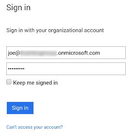

13. Success! Here we're printing the User's Id, the access token expiry date, also the first ten characters of 
    the Access and Refresh tokens.

    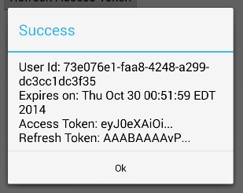

The Access Token here can be attached to any request made to a Microsoft Graph API in order to authenticate as this user.

E.g. set the following header on an HTTP request:

```
Authorization: Bearer {your access token}
```

Next, we'll try refreshing an old token using a Refresh Token.

### Task 2: Refresh an existing token

Refreshing a token doesn't require any user input. We simply pass our cached **Refresh Token** to the 
`acquireTokenByRefreshToken` function on `AuthenticationContext`.

> **Note:** Manually caching a refresh token securely is difficult, and should be avoided if possible.
> 
> Fortunately the ADAL automatically and securely encrypts and caches the refresh tokens for us. Internally, 
it uses the [Android Keystore](https://developer.android.com/training/articles/keystore.html) to securely store
encryption keys.
>
>We don't need to worry about storing the refresh token ourselves - instead we can rely on the ADAL to do it for us.

To authenticate the user without prompting them for credentials, we use the `acquireTokenSilent` function.

01. Open the **activity_my.xml** layout, and add the following Button definition:

    ```xml
    <Button
        android:id="@+id/refresh_access_token"
        android:layout_width="wrap_content"
        android:layout_height="wrap_content"
        android:layout_below="@id/get_access_token"
        android:text="Refresh Access Token" />
    ```

02. Return to the **MyActivity** activity class, and add the following member fields to the class:

    ```java
    private Button mRefreshAccessTokenButton;
    //The last user to sign in
    private String mLastUserId;
    ```

    In order to support "silent" authentication, we must cache the User's Id when they authenticate successfully.
    The User Id is not sensitive information and can be stored without encryption.

03. Add the following code to the end of the `onCreate` function:

    ```java
    //Hook up the "Refresh Access Token" button
    mRefreshAccessTokenButton = (Button) findViewById(R.id.refresh_access_token);
    mRefreshAccessTokenButton.setOnClickListener(new View.OnClickListener() {
        public void onClick(View view) {
            startSilentAuthentication();
        }
    });
    ```

04. Add the following code to the end of the `handleSuccess` function:

    ```java
    //Cache the user Id...
    mLastUserId = authenticationResult.getUserInfo().getUserId();
    ```

05. Finally, add the following method definition to the class. Remember to import any missing types.

    ```java
    private void startSilentAuthentication() {
        if (TextUtils.isEmpty(mLastUserId)) {
            Toast.makeText(this, "No cached user Id!", Toast.LENGTH_SHORT)
                 .show();
            return;
        }
        mAuthContext.acquireTokenSilent(
                RESOURCE,
                CLIENT_ID,
                mLastUserId,
                new AuthenticationCallback<AuthenticationResult>() {
                    public void onSuccess(AuthenticationResult result) {
                        handleSuccess(result);
                    }
                    public void onError(Exception e) {
                        handleError(e.toString());
                    }
                }
        );
    }
    ```

06. We're ready to try it out. Launch the application on the emulator.

07. When the app has launched, tap **Refresh Access Token**.
    
    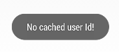

    This fails because we haven't authenticated yet and do not have a user Id.

07. Tap **Get Access Token** and sign in to acquire a refresh token.

07. When done, tap **Refresh Access Token** get a new access token using the cached refresh token. Doing so will
    store the new refresh token.


> **Note:**  The access token will expire in a few hours, but the refresh token will remain valid for a very long time.
>
>We do need to store the User Id somewhere - currently we're storing it as a member variable on our activity,
but this will not serve for a real-world application. Instead we could store it in a database or using the
[Shared Preferences](http://developer.android.com/reference/android/content/SharedPreferences.html) service.

## Summary

By completing this hands-on lab you have learned:

01. How to add the ADAL library an Android project
02. How to obtain an access token using the ADAL
03. How to refresh an access token using the ADAL

