Calling the Microsoft Graph API for Exchange with Android
=====================================

## Overview

Office 365 Exchange exposes a RESTful HTTP API which we can consume using the Microsoft Graph SDK for Android.

The SDK provides asynchronous access to the Microsoft Graph using strongly-typed
objects and operations.

For more information on the API being consumed in this lab, see [the API documentation](https://graph.microsoft.io/en-us/docs).

[docs-mail-contacts-calendar]: http://graph.microsoft.io/docs/overview/overview

## Objectives

-   Learn how to communicate with the Microsoft Graph using the
    **Microsoft Graph SDK for Android**

## Prerequisites

-   [Git version control tool][git-scm]
-   [Android Studio][android-studio]
-   Android API Level 23 installed [using the Android SDK Manager][sdk-manager]
-   Complete the [\\\O3654\O3654-4 Android\01 AAD Prereqs](../01 AAD Prereqs) module.
-   Complete the [\\\O3654\O3654-4 Android\02 ADAL](../02 ADAL) module.

[git-scm]: http://git-scm.com
[android-studio]: http://developer.android.com/sdk/installing/studio.html
[sdk-manager]: http://developer.android.com/tools/help/sdk-manager.html

## Exercises

The hands-on lab includes the following exercises:

-   [**Exercise 1**](#exercise1) Prepare the Android test application and add the Microsoft Graph SDK
-   [**Exercise 2**](#exercise2) Learn some of the operations the Microsoft Graph SDK exposes to you

<a name="exercise1"></a>
## Exercise 1: Prepare the Android test application

In this exercise we will add the Microsoft Graph SDK for Android to the included "O365 Test App".

### Task 1 - Preparing the test app

In this task we'll get the test application up and running.

01. Make a copy of the Android lab test app template, found in the 
    [O365TemplateApp\src](O365TemplateApp/src) directory.

02. Name this copy "ExchangeApp". E.g. in PowerShell

    ```powershell
    PS C:\> $lab_dir = ".\path\to\the\lab"
    PS C:\> $work_dir = ".\path\to\your\projects\dir"
    PS C:\> cp -Recurse "$lab_dir\O365TemplateApp\src\" "$work_dir\ExchangeApp"
    ```

01. Launch Android Studio

02. From the **File** menu, select **Import Project**.

    > **Note:** if this is your first time launching Android Studio, you may    select **Import Project** from the Android Studio launcher.

03. Find and select the **ExchangeApp** folder.
    
04. Click **OK** to import the project.

    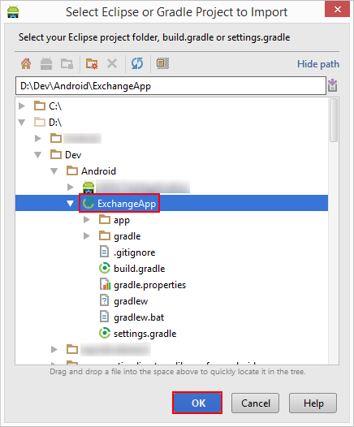

    Wait for Android Studio to finish importing the test project.

05. Open the `app/src/main/res/values/strings.xml` resource file.

	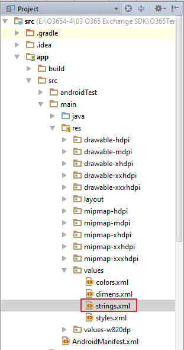

06. Find the string resource named **app_name**, and change it to **O365 Exchange
    Test App**.

    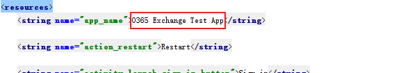
    
    This resource is used in a number of places, including as the App's name    in the Launcher.

07. Open the `Constants` class. It can be found under `app/src/main/java`.

    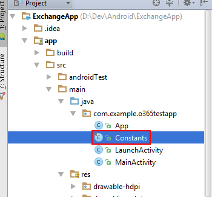

08. This class hosts a number of static constants which we must update.
    
    - **RESOURCE:** Set this to "https://graph.microsoft.com/"

    - **CLIENT_ID:** Set to the Client ID obtained in the Prerequisites module

    - **REDIRECT_URI:** Set to the Redirect URI configured in AD in the        Prerequisites module

    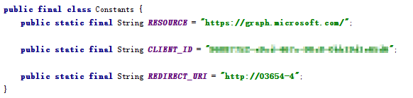

09. Finally, let's test out the app and your changes. Start up the application in the Emulator with **Run > Debug App**.

    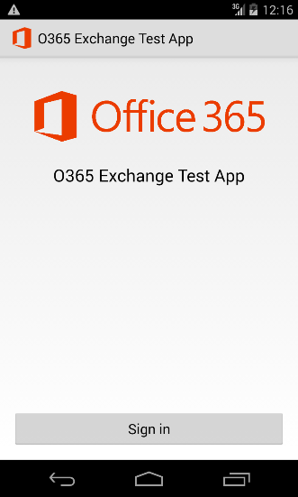

10. Tap the **Sign in** button. Sign in using credentials for a user in your    Office 365 Tenant. If successful, the blank `MainActivity` will be launched.

In this task you have created and configured the Office 365 Test App - this will serve as the base on which you will build out the rest of the lab.

### Task 2 - Add the Microsoft Graph SDK to the test app

In this task you will add the **Microsoft Graph SDK** to the app, and then configure it.

01. Open the `app/build.gradle` file.

    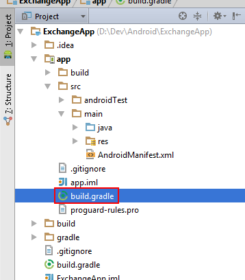

02. Find the `dependencies` section. Currently it has a reference to the ADAL.

03. Add the following block of code to the `dependencies` section:

    ```groovy
    // Base OData stuff
    compile 'com.microsoft.services:odata-engine-core:0.11.0'
    compile 'com.microsoft.services:odata-engine-android-impl:0.11.0@aar'

    // MSGraph SDK
    compile 'com.microsoft.graph:msgraph-sdk-android:0.9.2'

    // MSGraph SDK Android MSA Auth for Android Adapter
    compile 'com.microsoft.graph:msa-auth-for-android-adapter:0.9.0'
    ```
  
    

04. Click **Sync Now**.
    
    

05. Open the `MainActivity` class. It can be found under `app/src/main/java`.

06. Make sure you import the following classes.
	
	```java
	import android.os.Bundle;
	import android.app.Activity;
	import android.app.AlertDialog;
	import android.app.ProgressDialog;
	import android.content.DialogInterface;
	import android.view.View;
	import android.widget.EditText;
	
	import java.text.DateFormat;
	import java.text.SimpleDateFormat;
	import java.util.Arrays;
	import java.util.Calendar;
	import java.util.TimeZone;
	import java.util.List;
	
	import com.microsoft.graph.core.ClientException;
	import com.microsoft.graph.core.IClientConfig;
	import com.microsoft.graph.core.DefaultClientConfig;
	import com.microsoft.graph.extensions.BodyType;
	import com.microsoft.graph.extensions.EmailAddress;
	import com.microsoft.graph.extensions.IMailFolderRequestBuilder;
	import com.microsoft.graph.extensions.IMessageCollectionRequest;
	import com.microsoft.graph.extensions.IMessageCollectionRequestBuilder;
	import com.microsoft.graph.extensions.ItemBody;
	import com.microsoft.graph.extensions.MailFolder;
	import com.microsoft.graph.extensions.Message;
	import com.microsoft.graph.extensions.Recipient;
	import com.microsoft.graph.extensions.MailFolder;
	import com.microsoft.graph.extensions.IMailFolderCollectionPage;
	import com.microsoft.graph.extensions.IMailFolderCollectionRequest;
	import com.microsoft.graph.extensions.GraphServiceClient;
	import com.microsoft.graph.extensions.IGraphServiceClient;
	import com.microsoft.graph.extensions.IMessageCollectionPage;
	import com.microsoft.graph.authentication.IAuthenticationAdapter;
	import com.microsoft.graph.authentication.MSAAuthAndroidAdapter;
	import com.microsoft.graph.extensions.User;
	import com.microsoft.graph.http.IHttpRequest;
	import com.microsoft.graph.concurrency.ICallback;
	import com.microsoft.graph.options.Option;
	import com.microsoft.graph.options.HeaderOption;
	import com.microsoft.graph.options.QueryOption;
	```

07. Add the following member fields to the top of the class:

    ```java
    private IGraphServiceClient graphServiceClient;
    ```

08. Add the following code to the end of the `onCreate` function.

    ```java
    final IAuthenticationAdapter authenticationAdapter = new MSAAuthAndroidAdapter(getApplication()) {
        @Override
        public String getClientId() {
            return Constants.CLIENT_ID;
        }

        @Override
        public String[] getScopes() {
            return new String[] {
                    "https://graph.microsoft.com/Mail.ReadWrite",
                    "https://graph.microsoft.com/Mail.Send",
                    "offline_access",
                    "openid"
            };
        }
        @Override
        public void authenticateRequest(final IHttpRequest request) {
            for (final HeaderOption option : request.getHeaders()) {
                if (option.getName().equals(AUTHORIZATION_HEADER_NAME)) {
                    return;
                }
            }
            if (mAccessToken != null && mAccessToken.length() > 0){
                request.addHeader(AUTHORIZATION_HEADER_NAME, OAUTH_BEARER_PREFIX + mAccessToken);
                return;
            }
            super.authenticateRequest(request);
        }
    };
    final IClientConfig mClientConfig = DefaultClientConfig.createWithAuthenticationProvider(authenticationAdapter);
    graphServiceClient  = new GraphServiceClient
            .Builder()
            .fromConfig(mClientConfig)
            .buildClient();
    ```

    The variable `mAccessToken` is obtained by `LaunchActivity` using the Active Directory Authentication Library


<a name="exercise2"></a>
## Exercise 2: Learn some of the operations the Microsoft Graph SDK exposes to you

In this exercise we will examine some of the functions the Microsoft Graph SDK exposes to us, and how to call them correctly within the context of an Android app.


### Task 1 - Getting the user's Inbox

In this task we will make a call to the Microsoft Graph to retrieve the contents of the user's **Inbox**.

01. Open the MainActivity layout file found at `app/src/main/res/layout/activity_main.xml`.

    This layout file contains an empty `LinearLayout` view, configured to stack its child views vertically.

02. Add the following element to `LinearLayout` element of `activity_main.xml`:

    ```xml
    <Button
        android:id="@+id/retrieve_inbox_button"
        android:layout_width="match_parent"
        android:layout_height="wrap_content"
        android:text="Retrieve Inbox" />
    ```

03. Return to the `MainActivity` class, and add the following code to the `onCreate` method:

    ```java
    findViewById(R.id.retrieve_inbox_button).setOnClickListener(
        new View.OnClickListener() {
            @Override
            public void onClick(View view) {
                startRetrieveInbox();
            }
        }
    );
    ```

04. Add the following methods to the `MainActivity` class.

    ```java
	private class ErrorHandler implements Runnable {
        private ProgressDialog progress;
        private ClientException exception;
        ErrorHandler(ProgressDialog progress, ClientException exception) {
            this.progress = progress;
            this.exception = exception;
        }
        public void run() {
            progress.dismiss();
            showErrorDialog(exception);
        }
    }

    private void showErrorDialog(Throwable t) {
        new AlertDialog.Builder(this)
                .setTitle("Whoops!")
                .setMessage(t.toString())
                .setPositiveButton("OK", null)
                .show();
    }

    private void startRetrieveInbox() {

        //Show a "work-in-progress" dialog
        final ProgressDialog progress = ProgressDialog.show(
                this, "Working", "Retrieving Inbox"
        );

        graphServiceClient.
                getMe().
                getMailFolders().
                buildRequest(Arrays.asList(new Option[]{new QueryOption("$filter", "displayName eq 'Inbox'")})).
                get(new ICallback<IMailFolderCollectionPage>() {
                        @Override
                        public void success(IMailFolderCollectionPage foldersPage) {
                            List< MailFolder > mailFolders = foldersPage.getCurrentPage();
                            if (mailFolders.size() == 1){
                                //Get a reference to Inbox
                                String inboxId = mailFolders.get(0).id;
                                IMailFolderRequestBuilder mailFolderRequestBuilder = graphServiceClient.
                                        getMe().
                                        getMailFolders(inboxId);

                                // Get messages from Inbox
                                IMessageCollectionRequest messagesRequest = mailFolderRequestBuilder.
                                        getMessages().
                                        buildRequest();
                                messagesRequest.get(new ICallback<IMessageCollectionPage>() {
                                    @Override
                                    public void success(IMessageCollectionPage messagesPage) {
                                        List<Message> messages = messagesPage.getCurrentPage();
                                        final String[] items = new String[messages.size()];
                                        for (int i = 0; i < messages.size(); i++) {
                                            items[i] = messages.get(i).subject;
                                        }
                                        //Launch a dialog to show the results to the user
                                        runOnUiThread(new Runnable() {
                                            @Override
                                            public void run() {
                                                progress.dismiss();
                                                new AlertDialog.Builder(MainActivity.this)
                                                        .setTitle("Inbox")
                                                        .setPositiveButton("OK", null)
                                                        .setItems(items, null)
                                                        .show();
                                            }
                                        });
                                    }

                                    @Override
                                    public void failure(final ClientException ex) {
                                        runOnUiThread(new ErrorHandler(progress, ex));
                                    }
                                });
                            }
                        }

                        @Override
                        public void failure(ClientException ex) {
                            runOnUiThread(new ErrorHandler(progress, ex));
                        }
                    });
    }
    ```

05. Launch the app in the debugger with **Run > Debug App**. Sign in with a user from your Office 365 Tenant, and click **Retrieve Inbox**.

    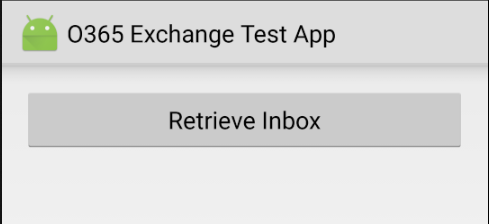

	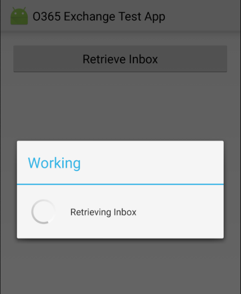

	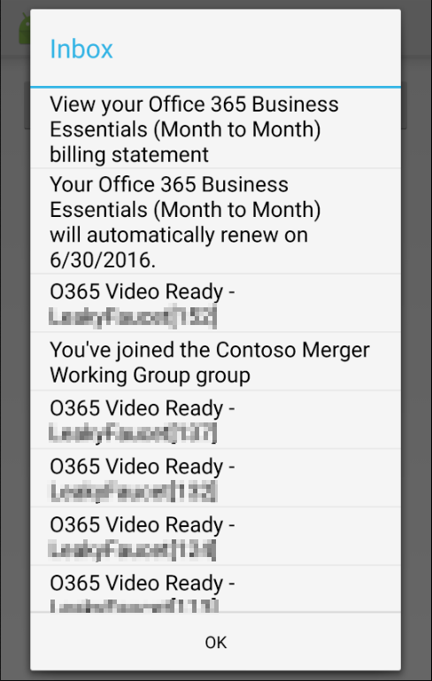

In this task we made a call to the Microsoft Graph to retrieve the contents of the user's Inbox. There is a lot of boilerplate code here, so let's review the interesting parts:

```java
IMailFolderRequestBuilder mailFolderRequestBuilder = graphServiceClient.
        getMe().
        getMailFolders(inboxId);
```

Here we are using parameter `inboxId` to retrieve a single item from a collection by its Id.

Note that there is neither query request has been built, nor query has been executed yet - the `mailFolderRequestBuilder` instance represents a request builder. We can further "navigate" the API.

```java
IMessageCollectionRequest messagesRequest = mailFolderRequestBuilder.
        getMessages().
        buildRequest();
```

Here the `getMessages()` function modifies the request builder to create query request to retrieve messages in the Inbox folder. The `buildRequest()` function creates a query request.

Note that no query has been executed yet - the `messagesRequest` instance represents a potential query to the API. 

```java
messagesRequest.get(new ICallback<IMessageCollectionPage>() {
        @Override
        public void success(IMessageCollectionPage messagesPage) {
            List<Message> messages = messagesPage.getCurrentPage();
            final String[] items = new String[messages.size()];
            for (int i = 0; i < messages.size(); i++) {
                items[i] = messages.get(i).subject;
            }
            //Launch a dialog to show the results to the user
            runOnUiThread(new Runnable() {
                @Override
                public void run() {
                    progress.dismiss();
                    new AlertDialog.Builder(MainActivity.this)
                            .setTitle("Inbox")
                            .setPositiveButton("OK", null)
                            .setItems(items, null)
                            .show();
                }
            });
        }

        @Override
        public void failure(final ClientException ex) {
            runOnUiThread(new ErrorHandler(ex));
        }
    });
```

Here the `get(<callback>)` function executes the query asynchronously, with a `<callback>` which will handle the **success** or **failure** of the call.

Note that the callback will be executed on a background thread. If your code needs to update the User Interface (e.g. update a view or print a warning), then you must dispatch a **Runnable** back to the UI thread using `Activity.runOnUiThread`:

```java    
runOnUiThread(new Runnable() {
    @Override
    public void run() {
        //this code runs on the UI thread
    }
});
```

Alternatively, we could use the `get()` function on the **messagesRequest** object. This will block the thread until the underlying API call completes and the result is returned. 

**Warning: do not do this on the UI thread!** You should use an `AsyncTask` to run this code on a background thread.

```java
try{
    IMessageCollectionPage messagesPage = messagesRequest.get();
    List<Message> messages = messagesPage.getCurrentPage();
}
catch (ClientException ex){
	// handle error
}
```

### Task 2 - Filtering queries

In this task we will modify the previous code to retrieve a filtered view of the user's **Inbox**.

01. Return to the `MainActivity` class and find the following lines:
    
    ```java
    // Get messages from Inbox
    IMessageCollectionRequest messagesRequest = mailFolderRequestBuilder.
            getMessages().
            buildRequest();
    ```

02. We're going to modify it to filter the returned collection of messages to only those which were received today. Replace that line with the following code:

    ```java
    //Get a timestamp for today at midnight
    Calendar calendar = Calendar.getInstance();
    calendar.set(Calendar.HOUR_OF_DAY, 0);
    calendar.set(Calendar.MINUTE, 0);
    calendar.set(Calendar.SECOND, 0);
    calendar.set(Calendar.MILLISECOND, 0);

    //Create a filter string
    DateFormat iso8601 = new SimpleDateFormat("yyyy-MM-dd'T'HH:mm:ss'Z'");
    iso8601.setTimeZone(TimeZone.getTimeZone("UTC"));
    String receivedDateFilter = String.format(
        "receivedDateTime gt %s",
        iso8601.format(calendar.getTime())
    );

	// Get messages from Inbox
    IMessageCollectionRequest messagesRequest = mailFolderRequestBuilder.
            getMessages().
            buildRequest(Arrays.asList(new Option[]{new QueryOption("$filter", receivedDateFilter)}));
    ```

	There are a few things going on here:

	-   First, we create a `Calendar` instance which refers to midnight tonight in the UTC timezone.
	
	-   Second, we format that date as ISO8601 into an "OData" filter string, comparing it to the `receivedDateFilter` field.

	-   Third, we add that filter to our query request by adding parameter to `buildRequest` function. 

03. Launch the app in the debugger with **Run > Debug App**. Sign in and click **Retrieve Inbox**.

    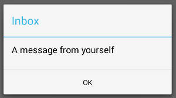
    
    If there aren't any messages in your inbox for today, try sending yourself an email!

In this task we made a **filtered** call to the Microsoft Graph to retrieve the contents of the user's Inbox which were received today.

Filtering with the Microsoft Graph SDK is done using OData filter expressions. See [the API documentation][docs-mail-contacts-calendar] for more information on writing these expressions.

The supported OData query parameters includes the following and more:

- **$filter** to filter for specific criteria
- **$select** to request specific properties
- **$top** to specify the number of items to return in a result set.
- **$skip** to sepcify the number of items to skip in a result set.
- **$expand** to specify relationships to expand and include in the response.

You can see [here](http://graph.microsoft.io/en-us/docs/overview/query_parameters "Optional OData query parameters") for more OData query parameters.

By default, a request for Messages or ChildFolders returns ten entries (up to a maximum of 50). Use `$top` to override this. You can also use `$top` and `$skip` for paging results.

```java
// Retrieve the first page of 10 results
int pageSize = 10, pageIndex = 0;

IMessageCollectionRequest messagesRequest = mailFolderRequestBuilder.
	    getMessages().
	    buildRequest(Arrays.asList(new Option[]{new QueryOption("$top", String.valueOf(pageSize)),
			 new QueryOption("$skip", String.valueOf(pageSize * pageIndex))})).
		get();
```

### Task 3 - Enumerating folders

In this task we will enumerate the user's top-level Folders. The technique used is identical to that for enumerating Messages.

01. Open the MainActivity layout file found at `app/src/main/res/layout/activity_main.xml`.

02. Add the following element to `LinearLayout` element of `activity_main.xml`:

    ```xml
    <Button
        android:id="@+id/retrieve_folders_button"
        android:layout_width="match_parent"
        android:layout_height="wrap_content"
        android:text="Retrieve Folders" />
    ```

03. Return to the `MainActivity` class, and add the following code to the `onCreate` method:

    ```java
    findViewById(R.id.retrieve_folders_button).setOnClickListener(
        new View.OnClickListener() {
            @Override
            public void onClick(View view) {
                startRetrieveFolders();
            }
        }
    );
    ```

04. Add the following method to the `MainActivity` class. 

    ```java
    private void startRetrieveFolders() {

        //Show a "work-in-progress" dialog
        final ProgressDialog progress = ProgressDialog.show(
                this, "Working", "Retrieving Folders"
        );

        //Retrieve the top-level folders
        graphServiceClient.getMe().
                getMailFolders().
                buildRequest().
                get(new ICallback<IMailFolderCollectionPage>() {
                    @Override
                    public void success(IMailFolderCollectionPage mailFoldersPage) {
                        //Transform the results into a collection of strings
                        List<MailFolder> mailFolders = mailFoldersPage.getCurrentPage();
                        final String[] items = new String[mailFolders.size()];
                        for (int i = 0; i < mailFolders.size(); i++) {
                            items[i] = mailFolders.get(i).displayName;
                        }
                        //Launch a dialog to show the results to the user
                        runOnUiThread(new Runnable() {
                            @Override
                            public void run() {
                                progress.dismiss();
                                new AlertDialog.Builder(MainActivity.this)
                                        .setTitle("Folders")
                                        .setPositiveButton("OK", null)
                                        .setItems(items, null)
                                        .show();
                            }
                        });
                    }

                    @Override
                    public void failure(final ClientException ex) {
                        runOnUiThread(new ErrorHandler(progress, ex));
                    }
                });
    }
    ```

05. Launch the app in the debugger with **Run > Debug App**. Sign in with a user from your Office 365 Tenant, and click "Retrieve Folders"

    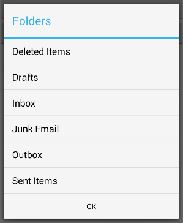

The interesting code in the `startRetrieveFolders` function is the following snippet:

```java
//Retrieve the top-level folders
graphServiceClient.getMe().
        getMailFolders().
        buildRequest().
        get(<callback>);
```

We could add filtering and paging like this:

```java
//Retrieve the top-level folders which have child folders
int pageSize = 10, pageIndex = 0;
graphServiceClient.getMe().
        getMailFolders().
        buildRequest(Arrays.asList(new Option[]{
				new QueryOption("$filter", "childFolderCount gt 0"),
				new QueryOption("$top", String.valueOf(pageSize)),
			 	new QueryOption("$skip", String.valueOf(pageSize * pageIndex))})).
        get(<callback>);
```

As you can see here, the pattern for querying for folders is identical to the pattern for querying for messages. This holds true for all other entities available through the Microsoft Graph API:

-   Calendars
-   CalendarGroups
-   Contacts
-   ContactFolders
-   Events
-   Attachments
-   Users

See [the API documentation](https://graph.microsoft.io/en-us/docs) for more information.

### Task 4 - Sending messages

This task will step you through sending a message through the Microsoft Graph.

01. Again, open the MainActivity layout file found at `app/src/main/res/layout/activity_main.xml`.

02. Add the following element to `LinearLayout` element of `activity_main.xml`:

    ```xml
    <Button
        android:id="@+id/send_message_button"
        android:layout_width="match_parent"
        android:layout_height="wrap_content"
        android:text="Send a Message" />
    ```

03. Return to the `MainActivity` class, and add the following code to the `onCreate` method:

    ```java
    findViewById(R.id.send_message_button).setOnClickListener(
        new View.OnClickListener() {
            @Override
            public void onClick(View view) {
                startSendMessage();
            }
        }
    );
    ```

04. Add the following method to the `MainActivity` class. 

    ```java
    private void startSendMessage() {

        //Show a "work-in-progress" dialog
        final ProgressDialog progress = ProgressDialog.show(
                this, "Working", "Sending a Message"
        );

        graphServiceClient.
                getMe().
                buildRequest().
                get(new ICallback<User>() {
                    @Override
                    public void success(User user) {
                        //Create an example message
                        ItemBody body = new ItemBody();
                        body.contentType = BodyType.text;
                        body.content = "This is a message body";

                        EmailAddress recipientAddress = new EmailAddress();
                        recipientAddress.address = user.mail;
                        recipientAddress.name = user.displayName;

                        Recipient recipient = new Recipient();
                        recipient.emailAddress = recipientAddress;

                        Message message = new Message();
                        message.toRecipients = (Arrays.asList(recipient));
                        message.subject = "This is a test message";
                        message.body = body;

                        //Send the message through the API
        				boolean saveToSentItems = true;
                        graphServiceClient.getMe().
                                getSendMail(message, saveToSentItems).
                                buildRequest().
                                post(new ICallback<Void>() {
                                    @Override
                                    public void success(Void aVoid) {
                                        runOnUiThread(new Runnable() {
                                            @Override
                                            public void run() {
                                                progress.dismiss();
                                                new AlertDialog.Builder(MainActivity.this)
                                                        .setTitle("Success")
                                                        .setMessage("The message was sent")
                                                        .setPositiveButton("OK", null)
                                                        .show();
                                            }
                                        });
                                    }

                                    @Override
                                    public void failure(final ClientException ex) {
                                        runOnUiThread(new ErrorHandler(progress, ex));
                                    }
                                });
                    }

                    @Override
                    public void failure(ClientException ex) {
                        runOnUiThread(new ErrorHandler(progress, ex));
                    }
                });
    }
    ```

06. Launch the app in the debugger with **Run > Debug App**. Sign in and click "Send a Message"

    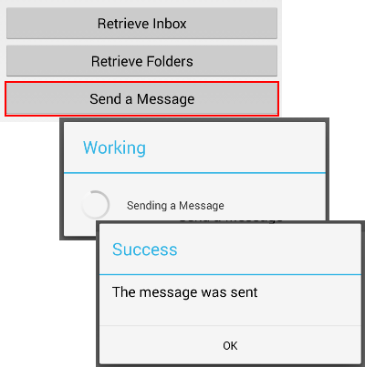

07. You can then click "Retrieve Inbox" to see the new message in your Inbox.

In this task we built and sent an email message. Let's take a look at the 
interesting bits of the code:

```java
//Create an example message
ItemBody body = new ItemBody();
body.contentType = BodyType.text;
body.content = "This is a message body";

EmailAddress recipientAddress = new EmailAddress();
recipientAddress.address = user.mail;
recipientAddress.name = user.displayName;

Recipient recipient = new Recipient();
recipient.emailAddress = recipientAddress;

Message message = new Message();
message.toRecipients = (Arrays.asList(recipient));
message.subject = "This is a test message";
message.body = body;
```

This block of code is building the actual email Message. Here we can also add attachments, add CC and BCC recipients, etc. We can also set an HTML message body, instead of just text.

```java
//Send the message through the API
graphServiceClient.getMe().
        getSendMail(message, true).
        buildRequest().
        post(<callback>);

```

This call sends the actual message to the API. As usual, the call is asynchronous and the `<callback>` will be called when it completes.

The `saveToSentItems` flag controls whether the message will be automatically saved to the user's "Sent Items" folder.

### Task 5 - Creating folders (and other CRUD operations)

Finally, let's take a look at a basic [CRUD operation][crud-ops] - creating a folder.

[crud-ops]: http://en.wikipedia.org/wiki/Create,_read,_update_and_delete

You can use the same pattern for any other creatable, updatable or deletable entity by the Microsoft Graph API. See [the documentation](https://graph.microsoft.io/en-us/docs) for more details.

01. Open the MainActivity layout file found at `app/src/main/res/layout/activity_main.xml`.

02. Add the following element to `LinearLayout` element of `activity_main.xml`:

    ```xml
    <Button
        android:id="@+id/create_folder_button"
        android:layout_width="match_parent"
        android:layout_height="wrap_content"
        android:text="Create a Folder" />
    ```

03. Return to the `MainActivity` class, and add the following code to the `onCreate` method:

    ```java
    findViewById(R.id.create_folder_button).setOnClickListener(
        new View.OnClickListener() {
            @Override
            public void onClick(View view) {
                promptUserForFolderName();
            }
        }
    );
    ```

04. Add the following methods to the `MainActivity` class. 

    ```java
    private void promptUserForFolderName() {

        final EditText input = new EditText(this);

        //Prompt the user for a new folder name
        new AlertDialog.Builder(this)
                .setTitle("Create a Folder")
                .setMessage("Please enter a folder name")
                .setView(input)
                .setPositiveButton("OK", new DialogInterface.OnClickListener() {
                    @Override
                    public void onClick(DialogInterface dialogInterface, int i) {
                        String newFolderName = input.getText().toString();
                        startCreateFolder(newFolderName);
                    }
                })
                .setNegativeButton("Cancel", null)
                .show();

    }

    private void startCreateFolder(final String newFolderName) {

        //Show a "work-in-progress" dialog
        final ProgressDialog progress = ProgressDialog.show(
                this, "Working", "Creating Folder"
        );

        //Create the folder via the API
        graphServiceClient.
                getMe().
                getMailFolders().
                buildRequest(Arrays.asList(new Option[]{new QueryOption("$filter", "displayName eq 'Inbox'")})).
                get(new ICallback<IMailFolderCollectionPage>() {
                        @Override
                        public void success(IMailFolderCollectionPage foldersPage) {
                            List< MailFolder > mailFolders = foldersPage.getCurrentPage();
                            if (mailFolders.size() == 1) {
                                String inboxId = mailFolders.get(0).id;
                                final MailFolder newFolder = new MailFolder();
                                newFolder.displayName = newFolderName;

                                graphServiceClient.
                                        getMe().
                                        getMailFolders(inboxId).
                                        getChildFolders().
                                        buildRequest().
                                        post(newFolder, new ICallback<MailFolder>() {
                                            @Override
                                            public void success(final MailFolder mailFolder) {
                                                runOnUiThread(new Runnable() {
                                                    @Override
                                                    public void run() {
                                                        progress.dismiss();
                                                        new AlertDialog.Builder(MainActivity.this)
                                                                .setTitle("Success")
                                                                .setMessage("Created folder " + mailFolder.displayName)
                                                                .setPositiveButton("OK", null)
                                                                .show();
                                                    }
                                                });
                                            }

                                            @Override
                                            public void failure(ClientException ex) {
                                                runOnUiThread(new ErrorHandler(progress, ex));
                                            }
                                        });
                            }
                        }

                        @Override
                        public void failure(ClientException ex) {
                            runOnUiThread(new ErrorHandler(progress, ex));
                        }
                    });
    }
    ```

05. Launch the app in the debugger with **Run > Debug App**. Sign in and click "Create a Folder"

06. Enter a new folder name and click "OK".

    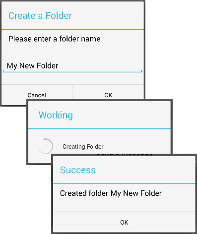

In this task we created a new folder within the user's Inbox. There are two methods at work in the code above. The first method (`promptUserForFolderName()`) is just Android boilerplate to prompt the user for a new folder name.

The second method (`startCreateFolder()`) does the actual work, and has the following interesting snippet:

```java
String inboxId = mailFolders.get(0).id;
final MailFolder newFolder = new MailFolder();
newFolder.displayName = newFolderName;

graphServiceClient.
        getMe().
        getMailFolders(inboxId ).
        getChildFolders().
        buildRequest().
        post(newFolder, <callback>);
```

Here we are creating a new folder model, then sending it to the API.

## Conclusion

By completing this hands-on lab you have learned:

1. How to add the Microsoft Graph SDK to an Android project
2. How to query for Messages
3. How to query for Mail Folders
4. How to send new Messages
5. How to create a new Folder

As an exercise, try using Android Studio's built-in auto completion functionality to explore the `GraphServiceClient` object and implement other functionality like:

-   Creating a message in the user's Drafts folder. *Hint - try just saving the    message, rather than sending it.*

-   Enumerating the user's Calendars and Events. You can also create, update and delete them. *E.g.*

    ```java
    graphServiceClient.getMe().getCalendar() //...
    ```

-   Enumerating the user's Contacts and Contact Folders. You can also create, update and delete them. *E.g.*

    ```java
    graphServiceClient.getMe().getContacts() //...
    ```