Calling the Microsoft Graph API for OneDrive for Business
==============================================

## Overview

OneDrive for Business is a feature of Office 365. It exposes a RESTful HTTP API which we can consume using the Microsoft Graph SDK for Android.

## Objectives

-   Learn how to communicate with OneDrive for Business using the **Microsoft Graph SDK for Android**

## Prerequisites

-   [Git version control tool][git-scm]
-   [Android Studio][android-studio]
-   Android API Level 23 installed [using the Android SDK Manager][sdk-manager]
-   Complete the [\\\O3654\O3654-4 Android\01 AAD Prereqs](../01 AAD Prereqs) module.
-   Complete the [\\\O3654\O3654-4 Android\02 ADAL](../02 ADAL) module.

[git-scm]: http://git-scm.com
[android-studio]: http://developer.android.com/sdk/installing/studio.html
[sdk-manager]: http://developer.android.com/tools/help/sdk-manager.html

## Exercises

The hands-on lab includes the following exercises:

-   [**Exercise 1**](#exercise1) Prepare the Android test application and add the Microsoft Graph SDK for Android
-   [**Exercise 2**](#exercise2) Enumerating Files and Folders
-   [**Exercise 3**](#exercise3) Creating Files and Folders


<a name="exercise1"></a>
## Exercise 1: Prepare the Android test application

In this exercise we will add the Microsoft Graph SDK for Android to the included "O365 Test App".

### Task 1 - Preparing the test app

In this task we'll get the test application up and running.

01. Make a copy of the Android lab test app template, found in the 
    [O365TemplateApp\src](O365TemplateApp/src) directory.

    Name this copy "OneDriveApp". E.g. in PowerShell

    ```powershell
    PS C:\> $lab_dir = ".\path\to\the\lab"
    PS C:\> $work_dir = ".\path\to\your\projects\dir"
    PS C:\> cp -Recurse "$lab_dir\O365TemplateApp\src\" "$work_dir\OneDriveApp"
    ```

02. Launch Android Studio

03. From the **File** menu, select **Import Project**.

    > **Note:** If this is your first time launching Android Studio, you may
    select **Import Project** from the Android Studio launcher.

04. Find and select the **OneDriveApp** folder.
    
05. Click **OK** to import the project.

    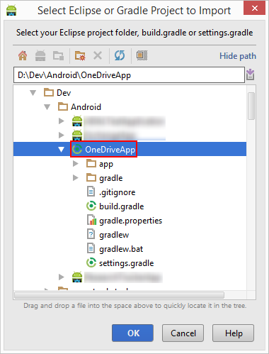

    Wait for Android Studio to finish importing the test project

06. Open the `app/src/main/res/values/strings.xml` resource file.

	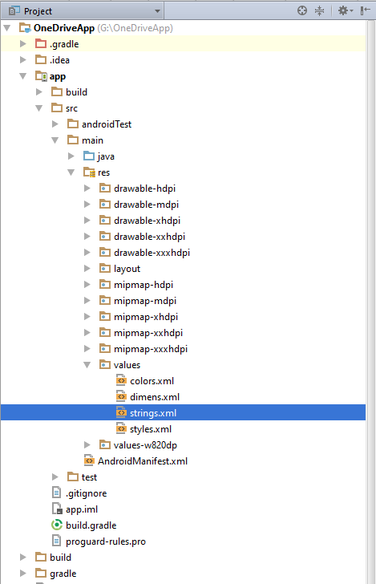

07. Find the string resource named **app_name**, and change it to **O365 OneDrive Test App**.

    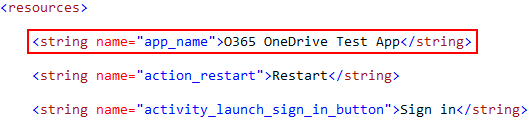
    
    This resource is used in a number of places, including as the App's name in the Launcher.

08. Open the `app/src/main/java/Constants.java` class.

    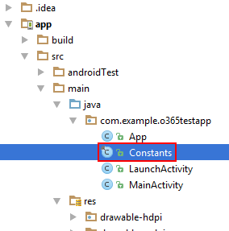

09. This class hosts a number of static constants which we must update.
    
    -   **RESOURCE:** Set this to "https://graph.microsoft.com/"

    -   **CLIENT_ID:** Set to the Client ID obtained in the Prerequisites module

    -   **REDIRECT_URI:** Set to the Redirect URI configured in AD in the Prerequisites module

10. Finally, let's test out the app and your changes. 
    Start up the application in the Emulator with **Run > Debug App**.

    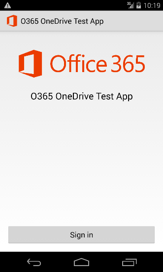

11. Tap the **Sign in** button. Sign in using credentials for a user in your Office 365 Tenant. If successful, the blank `MainActivity` will be launched.

In this task you have created and configured the Office 365 Test App - this will serve as the base on which you will build out the rest of the lab.

### Task 2 - Add the Microsoft Graph SDK to the app

In this task you will add the **Microsoft Graph SDK** to the app and then configure it.

01. Open the `app/build.gradle` file.

    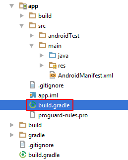

02. Find the `dependencies` section. Currently it has a reference to the ADAL.

03. Add the following block of code to the `dependencies` section:

    ```groovy
    // Base OData stuff
    compile 'com.microsoft.services:odata-engine-core:0.11.0'
    compile 'com.microsoft.services:odata-engine-android-impl:0.11.0@aar'

    // MSGraph SDK
    compile 'com.microsoft.graph:msgraph-sdk-android:0.9.2'

    // MSGraph SDK Android MSA Auth for Android Adapter
    compile 'com.microsoft.graph:msa-auth-for-android-adapter:0.9.0'
    ```

    E.g.
    
    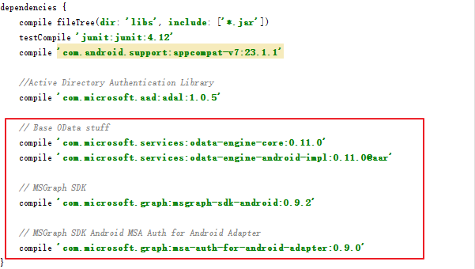

04. Click **Sync Now**.
    
    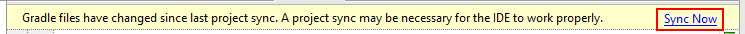

05. Open the `MainActivity` class. It can be found under `app/src/main/java`.

06. Make sure you import the following classes.

	```java
	import android.app.Activity;
	import android.app.AlertDialog;
	import android.app.ProgressDialog;
	import android.content.DialogInterface;
	import android.graphics.Bitmap;
	import android.graphics.BitmapFactory;
	import android.os.Bundle;
	import android.view.View;
	import android.widget.EditText;
	import android.widget.ImageView;
	import android.widget.TextView;
	
	import java.io.BufferedReader;
	import java.io.IOException;
	import java.io.InputStream;
	import java.io.InputStreamReader;
	import java.io.UnsupportedEncodingException;
	import java.util.List;
	
	import com.microsoft.graph.concurrency.ICallback;
	import com.microsoft.graph.extensions.DriveItem;
	import com.microsoft.graph.extensions.File;
	import com.microsoft.graph.extensions.Folder;
	import com.microsoft.graph.extensions.GraphServiceClient;;
	import com.microsoft.graph.extensions.IDriveItemCollectionPage;
	import com.microsoft.graph.extensions.IDriveItemCollectionRequest;
	import com.microsoft.graph.extensions.IGraphServiceClient;
	import com.microsoft.graph.core.ClientException;
	import com.microsoft.graph.core.IClientConfig;
	import com.microsoft.graph.core.DefaultClientConfig;
	import com.microsoft.graph.authentication.MSAAuthAndroidAdapter;
	import com.microsoft.graph.authentication.IAuthenticationAdapter;
	import com.microsoft.graph.http.IHttpRequest;
	import com.microsoft.graph.options.HeaderOption;
	``` 

07. Add the following member fields to the top of the class:

    ```java
    private IGraphServiceClient graphServiceClient;
    ```

08. Add the following code to the end of the `onCreate` function.

    ```java
    final IAuthenticationAdapter authenticationAdapter = new MSAAuthAndroidAdapter(getApplication()) {
        @Override
        public String getClientId() {
            return Constants.CLIENT_ID;
        }

        @Override
        public String[] getScopes() {
            return new String[] {
                    "https://graph.microsoft.com/File.ReadWrite",
                    "offline_access",
                    "openid"
            };
        }
        @Override
        public void authenticateRequest(final IHttpRequest request) {
            for (final HeaderOption option : request.getHeaders()) {
                if (option.getName().equals(AUTHORIZATION_HEADER_NAME)) {
                    return;
                }
            }
            if (mAccessToken != null && mAccessToken.length() > 0){
                request.addHeader(AUTHORIZATION_HEADER_NAME, OAUTH_BEARER_PREFIX + mAccessToken);
                return;
            }
            super.authenticateRequest(request);
        }
    };
    final IClientConfig mClientConfig = DefaultClientConfig.createWithAuthenticationProvider(authenticationAdapter);
    graphServiceClient  = new GraphServiceClient
            .Builder()
            .fromConfig(mClientConfig)
            .buildClient();
    ```

    >**Note:** The variable `mAccessToken` is obtained by `LaunchActivity` using the Active Directory Authentication Library.

<a name="exercise2"></a>
## Exercise 2: Enumerating Files and Folders

In this exercise we will take a look at enumerating Files and Folders.

### Task 1 - Basic enumeration

01. Open the MainActivity layout file found at `app/src/main/res/layout/activity_main.xml`.

    This layout file contains an empty `LinearLayout` view, configured to stack its child views vertically.

02. Add the following element to `LinearLayout` element of `activity_main.xml`:

    ```xml
    <Button
        android:id="@+id/retrieve_files_button"
        android:layout_width="match_parent"
        android:layout_height="wrap_content"
        android:text="Retrieve Files" />
    ```

03. Return to the `MainActivity` class, and add the following code to the `onCreate` function:

    ```java
    findViewById(R.id.retrieve_files_button).setOnClickListener(
        new View.OnClickListener() {
            @Override
            public void onClick(View view) {
                startRetrieveFiles(null);
            }
        }
    );
    ```

04. Add the following functions to the `MainActivity` class.

    ```java
    private class ErrorHandler implements Runnable {
        private ProgressDialog progress;
        private Throwable throwable;
        ErrorHandler(ProgressDialog progress, Throwable throwable) {
            this.progress = progress;
            this.throwable = throwable;
        }
        public void run() {
            progress.dismiss();
            showErrorDialog(throwable);
        }
    }

    private void showErrorDialog(Throwable t) {
        new AlertDialog.Builder(this)
                .setTitle("Whoops!")
                .setMessage(t.toString())
                .setPositiveButton("OK", null)
                .show();
    }

    private void startRetrieveFiles(final DriveItem folder) {

        //Show a "work-in-progress" dialog
        final ProgressDialog progress = ProgressDialog.show(
                this, "Working", "Retrieving Files"
        );

        IDriveItemCollectionRequest itemsRequest = null;
        if (folder == null) {
            //Get the files in the root folder
            itemsRequest = graphServiceClient.
                    getMe().
                    getDrive().
                    getRoot().
                    getChildren().
                    buildRequest();
        }
        else {
            //Get the files in this folder
            itemsRequest = graphServiceClient.
                    getMe().
                    getDrive().
                    getItems(folder.id).
                    getChildren().
                    buildRequest();
        }

        itemsRequest.get(new ICallback<IDriveItemCollectionPage>() {
            @Override
            public void success(IDriveItemCollectionPage driveItemsPage) {
                final List<DriveItem> driveItems = driveItemsPage.getCurrentPage();
                //Transform the results into a collection of strings
                final String[] items = new String[driveItems.size()];
                for (int i = 0; i < driveItems.size(); i++) {
                    DriveItem item = driveItems.get(i);
                    items[i] = "(" + (item.folder != null ? "Folder" : "File") + ") " + item.name;
                }
                //Launch a dialog to show the results to the user
                runOnUiThread(new Runnable() {
                    @Override
                    public void run() {
                        progress.dismiss();
                        new AlertDialog.Builder(MainActivity.this)
                                .setTitle("Files")
                                .setItems(items, new DialogInterface.OnClickListener() {
                                    @Override
                                    public void onClick(DialogInterface dialogInterface, int i) {
                                        //The user picked a file - figure out if it is a file or folder
                                        DriveItem item = driveItems.get(i);
                                        if (item.folder == null) {
                                            //download the file contents
                                            //TODO: startDownloadFile(item);
                                        } else {
                                            //download the child files
                                            startRetrieveFiles(item);
                                        }
                                    }
                                })
                                .setPositiveButton("OK", null)
                                .show();
                    }
                });
            }

            @Override
            public void failure(ClientException ex) {
                runOnUiThread(new ErrorHandler(progress, ex));
            }
        });
    }
    ```

05. Launch the app in the debugger with **Run > Debug App**. Sign in with a user from your Office 365 Tenant, and click **Retrieve Files**.

    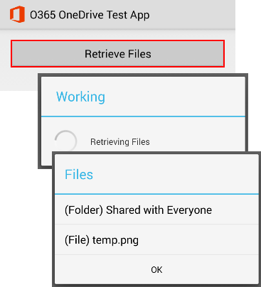

06. Here's a list of the Files and Folders in the user's root OneDrive folder.

    Try clicking on a "(Folder)" in the list - the code will then enumerate the contents of that Folder.

In this task we will call the Microsoft Graph APIs to enumerate the User's Files and Folders. There is a lot of boilerplate code here, so let's take a look at the interesting parts:

First we have to note that the function `startRetrieveFiles()` has two functions:

- Enumerate the files in the root folder (pass the argument `null`)
- Enumerate the files in the given folder (pass an instance of `DriveItem`)

```java
//Get the files in the root folder
itemsRequest = graphServiceClient.
        getMe().
        getDrive().
        getRoot().
        getChildren().
        buildRequest();
```

Here we are using `getChildren()` to enumerate the files and folders in the **root** folder.

```java
//Get the files in this folder
itemsRequest = graphServiceClient.
	    getMe().
	    getDrive().
	    getItems(folder.id).
	    getChildren().
	    buildRequest();
```

Here we are using `getItems()` to retrieve a single item from by its Id. In this case the item is a folder, so we use `getChildren()` to enumerate the items in that folder.

The `buildRequest()` function creates a query request, which is used to execute the query.

We starts the query asynchronously with a `<callback>`, which is a handle to the eventual result(**Success** or **Failure**) of the API call.

```java
itemsRequest.get(new ICallback<IDriveItemCollectionPage>() {
    @Override
    public void onSuccess(List<DriveItem> result) {
            //Handle success (e.g. 200, 201)
    }
    @Override
    public void onFailure(Throwable t) {
            //Handle failure (e.g. 404, 500)
        }
});
```

> **Note:** The callback will be executed on a background thread. If your code needs to update the User Interface (e.g. update a view or print a warning), then you must dispatch a **Runnable** back to the UI thread using Activity.runOnUiThread`:

```java    
runOnUiThread(new Runnable() {
    @Override
    public void run() {
        //this code runs on the UI thread
    }
});
```

Alternatively, we could use the `get()` function on the **Future** object. This will block the thread until the underlying API call completes and the result is returned. 

```java
try {
    graphServiceClient.
        getMe().
        getDrive().
        getRoot().
        getChildren().
        buildRequest().
		get();
}
catch (ClientException e) {
    //handle error
}
```

> **Warning: do not do this on the UI thread!** You could use an `AsyncTask` to run this code on a background thread.

Finally, take note of this block of code in the middle of the function which looks something like this:

```java
DriveItem item = driveItems.get(i);
if (item.getFolder() == null) {
    //process the item as a File
	//TODO: startDownloadFile(item);
}
else {
    //process the item as a Folder
	startRetrieveFiles(item);
}
```

Here we inspect the type of the `Item` and try to determine how to handle it. If the user selects a Folder, we enumerate its contents.

### Task 2 - Getting the contents of a file

In this task we'll go through the steps required to download a file.

01. Return to the `MainActivity` class and find the following line:
    
    ```java
    //TODO: startDownloadFile(item);
    ```

    Replace it with the following:

    ```java
    startDownloadFile(item);
    ```

02. Next, add the following functions to the `MainActivity` class:
    
    ```java
    private void startDownloadFile(final DriveItem file) {
        //Show a "work-in-progress" dialog
        final ProgressDialog progress = ProgressDialog.show(
                this, "Working", "Retrieving File Contents"
        );
        new Thread() {
            @Override
            public void run() {
                try {
                    //Get the contents of the file
                    InputStream stream = graphServiceClient.
                            getMe().
                            getDrive().
                            getItems(file.id).
                            getContent().
                            buildRequest().
                            get();
                    final View view = getFileView(stream);

                    //Launch a dialog to show the results to the user
                    runOnUiThread(new Runnable() {
                        @Override
                        public void run() {
                            progress.dismiss();
                            new AlertDialog.Builder(MainActivity.this)
                                    .setTitle("File Contents")
                                    .setView(view)
                                    .setPositiveButton("OK", null)
                                    .show();
                        }
                    });
                }
                catch (final Throwable t){
                    runOnUiThread(new ErrorHandler(progress, t));
                }
            }}.start();
    }

    private View getFileView(InputStream result) {
        Bitmap bitmap = BitmapFactory.decodeStream(result);

        if (bitmap != null) {
            ImageView imageView = new ImageView(this);
            imageView.setImageBitmap(bitmap);
            return imageView;
        }

        String utf8String = null;
        try {
            utf8String = getStringFromInputStream(result);
        }
        catch (Exception e) {
            e.printStackTrace();
        }

        TextView textView = new TextView(this);
        textView.setText(utf8String);

        return textView;
    }

    private static String getStringFromInputStream(InputStream is) {
        BufferedReader br = null;
        StringBuilder sb = new StringBuilder();

        String line;
        try {

            br = new BufferedReader(new InputStreamReader(is));
            while ((line = br.readLine()) != null) {
                sb.append(line);
            }

        } catch (IOException e) {
            e.printStackTrace();
        } finally {
            if (br != null) {
                try {
                    br.close();
                } catch (IOException e) {
                    e.printStackTrace();
                }
            }
        }

        return sb.toString();

    }
    ```

    These three functions download and attempt to render a user-selected file.

05. Launch the app in the debugger with **Run > Debug App**. Sign in with a user from your Office 365 Tenant, and click **Retrieve Files**.

06. Pick a file from the list.

    

07. Here I picked an image file, and the app has successfully downloaded and rendered it:

    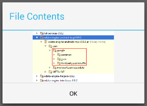

The interesting piece of code is the following statement:

```java
//Get the contents of the file
InputStream stream = graphServiceClient.
        getMe().
        getDrive().
        getItems(file.id).
        getContent().
        buildRequest().
        get();
```

Here we are navigating the API in the same manner as before, using `getItems()` to get a reference to the file.

Next, we use `getContent()` to build a query request to retrieve the actual contents of the file. Executing the query request will retrieve an **InputStream**.

<a name="exercise3"></a>
## Exercise 3: Creating Files and Folders

In this exercise we will take a look at creating Files and Folders and uploading
content.

### Task 1 - Creating a Folder

01. Open the the MainActivity layout file found at `app/src/main/res/layout/activity_main.xml`.

02. Add the the following element to `LinearLayout` element of `activity_main.xml`:

    ```xml
    <Button
        android:id="@+id/create_folder_button"
        android:layout_width="match_parent"
        android:layout_height="wrap_content"
        android:text="Create a Folder" />
    ```

03. Return to the `MainActivity` class, and add the following code to the `onCreate` function:

    ```java
    findViewById(R.id.create_folder_button).setOnClickListener(
        new View.OnClickListener() {
            @Override
            public void onClick(View view) {
                showCreateFolderDialog();
            }
        }
    );
    ```

04. Add the following functions to the `MainActivity` class.
    
    ```java
    private void showCreateFolderDialog() {
        final EditText input = new EditText(this);

        //Prompt the user for a new folder name
        new AlertDialog.Builder(this)
                .setTitle("Create a Folder")
                .setMessage("Please enter a folder name")
                .setView(input)
                .setPositiveButton("OK", new DialogInterface.OnClickListener() {
                    @Override
                    public void onClick(DialogInterface dialogInterface, int i) {
                        String newFolderName = input.getText().toString();
                        startCreateFolder(newFolderName);
                    }
                })
                .setNegativeButton("Cancel", null)
                .show();
    }

    private void startCreateFolder(String newFolderName) {
        //Show a "work-in-progress" dialog
        final ProgressDialog progress = ProgressDialog.show(
                this, "Working", "Creating Folder"
        );

        //Create a new folder entity
        DriveItem  item = new DriveItem();
        Folder folder = new Folder();
        item.folder = folder;
        item.name = newFolderName;

        //Create the folder via the API
        graphServiceClient.
                getMe().
                getDrive().
                getRoot().
                getChildren().
                buildRequest().
                post(item, new ICallback<DriveItem>() {
                    @Override
                    public void success(final DriveItem driveItem) {
                        runOnUiThread(new Runnable() {
                            @Override
                            public void run() {
                                progress.dismiss();
                                new AlertDialog.Builder(MainActivity.this)
                                        .setTitle("Success")
                                        .setMessage("Created folder " + driveItem.name)
                                        .setPositiveButton("OK", null)
                                        .show();
                            }
                        });
                    }

                    @Override
                    public void failure(final ClientException ex) {
                        runOnUiThread(new Runnable() {
                            @Override
                            public void run() {
                                progress.dismiss();
                                showErrorDialog(ex);
                            }
                        });
                    }
                });
    }
    ```

05. Launch the app in the debugger with **Run > Debug App**. Sign in with a user from your Office 365 Tenant, and click **Create a Folder**.

06. Fill out the dialog and click **OK**.

    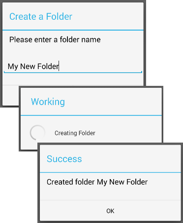

These functions prompt the user for a Folder name, and then create a folder through the Microsoft Graph.

```java
//Create a new folder entity
DriveItem  item = new DriveItem();
Folder folder = new Folder();
item.folder = folder;
item.name = newFolderName;

//Create the folder via the API
graphServiceClient.
        getMe().
        getDrive().
        getRoot().
        getChildren().
        buildRequest().
        post(item, <callback>); 
```

The code creates a simple `Folder` model, and then adds it to the `root` folder. We post the request by the API asynchronously with a `<callback>` which will handle the **success** or **failure** of the call.

### Task 2 - Creating a File

01. Open the MainActivity layout file found at `app/src/main/res/layout/activity_main.xml`.

02. Add the following element to `LinearLayout` element of `activity_main.xml`:

    ```xml
    <Button
        android:id="@+id/create_file_button"
        android:layout_width="match_parent"
        android:layout_height="wrap_content"
        android:text="Create a File" />
    ```

03. Return to the `MainActivity` class, and add the following code to the `onCreate` function:

    ```java
    findViewById(R.id.create_file_button).setOnClickListener(
        new View.OnClickListener() {
            @Override
            public void onClick(View view) {
                showCreateFileDialog();
            }
        }
    );
    ```

04. Add the following functions to the `MainActivity` class.
    
    ```java
    private void showCreateFileDialog() {

        final EditText input = new EditText(this);

        //Prompt the user for a new folder name
        new AlertDialog.Builder(this)
                .setTitle("Create a File")
                .setMessage("Please enter a file name")
                .setView(input)
                .setPositiveButton("OK", new DialogInterface.OnClickListener() {
                    @Override
                    public void onClick(DialogInterface dialogInterface, int i) {
                        String newFileName = input.getText().toString();
                        startCreateFile(newFileName);
                    }
                })
                .setNegativeButton("Cancel", null)
                .show();
    }

    private void startCreateFile(String newFileName) {

        //Show a "work-in-progress" dialog
        final ProgressDialog progress = ProgressDialog.show(
                this, "Working", "Creating File"
        );

        DriveItem item = new DriveItem();
        File file = new File();
        item.file = file;
        item.name = newFileName;

        //Create the file via the API
        graphServiceClient.
                getMe().
                getDrive().
                getRoot().
                getChildren().
                buildRequest().
                post(item, new ICallback<DriveItem>() {
                    @Override
                    public void success(final DriveItem driveItem) {
                        runOnUiThread(new Runnable() {
                            @Override
                            public void run() {
                                progress.dismiss();
                                uploadFileContent(driveItem);
                            }
                        });
                    }

                    @Override
                    public void failure(final ClientException ex) {
                        runOnUiThread(new Runnable() {
                            @Override
                            public void run() {
                                progress.dismiss();
                                showErrorDialog(ex);
                            }
                        });
                    }
                });
    }

    private void uploadFileContent(final DriveItem file) {

        //Show a "work-in-progress" dialog
        final ProgressDialog progress = ProgressDialog.show(
                this, "Working", "Uploading Data"
        );

        //Upload some file content
        String content = "This is some file content!";

        byte[] bytes = new byte[0];
        try {
            bytes = content.getBytes("UTF-8");
        }
        catch (UnsupportedEncodingException e) {
            e.printStackTrace();
        }

        //Upload the file content
        graphServiceClient.
                getMe().
                getDrive().
                getItems(file.id).
                getContent().
                buildRequest().
                put(bytes, new ICallback<DriveItem>() {
                    @Override
                    public void success(DriveItem driveItem) {
                        runOnUiThread(new Runnable() {
                            @Override
                            public void run() {
                                runOnUiThread(new Runnable() {
                                    @Override
                                    public void run() {
                                        progress.dismiss();
                                        new AlertDialog.Builder(MainActivity.this)
                                                .setTitle("Success")
                                                .setMessage("Created file " + file.name)
                                                .setPositiveButton("OK", null)
                                                .show();
                                    }
                                });
                            }
                        });
                    }

                    @Override
                    public void failure(final ClientException ex) {
                        runOnUiThread(new Runnable() {
                            @Override
                            public void run() {
                                progress.dismiss();
                                showErrorDialog(ex);
                            }
                        });
                    }
                });
    }
    ```

05. Launch the app in the debugger with **Run > Debug App**. Sign in with a user from your Office 365 Tenant, and click **Create a File**.

06. Fill out the dialog and click **OK**.

    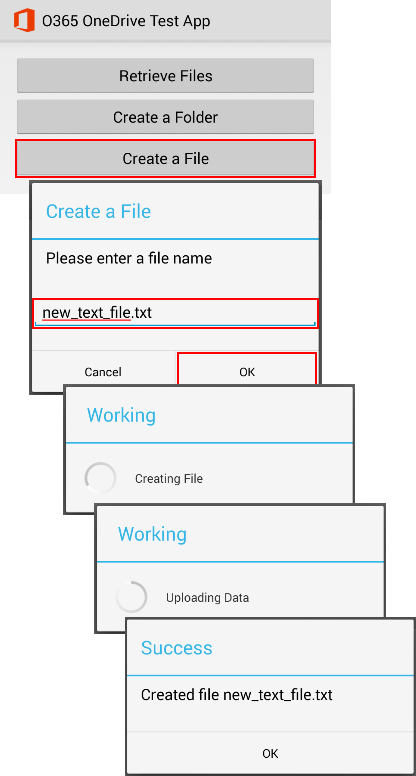

These functions prompt the user for a File name, and then create a folder through the API for OneDrive. Finally, they upload some UTF-8 encoded data.

```java
//Create a new file entity
DriveItem item = new DriveItem();
File file = new File();
item.setFile(file);
item.setName(newFileName);

//Create the file via the API
graphServiceClient.
	    getMe().
	    getDrive().
	    getRoot().
	    getChildren().
	    buildRequest().
	    post(item, <callback>) 
```

This code creates a simple `File` model, and then adds it to the `root` folder. We post the request by the API asynchronously with a `<callback>` which will handle the **success** or **failure** of the call.

```java
String content = "This is some file content!";

byte[] bytes = content.getBytes("UTF-8");

//Upload the file content
graphServiceClient.
        getMe().
        getDrive().
        getItems(file.id).
        getContent().
        buildRequest().
        put(bytes, <callback>)
```

This code uploads new content to an existing file on the server - in this case the file we just created.

## Conclusion

By completing this hands-on lab you have learned:

1. How to add the Microsoft Graph SDK to an Android project
2. How to query for files and folders
3. How to create a new folder
4. How to create a new file

As an exercise, try using Android Studio's built-in auto complete functionality to explore the `GraphServiceClient` API and implement other functionality like:

-   Deleting a folder
-   Creating a file in a subfolder