Calling the SharePoint Lists API with iOS
=========================================

## Overview

The lab lets students use an AzureAD account to manage lists in a Office 365 
Sharepoint tenant with an iOS app.

## Objectives

- Learn how to create a client for Office 365 to manage lists and lists items
- Learn how to create, edit and delete list items within an iOS app.

## Prerequisites

- OSX 10.X environment
- [XCode 7][xcode-7]
- [Cocoapods dependency manager][cocoapods]
- Complete the  [\\\O3654\O3654-5\01 Azure AD Auth Prerequisites](../01 Azure AD Auth Prerequisites) module.

[xcode-7]: https://itunes.apple.com/nz/app/xcode/id497799835?mt=12
[cocoapods]: https://cocoapods.org

## Exercises

The hands-on lab includes the following exercises:

- [Add ADALiOS sdk library to a project](#exercise1)
- [Create a Client class for all operations](#exercise2)
- [Connect actions in the view to ProjectClient class](#exercise3)

<a name="exercise1"></a>
## Exercise 1: Add ADALiOS sdk library to a project
In this exercise you will load an existing application, and add AzureAD authentication 
to project.

### Task 1 - Open the Project

01. Clone this git repository in your machine

02. Open a Terminal and navigate to the `src/O365-Lists-App` folder of the project.

    Execute the following:

    ```bash
    pod install
    ```

03. Open the **.xcworkspace** file in the  **[\\\O3654\O3654-5\05 O365 SharePoint Lists SDK\src\O365-Lists-App](./src/O365-Lists-App)**

04. Find and Open the **Auth.plist**

05. Fill the AzureAD account settings with the following configuration values:
    
    > Note: You can find the clientId/redirectUriString in [\\\O3654\O3654-5\01 Azure AD Auth Prerequisites\hands-on-lab.md](../01 Azure AD Auth Prerequisites/hands-on-lab.md)
        
    -   **o365SharepointTenantUrl** - The URL of the SharePoint site for your tenancy, e.g. "https://mydomain.sharepoint.com/MySite"
    -   **resourceId**              - The root URL of the SharePoint site for your tenancy, e.g. "https://mydomain.sharepoint.com"
    -   **authority**               - "https://login.microsoftonline.com/common"
    -   **redirectUriString**       - The redirect URL configured in Azure AD, e.g. "http://example.com/redirect"
    -   **clientId**                - The client Id obtained from Azure AD
    
    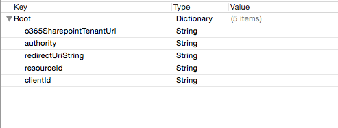

06. Build and Run the project in an iOS Simulator to check the views

    #### Application:
    You will see a login page with buttons to access the application and to clear credentials. Once authenticated, a Project list will appear with one fake entry. Also there is an add  Project screen (tapping the plus sign), and a Project Details screen (selecting a row in the table) with References that contains a Title, Comments and a Url that can be opened in Safari app. Finally we can access to the screens to manage the References.

    #### Environment:
    To manage Projects and its References, we have two lists called "Research Projects" and "Research References" in a Office365 Sharepoint tenant. Also we have permissions to add, edit and delete items from a list.

    


<a name="exercise2"></a>
## Exercise 2: Create a Client class for all operations
In this exercise you will create a client class for all the operations related to  Projects and References. This class will connect to the Office 365 SharePoint Lists REST API, and do some basic JSON processing.

### Task 1 - Create a client class to connect to the SharePoint Lists REST API 

01. On the XCode files explorer, under the group **ResearchProjectTrackerApp** you will see a **client** empty folder.

    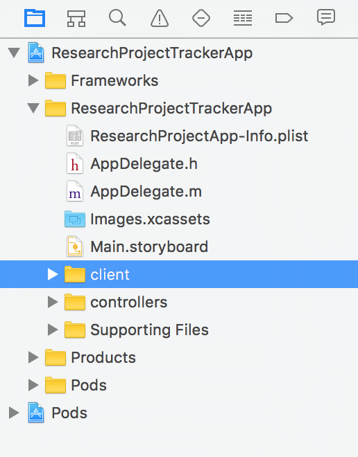

02. On the first one, make a right click in the client folder and select **New File**. You will see the **New File wizard**. Click on the **iOS** section, select **Cocoa Touch Class** and click **Next**.

    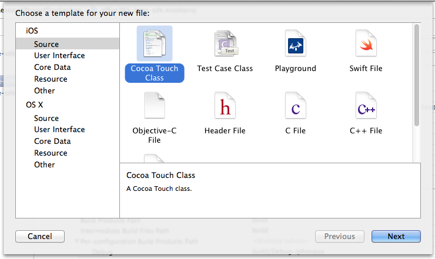

03. In this section, configure the new class giving it a name (**ProjectClient**), and make it a subclass of **NSObject**. Make sure that the language dropdown is set with **Objective-C** because our o365-lists library is written in that programming language. Finally click on **Next**.

    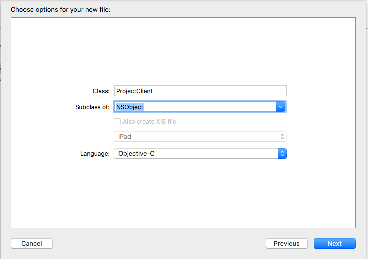    

04. Now we are going to select where the new class sources files (.h and .m) will be stored. In this case we can click on **Create** directly. This will create a **.h** and **.m** files for our new class.

    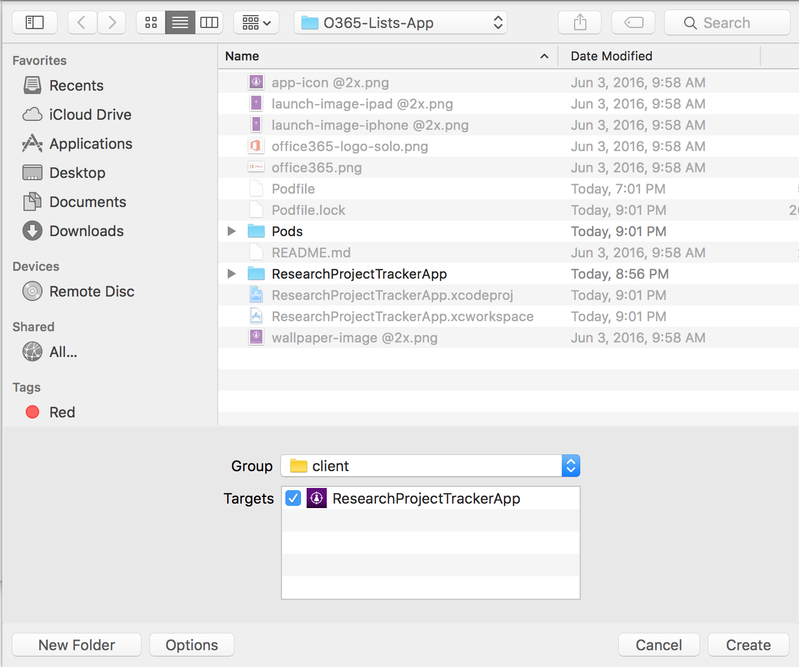

06. Now you will have a file structure like this:

    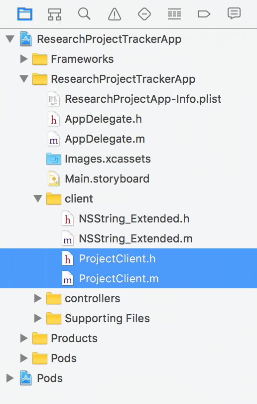

08. Build the project and check everything is OK.

### Task 2 - Add ProjectClient methods

01. Open the **ProjectClient.h** class and add the following between **@interface** and **@end**

    ```objc
    - (NSURLSessionDataTask *)addProject:(NSString *)listName token:(NSString *)token callback:(void (^)(NSError *error))callback;
    - (NSURLSessionDataTask *)updateProject:(NSDictionary *)project token:(NSString *)token callback:(void (^)(BOOL, NSError *))callback;
    - (NSURLSessionDataTask *)updateReference:(NSDictionary *)reference token:(NSString *)token callback:(void (^)(BOOL, NSError *))callback;
    - (NSURLSessionDataTask *)addReference:(NSDictionary *)reference token:(NSString *)token callback:(void (^)(NSError *))callback;
    - (NSURLSessionDataTask *)getReferencesByProjectId:(NSString *)projectId token:(NSString *)token callback:(void (^)(NSMutableArray *listItems, NSError *error))callback;
    - (NSURLSessionDataTask *)deleteListItem:(NSString *)name itemId:(NSString *)itemId token:(NSString *)token callback:(void (^)(BOOL result, NSError *error))callback;
    - (NSURLSessionDataTask *)getProjectsWithToken:(NSString *)token andCallback:(void (^)(NSMutableArray *listItems, NSError *))callback;
    ```

    Each method is responsible of retrieve data from the Office 365 tenant and parse it, or managing add, edit, delete actions.

02. Open the **ProjectClient.m** file and add the following import

    ```objc
    #import "NSString_Extended.h"
    ```

03. Add the following methods

    **Add Project**

	```objc
    const NSString * apiUrlStr = @"/_api/lists";
	- (NSURLSessionDataTask *)addProject:(NSString *)projectName token:(NSString *)token callback:(void (^)(NSError *))callback
	{
	    NSString* plistPath = [[NSBundle mainBundle] pathForResource:@"Auth" ofType:@"plist"];
	    NSDictionary *content = [NSDictionary dictionaryWithContentsOfFile:plistPath];
	    NSString* shpUrl = [content objectForKey:@"o365SharepointTenantUrl"];
	    NSString* projectListName = @"Research%20Projects";
	    NSString *url = [NSString stringWithFormat:@"%@%@/GetByTitle('%@')/Items", shpUrl , apiUrlStr, projectListName ];
	    NSString *formatedJson = [NSString stringWithFormat:@"{'Title':'%@'}", projectName];
	    NSData *jsonData = [formatedJson dataUsingEncoding: NSUTF8StringEncoding];
	    NSMutableURLRequest *theRequest=[NSMutableURLRequest requestWithURL:[NSURL URLWithString:url]];
	    [theRequest setHTTPMethod:@"POST"];
	    [theRequest setValue:@"application/json" forHTTPHeaderField:@"Content-Type"];
	    [theRequest setValue:@"application/json; odata=verbose" forHTTPHeaderField:@"accept"];
	    [theRequest addValue:[NSString stringWithFormat: @"Bearer %@", token] forHTTPHeaderField: @"Authorization"];
	    [theRequest setHTTPBody:jsonData];
	    NSURLSession *session = [NSURLSession sharedSession];
	    NSURLSessionDataTask *task = [session dataTaskWithRequest:theRequest completionHandler:^(NSData  *data, NSURLResponse *reponse, NSError *error) {
	        callback(error);
	    }];
	    return task;
	}
	```

    **Update Project**

    ```objc
    - (NSURLSessionDataTask *)updateProject:(NSDictionary *)project token:(NSString *)token callback:(void (^)(BOOL, NSError *))callback
    {
        NSString* plistPath = [[NSBundle mainBundle] pathForResource:@"Auth" ofType:@"plist"];
        NSDictionary *content = [NSDictionary dictionaryWithContentsOfFile:plistPath];
        NSString* shpUrl = [content objectForKey:@"o365SharepointTenantUrl"];
        NSString* projectListName = @"Research%20Projects";
        NSString *url = [NSString stringWithFormat:@"%@%@/GetByTitle('%@')/Items(%@)", shpUrl , apiUrlStr, projectListName, [project valueForKey:@"Id"]];
        NSString *json = [[NSString alloc] init];
        json = @"{ 'Title': '%@'}";
        NSString *formatedJson = [NSString stringWithFormat:json, [project valueForKey:@"Title"]];
        NSData *jsonData = [formatedJson dataUsingEncoding: NSUTF8StringEncoding];
        NSMutableURLRequest *theRequest=[NSMutableURLRequest requestWithURL:[NSURL URLWithString:url]];
        [theRequest setHTTPMethod:@"POST"];
        [theRequest setValue:@"application/json" forHTTPHeaderField:@"Content-Type"];
        [theRequest setValue:@"MERGE" forHTTPHeaderField:@"X-HTTP-Method"];
        [theRequest setValue:@"*" forHTTPHeaderField:@"IF-MATCH"];
        [theRequest setValue:@"application/json; odata=verbose" forHTTPHeaderField:@"accept"];
        [theRequest addValue:[NSString stringWithFormat: @"Bearer %@", token] forHTTPHeaderField: @"Authorization"];
        [theRequest setHTTPBody:jsonData];
        NSURLSession *session = [NSURLSession sharedSession];
        NSURLSessionDataTask *task = [session dataTaskWithRequest:theRequest completionHandler:^(NSData  *data, NSURLResponse *reponse, NSError *error) {
            NSDictionary *jsonResult = [NSJSONSerialization JSONObjectWithData:data
                                                                       options: NSJSONReadingMutableContainers
                                                                         error:nil];
            NSString *myString = [[NSString alloc] initWithData:data encoding:NSUTF8StringEncoding];
            callback((!jsonResult && [myString isEqualToString:@""]), error);
        }];
        return task;
    }
    ```

    **Update Reference**

    ```objc
    - (NSURLSessionDataTask *)updateReference:(NSDictionary *)reference token:(NSString *)token callback:(void (^)(BOOL, NSError *))callback
    {
        NSString* plistPath = [[NSBundle mainBundle] pathForResource:@"Auth" ofType:@"plist"];
        NSDictionary *content = [NSDictionary dictionaryWithContentsOfFile:plistPath];
        NSString* shpUrl = [content objectForKey:@"o365SharepointTenantUrl"];
        
        NSString* referenceListName = @"Research%20References";
        NSString *url = [NSString stringWithFormat:@"%@%@/GetByTitle('%@')/Items(%@)", shpUrl , apiUrlStr, referenceListName, [reference valueForKey:@"Id"]];
        
        NSString *json = [[NSString alloc] init];
        json = @"{ 'Comments': '%@', 'URL':{'Url':'%@', 'Description':'%@'}}";
        
        NSDictionary *dic =[reference valueForKey:@"URL"];
        NSString *refUrl = [dic valueForKey:@"Url"];
        NSString *refTitle = [dic valueForKey:@"Description"];
        
        NSString *formatedJson = [NSString stringWithFormat:json, [reference valueForKey:@"Comments"], refUrl, refTitle];
        
        NSData *jsonData = [formatedJson dataUsingEncoding: NSUTF8StringEncoding];
        
        NSMutableURLRequest *theRequest=[NSMutableURLRequest requestWithURL:[NSURL URLWithString:url]];
        
        [theRequest setHTTPMethod:@"POST"];
        [theRequest setValue:@"application/json" forHTTPHeaderField:@"Content-Type"];
        [theRequest setValue:@"MERGE" forHTTPHeaderField:@"X-HTTP-Method"];
        [theRequest setValue:@"*" forHTTPHeaderField:@"IF-MATCH"];
        [theRequest setValue:@"application/json; odata=verbose" forHTTPHeaderField:@"accept"];
        [theRequest addValue:[NSString stringWithFormat: @"Bearer %@", token] forHTTPHeaderField: @"Authorization"];
        [theRequest setHTTPBody:jsonData];
        NSURLSession *session = [NSURLSession sharedSession];
        NSURLSessionDataTask *task = [session dataTaskWithRequest:theRequest completionHandler:^(NSData  *data, NSURLResponse *reponse, NSError *error) {
            NSDictionary *jsonResult = [NSJSONSerialization JSONObjectWithData:data
                                                                       options: NSJSONReadingMutableContainers
                                                                         error:nil];
            NSString *myString = [[NSString alloc] initWithData:data encoding:NSUTF8StringEncoding];
            callback((!jsonResult && [myString isEqualToString:@""]), error);
        }];
        return task;
    }
    ```

    **Add Reference**

    ```objc
    - (NSURLSessionDataTask *)addReference:(NSDictionary *)reference token:(NSString *)token callback:(void (^)(NSError *))callback
    {
        NSString* plistPath = [[NSBundle mainBundle] pathForResource:@"Auth" ofType:@"plist"];
        NSDictionary *content = [NSDictionary dictionaryWithContentsOfFile:plistPath];
        NSString* shpUrl = [content objectForKey:@"o365SharepointTenantUrl"];
        NSString* referenceListName = @"Research%20References";
        NSString *url = [NSString stringWithFormat:@"%@%@/GetByTitle('%@')/Items", shpUrl , apiUrlStr, referenceListName];
        NSString *json = [[NSString alloc] init];
        json = @"{ 'URL': %@, 'Comments':'%@', 'Project':'%@'}";
        NSString *formatedJson = [NSString stringWithFormat:json, [reference valueForKey:@"URL"], [reference valueForKey:@"Comments"], [reference valueForKey:@"Project"]];
        NSData *jsonData = [formatedJson dataUsingEncoding: NSUTF8StringEncoding];
        NSMutableURLRequest *theRequest=[NSMutableURLRequest requestWithURL:[NSURL URLWithString:url]];
        [theRequest setHTTPMethod:@"POST"];
        [theRequest setValue:@"application/json" forHTTPHeaderField:@"Content-Type"];
        [theRequest setValue:@"application/json; odata=verbose" forHTTPHeaderField:@"accept"];
        [theRequest addValue:[NSString stringWithFormat: @"Bearer %@", token] forHTTPHeaderField: @"Authorization"];
        [theRequest setHTTPBody:jsonData];
        NSURLSession *session = [NSURLSession sharedSession];
        NSURLSessionDataTask *task = [session dataTaskWithRequest:theRequest completionHandler:^(NSData  *data, NSURLResponse *reponse, NSError *error) {
            NSDictionary *jsonResult = [NSJSONSerialization JSONObjectWithData:data
                                                                       options: NSJSONReadingMutableContainers
                                                                         error:nil];
            NSString *myString = [[NSString alloc] initWithData:data encoding:NSUTF8StringEncoding];
            callback(error);
        }];
        return task;
    }
    ```

    **Get References by Project**

    ```objc
    - (NSURLSessionDataTask *)getReferencesByProjectId:(NSString *)projectId token:(NSString *)token callback:(void (^)(NSMutableArray *listItems, NSError *error))callback{
        NSString* plistPath = [[NSBundle mainBundle] pathForResource:@"Auth" ofType:@"plist"];
        NSDictionary *content = [NSDictionary dictionaryWithContentsOfFile:plistPath];
        NSString* shpUrl = [content objectForKey:@"o365SharepointTenantUrl"];
        NSString* referenceListName = @"Research%20References";
        NSString *queryString = [NSString stringWithFormat:@"Project eq '%@'", projectId];
        NSString *url = [NSString stringWithFormat:@"%@%@/GetByTitle('%@')/Items?$filter=%@", shpUrl , apiUrlStr, referenceListName, [queryString urlencode]];
        NSMutableURLRequest *theRequest=[NSMutableURLRequest requestWithURL:[NSURL URLWithString:url]];
        [theRequest setHTTPMethod:@"GET"];
        [theRequest setValue:@"application/json" forHTTPHeaderField:@"Content-Type"];
        [theRequest setValue:@"application/json; odata=verbose" forHTTPHeaderField:@"accept"];
        [theRequest addValue:[NSString stringWithFormat: @"Bearer %@", token] forHTTPHeaderField: @"Authorization"];
        NSURLSession *session = [NSURLSession sharedSession];
        NSURLSessionDataTask *task = [session dataTaskWithRequest:theRequest completionHandler:^(NSData  *data, NSURLResponse *reponse, NSError *error) {
            callback([self parseDataArray:data] ,error);
        }];
        return task;
    }
    ```

    **Delete an Item**

    ```objc
    - (NSURLSessionDataTask *)deleteListItem:(NSString *)name itemId:(NSString *)itemId token:(NSString *)token callback:(void (^)(BOOL result, NSError *error))callback{
        NSString* plistPath = [[NSBundle mainBundle] pathForResource:@"Auth" ofType:@"plist"];
        NSDictionary *content = [NSDictionary dictionaryWithContentsOfFile:plistPath];
        NSString* shpUrl = [content objectForKey:@"o365SharepointTenantUrl"];
        NSString *url = [NSString stringWithFormat:@"%@%@/GetByTitle('%@')/Items(%@)", shpUrl , apiUrlStr, name, itemId];
        NSMutableURLRequest *theRequest=[NSMutableURLRequest requestWithURL:[NSURL URLWithString:url]];
        [theRequest setHTTPMethod:@"DELETE"];
        [theRequest setValue:@"application/json" forHTTPHeaderField:@"Content-Type"];
        [theRequest setValue:@"MERGE" forHTTPHeaderField:@"X-HTTP-Method"];
        [theRequest setValue:@"*" forHTTPHeaderField:@"IF-MATCH"];
        [theRequest addValue:[NSString stringWithFormat: @"Bearer %@", token] forHTTPHeaderField: @"Authorization"];
        NSURLSession *session = [NSURLSession sharedSession];
        NSURLSessionDataTask *task = [session dataTaskWithRequest:theRequest completionHandler:^(NSData  *data, NSURLResponse *reponse, NSError *error) {
            NSDictionary *jsonResult = [NSJSONSerialization JSONObjectWithData:data
                                                                       options: NSJSONReadingMutableContainers
                                                                         error:nil];
            BOOL result = FALSE;
            if(error == nil && [data length] == 0 ){
                result = TRUE;
            }
            callback(result, error);
        }];
        return task;
    }
    ```

    **Get Projects (with Editor info)**

    ```objc
    - (NSURLSessionDataTask *)getProjectsWithToken:(NSString *)token andCallback:(void (^)(NSMutableArray *listItems, NSError *))callback{
        NSString* plistPath = [[NSBundle mainBundle] pathForResource:@"Auth" ofType:@"plist"];
        NSDictionary *content = [NSDictionary dictionaryWithContentsOfFile:plistPath];
        NSString* shpUrl = [content objectForKey:@"o365SharepointTenantUrl"];
        NSString* projectListName = @"Research%20Projects";
        NSString* filter = @"ID,Title,Modified,Editor/Title";
        NSString *aditionalParams = [NSString stringWithFormat:@"?$select=%@&$expand=Editor", [filter urlencode]];
        NSString *url = [NSString stringWithFormat:@"%@%@/GetByTitle('%@')/Items%@", shpUrl , apiUrlStr, projectListName, aditionalParams];
        NSMutableURLRequest *theRequest=[NSMutableURLRequest requestWithURL:[NSURL URLWithString:url]];
        [theRequest setHTTPMethod:@"GET"];
        [theRequest setValue:@"application/json" forHTTPHeaderField:@"Content-Type"];
        [theRequest setValue:@"application/json; odata=verbose" forHTTPHeaderField:@"accept"];
        [theRequest addValue:[NSString stringWithFormat: @"Bearer %@", token] forHTTPHeaderField: @"Authorization"];
        NSURLSession *session = [NSURLSession sharedSession];
        NSURLSessionDataTask *task = [session dataTaskWithRequest:theRequest completionHandler:^(NSData  *data, NSURLResponse *reponse, NSError *error) {
            callback([self parseDataArray:data] ,error);
        }];
        return task;
    }
    ```

04. Add the **JSON** handling methods:
    **Parsing Results**

    ```objc
    - (NSMutableArray *)parseDataArray:(NSData *)data{
        NSMutableArray *array = [NSMutableArray array];
        NSError *error ;
        NSDictionary *jsonResult = [NSJSONSerialization JSONObjectWithData:[self sanitizeJson:data]
                                                                   options: NSJSONReadingMutableContainers
                                                                     error:&error];
        NSArray *jsonArray = [[jsonResult valueForKey : @"d"] valueForKey : @"results"];
        if(jsonArray != nil){
            for (NSDictionary *value in jsonArray) {
                [array addObject: value];
            }
        }else{
            NSDictionary *jsonItem =[jsonResult valueForKey : @"d"];
            
            if(jsonItem != nil){
                [array addObject:jsonItem];
            }
        }
        return array;
    }
    ```

    #### Sanitizing JSON

    ```objc
    - (NSData*) sanitizeJson : (NSData*) data{
        NSString * dataString = [[NSString alloc ] initWithData:data encoding:NSUTF8StringEncoding];
        
        NSString* replacedDataString = [dataString stringByReplacingOccurrencesOfString:@"E+308" withString:@"E+127"];
        
        NSData* bytes = [replacedDataString dataUsingEncoding:NSUTF8StringEncoding];
        
        return bytes;
    }
    ```
05. Build the project and check everything is OK.

<a name="exercise3"></a>
## Exercise 3: Connect actions in the view to ProjectClient class
In this exercise you will navigate in every controller class of the project, in order to connect each action (from buttons, lists and events) with one ProjectClient operation.

The Application has every event wired up with their respective controller classes. We need to connect these event methods to our ProjectClient/ProjectClientEx class in order to have access to the o365-lists-sdk.

### Task 1 - Wiring up ProjectTableView

01. Take a look to the **ProjectTableViewController.m** class implementation. More specifically, the **loadData** method.

    ```objc
	-(void)loadData{
	    //Here must be either the list items gathering
	    //or the creation of the list if it wasn't found.
	    //Beginning with a spinner
	            /*
	                 UIActivityIndicatorView* spinner = [[UIActivityIndicatorView alloc]initWithFrame:CGRectMake(135,140,50,50)];
	                 spinner.activityIndicatorViewStyle = UIActivityIndicatorViewStyleGray;
	                 [self.view addSubview:spinner];
	                 spinner.hidesWhenStopped = YES;
	             */
	    //And then calling either:
	            /*
	                [self getProjectsFromList:spinner];
	             */
	    //or
	            /*
	                [self createProjectList:spinner];
	             */
	}
    ```

    This empty method shows how we use the spinner and then call the data function, delegating in this method the data gathering and spinner stop.

    All the calls to the Office 365 client begin creating a NSURLSessionTask that will be executed asynchronously and then call to a callback block that will change the view and to show the data or an error message, also in an async way, putting all the changes in the Execution Main Queue, using:

	    ```objc
	    dispatch_async(dispatch_get_main_queue(), ^{
	        //changes to the view
	    }
	    ```

02. Add the **loadData** method body:

    ```objc
    -(void)loadData{
        //Create and add a spinner
        double x = ((self.navigationController.view.frame.size.width) - 20)/ 2;
        double y = ((self.navigationController.view.frame.size.height) - 150)/ 2;
        UIActivityIndicatorView* spinner = [[UIActivityIndicatorView alloc]initWithFrame:CGRectMake(x, y, 20, 20)];
        spinner.activityIndicatorViewStyle = UIActivityIndicatorViewStyleGray;
        [self.view addSubview:spinner];
        spinner.hidesWhenStopped = YES;
        [spinner startAnimating];
        
        ProjectClient* client = [[ProjectClient alloc] init];
        
        NSURLSessionTask* listProjectsTask = [client getProjectsWithToken:self.token andCallback:^(NSMutableArray *listItems, NSError *error) {
            if(!error){
                self.projectsList = listItems;
                
                dispatch_async(dispatch_get_main_queue(), ^{
                    [self.tableView reloadData];
                    [spinner stopAnimating];
                });
            }
        }];
        [listProjectsTask resume];
    }
    ```

03. Now fill the table with the projects information

    ```objc
    - (UITableViewCell *)tableView:(UITableView *)tableView cellForRowAtIndexPath:(NSIndexPath *)indexPath
    {
        NSString* identifier = @"ProjectListCell";
        ProjectTableViewCell *cell =[tableView dequeueReusableCellWithIdentifier: identifier ];
        
        NSDictionary *item = [self.projectsList objectAtIndex:indexPath.row];
        cell.ProjectName.text = [item valueForKey:@"Title"];
        
        NSDictionary *editorInfo =[item valueForKey:@"Editor"];
        NSString *editDate = [item valueForKey:@"Modified"];
        cell.editor.text =[NSString stringWithFormat:@"Last modified by %@ on %@", [editorInfo valueForKey:@"Title"],[editDate substringToIndex:10]];
        
        return cell;
    }
    ```

04. Get projects count
    
    ```objc
    - (NSInteger)tableView:(UITableView *)tableView numberOfRowsInSection:(NSInteger)section
    {
        return [self.projectsList count];
    }
    ```

05. Row selection
    
    ```objc
    - (void)tableView:(UITableView *)tableView didSelectRowAtIndexPath:(NSIndexPath *)indexPath
    {
        currentEntity= [self.projectsList objectAtIndex:indexPath.row];
        
        [self performSegueWithIdentifier:@"detail" sender:self];
    }
    - (BOOL)shouldPerformSegueWithIdentifier:(NSString *)identifier sender:(id)sender{
        return ([identifier isEqualToString:@"detail"] && currentEntity) || [identifier isEqualToString:@"newProject"];
    }
    ```

06. Add the instance variable for the selected project:

    ```objc
    NSDictionary* currentEntity;
    ```

07. Add the import sentence for the ProjectClient class

    ```objc
    #import "ProjectClient.h"
    ```

08. Build and Run the app, and check everything is OK. You will see the project lists in the main screen

    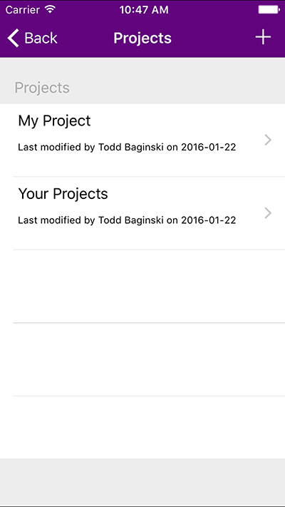

### Task 2 - Wiring up CreateProjectView

01. Open **CreateViewController.m** and add the body to the **createProject** method

    ```objc
    -(void)createProject{
        if(![self.FileNameTxt.text isEqualToString:@""]){
            double x = ((self.navigationController.view.frame.size.width) - 20)/ 2;
            double y = ((self.navigationController.view.frame.size.height) - 150)/ 2;
            UIActivityIndicatorView* spinner = [[UIActivityIndicatorView alloc]initWithFrame:CGRectMake(x, y, 20, 20)];
            spinner.activityIndicatorViewStyle = UIActivityIndicatorViewStyleGray;
            [self.view addSubview:spinner];
            spinner.hidesWhenStopped = YES;
            [spinner startAnimating];
            
            ProjectClient* client = [[ProjectClient alloc] init];
            
            NSURLSessionTask* task = [client addProject:self.FileNameTxt.text token:self.token callback:^(NSError *error) {
                if(error == nil){
                    dispatch_async(dispatch_get_main_queue(), ^{
                        [spinner stopAnimating];
                        [self.navigationController popViewControllerAnimated:YES];
                    });
                }else{
                    NSString *errorMessage = [@"Add Project failed. Reason: " stringByAppendingString: error.description];
                    UIAlertView *alert = [[UIAlertView alloc] initWithTitle:@"Error" message:errorMessage delegate:self cancelButtonTitle:@"Retry" otherButtonTitles:@"Cancel", nil];
                    [alert show];
                }
            }];
            [task resume];
        }else{
            dispatch_async(dispatch_get_main_queue(), ^{
                UIAlertView *alert = [[UIAlertView alloc] initWithTitle:@"Error" message:@"Complete all fields" delegate:self cancelButtonTitle:@"Ok" otherButtonTitles:nil, nil];
                [alert show];
            });
        }
    }
    ```

02. Add the import sentence to the **ProjectClient** class

    ```objc
    #import "ProjectClient.h"
    ```

03. Build and Run the app, and check everything is ok. Now you can create a new project with the plus button in the right corner of the main screen

    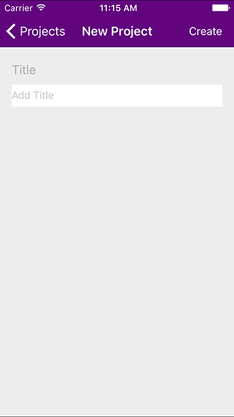


### Task 3 - Wiring up ProjectDetailsView

01. Open **ProjectDetailsViewController.h** and add the following variables

    ```objc
    @property NSDictionary* project;
    @property NSDictionary* selectedReference;
    ```

02. Set the value when the user selects a project in the list. On **ProjectTableViewController.m**, add the line
	```objc
	controller.project = currentEntity;
	```
	to the **prepareForSegue:sender:** method, under
    ```objc
	ProjectDetailsViewController* = ...
	```

    ```objc
    ProjectDetailsViewController* = (ProjectDetailsViewController*)segue.destinationViewController;
    controller.project = currentEntity; //add this line
    controller.token = self.token;
    ```

03. Back to the **ProjectDetailsViewController.m** Set the fields and screen title text on the **viewDidLoad** method

    ```objc
    -(void)viewDidLoad{
        self.projectName.text = [self.project valueForKey:@"Title"];
        self.navigationItem.title = [self.project valueForKey:@"Title"];
        self.navigationItem.rightBarButtonItem.title = @"Done";
        self.selectedReference = false;
        self.projectNameField.hidden = true;
    }
    ```

04. Load the references

    ```objc
    -(void)loadData{
        double x = ((self.navigationController.view.frame.size.width) - 20)/ 2;
        double y = ((self.navigationController.view.frame.size.height) - 150)/ 2;
        UIActivityIndicatorView* spinner = [[UIActivityIndicatorView alloc]initWithFrame:CGRectMake(x, y, 20, 20)];
        spinner.activityIndicatorViewStyle = UIActivityIndicatorViewStyleGray;
        [self.view addSubview:spinner];
        spinner.hidesWhenStopped = YES;
        [spinner startAnimating];
        
        [self getReferences:spinner];    
    }

    -(void)getReferences:(UIActivityIndicatorView *) spinner{
        ProjectClient* client = [[ProjectClient alloc] init];
        
        NSURLSessionTask* listReferencesTask = [client getReferencesByProjectId:[self.project valueForKey:@"Id"] token:self.token callback:^(NSMutableArray *listItems, NSError *error) {
                dispatch_async(dispatch_get_main_queue(), ^{
                    self.references = [listItems copy];
                    [self.refencesTable reloadData];
                    [spinner stopAnimating];
                });
            
            }];

        [listReferencesTask resume];
    }
    ```

05. Fill the table cells

    ```objc
    - (UITableViewCell *)tableView:(UITableView *)tableView cellForRowAtIndexPath:(NSIndexPath *)indexPath
    {
        NSString* identifier = @"referencesListCell";
        ReferencesTableViewCell *cell =[tableView dequeueReusableCellWithIdentifier: identifier ];
        
        NSDictionary *item = [self.references objectAtIndex:indexPath.row];
        NSDictionary *dic =[item valueForKey:@"URL"];
        cell.titleField.text = [dic valueForKey:@"Description"];
        cell.urlField.text = [dic valueForKey:@"Url"];
        return cell;
    }
    ```

06. Get the references count
    
    ```objc
    - (NSInteger)tableView:(UITableView *)tableView numberOfRowsInSection:(NSInteger)section
    {
        return [self.references count];
    }
    ```

07. Row selection

    ```objc
    - (void)tableView:(UITableView *)tableView didSelectRowAtIndexPath:(NSIndexPath *)indexPath
    {
        self.selectedReference= [self.references objectAtIndex:indexPath.row];    
        [self performSegueWithIdentifier:@"referenceDetail" sender:self];
    }
    ```

08. Forward navigation

    ```objc
    - (void)prepareForSegue:(UIStoryboardSegue *)segue sender:(id)sender
    {
        if([segue.identifier isEqualToString:@"createReference"]){
            CreateReferenceViewController *controller = (CreateReferenceViewController *)segue.destinationViewController;
            //controller.project = self.project;
            controller.token = self.token;
        }else if([segue.identifier isEqualToString:@"referenceDetail"]){
            ReferenceDetailsViewController *controller = (ReferenceDetailsViewController *)segue.destinationViewController;
            //controller.selectedReference = self.selectedReference;
            controller.token = self.token;
        }else if([segue.identifier isEqualToString:@"editProject"]){
            EditProjectViewController *controller = (EditProjectViewController *)segue.destinationViewController;
            //controller.project = self.project;
            controller.token = self.token;
        }
        self.selectedReference = false;
    }

    - (BOOL)shouldPerformSegueWithIdentifier:(NSString *)identifier sender:(id)sender{
        return ([identifier isEqualToString:@"referenceDetail"] && self.selectedReference) || [identifier isEqualToString:@"createReference"] || [identifier isEqualToString:@"editProject"];
    }
    ```

09. Add the import sentence to the **ProjectClient** class

    ```objc
    #import "ProjectClient.h"
    ```

10. Build and Run the app, and check everything is OK. Now you can see the references from a project

    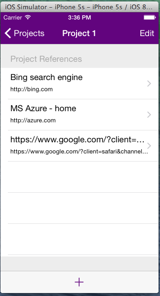

### Task 4 - Wiring up EditProjectView

01. Adding a variable for the selected project 

    First, add a variable **project** in the **EditProjectViewController.h**

    ```objc
    @property NSDictionary* project;
    ```

02. On the **ProjectDetailsViewController.m**, uncomment this line in the **prepareForSegue:sender:** method

    ```objc
    //controller.project = self.project;
    ```
	
	under
    ```objc
	EditProjectViewController *controller = ...;
	```

03. Go to **EditProjectViewController.m**. Add the body for **updateProject**

    ```objc
    -(void)updateProject{
        if(![self.ProjectNameTxt.text isEqualToString:@""]){
            double x = ((self.navigationController.view.frame.size.width) - 20)/ 2;
            double y = ((self.navigationController.view.frame.size.height) - 150)/ 2;
            UIActivityIndicatorView* spinner = [[UIActivityIndicatorView alloc]initWithFrame:CGRectMake(x, y, 20, 20)];
            spinner.activityIndicatorViewStyle = UIActivityIndicatorViewStyleGray;
            [self.view addSubview:spinner];
            spinner.hidesWhenStopped = YES;
            [spinner startAnimating];
            
            NSDictionary* dic = [NSDictionary dictionaryWithObjects:@[@"Title",self.ProjectNameTxt.text, [self.project valueForKey:@"Id"]] forKeys:@[@"_metadata",@"Title",@"Id"]];
            
            ProjectClient* client = [[ProjectClient alloc]init];
            
            NSURLSessionTask* task = [client updateProject:dic token:self.token callback:^(BOOL result, NSError *error) {
                if(error == nil){
                    dispatch_async(dispatch_get_main_queue(), ^{
                        [spinner stopAnimating];
                        ProjectTableViewController *View = [self.navigationController.viewControllers objectAtIndex:self.navigationController.viewControllers.count-3];
                        [self.navigationController popToViewController:View animated:YES];
                    });
                }else{
                    NSString *errorMessage = [@"Update Project failed. Reason: " stringByAppendingString: error.description];
                    UIAlertView *alert = [[UIAlertView alloc] initWithTitle:@"Error" message:errorMessage delegate:self cancelButtonTitle:@"Retry" otherButtonTitles:@"Cancel", nil];
                    [alert show];
                }
            }];
            [task resume];
            
        }else{
            dispatch_async(dispatch_get_main_queue(), ^{
                UIAlertView *alert = [[UIAlertView alloc] initWithTitle:@"Error" message:@"Complete all fields" delegate:self cancelButtonTitle:@"Ok" otherButtonTitles:nil, nil];
                [alert show];
            });
        }
    }
    ```

04. Do the same for **deleteProject**

    ```objc
    -(void)deleteProject{
        double x = ((self.navigationController.view.frame.size.width) - 20)/ 2;
        double y = ((self.navigationController.view.frame.size.height) - 150)/ 2;
        UIActivityIndicatorView* spinner = [[UIActivityIndicatorView alloc]initWithFrame:CGRectMake(x, y, 20, 20)];
        spinner.activityIndicatorViewStyle = UIActivityIndicatorViewStyleGray;
        [self.view addSubview:spinner];
        spinner.hidesWhenStopped = YES;
        [spinner startAnimating];
        
        ProjectClient* client = [[ProjectClient alloc] init];

        NSURLSessionTask* task = [client deleteListItem:@"Research%20Projects" itemId:[self.project valueForKey:@"Id"] token:self.token callback:^(BOOL result, NSError *error) {
            if(error == nil){
                dispatch_async(dispatch_get_main_queue(), ^{
                    [spinner stopAnimating];
                    
                    ProjectTableViewController *View = [self.navigationController.viewControllers objectAtIndex:self.navigationController.viewControllers.count-3];
                    [self.navigationController popToViewController:View animated:YES];
                });
            }else{
                NSString *errorMessage = [@"Delete Project failed. Reason: " stringByAppendingString: error.description];
                UIAlertView *alert = [[UIAlertView alloc] initWithTitle:@"Error" message:errorMessage delegate:self cancelButtonTitle:@"Retry" otherButtonTitles:@"Cancel", nil];
                [alert show];
            }
        }];
        
        [task resume];
    }
    ```

05. Set the **viewDidLoad** initialization

    ```objc
    -(void)viewDidLoad{
        [super viewDidLoad];
        
        self.ProjectNameTxt.text = [self.project valueForKey:@"Title"];
        self.navigationController.title = @"Edit Project";
    }
    ```

06. Add the import sentence to the **ProjectClient** class

    ```objc
    #import "ProjectClient.h"
    ```

07. Build and Run the app, and check everything is OK. Now you can edit a project

    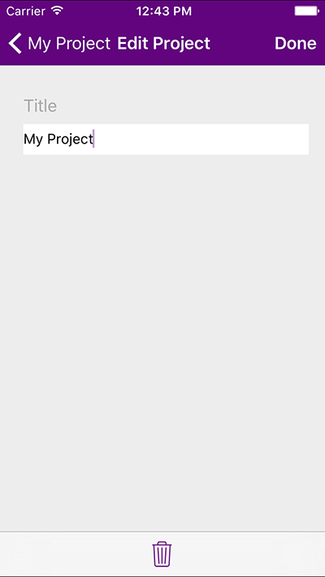


### Task 5 - Wiring up CreateReferenceView
01. On the **CreateReferenceViewController.m** add the body for the **createReference** method

    ```objc
    -(void)createReference{
        if((![self.referenceUrlTxt.text isEqualToString:@""]) && (![self.referenceDescription.text isEqualToString:@""]) && (![self.referenceTitle.text isEqualToString:@""])){
            double x = ((self.navigationController.view.frame.size.width) - 20)/ 2;
            double y = ((self.navigationController.view.frame.size.height) - 150)/ 2;
            UIActivityIndicatorView* spinner = [[UIActivityIndicatorView alloc]initWithFrame:CGRectMake(x, y, 20, 20)];
            spinner.activityIndicatorViewStyle = UIActivityIndicatorViewStyleGray;
            [self.view addSubview:spinner];
            spinner.hidesWhenStopped = YES;
            [spinner startAnimating];
            ProjectClient* client = [[ProjectClient alloc] init];
            NSString* obj = [NSString stringWithFormat:@"{'Url':'%@', 'Description':'%@'}", self.referenceUrlTxt.text, self.referenceTitle.text];
            NSDictionary* dic = [NSDictionary dictionaryWithObjects:@[obj, self.referenceDescription.text, [NSString stringWithFormat:@"%@", [self.project valueForKey:@"Id"]]] forKeys:@[@"URL", @"Comments", @"Project"]];
            
            NSURLSessionTask* task = [client addReference:dic token:self.token callback:^(NSError *error) {
                if(error == nil){
                    dispatch_async(dispatch_get_main_queue(), ^{
                        [spinner stopAnimating];
                        [self.navigationController popViewControllerAnimated:YES];
                    });
                }else{
                    dispatch_async(dispatch_get_main_queue(), ^{
                        [spinner stopAnimating];
                        NSString *errorMessage = (error) ? [@"Add Reference failed. Reason: " stringByAppendingString: error.description] : @"Invalid Url";
                        UIAlertView *alert = [[UIAlertView alloc] initWithTitle:@"Error" message:errorMessage delegate:self cancelButtonTitle:@"Ok" otherButtonTitles:nil, nil];
                        [alert show];
                    });
                }
            }];
            [task resume];
        }else{
            dispatch_async(dispatch_get_main_queue(), ^{
                UIAlertView *alert = [[UIAlertView alloc] initWithTitle:@"Error" message:@"Complete all fields" delegate:self cancelButtonTitle:@"Ok" otherButtonTitles:nil, nil];
                [alert show];
            });
        }
    }
    ```

    And add the import sentence
    
    ```objc
    #import "ProjectClient.h"
    ```

02. On **ProjectDetailsViewController.m** uncomment this line in the method **prepareForSegue:sender:**

    ```objc
    //controller.project = self.project;
    ```

03. Back in **CreateReferenceViewController.h**, add the variable

    ```objc
    @property NSDictionary* project;
    ```

04. Build and Run the app, and check everything is OK. Now you can add a reference to a project

    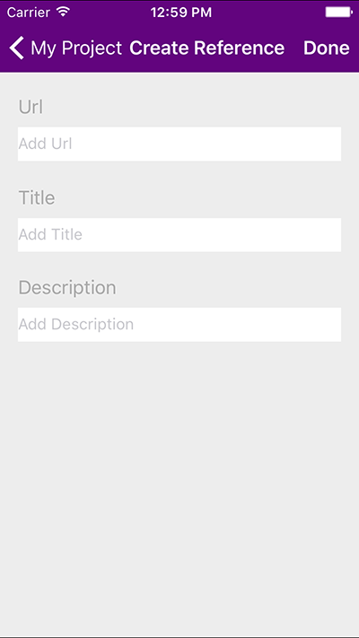

### Task 6 - Wiring up ReferenceDetailsView

01. On **ReferenceDetailsViewController.m** add the initialization method

    ```objc
    - (void)viewDidLoad
    {
        [super viewDidLoad];
        
        [self.navigationController.navigationBar setBackgroundImage:nil
                                                      forBarMetrics:UIBarMetricsDefault];
        self.navigationController.navigationBar.shadowImage = nil;
        self.navigationController.navigationBar.translucent = NO;
        self.navigationController.view.backgroundColor = nil;
        
        NSDictionary *dic =[self.selectedReference valueForKey:@"URL"];
        
        if(![[self.selectedReference valueForKey:@"Comments"] isEqual:[NSNull null]]){
            self.descriptionLbl.text = [self.selectedReference valueForKey:@"Comments"];
        }else{
            self.descriptionLbl.text = @"";
        }
        self.descriptionLbl.numberOfLines = 0;
        [self.descriptionLbl sizeToFit];
        self.urlTableCell.scrollEnabled = NO;
        self.navigationItem.title = [dic valueForKey:@"Description"];
    }
    ```

02. Add the table actions

    ```objc
    - (NSInteger)tableView:(UITableView *)tableView numberOfRowsInSection:(NSInteger)section{
        return 1;
    }
    - (UITableViewCell *)tableView:(UITableView *)tableView cellForRowAtIndexPath:(NSIndexPath *)indexPath{
        NSString* identifier = @"referenceDetailsTableCell";
        ReferenceDetailTableCellTableViewCell *cell =[tableView dequeueReusableCellWithIdentifier: identifier ];
        
        NSDictionary *dic =[self.selectedReference valueForKey:@"URL"];
        
        cell.urlContentLBL.text = [dic valueForKey:@"Url"];
        
        return cell;
    }
    - (void)tableView:(UITableView *)tableView didSelectRowAtIndexPath:(NSIndexPath *)indexPath
    {
        NSDictionary *dic =[self.selectedReference valueForKey:@"URL"];
        NSURL *url = [NSURL URLWithString:[dic valueForKey:@"Url"]];
        
        if (![[UIApplication sharedApplication] openURL:url]) {
            NSLog(@"%@%@",@"Failed to open url:",[url description]);
        }
    }
    ```

03. Forward navigation

    ```objc
    - (void)prepareForSegue:(UIStoryboardSegue *)segue sender:(id)sender{
        if ([segue.identifier isEqualToString:@"editReference"]){
            EditReferenceViewController *controller = (EditReferenceViewController *)segue.destinationViewController;
            controller.token = self.token;
            //controller.selectedReference = self.selectedReference;
        }
    }
    ```

04. On **ReferenceDetailsViewController.h**, add the variable:

    ```objc
    @property NSDictionary* selectedReference;
    ```

05. On the **ProjectDetailsViewController.m** uncomment this line on the method **prepareForSegue:sender:**

    ```objc
    //controller.selectedReference = self.selectedReference;
    ```

06. Build and Run the app, and check everything is OK. Now you can see the Reference details.

    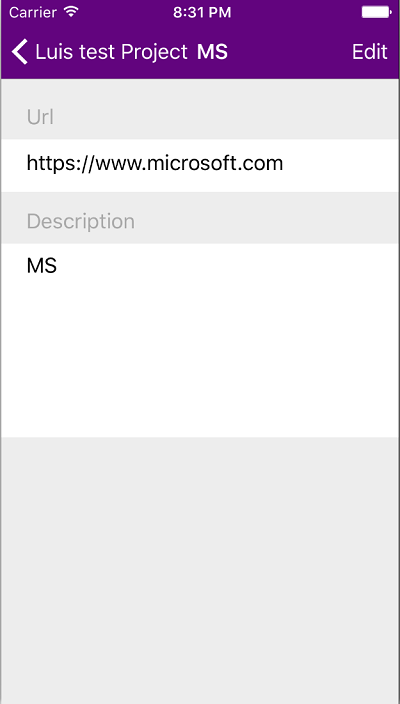


### Task 7 - Wiring up EditReferenceView

01. On **ReferenceDetailsViewController.m** uncomment this line on the method **prepareForSegue:sender**

    ```objc
    controller.selectedReference = self.selectedReference;
    ```

02. On **EditReferenceViewController.h** add a variable:

    ```objc
    @property NSDictionary* selectedReference;
    ```

03. On the **EditReferenceViewController.m**, change the **viewDidLoad** method

    ```objc
    - (void)viewDidLoad
    {
        [super viewDidLoad];
        
        [self.navigationController.navigationBar setBackgroundImage:nil
                                                      forBarMetrics:UIBarMetricsDefault];
        self.navigationController.navigationBar.shadowImage = nil;
        self.navigationController.navigationBar.translucent = NO;
        self.navigationController.title = @"Edit Reference";
        
        self.navigationController.view.backgroundColor = nil;
        
        NSDictionary *dic =[self.selectedReference valueForKey:@"URL"];
        
        self.referenceUrlTxt.text = [dic valueForKey:@"Url"];
        
        if(![[self.selectedReference valueForKey:@"Comments"] isEqual:[NSNull null]]){
            self.referenceDescription.text = [self.selectedReference valueForKey:@"Comments"];
        }else{
            self.referenceDescription.text = @"";
        }

        self.referenceTitle.text = [dic valueForKey:@"Description"];
    }
    ```

04. Change the **updateReference** method

    ```objc
    -(void)updateReference{
        if((![self.referenceUrlTxt.text isEqualToString:@""]) && (![self.referenceDescription.text isEqualToString:@""]) && (![self.referenceTitle.text isEqualToString:@""])){
            double x = ((self.navigationController.view.frame.size.width) - 20)/ 2;
            double y = ((self.navigationController.view.frame.size.height) - 150)/ 2;
            UIActivityIndicatorView* spinner = [[UIActivityIndicatorView alloc]initWithFrame:CGRectMake(x, y, 20, 20)];
            spinner.activityIndicatorViewStyle = UIActivityIndicatorViewStyleGray;
            [self.view addSubview:spinner];
            spinner.hidesWhenStopped = YES;
            [spinner startAnimating];
            NSDictionary* urlDic = [NSDictionary dictionaryWithObjects:@[self.referenceUrlTxt.text, self.referenceTitle.text] forKeys:@[@"Url",@"Description"]];
            NSDictionary* dic = [NSDictionary dictionaryWithObjects:@[urlDic, self.referenceDescription.text, [self.selectedReference valueForKey:@"Project"], [self.selectedReference valueForKey:@"Id"]] forKeys:@[@"URL",@"Comments",@"Project",@"Id"]];
            ProjectClient* client = [[ProjectClient alloc] init];
            NSURLSessionTask* task = [client updateReference:dic token:self.token callback:^(BOOL result, NSError *error) {
                if(error == nil && result){
                    dispatch_async(dispatch_get_main_queue(), ^{
                        [spinner stopAnimating];
                        ProjectDetailsViewController *View = [self.navigationController.viewControllers objectAtIndex:self.navigationController.viewControllers.count-3];
                        [self.navigationController popToViewController:View animated:YES];
                    });
                }else{
                    dispatch_async(dispatch_get_main_queue(), ^{
                        [spinner stopAnimating];
                        NSString *errorMessage = (error) ? [@"Update Reference failed. Reason: " stringByAppendingString: error.description] : @"Invalid Url";
                        UIAlertView *alert = [[UIAlertView alloc] initWithTitle:@"Error" message:errorMessage delegate:self cancelButtonTitle:@"Ok" otherButtonTitles:nil, nil];
                        [alert show];
                    });
                }
            }];
            [task resume];
        }else{
            dispatch_async(dispatch_get_main_queue(), ^{
                UIAlertView *alert = [[UIAlertView alloc] initWithTitle:@"Error" message:@"Complete all fields" delegate:self cancelButtonTitle:@"Ok" otherButtonTitles:nil, nil];
                [alert show];
            });
        }
    }
    ```

05. Change the **deleteReference**

    ```objc
    -(void)deleteReference{
        double x = ((self.navigationController.view.frame.size.width) - 20)/ 2;
        double y = ((self.navigationController.view.frame.size.height) - 150)/ 2;
        UIActivityIndicatorView* spinner = [[UIActivityIndicatorView alloc]initWithFrame:CGRectMake(x, y, 20, 20)];
        spinner.activityIndicatorViewStyle = UIActivityIndicatorViewStyleGray;
        [self.view addSubview:spinner];
        spinner.hidesWhenStopped = YES;
        [spinner startAnimating];
        
        ProjectClient* client = [[ProjectClient alloc] init];
        
        NSURLSessionTask* task = [client deleteListItem:@"Research%20References" itemId:[self.selectedReference valueForKey:@"Id"] token:self.token callback:^(BOOL result, NSError *error) {
            if(error == nil){
                dispatch_async(dispatch_get_main_queue(), ^{
                    [spinner stopAnimating];
                    ProjectDetailsViewController *View = [self.navigationController.viewControllers objectAtIndex:self.navigationController.viewControllers.count-3];
                    [self.navigationController popToViewController:View animated:YES];
                });
            }else{
                NSString *errorMessage = [@"Delete Reference failed. Reason: " stringByAppendingString: error.description];
                UIAlertView *alert = [[UIAlertView alloc] initWithTitle:@"Error" message:errorMessage delegate:self cancelButtonTitle:@"Retry" otherButtonTitles:@"Cancel", nil];
                [alert show];
            }
        }];
        
        [task resume];
    }
    ```

06. Add the import sentence to the **EditReferenceViewController** class

    ```objc
    #import "ProjectClient.h"
    ```

07. Build and Run the app, and check everything is OK. Now you can edit and delete a reference.

    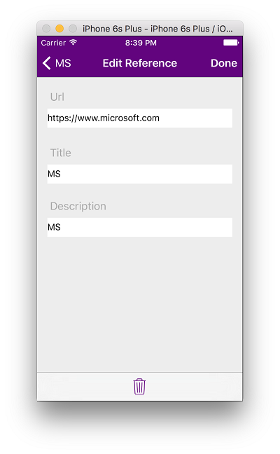

## Summary

By completing this hands-on lab you have learned:

01. The way to connect an iOS application with an Office 365 tenant.

02. How to retrieve information from SharePoint lists.

03. How to handle the responses in JSON format. And communicate with the infrastructure.