# Deep dive into SharePoint Lists with CSOM APIs

In this lab you will program create a provider-hosted app that programs against the host web in the Office 365 environment using the Client-side Object Model (CSOM). Through the various exercises in this lab you will learn how to use CSOM to query site properties, to query the set of existing lists and to create a new list.

##Exercise 1: Create a Provider-hosted App with an Office 365 Test Site
In this exercise you will create a new Provider-Hosted app that will use CSOM and OAuth authentication to program against a SharePoint site.

1.	Launch Visual Studio 2013 as administrator.
2.	Create a new project in Visual Studio 2013 for hosting your app by selecting **File > New > Project**.
3.	In the **New Project** dialog, find the **App for SharePoint** template under the **Templates > Visual C# > Office / SharePoint > Apps** section.
4.	Enter a project name of **MyCSOMApp** and then click the **OK** button.     

5.	In the **New app for SharePoint** wizard, enter the URL for your Office 365 developer site for the debugging site and select the option to create a Provider-hosted app.
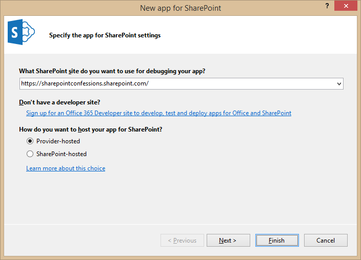  
6.	On the **Specify the web project type** screen select the **ASP.NET Web Forms Application** choice and click the **Next** button to move to the next screen. Do not click the Finish button until you have gone through all the pages of the wizard. 
7.	You should now be at the **Configure authentication** settings page. Fill this page out as shown in the following screenshot by selecting the **Use Windows Azure Access Control Service** option and then click Finish to complete the wizard and create the new provider-hosted app project.  
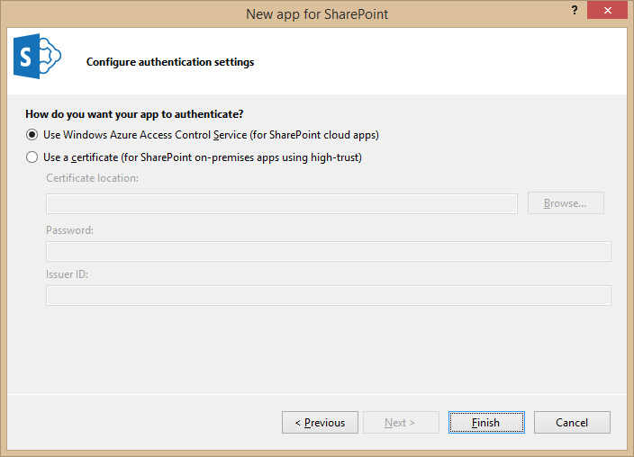  
8.	Once the Visual Studio solution has been created, you should see it contains two projects named **MyCsomApp** and **MyCsomAppWeb**.  
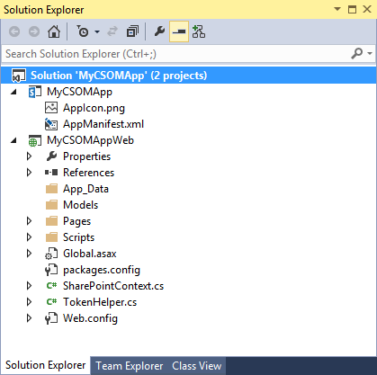  
9.	Now it's time to make some modification to the App project named **MyCsomApp**. Start by replacing the **AppIcon.png** file with a custom image file also named the **AppIcon.png** in the **StarterFiles** folder for this project.
10.	In Solution Explorer, double-click on **AppManifest.xml** open it in Visual Studio's App Manifest Designer. Update the **Title** property from **MyCsomApp** to **My CSOM App**.
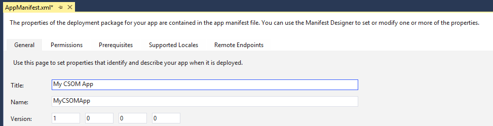  
11.	Click on the **Permissions** tab and then add a permission with a **Scope** of **Web** and a **Permission level** of **Manage**. This permissions is required so that your app will be able to read site properties as well as query and create lists.
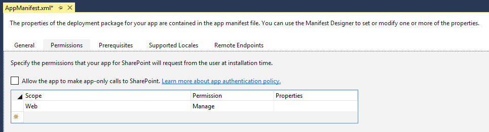  
12.	Save your changes and close **AppManifest.xml**.
13.	In Solution Explorer, move down to the Web Project named **MyCsomAppWeb**.  
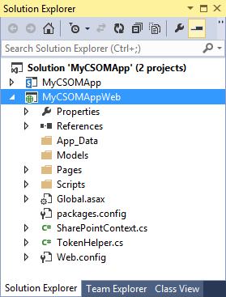  
14.	Over the next few steps you will add a custom CSS file and an image file for the start page.
15.	Inside the **MyCsomAppWeb** project, add a new top-level folder named **Content**.  
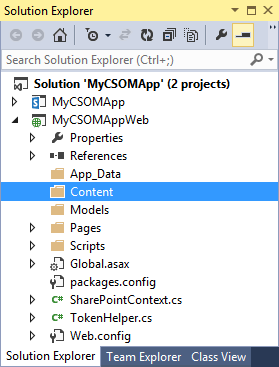  
16.	Using Windows Explorer, locate the CSS file in the **StarterFiles** folder at the following path of **StarterFiles\Content\App.css**. 
17.	Add the **App.css** file from the **StarterFiles** folder into the new **Content **folder in the MyCsomApp project.
18.	Create a child folder named **img** inside the **Content** folder.
19.	Using Windows Explorer, locate the GIF file in the **StarterFiles** folder at the following path of **StarterFiles\Content\img\AppIcon.gif**. 
20.	Add the **AppIcon.gif** file from the **StarterFiles** folder into the new **img** folder in the **MyCsomApp** project.  
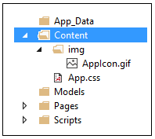  
21.	Open the CSS file named **App.css** and have a quick look at the set of CSS rules inside. Note there is no need for you to modify the CSS rules in this lab. You are just looking.
22.	When you are done, close the **App.css** file without saving any changes.
23.	Now you will modify the app's start page named **Default.aspx**. Using the Solution Explorer, look inside the **Pages** folder of the **MyCsomAppWeb** project and locate **Default.aspx**.
24.	Double click on **Default.aspx** to open it in the Web Forms Editor of Visual Studio.
25.	Delete all contents from **Default.aspx** except for the first line with the **<@Page>** directive.
26.	Using Windows Explorer, locate the file named **Default.aspx.txt** in the **StarterFiles** folder at the path of **StarterFiles\Default.aspx.txt**. 
27.	Open the file named **Default.aspx.txt** in Notepad.exe and copy its entire contents to the Windows clipboard.
28.	Return to Visual Studio.
29.	Navigate to **Default.aspx** which should still be open in the Web Forms Editor.
30.	Position you cursor in **Default.aspx** right below the first line with the **<@Page>** directive and paste the content of the Windows clipboard.
31.	Save your changes to **Default.aspx**.
32.	Examine the layout of the HTML you just pasted into **Default.aspx**.
33.	Make sure you are looking at **Default.aspx** in Code View.
34.	Note in the head section that that there is already a link to the CSS file named **App.css**.
35.	The body section contains a div with an id of **page_width** which contains child elements that make up the user interface.

		<%@ Page Language="C#" AutoEventWireup="true" CodeBehind="Default.aspx.cs" ... >
		<!DOCTYPE html>
		<html>
		<head runat="server">
		  
		<meta charset="utf - 8" />
		  
		<meta http - equiv="X- UA - Compatible" content="IE=10" />
		  
		<title>My CSOM App</title>
		  
		<link href="../Content/App.css" rel="stylesheet" /> </head>
		<body>
		  
		<form id="form1" runat="server">
		    
		

		      
		<! -- more inside -- >
		    
		

		  
		</form> </body> </html>
36.	Examine the server-side controls inside the div with the id of **page_width**. First, you should see there is an ASP.NET HyperLink control with an ID of **HostWebLink**.

		
		  
		  <asp:HyperLink ID="HostWebLink" runat="server" /> 
		

37. Next, you should see two ASP.NET Button controls with ID values of **cmdGetTitleCSOM** and **cmdGetTitleREST**.

		<nav id="toolbar">
		  
		  <asp:Button ID="cmdGetSiteProperties" runat="server" Text="Get Properties" />		  
		  <asp:Button ID="cmdGetLists" runat="server" Text="Get Lists" />		  
		  <asp:Button ID="cmdCreateCustomersList" runat="server" Text="Create List" />

		</nav>
38. Finally, there is an ASP.NET Literal control with an ID of placeholderMainContent.
		
		

		   <asp:Literal ID="placeholderMainContent" runat="server" ></asp:Literal>
		

39.	Modify the server-side C# code behind the start page. In Solution Explorer, locate the code-behind file for **Default.aspx** named **Default.aspx.cs**. Open **Default.aspx.cs** and inspect the code inside that was generate by Visual Studio. You should be able to see that there is a code-behind class named **Default** for the page named **Default.aspx**. This code-behind class named **Default** contains two methods named **Page_PreInit** and **Page_Load**.
		
		public partial class Default : System.Web.UI.Page {
		  
		  protected void Page_PreInit(object sender, EventArgs e) {
		    // implementation details
		  }
		  
		  protected void Page_Load(object sender, EventArgs e) {
		    // implementation details
		  }
		
		}
40. Examine the method named **Page_PreInit**. There is no need to change the code in this method as it provides logic to redirect the browser to the host web if it sees there current request has no associated context token.
41. Leave the **Page_Load** method but delete all to code inside it so that it is an empty method.
		  
		protected void Page_Load(object sender, EventArgs e) {
		
		}
42.	Implement the **Page_Load** method using the following code.

		protected void Page_Load(object sender, EventArgs e) {
		  
		  SharePointContext spContext =  
				SharePointContextProvider.Current.GetSharePointContext(Context);
		  this.HostWebLink.NavigateUrl = spContext.SPHostUrl.AbsoluteUri;
		  this.HostWebLink.Text = "Back to Host Web";
		
		}
43.	Test out your work by running the app in the Visual Studio Debugger. Press the **{F5}** key in Visual Studio to begin a debugging session for the app project. As Visual Studio installs the app in the test site, you will be prompted whether you trust the app. Click **Trust It**.  
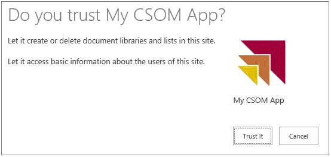  
44.	The start page of the app should appear as the page in the following screenshot.  
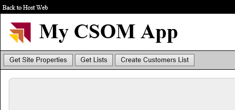    
45.	Test it out the Back to Host Web link to make sure the it works.
46.	Close the browser and quit the debugging session.

##Exercise 2: Using CSOM to Query Site Properties
In this exercise you will use CSOM to program against the host web.

1.	Open the page named **Default.aspx** in the Web Forms Editor.
2.	Switch **Default.aspx** into Design View.
3. When in Design View, double-click on the **Get Site Properties** button to generate an event handler in **Default.aspx.cs**.
4.	Return to Design View in **Default.aspx** and double-click on the **Get Lists** button to generate another event handler.
5.	Return to Design View in **Default.aspx** and double-click on the **Create List** button to generate another event handler.
6.	When you're done, there should be three new event handlers named **cmdGetSiteProperties_Click**, **cmdGetLists_Click** and **cmdCreateCustomersList_Click**.
		

		public partial class Default : System.Web.UI.Page {
		  
		  protected void Page_Load(object sender, EventArgs e) {    
		    // ...
		  }
		  
		  protected void cmdGetSiteProperties_Click(object sender, EventArgs e) {
		  
		  }
		  
		  protected void cmdGetLists_Click(object sender, EventArgs e) {
		  
		  }
		  
		  protected void cmdCreateCustomersList_Click(object sender, EventArgs e) {
		  
		  }
		}
7.	Add the following code to cmdGetSiteProperties_Click to execute a CSOM call using S2S authentication.
		
		protected void cmdGetSiteProperties_Click(object sender, EventArgs e) {
		  
		  SharePointContext spContext = SharePointContextProvider.Current.GetSharePointContext(Context);
		
		  using (var clientContext = spContext.CreateUserClientContextForSPHost()) {
		    clientContext.Load(clientContext.Web);
		    clientContext.ExecuteQuery();
		    placeholderMainContent.Text = "Host web title (CSOM): " + clientContext.Web.Title;
		  }
		
		}
8.	Test your work to ensure the CSOM call executes successful without any errors by pressing the **{F5}** key to start another debugging session. If you are prompted to trust the app, click the **Trust It** button to complete the app installation. After the app has been installed, the Visual Studio debugger should redirect you to the app???s start page in the remote web.
9.	Click the Get Properties button. When you click this button, the page should display a message with the title of the host web as shown in the following screenshot.  
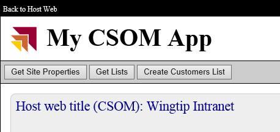    
10.	Close the browser window to stop the debugging and return to Visual Studio.
11.	Modify the code in **cmdGetSiteProperties_Click** to display the **Url** property and the **Id** property of the host web in addition to the Title as shown in the following code.
		
		using (var clientContext = spContext.CreateUserClientContextForSPHost()) {
		        
		  clientContext.Load(clientContext.Web);
		  clientContext.ExecuteQue ry();
		  placeholderMainContent.Text = "
Host web title: " + clientContext.Web.Title + "
" +
		                                "
Host web URL:   " + clientContext.Web.Url + "
" + 
		                                "
Host web ID:    " + clientContext.Web.Id + "
";
		}
12.	Improve the code in **cmdGetSiteProperties_Click** to optimize the retrieval site properties by modifying the call to **ClientContent.Load** as shown in the following code.
		
		using (var clientContext = spContext.CreateUserClientContextForSPHost()) {
		        
		  clientContext.Load(clientContext.Web, web => web.Title, web => web.Url, web => web.Id);
		  clientContext.ExecuteQuery();
		    
		  placeholderMainContent.Text = "
Host web title: " + clientContext.Web.Title + "
" +
		                                "
Host web URL:   " + clientContext.Web.Url + "
" + 
		                                "
Host web ID:    " + clientContext.Web.Id + "
";
		}
13.	Test the app in the debugger and make sure you can see all three site properties when clicking the **Get Site Properties** button.
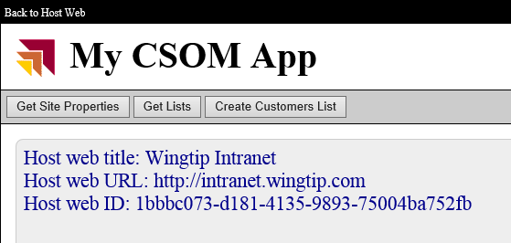  
14.	When you have finished testing, close the browser window to stop the debugging and return to Visual Studio.

##Exercise 3: Program CSOM to Query the Set of Lists in the Host Web
In this exercise you will write the CSOM code required to query the host web to determine when lists exist.

1.	Open the source file **default.aspx.cs** if it is not already open.
2.	Add the following using statement at the top of the file directly following the using statements that are already there.

		using Microsoft.SharePoint.Client;
3.	Modify the code in **cmdGetLists_Click** to retrieve the set of lists on the host web and to display them on the app???s starts page.

		protected void cmdGetLists_Click(object sender, EventArgs e) {
		  
		  SharePointContext spContext = SharePointContextProvider.Current.GetSharePointContext(Context);
		  
		  using (var clientContext = spContext.CreateUserClientContextForSPHost()) {
		
		    clientContext.Load(clientContext.Web);
		    clientContext.Load(clientContext.Web.Lists);
		    clientContext.ExecuteQuery();
		    string html = "<h2>Lists in host web</h2>";
		
		    html += "<ul>";
		    foreach (var list in clientContext.Web.Lists) {
		      html += "<li>" + list.Title + "</li>";
		    }
		    html += "</ul>";
		
		    placeholderMainContent.Text = html;
		  }
		
		}
4.	Test your code by pressing **{F5}** and starting a debugging session. You should be able to see that your query has returned many lists including several hidden lists such as **appdata**, **Composed Looks** and **Converted Forms**.
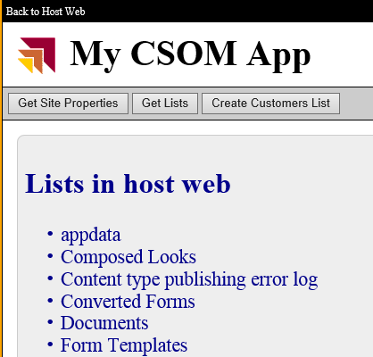  
5.	Close the browser window to stop the debugging and return to Visual Studio.
6.	Improve the code in **cmdGetLists_Click** to optimize the retrieval site properties by modifying the call to **ClientContent.Load** as shown in the following code.
		
		protected void cmdGetLists_Click(object sender , EventArgs e) {
		  
		  SharePointContext spContext = SharePointContextProvider.Current.GetSharePointContext(Context);
		  
		  using (var clientContext = spContext.CreateUserClientContextForSPHost()) {
		    clientContext.Load(clientContext.Web);
		    ListCollection Lists = clientContext.Web.Lists;
		    clientContext.Load(Lists, lists => lists.Where(list => !list.Hidden)
		                                            .Include(list => list.Title,
		                                                      
		    list => list.DefaultViewUrl));
		    clientContext.ExecuteQuery();
		    
		    string html = "<h2>Lists in host web</h2>";
		    html += "<ul>";
		    foreach (var list in Lists) {
		      html += "<li>" + list.Title + "</li>";
		    }
		    html += "</ul>";
		    
		    placeholderMainContent.Text = html;
		  }
		
		}
7.	Test your code by pressing **{F5}** and starting a debugging session. You should be able to see that your query has returned just the lists than are not hidden.  
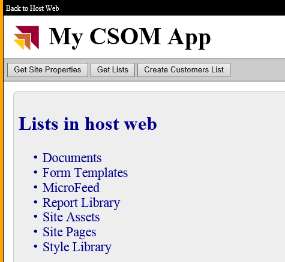  
8.	Close the browser window to stop the debugging and return to Visual Studio.

##Exercise 4: Using CSOM to Create a List in the Host Web
In this exercise, you will continue your work with CSOM by creating a new list in the host web.

1.	Open the source file **default.aspx.cs** if it is not already open.
2.	Modify the code in **cmdCreateCustomersList_Click** to create a new Customers list using the Contacts list type. Begin by adding the following code to create a variable named **spContext** to reference the current **SharePointContext** instance and then to create a using block which is initialized by obtaining a CSOM **ClientContext** for the current user.

		protected void cmdCreateCustomersList_Click(object sender, EventArgs e) {
		  
		  SharePointContext spContext = SharePointContextProvider.Current.GetSharePointContext(Context);
		  
		  using (ClientContext clientContext = spContext.CreateUserClientContextForSPHost()) {
		    // add code here to create new list
		  }
		
		}
3.	Inside the **using** block, add code to load the CSOM Web object for the current site. Also create a variable name **listTitle** and give it a value of **Customers**.

		using (ClientContext clientContext = spContext.CreateUserClientContextForSPHost()) {
		
		  clientContext.Load(clientContext.Web);
		  clientContext.ExecuteQuery();
		
		  string listTitle = "Customers";
		
		}   

4.	Add the following code to the end of the using block to delete any existing list with a conflicting title.

		// delete list if it exists
		ExceptionHandlingScope scope = new ExceptionHandlingScope(clientContext);
		using (scope.StartScope()) {
		  using (scope.StartTry()) {
		    clientContext.Web.Lists.GetByTitle(listTitle).DeleteObject();
		  }
		  using (scope.StartCatch()) { }
		}
5. Just below the code you just added, add the following code to create a new SharePoint Contacts list with a title of Customers.

		// create and initialize ListCreationInformation object
		ListCreationInformation listInformation = new ListCreationInformation();
		listInformation.Title = listTitle;
		listInformation.Url = "Lists/Customers";
		listInformation.QuickLaunchOption = QuickLaunchOptions.On;
		listInformation.TemplateType = (int)ListTemplateType.Contacts;
		       
		// Add ListCreationInformation to lists collection and return list object
		List list = clientContext.Web.Lists.Add(listInformation);
		        
		// modify additional list properties and update
		list.OnQuickLaunch = true;
		list.EnableAttachments = false;
		list.Update();
		        
		// send command to server to create list
		clientContext.ExecuteQuery();
6.	Next, add the following code to create two sample items in the new Customers list.

		// add an item to the list
		ListItemCreationInformation lici1 = new ListItemCreationInformation();
		var item1 = list.AddItem(lici1);
		item1["Title"] = "Lennon";
		item1["FirstName"] = "John";
		item1.Update();
		
		// add a second item 
		ListItemCreationInformation lici2 = new ListItemCreationInformation();
		var item2 = list.AddItem(lici2);
		item2["Title"] = "McCartney";
		item2["FirstName"] = "Paul";
		item2.Update();
		
		// send add commands to server
		clientContext.ExecuteQuery();
7.	Finally, add the following code to display a message to the user that a new list has been created.

		// add message to app???s start page        
		placeholderMainContent.Text = "New list created";
8. After you have completed the previous step, you should have a **cmdCreateCustomersList_Click** function that matches the following code listing. Make sure the structure of your code matches what you see here.

		protected void cmdCreateCustomersList_Click(object sender, EventArgs e) {
		
		  SharePointContext spContext = SharePointContextProvider.Current.GetSharePointContext(Context);
		
		  using (ClientContext clientContext = spContext.CreateUserClientContextForSPHost()) {
		
		    clientContext.Load(clientContext.Web);
		    clientContext.ExecuteQuery();
		    string listTitle = "Customers";
		
		    // delete list if it exists
		    ExceptionHandlingScope scope = new ExceptionHandlingScope(clientContext);
		    using (scope.StartScope()) {
		      using (scope.StartTry()) {
		        clientContext.Web.Lists.GetByTitle(listTitle).DeleteObject();
		      }
		      using (scope.StartCatch()) { }
		    }
		
		    // create and initialize ListCreationInformation object
		    ListCreationInformation listInformation = new ListCreationInformation();
		    listInformation.Title = listTitle;
		    listInformation.Url = "Lists/Customers";
		    listInformation.QuickLaunchOption = QuickLaunchOptions.On;
		    listInformation.TemplateType = (int)ListTemplateType.Contacts;
		
		    // Add ListCreationInformation to lists collection and return list object
		    List list = clientContext.Web.Lists.Add(listInformation);
		
		    // modify additional list properties and update
		    list.OnQuickLaunch = true;
		    list.EnableAttachments = false;
		    list.Update();
		
		    // send command to server to create list
		    clientContext.ExecuteQuery();
		
		    // add an item to the list
		    ListItemCreationInformation lici1 = new ListItemCreationInformation();
		    var item1 = list.AddItem(lici1);
		    item1["Title"] = "Lennon";
		    item1["FirstName"] = "John";
		    item1.Update();
		
		    // add a second item 
		    ListItemCreationInformation lici2 = new ListItemCreationInformation();
		    var item2 = list.AddItem(lici2);
		    item2["Title"] = "McCartney";
		    item2["FirstName"] = "Paul";
		    item2.Update();
		
		    // send add commands to server
		    clientContext.ExecuteQuery();
		
		    // add message to app???s start page        
		    placeholderMainContent.Text = "New list created";
		  }
		
		}
9.	Test your code by pressing **{F5}** and starting a debugging session. Once the app start page has displayed, click the **Create List** button. After a second or two, you should see a message indicating that the list has been created.  
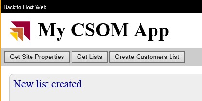  
10.	Next, click the **Get Lists** button and verify that you can see the new **Customers** list in the list of lists.
11.	Click the **Back to Host** Web link to navigate to the host web.
12.	Click the Customers link in the Quick Launch bar of the Host Web and inspect the new Customers list. You should be able to see your sample items.  
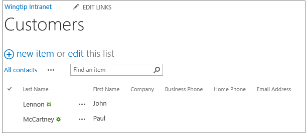  
13.	When you are done with your testing, close the browser to end the debugging sessions and close the project in Visual Studio.