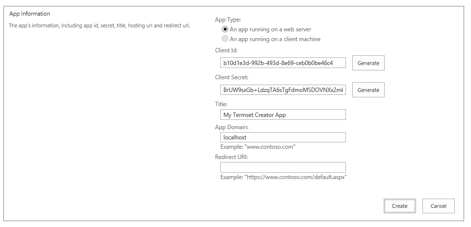
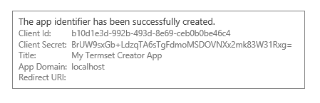
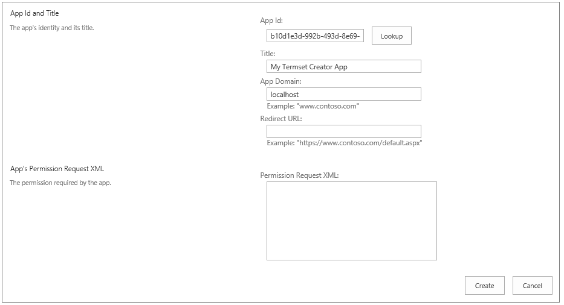
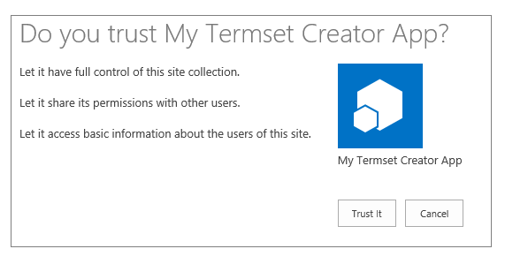
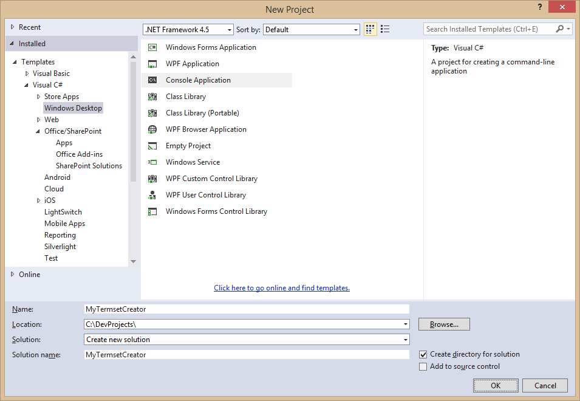
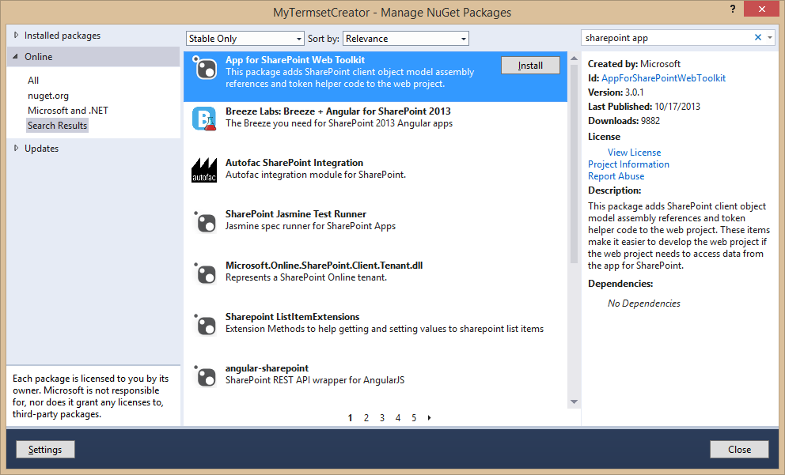
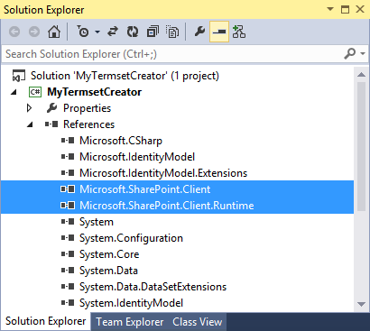
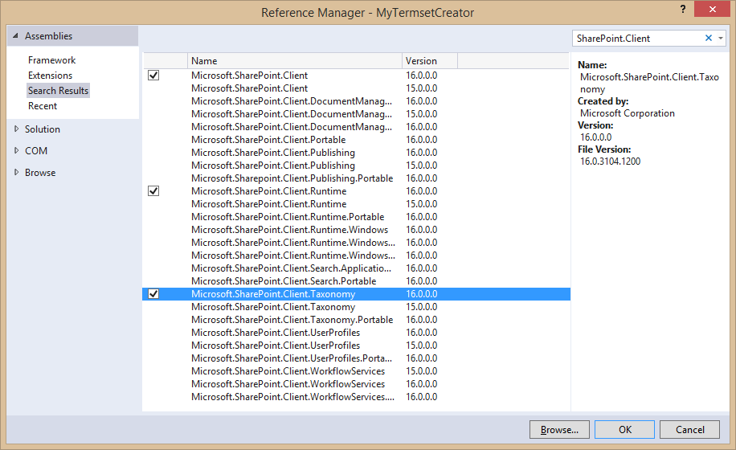
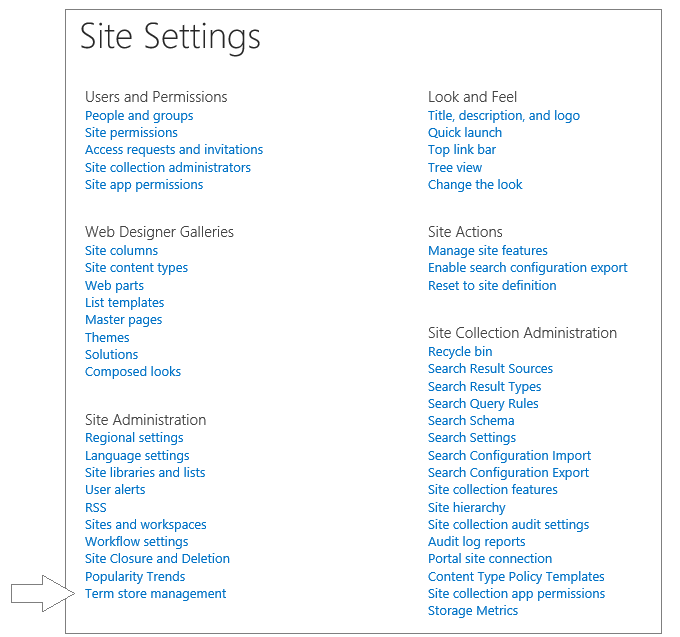
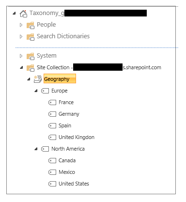

# Developing Advanced Taxonomy Scenarios in Office 365
In this lab, you will write C# code which uses CSOM to create a managed termset which contains a taxonomy of terms for use in a typical business scenario.

## Prerequisites
1. You must have an Office 365 tenant and a Windows Azure account to complete this lab. If you do not have these, the lab for **O3651-7 Setting up your Developer environment in Office 365** shows you how to obtain them.

## Exercise 1: Create an App Security Principle and Configure Its Permissions
In this exercise you will create an app security principle in your Office 365 tenancy and configure it with the permissions that are required by the Console app that you will create in the next exercise.

1. Launch the browser.
2. Navigate to your Office 365 tenancy and log in with your credentials.
3. Navigate to the application page in a SharePoint site which allows you to create new app security principles by typing directly into the address bar of the browser to add a relative URL of **/_layouts/15/appregnew.aspx** to the end of the root URL of your developer site. Fill out this page with the following information.
	1. For **App Type** select **An app running on a web server**.
	2. Client the **Generate** button to create a new **Client Id**
	3. Client the **Generate** button to create a new **Client Secret**
	3. Enter an **App Title** of **My Termset Creator App**
	4. Enter an **App Domain** of **localhost** which will effectively allow request to come from any URL during your testing. Note that the special domain of **localhost** should only be used in non-production environments in which you are testing and developing.
	5. Finally, click the **Create** button to create the new app security principle. 
	
4. After creating the new app security principle, you will see a confirmation page like the one shown in the following screenshot which lists both the **Client Id** and the **Client Secret**. Copy and paste the the **Client Id** and the **Client Secret** into a new text document using a utility such as Notepad so you can copy-and-paste these values in later steps. 
  

5. Navigate to the application page in a SharePoint site which allows you to configure an existing app security principles by typing directly into the address bar of the browser to add an relative URL of **/_layouts/15/appinv.aspx** to the end of the root URL of your developer site.
6. Copy and paste the **Client Id** of the app security principle you just created into the **App Id** textbox and click **Lookup**. When you do this, the page will retrieve other information about the app such as the **App Title** and the **App Domain**. 
  

7. Enter the following XML snippet into the **Permission Request XML** textbox. If you would rather, you can copy-and-paste this XML from a text file named **PermissionRequestXML.txt** in the **Starter Files** folder for this lab. 

		<AppPermissionRequests AllowAppOnlyPolicy="true">
			<AppPermissionRequest 
				Scope="http://sharepoint/taxonomy" 
				Right="Write" />
			<AppPermissionRequest 
				Scope="http://sharepoint/content/sitecollection"
				Right="FullControl" />			
		</AppPermissionRequests>
8. You will notice that the XML you enter does not format inside the textbox in an elegant way but it will still work. Click the **Create** button to save the XML with the app permission configuration back to the SharePoint tenancy.
9. When you attempt to save the app security changes, SharePoint prompts you with a page titled **Do you trust My Termset Creator App?**. Click **Trust It** to confirm you want to save the app security configuration changes. 
  

You have now successfully created and configured a new app security principle for your Office 365 site.

## Exercise 2: Create a Console App to Create a New Termset
In this exercise you will use Visual Studio to create a simple console application that uses the app security principle you just created to establish its identity with your Office 365 developers site. In this exercise you will write the code in the app to create a new site collection-scoped termset and to populate the termset with a taxonomy of terms.

1. In Visual Studio, click **Flie/New/Project**.
2. In the **New Project** dialog, select **Templates/Visual C#/Windows Desktop**. Then select **Console Application** and give the project a name of **MyTermsetCreator**. Click **OK** when you are done. 

3. Once the **MyTermsetCreator** project has been created, right-click its project node in Solution Explorer and select **Manage NuGet Packages**. 
4. In the **Manage NuGet Packages** dialog, search for *"sharepoint app"* to find and install the package named **App for SharePoint Web Toolkit**. 

5. After adding the **App for SharePoint Web Toolkit** package, you should be able to examine the project references and verify that the project now has references to the two core assemblies of the SharePoint Client Object Model (CSOM) named **Microsoft.SharePoint.Client.dll** and **Microsoft.SharePoint.Client.Runtime.dll**   
  
6. There is an issue in that the references to the assemblies **Microsoft.SharePoint.Client.dll** and **Microsoft.SharePoint.Client.Runtime.dll** are based on an older version 15.0.0.0 instead of the more recent version which is 16.0.0.0. Therefore, you should delete the two references to **Microsoft.SharePoint.Client.dll** and **Microsoft.SharePoint.Client.Runtime.dll** and replace them with references to the 16.0.0.0 version of the same two assemblies. Also add a third reference to the 16.0.0.0 version of **Microsoft.SharePoint.Client.Taxonomy.dll**.   
  
7. Locate and open the app configuration file named **App.config** file.
8. Add an **appSettings** section with values for **ClientId** and the **ClientSecret** and configure them with the correct values for the app security principle created in earlier steps. 

		<?xml version="1.0" encoding="utf-8" ?>
			<configuration>
				<startup>
    				<supportedRuntime 
						version="v4.0" 
						sku=".NETFramework,Version=v4.5" />
				</startup>
				<appSettings>
					<add key="ClientId" value="[[YOUR_VALUE]]"/>
					<add key="ClientSecret" value="[[YOUR_VALUE]]"/>
				</appSettings>
		</configuration>
9. Open the console application's main logic file named **Program.cs**.
10. Add the following two **using** statements for the **Microsoft.SharePoint.Client** namespace and the **Microsoft.SharePoint.Client.Taxonomy** namespace .
 
		using Microsoft.SharePoint.Client;
		using Microsoft.SharePoint.Client.Taxonomy;
11. Add the following CSOM code into the **Main** function in **program.cs** to establish an authenticated CSOM connection to your Office 365 developers site and read the site's **Title** property.
		
		static void Main(string[] args) {
		 
		  Uri siteUri = new Uri("https://[[YOUR_O365_TENANCY]].sharepoint.com");
		  string realm = TokenHelper.GetRealmFromTargetUrl(siteUri);
		
		  string accessToken = 
			TokenHelper.GetAppOnlyAccessToken(TokenHelper.SharePointPrincipal,
		    								  siteUri.Authority, realm).AccessToken;
		
		  using (var clientContext = 
						TokenHelper.GetClientContextWithAccessToken(siteUri.ToString(), accessToken)) {
		
		    Site devSiteCollection = clientContext.Site;
		    Web devSite = clientContext.Web;
		    clientContext.Load(devSiteCollection);
		    clientContext.Load(devSite);
		    clientContext.ExecuteQuery();
		
		    Console.WriteLine("Site Title: " + devSite.Title);
		  }		
		}
12. Test the app in Visual Studio by holding down the Windows **{Ctrl}** key and then pressing the **{F5}** key to run the app. Your Console app should run and display the site title in the Console window.
13. Press ENTER to close the console window and return to the **program.cs** file in Visual Studio.
14. Inside **Program.cs** just underneath the **Main** function, add a new function named **GetSiteCollectionTermGroup** using the following code.

		static TermGroup GetSiteCollectionTermGroup(ClientContext clientContext, Site siteCollection) {
		
		  TaxonomySession taxonomySession = TaxonomySession.GetTaxonomySession(clientContext);
		  taxonomySession.UpdateCache();
		
		  clientContext.Load(taxonomySession, ts => ts.TermStores);
		  clientContext.ExecuteQuery();
		
		  TermStore termStore = taxonomySession.TermStores.FirstOrDefault<TermStore>();
		  Guid localTermStoreID = termStore.Id;
		  TermGroup termGroup = termStore.GetSiteCollectionGroup(siteCollection, true);
		  clientContext.Load(termGroup);
		  clientContext.Load(termGroup.TermSets);
		  clientContext.ExecuteQuery();
		  return termGroup;
		}
15. Inside **Program.cs** just underneath the **GetSiteCollectionTermGroup** function, add a new function named **CreateTermset** using the following code.

		static TermSet CreateTermset(ClientContext clientContext, TermGroup termGroup, string termSetName) {
		
		  // delete termset if it already exists
		  foreach (TermSet termset in termGroup.TermSets) {
		    if (termset.Name.Equals(termSetName)) {
		      termset.DeleteObject();
		      termGroup.TermStore.CommitAll();
		      clientContext.ExecuteQuery();
		    }
		  }
		
		  Guid termSetId = Guid.NewGuid();
		  TermSet newTermSet = termGroup.CreateTermSet(termSetName, termSetId, 1033);
		  newTermSet.IsOpenForTermCreation = true;
		  termGroup.TermStore.CommitAll();
		  clientContext.Load(newTermSet);
		  clientContext.ExecuteQuery();
		
		  return newTermSet;
		}

16. Inside **Program.cs** just underneath the **CreateTermset** function, add a new function named **CreateTermset** using the following code.
		
		static void CreateTerms(ClientContext clientContext, TermSet termSet) {
		
		  Term termEurope = termSet.CreateTerm("Europe", 1033, Guid.NewGuid());
		  termEurope.CreateTerm("United Kingdon", 1033, Guid.NewGuid());
		  termEurope.CreateTerm("France", 1033, Guid.NewGuid());
		  termEurope.CreateTerm("Spain", 1033, Guid.NewGuid());
		  termEurope.CreateTerm("Germany", 1033, Guid.NewGuid());
		
		  Term termNorthAmerica = termSet.CreateTerm("North America", 1033, Guid.NewGuid());
		  termNorthAmerica.CreateTerm("Canada", 1033, Guid.NewGuid());
		  termNorthAmerica.CreateTerm("United States", 1033, Guid.NewGuid());
		  termNorthAmerica.CreateTerm("Mexico", 1033, Guid.NewGuid());
		
		  clientContext.ExecuteQuery();
		  termSet.TermStore.CommitAll();		
		}
17. Update **Main** to call the three functions you just added.

		Site devSiteCollection = clientContext.Site;
		Web devSite = clientContext.Web;
		
		clientContext.Load(devSiteCollection);
		clientContext.Load(devSite);
		clientContext.ExecuteQuery();
		
		TermGroup termGroup = GetSiteCollectionTermGroup(clientContext, devSiteCollection);
		TermSet termset = CreateTermset(clientContext, termGroup, "Geography");
		CreateTerms(clientContext, termset);
		
		Console.WriteLine("Termset has been created");
18. Run the Console app and make sure it executes without any errors.
19. In the browser, navigate to your Office 365 developers site.
20. Navigate to the **Site Settings** page using the **Site Actions** menu with the gear in the top-right section of the page.
21. On the **Site Settings** page, locate and click the **Term store management** link in the **Site Administration** section.  
   
22. You should see a group whose title is "Site Collection" combined together with the URL to your Office 365 developers site. This is the local term group that was created by your code. If you expand the node for this term group, you should be able to see the **Geography** termset. If you further expand nodes, you should be able to see top-level terms for Europe and North America as the child nodes inside.  

You have now gone through the process of creating a managed termset using custom C# code and CSOM.