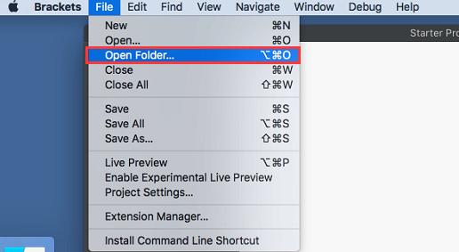
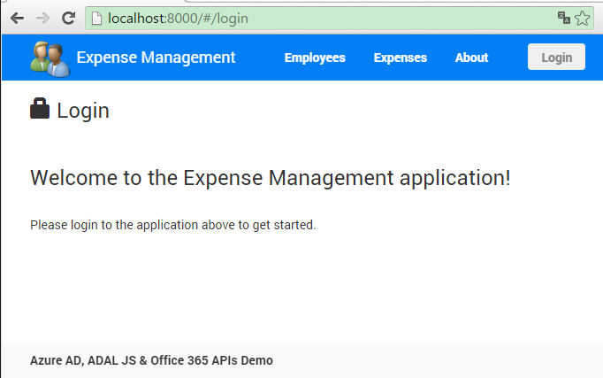
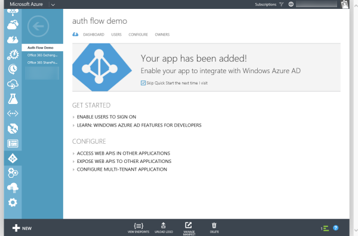
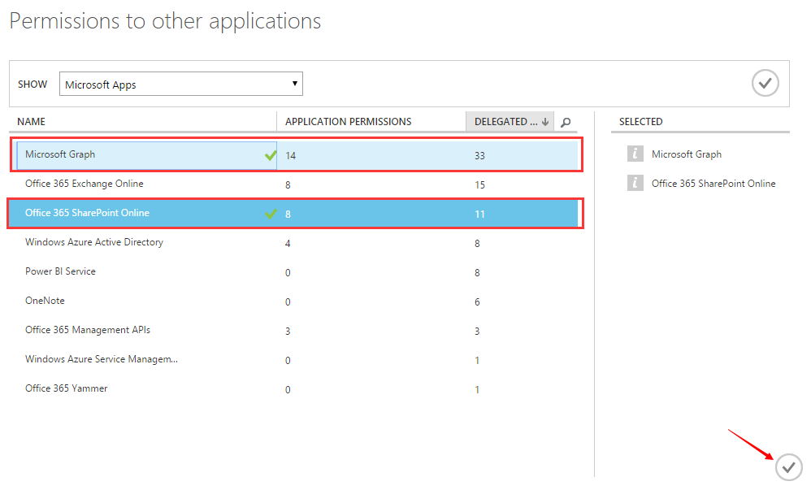
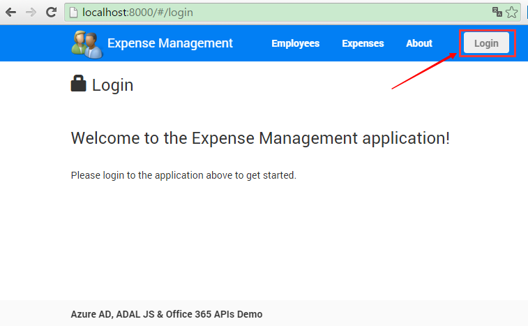

# Creating Client-Side Only Apps with Angular, ADAL & Microsoft Graph
In this lab, you will take an existing web application built with [Angular](http://www.angularjs.org) that uses static JSON files as it's data source and add two things:

- Secure multiple routes in the application using the ADAL JS library for Azure Active Directory to take advantage of the OAuth2 Implicit Flow.
- Replace existing calls to static JSON files to use the SharePoint Online REST & Microsoft Graph, taking advantage of their support for CORS.

The important take-away from this lab is to understand how you can create a 100% client-side application that is secured (with Azure AD) and leverages data in Office 365 using the REST APIs that support CORS.

## Prerequisites
1. You must have an Office 365 tenant to complete this lab. If you do not have one, the lab for **[O3651-7 Setting up your Developer environment in Office 365](https://github.com/OfficeDev/TrainingContent/blob/master/O3651/O3651-5%20Getting%20started%20with%20Office%20365%20APIs/Lab.md)** shows you how to obtain a trial.
1. You must have [node.js](http://nodejs.org/) installed on your development environment. You can get node.js from the [downloads](http://nodejs.org/en/download/) section on their site. Certain [node.js packages](https://www.npmjs.org) available via [NPM](https://www.npmjs.org) will be used in creating this Client-Side only App.
1. You will need [git](http://git-scm.com/) installed, it's a requirement for [bower](http://bower.io). You can get git from the [downloads](http://git-scm.com/downloads) section on their web site.
1. You will need a text editor for this lab. The editor **[Brackets](http://www.brackets.io)** is used in this lab.
1. This lab requires you to use multiple starter files or an entire starter project from the GitHub location. You can either download the whole repo as a zip or clone the repo https://github.com/OfficeDev/TrainingContent.git for those familiar with git.

## Exercise 1: Configure the Starter Project
In this exercise, you will examine and customize the **Starter Project** for the remainder of the lab.

1. Locate the starter project found in the [\\\O3657\O3657-2 Creating Client Side Only Apps with Angular, ADAL and Office 365 APIs\StarterFiles](StarterFiles).
1. Open the project folder in any text editor, such as [Visual Studio Code](https://code.visualstudio.com/) or [Brackets](http://www.brackets.io) or [WebStorm](https://www.jetbrains.com/webstorm/).

    
  
1. Download all NPM packages (used to build & self-host the project) and bower packages (used for external 3rd party script libraries).
  1. Open a command window and navigate to the [\\\O3657\O3657-2 Creating Client Side Only Apps with Angular, ADAL and Office 365 APIs\StarterFiles](StarterFiles) folder.
  1. Enter the following in the command prompt to install requried 3rd party script libraries globally
  
    ````
    npm install -g bower gulp superstatic
    ````
    
  1. Enter the following in the command prompt to download all NPM packages. When it completes it will then download all the bower packages as well.

    ````
    npm install
    ````

    > The command `npm install` will also execute `bower install` to download all bower packages.

1. Test the application by starting up a local web server and navigating to the site. One option is to use a static web server that is built on node.js: [superstatic](https://www.npmjs.org/packages/superstatic).

  Before testing the application you must first compile all the TypeScript to JavaScript. Do this by running the following command from the root of the [\\\O3657\O3657-2 Creating Client Side Only Apps with Angular, ADAL and Office 365 APIs\StarterFiles](StarterFiles) directory:

  ````
  gulp compile-ts
  ````
  
  To start the superstatic web server, enter the following at the command prompt within the root of the [\\\O3657\O3657-2 Creating Client Side Only Apps with Angular, ADAL and Office 365 APIs\StarterFiles](StarterFiles) folder:

  ````
  superstatic --port 8000
  ````

  This will host the site at [http://localhost:8000](http://localhost:8000). The file [superstatic.json](StarterFiles/superstatic.json) configures *superstatic* to load the site starting with `/src` as the web root.
  
    
    
## Exercise 2: Setup the SharePoint Site & OneDrive for Business Dependencies
In this exercise you will create a new SharePoint site with sample data that the app relies on using the pre-built site template & upload some files to your OneDrive for Business account.

First, configure your OneDrive for Business account.

1. Navigate to your OneDrive for Business site which is typically at **https://[tenant]-my.sharepoint.com**.
1. Click the **new** button to create a new folder named **receipts**.
1. Add a bunch of random files to this folder.

Next, upload a new SharePoint site template that contains the sample data for this lab.

1. Navigate to a SharePoint site in your Office 365 tenant.
1. In the upper-right hand corner, click the **cog** icon and select **Site Settings**.
1. Within the **Web Designer Galleries**, click the **Solutions** link.
1. In the ribbon, click the **Upload Solution** button.
1. Upload the file [ExpenseApp.wsp](StarterFiles/ExpenseApp.wsp).
1. After uploading the file, click the **Activate** button to make it available.

Finally, create a SharePoint site with sample data in it using the provided site template.

1. From within the SharePoint site, click the **Site Contents** link in the Quick Launch left-hand navigation. 
1. Scroll to the bottom of the page and click the **new subsite** link.
1. Give the site a title, description and URL name.
1. For the template, click the **Custom** tab and select **ExpenseApp**.
1. Scroll to the bottom of the page and click **Create**.
1. Once the site has been created, copy the root URL of the new site as this will be used later in this lab.

In this exercise you added some content to a OneDrive for Business account and you created a SharePoint site with sample data to test in the remaining of this lab.

## Exercise 3: Setup Azure AD Application
In this exercise you will create an Azure AD application that will be used by the starter project.

1. In a browser navigate to https://manage.windowsazure.com & login.
1. In the left-hand navigation, scroll down to and click on **Active Directory**.
1. Click on the name of your Azure AD directory & then click **Applications** in the toolbar. 

  

1. Click the **Add** button at the bottom of the display.
1. On the **What do you want to do** page, click **Add an application my organization is developing**. This will start the **Add Application** wizard.
1. In the **Add Application** wizard, enter a name of **Auth Flow Demo** and choose the type **Web Application and/or Web API**. Click the arrow to advance to the next page of the wizard.
1. In the **App Properties** page, enter a **SIGN-ON URL** of **http://localhost:8000**

1. Enter an **App ID Uri** of **http://[your-domain].onmicrosoft.com/ExpenseManager**.
  > NOTE: The App ID Uri must be unique within the Azure tenancy. Using a host name that matches your tenant name helps to prevent confusion, and using a value for the path that matches the app name helps to enforce uniqueness. This value can be changed if the app name or purpose changes.
1. Click the **check** image in the lower right of the wizard to create the application. The application **Quick Start** page will display once the application is created.

  

1. Obtain and store the Azure AD tenant ID.
  1. On the **Quick Start** page, expand the **Get Started** / **Enable Users to Sign On**. 
  1. Locate the field **Federation Metadata Document URL**. Within that field value you will see a GUID immediately after the `login.windows.net` part of the URL. 
  1. Copy just the GUID value to the clipboard.

    

1. On the application Quick Start page, click on **CONFIGURE** in the toolbar.
1. Copy the **Client ID** value for later use. You will need this later.
1. Scroll down to the **permissions to other applications** section. 
1. Click **Add application**
  1. In the **Permissions to other applications** dialog, select **Microsoft Graph** and **Office 365 SharePoint Online** and save changes.
  
    
    
  1. In the **Delegated Permissions** dropdown for **Microsoft Graph**, check the following permissions:
  
    - Read user files and files shared with user

  1. In the **Delegated Permissions** dropdown for **Office 365 SharePoint Online**, check the following permissions:
  
    - Read and write items in all site collections

1. Click the **Save** button at the bottom of the page.
1. Configure the application to allow the OAuth2 Implicit Flow:
  1. After saving the app, click the **MANAGE MANIFEST** button in the footer of the page. You will be prompted to upload / download the manifest. Download the manifest file to your desktop. It will be named **[client-id].json**.
  1. Open the manifest in a text editor. Locate the property `oauth2AllowImplicitFlow`.
  1. Set the `oauth2AllowImplicitFlow` property to `true` and save your changes.
  1. Back in the Azure Management Portal, click the **MANAGE MANIFEST** button and select **UPLOAD MANIFEST**.
  1. Select the file you just updated and upload the file.

In this exercise you created an Azure AD application and configured it to support the OAuth implicit flow.

## Exercise 4: Configure Authentication & ADAL JSON
In this exercise you will update the starter project to have a login & logout process as well as secure specific routes in the Angular application for authenticated users.

Install the ADAL JS libraries into the project.

1. Open a command prompt in the root of the [\\\O3657\O3657-2 Creating Client Side Only Apps with Angular, ADAL and Office 365 APIs\StarterFiles](StarterFiles).
1. Run the following command to install ADAL JS into the project:

  ````
  bower install --save adal-angular
  ````

1. Add references to the ADAL JS files to the **/src/index.html** page at the end of the section `<!-- 3rd party libraries -->` found towards the end of the `<body>` section of the page:

  ````html
  <script src="bower_components/adal-angular/dist/adal.min.js"></script>
  <script src="bower_components/adal-angular/dist/adal-angular.min.js"></script>
  ````

You will first create a constants file that will be used to modify the settings for the app in a central location.

1. Create a new file **app.constants.ts** in the **/src/app/expenseApp/** folder.
1. Add the following code to the file:

  ````javascript
  ///<reference path="../../../tools/typings/tsd.d.ts" />
  ///<reference path="../../../tools/typings/expenseApp.d.ts" />

  'use strict';

  module expenseApp {

    var settings:shared.IAdalSettings = {
      tenant:          '', //Update with your tenant ID
      clientId:        '', //Update with your client ID
      aadEndpoints:    {}
    };

    angular.module('expenseApp').constant('settings', settings);

  }
  ````
1. Update the **tenant** & **clientId** values with the values of the Azure AD tenant ID and Azure AD application's client ID that you obtained in the previous exercise.

1. Add two properties to the **settings** object created in this file that point to the root REST endpoint for the Microsoft Graph & SharePoint REST API:

  ````javascript
    baseSPUrl:       '[baseSPUrl]/_api/',
    baseOneDriveUrl: 'https://graph.microsoft.com/v1.0/me',
  ````

  > Note that the above references are used only as placeholders. The **baseSPUrl** property should point to the endpoint of the site that was created by ExpenseApp template in exercise 2. For instance if the site's homepage is https://foo-tenant.sharepoint.com/sites/mvasite, the **baseSPUrl** should be https://foo-tenant.sharepoint.com/sites/mvasite/_api/.

1. Next add name-value pairs for each REST endpoint & it's associated resource ID that the ADAL JS Angular service should monitor to the **aadEndpoints** property. The property name should be the URL of the endpoint and the value should be the resource ID, such as the following:

  ````javascript
  aadEndpoints:    {
    // sharepoint site containing lists
    '[baseSPUrl]/_api/': 'https://[tenant].sharepoint.com',
    // MS Graph API
    'https://graph.microsoft.com/v1.0/me': 'https://graph.microsoft.com/'
  }
  ````
  
  > Note that the above references are used only as placeholders. You need to update **[baseSPUrl]** and **[tenant]** to your values.
  
1. So far **app.constants.ts** looks like following (**[tenant ID]**, **[client ID]**, **[baseSPUrl]** and **[tenant]** are placeholders) :

  ````javascript
  ///<reference path="../../../tools/typings/tsd.d.ts" />
  ///<reference path="../../../tools/typings/expenseApp.d.ts" />

  'use strict';

  module expenseApp {

    var settings:shared.IAdalSettings = {
      tenant:          '[tenant ID]', //Update with your tenant ID
      clientId:        '[client ID]', //Update with your client ID
      aadEndpoints:    {
        // sharepoint site containing lists
        '[baseSPUrl]/_api/': 'https://[tenant].sharepoint.com',
        // MS Graph API
        'https://graph.microsoft.com/v1.0/me': 'https://graph.microsoft.com/'
      },
      baseSPUrl:       '[baseSPUrl]/_api/',
      baseOneDriveUrl: 'https://graph.microsoft.com/v1.0/me',
    };

    angular.module('expenseApp').constant('settings', settings);

  }  
  ````

Next you will configure the ADAL JS Angular service.

1. Create a new file **app.adal.ts** in the **/src/app/expenseApp/** folder.
1. Add the following code to the file:

  ````javascript
  ///<reference path="../../../tools/typings/tsd.d.ts" />
  ///<reference path="../../../tools/typings/expenseApp.d.ts" />

  module expenseApp {
    'use strict';

    export class Adal {
      static configure($httpProvider:ng.IHttpProvider, settings:shared.IAdalSettings, adalProvider) {
        adalProvider.init(
          {
            tenant:                settings.tenant,
            clientId:              settings.clientId,
            postLogoutRedirectUri: 'http://localhost:8000',
            endpoints:             settings.aadEndpoints
          },
          $httpProvider);
      }
    }

  }
  ````

1. Update the TypeScript references in the **/tools/typings/expenseApp.d.ts** file. Do this by running the following command from the root of the project in a command prompt:

  ````
  gulp gen-ts-refs
  ````

1. Configure the app's configuration to call this function that was just added to setup the ADAL JS Angular provider. Open the **app.module.ts** file.
1. In the declaration of the app, add another module to get injected into the app, immediately after injecting `ui.bootstrap`.

  ````javascript
  var app = angular.module('expenseApp', [
      'ngRoute',
      'ngAnimate',
      'wc.directives',
      'ui.bootstrap',
      'AdalAngular']);
  ````

1. Locate the anonymous function that's called by `app.config()`. Add three more services to get injected into this anonymous function so that the opening signature looks like the following code:

  ````javascript
  app.config(['$routeProvider',
              '$httpProvider',
              'settings',
              'adalAuthenticationServiceProvider',
    function($routeProvider:ng.route.IRouteProvider,
             $httpProvider:ng.IHttpProvider,
             settings:expenseApp.shared.IAdalSettings,
             adalProvider):void { 

      expenseApp.Routes.configure($routeProvider);

    }]);
  ````

1. Finally, add a call to the anonymous function, immediately after the route configuration line, to call the ADAL JS configuration:

  ````javascript
  expenseApp.Adal.configure($httpProvider, settings, adalProvider);
  ````

1. With these two new files added, add references to them in the **index.html** file so they are loaded with the app loads. Open the **/src/index.html** file.
2. Add the following two references to the added files just after the reference to `app.module.js` in the `<!-- Custom scripts -->` section of the page:

  ````html
  <script src="js/expenseApp/app.adal.js"></script>
  <script src="js/expenseApp/app.constants.js"></script>
  ````

Finally, configure specific routes so they trigger ADAL JS to authenticate the user.

1. Open the **/src/app/expenseApp/app.routes.ts** file.
1. Add the following property to all the routes listed in this file, except the **login** & **about** route, to force authentication on them:

  ````javascript
  requireADLogin: true
  ````

  So that route file looks like this:

  ````javascript
  ///<reference path="../../../tools/typings/tsd.d.ts" />
  ///<reference path="../../../tools/typings/expenseApp.d.ts" />

  module expenseApp {
    'use strict';

    export class Routes {
      static configure($routeProvider:ng.route.IRouteProvider) {
        var viewBase:string = 'app/expenseApp/views/';

        $routeProvider
          .when('/login', {
            controller:   'expenseApp.LoginController',
            templateUrl:  viewBase + 'login.html',
            controllerAs: 'vm'
          })
          .when('/employees', {
            controller:     'expenseApp.employees.EmployeesController',
            templateUrl:    viewBase + 'employees/employees.html',
            controllerAs:   'vm',
            requireADLogin: true
          } as ng.route.IRoute)
          .when('/employeeExpenses/:employeeId', {
            controller:     'expenseApp.employees.EmployeeExpensesController',
            templateUrl:    viewBase + 'employees/employeeExpenses.html',
            controllerAs:   'vm',
            requireADLogin: true
          } as ng.route.IRoute)
          .when('/employeeEdit/:employeeId', {
            controller:     'expenseApp.employees.EmployeeEditController',
            templateUrl:    viewBase + 'employees/employeeEdit.html',
            controllerAs:   'vm',
            requireADLogin: true
          } as ng.route.IRoute)
          .when('/expenses', {
            controller:     'expenseApp.expenses.ExpensesController',
            templateUrl:    viewBase + 'expenses/expenses.html',
            controllerAs:   'vm',
            requireADLogin: true
          } as ng.route.IRoute)
          .when('/expensesAttachReceipt/:employeeId/:expenseId', {
            templateUrl:    viewBase + 'expenses/expensesAttachReceipt.html',
            controller:     'expenseApp.expenses.ExpenseReceiptController',
            controllerAs:   'vm',
            requireADLogin: true
          } as ng.route.IRoute)
          .when('/about', {
            controller:  'expenseApp.AboutController',
            templateUrl: viewBase + 'about.html'
          })
          .otherwise({redirectTo: '/login'});
      }
    }
  }
  ````

Next, update the controller used in the top navigation to add login/logout capabilities.

1. Open the **/src/app/expenseApp/controllers/navbar.controller.ts**.
1. Add `adalAuthenticationService` to the list of services being injected:

  ````javascript
  static $inject = ['$scope',
                    '$location',
                    '$window',
                    'adalAuthenticationService'];
  ````

1. Add this service to the class constructor:

  ````javascript
  constructor(private $scope:ng.IScope,
                  private $location:ng.ILocationService,
                  private $window:ng.IWindowService,
                  private adalService)
  ````

1. Update the class constructor as following to monitor the `isAuthenticated` property from the ADAL JS Angular service so that when it changes, certain properties are updated:

  ````javascript
  constructor(private $scope:ng.IScope,
                  private $location:ng.ILocationService,
                  private $window:ng.IWindowService,
                  private adalService) {
        $scope.$watch(() => {
        return this.adalService.userInfo.isAuthenticated;
        }, (loggedIn) => {
        console.log('isAuthenticated changed: ' + loggedIn);
        this.changeLoginStatus(loggedIn);
        });

        this.isLoggedIn = this.adalService.userInfo.isAuthenticated;

        if (!this.isLoggedIn) {
        this.$location.path('/login');
        }                      
    }
  ````

1. Next, update the two methods `login()` & `logout()` to make them do something instead of the empty methods they currently are set to:

  ````javascript
    logout() {
      this.adalService.logOut();
      this.changeLoginStatus(false);
      this.$location.path('/login');
    }

    login() {
      this.adalService.login();
    }
  ````

1. Save all your changes.
1. Before testing the application you must first compile all the TypeScript to JavaScript. Do this by running the following command from the root of the [\\\O3657\O3657-2 Creating Client Side Only Apps with Angular, ADAL and Office 365 APIs\StarterFiles](StarterFiles) directory:

  ````
  gulp compile-ts
  ````

1. Test the app by starting the server. To start the superstatic web server, enter the following at the command prompt within the root of the [\\\O3657\O3657-2 Creating Client Side Only Apps with Angular, ADAL and Office 365 APIs\StarterFiles](StarterFiles) folder:

  ````
  superstatic --port 8000
  ````

In this exercise you added authentication, login & logout controls to the Angular app using the ADAL JS Angular provided service.

  

## Exercise 5: Utilize Microsoft Graph & SharePoint Online REST Services
In this exercise you will create a SharePoint site using the provided site template that includes sample data. After creating the site, you will update the starter app to use the live services in Office 365 & SharePoint Online instead of the static sample files.

Now update the **files.service.ts** Angular service to call the Microsoft Graph to get Files.

1. Open the **/src/app/expenseApp/services/files.services.ts** file.
1. Update the items injected into the service to inject the **settings** object. Do this by updating the list of things injected as well as the class constructor:

  ````javascript
    static $inject = ['$http',
                      '$q',
                      '$window',
                      '$location',
                      '$timeout',
                      'settings'];

    constructor(private $http:ng.IHttpService,
                private $q:ng.IQService,
                private $window:ng.IWindowService,
                private $location:ng.ILocationService,
                private $timeout:ng.ITimeoutService,
                private settings) { }
  ````

1. Within the constructor, update the line that sets the **baseSPUrl** property on the service to use the value from the **settings** instead of a static URL:

  ````javascript
  this.baseSPUrl = settings.baseSPUrl;
  ````

1. Within the function **getUserFiles()**, update the line that sets the HTTP endpoint for the request to not use the local static JSON file and instead use the real service:

  ````javascript
  var endpoint = this.settings.baseOneDriveUrl + '/drive/root:/receipts:/children';
  ````

1. Within the function **getReceiptsFolderPath()**, update the line that sets the HTTP endpoint for the request to not use the local static JSON file and instead use the real service:

  ````javascript
  var endpoint = this.settings.baseOneDriveUrl + '/drive/root:/receipts?$select=webUrl';
  ````

Next, update the **data.service.ts** Angular service to call the live SharePoint REST API:

1. Open the **/src/app/expenseApp/services/data.services.ts** file.
2. Update the items injected into the service to inject the **settings** object. Do this by updating the list of things injected as well as the class constructor. Also update the constructor to use the real base URL of the SharePoint site rather than the static value in the starter project:

  ````javascript
  static $inject = ['$http',
                    '$q',
                    '$window',
                    '$location',
                    '$timeout',
                    'settings'];

  constructor(private $http:ng.IHttpService,
                private $q:ng.IQService,
                private $window:ng.IWindowService,
                private $location:ng.ILocationService,
                private $timeout:ng.ITimeoutService,
                private settings) {

  this.baseSPUrl = settings.baseSPUrl;
  }
  ````

1. Locate the method **getEmployeesAndExpenses()**. Update the two lines that create the two HTTP endpoints that will be queried to create dynamic endpoints instead of the static JSON file endpoints:

  ````javascript
  var employeeEndpoint = this.baseSPListsUrl +
                                'getByTitle(\'Employees\')/items?' +
                                '$select=ID,FirstName,LastName&' +
                                '$orderby=LastName,FirstName';
  var empsPromise = this.$http.get(employeeEndpoint, this.getOptions);

  var expenseEndpoint = this.baseSPListsUrl +
                                'getByTitle(\'Expenses\')/items?' +
                                '$select=ID,Amount,Created,ExpenseCategory,Title,Receipt,Employee/Id' +
                                '&$expand=Employee/Id';
  var expensesPromise = this.$http.get(expenseEndpoint, this.getOptions);
  ````

1. Locate the **getEmployeesSummary()**. Update the endpoint to be dynamic rather than using the static JSON file endpoint:

  ````javascript
  var url = this.baseSPListsUrl +
                    'getByTitle(\'Employees\')/items?' +
                    '$select=ID,FirstName,LastName,Address,City,State,Zip,Email,Gender' +
                    '&$orderby=LastName,FirstName';
  ````

1. Locate the **getStates()**. Update the endpoint to be dynamic rather than using the static JSON file endpoint:

  ````javascript
  var url = this.baseSPListsUrl +
              'getByTitle(\'States\')/items?' +
              '$select=Title&' +
              '$orderby=Title';
  ````

1. Locate the **getEmployee()**. Update the endpoint to be dynamic rather than using the static JSON file endpoint:

  ````javascript
  var url = this.baseSPListsUrl +
                'getByTitle(\'Employees\')/items(' + id + ')?' +
                '$select=ID,FirstName,LastName,Address,City,State,Zip,Email,Gender';
  ````

1. Locate the **getExpense()**. Update the endpoint to be dynamic rather than using the static JSON file endpoint:

  ````javascript
  var url = this.baseSPListsUrl +
                    'getByTitle(\'Expenses\')/items(' + id + ')?' +
                    '$select=ID,Amount,Created,ExpenseCategory,Title,Receipt';
  ````

1. Locate the **getEmployeeExpenses()**. Update the endpoint to be dynamic rather than using the static JSON file endpoint:

  ````javascript
  var url = this.baseSPListsUrl +
                    'getByTitle(\'Expenses\')/items?' +
                    '$select=ID,Amount,Created,ExpenseCategory,Title,Receipt' +
                    '&$filter=Employee eq ' + id;
  ````

1. Locate the **insertEmployee()**. Find the line that sets the value of the **baseUrl** variable. Update it to be dynamic:

  ````javascript
  var baseUrl:string = this.baseSPListsUrl + 'getByTitle(\'Employees\')/items';
  ````

1. Locate the **getPagedResource()*, then locate the line that starts with `this.$http.get` where it is getting a static JSON file representing the item count. Update the endpoint to be dynamic rather than using the static JSON file endpoint:

  ````javascript
  this.$http.get(this.baseSPListsUrl + 'getByTitle(\'Employees\')/itemcount', this.getOptions)
  ````

1. Save all your changes.
1. Before testing the application you must first compile all the TypeScript to JavaScript. Do this by running the following command from the root of the [\\\O3657\O3657-2 Creating Client Side Only Apps with Angular, ADAL and Office 365 APIs\StarterFiles](StarterFiles) directory:

  ````
  gulp compile-ts
  ````

1. Test the app by starting the server. To start the superstatic web server, enter the following at the command prompt within the root of the [\\\O3657\O3657-2 Creating Client Side Only Apps with Angular, ADAL and Office 365 APIs\StarterFiles](StarterFiles) folder:

  ````
  superstatic --port 8000
  ````

  This will host the site at [http://localhost:8000](http://localhost:8000). The file [superstatic.json](StarterFiles/superstatic.json) configures *superstatic* to load the site starting with `/src` as the web root.

  Login to the application and click the through the Employees and Expenses section to see the application getting live data from SharePoint Online & OneDrive for Business.

In this exercise you updated the application to get data from the live SharePoint Online REST API & the Microsoft Graph.