# Creating Office Add-ins for Excel
In this lab, you will create an Office Add-in and test it within the Excel Web client. Once the add-in is finished it will run within all other Excel clients on desktop, mobile and web clients where Office Add-ins for Excel are supported.

The add-in that you will build in this application will be installed Excel's as a custom task pane. It will allow you to filter products by supplier and/or category. You can then select products from the filtered list & add them to the currently open spreadsheet. 

## Prerequisites
1. You must have an Office 365 tenant complete this lab. If you do not have one, the lab for **[O3651-7 Setting up your Developer environment in Office 365](https://github.com/OfficeDev/TrainingContent/blob/master/O3651/O3651-5%20Getting%20started%20with%20Office%20365%20APIs/Lab.md)** shows you how to obtain a trial.
1. You must have [node.js](http://nodejs.org/) installed on your development environment. You can get node.js from the [downloads](https://nodejs.org/en/download/) section on their site. Certain [node.js packages](https://www.npmjs.org) available via [NPM](https://www.npmjs.org) will be used in creating this Office Add-in.
1. You will need a text editor for this lab. The editor **[Brackets](http://www.brackets.io)** is used in this lab.
1. This lab requires you to use multiple starter files or an entire starter project from the GitHub location. You can either download the whole repo as a zip or clone the repo https://github.com/OfficeDev/TrainingContent.git for those familiar with git.
5. You will also need to install Git with the ability to execute from the command line.  
6. Additionally, you may need to add Git to your computer's PATH environment variable.
7. Ensure that **bower** is installed in your project folder.  To install bower, run

  ````
    $ npm install bower
    ````

## Exercise 1: Configure the Starter Project
In this exercise, you will examine and customize the **Starter Project** for the remainder of the lab.

  > The scaffolding of this starter project is created by [YO OFFICE](https://github.com/OfficeDev/generator-office). It's a template for [Yeoman](http://yeoman.io) generator. To simplify this demo, some files were changed. For instance, the default angular view was removed from **index.html**.

1. Launch **Brackets**.
1. Within **Brackets**, use the menu to select **File &raquo; Open Folder**.
1. Locate the [\\\O3657\O3657-4 Building Office Apps for Excel Using Angular and Material Design\Starter Project](Starter Project) folder within this lab in the dialog, select it and click **Open**.
1. Within Brackets, open the `bower.json` file. This file contains all the [bower](http://www.bower.io) packages that will be used in the application, found in the **dependencies** section of the file, update as below:

  ````javascript
  "dependencies": {
    "microsoft.office.js": "*",
    "angular": "~1.4.4",
    "angular-route": "~1.4.4",
    "angular-sanitize": "~1.4.4",
    "angular-material": "~1.0.1"
  }  
  ````
  
  >1. **microsoft.office.js**: Office Add-ins related assets provided by Microsoft.
  >1. **angular-***: Various Angular modules.
  >1. **angular-material**: The Angular implementation of Material Design that will be used to easily style the application.

1. Download all dependent node & bower packages listed in the `package.json` & `bower.json` files. The NPM `package.json` file has a script in it that will automatically run the bower download.
  1. Open a **Terminal** window (on OS X) or **Command Prompt** (on Windows).
  1. Navigate to the root folder of the **Starter Project** located at [\\\O3657\O3657-4 Building Office Apps for Excel Using Angular and Material Design\Starter Project](Starter Project) in the Terminal window.
  
      
  
  1. Run the following command to download all packages. This will create a new folder `node_modules` in the **Starter Project** located at [\\\O3657\O3657-4 Building Office Apps for Excel Using Angular and Material Design\Starter Project](Starter Project).

    ````
    $ npm install
    ````

    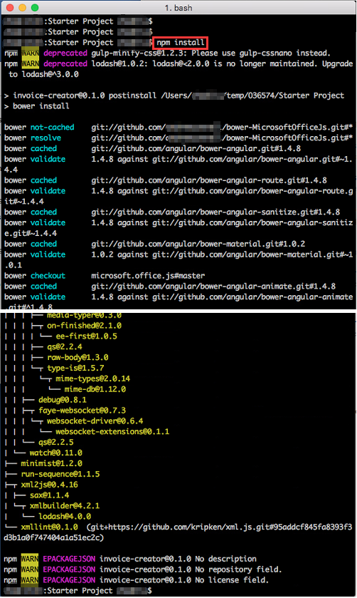    

6. At the prompt to choose a suitable version of angular, select **2**.

    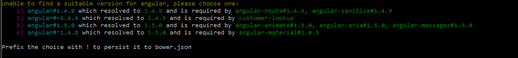

1. Now test to make sure the sample add-in is working.
  1. From the command line, ensure you are in the root of the **Starter Project** folder located at [\\\O3657\O3657-4 Building Office Apps for Excel Using Angular and Material Design\Starter Project](Starter Project) and enter the following command to start the web server:

    ````
    $ gulp serve-static
    ````

  1. Open a browser and navigate to **https://localhost:8443/index.html**. Ignore any certificate warnings & errors the browser may display.
    1. You should see a page that displays a single rendered HTML `<h1>` tag: **Invoice Creator**.
  
    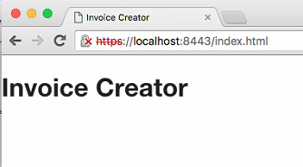
  1. This HTTPS server used a self-signed SSL cert. Follow this [document](https://github.com/OfficeDev/generator-office/blob/master/docs/trust-self-signed-cert.md) to add self-signed certificate as trusted root certificate. 
  
    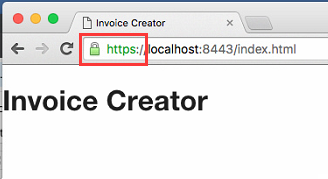
  1. Stop the web server by pressing `CTRL+C` in Terminal.

In this exercise you downloaded all external package dependencies and tested the local web server that will host the Office Add-in for Excel.

## Exercise 2: Create Skeleton of an Office Add-in for Excel
In this exercise you will, deploy & test a skeleton implementation of the Office Add-in for Excel.

1. Update the add-in manifest that will be used to install the add-in into your Excel instance.

  > NOTE: Refer to MSDN for full documentation on an add-in's manifest file: **[MSDN - Understanding the add-ins for Office XML manifest](https://msdn.microsoft.com/EN-US/library/office/fp161044.aspx)**

  1. Open the [`manifest-invoice-creator.xml`](Starter Project/manifest-invoice-creator.xml) file in the **Starter Project**'s root folder located at [\\\O3657\O3657-4 Building Office Apps for Excel Using Angular and Material Design\Starter Project](Starter Project). It's generated by [YO OFFICE](https://github.com/OfficeDev/generator-office).
  1. Locate the `<OfficeApp>` element. Set the attribute `xsi:type` to `xsi:type="TaskPaneApp"` to define this as a task pane add-in.

    > The other types of add-ins are content and mail add-ins.
  
  1. Locate the element `<ProviderName>` and set it to your name. This is the name of the author of the add-in:

    ````xml
    <ProviderName>OfficeDev</ProviderName>
    ````

  1. Locate the `<DisplayName>`, `<Description>` and `<IconUrl>` elements. These are used in the marketing and branding of the add-in. 
  
    Update them to similar values which follows:

    ````xml
    <DisplayName DefaultValue="Invoice Creator"/>
    <Description DefaultValue="Add products to a spreadsheet to create an invoice." />
    <IconUrl DefaultValue="https://localhost:8443/content/OfficeDev.png"/>
    ````

  1. Save your changes.

1. You first have to add the add-in to your Office 365's App Catalog.
  1. Using the browser, navigate to https://portal.office.com/Admin/Default.aspx and login to your Office 365 developer tenant.
  1. In the left-hand navigation, at the bottom select the **Admin &raquo; SharePoint** menu item.
  1. When the **SharePoint Admin Center** page loads, select the **Apps** option in the left-hand menu.
  1. Then select the **App Catalog** link.

    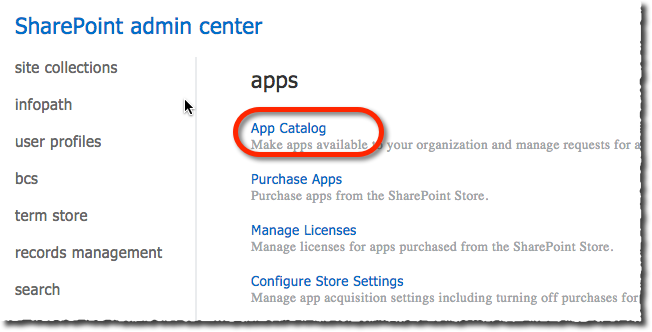

    > If you do not already have an app catalog you will need to run through the process of creating one. The name & URL of the catalog, while required fields, are not important.

  1. Within the **App Catalog** SharePoint site, select the **Apps for Office** link in the left-hand menu.

  1. Click the **Upload** link and upload the file **manifest-invoice-creator.xml** file.

    Now the add-in has been loaded into the app catalog. 

1. Add the add-in into a new spreadsheet.
  1. Using the browser, navigate to your default SharePoint team site.
  1. Click the **Documents** link in the left-hand menu.

    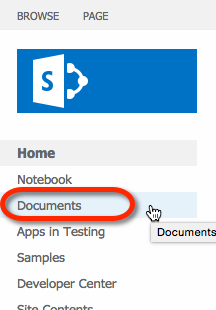

  1. Create a new workbook by selecting the **New** link and then selecting **Excel workbook**.

    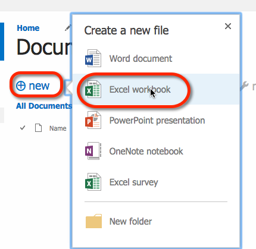

  1. After the workbook loads, click the **Insert** tab in the ribbon.
  1. Click the **Office Add-ins** button in the ribbon.

    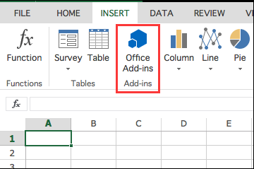

  1. A dialog will open and show you a list of all available add-ins you can add to the workbook. Find the one you previously created, select it and click **Insert**.

    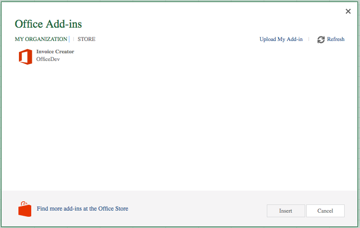

1. Test the Office Add-in for Excel.
  1. Start the local server that is hosting the application.
    1. Within Terminal, navigate to the **src** folder within the **Starter Project** folder located at [\\\O3657\O3657-4 Building Office Apps for Excel Using Angular and Material Design\Starter Project](Starter Project).
    1. Enter the following to start the server:

      ````
      $ gulp serve-static
      ````

  1. Go back to the browser where you are logged into the Excel web client. If you are no longer logged in, repeat the login process & open the spreadsheet you created.
  1. Do a hard-refresh of the browser to clear the cache. 
  1. After a few seconds, you should notice the add-in loads in the right margin of the workbook.
  
    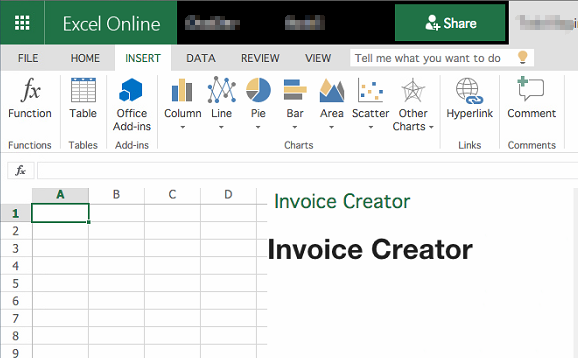
  
  1. Stop the web server by pressing `CTRL+C` in Terminal.

In this exercise you created a skeleton of the Office Add-in for Excel and got it working within Excel. 

## Exercise 3: Implement the Office Add-in for Excel.
In this exercise you will update the Angular part of the application to enable functionality on the add-in.

1. Update the Angular application:
  1. Open **app.module.js** in the **src/app** folder
  1. Add dependency `ngAnimate` and `ngMaterial` modules to `officeAddin` module.
  
    ````javascript
    var officeAddin = angular.module('officeAddin', [
        'ngRoute',
        'ngSanitize',
        'ngAnimate',
        'ngMaterial'
    ]);
    ````
   
  1. Update `officeAddin.config()` method, set it to use `$mdThemingProvider`, configures the Material Design theme to use and forces the route service to initialize:

    ````javascript
    officeAddin.config(['$logProvider', '$mdThemingProvider', function ($logProvider, $mdThemingProvider) {
        // set debug logging to on
        if ($logProvider.debugEnabled) {
            $logProvider.debugEnabled(true);
        }

        // configure theme color
        $mdThemingProvider.theme('default')
            .primaryPalette('green');
    }]);
    ````

1. Define navigation routes for the application:
  1. Open **app.routes.js** in the **src/app** folder 
  1. Update routes as following. This creates a route in our application and remove default `homeController`:

    ````javascript
    function routeConfigurator($routeProvider) {
        $routeProvider.when('/', {
            templateUrl:  'app/products/products.html',
            controller:   'productsController',
            controllerAs: 'vm'
        });
        $routeProvider.otherwise({redirectTo: '/'});
    }
    ````

1. Create the only view for the products screen in the application:
  1. Create a new folder named **products** within the **src/app** folder in the **Starter Project** located at [\\\O3657\O3657-4 Building Office Apps for Excel Using Angular and Material Design\Starter Project](Starter Project).
  1. Add a new file to the **products** folder named **products.html**.
  1. Add the following code to the **products.html** file. This will be the view for the product list screen:

    ````html
    <md-toolbar class="md-primary">
      <h5>Filter Product List</h5>
    </md-toolbar>

    <md-select data-ng-model="vm.selectedSupplier" placeholder="filter on supplier">
      <md-select-label>{{ vm.selectedSupplier ? 'filtering by ' + vm.selectedSupplier.CompanyName : 'filter by supplier' }}</md-select-label>
      <md-option data-ng-value="item" data-ng-repeat="item in vm.suppliers">{{item.CompanyName}}</md-option>
    </md-select>

    <md-select data-ng-model="vm.selectedCategory" placeholder="filter on category">
      <md-select-label>{{ vm.selectedCategory ? 'filtering by ' + vm.selectedCategory.CategoryName : 'filter by category' }}</md-select-label>
      <md-option data-ng-value="item" data-ng-repeat="item in vm.categories">{{item.CategoryName}}</md-option>
    </md-select>

    <button data-ng-click="vm.clearFilters()">clear filters</button>
    <button data-ng-click="vm.addProducts()">add products</button>

    <md-toolbar class="md-primary">
      <h5>Products</h5>
    </md-toolbar>

    <md-list>
      <md-item data-ng-repeat="product in vm.products">
        <md-item-content>
          <div>
            <md-checkbox data-ng-model="product.isSelected" class="md-primary" aria-label="product.ProductName"></md-checkbox>
          </div>
          <div class="md-tile-content">
            <h3>{{product.ProductName}}</h3>
          </div>
        </md-item-content>
      </md-item>
    </md-list>
    ````

1. Now create the controller for the view. Add a new file to the **products** folder named **products.controller.js**.
  1. Add the following code to the **products.controller.js** file. This will be the controller for our products view. Notice it will use one service we have yet to define. 

    ````javascript
    (function () {
        'use strict';

        angular.module('officeAddin')
            .controller('productsController',
            ['$scope', '$q', 'productService', productsController]);

        /**
         * Controller constructor.
        */
        function productsController($scope, $q, productService) {
            var vm = this;

            // suppliers
            vm.suppliers = [];
            vm.selectedSupplier = undefined;
            // categories
            vm.categories = [];
            vm.selectedCategory = undefined;
            // products
            vm.products = [];

            vm.clearFilters = clearFilters;
            vm.addProducts = addProducts;
            vm.refreshProductList = refreshProductList;

        /** *********************************************************** */

            init();

        }
    })();
    ````

  1. Add the following code to `function productsController($scope, $q, productService)` in **products.controller.js** file that will load the filter values and attach Angular watchers to react to changes in the filter controls:

    ````javascript
    /**
     * Initialize the controller.
     */
    function init() {
        // start by loading suppliers
        loadSuppliers()
            .then(function (suppliers) {
                vm.suppliers = suppliers;

                // then load categories
                return loadCategories();
            })
            .then(function (categories) {
                vm.categories = categories;

                // finally load products
                return refreshProductList();
            });

        // setup listeners to filter changes
        $scope.$watch('vm.selectedSupplier', function (newValue, oldValue) {
            console.log('supplier changed to ' + newValue);
            refreshProductList();
        });
        $scope.$watch('vm.selectedCategory', function (newValue, oldValue) {
            console.log('category changed to ' + newValue);
            refreshProductList();
        });
    }
    ````

  1. Next, add the following code to `function productsController($scope, $q, productService)` in **products.controller.js** file to load the values for the filter controls:

    ````javascript
    /**
     * Loads the suppliers.
     */
    function loadSuppliers() {
        var deferred = $q.defer();

        productService.getSuppliers()
            .then(function (results) {
                deferred.resolve(results);
            });

        return deferred.promise;
    }

    /**
     * Loads the categories.
     */
    function loadCategories() {
        var deferred = $q.defer();

        productService.getCategories()
            .then(function (results) {
                deferred.resolve(results);
            });

        return deferred.promise;
    }
    ````

  1. Add the following code to `function productsController($scope, $q, productService)` in **products.controller.js** file to refresh the product list when the filters change and to reset the filters.

    ````javascript
    /**
     * Refreshes the product list when things change.
     */
    function refreshProductList() {
        loadProducts()
            .then(function (results) {
                vm.products = results;
            });
    }

    function clearFilters(){
        vm.selectedSupplier = undefined;
        vm.selectedCategory = undefined;
    }
    ````

  1. Now add the following code to `function productsController($scope, $q, productService)` in **products.controller.js** file to load the products into the bindable property:

    ````javascript
    /**
     * Loads the products.
     */
    function loadProducts() {
        var deferred = $q.defer();

        productService.getProducts(vm.selectedSupplier, vm.selectedCategory)
            .then(function (results) {
                deferred.resolve(results);
            });

        return deferred.promise;
    }
    ````

  1. Finally, add the following code to `function productsController($scope, $q, productService)` in **products.controller.js** file that will take the selected products in the list and add them to the spreadsheet:
  
    ````javascript
    function addProducts(){
        var results = [];

        vm.products.forEach(function(element){
            if (element.isSelected){
            results.push(element);
            }
        });

        console.log('selected products',results);

        // build data to write out
        var spreadsheetData = [];
        results.forEach(function(product){
            var lineItem = [];
            lineItem.push(product.ProductID);
            lineItem.push(product.ProductName);
            lineItem.push(product.QuantityPerUnit);
            lineItem.push(product.UnitPrice);
            lineItem.push(product.Discontinued);

            spreadsheetData.push(lineItem);
        });

        Office.context.document.bindings.addFromNamedItemAsync('A1:E' + spreadsheetData.length, 'matrix', {id:'invoiceLineItems'}, function (asyncResult) {
            if (asyncResult.status == Office.AsyncResultStatus.Succeeded) {
            // add the data
            Office.select('bindings#invoiceLineItems').setDataAsync(spreadsheetData, {coercionType:'matrix'}, function(asyncResult){
            });
            }
        });
    }
    ````

  > Refer to MSDN for additional API documentation on creating Excel task pane add-ins using the Office.js runtime: **[MSDN - Bind to regions in a document or spreadsheet](https://msdn.microsoft.com/EN-US/library/office/fp123511.aspx)**.

1. Add a new service, **productService** that will be used to get the data from the fake product data source Excel.
  1. Create a new folder named **services** within the **src/app** folder in the **Starter Project** located at [\\\O3657\O3657-4 Building Office Apps for Excel Using Angular and Material Design\Starter Project](Starter Project).
  1. Add a new file to the **services** folder named **productService.js**.
  1. Add the following code to the **productService.js** file:

    ````javascript
    (function () {
        'use strict';

        angular.module('officeAddin')
            .service('productService', ['$q', '$http', productService]);

        /**
         * Custom Angular service that talks to a static JSON file simulating a REST API.
        */
        function productService($q, $http) {
            // public signature of the service
            return {
                getSuppliers: getSuppliers,
                getCategories: getCategories,
                getProducts: getProducts
            };

        /** *********************************************************** */

        }
    })();
    ````

  1. Add the following code to `function productService($q, $http)` in **productService.js** file to load the categories from the static JSON file:

    ````javascript
    /**
     * Retrieves categories from resource.
     */
    function getCategories() {
        var deferred = $q.defer();

        // fetch data
        var endpoint = '/content/categories.json';

        // execute query
        $http({
            method: 'GET',
            url: endpoint
        }).success(function (response) {
            var results = response.d.results;

            // sort alpha
            results.sort(function (a, b) {
                if (a.CategoryName > b.CategoryName) {
                    return 1;
                } else if (a.CategoryName < b.CategoryName) {
                    return -1;
                } else {
                    return 0;
                }
            });
            deferred.resolve(results);
        }).error(function (error) {
            deferred.reject(error);
        });

        return deferred.promise;
    }
    ````

  1. Add the following code to `function productService($q, $http)` in **productService.js** file to load the suppliers from the static JSON file:

    ````javascript
    /**
     * Retrieves suppliers from resource.
     */
    function getSuppliers() {
        var deferred = $q.defer();

        // fetch data
        var endpoint = '/content/suppliers.json';

        // execute query
        $http({
            method: 'GET',
            url: endpoint
        }).success(function (response) {
            var results = response.d.results;

            // sort alpha
            results.sort(function (a, b) {
                if (a.CompanyName > b.CompanyName) {
                    return 1;
                } else if (a.CompanyName < b.CompanyName) {
                    return -1;
                } else {
                    return 0;
                }
            });

            deferred.resolve(results);
        }).error(function (error) {
            deferred.reject(error);
        });
        return deferred.promise;
    }
    ````

  1. Add the following code to `function productService($q, $http)` in **productService.js** file to load the products from the static JSON file:

    ````javascript
    /**
     * Retrieves products, filtered accordingly, from the resource.
     */
    function getProducts(supplierFilter, categoryFilter) {
        var deferred = $q.defer();

        // fetch data
        var endpoint = '/content/products.json';

        // execute query
        $http({
            method: 'GET',
            url: endpoint
        }).success(function (response) {
            var results = [];

            // if filters provided, filter
            if (!supplierFilter && !categoryFilter) {
                results = response.d.results;
            } else {
            // filter the results
                results = filterProducts(response.d.results, supplierFilter, categoryFilter);
            }

            // sort alpha
            results.sort(function (a, b) {
                if (a.ProductName > b.ProductName) {
                    return 1;
                } else if (a.ProductName < b.ProductName) {
                    return -1;
                } else {
                    return 0;
                }
            });

            deferred.resolve(results);
        }).error(function (error) {
            deferred.reject(error);
        });

        return deferred.promise;
    }
    ````

  1. Add the following code to `function productService($q, $http)` in **productService.js** file to apply the filters specified to the products retrieved from the JSON file:

    ````javascript
    /**
     * Filter the products collection based on specified criteria.
     * @param allProducts                 Collection of all products.
     * @param supplierFilter              Supplier filter to apply.
     * @param categoryFilter              Category filter to apply.
     * @returns results {Array<object>}   Matching products.
     */
    function filterProducts(allProducts, supplierFilter, categoryFilter) {
        var results = [];

        allProducts.forEach(function (product) {
            var supplierMatch = true,
            categoryMatch = true;

            // supplier filter
            if (supplierFilter && supplierFilter.SupplierID) {
                if (supplierFilter.SupplierID != product.SupplierID) {
                    supplierMatch = false;
                }
            }
            // category filters
            if (categoryFilter && categoryFilter.CategoryID) {
                if (categoryFilter.CategoryID != product.CategoryID) {
                    categoryMatch = false;
                }
            }

            // if match, add to collection
            if (supplierMatch && categoryMatch) {
                results.push(product);
            }
        });

        return results;
    }
    ````

1. Now update the homepage of our site to add the necessary Angular bits.
  1. Open the **index.html** file in the **src/app** folder within the **Starter Project** located at [\\\O3657\O3657-4 Building Office Apps for Excel Using Angular and Material Design\Starter Project](Starter Project).
  1. Remove `<h1>Invoice Creator</h1>`
  1. Add the following HTML tag to the body of the page to create a place for our views to get swapped in and out by Angular:

    ````html
    <div data-ng-view class="shuffle-animation"></div>
    ````

  1. Finally, add the following JavaScript references immediately after the other script references at the bottom of the page:

    ````html
    <!-- app code -->
    <script src="app/app.module.js" type="application/javascript"></script>
    <script src="app/app.routes.js" type="application/javascript"></script>
    <!-- services -->
    <script src="app/services/productService.js" type="application/javascript"></script>
    <!-- contollers -->
    <script src="app/products/products.controller.js" type="application/javascript"></script>
    ````

1. Test the Office Add-in for Excel.
  1. Start the local server that is hosting the application.
    1. From the command line, navigate to the **src** folder within the **Starter Project** folder located at [\\\O3657\O3657-4 Building Office Apps for Excel Using Angular and Material Design\Starter Project](Starter Project).
    1. Enter the following to start the server:

      ````
      $ gulp serve-static
      ````

  1. Go back to the browser where you are logged into the Excel web client. If you are no longer logged in, repeat the login process & open the spreadsheet you created.
  1. Do a hard-refresh of the browser to clear the cache. 
  1. Notice how you can now apply filters based on the supplier or category and the product list changes.

    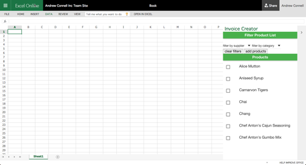

    Now select a few products and click the **Add Products** button to see them get added to the spreadsheet:

    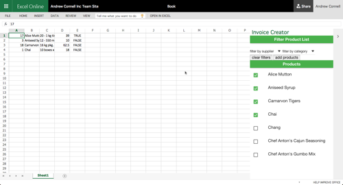

  1. Stop the web server by pressing `CTRL+C` in Terminal.

Congratulations! You have now created your first Office Add-in for Excel.

> The next step would be to take this add-in and deploy it to the public Office store to provide it to other users. Please refer to the course [O3655](https://github.com/OfficeDev/TrainingContent/tree/master/O3655) in the OfficeDev GitHub account for more information.