#Module 6 - Site Collection and Site Provisioning Using CAM

###Lab Environment
During this lab, you will work in your own environment with your own Office365 tenant. Following pre-requisites should be completed or be available before you start the lab.

###Prerequisites

The required prerequisite for this course are:

* Basic skill set on managing Office365
* Access to an Office365 tenant with an existing developer site. (The [pre-requisite lab](../O3658-0 Requesting Office365 Trial Tenant/Lab.md) provides directions to complete this task.)
* Visual Studio 2013 Ultimate with Azure SDK v2.5
* Ensure you have configured a local NuGet package repository: [Screenshot of the previous step](http://www.mbgreen.com/blog/2014/8/8/sharepoint-2013-apps-fail-on-nuget-package-restore)
* Access to an existing Windows Azure tenant (to be used as the hosting platform for applications that are installed for a typical Office365 sites.) 
* SharePoint Designer 2013. 
* Download and install the latest version of the SharePoint online client SDK from following link - http://aka.ms/spocsom
* Download the [O3658-6 Demos.zip](Demos/O3658-6 Demos.zip) zip file by following the link and clicking on **Raw**, then extract it. Note the location of these files. You will need these files to complete the labs.


##Exercise 1: Build Self-service Site Collection Provisioning in Office365

###Lab Overview
####Abstract

In this lab you will create a self-service site collection creation experience for end users in cloud to provision new site collections.

####Learning Objectives
After completing the exercises in this lab, you will be able to:
    * Use tenant admin CSOM to build a self-service site collection app to cloud.
    * Apply initial branding to the created site collection using CSOM. 


** Estimated time to complete this lab: 15 minutes **

###Open the pre-created structure and test the initial deployment.

1. Start __Visual Studio 2013__.
2. Click __File | Open Project__.  

3. Move to the __O3658-6 Demos/ SiteCollectionCreation__ folder and open the existing solution named __SiteCollectionCreation.sln__.  
Note: The actual folder location is dependent on where you copied the files to in your local computer.  
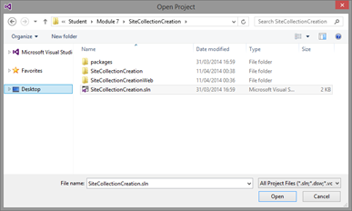
4. Provide your tenant log in information when the __Connect to SharePoint__ dialog is prompted.  

5. Ensure that the __Site URL__ property is correct for the app project by first activating the SiteCollectionCreation project.  
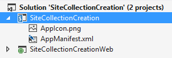
6. Confirm the Site URL from the property window. This this should be pointing to your personal Office365 tenant and to the existing developer site collection which can be used for the exercise creation.  
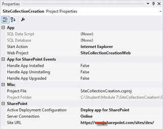
7. Open __AppManifest.xml__ from the App project.  
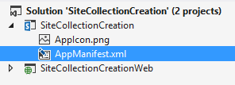
8. Adjust the permission to require __FullControl__ for __Tenant__ scope, so that we are able to create new site collections. Ensure the __Allow the app to make app-only calls to SharePoint__ option is checked.  
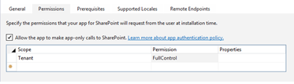
9. Notice that the visual studio project has already the needed reference to the __Microsoft.Online.SharePoint.Client.Tenant__, which is the assembly containing the API for site collection creation.  
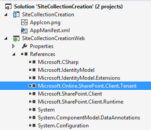
10. Press __F5__ or choose __Debug | Start Debugging__ to ensure that application can be properly deployed.
11. Log in to your test tenant by providing the right user ID and password, if required.  
  
Note: If you have any challenges to logging in from your corporate tenant, follow this support article: [http://support.microsoft.com/kb/2507767](http://support.microsoft.com/kb/2507767).
12. Click __Trust It__, when the trust notification is shown.  
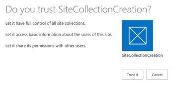
13. You should now see the initial design for the app as follows.  
Note: We will implement the actual functionality as a app part, so there will not be any actual code in the __default.aspx__ file.  
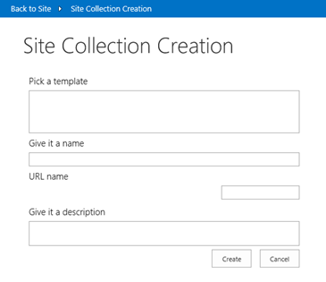
14. Move back to __Visual Studio__ size and press __Shift+F5__ or choose __Stop Debugging__ from the __Debug__ menu.

###Include the actual code for operations.

1. Move to __Solution__ view and open the __default.aspx.cs__ file to add the necessary code for actual button clicks.  
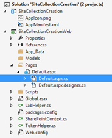
2. First add the required using statements to the top of the code page as follows.
  ```csharp
    using Microsoft.Online.SharePoint.TenantAdministration;
    using Microsoft.SharePoint.Client;
  ```
3. Add the following additional code pieces to the existing __Page_Load__ method, immediately after the script registration call. These populate the template option. Use the same oob team site template for each of the choices, but you can differentiate them during provisioning.
  ```csharp
    listSites.Items.Add(new System.Web.UI.WebControls.ListItem("Team", "STS#0"));
    listSites.Items.Add(new System.Web.UI.WebControls.ListItem("Super Team", "STS#0"));
    listSites.Items.Add(new System.Web.UI.WebControls.ListItem("Über Team", "STS#0"));
    listSites.SelectedIndex = 0;

    lblBasePath.Text = Request["SPHostUrl"].Substring(0, 8 + Request["SPHostUrl"].Substring(8).IndexOf("/")) + "/";
  ```

4. Update the __btnCancel_Click__ method with the required code to move away from the app.
  ```csharp
    protected void btnCancel_Click(object sender, EventArgs e)
    {
        Response.Redirect(Page.Request["SPHostUrl"]);
    }
  ```

5. Implement the site collection creation. Update the  __btnCreate_Click__ as follows.  
Actual creation of the site collection occurs in the __CreateSiteCollection__ method, which you will do in following step.
  ```csharp
    protected void btnCreate_Click(object sender, EventArgs e)
    {
        var spContext = SharePointContextProvider.Current.GetSharePointContext(Context);
        string newWebUrl = string.Empty;
        using (ClientContext ctx = spContext.CreateUserClientContextForSPHost())
        {
            newWebUrl = CreateSiteCollection(ctx, Page.Request["SPHostUrl"], txtUrl.Text,
                                            listSites.SelectedValue, txtTitle.Text, txtDescription.Text);
        }
        Response.Redirect(newWebUrl);
    }
  ```

6. The following step shows how to implement the actual site collection creation. Add the following method below the previously added methods.

    * Notice that we use an app only token for creating the site collection. This way the end user does not have to have high-level permission for the operation and we elevate on the higher security level.
    * Actual site collection is created using a __SiteCreationProperties__ object, and there is a loop for waiting the site collection to be created, so that we can redirect end users to the newly created site collection when it's done.  
    In production, a better approach would be to delegate this site collection creation to a separate worker process or Web job, so that end user does not have to wait for the site collection to be created.
  ```csharp
    private string CreateSiteCollection(ClientContext ctx, string hostWebUrl, string url, string template, string title, string description)
    {
        //get the base tenant admin urls
        var tenantStr = hostWebUrl.ToLower().Replace("-my", "").Substring(8);
        tenantStr = tenantStr.Substring(0, tenantStr.IndexOf("."));
        //get the current user to set as owner
        var currUser = ctx.Web.CurrentUser;
        ctx.Load(currUser);
        ctx.ExecuteQuery();
        //create site collection using the Tenant object
        var webUrl = String.Format("https://{0}.sharepoint.com/{1}/{2}", tenantStr, "sites", url);
        var tenantAdminUri = new Uri(String.Format("https://{0}-admin.sharepoint.com", tenantStr));
        string realm = TokenHelper.GetRealmFromTargetUrl(tenantAdminUri);
        var token = TokenHelper.GetAppOnlyAccessToken(TokenHelper.SharePointPrincipal, tenantAdminUri.Authority, realm).AccessToken;
        using (var adminContext = TokenHelper.GetClientContextWithAccessToken(tenantAdminUri.ToString(), token))
        {
            var tenant = new Tenant(adminContext);
            var properties = new SiteCreationProperties()
            {
                Url = webUrl,
                Owner = currUser.Email,
                Title = title,
                Template = template,
                StorageMaximumLevel = 100,
                UserCodeMaximumLevel = 100
            };
            //start the SPO operation to create the site
            SpoOperation op = tenant.CreateSite(properties);
            adminContext.Load(tenant);
            adminContext.Load(op, i => i.IsComplete);
            adminContext.ExecuteQuery();
            //check if site creation operation is complete
            while (!op.IsComplete)
            {
                //wait 30seconds and try again
                System.Threading.Thread.Sleep(10000);
                op.RefreshLoad();
                adminContext.ExecuteQuery();
            }
        }
        //get the new site collection
        var siteUri = new Uri(webUrl);
        token = TokenHelper.GetAppOnlyAccessToken(TokenHelper.SharePointPrincipal, siteUri.Authority, realm).AccessToken;
        using (var newWebContext = TokenHelper.GetClientContextWithAccessToken(siteUri.ToString(), token))
        {
            var newWeb = newWebContext.Web;
            newWebContext.Load(newWeb);
            newWebContext.ExecuteQuery();
            new LabHelper().SetThemeBasedOnName(newWebContext, newWeb, newWeb, "Orange");
            // All done, let's return the newly created site
            return newWeb.Url;
        }
    }
  ```

7. Now we are ready to see our code in practice. Press __F5__ or choose __Start Debugging__ from __Debug__ menu.
8. After the app has started, fill out the fields and click __Create__ to start the creation process.  
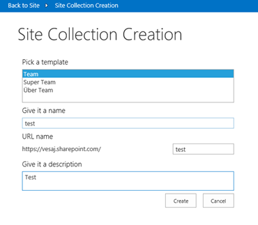
9. Actual creation will take a while and during the creation you will see a gif animation on the page. This was done by simply using the __Update Progress__ control on the page.  
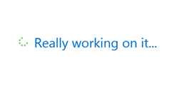
10. If you want, you can open up a second browser and move to your SharePoint admin view to see how the site collection creation is progressing.  
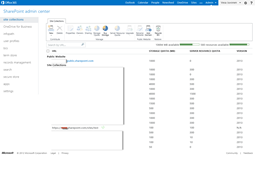
11. After the process is completed the end user is redirected to the branded team site.  
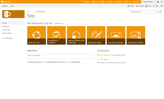

##Exercise 2: Override Sub Site Creation Experience

###Abstract
In this lab you will override the out of the box sub site creation experience by replacing it with your own implementation.

###Learning Objectives
After completing the exercises in this lab, you will be able to:

* Use a JS injection pattern to override the sub site creation experience.
* Provision pre-branded sub sites to existing site collection.

** Estimated time to complete this lab: 15 minutes **

###Set up the solution properties and check the starting point.

In this task we will use the theme file you just created with the background image and we will deploy and apply a new theme to host web from the provider hosted app.

1. Start __Visual Studio 2013__.
2. Click __File | Open Project__.  
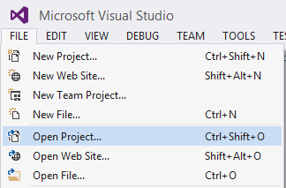
3. Move to the __O3658-6 Demos/SubSiteCreationApp__ folder and open the existing solution named __SubSiteCreationApp.sln__.  
Note: The actual folder location is dependent on where you copied the files to in your local computer.  
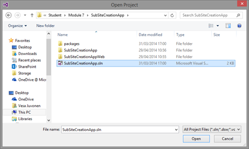
4. Provide your tenant login information when the Connect to SharePoint dialog is prompted.  
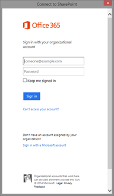
5. Ensure that the Site URL property is correct for the app project by first activating the DeployCustomTheme project in the Solution Explorer.  
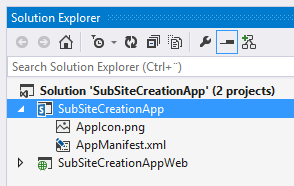
6. Confirm the Site URL from the property window. This this should be pointing to your personal Office365 tenant and to the existing developer site collection which can be used for the exercise creation.  
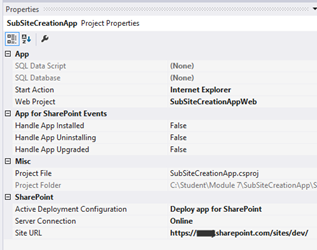
7. Open __AppManifest.xml__ from the app project in the Solution Explorer.  
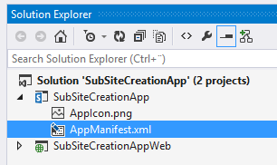
8.  Move to the __Permissions__ tab.
9.  Adjust the permission to require __FullControl__ for __Site Collection__ scope, so that we are able to create sub sites to the site collection.  
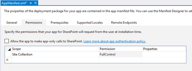
10. Press F5 or choose Debug | Start Debugging to ensure that the application can be properly deployed.
11. Log in to your test tenant by providing the right user ID and password, if required.  
  
Note: If you have any challenges to logging in from your corporate tenant, follow this support article: [http://support.microsoft.com/kb/2507767](http://support.microsoft.com/kb/2507767).
12. Click __Trust It__, when the trust notification for the oAuth permissions is shown.  
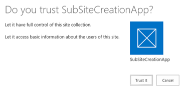
13. You should now see the initial design for the app as follows.  
Notice that we will implement the actual functionality as an app part, so there won’t be any actual code in the default.aspx file.  
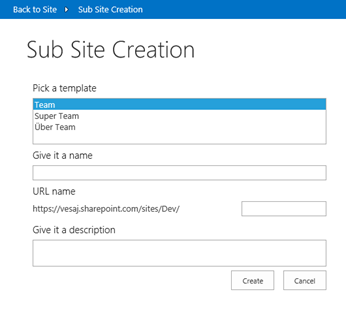
14. Move back to the Visual Studio side and press Shift+F5 or choose Stop Debugging from the Debug menu.


###Add the code to modify host web theme settings.
In this task we will add the code needed to modify the host web theme settings from the app side.

1. Move to the __Solution Explorer__, expand the __Pages__ folder, expand the Default.aspx file, and open the __default.aspx.cs__ to add the code needed for actual button clicks.  
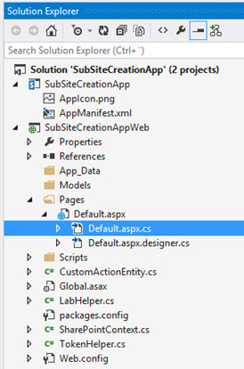
2. First, add the required using statements to the top of the code page as follows.  
This will ensure that the referenced SharePoint client CSOM can be easily accessed.
  ```csharp
    using Microsoft.SharePoint.Client;
  ```

3. Update the __btnCreate_Click__ method as follows for controlling the host web theming settings.  
Notice that this code is calling the __CreateSubSite__ method, which we have not yet added.
  ```csharp
    protected void btnCreate_Click(object sender, EventArgs e)
    {
        var spContext = SharePointContextProvider.Current.GetSharePointContext(Context);
        using (var ctx = spContext.CreateUserClientContextForSPHost())
        {
            Web newWeb = CreateSubSite(ctx, ctx.Web, txtUrl.Text, listSites.SelectedValue, txtTitle.Text, txtDescription.Text);
            // Redirect to just created site
            Response.Redirect(newWeb.Url);
        }
    }
  ```
4. Add the following __CreateSubSite__ method below the button click.  
Notice that the code uses the lab helper class to provide custom action and theme configuration capabilities. You should have a quick look on the LabHelper.cs content to understand how these customizations are applied.
  ```csharp
    public Web CreateSubSite(Microsoft.SharePoint.Client.ClientContext ctx, Web hostWeb, string txtUrl,
                     string template, string title, string description)
    {
        // Create web creation configuration
        WebCreationInformation information = new WebCreationInformation();
        information.WebTemplate = template;
        information.Description = description;
        information.Title = title;
        information.Url = txtUrl;
        // Currently all english, could be extended to be configurable based on language pack usage
        information.Language = 1033;
        Microsoft.SharePoint.Client.Web newWeb = null;
        newWeb = hostWeb.Webs.Add(information);
        ctx.ExecuteQuery();
        ctx.Load(newWeb);
        ctx.ExecuteQuery();
        // Add sub site link override
        new LabHelper().AddJsLink(ctx, newWeb, this.Request);
        // Set oob theme to the just created site
        new LabHelper().SetThemeBasedOnName(ctx, newWeb, hostWeb, "Orange");
        // All done, let's return the newly created site
        return newWeb;
    }
  ```

5. Update the __btnCancel_Click__ as follows to have the capability to return back to the host web.
  ```csharp
    protected void btnCancel_Click(object sender, EventArgs e)
    {
        Response.Redirect(Page.Request["SPHostUrl"]);
    }
  ```

 * Actual link override in the site content is done by overriding the out of the box link using a JavaScript injection pattern. To be able to do this, we will need to add the needed JavaScript file, which is referenced in the LabHelper.cs file, to the project.

6. __Right click__ the __SubSiteCreationAppWeb__ project in the Solution Explorer to choose __Add – New Folder__.  
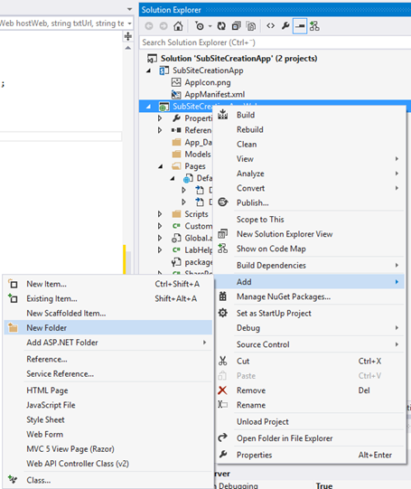
7. Name the folder Resources.
8. Right click the Resources folder and choose Add - JavaScript file...  
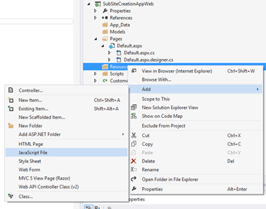
9. Name the item __CustomInjectedJS.js__ and click OK.  
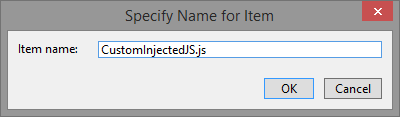
10. Update the just added CustomInjectedJs.js as follows.
  ```javascript
    // Register script for MDS if possible
    RegisterModuleInit("CustomInjectedJS.js", SubSiteOverride_Inject); //MDS registration
    SubSiteOverride_Inject(); //non MDS run

    if (typeof (Sys) != "undefined" && Boolean(Sys) && Boolean(Sys.Application)) {
        Sys.Application.notifyScriptLoaded();
    }

    if (typeof (NotifyScriptLoadedAndExecuteWaitingJobs) == "function") {
        NotifyScriptLoadedAndExecuteWaitingJobs("CustomInjectedJS.js");
    }
    // Actual execution
    function SubSiteOverride_Inject() {
        // Run injection only for site content
        if ((window.location.href.toLowerCase().indexOf("viewlsts.aspx") > -1 && window.location.href.toLowerCase().indexOf("_layouts/15") > -1)) {
            SubSiteOverride_OverrideLinkToAppUrl();
        }
    }
    // Actual link override. Checking the right URL from root site collection of the tenant/web application
    function SubSiteOverride_OverrideLinkToAppUrl() {
        //Update create new site link point to our custom page.
        var link = document.getElementById('createnewsite');
        var url = "https://localhost:44339/pages/default.aspx?SPHostUrl=" + encodeURIComponent(_spPageContextInfo.webAbsoluteUrl);
        if (link != undefined) {
            // Could be get from SPSite root web property bag - now hardcdoded for demo purposes
            link.href = url;
        }
    }
  ```

11. Press **F5** or choose **Debug | Start Debugging** to see the latest changes.
12. Provide some suitable values for the form and client Create.  
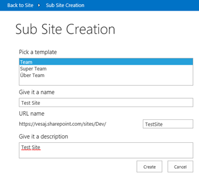
13. Wait for the sub site creation to complete, this can take a while.  

14. Notice how the created site has the Orange theme applied.
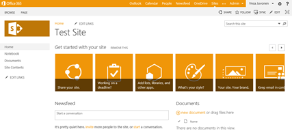
15. Navigate to Site Contents from the left menu.  
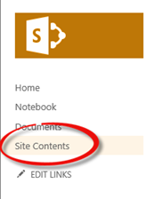
16. Click new subsite link.
17. Notice how you are redirected to your provider hosted app rather than out of the box sub site creation.  
  

This lab is completed. We created a provider hosted app, which was replaced to the host web of created sites as the alternative UI to create sub sites.