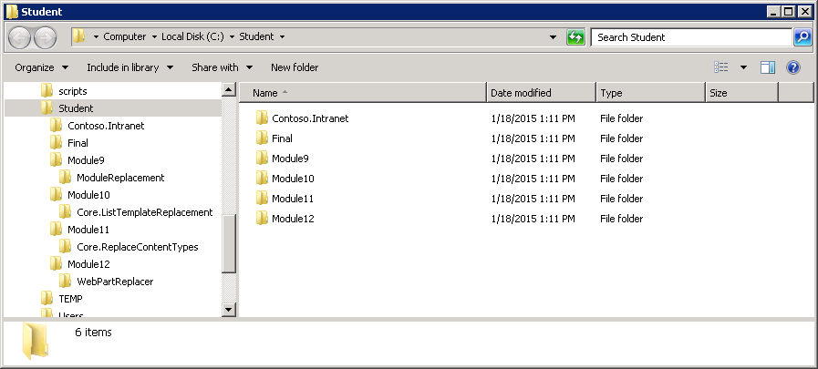
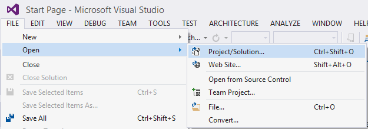
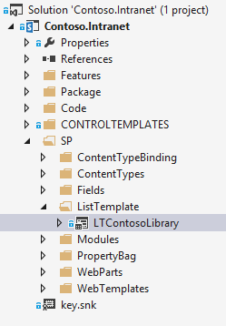
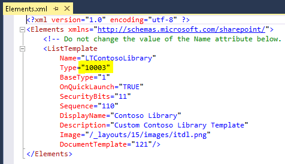
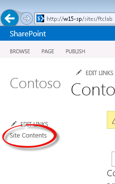
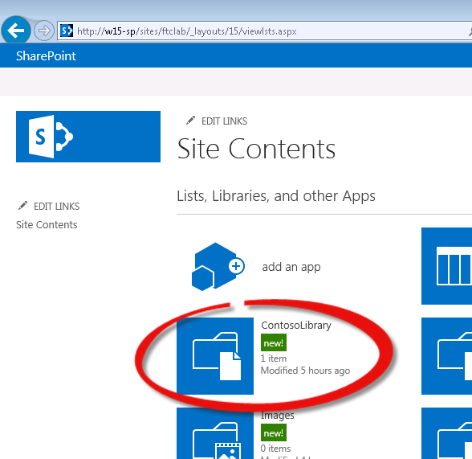
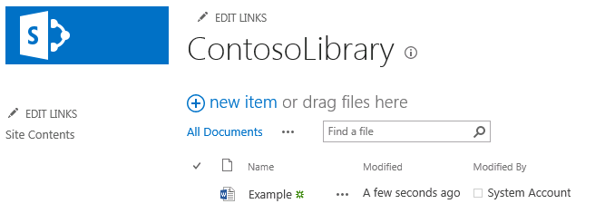
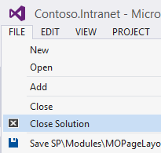
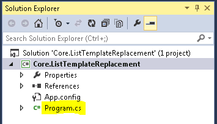
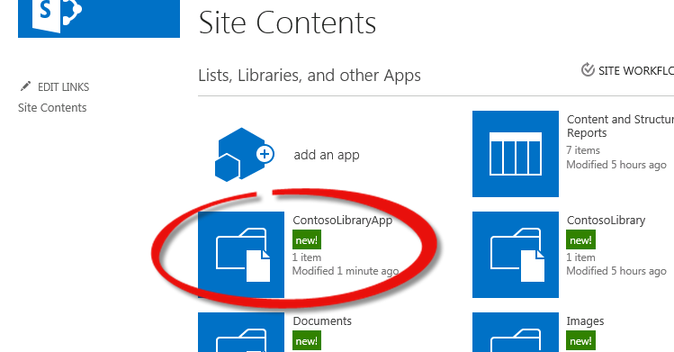

# Module 10-2 — Replacement of lists provisioned from list templates in Full Trust Solutions #
  
## Lab Environment ##
During this lab, you will work in the provided virtual machine. The following prerequisites have been completed and are provided should you wish to undertake this lab in your own environment.

### Before You Begin ###
To complete the labs in this course you need to install or configure the following items.
  - Access to a SharePoint 2013 server with the Contoso.Intranet solution deployed and a site collection provisioned using the **WTContosoPublishing Web Template**. (The PowerShell for site creation is available in the [Patterns & Practice reference materials](https://github.com/OfficeDev/PnP/tree/master/Reference%20Material/Contoso.Intranet) .)
    + You should be logged in as an administrator of the site collection to ensure that you have all the necessary permissions for this lab  

  - Visual Studio 2013 Ultimate Update 3 with Azure SDK v2.5, available via the web platform installer.  

  - Ensure you have configured a local NuGet package repository: http://www.mbgreen.com/blog/2014/8/8/sharepoint-2013-apps-fail-on-nuget-package-restore    
  - Download and unzip the Student folder. Note the unzipped location of these files. You will need these files to complete the labs.  The following graphic shows the unzipped file structure.  
    
  

## Lab Overview ##

### Abstract ###
In this lab you will learn how to detect existing lists and libraries, which have been created from a custom list template deployed into an On-Premises SharePoint Server in a Full Trust Solution. This will involve creating new lists to replace those, configuring them appropriately then transferring the existing content from the original list. 

### Learning Objectives ###
After completing the exercises in this lab, you will be able to:
  - Find lists created from a given template via CSOM
  - Create and configure lists via CSOM
  - Add and remove views from lists via CSOM
  - Move files between libraries via CSOM
   
**Estimated time to complete this lab: *40 minutes*.**
  
  
## Exercise 1: Clone a list via CSOM ##
  
### Examine the initial state of the site and library for replacement. ###
  
0. Start **Visual Studio 2013.**

0. Click **File | Open Project.** 
  
  

0. Move to the **Contoso.Intranet** folder and open the existing solution named  **Contoso.Intranet.sln**.

0. In the **Solution Explorer** expand the **SP** folder then the **ListTemplate** folder and double click on the **LTContosoLibrary** item.

  

0. Examine the **Elements.xml** file which had been opened. 
  * Note that the **Type** attribute is set to 10003, this is the identifier for this custom list template.

   
  
0. You will also see that there is a declarative instance declared here, this is used to create the instance which you will be replacing.

0. Open **Internet Explorer** and navigate to **http://w15-sp/sites/ftclab**

0. In the left hand navigation click on **Site Contents** 

  

0. Click on the **Contoso Library** tile.

  

0. If there is no content in the library add a document or two. Take a couple of minutes to examine the settings of the library and if you wish to make a new view or modify the existing one.

  

0. Switch back to **Visual Studio 2013**

0. Click **File | Close Solution** to close the current solution.

  


### Find the lists for replacement and configure basic settings needed.

In this section we will establish a common pattern of interaction for this lab where we iterate over a collection and create a second collection of 'action items'. 

1. Click **File | Open Project.** 

2. Move to the **Module10/Core.ListTemplateReplacement** folder and open the existing solution named  **Core.ListTemplateReplacement.sln**.

3. Open **Program.cs**

  

4. Paste in the following code to create the first stage of execution in the **Main** method:
  ```csharp
  static void Main(string[] args)
  {
      using (var clientContext = new ClientContext("http://w15-sp/sites/ftclab"))
      {
          Web web = clientContext.Web;
          ListCollection listCollection = web.Lists;
          clientContext.Load(listCollection,
                              l => l.Include(list => list.BaseTemplate,
                                              list => list.BaseType,
                                              list => list.Title));
          clientContext.ExecuteQuery();
          var listsToReplace = new List<List>();
          foreach (List list in listCollection)
          {
              //10003 is the Template Id for the custom list template instances we're replacing
              if (list.BaseTemplate == 10003)
              {
                  listsToReplace.Add(list);
              }
          }
          foreach (List list in listsToReplace)
          {
              ReplaceList(clientContext, listCollection, list);
          }
      }
  }
  ```

  * Here you can see the ClientContext is used to fetch all the Lists in the current Web and ensure that these client side list objects have some key properties set by using the Include lambda.
  * Lists using the **BaseTemplate** of **10003** are then found, these are the lists created from the List Template we inspected earlier with the Type attribute set to 10003. These lists are added to the collection upon which to operate. 
  * *Note:* This pattern of interaction exists as you cannot modify the contents of a collection while iterating over it without causing an exception.
5. Now add the **ReplaceList** method:
  ```csharp
  private static void ReplaceList(ClientContext clientContext, ListCollection listCollection, List listToBeReplaced)
  {
      var newList = CreateReplacementList(clientContext, listCollection, listToBeReplaced);

      SetListSettings(clientContext, listToBeReplaced, newList);

      SetContentTypes(clientContext, listToBeReplaced, newList);

      AddViews(clientContext, listToBeReplaced, newList);

      RemoveViews(clientContext, listToBeReplaced, newList);

      MigrateContent(clientContext, listToBeReplaced, newList);
  }
  ```

  * This simply sets out the chain of operations needed to replace an existing list which could contain content.

6. Add the implementation to the empty declaration for the **CreateReplacementList** method:
  ```csharp
  private static List CreateReplacementList(ClientContext clientContext, ListCollection lists,List listToBeReplaced)
  {
      var creationInformation = new ListCreationInformation
      {
          Title = listToBeReplaced.Title + "App",
          TemplateType = (int) ListTemplateType.DocumentLibrary,
      };
      List newList = lists.Add(creationInformation);
      clientContext.ExecuteQuery();
      return newList;
  }
  ```

  * This creates a new Document Library with a title based upon the existing library.
  * If you were to be replacing a list template which were based on say, a calendar list, you would need to set the TemplateType appropriately here.

7. With the new base library created it needs the same basic settings as the library it is to replace, paste in implementation for the **SetListSettings** method:
  ```csharp
  private static void SetListSettings(ClientContext clientContext, List listToBeReplaced, List newList)
  {
      clientContext.Load(listToBeReplaced, 
                          l => l.EnableVersioning, 
                          l => l.EnableModeration, 
                          l => l.EnableMinorVersions,
                          l => l.DraftVersionVisibility );
      clientContext.ExecuteQuery();
      newList.EnableVersioning = listToBeReplaced.EnableVersioning;
      newList.EnableModeration = listToBeReplaced.EnableModeration;
      newList.EnableMinorVersions= listToBeReplaced.EnableMinorVersions;
      newList.DraftVersionVisibility = listToBeReplaced.DraftVersionVisibility;
      newList.Update();
      clientContext.ExecuteQuery();
  }
  ```

  * This method ensures that the basic versioning settings are consistent between the two lists. This could be enhanced to duplicate additional settings.

8. Now add the **SetContentTypes** method:
  ```csharp
  private static void SetContentTypes(ClientContext clientContext, List listToBeReplaced, List newList)
  {
      clientContext.Load(listToBeReplaced,
                          l => l.ContentTypesEnabled,
                          l => l.ContentTypes);
      clientContext.Load(newList,
                          l => l.ContentTypesEnabled,
                          l => l.ContentTypes);
      clientContext.ExecuteQuery();

      //If the originat list doesn't use ContentTypes there's nothing to do here.
      if (!listToBeReplaced.ContentTypesEnabled) return;

      newList.ContentTypesEnabled = true;
      newList.Update();
      clientContext.ExecuteQuery();
      foreach (var contentType in listToBeReplaced.ContentTypes)
      {
          if (!newList.ContentTypes.Any(ct => ct.Name == contentType.Name))
          {
              //current Content Type needs to be added to new list
              //Note that the Parent is used as contentType is the list instance not the site instance.
              newList.ContentTypes.AddExistingContentType(contentType.Parent);
              newList.Update();
              clientContext.ExecuteQuery();
          }
      }
      //We need to re-load the ContentTypes for newList as they may have changed due to an add call above
      clientContext.Load(newList, l => l.ContentTypes);
      clientContext.ExecuteQuery();
      //Remove any content type that are not needed
      var contentTypesToDelete = new List<ContentType>();
      foreach (var contentType in newList.ContentTypes)
      {
          if (!listToBeReplaced.ContentTypes.Any(ct => ct.Name == contentType.Name))
          {
              //current Content Type needs to be removed from new list
              contentTypesToDelete.Add(contentType);
          }
      }
      foreach (var contentType in contentTypesToDelete)
      {
          contentType.DeleteObject();
      }
      newList.Update();
      clientContext.ExecuteQuery();
  }
  ```

  * Here the strategy of finding Content Types which are present on one list but not the other is used to work out if a Content Type needs to be added to or removed from a list. 

9. Now the new library is configured and ready to accept any content from the existing library.


### Configure views on the new list. ###

Although this section is not required for the purposes of migrating the ContosoLibrary as it was implemented in the template it is worth considering that SharePoint Lists are tools of business and often will have views added, removed or altered after their initial creation. This section exists to ensure that this real world scenario is catered for.

1. Add the body to the **AddViews** method:
  ```csharp
  private static void AddViews(ClientContext clientContext, List listToBeReplaced, List newList)
  {
      ViewCollection views = listToBeReplaced.Views;
      clientContext.Load(views,
                          v => v.Include(view => view.Paged,
                              view => view.PersonalView,
                              view => view.ViewQuery,
                              view => view.Title,
                              view => view.RowLimit,
                              view => view.DefaultView,
                              view => view.ViewFields,
                              view => view.ViewType));
      clientContext.ExecuteQuery();
 
      //Build a list of views which only exist on the source list
      var viewsToCreate = new List<ViewCreationInformation>();
      foreach (View view in listToBeReplaced.Views)
      {
        var createInfo = new ViewCreationInformation
        {
            Paged = view.Paged,
            PersonalView = view.PersonalView,
            Query = view.ViewQuery,
            Title = view.Title,
            RowLimit = view.RowLimit,
            SetAsDefaultView = view.DefaultView,
            ViewFields = view.ViewFields.ToArray(),
            ViewTypeKind = GetViewType(view.ViewType),
        };
        viewsToCreate.Add(createInfo);
      }
      //Create the list that we need to
      foreach (ViewCreationInformation newView in viewsToCreate)
      {
          newList.Views.Add(newView);
      }
      newList.Update();
  }
  ```

  * The views which only exist on the original list are found and used to build **ViewCreationInformation** objects which are then used to create the new views on the new list. 
  * This method makes use of the helper method **GetViewType** which is already in Program.cs. 
  ```csharp
  private static ViewType GetViewType(string viewType)
  {
      switch (viewType)
      {
          case "HTML":
              return ViewType.Html;
          case "GRID":
              return ViewType.Grid;
          case "CALENDAR":
              return ViewType.Calendar;
          case "RECURRENCE":
              return ViewType.Recurrence;
          case "CHART":
              return ViewType.Chart;
          case "GANTT":
              return ViewType.Gantt;
          default:
              return ViewType.None;
      }
  }
  ```
2. Now that any additional views have been added to the new list, it's time to remove any default views which are not on the original list. Add the implementation to **RemoveViews**:
  ```csharp
  private static void RemoveViews(ClientContext clientContext, List listToBeReplaced, List newList)
  {
      //Update the list of views
      clientContext.Load(newList, l => l.Views);
      clientContext.ExecuteQuery();

      var viewsToRemove = new List<View>();
      foreach (View view in newList.Views)
      {
          if (!listToBeReplaced.Views.Any(v => v.Title == view.Title))
          {
              //new list contains a view which is not on the source list, remove it
              viewsToRemove.Add(view);
          }
      }
      foreach (View view in viewsToRemove)
      {
          view.DeleteObject();
      }
      newList.Update();
      clientContext.ExecuteQuery();
  }
  ```

  * This method again follows the pattern of building up a todo list, and then performing the operation needed, in this case a call to **DeleteObject()** is used to remove the no longer required view.


### Migrate the existing content to the new list. ###

1. With the new library configured with the appropriate set of content types, views and options the existing content is now to be migrated. Add the following implementation to the **MigrateContent** method:
  ```csharp
  private static void MigrateContent(ClientContext clientContext, List listToBeReplaced, List newList)
  {
      ListItemCollection items = listToBeReplaced.GetItems(CamlQuery.CreateAllItemsQuery());
      Folder destination = newList.RootFolder;
      Folder source = listToBeReplaced.RootFolder;
      clientContext.Load(destination,
                          d => d.ServerRelativeUrl);
      clientContext.Load(source,
                          s => s.Files,
                          s => s.ServerRelativeUrl);
      clientContext.Load(items,
                          i => i.IncludeWithDefaultProperties(item => item.File));
      clientContext.ExecuteQuery();


      foreach (File file in source.Files)
      {
          string newUrl = file.ServerRelativeUrl.Replace(source.ServerRelativeUrl, destination.ServerRelativeUrl);
            file.CopyTo(newUrl, true);
            //file.MoveTo(newUrl, MoveOperations.Overwrite);
      }
      clientContext.ExecuteQuery();
  }
  ```
 
  * This method loads all the files in the root directory of the original list, calculates their new Url and uses the **File.CopyTo** method.
  * An alternative implementation is to use the **MoveTo** method as shown here commented out.
  * This implementation does not cater for nested folder structure within the source library, additional work will be required if you need this feature.

2. With the code in the console application now complete press **F5** or choose **Debug – Start Debugging** to run the console application and replace the ContosoLibrary.

3. Once the console application has completed execution switch back to **Internet Explorer** and in the left hand navigation click on Site Contents:

  

4. Click on the **Contoso Library App** tile:

  

5. The new ContosoLibraryApp should now show with any of the content which was present in the original library.