# Module 10-4 — Replacement of web parts with add-in parts #

## Lab Environment ##

During this lab, you will work in your own environment with your own SharePoint On-Premises VM. The following prerequisites should be completed or be available before you start the lab.


### Before You Begin ###

To complete the labs in this course you need to install or configure the following items.
 
- Access to a SharePoint 2013 server with the Contoso.Intranet solution deployed and a site collection provisioned using the **WTContosoPublishing Web Template**. (The PowerShell for site creation is available in the [Patterns & Practice reference materials](https://github.com/OfficeDev/PnP/tree/master/Reference%20Material/Contoso.Intranet) .)
  + You should be logged in as an administrator of the site collection to ensure that you have all the necessary permissions for this lab  

- The server needs to be configured for add-in development. The sample code expects a **self-signed certificate** at ``C:\Certs\HighTrustSampleCert.cer`` with a **password** of ``password`` which has the corresponding certificate file installed as a Trusted Security Token Issuer with the **IssueId** of ``11111111-1111-1111-1111-111111111111`` as per the [MSDN Article](http://msdn.microsoft.com/library/office/fp179901(v=office.15)#Cert2) 

- Visual Studio 2013 Ultimate

- Download and unzip the 54403-Student folder. Note the unzipped location of these files. You will need these files to complete the labs.  The following graphic shows the unzipped file structure.

  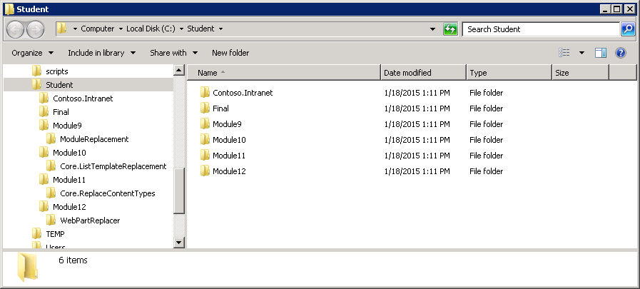


## Lab Overview ##

### Abstract ###

In this lab you will learn how to replace existing web parts by deploying a SharePoint Provider hosted add-in and updating the content to use an add-in Part hosted in the Provider hosted add-in in place of Web Parts using Full Trust Code.

### Learning Objectives ###

After completing the exercises in this lab, you will be able to:

- Locate specific web part instances using CSOM
- Create a new add-in part instances in an existing page using CSOM
- Remove web parts from a page using CSOM

**Estimated time to complete this lab: *30 minutes*.**


## Exercise 1: Replace web parts with add-in parts via CSOM ##

### Open the pre-created structure and test the initial deployment. ###

0. Start **Visual Studio 2013.**

0. Click **File | Open Project.**  
  
  

0. Move to the **Module12/WebPartReplacer** folder and open the existing solution named  **WebPartReplacer.sln.**
  * Note: The actual folder location is dependent on where you copied the files to in your local computer. 
  
0. Ensure that the **Site URL** property is correct for the add-in project by first activating the **WebPartReplacer** project.

0. Confirm the **Site URL** from the property window. This this should be pointing to the existing site collection for the lab, in the pre-configured environment this is **http://w15-sp/sites/ftclab**.

  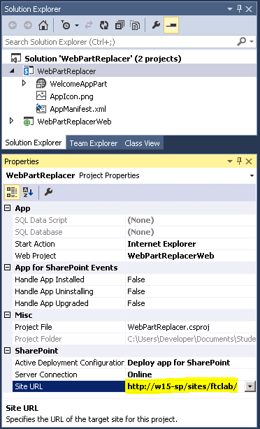

0. Open **AppManifest.xml** from the add-in project.

  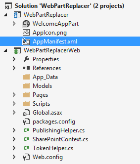

0. Adjust the permission to require **FullControl** in **Web** scope.

  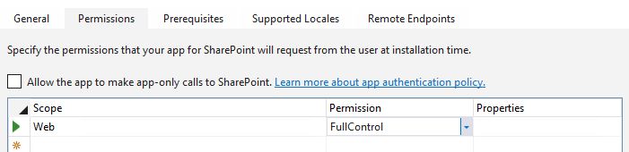

0. Note that this add-in project contains a Client Web Part or add-in Part. This will be used to replace an existing web part in the host web during this lab

  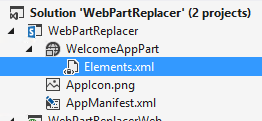

0. Open the **Elements.xml** file.
  
  * Note that the ClientWebPart definition defines some standard web part attributes like Title, Description and dimensions and also provides a reference to the page which will serve the content of the add-in Part.

  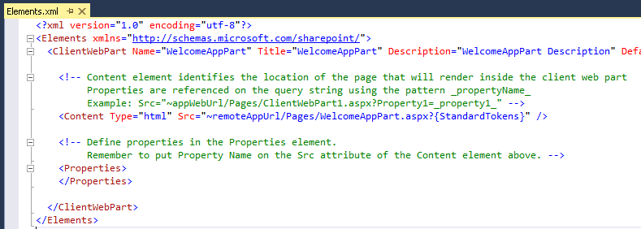

0. Press **F5** or choose **Debug – Start Debugging** to deploy the application and grant it the necessary permissions.

0. Click Trust It, when the trust notification appears.
  
  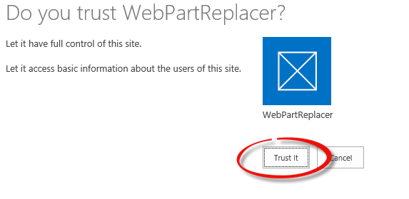

0. You should now see the initial design for the add-in as follows.
    * Notice that actual implementation is missing from the buttons, but you can already see how the add-in will work. 
  
  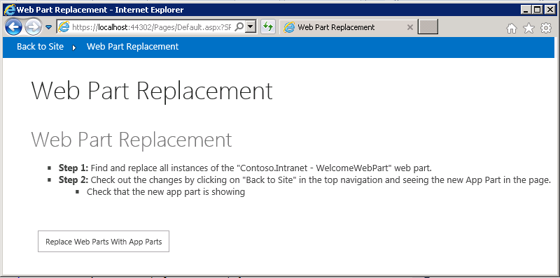

  * In case a message **Only secure content is displayed** appears at the bottom and the blue chrome at the top is missing, click on **Show all content**
   
  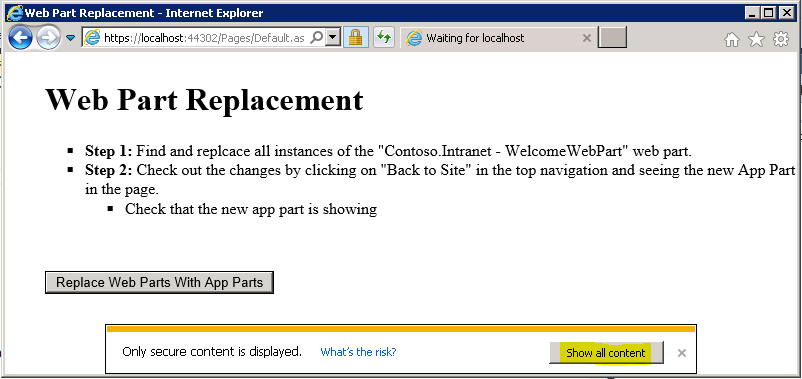


0. Click on **Back to Site** in the top left to navigate to the home page of the site to be modified during this lab,

0. Click on the **Gear icon** in the upper right and then **Edit Page**

  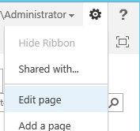

0. Click on **Add a Web Part** in the Top Web Part Zone.

0. Click on **WelcomeAppPart** then **Add**

0. In the **WelcomeAppPart** click on the **drop down arrow next to the web part title** and then **Edit Web Part**

  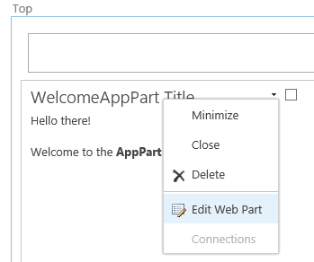

0. In the **Web Part Properties pane**, expand the **Advanced** section, set the **Export Mode** to **Export all data** and click **OK**

  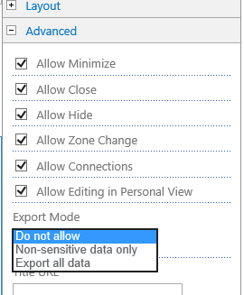

0. In the **WelcomeAppPart** click on the **drop down arrow next to the web part title** and then **Export**

  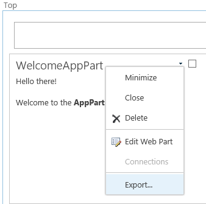

0. In the prompt at the bottom of the browser window click **Save**

    

0. After the download has been completed click **Open folder**

   

0. Then **right-click** and choose **Open with**

  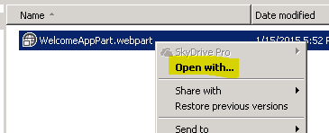 
  
0. Choose **Select a program from a list of installed programs** and click **OK**

  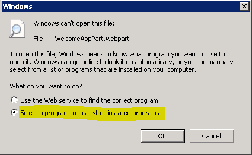 

0. Select **Notepad** in the list and click **OK**

  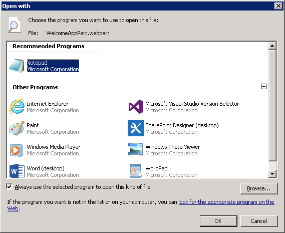 

0. This is a standard web part definition, the key elements here to take note of are, the type, this web part is a **Microsoft.SharePoint.WebPartPages.ClientWebPart** which has **FeatureId**, **ProductId** and **ProductWebId** which are used needed to load the appropriate add-in part.
 
  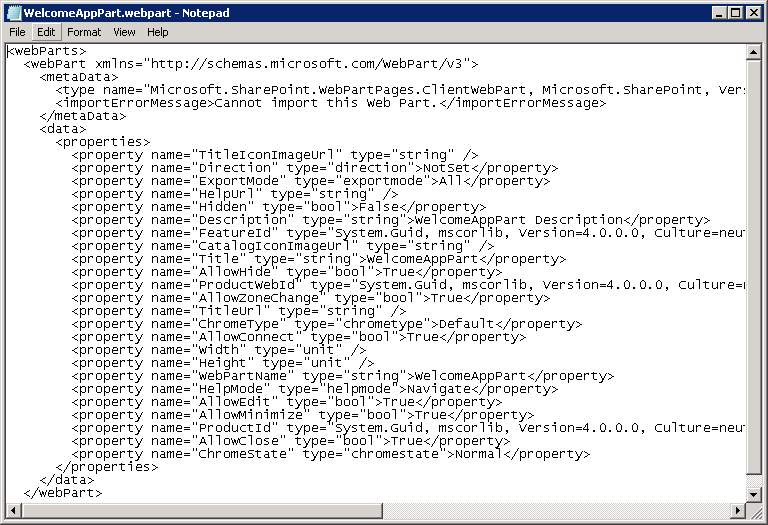 

0. Press **Ctrl + H** or click **Edit | Replace**

0. In the **Find what** box enter **"**, then enter **""** in the Replace with box and press **Replace All**

  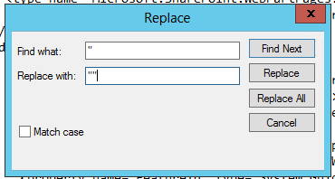
0. Close the replace dialog and press **Ctrl + A** or click **Edit | Select All** then **Ctrl + C** or **Edit | Copy**

0. Switch back to **Internet Explorer**, in the Ribbon on the **Page Tab** choose to **Discard Check Out**

  

0. Move back to the **Visual Studio** window and press **Shift+F5** or choose **Stop Debugging** from the **Debug** menu.

0. From the **Solution Explorer** Open **Default.aspx.cs** 

  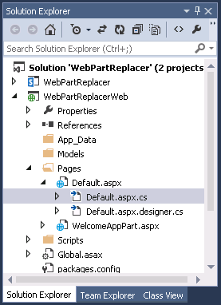

0. Locate the line which defines the **appPartXml** field.
  ```csharp
  private const string appPartXml = @"";
  ```

0. Paste in the Web Part Xml and save your changes, the code should now look like:  
  ```csharp
  private const string appPartXml = @"<webParts>
    <webPart xmlns=""http://schemas.microsoft.com/WebPart/v3"">
      <metaData>
        <type name=""Microsoft.SharePoint.WebPartPages.ClientWebPart, Microsoft.SharePoint, Version=15.0.0.0, Culture=neutral, PublicKeyToken=71e9bce111e9429c"" />
        <importErrorMessage>Cannot import this Web Part.</importErrorMessage>
      </metaData>
      <data>
        <properties>
          <property name=""TitleIconImageUrl"" type=""string"" />
          <property name=""Direction"" type=""direction"">NotSet</property>
          <property name=""ExportMode"" type=""exportmode"">All</property>
          <property name=""HelpUrl"" type=""string"" />
          <property name=""Hidden"" type=""bool"">False</property>
          <property name=""Description"" type=""string"">WelcomeAppPart Description</property>
          <property name=""FeatureId"" type=""System.Guid, mscorlib, Version=4.0.0.0, Culture=neutral, PublicKeyToken=b77a5c561934e089"">0b846986-3474-4f1a-93cf-b7817ef057f9</property>
          <property name=""CatalogIconImageUrl"" type=""string"" />
          <property name=""Title"" type=""string"">WelcomeAppPart Title</property>
          <property name=""AllowHide"" type=""bool"">True</property>
          <property name=""ProductWebId"" type=""System.Guid, mscorlib, Version=4.0.0.0, Culture=neutral, PublicKeyToken=b77a5c561934e089"">717c00a1-08ea-41a5-a2b7-4c8f9c1ce770</property>
          <property name=""AllowZoneChange"" type=""bool"">True</property>
          <property name=""TitleUrl"" type=""string"" />
          <property name=""ChromeType"" type=""chrometype"">Default</property>
          <property name=""AllowConnect"" type=""bool"">True</property>
          <property name=""Width"" type=""unit"" />
          <property name=""Height"" type=""unit"" />
          <property name=""WebPartName"" type=""string"">WelcomeAppPart</property>
          <property name=""HelpMode"" type=""helpmode"">Navigate</property>
          <property name=""AllowEdit"" type=""bool"">True</property>
          <property name=""AllowMinimize"" type=""bool"">True</property>
          <property name=""ProductId"" type=""System.Guid, mscorlib, Version=4.0.0.0, Culture=neutral, PublicKeyToken=b77a5c561934e089"">0b846986-3474-4f1a-93cf-b7817ef057f8</property>
          <property name=""AllowClose"" type=""bool"">True</property>
          <property name=""ChromeState"" type=""chromestate"">Normal</property>
        </properties>
      </data>
    </webPart>
  </webParts>";
  ```

|Note 
|:---------
|The **ProductId** can be obtained from the AppManifest.xml file by selecting it and pressing **F7** to view the XML code. 
|The **FeatureId** can be obtained by extracting the contents of the add-in package and locating the Feature it contains, this can also be extracted via CSOM after the add-in has been installed. 
|The **ProductWebId** is the Id of the Web to which the add-in is deployed and can be read via CSOM  


### Add the required code and run the add-in ###

0. In the **Default.aspx.cs** file locate the **ReplaceWebPartsWithAppParts_Click** method and paste in the following code. 
  ```csharp
  protected void ReplaceWebPartsWithAppParts_Click(object sender, EventArgs e)
  {
      var spContext = SharePointContextProvider.Current.GetSharePointContext(Context);
      using (var clientContext = spContext.CreateUserClientContextForSPHost())
      {
          Web web = clientContext.Web;
          // Get a few properties from the web
          clientContext.Load(web,
                              w => w.ServerRelativeUrl,
                              w => w.AllProperties);
          clientContext.ExecuteQuery();
          //Read the pages library name from the web properties
          var pagesListName = web.AllProperties["__pageslistname"] as string;

          var list = web.Lists.GetByTitle(pagesListName);
          var items = list.GetItems(CamlQuery.CreateAllItemsQuery());
          //make sure to include the File on each Item fetched
          clientContext.Load(items,
                              i => i.Include(
                                      item => item.File));
          clientContext.ExecuteQuery();

          // Iterate through all available pages in the pages list
          foreach (var item in items)
          {
              FindWebPartForReplacement(item, clientContext, web);
          }
      }
  }
  ```

  * The above code simply gets the Pages library and iterates over all of the list items contained in the Pages library. The **FindWebPartForReplacement** method looks to find Web Parts which should be replaced with our new add-in Part.

0. Include the following piece of code to the **FindWebPartForReplacement** method.
  ```csharp
  private static void FindWebPartForReplacement(ListItem item, ClientContext clientContext, Web web)
  {
      File page = item.File;
      // Requires Full Control permissions on the Web
      LimitedWebPartManager webPartManager = page.GetLimitedWebPartManager(PersonalizationScope.Shared);
      clientContext.Load(webPartManager,
                          wpm => wpm.WebParts,
                          wpm => wpm.WebParts.Include(
                                              wp => wp.WebPart.Title));
      clientContext.ExecuteQuery();

      foreach (var oldWebPartDefinition in webPartManager.WebParts)
      {
          var oldWebPart = oldWebPartDefinition.WebPart;
          // only modify if we find the old web part
          if (oldWebPart.Title != oldWebPartTitle) continue;

          ReplaceWebPart(web, item, webPartManager, oldWebPartDefinition, clientContext, page);
      }
  }
  ```

  * This method uses the **LimitedWebPartManager** object for the given page to access all of the web parts in the page to find any which should be replaced. When a web part which is to be replaced then the **ReplaceWebPart** method is called
0. Add the following of code to the **ReplaceWebPart** method.
  ```csharp
    private static void ReplaceWebPart(Web web, ListItem item, LimitedWebPartManager webPartManager,
        WebPartDefinition oldWebPartDefinition, ClientContext clientContext, File page)
    {
        // Check out the page for editing
        PublishingHelper.CheckOutFile(web, item);
        // transform the xml into a web part definition
        var definition = webPartManager.ImportWebPart(appPartXml);
        webPartManager.AddWebPart(definition.WebPart, "RightColumn", 0);

        // Now delete the old web part from the page
        oldWebPartDefinition.DeleteWebPart();
        clientContext.Load(page,
                            p => p.CheckOutType,
                            p => p.Level);

        clientContext.ExecuteQuery();
        // check in all the changes
        PublishingHelper.CheckInPublishAndApproveFile(page);
    }
  ```

  * *Note*: If you do not provide a zone present in the page, in our case "RightColum", you will encounter an Exception when calling ExecuteQuery with the message "Specified argument was out of the range of valid values".
  * This method uses the **ImportWebPart** method of the **LimitedWebPartManager** to convert our Xml string set up earlier in the lab into a WebPartDefinition and then the **AddWebPart** method to add the web part to page in the specified zone.
  * The included PublishingHelper class is used to ensure that Check-In/Check-Out and publishing steps are performed appropriately.

0. Press **F5** or choose **Debug – Start Debugging** to start up the application again.

0. Click the **Replace Web Parts With Add-In Parts** button.

  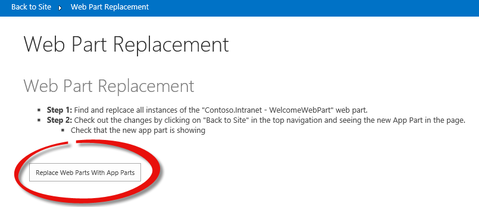

0. Click the **Back to Site** link in the top left of the page.

  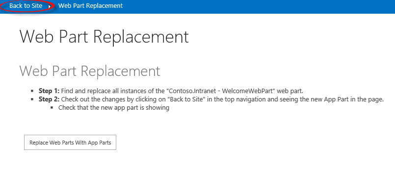

0. Note that the Welcome Web Part has been replaced with the Welcome add-in part.

  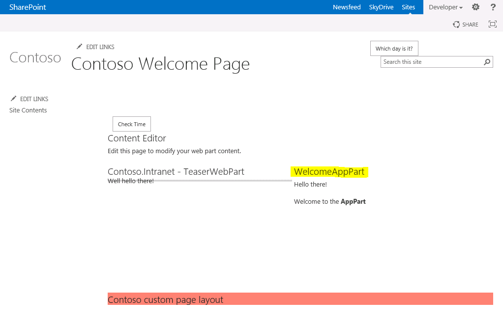
