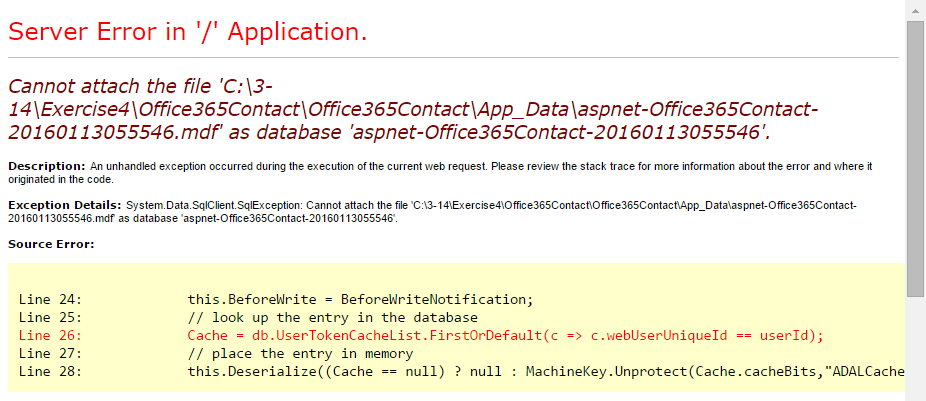
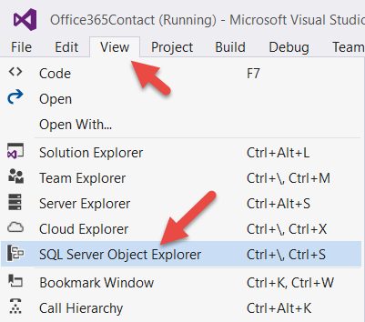
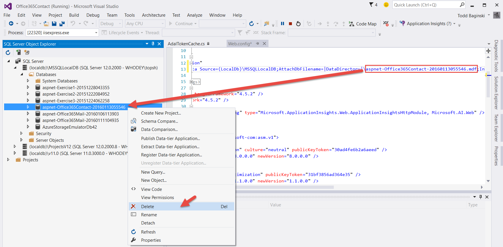

#SQL Server Database Connection Error Resolution

If you open a project multiple times you may encounter an ASP.NET error that indicates a connection error with the SQL Server Database.  Here is an example of what this error looks like.

To resolve this issue, click the **View** tab and select **SQL Server Object Explorer**.

Expand the **(localdb)** node, right click the associated database, select **Delete**, then click the **OK** button.  

In the screenshot below you can see this operation.  The screenshot shows the associated SQL Database name in the web.config file.  This is the same name of the SQL Database shown in the ASP.NET error message.

Now, re-run the VS Project and the database will be re-created and the error will go away.