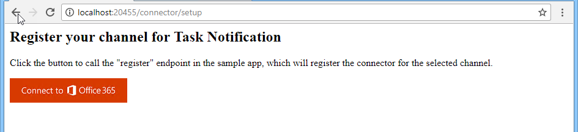
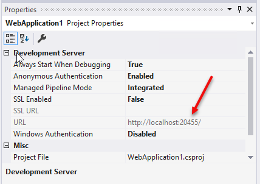

# Demo: Add Connector functionality to existing web site

This demo adds connector functionality to an existing website.

To run this demo, perform the following steps:

## Update Starter solution

1. Open **Visual Studio 2017**

1. In Visual Studio 2017, select **File > Open > Project/Solution**.

1. Select the **ToDoConnector.sln** file from the **Demos\02-webconnector** folder.

### Find the project URL

1. In **Solution Explorer**, double-click on **Properties**.

1. In the properties designer, select the **Web** tab.

1. Note the project URL.

    

### Run the ngrok secure tunnel application

1. Open a new **Command Prompt** window.

1. Change to the directory that contains the **ngrok.exe** application.

1. Run the command `ngrok http [port] -host-header=localhost:[port]`. Replace `[port]` with the port portion of the URL noted above.

1. The ngrok application will fill the entire prompt window. Make note of the forwarding address using HTTPS. This address is required in the next step.

1. Minimize the ngrok command prompt window. It is no longer referenced in this lab, but it must remain running.

    

### Register the connector

1. Go to the [Connectors Developer Dashboard](https://aka.ms/connectorsdashboard) and sign in with your Office 365 credentials.

1. Provide a name, logo, short description and detailed description for your connector.

1. For the **Company website** field, use the HTTPS forwarding address from the ngrok tunnel.

1. For the **Configuration page for your Connector** field, use the forwarding HTTPS address from ngrok prepended to the route to the connector page. For this exercise, the route is `/content/connectorConfig.html`.

    ```html
    https://[from-ngrok].ngrok.io/content/connectorConfig.html
    ```

1. For the **Valid domains** field, use the domain of the forwarding HTTPS address from ngrok. Do not include the scheme, only the domain.

    ```html
    [from-ngrok].ngrok.io
    ```

1. Agree to the terms and conditions and select **Save**.

1. The registration page will refresh. The refreshed page URL will contain the **id** of the connector. Make note of this **Connector Id** for use in the configuration page.

    

1. To enable testing, the connector must be enabled in Outlook. Select the **Sideload to Outlook** button.

    

## Update solution configuration

1. Open the **connectorConfig.html** file in the **Content** folder.

1. The html contains tokens that must be replaced with values from the Connector Dashboard and the ngrok tunnel.
    - Replace the token `[connector-id]` with the **Connector Id** from the Connector Developer Dashboard.
    - Replace the token `[from-ngrok]` with the unique identifier from the ngrok forwarding address.

1. Press **F5** to build and run the project.

### Add the connector to your inbox

1. In a separate browser tab or window, open [Microsoft Outlook](https://outlook.office365.com).  Make sure you are logged in with the same account that you used to register the connector.

1. Select the settings gear in top suite bar. Select **Manage Connectors**.

    

1. Find the connector in the **Connectors** pane. Select you connector.

    

1. The configuration page is displayed. Enter a name for the connector instance and select **Save**.

1. A system message is sent to the inbox with a notification of the new connection. In addition, the Welcome Message from the website is sent to the inbox.

    

    
