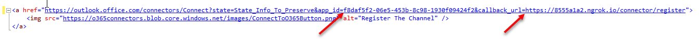

# Demo: Add Connector functionality to existing web site

This demo adds connector functionality to an existing website. First, a new website must be created. The following steps create a default MVC website and walk through the steps for adding a connector. All code can be found in the [Lab Files](../../Lab%20Files) folder, which was based on an application with the name **WebApplication1**.

To run this demo, perform the following steps:

1. Open **Visual Studio 2017**

1. Create a new **ASP.NET Web Application (.NET Framework)** project.

    

1. Choose the **MVC** template.

    

    >Our example will use a subset of the complete solution at [Microsoft Teams Sample Connector in .NET/C#](https://github.com/OfficeDev/microsoft-teams-sample-connector-csharp). This lab will implement enough of that example so that you can create and register the Connector and see it post a welcome message card.

1. Right-click on the **Models** folder and select **Add > Class**.  Name the class **Subscription**.

1. Paste the following code inside the `Subscription` public class.

    ````csharp
    public string GroupName { get; set; }
    public string WebHookUri { get; set; }
    ````

1. Add a new folder to the project and name it **Repository**.

1. Right-click on the **Repository** folder and select **Add > Class**. Name the class **SubscriptionRepository**.

1. Paste the following code into the file, adjusting the namespaces as necessary for your project name.

    ````csharp
    using System.Collections.Generic;
    using WebApplication1.Models;

    namespace WebApplication1.Repository
    {
        public class SubscriptionRepository
        {
            public static List<Subscription> Subscriptions { get; set; } = new List<Subscription>();
        }
    }
    ````

1. Add a new folder to the project and name it **Utils**.

1. Right-click on the **Utils** folder and select **Add > Class**. Name the class **TaskHelper**.

1. Paste the following code into the file, adjusting the namespaces as necessary for your project name.

    ````csharp
    using System.Net.Http;
    using System.Net.Http.Headers;
    using System.Threading.Tasks;

    namespace WebApplication1.Utils
    {
        public class TaskHelper
        {
            public static async Task PostWelcomeMessage(string webhook, string channelName)
            {
                string cardJson = @"{
                ""@type"": ""MessageCard"",
                ""summary"": ""Welcome Message"",
                ""sections"": [{
                    ""activityTitle"": ""Welcome Message"",
                    ""text"": ""The ToDo connector has been set up. We will send you notification whenever new task is added.""}]}";

                await PostCardAsync(webhook, cardJson);
            }

            private static async Task PostCardAsync(string webhook, string cardJson)
            {
                //prepare the http POST
                HttpClient client = new HttpClient();
                client.DefaultRequestHeaders.Accept.Add(new MediaTypeWithQualityHeaderValue("application/json"));
                var content = new StringContent(cardJson, System.Text.Encoding.UTF8, "application/json");
                using (var response = await client.PostAsync(webhook, content))
                {
                    // Check response.IsSuccessStatusCode and take appropriate action if needed.
                }
            }
        }
    }
    ````

1. Right-click on the **Controllers** folder and select **Add > Controller**. Select **MVC 5 Controller - Empty**. Name the controller **ConnectorController**.

1. Paste the following code into the file, adjusting the namespaces as necessary for your project name.

    ````csharp
    using System;
    using System.Threading.Tasks;
    using System.Web.Mvc;
    using WebApplication1.Models;
    using WebApplication1.Repository;
    using WebApplication1.Utils;

    namespace WebApplication1.Controllers
    {
        public class ConnectorController : Controller
        {
            /// <summary>
            /// This is the landing page when user tries to setup the connector.
            /// You could implement login here, if required.
            /// </summary>
            public ViewResult Setup()
            {
                return View();
            }

            /// <summary>
            /// This endpoint is called when registration is completed.
            /// This contains GroupName and Webhook Url which can be used to push change notifications to the channel.
            /// </summary>
            /// <returns></returns>
            public async Task<ActionResult> Register()
            {
                var error = Request["error"];
                var state = Request["state"];
                if (!String.IsNullOrEmpty(error))
                {
                    return RedirectToAction("Error"); // You could pass error message to Error Action.
                }
                else
                {
                    var group = Request["group_name"];
                    var webhook = Request["webhook_url"];

                    Subscription subscription = new Subscription();
                    subscription.GroupName = group;
                    subscription.WebHookUri = webhook;

                    // Save the subscription so that it can be used to push data to the registered channels.
                    SubscriptionRepository.Subscriptions.Add(subscription);

                    await TaskHelper.PostWelcomeMessage(webhook, group);

                    return View();
                }
            }

            // Error page
            public ActionResult Error()
            {
                return View();
            }
        }
    }
    ````

1. Place your cursor inside the **Setup** method, right-click and select **Add > View**. Clear the check box for **Use a layout page**.

1. Paste the following code into the file.

    >Note: the link below has two placeholders that we will be replacing later in this lab.  [ApplicationID] and [NGROK_HTTPS]

    ````html
    @{
        Layout = null;
    }
    <H2>Register your channel for Task Notification</H2>
    <p>
        Select the button to call the "register" endpoint in the sample app, which will register the Connector for the selected channel.
    </p>

    <a href="https://outlook.office.com/connectors/Connect?state=myAppsState&app_id=[ApplicationID]&callback_url=[NGROK_HTTPS]/connector/register">
        
    </a>
    ````

1. Place your cursor inside the **Register** method, right-click and select **Add > View**. Clear the checkbox for **Use a layout page**.

1. Paste the following code into the file.

    ````html
    @{
        Layout = null;
    }

    <H2>Registration successful!</H2>
    ````

1. Place your cursor inside the **Error** method, right-click and select **Add > View**. Clear the checkbox for **Use a layout page**.

1. Paste the following code into the file.

    ````html
    @{
        Layout = null;
    }

    <!DOCTYPE html>

    <html>
    <head>
        <meta name="viewport" content="width=device-width" />
        <title>Error</title>
    </head>
    <body>
        <hgroup>
            <h1 class="text-danger">Error.</h1>
            <h2 class="text-danger">An error occurred while processing your request.</h2>
        </hgroup>
    </body>
    </html>
    ````

1. Press **F5** to build and run the project. Verify that the setup page is available by appending `/connector/setup` to the localhost URL. In this example `http://localhost:20455/connector/setup`.

    

1. Stop debugging.

## Run the ngrok secure tunnel application

1. Choose the **csproj** file and select **F4** to display the Properties pane.

1. Make note of the **URL** property. It is needed for the tunnel application later.

    >Note: If this were a real solution you would want to enable SSL Encryption (by changing the value to true) because the connector requires it.  During testing ngrok is handling the HTTPS->HTTP redirection.

    

1. Open a new **Command Prompt** window.

1. Change to the directory that contains the ngrok.exe application.

1. Run the command `ngrok http [port] -host-header=localhost`. Replace `[port]` with the port portion of the URL noted above, in this example `20455`.

1. The ngrok application will fill the entire prompt window. Make note of the forwarding address using HTTPS. This address is required in the next step.

    

1. Minimize the ngrok Command Prompt window. It is no longer referenced in this lab, but it must remain running.

## Register the connector

Following the steps found on [docs.microsoft.com](https://docs.microsoft.com/en-us/outlook/actionable-messages/connectors-dev-dashboard#build-your-own-connector), register a connector for Office 365. Make sure you are using an account that has access to Microsoft Outlook to test later.

1. Fill in all the basic details such as name and description for the new connector.

1. For the **Landing page for your users for Inbox** and **Landing page for your users for Groups or Teams** field, use the forwarding HTTPS address from ngrok prepended to the route to the setup endpoint. In the example, this is `https://8555a1a2.ngrok.io/connector/setup`.

1. For the **Redirect URLs** field, use the forwarding HTTPS address from ngrok prepended to the route to the register endpoint. In the example, this is `https://8555a1a2.ngrok.io/connector/register`.

1. In the **Enable this integration for** section, select **Outlook**, **Inbox** and **Group** as well as **Microsoft Teams**.

1. Agree to the terms and conditions and choose **Save**.

1. The registration page URL's query string will contain the **id** of the connector. Further, a **Copy Code** button is available that will copy the registration 'button' HTML code to your clipboard. You already have the HTML, so you will modify it by hand. Make note of the **id** as you will use in the following steps. In addition, when you sideload the connector into Microsoft Teams in [Exercise 3](#exercise3), you will make use of the **Download Manifest** feature.

    

### Modify the register view to include the connector ID and ngrok HTTPS URL

1. Return to Visual Studio, with the web project created earlier opened. Stop the debugger.

1. Open the `/Views/Connector/Setup.cshtml` file.

1. Modify the **Register Office365** button's HTML to include the Connector ID and ngrok HTTPS URL from above. The **ID** replaces `[ApplicationID]` and the ngrok HTTPS URL replaces `[NGROK_HTTPS]`.

    

### Add the connector to your inbox

1. Run the web application.

1. In a separate browser tab or window, open [Microsoft Outlook](https://outlook.office365.com).  Make sure you are logged in with the same account that you used to register the connector.

1. In a separate browser tab navigate to the HTTPS setup URL. In the example, this is `https://8555a1a2.ngrok.io/connector/setup`.

1. Choose the **Connect to Office 365** button.

1. Select **Inbox** and then choose **Allow**.  You should then be redirected to the register endpoint and see the **Registration Successful** message.

    

1. Return to your Microsoft Outlook inbox and you will see the Welcome message card.

    