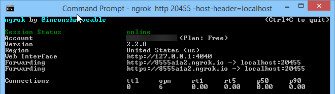
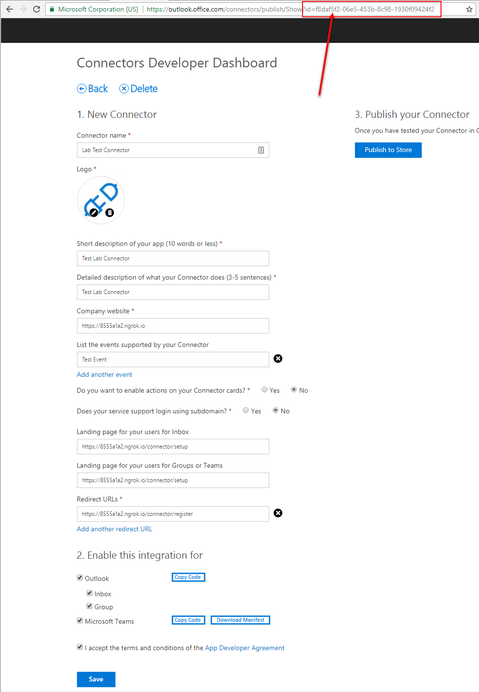
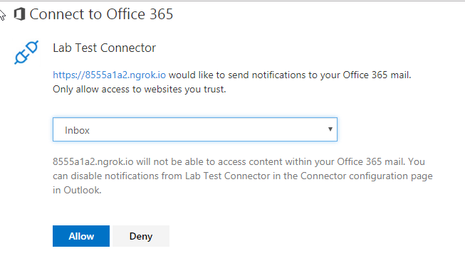

# Demo - Section 2: Add Connector functionality to existing web site

To run this demo, perfom the following steps from the lab:

## Download NuGet packages

1. Launch Visual Studio 2017 as an administrator
1. Build the solution to download all configured NuGet packages.

**Open** `Views/Connectors/Setup` update the link below which has two placeholders that we will be replacing later in this lab.  [ApplicationID] and [NGROK_HTTPS]

````html
@{
    Layout = null;
}
<H2>Register your channel for Task Notification</H2>
<p>
    Click the button to call the "register" endpoint in the sample app, which will register the connector for the selected channel.
</p>

<a href="https://outlook.office.com/connectors/Connect?state=State_Info_To_Preserve&app_id=[ApplicationID]&callback_url=[NGROK_HTTPS]/connector/register">
    
</a>
````


1. Press F5 to build and run the project. Verify that the setup page is available by appending `/connector/setup` to the localhost url. In this example `http://localhost:20455/connector/setup`

    


### Run the ngrok secure tunnel application

1. Single click on the `csproj` file and press **F4** to display the Properties pane.

1. Make note of the `URL` property. It is needed for the tunnel application later.

>**NOTE:** If this were a real solution you would want to enable SSL Encryption (by changing the value to true) because the connector requires it.  During testing ngrok is handling the https->http redirection.

<p align="center">
  
</p>

1. Open a new **Command Prompt** window.

1. Change to the directory that contains the ngrok.exe application.

1. Run the command `ngrok http [port] -host-header=localhost`. Replace `[port]` with the port portion of the URL noted above, in this example **20455**.

1. The ngrok application will fill the entire prompt window. Make note of the Forwarding address using https. This address is required in the next step.

<p align="center">
  
</p>

1. Minimize the ngrok Command Prompt window. It is no longer referenced in this lab, but it must remain running. 

### Register the connector

Following the steps found on [docs.microsoft.com](https://docs.microsoft.com/en-us/outlook/actionable-messages/connectors-dev-dashboard#build-your-own-connector), register a connector for Office 365. Make sure you're using an account that has access to outlook to test later.

1. Fill in all the basic details such as name, description, etc for the new connector.

1. For the **Landing page for your users for Inbox** and **Landing page for your users for Groups or Teams** field, use the Forwarding https address from ngrok prepended to the route to the setup endpoint. In the example, this is `https://8555a1a2.ngrok.io/connector/setup`.

1. For the **Redirect URLs** field, use the Forwarding https address from ngrok prepended to the route to the register endpoint. In the example, this is `https://8555a1a2.ngrok.io/connector/register`

1. In the **Enable this integration for** section, select **Outlook**, **Inbox** and **Group** as well as **Microsoft Teams**.

1. Agree to the terms and conditions and click **Save**

1. The registration page URL's query string will contain the **id** of the connector. Further, a `Copy Code` button is available that will copy the registration 'button' html code to your clipboard. We already have the html, so we'll modify it by hand. Make note of hte **id** as we will use in the following steps. In addition, when we side load the connector into Microsoft Teams in [Exercise 3](#exercise3), we will make use of the `Download Manifest` feature.



### Modify the register view to include the connector id and ngrok Https url.

1. Return to Visual Studio, with the web project created earlier opened. Stop the debugger.

1. Open the `/Views/Connector/Setup.cshtml` file.

1. Modify the `Register Office365` button's html to include the connector id and ngrok Https url from above. The **id** replaces `[ApplicationID]` and the ngrok Https url replaces `[NGROK_HTTPS]`.


### Add the connector to your Inbox

1. Run the web application.

1. In a separate browser tab or window, open [Outlook](https://outlook.office365.com).  Make sure you're logged in with the same account that you used to register the connector.

1. In a seperate browser tab navigate to the https setup url. In the example, this is `https://8555a1a2.ngrok.io/connector/setup`.

1. Click the `Connect to Office 365` button.

1. Select `Inbox` and then click **Allow**.  You should then be redirected to the register endpoint and see the `Registration Successful` message.



1. Now return to your Outlook inbox and you will see the Welcome Message card.


