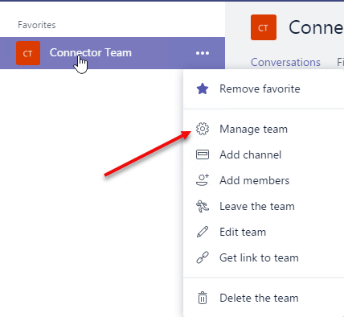

# Demo - Section 3: Sideload the Connector to Microsoft Teams

To run this demo, perfom the following steps from the lab:

## Download NuGet packages

1. Launch Visual Studio 2017 as an administrator
1. Build the solution to download all configured NuGet packages.

## Configure URL

1. In Solution Explorer, double-click on **Properties**
1. In the Properties designer, select the **Web** tab.
1. Note the Project URL.

    

## Run the ngrok secure tunnel application

1. Open a new **Command Prompt** window.
1. Change to the directory that contains the ngrok.exe application.
1. Run the command `ngrok http [port] -host-header=localhost:[port]` (Replace [port] with the port portion of the URL noted above.)
1. The ngrok application will fill the entire prompt window. Make note of the Forwarding address using https. This address is required in the next step.
1. Minimize the ngrok Command Prompt window. It is no longer referenced in this lab, but it must remain running.

### Register the connector

Following the steps found on [docs.microsoft.com](https://docs.microsoft.com/en-us/outlook/actionable-messages/connectors-dev-dashboard#build-your-own-connector), register a connector for Office 365.

1. For the **Configuration page for your Connector** field, use the Forwarding https address from ngrok prepended to the route to the ConnectorController in the Visual Studio project. In the example, this is `https://d3d2f97f.ngrok.io/Connector`

1. For the **Valid Domains** field, use the Forwarding https address from ngrok. In the example, this is `https://d3d2f97f.ngrok.io`.

1. In the **Enable this integration for** section, both **Group** and **Microsoft Teams** must be selected.

1. Agree to the terms and conditions and click **Save**

1. The registration page will refresh with additional information in the integration section on the right. Make note of the **Connector ID** and **Connectors Javascript Library CDN**. This values are used in the following steps.

### Sideload app into Microsoft Teams

1. In the Microsoft Teams application, click the **Add team** link. Then click the **Create team** button.

    

1. Enter a team name and description. In this example, the Team is named **teams-app-1**. Click **Next**.
1. Optionally, invite others from your organization to the team. This step can be skipped in this lab.
1. The new team is shown. In the left-side panel, click the elipses next to the team name. Choose **View team** from the context menu.

    

1. On the View team display, click **Apps** in the tab strip. Then click the **Sideload an app** link at the bottom right corner of the application.

    

1. Select the app package (.zip) file from the **bin** folder of the web application. Click **Open**.

    

1. The app is displayed. Notice information about the app from the manifest (Description and Icon) is displayed.

    

The app is now sideloaded into the Microsoft Teams application and the Tab is available in the **Tab Gallery**.

### Add Connector to a channel

1. Click **...** next to the channel name, then select **Connectors**.

    

1. Scroll to the bottom of the connector list. A section named **Sideloaded** contains the Connector described by the app. Click **Configure**.

    

1. An information dialog is shown with the general and notification information described on the Connector Developer portal. Click the **Visit site to install** button.

    

1. Click the **Connect to Office 365** button. Office 365 will process the registration flow, which may include login and Team/Channel selection. Make note of teh selected Teamd-Channel and click **Allow**.

    

1. The dialog will display the **Redirect** action which presents the information registration provided by Office 365. In a production application, this information must be presisted and used to sent notifications to the channel.

    
