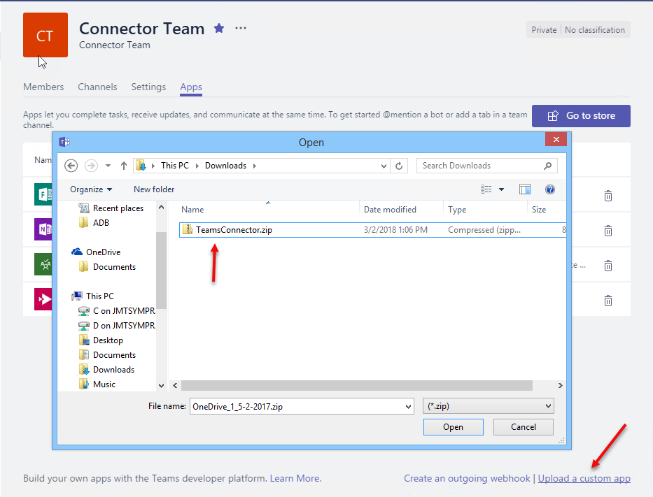
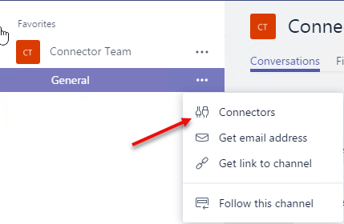
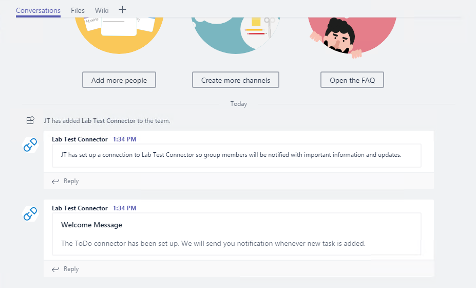

# Build a basic Connector that works with Graph and Teams

In this lab, you will learn the steps to create and send connector cards to Office 365 Groups and Microsoft Teams, and learn the steps for registering a Connector with the Office 365 Conectors developer dashboard.

## Table of Contents

1. [Create a Card payload and submit it via an Incoming Webhook](#exercise1)
1. [Add functionality to an existing web site](#exercise2)
1. [Sideload Connector to Microsoft Teams](#exercise3)

## Prerequisites

This lab will require an Office 365 Tenant and a user account that has a mailbox. The exercises that use Microsoft Teams require additional setup. The tenant setup steps are detailed on the [Getting Started page](https://msdn.microsoft.com/en-us/microsoft-teams/setup). Pay special attention to the sections **Prepare your Office 365 tenant** and **Use Teams App Studio**.

### Install developer tools

The developer workstation requires the following tools for this lab.

#### Download ngrok

The Connector registration process requires an endpoint accessible from the internet via HTTPS. To enable the exercises to work correctly, a tunneling application is required.

This lab uses [ngrok](https://ngrok.com) for tunneling publicly-available HTTPS endpoints to a web server running locally on the developer workstation without an actual SSL certificate. ngrok is a single-file download that is run from a console.

#### Code Editors

The steps and code samples in this training use [Visual Studio 2017](https://www.visualstudio.com/) for websites using C#.

<a name="exercise1"></a>

## Exercise 1: Create a Card payload and submit it via an Incoming Webhook

In this exercise, you will copy an example card from the Message Card Playground web site and send it to an Office 365 Group in your tenant.

### Create Group and configure Webhook

1. Open a browser and navigate to **https://outlook.office.com**. Log in with your Office 365 credentials.
1. Create a new Group, or navigate to an existing Group.
1. At the top-left of the screen, click the gear next to the member count. Choose **Connectors**.

    

1. In the list of Connectors, scroll down and then select **Incoming Webhook**. Click **Add**.

    

1. Enter a name for the connector and click **Create**.
1. The page will re-display, now including a URL for the connector. Click the icon next to the URL to copy it to the clipboard.

    

    > Note: The URL will be used several times in this Exercise, as will the clipboard. We recommend pasting the URL into Notepad or other application.

1. Click **Done**. Then close the Connector and Group settings flyouts.

### Explore MessageCard Playground

1. In another browser tab or window, navigate to **https://messagecardplayground.azurewebsites.net**.
1. The playground site provides for uploading a custom card definition or reviewing several samples. Use the **select a sample** dropdown to select a sample that closely matches your requirements. (The image in this lab uses the **Connectors reference example**, but that is not required.)

    

1. After selecting an example, click **Send via WebHook**.
1. Enter or paste the URL copied earlier from the Group Connector configuration panel.
1. Click **OK**. The card will display in the Outlook Group conversation display. (You may have to click on the **New Activity** indicator to see the card.)

### Send card via PowerShell

It is not necessary to use the playground web site to send test messages. Any facility for sending HTTP POST requests can also send cards to the Group.

1. In the MessageCard Playground site, select a different sample card. (This will be easier to identify in the Conversation view if the cards are different.)
1. Select the JSON and copy it to Notepad.
1. Save the card source as **connector-card.json**.
1. Open **Windows PowerShell** and change to the directory containing the **connector-card.json** file.
1. Execute the following commands:

    ```powershell
    $message = Get-Content .\connector-card.json
    $url = <YOUR WEBHOOK URL>
    Invoke-RestMethod -ContentType "application/json" -Body $message -Uri $url -Method Post
    ```

    

    > The `Invoke-RestMethod` cmdlet will return **1** to indicate success.

<a name="exercise2"></a>

## Exercise 2: Add Connector functionality to existing web site

This exercise will add connector functionality to an existing web site. First, a new website must be created. The following steps create a default MVC website and walk through the steps for adding a connector. All code can be found in the [Lab Files](./Lab%20Files) folder, which was based on an applicaiton with the name **WebApplication1**.

1. Open **Visual Studio 2017**

1. Create a new **ASP.NET Web Application (.NET Framework)** project

    

1. Choose the **MVC** template

    

>Our example will use a subset of the complete solution at [Microsoft Teams Sample Connector in .NET/C#](https://github.com/OfficeDev/microsoft-teams-sample-connector-csharp). This lab will implement enough of that example so that you can create and register the connector and see it post a welcome message card.

1. Right-click on the `Models` folder and select **Add > Class**.  Name the class `Subscription`.

1. Paste the following code inside the `Subscription` public class.

    ````csharp
    public string GroupName { get; set; }
    public string WebHookUri { get; set; }
    ````

1. Add a new folder to the project and name it `Repository`.

1. Right-click on the `Repository` folder and select **Add > Class**. Name the class `SubscriptionRepository`

1. Paste the following code into the file, adjusting the namespaces as necessary for your project name.

    ````csharp
    using System.Collections.Generic;
    using WebApplication1.Models;

    namespace WebApplication1.Repository
    {
        public class SubscriptionRepository
        {
            public static List<Subscription> Subscriptions { get; set; } = new List<Subscription>();
        }
    }
    ````

1. Add a new folder to the project and name it `Utils`.

1. Right-click on the `Utils` folder and select **Add > Class**. Name the class `TaskHelper`

1. Paste the following code into the file, adjusting the namespaces as necessary for your project name.

    ````csharp
    using System.Net.Http;
    using System.Net.Http.Headers;
    using System.Threading.Tasks;

    namespace WebApplication1.Utils
    {
        public class TaskHelper
        {
            public static async Task PostWelcomeMessage(string webhook, string channelName)
            {
                string cardJson = @"{
                ""@type"": ""MessageCard"",
                ""summary"": ""Welcome Message"",
                ""sections"": [{ 
                    ""activityTitle"": ""Welcome Message"",
                    ""text"": ""The ToDo connector has been set up. We will send you notification whenever new task is added.""}]}";

                await PostCardAsync(webhook, cardJson);
            }

            private static async Task PostCardAsync(string webhook, string cardJson)
            {
                //prepare the http POST
                HttpClient client = new HttpClient();
                client.DefaultRequestHeaders.Accept.Add(new MediaTypeWithQualityHeaderValue("application/json"));
                var content = new StringContent(cardJson, System.Text.Encoding.UTF8, "application/json");
                using (var response = await client.PostAsync(webhook, content))
                {
                    // Check response.IsSuccessStatusCode and take appropriate action if needed.
                }
            }
        }
    }
    ````

1. Right-click on the `Controllers` folder and select **Add > Controller**. Select **MVC 5 Controller - Empty**. Name the controller `ConnectorController`.

1. Paste the following code into the file, adjusting the namespaces as necessary for your project name.

    ````csharp
    using System;
    using System.Threading.Tasks;
    using System.Web.Mvc;
    using WebApplication1.Models;
    using WebApplication1.Repository;
    using WebApplication1.Utils;

    namespace WebApplication1.Controllers
    {
        public class ConnectorController : Controller
        {
            /// <summary>
            /// This is the landing page when user tries to setup the connector.
            /// You could implement login here, if required.
            /// </summary>
            public ViewResult Setup()
            {
                return View();
            }

            /// <summary>
            /// This enpoint is called when registration is completed. 
            /// This contains GroupName and Webhook Url which can be used to push change notifications to the channel.
            /// </summary>
            /// <returns></returns>
            public async Task<ActionResult> Register()
            {
                var error = Request["error"];
                var state = Request["state"];
                if (!String.IsNullOrEmpty(error))
                {
                    return RedirectToAction("Error"); // You could pass error message to Error Action. 
                }
                else
                {
                    var group = Request["group_name"];
                    var webhook = Request["webhook_url"];

                    Subscription subscription = new Subscription();
                    subscription.GroupName = group;
                    subscription.WebHookUri = webhook;

                    // Save the subscription so that it can be used to push data to the registered channels.
                    SubscriptionRepository.Subscriptions.Add(subscription);

                    await TaskHelper.PostWelcomeMessage(webhook, group);

                    return View();
                }
            }

            // Error page
            public ActionResult Error()
            {
                return View();
            }
        }
    }
    ````

1. Place your cursor inside the `Setup` method, right-click and select **Add > View**. Clear the checkbox for **Use a layout page**.

1. Paste the following code into the file. 

    >**PLEASE NOTE:** the link below has two placeholders that we will be replacing later in this lab.  [ApplicationID] and [NGROK_HTTPS]

    ````html
    @{
        Layout = null;
    }
    <H2>Register your channel for Task Notification</H2>
    <p>
        Click the button to call the "register" endpoint in the sample app, which will register the connector for the selected channel.
    </p>

    <a href="https://outlook.office.com/connectors/Connect?state=State_Info_To_Preserve&app_id=[ApplicationID]&callback_url=[NGROK_HTTPS]/connector/register">
        
    </a>
    ````

1. Place your cursor inside the `Register` method, right-click and select **Add > View**. Clear the checkbox for **Use a layout page**.

1. Paste the following code into the file. 

    ````html
    @{
        Layout = null;
    }

    <H2>Registration successful!</H2>
    ````

1. Place your cursor inside the `Error` method, right-click and select **Add > View**. Clear the checkbox for **Use a layout page**.

1. Paste the following code into the file. 

    ````html
    @{
        Layout = null;
    }

    <!DOCTYPE html>

    <html>
    <head>
        <meta name="viewport" content="width=device-width" />
        <title>Error</title>
    </head>
    <body>
        <hgroup>
            <h1 class="text-danger">Error.</h1>
            <h2 class="text-danger">An error occurred while processing your request.</h2>
        </hgroup>
    </body>
    </html>
    ````

1. Press F5 to build and run the project. Verify that the setup page is available by appending `/connector/setup` to the localhost url. In this example `http://localhost:20455/connector/setup`

    

1. Stop debugging.

### Run the ngrok secure tunnel application

1. Single click on the `csproj` file and press **F4** to display the Properties pane.

1. Make note of the `URL` property. It is needed for the tunnel application later.

    >**NOTE:** If this were a real solution you would want to enable SSL Encryption (by changing the value to true) because the connector requires it.  During testing ngrok is handling the https->http redirection.

    ```html
    <p align="center">
        
    </p>
    ```

1. Open a new **Command Prompt** window.

1. Change to the directory that contains the ngrok.exe application.

1. Run the command `ngrok http [port] -host-header=localhost`. Replace `[port]` with the port portion of the URL noted above, in this example **20455**.

1. The ngrok application will fill the entire prompt window. Make note of the Forwarding address using https. This address is required in the next step.

    ```html
    <p align="center">
    
    </p>
    ```

1. Minimize the ngrok Command Prompt window. It is no longer referenced in this lab, but it must remain running. 

### Register the connector

Following the steps found on [docs.microsoft.com](https://docs.microsoft.com/en-us/outlook/actionable-messages/connectors-dev-dashboard#build-your-own-connector), register a connector for Office 365. Make sure you're using an account that has access to outlook to test later.

1. Fill in all the basic details such as name, description, etc for the new connector.

1. For the **Landing page for your users for Inbox** and **Landing page for your users for Groups or Teams** field, use the Forwarding https address from ngrok prepended to the route to the setup endpoint. In the example, this is `https://8555a1a2.ngrok.io/connector/setup`.

1. For the **Redirect URLs** field, use the Forwarding https address from ngrok prepended to the route to the register endpoint. In the example, this is `https://8555a1a2.ngrok.io/connector/register`

1. In the **Enable this integration for** section, select **Outlook**, **Inbox** and **Group** as well as **Microsoft Teams**.

1. Agree to the terms and conditions and click **Save**

1. The registration page URL's query string will contain the **id** of the connector. Further, a `Copy Code` button is available that will copy the registration 'button' html code to your clipboard. We already have the html, so we'll modify it by hand. Make note of hte **id** as we will use in the following steps. In addition, when we side load the connector into Microsoft Teams in [Exercise 3](#exercise3), we will make use of the `Download Manifest` feature.


### Modify the register view to include the connector id and ngrok Https url.

1. Return to Visual Studio, with the web project created earlier opened. Stop the debugger.

1. Open the `/Views/Connector/Setup.cshtml` file.

1. Modify the `Register Office365` button's html to include the connector id and ngrok Https url from above. The **id** replaces `[ApplicationID]` and the ngrok Https url replaces `[NGROK_HTTPS]`.


### Add the connector to your Inbox

1. Run the web application.

1. In a separate browser tab or window, open [Outlook](https://outlook.office365.com).  Make sure you're logged in with the same account that you used to register the connector.

1. In a seperate browser tab navigate to the https setup url. In the example, this is `https://8555a1a2.ngrok.io/connector/setup`.

1. Click the `Connect to Office 365` button.

1. Select `Inbox` and then click **Allow**.  You should then be redirected to the register endpoint and see the `Registration Successful` message.

    

1. Now return to your Outlook inbox and you will see the Welcome Message card.

    

This completes Exercise 2.

<a name="exercise3"></a>

## Exercise 3: Sideload the Connector to Microsoft Teams

To complete this part of the lab, the prerequistes for developing Apps for Microsoft Teams must be completed. The setup steps are detailed on the [Getting Started page](https://msdn.microsoft.com/en-us/microsoft-teams/setup). Pay special attention to the sections **Prepare your Office 365 tenant** and **Use Teams App Studio**.

### Sideload app into Microsoft Teams

Side loading a Microsoft Teams Connector requires a zip file containing a manifest that describes the Connector along with related resources. 

1. From the connector setup page, click on the `Download Manifest` button which will download the manifest.json file to your machine.

1. Open the manifest.json file in an editor and replace the `icons` section with the following json and save the file.

    ````json
    "icons": {
        "outline": "connector-icon-20x20.png",
        "color": "connector-icon-96x96.png"
    },
    ````

1. Add the manifest.json plus the `Lab Files/Teams/connector-icon-20x20.png` and `Lab Files/Teams/connector-icon-96x96.png` to a zip file. In this demo, the zip file is named `TeamsConnector.zip`

1. In the Microsoft Teams application, click the **Add team** link. Then click the **Create team** button.

    

1. Enter a team name and description. In this example, the Team is named **Connector Team**. Click **Next**.

1. Optionally, invite others from your organization to the team. This step can be skipped in this lab.

1. The new team is shown. In the left-side panel, click the elipses next to the team name. Choose **Manage team** from the context menu.

    

1. On the Manage team display, click **Apps** in the tab strip. Then click the **Upload a custom app** link at the bottom right corner of the application. Navigate to the folder where the `TeamsConnector.zip` file is and select it.

    

1. The app is displayed.

    

The connector is now sideloaded into the Microsoft Teams application.

### Add Connector to a channel

1. Make sure your application is running.

1. Click **...** next to the channel name, then select **Connectors**.

    

1. Scroll to the bottom of the connector list. A section named **Sideloaded** contains the Connector described by the manifest. Click **Configure**.

    

1. An information dialog is shown with the general and notification information described on the Connector Developer portal. Click the **Visit site to install** button.

    

1. Office 365 will process the registration flow, which may include login. The dialog will then display the Redirect action which presents the registration information provided by Office 365. In a production application, this information must be presisted and used to send notifications to the channel. Once you are done, close this window and click `Done`.

1. The conversation window of the channel will now show the welcome message card that was sent via the api.

    
    
    > Note: Before your Connector can receive callbacks for actionable messages, you must register it and publish the app.

This concludes Exercise 3.
