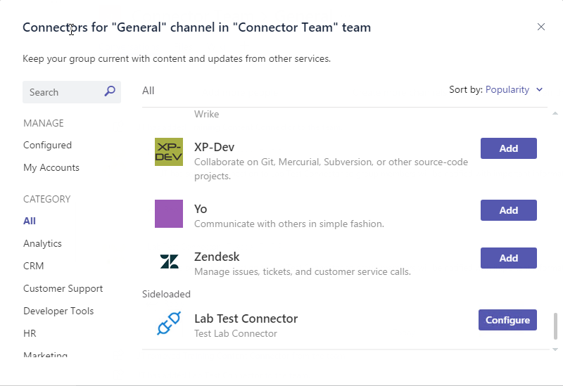

# Lab: Build a basic connector that works with Microsoft Graph and Microsoft Teams

In this lab, you will learn the steps to create and send connector cards to Office 365 Groups and Microsoft Teams, and learn the steps for registering a connector with the Office 365 Connectors Developer Dashboard.

## In this lab

1. [Create a card payload and submit it via an incoming webhook](#exercise1)
1. [Add functionality to an existing web site](#exercise2)
1. [Upload connector to Microsoft Teams](#exercise3)

## Prerequisites

This lab will require an Office 365 tenant and a user account that has a mailbox. The exercises that use Microsoft Teams require additional setup. The tenant setup steps are detailed on the [Getting Started page](https://msdn.microsoft.com/en-us/microsoft-teams/setup). Pay special attention to the sections **Prepare your Office 365 tenant** and **Get started with Teams App Studio**.

### Install developer tools

The developer workstation requires the following tools for this lab:

#### Download ngrok

The connector registration process requires an endpoint accessible from the internet via HTTPS. A tunneling application is required for the exercises to work correctly.

This lab uses [ngrok](https://ngrok.com) for tunneling publicly-available HTTPS endpoints to a web server running locally on the developer workstation without an SSL certificate. ngrok is a single-file download that is run from a console.

#### Code editors

The steps and code samples in this lab use [Visual Studio 2017](https://www.visualstudio.com/) for websites using C#.

<a name="exercise1"></a>

## Exercise 1: Create a card payload and submit it via an incoming webhook

In this exercise, you will copy an example card from the Message Card Playground website and send it to an Office 365 group in your tenant.

### Create a group and configure the webhook

1. Open a browser and go to [Microsoft Outlook](https://outlook.office.com). Log in with your Office 365 credentials.
1. Create a new group, or select an existing group.
1. At the top-right of the screen, select the gear in the content area (not the suite bar).

    

1. Select **Connectors**.

    

1. In the list of connectors, scroll down and select **Incoming Webhook**.

    

1. Enter a name for the connector and select **Create**.
1. The page will re-display, now including a URL for the connector. Use the icon next to the URL to copy it to the clipboard.

    

    > Note: The URL will be used several times in this exercise, as will the clipboard. We recommend pasting the URL into Notepad or other application.

1. Select **Done**. Then close the Connector and Group settings menus.

### Explore MessageCard playground

1. In another browser tab or window, navigate to [MessageCard Playground](https://messagecardplayground.azurewebsites.net).
1. The playground site provides for uploading a custom card definition or reviewing several samples. Use the **select a sample** dropdown to select a sample. This lab requires that the sample uses the **Legacy MessageCard samples** at the bottom of the dropdown.

    

    > Note: Choosing an **Adaptive Card Sample** may result in an error in the next section of the lab.

### Send card via PowerShell

It is not necessary to use the playground website to send test messages. Any facility for sending HTTP POST requests can also send cards to the group.

1. Select the JSON of a card from the MessageCard Playground and copy it to Notepad.
1. Save the card source as **connector-card.json**.
1. Open **Windows PowerShell** and change to the directory containing the **connector-card.json** file.
1. Execute the following commands:

    ```powershell
    $message = Get-Content .\connector-card.json
    $url = <YOUR WEBHOOK URL>
    Invoke-RestMethod -ContentType "application/json" -Body $message -Uri $url -Method Post
    ```

    

    > The `Invoke-RestMethod` cmdlet will return **1** to indicate success.

<a name="exercise2"></a>

## Exercise 2: Add connector functionality to existing website

This exercise will add connector functionality to an existing website. A starter solution named **ToDoConnector** can be found in the **Lab Files/Starter** folder.

### Update Starter solution

1. Open **Visual Studio 2017**

1. In Visual Studio 2017, select **File > Open > Project/Solution**.

1. Select the **ToDoConnector.sln** file from the **Lab Files\Starter** folder.

### Find the project URL

1. In **Solution Explorer**, double-click on **Properties**.

1. In the properties designer, select the **Web** tab.

1. Note the project URL.

    

### Run the ngrok secure tunnel application

1. Open a new **Command Prompt** window.

1. Change to the directory that contains the **ngrok.exe** application.

1. Run the command `ngrok http [port] -host-header=localhost:[port]`. Replace `[port]` with the port portion of the URL noted above.

1. The ngrok application will fill the entire prompt window. Make note of the forwarding address using HTTPS. This address is required in the next step.

1. Minimize the ngrok command prompt window. It is no longer referenced in this lab, but it must remain running.

    

### Register the connector

1. Go to the [Connector Developer Portal](https://aka.ms/connectorsdashboard) and sign in with your Office 365 credentials.

1. Provide a name, logo, short description and detailed description for your connector.

1. For the **Company website** field, use the HTTPS forwarding address from the ngrok tunnel.

1. For the **Configuration page for your Connector** field, use the forwarding HTTPS address from ngrok prepended to the route to the connector page. For this exercise, the route is `/content/connectorConfig.html`.

    ```html
    https://[from-ngrok].ngrok.io/content/connectorConfig.html
    ```

1. For the **Valid domains** field, use the domain of the forwarding HTTPS address from ngrok. Do not include the scheme, only the domain.

    ```html
    [from-ngrok].ngrok.io
    ```

1. Agree to the terms and conditions and select **Save**.

1. The registration page will refresh. The refreshed page URL will contain the **id** of the connector. Make note of this **Connector Id** for use in the configuration page.

    

1. To enable testing, the connector must be enabled in Outlook. Select the **Sideload to Outlook** button.

    

### Add Connector registration to solution

1. Right-click on the **Content** folder and select **Add > HTML Page**. Name the page **connectorConfig.html**. Select **OK**.

1. Replace the contents of the **connectorConfig.html** page with the code from the **Lab Files\connectorConfig.html** file.

    The html contains tokens that must be replaced with values from the Connector Dashboard and the ngrok tunnel.
    - Replace the token `[connector-id]` with the **Connector Id** from the Connector Developer Dashboard.
    - Replace the token `[from-ngrok]` with the unique identifier from the ngrok forwarding address.

1. Right-click on the **Models** folder and select **Add > Class**.  Name the class **ConnectorSettings**.

1. Paste the following code inside the `Subscription` public class.

    ````csharp
    public string AppType { get; set; }
    public string ConfigName { get; set; }
    public string ContentUrl { get; set; }
    public string EntityId { get; set; }
    public string UserObjectId { get; set; }
    public string WebHookUrl { get; set; }
    ````

1. Right-click on the project and select **Add > Class**. Name the class **TaskHelper**.

1. Add the following `using` statements to the top of the **TaskHelper.cs** file.

    ````csharp
    using System.Threading.Tasks;
    ````

1. Right-click on the **Controllers** folder and select **Add > Controller**.

1. Select **Web API 2 Controller - Empty**. Select **Add**.

1. Name the controller **ConnectorController**. Select **Add**.

1. Add the following `using` statements to the top of the **ConnectorController.cs** file.

    ````csharp
    using System.Net.Http.Headers;
    using System.Threading.Tasks;
    using ToDoController.Models;
    ````

1. Replace the generated `ConnectorController` class with the following code. The code is in the **Lab Files\ConnectorController.cs** file.

    ````csharp
    public class ConnectorController : ApiController
    {
      [HttpPost]
      public async Task<IHttpActionResult> Register(ConnectorSettings settings)
      {
        var activityText = $"An instance of the ToDo connector (named {settings.ConfigName}) has been set up. We will send you notification whenever new task is added.";
        string cardJson =
          "{ \"@type\": \"MessageCard\"," +
          "  \"summary\": \"Welcome Message\"," +
          "  \"sections\": [ " +
          "    { " +
          "      \"activityTitle\": \"Welcome Message\"," +
          "      \"text\": \"" + activityText + "\"" +
          "    }" +
          "  ]" +
          "}";

        //prepare the http POST
        HttpClient client = new HttpClient();
        client.DefaultRequestHeaders.Accept.Add(new MediaTypeWithQualityHeaderValue("application/json"));
        var content = new StringContent(cardJson, System.Text.Encoding.UTF8, "application/json");
        using (var response = await client.PostAsync(settings.WebHookUrl, content))
        {
          // Check response.IsSuccessStatusCode and take appropriate action if needed.
          var responseText = await response.Content.ReadAsStringAsync();
          var status = response.StatusCode;
        }

        return Ok();
      }
    }
    ````

1. Press **F5** to build and run the project.

### Add the connector to your inbox

1. In a separate browser tab or window, open [Microsoft Outlook](https://outlook.office365.com).  Make sure you are logged in with the same account that you used to register the connector.

1. Select the settings gear in top suite bar. Select **Manage Connectors**.

    

1. Find the connector in the **Connectors** pane. Select your connector.

    

1. The configuration page is displayed. Enter a name for the connector instance and select **Save**.

1. A system message is sent to the inbox with a notification of the new connection. In addition, the Welcome Message from the website is sent to the inbox.

    

    

This completes Exercise 2.

<a name="exercise3"></a>

## Exercise 3: Upload the Connector to Microsoft Teams

To complete this part of the lab, the prerequisites for developing Apps for Microsoft Teams must be completed. The setup steps are detailed on the [Getting Started page](https://msdn.microsoft.com/en-us/microsoft-teams/setup). Pay special attention to the sections **Prepare your Office 365 tenant**.

### Create Microsoft Teams app

Uploading a Microsoft Teams Connector requires a zip file containing a manifest that describes the connector along with related resources.

1. From the connector setup page, select the **Download Manifest** button which will download the manifest.json file to your machine.

1. Open the manifest.json file in an editor and replace the `icons` section with the following json and save the file.

    ````json
    "icons": {
      "outline": "connector-icon-outline.png",
      "color": "connector-icon-color.png"
    },
    ````

1. Copy the image files `Lab Files/Teams/connector-icon-outline.png` and `Lab Files/Teams/connector-icon-color.png` to the directory with the downloaded manifest.

1. In **Windows Explorer**, select the `manifest.json`, `connector-icon-outline.png` and `connector-icon-color.png` files. Right-click and select **Send to > Compressed (zipped) folder**. Name the zip file **ToDoConnector.zip**.

    

### Upload app into Microsoft Teams

1. In the Microsoft Teams application, select the **Create a team** link. Then select the **Create team** button.

1. Enter a team name and description. In this example, the team is named **Connector Team**. Select **Next**.

1. Optionally, invite others from your organization to the team. This step can be skipped in this lab.

1. The new team is shown. In the left-side panel, select the ellipses next to the team name. Choose **Manage team** from the context menu.

1. On the Manage Team display, select **Apps** in the tab strip. Then select the **Upload a custom app** link at the bottom right corner of the application. Navigate to the folder where the **ToDoConnector.zip** file is and select it.

    

1. The app is uploaded.

### Add connector to a channel

1. Make sure your web application is running.

1. Select the ellipses next to the General channel. Select **Connectors**.

    

1. Scroll to the bottom of the connector list. A section named **Sideloaded** contains the connector described by the manifest. Select **Configure**.

    

1. A dialog window is shown with the configuration page specified in the manifest. Enter a name for the connector instance and select **Save**.

1. The Connectors dialog will switch to the **Configured** page. The ToDo Connector is displayed. Selecting the **1 Configured** text will show the details of the connector instance.

    

1. A system message is sent to the channel with a notification of the new connection. In addition, the Welcome Message from the website is sent to the channel.

    

This completes Exercise 3.