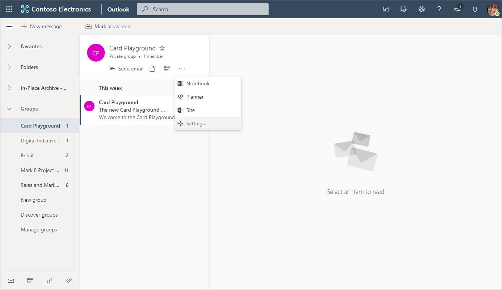
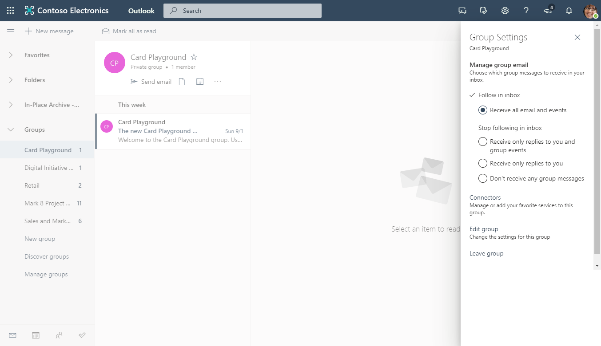
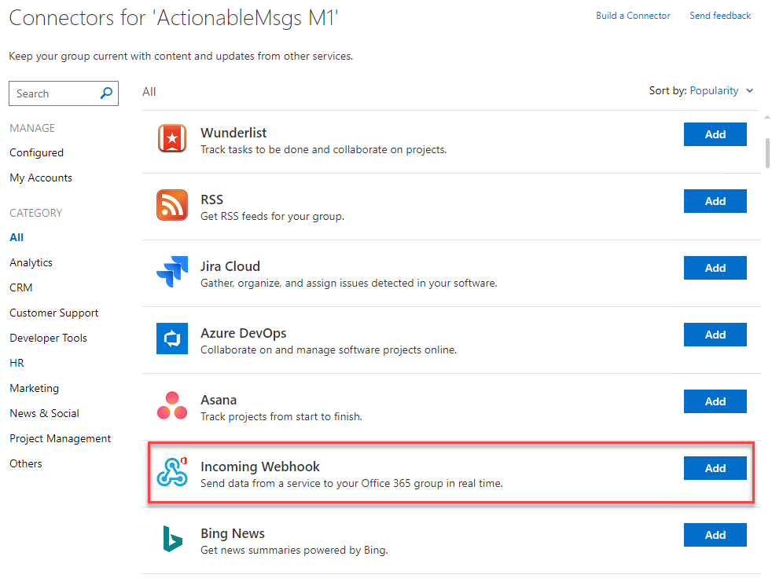
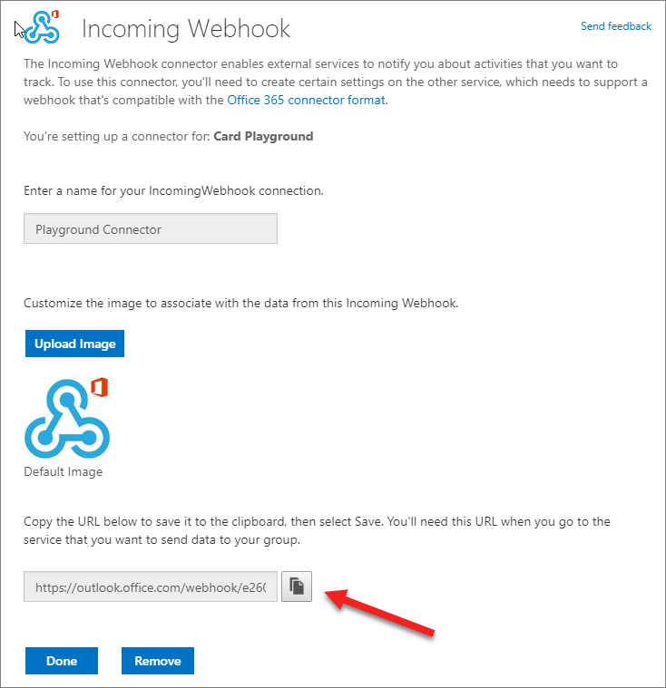
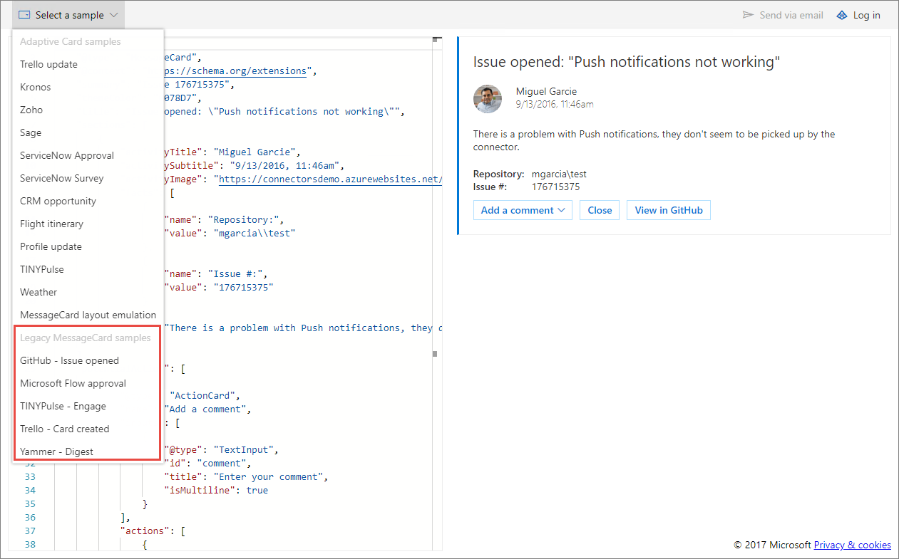

# Lab: Outlook Message Cards and Incoming Webhook Connector

In this lab, you will learn the steps to create and send connector cards to Office 365 Groups.

## In this lab

1. [Create a card payload and submit it via an incoming webhook](#exercise1)

## Prerequisites

This lab will require an Office 365 tenant and a user account that has a mailbox.

<a name="exercise1"></a>

## Exercise 1: Create a card payload and submit it via an incoming webhook

In this exercise, you will copy an example card from the Message Card Playground website and send it to an Office 365 group in your tenant.

### Create a group and configure the webhook

1. Open a browser and go to [Microsoft Outlook](https://outlook.office.com). Log in with your Office 365 credentials.

1. Create a new group, or select an existing group.

1. In the Group information card above the message list, select the elipsis (**...**) then select **Settings**.

    

1. In the Group Settings pane, select **Connectors**.

    

1. In the list of connectors, scroll down and select **Add** next to **Incoming Webhook**.

    

1. Enter a name for the connector and select **Create**.

1. The page will re-display, now including a URL for the connector. Use the icon next to the URL to copy it to the clipboard.

    

    > Note: The URL will be used several times in this exercise, as will the clipboard. We recommend pasting the URL into Notepad or other application.

1. Select **Done**. Then close the Connector and Group settings menus.

### Explore MessageCard playground

1. In another browser tab or window, navigate to [Actionable Messages Designer](https://amdesigner.azurewebsites.net).

1. The playground site provides for uploading a custom card definition or reviewing several samples. Use the **select a sample** dropdown to select a sample. This lab requires that the sample uses the **Legacy MessageCard samples** at the bottom of the dropdown.

    

    > Note: Choosing an **Adaptive Card Sample** may result in an error in the next section of the lab.

### Send card via PowerShell

It is not necessary to use the playground website to send test messages. Any facility for sending HTTP POST requests can also send cards to the group.

1. Select the JSON of a card from the MessageCard Playground and copy it to Notepad.
1. Save the card source as **connector-card.json**.
1. Open **Windows PowerShell** and change to the directory containing the **connector-card.json** file.
1. Execute the following commands:

    ```powershell
    $message = Get-Content .\connector-card.json
    $url = <YOUR WEBHOOK URL>
    Invoke-RestMethod -ContentType "application/json" -Body $message -Uri $url -Method Post
    ```

    

    > The `Invoke-RestMethod` cmdlet will return **1** to indicate success.

