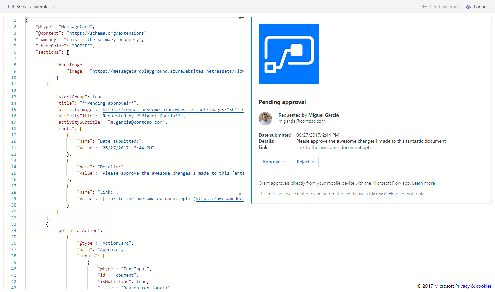
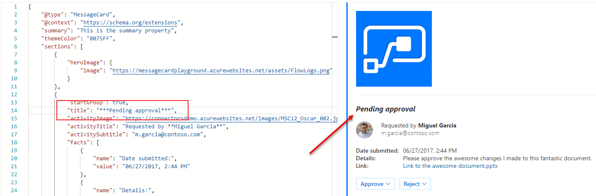
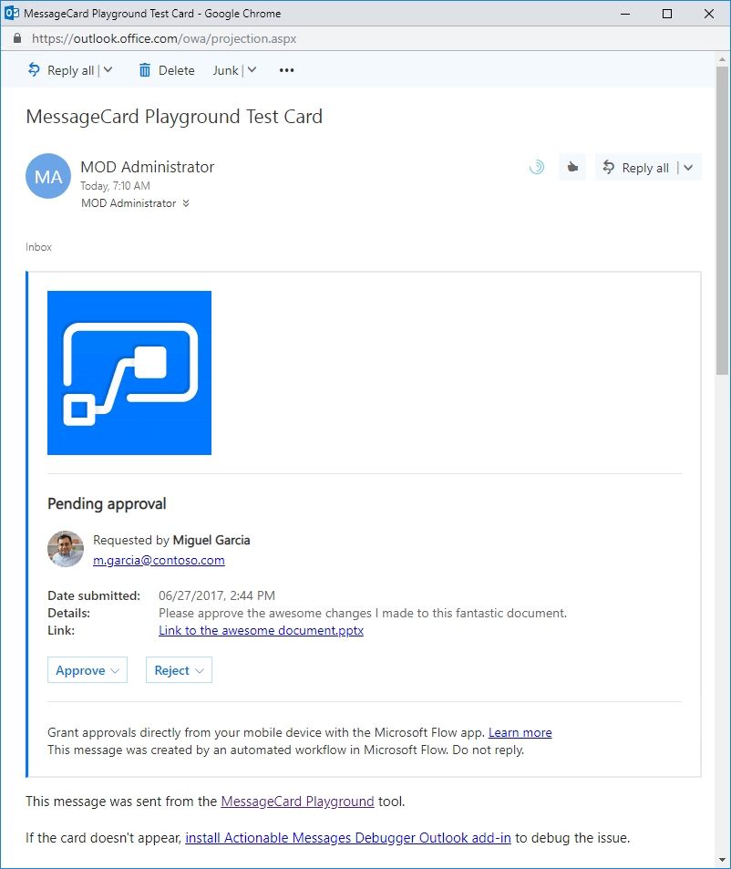

# Demo: Cards and Actions Using Outlook Actionable Messages

This demo will walk through building building an Actionable Message card using the [MessageCard Playground](https://messagecardplayground.azurewebsites.net/) app.

## Prerequisites

This demo requires an Office 365 subscription with an active mailbox and a **Microsoft Azure** subscription.

## Select a MessageCard to edit

1. Visit the [MessageCard Playground](https://messagecardplayground.azurewebsites.net/) app.

    

    The MessageCard Playground provides a sandboxed environment with which to design and test your cards. You can choose from a list of existing samples or load your own sample. Each of these samples provides an interesting component of the syntax used to design a card. You can make modifications within the page that are shown visually, enabling you to quickly modify a card's design.

1. In the drop-down menu, choose **Microsoft Flow Approval**.

    

## Modify a sample

1. Edit the `activityTitle` element to surround it with two asterisks instead of none:

    

    >Note: You can use basic markdown formatting for text elements within the card.

1. Select the **Send via Email** button to send the card to the logged-in user.

    > NOTE: If you see a message indicating that the mail could not be sent, check pop-up blocker in your browser. The first attempt to send an email includes a prompt for incremental consent.

    

1. Note that the buttons on the sample cards will not work.

1. Explore the other samples in the MessageCard Playground app. These are good references to use as a basis for your own card design. Only Legacy MessageCard samples will work using the **Send via Email** function.

    
