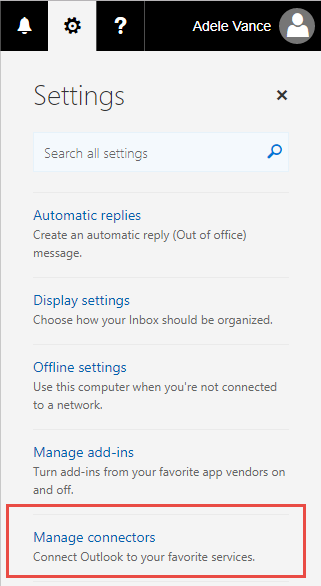
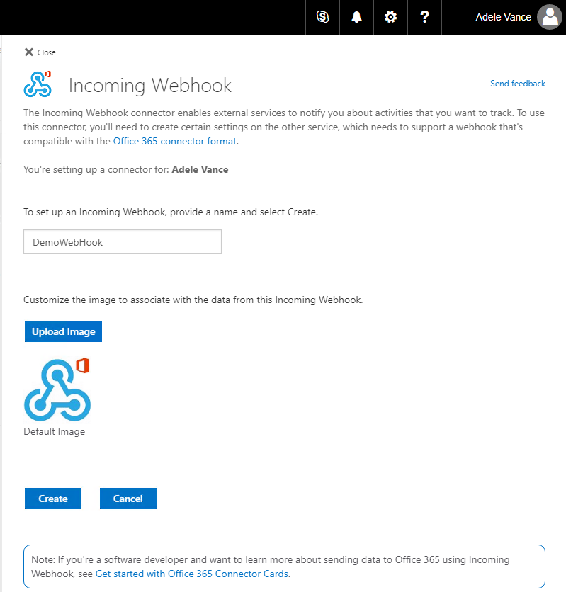

# Cards and Actions Using Outlook Actionable Messages – 300 Level
----------------
In this lab, you will walk through building an Actionable Message card and adding actions. 

## Prerequisites

This demo uses Azure PowerShell. It also requires an Office 365 subscription with an active mailbox. A sample JSON file, `cardsample.json` is used as the basis for this lab. Edit the file to replace the **YOURWEBAPP** placeholder with the name of your Azure Web App.


## Sending Actionable Messages 

In the previous section, you used the [MessageCard Playground]() app to design a card and send it to yourself. In this section, you will use PowerShell to send an email containing a card as well as using PowerShell to call a webhook URL that sends a card.

### Write PowerShell to Send Email via Office 365 SMTP Server
PowerShell provides a utility method `Send-MailMessage` that is used to send emails. We can use this method with the Office 365 SMTP Server to send an email using PowerShell.

Open **PowerShell ISE** and expand the script pane. **Copy** the following PowerShell script to the script pane.

````PowerShell
Param(
  [Parameter(Mandatory = $true, 
    HelpMessage="The Office 365 email address the email is being sent from")]
  [ValidateNotNullOrEmpty()]
  [string]$from,

  [Parameter(Mandatory = $true, 
    HelpMessage="Theemail address the email is being sent to")]
  [ValidateNotNullOrEmpty()]
  [string]$to
  )

$emailHeader = "<html><head><meta http-equiv='Content-Type' content='text/html; charset=utf-8'><script type='application/ld+json'>"
$jsonBody = Get-Content .\CardSample.json
$emailFooter = "</script></head><body>Visit the <a href='https://docs.microsoft.com/en-us/outlook/actionable-messages'>Outlook Dev Portal</a> to learn more about Actionable Messages.</body></html>"

$emailBody = $emailHeader + $jsonBody + $emailFooter

$msolcred = Get-Credential
Send-MailMessage –From $from –To $to –Subject "MessageCard Demo" –Body $emailBody -BodyAsHtml -SmtpServer smtp.office365.com -Credential $msolcred -UseSsl -Port 587
````
In the interactive pane, change directory to the location where you saved the JSON file representing the fictitious expense report.


**Run** the script. You are prompted for the email From and To properties, enter your own email address for both. You are also prompted for login credentials to your Office 365 mailbox.

After you provide your credentials, the script completes. **Check** your inbox, and you will have a new email containing the card that you just sent.

### Write PowerShell to Send Email via a Webhook
Besides sending via email, your application can also send Actionable Message cards via webhooks. Open your Office 365 inbox and click on the gears icon. **Click** the `Manage Connectors` link.



On the next page, **configure** the properties of your incoming webhook by providing a name and an icon. **Click** the Create button.



Once created, copy the resulting link.


**Open** a new script window in PowerShell ISE. **Paste** the following PowerShell script:

````PowerShell
Param(
  [Parameter(Mandatory = $true, 
    HelpMessage="The URL of the registered Office 365 connector webhook")]
  [ValidateNotNullOrEmpty()]
  [string]$url
  )


$jsonBody = Get-Content .\CardSample.json

Invoke-RestMethod -Method Post -Uri $url -Body $jsonBody -ContentType application/json
````
Run the script, you are prompted for the URL of the registered Office 365 connector webhook. **Paste** the URL that you received when registering. 

**Check** your Office 365 mail inbox and see that a new email is delivered containing the body of the card.

<a name="Adding actions to cards"></a>

