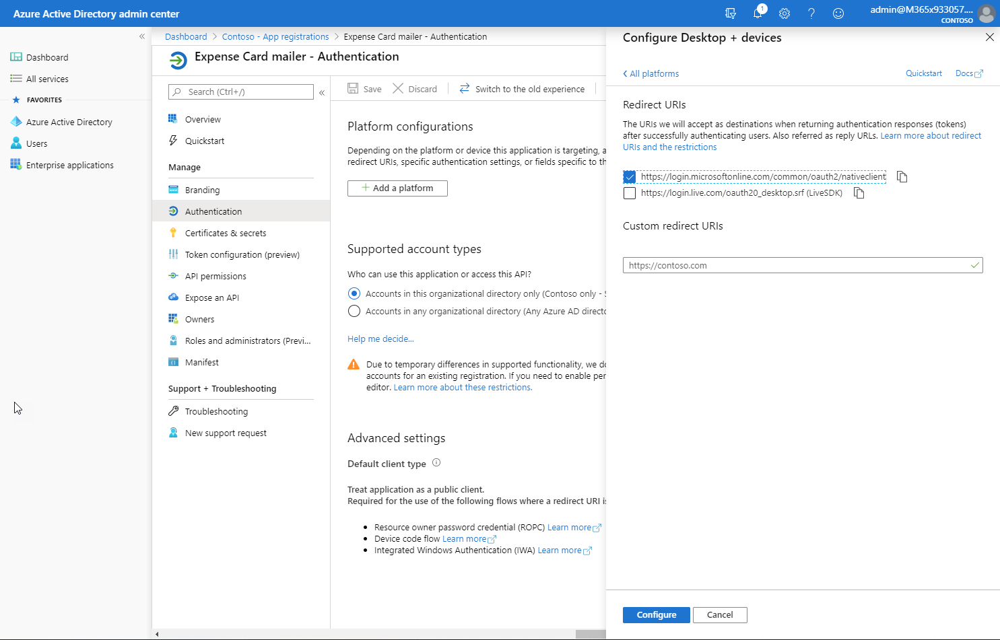

# Demo: Sending Actionable Messages

In this exercise, you will create a custom message card and email it using the Microsoft Graph.

## Prerequisites

This demo requires an Office 365 subscription with an active mailbox. A sample JSON file, `expenseCard.json` is used as the basis for this lab.

### Create a card

1. Visit the [MessageCard Playground](https://messagecardplayground.azurewebsites.net/) site.

1. Replace the JSON data in the MessageCard Playground app with the contents of the **expenseCard.json** file.

1. Review the card in the MessageCard Playground, highlighting the `potentialAction` attribute and its children.

### Register application in the Azure Active Directory

Using Microsoft Graph to send emails requires an application registration.

1. Open the [Azure Active Directory admin center](https://aad.portal.azure.com).

1. Log in with the work or school account that is an administrator in the tenant.

1. Select **Azure Active Directory** in the left-most blade.

1. Select **App registrations** in the left-hand menu.

1. Select **New registration**.

1. Enter a name for the application. A suggested name is `Expense Card mailer`. Select **Register**.

1. In the **Overview** blade, copy the **Application (client) ID**.

1. In the **Overview** blade, , copy the **Directory (tenant) ID**.

1. Select **Authentication** in the left-hand menu.

1. In the **Redirect URIs** > **Suggested Redirect URIs for public clients (mobile, desktop)** section, select the native client URI. (`https://login.microsoftonline.com/common/oauth2/nativeclient`)

    

1. Select **Save** from the toolbar at the top of the Authentication blade.

### Compile the SendCardEmail program

1. Launch **Visual Studio 2017**.

1. Open the `SendEmailCard.sln` solution from the **LabFiles\SendCardEmail** folder.

1. Open the **App.config** file in Solution Explorer.

1. Find the following line:

    ```xml
    <add key="applicationId" value="[your-app-id-here]" />
    <add key="tenantId" value="[your-tenant-id-here]" />
    ```

1. Paste the application ID you copied from the portal into the `value`, replacing the token `[your-app-id-here]`.

1. Past the tenant ID you copied from the portal into the `value`, replacing the token `[your-tenant-id-here]`.

1. Save the file.

1. Press **Ctrl+Shift+B** in Visual Studio to build the app.

1. An executable program named **SendEmailCard.exe** is compiled into the `bin` folder. This executable is used in the lab.

### Send email with MessageCard via console application

Sending a MessageCard via email requires a message body in HTML. The MessageCard JSON is included in the `<head>` element of the HTML document, wrapped in a `<script>` tag with a specific type attribute. The `SendEmailCard.sln` solution compiled earlier has code showing the message format that you can review.

1. Open a command prompt.

1. Change to the folder containing the **SendEmailCard.exe** file.

1. Run the command, specifying two arguments:

    ```shell
    SendEmailCard.exe actionable expenseCard.json
    ```

1. A pop-up authentication window should appear. Login with the Work or School  account specified in the Actionable Email Developer Dashboard. Review the list of requested permissions and click **Accept** or **Cancel**. (**Note:** choosing **Cancel** will result in the app returning an error and not sending a message.)

1. The command prompt window should output `Message sent` to indicate success.

1. Check your inbox using Outlook on the web for the message.

1. After reviewing the card, delete it from your inbox. This will prevent confusion during later steps in the lab.
