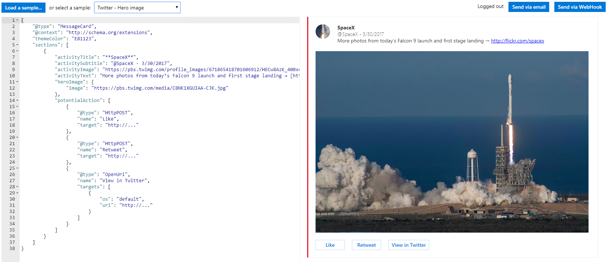
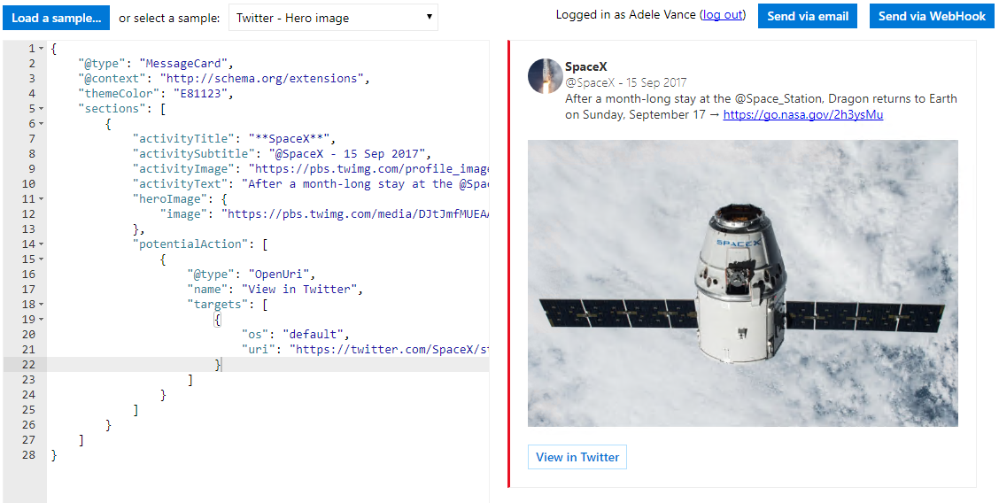
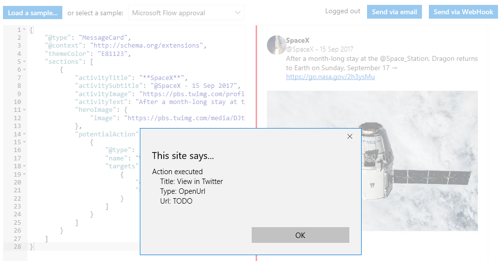
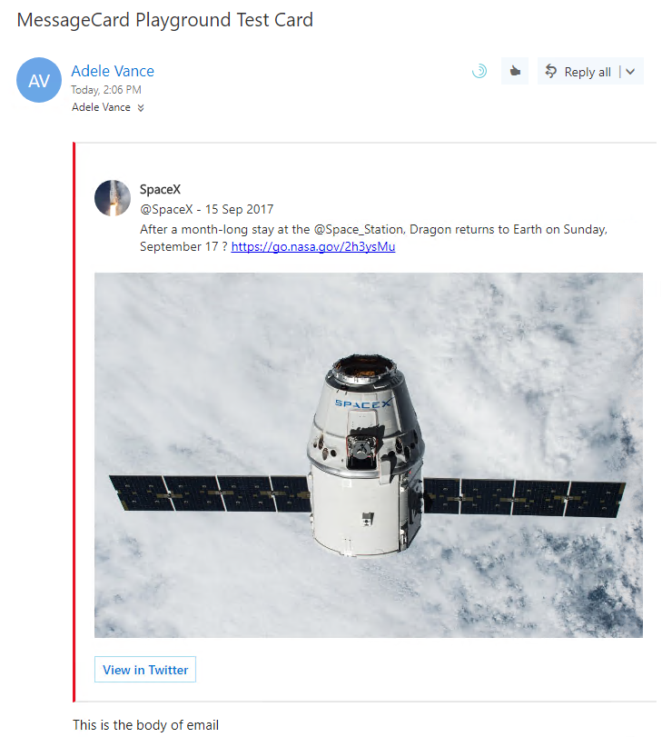
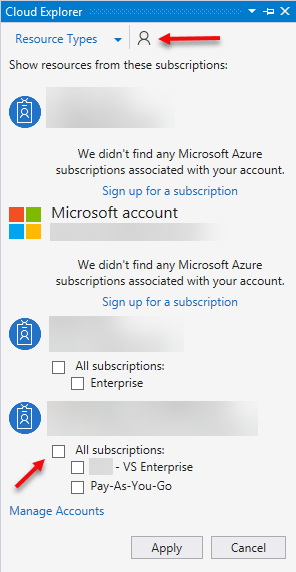

# Cards and Actions Using Outlook Actionable Messages – 300 Level

In this lab, you will walk through building an Actionable Message card and adding actions. 

## Table of Contents

1. [Actionable Messages card design and MessageCard Playground](#messagecardplayground)
1. [Sending Actionable Messages](#sendingactionablemessages)
1. [Adding actions to cards](#processingactions)

## Prerequisites

This lab uses Visual Studio 2017. It also requires an Office 365 subscription with an active mailbox and a **Microsoft Azure** subscription.

## Setup

This lab will use an Azure Web App to deploy an application. The URL of the web app is required. Visit the [Microsoft Azure Portal](https://portal.azure.com) and create a new Web App using the Free pricing tier. Copy the URL (for example, https://mywebapp.azurewebsites.net) for later use.

<a name="messagecardplayground"></a>

## 1. Actionable Messages card design and MessageCard Playground

This lab will walk you through designing an Actionable Message card using the [MessageCard Playground](https://messagecardplayground.azurewebsites.net/) app.

### Visit the MessageCard Playground

Visit the [MessageCard Playground](https://messagecardplayground.azurewebsites.net/) app.


The MessageCard Playground provides a sandboxed environment with which to design and test your cards. You can choose from a list of existing samples or load your own sample. Each of these samples provides an interesting component of the syntax used to design a card. You can make modifications within the page that are shown visually, enabling you to quickly modify a card's design.

One of the simplest sample cards to start with is the **Twitter - Hero Image** sample card. In the drop-down, choose **Twitter - Hero Image**.



This card demonstrates basic text formatting with markdown, using images, and provides a sample of potential actions.

### Modify a sample

Edit the **activityTitle** element to surround it with three asterisks instead of two:


Notice the title in the card is now bold and italics. You can use basic markdown formatting for text elements within the card. 

Open your browser to the [SpaceX Twitter page](https://twitter.com/SpaceX/status/908827608678244352) from September 15 2017.


You will use the information on that page to see how to customize a card sample. Replace the activitySubtitle, activityText, and heroImage properties to reflect the information shown in that tweet. Additionally, change the potentialAction element to use the OpenUri URL to the tweet.

**Replace** the JSON in the MessageCard Playground app with the following:

````json
{
  "@type": "MessageCard",
  "@context": "http://schema.org/extensions",
  "themeColor": "E81123",
  "sections": [
    {
      "activityTitle": "**SpaceX**",
      "activitySubtitle": "@SpaceX - 15 Sep 2017",
      "activityImage": "https://pbs.twimg.com/profile_images/671865418701606912/HECw8AzK_400x400.jpg",
      "activityText": "After a month-long stay at the @Space_Station, Dragon returns to Earth on Sunday, September 17 → [https://go.nasa.gov/2h3ysMu](https://go.nasa.gov/2h3ysMu)",
      "heroImage": {
                "image": "https://pbs.twimg.com/media/DJtJmfMUEAAmwEj.jpg"			    
      },
      "potentialAction": [
        {
          "@type": "OpenUri",
          "name": "View in Twitter",
          "targets": [
            {
              "os": "default",
              "uri": "https://twitter.com/SpaceX/status/908827608678244352"
            }
          ]
        }
      ]
    }
  ]
}
````



The message card now reflects a different tweet. This demonstrates how your application can change the information in a card and send it to a user or group.

Now let's see how changing the action affected the card. Click on the **View in Twitter** button.



Actions in the MessageCard Playground app are disabled, only prompting the information that you provided in the card. However, you can send the card to your Office 365 email account to view the card and interact with its actions. Click the **Send via Email** button to send the card to yourself in email.
>**NOTE:** If you are not logged in to the MessageCard Playground it will prompt you to log in and then ask for your consent.  When consent is given the MessageCard Playgroud page will reload and you will need to load the sample again.



Finally, click the **View in Twitter** button and see that your browser opens and the original Twitter page is displayed.

Explore the other samples in the MessageCard Playground app. These are good references from which to base your own card design.

### Create a card

The card you will use for the rest of the lab represents a fictitious expense approval system and has the following markup:

````json
{
    "@type": "MessageCard",
    "@context": "http://schema.org/extensions",
    "summary": "This is the summary property",
    "themeColor": "0075FF",
    "sections":
    [
      {
        "heroImage":
        {
          "image": "http://messagecardplayground.azurewebsites.net/assets/FlowLogo.png"
        }
      },
      {
        "startGroup": true,
        "title": "**Pending approval**",
        "activityImage": "http://connectorsdemo.azurewebsites.net/images/MSC12_Oscar_002.jpg",
        "activityTitle": "Requested by **Miguel Garcia**",
        "activitySubtitle": "m.garcia@contoso.com",
        "facts":
        [
          {
            "name": "Date submitted:",
            "value": "06/27/2017, 2:44 PM"
          },
          {
            "name": "Details:",
            "value": "Please approve this expense report for **$123.45**."
          },
          {
            "name": "Link:",
            "value": "[Link to the expense report](http://messagecardplayground.azurewebsites.net)"
          }
        ]
      },
      {
        "potentialAction":
        [
          {
            "@type": "ActionCard",
            "name": "Approve",
            "inputs":
            [
              {
                "@type": "TextInput",
                "id": "comment",
                "isMultiline": true,
                "title": "Reason (optional)"
              }
            ],
            "actions":
            [
              {
                "@type": "HttpPOST",
                "name": "Submit",
                "target": "https://YOURWEBAPPNAME.azurewebsites.net/api/expense?id=9876&action=approve",
                "body": "={{comment.value}}",
                "headers":
                [
                  {
                    "Content-Type": "application/x-www-form-urlencoded"
                  }
                ]
              }
            ]
          },
          {
            "@type": "ActionCard",
            "name": "Reject",
            "inputs":
            [
              {
                "@type": "TextInput",
                "id": "comment",
                "isMultiline": true,
                "title": "Reason (optional)"
              }
            ],
            "actions":
            [
              {
                "@type": "HttpPOST",
                "name": "Submit",
                "target": "https://YOURWEBAPPNAME.azurewebsites.net/api/expense?id=9876&action=approve",
                "body": "={{comment.value}}",
                "headers":
                [
                  {
                    "Content-Type": "application/x-www-form-urlencoded"
                  }
                ]
              }
            ]
          }
        ]
      },
      {
        "startGroup": true,
        "activitySubtitle": "Grant approvals directly from your mobile device with the Microsoft Flow app. [Learn more](http://learnmode)\n\nThis message was created by an automated workflow in Microsoft Flow. Do not reply."
      }
    ]
  }
````

Note the *YOURWEBAPPNAME.azurewebsites.net* placeholders usedin this sample. Replace both instances with the Azure Web App URL that you created earlier in this lab.

**Replace** the JSON data in the MessageCard Playground app with this JSON data, making sure that the URL for your Azure Web App uses the https protocol.

Click **Send via Email** to send the card to yourself.

Check your email and open the message. Click the **Approve** button. You will see text below the button that says "The action could not be completed." We have not yet registered the action or implemented the web site, we will do that in this lab.

Finally, **save** the JSON representing the expense report to your file system. You will use this later in the lab.

<a name="sendingactionablemessages"></a>

## 2. Sending Actionable Messages

In the previous section, you used the [MessageCard Playground]() app to design a card and send it to yourself. In this section, you will use PowerShell to send an email containing a card.

### Write PowerShell to Send Email via Office 365 SMTP Server

PowerShell provides a utility method `Send-MailMessage` that is used to send emails. We can use this method with the Office 365 SMTP Server to send an email using PowerShell.

Open **PowerShell ISE** and expand the script pane. **Copy** the following PowerShell script to the script pane.

````PowerShell
Param(
  [Parameter(Mandatory = $true, 
    HelpMessage="The Office 365 email address the email is being sent from")]
  [ValidateNotNullOrEmpty()]
  [string]$from,

  [Parameter(Mandatory = $true, 
    HelpMessage="The email address the email is being sent to")]
  [ValidateNotNullOrEmpty()]
  [string]$to
  )

$emailHeader = "<html><head><meta http-equiv='Content-Type' content='text/html; charset=utf-8'><script type='application/ld+json'>"
$jsonBody = Get-Content .\CardSample.json
$emailFooter = "</script></head><body>Visit the <a href='https://docs.microsoft.com/en-us/outlook/actionable-messages'>Outlook Dev Portal</a> to learn more about Actionable Messages.</body></html>"

$emailBody = $emailHeader + $jsonBody + $emailFooter

$msolcred = Get-Credential
Send-MailMessage –From $from –To $to –Subject "MessageCard Demo" –Body $emailBody -BodyAsHtml -SmtpServer smtp.office365.com -Credential $msolcred -UseSsl -Port 587
````

In the interactive pane, change directory to the location where you saved the JSON file representing the fictitious expense report.


**Run** the script. You are prompted for the email From and To properties, enter your own email address for both. You are also prompted for login credentials to your Office 365 mailbox.

After you provide your credentials, the script completes. **Check** your inbox, and you will have a new email containing the card that you just sent.

<a name="Adding actions to cards"></a>

## 3. Adding actions to cards

The first section of this lab demonstrated how to design a card, the second section demonstrated how to send Actionable Messages. This section will now pull it all together by implementing a Web API that responds to card actions.

## Register a new provider

Open your browser to the [Actionable Email Developer Dashboard](https://outlook.office.com/connectors/oam/publish) and click **New Provider**. 

Provide a name and image for your provider. You are prompted for an email, this is the email used as the sender for your Actionable Messages. Typically you would use a static email address such as `actions@contoso.com`, but for the purposes of this lab enter your own email address. For the target URL, enter the URL for your Azure web app as an HTTPS URL (for instance, https://myapp.azurewebsites.net). Finally, the scope of submission determines how you will use the provider. Choose **My Mailbox** as the scope.

A scope of **My Mailbox** will only allow actions in cards from your inbox. A scope of **Organization** will allow you to send Actionable Messages to others in your organization, and a scope of **Global** allows you to send to users inside and outside your organization. If you choose **Organization** or **Global**, then your application must first be reviewed and approved before proceeding.

### Create a new Web API application

In Visual Studio 2017, **create** a new Web Application project (File / New / Project / ASP.NET Web Application (.NET Framework). Name the project **ExpenseApproval**. When prompted, choose **Web API**, and ensure that **No Authentication** is selected.


## Add NuGet package

When the Web API is called, the application needs to validate the OAuth bearer token that is sent from Microsoft. The `Microsoft.O365.ActionableMessages.Utilities' NuGet package provides logic necessary to validate the bearer token.

In Visual Studio, **open** the Package Manager Console (Tools / NuGet Package Manager / Package Manager Console) and enter the following:

````PowerShell
Install-Package Microsoft.O365.ActionableMessages.Utilities
````

In Visual Studio, **add** a folder named `Models` and **add** a class named `ValidationModel`. **Replace** the code with the following:

````csharp
using Microsoft.O365.ActionableMessages.Authentication;
using System.Net.Http;

namespace ExpenseApproval.Models
{
    public class ValidationModel
    {
        public bool IsError { get; set; }
        public ActionableMessageTokenValidationResult ValidationResult { get; set; }
        public HttpResponseMessage Response { get; set; }

        public string Message { get; set; }
    }
}
````

In Visual Studio, **add** a folder named `Helpers` and **add** a class named `ActionableMessageHelper`. **Replace** the code with the following:

````csharp
using ExpenseApproval.Models;
using Microsoft.O365.ActionableMessages.Authentication;
using System;
using System.Configuration;
using System.Net;
using System.Net.Http;
using System.Threading.Tasks;
using System.Web.Http;

namespace ExpenseApproval.Helpers
{
    public class ActionableMessageHelper
    {
        public static async Task<ValidationModel> ValidateTokenAsync(HttpRequestMessage request)
        {
            var sender = ConfigurationManager.AppSettings["sender"].ToLower();
            var emailDomain = ConfigurationManager.AppSettings["emailDomain"].ToLower();
            var registeredActionURL = ConfigurationManager.AppSettings["registeredActionURL"].ToLower();

            var message = string.Empty;
            // Validate that we have a bearer token.
            if (request.Headers.Authorization == null ||
                !string.Equals(request.Headers.Authorization.Scheme, "bearer", StringComparison.OrdinalIgnoreCase) ||
                string.IsNullOrEmpty(request.Headers.Authorization.Parameter))
            {
                message = "Missing authentication token.";
                return new ValidationModel {
                    IsError = true,
                    Message = message,
                    Response = CreateCardResponse(request, HttpStatusCode.Unauthorized, message)
                };
            }

            //Validate the token
            var validator = new ActionableMessageTokenValidator();
            var result = await validator.ValidateTokenAsync(request.Headers.Authorization.Parameter, registeredActionURL);
            if (!result.ValidationSucceeded)
            {
                message = "Invalid token.";
                return new ValidationModel
                {
                    IsError = true,
                    Message = message,
                    Response = CreateCardResponse(request, HttpStatusCode.Unauthorized, message),
                    ValidationResult = result
                };
            }

            //The sender is registered in the portal and should be a static email address.         
            if (result.Sender.ToLower().CompareTo(sender) != 0)
            {
                message = "Invalid sender.";
                return new ValidationModel
                {
                    IsError = true,
                    Message = message,
                    Response = CreateCardResponse(request, HttpStatusCode.Forbidden, message),
                    ValidationResult = result
                };
            }

            //TODO: Add additional logic to validate the performer. Here we just compare against
            //the domain.
            if (!result.ActionPerformer.ToLower().EndsWith(emailDomain)) {
                message = "The performer is not allowed.";
                return new ValidationModel
                {
                    IsError = true,
                    Message = message,
                    Response = CreateCardResponse(request, HttpStatusCode.Forbidden, message),
                    ValidationResult = result
                };
            }

            //Return a validation model without creating a response, caller must create their own
            //response.
            return new ValidationModel
            {
                IsError = false,
                ValidationResult = result
            };
        }

        internal static HttpResponseMessage CreateCardResponse(HttpRequestMessage request, HttpStatusCode code, string cardStatus)
        {
            if (code == HttpStatusCode.OK)
            {
                HttpResponseMessage response = request.CreateResponse(code);
                response.Headers.Add("CARD-ACTION-STATUS", cardStatus);
                return response;
            }
            else
            {
                var errorResponse = request.CreateErrorResponse(code, new HttpError());
                errorResponse.Headers.Add("CARD-ACTION-STATUS", cardStatus);
                return errorResponse;
            }
        }


        public static string GetCardBody(string value, string result, string performer)
        {
            string template = ExpenseApproval.Properties.Resources.refreshCard;

            return template
                .Replace("{{approvalResult}}", result)
                .Replace("{{performer}}", performer)
                .Replace("{{processDate}}", System.DateTime.Now.ToLongTimeString());           
        }
    }
}
````

Notice the first few lines in the ValidateTokenAsync method use configuration settings. **Open** the web.config file in your project's root directory and **add** the following to the appSettings section and fill in the values:

````xml
<add key="sender" value="" />                        <!-- Ex: admin@contoso.onmicrosoft.com -->
<add key="emailDomain" value="" />                   <!-- Ex: @contoso.onmicrosoft.com -->
<add key="registeredActionURL" value="" />           <!-- Ex: https://myapp.azurewebsites.net -->
````

The `GetCardBody` method references a project resource file to obtain a template representing the card to send as a response. **Double-click** the Properties node in Visual Studio and click on the **Resources** tab. **Add** a new string resource named "refreshCard" and paste the following JSON:

````json
{
  "@type": "MessageCard",
  "@context": "http://schema.org/extensions",
  "summary": "This is the summary property",
  "themeColor": "0075FF",
  "sections":
  [
    {
      "heroImage":
      {
        "image": "http://messagecardplayground.azurewebsites.net/assets/FlowLogo.png"
      }
    },
    {
      "startGroup": true,
      "title": "{{approvalResult}}",
      "activityImage": "http://connectorsdemo.azurewebsites.net/images/MSC12_Oscar_002.jpg",
      "activityTitle": "Requested by **Miguel Garcia**",
      "activitySubtitle": "m.garcia@contoso.com",
      "facts":
      [
        {
          "name": "Date submitted:",
          "value": "06/27/2017, 2:44 PM"
        },
        {
          "name": "Date processed:",
          "value": "{{processDate}}"
        },
        {
          "name": "Processed by:",
          "value": "{{performer}}"
        },
        {
          "name": "Details:",
          "value": "Please approve this expense report for **$123.45**."
        },
        {
          "name": "Link:",
          "value": "[Link to the expense report](http://connectorsdemo.azurewebsites.net)"
        }
      ]
    },    
    {
      "startGroup": true,
      "activitySubtitle": "Grant approvals directly from your mobile device with the Microsoft Flow app. [Learn more](http://learnmode)\n\nThis message was created by an automated workflow in Microsoft Flow. Do not reply."
    }
  ]
}
````

The JSON contains placeholders that are replaced with actual values by the code.

### Implement the controller

**Rename** the default controller class named **ValuesController** to **ExpenseController**. Replace the class contents with the following.

````csharp
using ExpenseApproval.Helpers;
using System.Diagnostics;
using System.Net;
using System.Net.Http;
using System.Threading.Tasks;
using System.Web.Http;

namespace ExpenseApproval.Controllers
{
    public class ExpenseController : ApiController
    {
        // POST api/values
        public async Task<HttpResponseMessage> Post([FromUri]string id, [FromUri]string action, [FromBody]string value)
        {
            //Validate the token before continuing. 
            var ret = await ActionableMessageHelper.ValidateTokenAsync(Request);
            if(ret.IsError)
            {
                Trace.TraceError(ret.Message);
                return ret.Response;
            }

            // TODO: Add business logic code here to process the expense report
            HttpResponseMessage response;
            var approvalResult = default(string);

            if(action == "approve")
            {
                approvalResult = "Approved";
                response = ActionableMessageHelper.CreateCardResponse(Request, HttpStatusCode.OK, "The expense was approved.");
                Trace.TraceInformation("Expense report approved: " + value);
            }
            else
            {
                approvalResult = "Declined";
                response = ActionableMessageHelper.CreateCardResponse(Request, HttpStatusCode.OK, "The expense was declined.");
                Trace.TraceInformation("Expense report declined: " + value);
            }

            //Refresh the card
            response.Headers.Add("CARD-UPDATE-IN-BODY", "true");
            string refreshCard = ActionableMessageHelper.GetCardBody(value, approvalResult, ret.ValidationResult.ActionPerformer);
            response.Content = new StringContent(refreshCard);

            return response;
        }
    }
}
````

### Publish the Azure Web Application

The Web API that you just created will be called from Microsoft, so it needs to be available publicly and not running locally on localhost. Right-click the web application project and choose **Publish**. Choose **Select Existing** and click **OK**.


Choose your existing Web App and click **OK**.

In the **Publish** window, click the **Settings...** link. Click the **Settings** tab and change the configuration to **Debug**.


**Save** your changes then click **Publish** to publish your web application code.

### Debug the Azure Web App

You can attach a debugger to an Azure Web App similar to how you attach a debugger to a local process during debugging. In Visual Studio 2017, open the **Cloud Explorer** pane and expand the **App Services** node to show your Azure Web App. Right-click your web app and choose **Attach Debugger**.


>**NOTE:** If you only see **Local** resources, click on the person icon, make sure the account you used to create the web app service is liste, and then check the `All subscriptions` item to show them in the explorer.
 

Set a breakpoint in the Web API controller to see when messages arrive and debug interactively.

### Test the card

In the previous section, you sent a card to yourself using both PowerShell and a webhook. Those email messages should still be in your inbox (if not, repeat the previous section exercise). Open the email and click the **Approve** button. Provide text, simulating comments to an approval form, and click **Submit**. 


The debugger in your code is reached, and you can step through the code to see the bearer token is validated, the sender and email domains are validated, the refresh card body is retrieved and the response is sent with the appropriate headers.

In your email client, the card is now updated to reflect the data sent in the refresh card.


