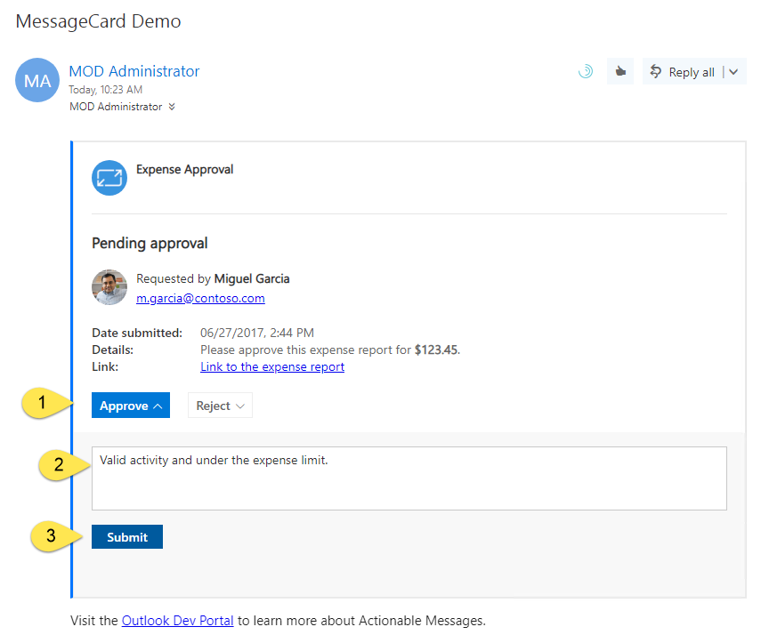

# Lab: Cards and actions using Microsoft Outlook Actionable Messages

In this lab, you will walk through building an Actionable Message card and adding actions.

## In this lab

1. [Actionable Messages card design and MessageCard Playground](#exercise-1-actionable-Messages-card-design-and-messagecard-playground)
1. [Sending Actionable Messages](#exercise-2-sending-actionable-messages)
1. [Adding actions to cards](#exercise-3-adding-actions-to-cards)

## Prerequisites

This lab will require an Office 365 tenant and a user account that has a mailbox. The lab will require Visual Studio 2017.

### Install developer tools

The developer workstation requires the following tools for this lab.

#### Download ngrok

The connector registration process requires an endpoint accessible from the internet via HTTPS. To enable the exercises to work correctly, a tunneling application is required.

This lab uses [ngrok](https://ngrok.com) for tunneling publicly-available HTTPS endpoints to a web server running locally on the developer workstation. ngrok is a single-file download that is run from a console.

## Exercise 1: Actionable Messages card design and MessageCard Playground

This exercise will walk you through the [MessageCard Playground](https://messagecardplayground.azurewebsites.net/) site.

The MessageCard Playground provides a sandboxed environment with which to design and test your cards. You can choose from a list of existing samples or load your own sample. Each of these samples provides an interesting component of the syntax used to design a card. You can make modifications within the page that are shown visually, enabling you to quickly modify a card's design.

### Select a MessageCard to edit

1. Visit the [MessageCard Playground](https://messagecardplayground.azurewebsites.net/) site. At the top right, select **Log in**.

1. If requested, grant consent to the Designer for Actionable Messages application.

1. In the drop-down menu, choose **Microsoft Flow Approval**.

    

### Modify a sample

1. Edit the `title` element to surround it with three asterisks instead of two, note how the text changes:

    

    >Note: You can use basic markdown formatting for text elements within the card.

1. Select the **Send via Email** button to send the card to the logged-in user.

    > NOTE: If you see a message indicating that the mail could not be sent, check pop-up blocker in your browser. The first attempt to send an email includes a prompt for incremental consent.

    

1. Note that the buttons on the sample cards will not work.

1. Explore the other samples in the MessageCard Playground app. These are good references to use as a basis for your own card design. Only Legacy MessageCard samples will work using the **Send via Email** function.

    

## Exercise 2: Sending Actionable Messages

In this exercise, you will create a custom message card and email it using the Microsoft Graph.

### Register application in the Azure Active Directory

Using Microsoft Graph to send emails requires an application registration.

1. Open the [Azure Active Directory admin center](https://aad.portal.azure.com).

1. Log in with the work or school account that is an administrator in the tenant.

1. Select **Azure Active Directory** in the left-most blade.

1. Select **App registrations** in the left-hand menu.

1. Select **New registration**.

1. Enter a name for the application. A suggested name is `Expense Card mailer`. Select **Register**.

1. In the **Overview** blade, copy the **Application (client) ID**.

1. In the **Overview** blade, , copy the **Directory (tenant) ID**.

1. Select **Authentication** in the left-hand menu.

1. In the **Redirect URIs** > **Suggested Redirect URIs for public clients (mobile, desktop)** section, select the native client URI. (`https://login.microsoftonline.com/common/oauth2/nativeclient`)

    

1. Select **Save** from the toolbar at the top of the Authentication blade.

### Compile the SendCardEmail program

1. Launch **Visual Studio 2017**.

1. Open the `SendEmailCard.sln` solution from the **LabFiles\SendCardEmail** folder.

1. Open the **App.config** file in Solution Explorer.

1. Find the following lines:

    ```xml
    <add key="applicationId" value="[your-app-id-here]" />
    <add key="tenantId" value="[your-tenant-id-here]" />
    ```

1. Paste the application ID you copied from the portal into the `value`, replacing the token `[your-app-id-here]`.

1. Past the tenant ID you copied from the portal into the `value`, replacing the token `[your-tenant-id-here]`.

1. Save the file.

1. Press **Ctrl+Shift+B** in Visual Studio to build the app.

1. An executable program named **SendEmailCard.exe** is compiled into the `bin` folder. This executable is used in the lab.

### Preview a custom card

1. Replace the JSON data in the MessageCard Playground app with this JSON data. This is the card you will use for the rest of the lab. It is a fictitious expense approval system. (This code is available in the **LabFiles/expenseCard.json** file.)

    ````json
    {
      "@type": "MessageCard",
      "@context": "http://schema.org/extensions",
      "summary": "This is the summary property",
      "themeColor": "0075FF",
      "sections": [
        {
            "activityImage": "https://messagecardplayground.azurewebsites.net/favicon.ico",
            "activityTitle": "**Expense Approval**"
        },
        {
          "startGroup": true,
          "title": "**Pending approval**",
          "activityImage": "http://connectorsdemo.azurewebsites.net/images/MSC12_Oscar_002.jpg",
          "activityTitle": "Requested by **Miguel Garcia**",
          "activitySubtitle": "m.garcia@contoso.com",
          "facts": [
            {
              "name": "Date submitted:",
              "value": "06/27/2017, 2:44 PM"
            },
            {
              "name": "Details:",
              "value": "Please approve this expense report for **$123.45**."
            },
            {
              "name": "Link:",
              "value": "[Link to the expense report](http://messagecardplayground.azurewebsites.net)"
            }
          ]
        },
        {
          "potentialAction": [
            {
              "@type": "ActionCard",
              "name": "Approve",
              "inputs": [
                {
                  "@type": "TextInput",
                  "id": "comment",
                  "isMultiline": true,
                  "title": "Reason (optional)"
                }
              ],
              "actions": [
                {
                  "@type": "HttpPOST",
                  "name": "Submit",
                  "target": "https://tbd.ngrok.io/api/expense?id=9876&action=approve",
                  "body": "={{comment.value}}",
                  "headers": [
                    {
                      "Content-Type": "application/x-www-form-urlencoded"
                    }
                  ]
                }
              ]
            },
            {
              "@type": "ActionCard",
              "name": "Reject",
              "inputs": [
                {
                  "@type": "TextInput",
                  "id": "comment",
                  "isMultiline": true,
                  "title": "Reason (optional)"
                }
              ],
              "actions": [
                {
                  "@type": "HttpPOST",
                  "name": "Submit",
                  "target": "https://tbd.ngrok.io/api/expense?id=9876&action=reject",
                  "body": "={{comment.value}}",
                  "headers": [
                    {
                      "Content-Type": "application/x-www-form-urlencoded"
                    }
                  ]
                }
              ]
            }
          ]
        }
      ]
    }
    ````

1. Save the card JSON to a file named **expenseCard.json**. For convenience, save the file in the folder containing the **SendCardEmail.exe** file build previously. It is used in the next section of the exercise.

### Send email with MessageCard via console application

Sending a MessageCard via email requires a message body in HTML. The MessageCard JSON is included in the `<head>` element of the HTML document, wrapped in a `<script>` tag with a specific type attribute. The `SendEmailCard.sln` solution compiled earlier has code showing the message format that you can review.

1. Open a command prompt.

1. Change to the folder containing the **SendEmailCard.exe** file.

1. Run the command, specifying two arguments:

    ```shell
    SendEmailCard.exe actionable expenseCard.json
    ```

1. A pop-up authentication window should appear. Login with the Work or School  account specified in the Actionable Email Developer Dashboard. Review the list of requested permissions and click **Accept** or **Cancel**. (**Note:** choosing **Cancel** will result in the app returning an error and not sending a message.)

1. The command prompt window should output `Message sent` to indicate success.

1. Check your inbox using Outlook on the web for the message.

1. After reviewing the card, delete it from your inbox. This will prevent confusion during later steps in the lab.

## Exercise 3: Adding actions to cards

In this exercise, you will create and register an application to process Actions on MessageCards.

### Create a new Web API application

1. Launch **Visual Studio 2017**.

1. In Visual Studio 2017, select **File > New > Project**.

1. Create a new **ASP.NET Web Application (.NET Framework)** project. Name the project **ExpenseApproval**. Select **OK**.

    

1. When prompted, select **Web API**, and make sure that **No Authentication** is selected. Select **OK**.

    

Before registering the Actionable Message Provider, note the URL configured for the solution in Visual Studio.

1. In **Solution Explorer**, double-click on **Properties**.

1. In the **Properties** designer, select the **Web** tab.

1. Note the **Project URL**.

    

### Run the ngrok secure tunnel application

1. Open a new **Command Prompt** window.

1. Download [ngrok](https://ngrok.com/download) and unzip the **ngrok secure tunnel application**. Change to the directory that contains the **ngrok.exe** application.

1. Run the command `ngrok http [port] -host-header=localhost` Replace `port` with the port portion of the URL noted above.

1. The ngrok application will fill the entire prompt window. Make note of the forwarding address using HTTPS. This address is required in the next step.

1. Minimize the ngrok command prompt window. It is no longer referenced in this lab, but it must remain running.

    

### Register a new Actionable Email provider

1. Open your browser and go to the [Actionable Email Developer Dashboard](https://outlook.office.com/connectors/oam/publish). Select **New Provider**.

1. Provide a **Friendly Name**.

1. For the **Sender email address from which actionable emails will originate**, enter your email address.

    > NOTE: For production applications, a static email address, such as `actions@contoso.com`, is recommended.

1. For the target URL, enter the HTTPS forwarding address from ngrok.

1. For the **Scope of submission**, select **My Mailbox (auto-approved)**.

    > NOTE: The following are the restrictions on Actions for the possible scopes:
    > - **My Mailbox** enables actionable emails from your service sent to your own mailbox.
    > - **Organization** enables actionable message from your service to any Office 365 email user within your organization. This scope is typically used for enabling actionable messages from a service that is specific to your organization, like a line- of-business application internal to your organization.
    > - **Global** enables actionable message from your service for any email user in Office 365.
    >
    > Selecting "Organization" or "Global" will require a review and approval of your service.

1. Accept the terms of service and select **Save**.

### Complete the Expense Approval service

#### ActionableMessage utilities via NuGet

When the Web API is called, the application needs to validate the OAuth bearer token that is sent from Microsoft. The `Microsoft.O365.ActionableMessages.Utilities` NuGet package provides logic necessary to validate the bearer token.

1. In Visual Studio, select **Tools > NuGet Package Manager > Package Manager Console**.

1. In **Package Manager Console**, enter the following:

    ````PowerShell
    Install-Package Microsoft.O365.ActionableMessages.Utilities
    ````

#### Add a card template as a project resource

The Expense Approval application will refresh the email message with a card representing the status of the approval. This refresh card contains tokens that are replaced at runtime. The refresh card does not have actions to prevent duplicate processing. The card is created using a template that is a resource embedded in the project.

1. In **Solution Explorer**, right-click on the project and select **Add > New Item...**.

1. Select the **JSON File** template. Name the file **refreshCard**. Select **Add**.

    

1. Replace the contents of the **refreshCard.json** file with the code from the file **LabFiles/refreshCardTemplate.json**.

1. Select the **refreshCard.json** file in **Solution Explorer** and press **F4**.

1. In the **Properties** pane, set the **Build Action** of the file to **Embedded Resource**.

    

#### Add helper functions

1. In **Solution Explorer**, right-click on the project. Select **Add > New Folder**. Name the folder `Helpers`.

1. Right-click on the **Helpers** folder. Select **Add > Class**. Name the class `ActionableMessageHelper`.

1. Add the following to the top of the **ActionableMessageHelper.cs** file.

    ```csharp
    using ExpenseApproval.Models;
    using Microsoft.O365.ActionableMessages.Utilities;
    using System;
    using System.Configuration;
    using System.IO;
    using System.Net;
    using System.Net.Http;
    using System.Reflection;
    using System.Threading.Tasks;
    using System.Web.Http;
    ```

1. Replace the generated `ActionableMessageHelper` class with the following code. The code is available in the **LabFiles/ActionableMessageHelper.cs** file.

    ````csharp
    public class ActionableMessageHelper
    {
      public static async Task<ValidationModel> ValidateTokenAsync(HttpRequestMessage request)
      {
        var sender = ConfigurationManager.AppSettings["sender"].ToLower();
        var emailDomain = sender.Substring(sender.IndexOf("@") + 1).ToLower();

        var registeredActionURL = ConfigurationManager.AppSettings["registeredActionURL"].ToLower();

        var message = string.Empty;
        // Validate that we have a bearer token.
        if (request.Headers.Authorization == null ||
          !string.Equals(request.Headers.Authorization.Scheme, "bearer", StringComparison.OrdinalIgnoreCase) ||
          string.IsNullOrEmpty(request.Headers.Authorization.Parameter))
        {
          message = "Missing authentication token.";
          return new ValidationModel
          {
            IsError = true,
            Message = message,
            Response = CreateCardResponse(request, HttpStatusCode.Unauthorized, message)
          };
        }

        //Validate the token
        var validator = new ActionableMessageTokenValidator();
        var result = await validator.ValidateTokenAsync(request.Headers.Authorization.Parameter, registeredActionURL);
        if (!result.ValidationSucceeded)
        {
          message = "Invalid token.";
          return new ValidationModel
          {
            IsError = true,
            Message = message,
            Response = CreateCardResponse(request, HttpStatusCode.Unauthorized, message),
            ValidationResult = result
          };
        }

        //The sender is registered in the portal and should be a static email address.
        if (result.Sender.ToLower().CompareTo(sender) != 0)
        {
          message = "Invalid sender.";
          return new ValidationModel
          {
            IsError = true,
            Message = message,
            Response = CreateCardResponse(request, HttpStatusCode.Forbidden, message),
            ValidationResult = result
          };
        }

        //TODO: Add additional logic to validate the performer.
        //      Here we just compare against the domain.
        if (!result.ActionPerformer.ToLower().EndsWith(emailDomain)) {
          message = "The performer is not allowed.";
          return new ValidationModel
          {
            IsError = true,
            Message = message,
            Response = CreateCardResponse(request, HttpStatusCode.Forbidden, message),
            ValidationResult = result
          };
        }

        //Return a validation model without creating a response, caller must create their own response.
        return new ValidationModel
        {
          IsError = false,
          ValidationResult = result
        };
      }

      internal static HttpResponseMessage CreateCardResponse(HttpRequestMessage request, HttpStatusCode code, string cardStatus)
      {
        if (code == HttpStatusCode.OK)
        {
          HttpResponseMessage response = request.CreateResponse(code);
          response.Headers.Add("CARD-ACTION-STATUS", cardStatus);
          return response;
        }
        else
        {
          var errorResponse = request.CreateErrorResponse(code, new HttpError());
          errorResponse.Headers.Add("CARD-ACTION-STATUS", cardStatus);
          return errorResponse;
        }
      }

      public static string GetCardBody(string value, string result, string performer)
      {
        Assembly assembly;
        StreamReader textStreamReader;

        assembly = Assembly.GetExecutingAssembly();
        textStreamReader = new StreamReader(assembly.GetManifestResourceStream("ExpenseApproval.refreshCard.json"));

        string template = textStreamReader.ReadToEnd();

        return template
            .Replace("{{approvalResult}}", result)
            .Replace("{{performer}}", performer)
            .Replace("{{processDate}}", System.DateTime.Now.ToLongTimeString());
      }
    }
    ````

#### Configure validation values

The helper functions validate that the request is coming from a known mailbox. The valid values are configured in the **web.config** file.

1. Open the **web.config** file.

1. Add the following to the **appSettings** node. The values of these settings must match the entries on the Actionable Email Developer Dashboard
    - Replace the token [sender-email] with the **Sender email address from which actionable emails will originate** value.
    - Replace the token [registered-action-url] with the **Target URLs** value.

    ````xml
    <add key="sender" value="[sender-email]" />
    <add key="registeredActionURL" value="[registered-action-url]" />
    ````

#### Implement the controller and view model

1. In **Solution Explorer**, right-click on the **Models** folder. Select **Add > Class**. Name the class `ValidationModel`.

1. Add the following statements to the top of the **ValidationModel.cs** file.

    ```csharp
    using Microsoft.O365.ActionableMessages.Utilities;
    using System.Net.Http;
    ```

1. Replace the generated `ValidationModel` class with the following code.

    ````csharp
    public class ValidationModel
    {
        public bool IsError { get; set; }
        public ActionableMessageTokenValidationResult ValidationResult { get; set; }
        public HttpResponseMessage Response { get; set; }

        public string Message { get; set; }
    }
    ````

1. In **Solution Explorer**, right-click on the **Controllers** folder. Select **Add > Controller...**. Select the **MVC 5 Controller - Empty** template. Name the controller `ExpenseController`.

1. Add the following to the top of the **ExpenseController.cs** file.

    ```csharp
    using ExpenseApproval.Helpers;
    using System.Diagnostics;
    using System.Net;
    using System.Net.Http;
    using System.Threading.Tasks;
    using System.Web.Http;
    ```

1. Replace the **ExpenseController** class contents with the following. The code is available in the **LabFiles/ExpenseController.cs** file.

    ````csharp
    public class ExpenseController : ApiController
    {
      // POST api/values
      public async Task<HttpResponseMessage> Post([FromUri]string id, [FromUri]string action, [FromBody]string value)
      {
        //Validate the token before continuing.
        var ret = await ActionableMessageHelper.ValidateTokenAsync(Request);
        if(ret.IsError)
        {
          Trace.TraceError(ret.Message);
          return ret.Response;
        }

        // TODO: Add business logic code here to process the expense report
        HttpResponseMessage response;
        var approvalResult = default(string);

        if(action == "approve")
        {
          approvalResult = "Approved";
          response = ActionableMessageHelper.CreateCardResponse(Request, HttpStatusCode.OK, "The expense was approved.");
          Trace.TraceInformation("Expense report approved: " + value);
        }
        else
        {
          approvalResult = "Declined";
          response = ActionableMessageHelper.CreateCardResponse(Request, HttpStatusCode.OK, "The expense was declined.");
          Trace.TraceInformation("Expense report declined: " + value);
        }

        //Refresh the card
        response.Headers.Add("CARD-UPDATE-IN-BODY", "true");
        string refreshCard = ActionableMessageHelper.GetCardBody(value, approvalResult, ret.ValidationResult.ActionPerformer);
        response.Content = new StringContent(refreshCard);

        return response;
      }
    }
    ````

1. Press **F5** to build the solution and launch the debugger.

1. Set a breakpoint in the **ExpenseController** class to see when messages arrive and debug interactively.

#### Update and send Expense Card

The cards sent in exercise 2 had a placeholder URL for the actions. Update the card and re-send to your mailbox.

1. Open the **expenseCard.json** created in Exercise 2. The card json is available in the **LabFiles/expenseCard.json** file.

1. Locate the **target** properties containing the placeholder URL **tbd.ngrok.io**. Replace the placeholder with the forwarding address from the ngrok tunnel. This should also match the value registered on the Actionable Email dashboard and the value in web.config.

1. Save the **expenseCard.json** file.

1. Send the card using the console application from Exercise 2. The command to execute:

    ```shell
    SendEmailCard.exe actionable expenseCard.json
    ```

#### Test the card

1. Open the email containing the expense card. Select the **Approve** button. Enter sample text in the **Reason** box. Select **Submit**.

    

1. The debugger in your code is reached, and you can step through the code to see the bearer token is validated, the sender and email domains are validated, the refresh card body is retrieved and the response is sent with the appropriate headers.

1. In your email client, the card is now updated to reflect the data sent in the refresh card.

    