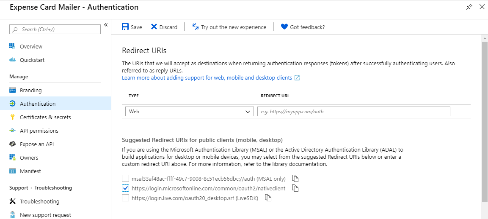

# Creating and sending cards

In this demo, you will walk through building an Adaptive Card and sending it to your inbox using a console application.

## Prerequisites

This demo requires an Office 365 subscription with an active mailbox. A sample JSON file, `supportTicketCard.json` is used as the basis for this lab.

## Preview the Adaptive Card

1. Open the browser to the [Adaptive Card samples page](http://adaptivecards.io/samples/).
1. In the left navigation bar, select on the **Input Form** link. The Input Form sample will show.
1. Review and discuss the preview of the card in the right-hand column. Note that the **Submit** and **Show Card** buttons at the bottom of the card both use the Submit action (Action.submit).
1. Select the **Try it yourself** button. This will open a new tab with the Visualizer page pre-loaded with the Input Form sample card.
1. Point out the value of the **Select Host App** dropdown. The default is **Bot Framework web chat**.

    

1. Choose **Outlook Actionable Messages (Preview)** from the dropdown. Notice that a warning message is display above the card preview. Also notice that the Submit button is not displayed.

    

1. Point out that Action.Submit is not supported by Outlook. Outlook implemented an action (Action.Http) this is not supported in other hosts. Action.Http is discussed later in the module.

## Send the card via console application

### Register application in the Azure Active Directory

Using Microsoft Graph to send emails requires an application registration. (The application registered in Module 2 can be used for this module as well.)

1. Open the [Azure Active Directory admin center](https://aad.portal.azure.com).

1. Log in with the work or school account that is an administrator in the tenant.

1. Select **Azure Active Directory** in the left-most blade.

1. Select **App registrations** in the left-hand menu.

1. Select **New registration**.

1. Enter a name for the application. A suggested name is `Expense Card mailer`. Select **Register**.

1. In the **Overview** blade, copy the **Application (client) ID**.

1. In the **Overview** blade, , copy the **Directory (tenant) ID**.

1. Select **Authentication** in the left-hand menu.

1. In the **Redirect URIs** > **Suggested Redirect URIs for public clients (mobile, desktop)** section, select the native client URI. (`https://login.microsoftonline.com/common/oauth2/nativeclient`)

    

1. Select **Save** from the toolbar at the top of the Authentication blade.

### Compile the SendEmailCard program

1. Launch **Visual Studio 2017**.

1. Open the `SendEmailCard.sln` solution from the **LabFiles\SendEmailCard** folder.

1. Open the **App.config** file in Solution Explorer.

1. Find the following line:

    ```xml
    <add key="applicationId" value="[your-app-id-here]" />
    <add key="tenantId" value="[your-tenant-id-here]" />
    ```

1. Paste the application ID you copied from the portal into the `value`, replacing the token `[your-app-id-here]`.

1. Past the tenant ID you copied from the portal into the `value`, replacing the token `[your-tenant-id-here]`.

1. Save the file.

1. Press **Ctrl+Shift+B** in Visual Studio to build the app.

1. An executable program named **SendEmailCard.exe** is compiled into the `bin` folder. This executable is used in the lab.

### Review message format

1. In **Visual Studio**, open file **AdaptiveMessageBody.html**.

1. Notice that the `<head>` element contains a `<script>` tag. The type for the tag is `application/adaptivecard+json`. This value instructs Microsoft Outlook that the code following should be interpreted as an Adaptive Card.

1. Copy the **supportTicketCard.json** file from exercise 1 to the folder containing the **SendEmailCard.exe** program.

1. Open a command prompt.

1. Change to the folder containing the **SendEmailCard.exe** file.

1. Run the command, specifying two arguments:

    ```shell
    SendEmailCard.exe adaptive supportTicketCard.json
    ```

1. A pop-up authentication window should appear. Login with the Work or School  account specified in the Actionable Email Developer Dashboard. Review the list of requested permissions and click **Accept** or **Cancel**. (**Note:** choosing **Cancel** will result in the app returning an error and not sending a message.)

1. The command prompt window should output `Message sent` to indicate success.

1. Check your inbox using Outlook on the web for the message.
