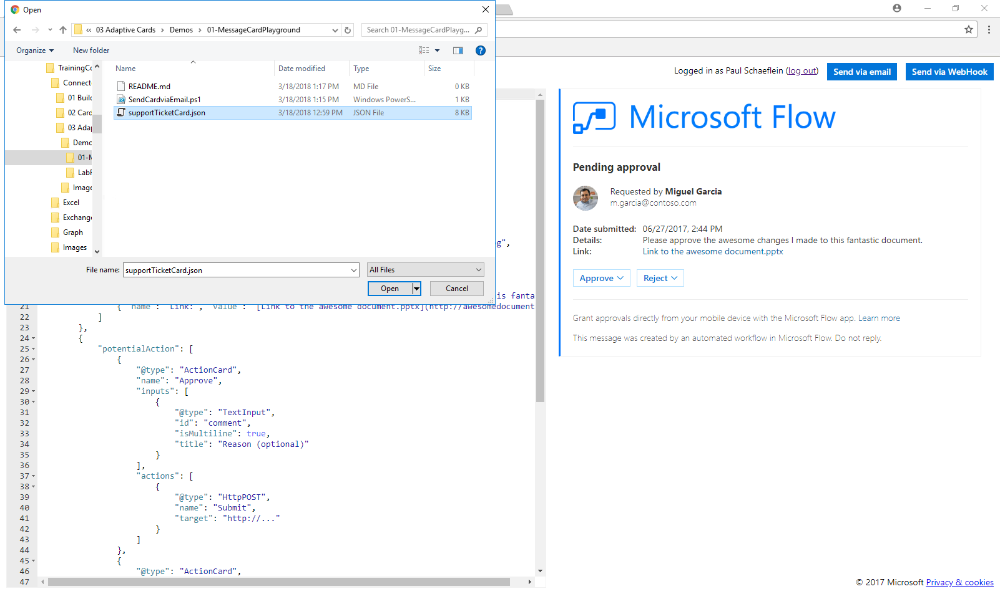

# Creating and sending cards

In this demo, you will walk through building an Adaptive Card and sending it to your inbox using PowerShell.

## Prerequisites

This demo uses PowerShell. It also requires an Office 365 subscription with an active mailbox. A sample JSON file, `supportTicketCard.json` is used as the basis for this lab.

## Preview the Adaptive Card

1. Open the browser to the [Adaptive Card samples page](http://adaptivecards.io/samples/).
2. In the left navigation bar, click on the **Input Form** link. The Input Form sample will show.
3. Review and discuss the preview of the card in the right-hand column. Note that the **Submit** and **Show Card** buttons at the bottom of the card both use the Submit action (Action.submit).
4. Click the **Try it yourself** button. This will open a new tab with the Visualizer page pre-loaded with the Input Form sample card.
5. Point out the value of the **Select Host App** dropdown. The default is **Bot Framework web chat**.

    

6. Choose **Outlook Actionable Messages (Preview)** from the dropdown. Notice that a warning message is display above the card preview. Also notice that the Submit button is not displayed.

    

7. Point out that Action.Submit is not supported by Outlook. Outlook implemented an action (Action.Http) this is not supported in other hosts. Action.Http is discussed later in the module.

## Send an Adaptive card using Message Card Playground

Open the browser to the [Message Card Playground](https://messagecardplayground.azurewebsites.net) site. The site shows a sample card. Replace the sample with the `supportTicketCard.json` in the demo folder.

1. Click the **Load a Sample...** button.
2. In the **Open file** dialog, navigate to the `Demos/01-MessageCardPlayground` folder. Select the file `supportTicketCard.json`

    

3. Review the card source and preview.
4. Click the **Send via Email** button.
5. You will be prompted to log in. if this is the first time using the Message Card Playground, you will be prompted for consent to send messages as you.
6. After log in and consent, a confirmation message will display.

    

7. Open Outlook. Select the message titled "MessageCard Playground Test Card." The message will contain the card, footer text with links about the playground and card documentation, and will show the JSON payload of the card.

    
