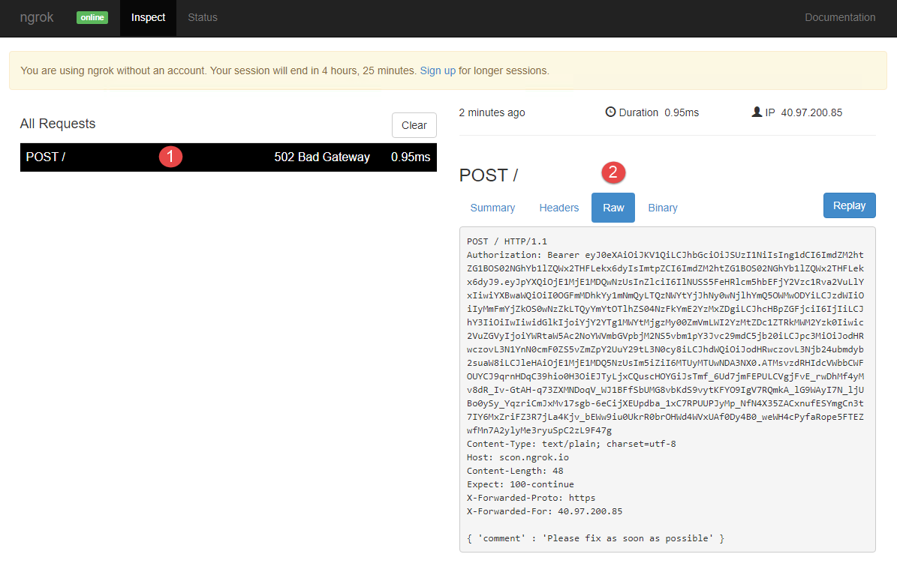

# Adaptive Cards with Actions and Inputs

This demo will show the support ticket card from exercise 1 with Input and Action elements allowing comments on the support ticket directly from Outlook.

## Run the ngrok secure tunnel application

1. Open a new **Command Prompt** window.
1. Change to the directory that contains the ngrok.exe application.
1. Run the command `ngrok http 8011 -host-header=localhost:8011`
1. The ngrok application will fill the entire prompt window. Make note of the Forwarding address using https. This address is required in the next step.
1. Minimize the ngrok Command Prompt window. It is no longer referenced in this exercise, but it must remain running.

## Update card and send via email

1. Using the [Card Playground](https://messagecardplayground.azurewebsites.net) site, paste the contents of **Demos/02-CardWithActionAndInput/supportTicketWithActionAndInput.json** file into the code window.
1. Select the **Send via Email** button
1. Open Outlook.
1. Open the message with subject **Card Playground Test Card**.
1. Enter a sample message and select **OK*. Outlook will display an error.
1. Navigate to the ngrok inspector page at `http://localhost:4040`.
1. Select on the first request in the left column. In the right column, select on the link titled **Raw**.
1. Observe that the request contains an Authorization header and the body contains the value as defined in the card.

