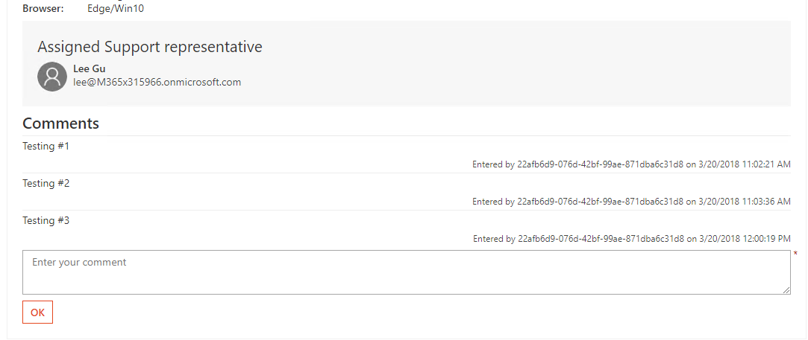

# Actionable Message with Refresh Card

This demo will show an actionable message with an adaptive card. The card is refreshed in response to user actions on the card.

## Run the ngrok secure tunnel application

1. Open a new **Command Prompt** window.
1. Change to the directory that contains the ngrok.exe application.
1. Run the command `ngrok http 8011 -host-header=localhost:8011`
1. The ngrok application will fill the entire prompt window. Make note of the Forwarding address using https. This address is required in the next step.
1. Minimize the ngrok Command Prompt window. It is no longer referenced in this exercise, but it must remain running.

## Run card handler web application

1. Launch Visual Studio 2017
1. Open the solution **Demos/03-ActionableMessageWithRefreshCard/RefreshCard/RefreshCardDemo.sln**
1. Press **F5** to build and run the web application.

## Update card and send via email

1. Open Outlook.
1. Open the message from Demo 2 with subject *#Card Playground Test Card**.
1. Enter a sample message and select **OK*.
1. The message card will refresh, including the message just submitted.

   
