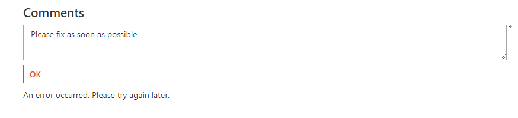
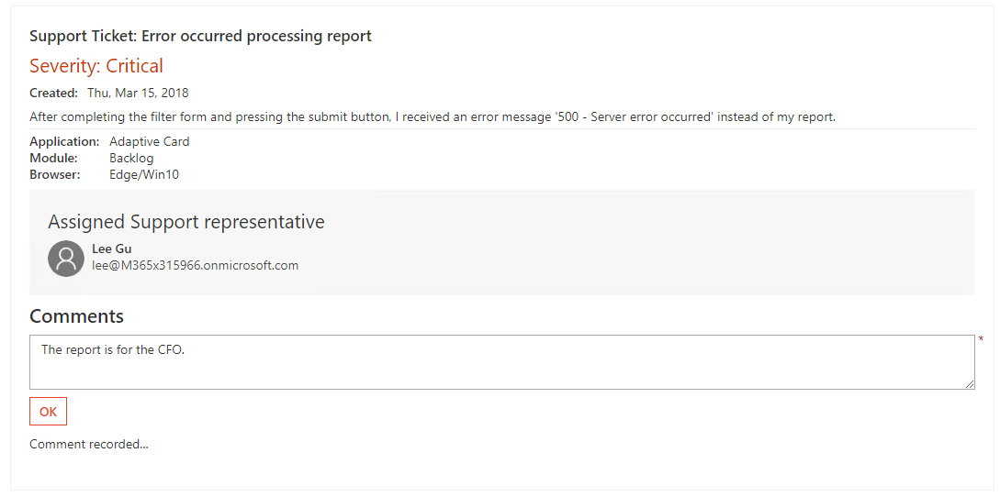

# Lab: Adaptive Cards

In this lab, you will walk through building an Adaptive Card, sending it to an inbox, and refreshing the card based on actions.

## In this lab

1. [Adaptive Card design and Card Playground](#exercise-1-adaptive-card-design-and-card-playground)
1. [Send Adaptive card via email](#exercise-2-send-adaptive-card-via-email)
1. [Adaptive Cards with actions and inputs](#exercise-3-adaptive-cards-with-actions-and-inputs)
1. [Card refresh](#exercise-4-card-refresh)
1. [Update card from service](#exercise-5-update-card-from-service)

## Prerequisites

This lab will require an Office 365 tenant and a user account that has a mailbox.

### Install developer tools

The developer workstation requires the following tools for this lab.

#### Download ngrok

The connector registration process requires an endpoint accessible from the internet via HTTPS. To enable the exercises to work correctly, a tunneling application is required.

This lab uses [ngrok](https://ngrok.com) for tunneling publicly-available HTTPS endpoints to a web server running locally on the developer workstation. ngrok is a single-file download that is run from a console.

## Exercise 1: Adaptive Card design and Card Playground

This exercise will walk you through designing an Adaptive Card and sending it via the Card Playground.

### Visit the Card Playground

1. Visit the [Card Playground](https://messagecardplayground.azurewebsites.net/).

    The Card Playground provides a sandboxed environment with which to design and test your cards. You can choose from a list of existing samples or load your own sample. You can make modifications within the page that are shown visually, enabling you to quickly modify a card's design.

    There are several samples of Adaptive Cards shown on the samples section of the [Adaptive Cards site](http://adaptivecards.io/samples/).

    For this lab, a sample card is provided that will be used throughout the lab. The card represents a ticket opened in a fictitious support system.

### Load the sample

1. Open the file **LabFiles/CardPlayground/supportTicketCard.json**. Copy the entire contents to the clipboard.
1. On the [Card Playground](https://messagecardplayground.azurewebsites.net/) page, remove all of the sample text and paste the contents of the **supportTicketCard.json**.

1. Review the card source and preview.

### Modify the sample

The card contains the severity level of the support ticket. Adaptive Cards allows for card authors to style the card's content to properly convey the information. Since the severity level of the ticket is critical, the card needs to be updated to reflect this information.

1. Locate the TextBlock containing the severity level. This block starts at line 15.

    

1. Add the following properties to the TextBlock:

    ```json
    "color": "attention",
    "size": "large"
    ```

1. Be sure to include commas where necessary to ensure the card source is properly formatted as JSON. When complete, the TextBlock definition should match the following image:

    

1. The updated card now shows the severity level in large red text.

    

1. Save the updated **supportTicketCard.json**.

## Exercise 2: Send Adaptive card via email

This exercise will send the card via email using a console application.

### Register application in the Azure Active Directory

1. Open the [Azure Active Directory admin center](https://aad.portal.azure.com).

1. Log in with the work or school account that is an administrator in the tenant.

1. Select **Azure Active Directory** in the left-most blade.

1. Select **App registrations** in the left-hand menu.

1. Select **New registration**.

1. Enter a name for the application. A suggested name is `Expense Card mailer`. Select **Register**.

1. In the **Overview** blade, copy the **Application (client) ID**.

1. In the **Overview** blade, copy the **Directory (tenant) ID**.

1. Select **Authentication** in the left-hand menu.

1. In the Redirect URIs > **Suggested Redirect URIs for public clients (mobile, desktop)** section, select the native client URI. (`https://login.microsoftonline.com/common/oauth2/nativeclient`)

    

1. Select **Save** from the toolbar at the top of the Authentication blade.

### Compile the SendEmailCard program

1. Launch **Visual Studio 2017**.

1. Open the `SendEmailCard.sln` solution from the **LabFiles\SendEmailCard** folder.

1. Open the **App.config** file in Solution Explorer.

1. Find the following line:

    ```xml
    <add key="applicationId" value="[your-app-id-here]" />
    <add key="tenantId" value="[your-tenant-id-here]" />
    ```

1. Paste the application ID you copied from the portal into the `value`, replacing the token `[your-app-id-here]`.

1. Past the tenant ID you copied from the portal into the `value`, replacing the token `[your-tenant-id-here]`.

1. Save the file.

1. Press **Ctrl+Shift+B** in Visual Studio to build the app.

1. An executable program named **SendEmailCard.exe** is compiled into the `bin` folder. This executable is used in the lab.

### Send email with Adaptive Card via console application

Sending an Adaptive Card via email requires a message body in HTML. The Adaptive Card JSON is included in the `<head>` element of the HTML document, wrapped in a `<script>` tag with a specific type attribute. The `SendEmailCard.sln` solution compiled earlier has code showing the message format that you can review.

1. Copy the **supportTicketCard.json** file from exercise 1 to the folder containing the **SendEmailCard.exe** program.

1. Open a command prompt.

1. Change to the folder containing the **SendEmailCard.exe** file.

1. Run the command, specifying two arguments:

    ```shell
    SendEmailCard.exe adaptive supportTicketCard.json
    ```

1. A pop-up authentication window should appear. Login with the Work or School  account specified in the Actionable Email Developer Dashboard. Review the list of requested permissions and click **Accept** or **Cancel**. (**Note:** choosing **Cancel** will result in the app returning an error and not sending a message.)

1. The command prompt window should output `Message sent` to indicate success.

1. Check your inbox using Outlook on the web for the message.

### Send a signed-card payload

Under certain conditions, the adaptive card must be sent as a signed card. These requirements are discussed as part of the [Security requirements for Actionable Messages](https://docs.microsoft.com/en-us/outlook/actionable-messages/security-requirements). To send an adaptive card as a signed-payload, complete the following steps:

1. Open the file **Program.cs**.

1. Add the following statements to the top of the **Program.cs** file.

    ```csharp
    using Microsoft.IdentityModel.Tokens;
    using System.IdentityModel.Tokens.Jwt;
    using Newtonsoft.Json;
    using System.Security.Claims;
    using System.Security.Cryptography;
    ```

1. Add the following method to the `Program` class:

    ```csharp
    /// <summary>
    /// Get the private key to sign the card
    /// </summary>
    /// <returns>RSA private key</returns>
    static SecurityKey GetSecurityKeyFromRSAPrivateKeyXml()
    {
      // This is the Outlook Actionable Message developer key, which is only valid in self-sending senario.
      // Production services should generate their own key pairs and register the public key with Actionable Message team.
      string rsaPrivateKeyXml = "<RSAKeyValue><Modulus>8WX2j9xybAUSllBoD1FA6prUpRdabvT/RQgU898tv75Sn0LSZz5fpm/5YJDdNqOVjxq611WPnfPgOaX6h/klmHhk57ZJBl7rNwlX2FgOYOhlA1Nzf22iwb8qCipTn/4ncllCTk hvVBm43SNToXLp1f9tXrZCgQORnw6BDDmKlLxfSFTtGi7afgj9x+dEHfVfg9J/7DlsARceR4Oyfs1nlG6fUqtp0ZcAOk5YxhfuSecAr+GnIP7Vv5zCquqT7zQ8hfyZ1K+8Lqz8xEvi2mnGKH1JT1dPpSbk8DQU5RYjG8ttaHorSGprxH1cunt5OIcvlEODYII2CF8+2OSE/iEhBQ==</Modulus><Exponent>AQAB</Ex ponent><P>+IYb0oc550Z+oZ062lQ2VX93lzXZhTE2Spg/kWI5JJM469XN7WiJpPzSGyR+mJxyuDMq/8b1rjkij5GkQ9isDY5GQIehKAfUrn2hsruondV8f31l54myoee6/dEJfkwowJFe15MdDSJzudfAfce8q 2Jf+sFkOXsu7mTdxbkNlyM=</P><Q>+Kj67aCnTWYv7z/HyKYoez6Ul2j8upcpyBMmhGj6hg8BIrW h7xnU19zUZWDg7BbarheN4zcNo5c2jS1IK9BqeB7HVkrfOcW5optgBrZ8+GKBOWX6pAbt5c8Tqeb +LCDOeqzkJ2XmNt8UrWnloL/ZO7LCFQP+DcZG/VyeyXvKfbc=</Q><DP>SuP23GE9lLEMld0QkBxSZz9LJXjnvJhQ2Pe6KDBmMdxficnbDVC0MdCx69X6hDiY5WMd8Qfenwq+nG7yBjPz3P3js6xrZum9MHvRT0/3huB/bNe37qby+pEfKz9j0fhXS3hDEUlWts+L+hPHAOBAvZCehazja+LwCIzCu8OBEes=</DP><DQ>XhK/7AqtgNC6Lc95a+XAxu+kE6w6gPUTb4gfOFTnArTGfzUsMGMbbRc0m64NKgRzcw2iNmXrmQpqLvsEpN7SiONMEs98qESvuF8D80Yy/V12+hokus2MTzcKf2rOmi9HLo4eOvGIKRY4omq /3xL1wmoclwrNoLR0wwG5aQyWTP0=</DQ><InverseQ>A06rQ8aGgMnt3kysCGETrffhmlc6fVKA a7f8NX8Chi79uK0RjGU1xPkTAZ47X1ytlPJNeUhgPf5M65kAyV1o3Dxh3ZCi6Qysa+cA8HYFKEPMTk ImOpg2ps7Amn5Si+UNW+DL6xse86mh/53gCDggVeGYOBkdOe4BPs+m0GjEvOg=</InverseQ><D>g7Xsd8YCMGn8IEOy41ikIN1l1MYPM6c9eL7WH9HPtmTz062z+10O91L1L/kametbeP9Onpsyhy4/U3T6YyJPnwdhlwPgiDdWA2t3oLU68ykZpFzuEcMSIMBbAbzib9NOVpfZE7l19N8r/Ix/3wFCEN8TH7A2TQpTdAOH6dGjiU7HL8K652HybW33K5qfSTmmoMZ6Kc1InZFSJlYJ3/ysGUMRE4OssGLXW+94kKeOBPu+QB+kFKpC7FNuvnql9BPWZjrS22hW2dLQO991BEzgE0qm1CGKDuDZEK4EiabxtgJVdK8x4AkaqsbZAJr4pr6fna3009jygVlhWs4AT1kp6Q==</D></RSAKeyValue>";

      var rsa = new RSACryptoServiceProvider();
      rsa.FromXmlString(rsaPrivateKeyXml);

      return new RsaSecurityKey(rsa);
    }
    ```

1. Add the following method to the `Program` class. Replace the token [user-email] with the email that will send and receive the message during testing.

    ```csharp
    static string LoadSignedAdaptiveCardMessageBody(string cardJson)
    {
      SecurityKey securityKey = GetSecurityKeyFromRSAPrivateKeyXml();
      SigningCredentials signingCredentials = new SigningCredentials(securityKey, SecurityAlgorithms.RsaSha256Signature);

      JwtSecurityTokenHandler handler = new JwtSecurityTokenHandler();
      handler.SetDefaultTimesOnTokenCreation = false;

      string minifiedCard = JsonConvert.SerializeObject(JsonConvert.DeserializeObject(cardJson));

      // The Actionable Message provider ID generated during provider registration
      string originator = "65c680ef-36a6-4a1b-b84c-a7b5c6198792";

      // Recipients of the email
      string[] recipients = { "[user-email]" };

      // Sender of the email
      string sender = "[user-email]";

      ClaimsIdentity subject = new ClaimsIdentity(
      new Claim[]
      {
        new Claim("sender", sender),
        new Claim("originator", originator),
        new Claim("recipientsSerialized", JsonConvert.SerializeObject(recipients)),
        new Claim("adaptiveCardSerialized", minifiedCard)
      });

      JwtSecurityToken token = handler.CreateJwtSecurityToken(subject: subject, issuedAt: DateTime.UtcNow, signingCredentials: signingCredentials);

      string emailBody = System.IO.File.ReadAllText(@"..\..\signed_adaptive_template.html");

      emailBody = emailBody.Replace("{{signedCardPayload}}", token.RawData);

      return emailBody;
    }
    ```

1. Right-click on the project and select **Add > New Item...**. Select **HTML Page**. Name the page `signed_adaptive_template.html`.

1. Replace the contents of the `signed_adaptive_template.html` file with the following:

    ```html
    <html>
    <head>
        <meta http-equiv="Content-Type" content="text/html; charset=utf-8">
    </head>
    <body>
      <div>Visit the <a href="https://adaptivecards.io/">Adaptive Cards portal</a> to learn more about Adaptive Cards.</div>
      <section itemscope itemtype="http://schema.org/SignedAdaptiveCard">
        <meta itemprop="@context" content="http://schema.org/extensions" />
        <meta itemprop="@type" content="SignedAdaptiveCard" />
        <div itemprop="signedAdaptiveCard" style="mso-hide:all;display:none;max-height:0px;overflow:hidden;">{{signedCardPayload}}</div>
      </section>
    </body>
    </html>
    ```

1. Select the `signed_adaptive_template.html` file in **Solution Explorer** and press **F4**.

1. In the **Properties** pane, set the **Copy to Output Directory** property of the file to **Copy Always**.

1. In the `LoadCardMessageBody` method of the the `Program` class, locate the statement that reads the message body from the AdaptiveMessageBody.html file. Replace this statement with a call to the `LoadSignedAdaptiveCardMessageBody` method. The updated method will look as follows:

    ```csharp
    static string LoadCardMessageBody(string cardType, string filepath)
    {
      string messageBody = string.Empty;
      string cardJson = System.IO.File.ReadAllText(filepath);

      if (cardType == "adaptive")
      {
        messageBody = LoadSignedAdaptiveCardMessageBody(cardJson);
      }
      else
      {
        messageBody = System.IO.File.ReadAllText(@"ActionableMessageBody.html");
      }

      // Insert the JSON into the HTML
      return string.Format(messageBody, cardJson);
    }
    ```

1. Compile and run the **SendEmailCard** solution. The program will again prompt for an account and send the message.

    ```shell
    SendEmailCard.exe adaptive supportTicketCard.json
    ```

## Exercise 3: Adaptive Cards with actions and inputs

This exercise will enhance the support ticket card from Exercise 1 with input and action elements allowing comments on the support ticket directly from Microsoft Outlook. 

1. In Outlook, delete messages from earlier exercises.

### Run the ngrok secure tunnel application

1. Open a new **command prompt**.

1. Change to the directory that contains the **ngrok.exe** application.

1. Run the command `ngrok http 8011 -host-header=localhost:8011`.

1. The ngrok application will fill the entire prompt window. Make note of the forwarding address using HTTPS. This address is required in the next step.

1. Minimize the ngrok command prompt window. It is no longer referenced in this exercise, but it must remain running.

    

1. Open the **supportTicketCard.json** file from Exercise 1.

1. You will extend the card with another element in the body as a header for comments. Add a comma to the end of line 101 and press return.

1. Add the following snippet as lines 102 - 112.

    ````json
    {
      "type": "Container",
      "items": [
        {
          "type": "TextBlock",
          "text": "Comments",
          "size": "Large",
          "weight": "bolder"
        }
      ]
    }
    ````

1. You will add input and action controls to capture and submit the comments. Add a comma to the end of line 113 and press return. Line 113 is a closing bracket (`]`).

1. Add the following snippet as lines 114-142. This snippet should be outside of the `body` element. In the snippet, replace the token `ngrok-url-here` with the HTTPS address displayed in the ngrok window.

    ````json
    "actions": [
      {
        "type": "Action.ShowCard",
        "title": "Comment",
        "card": {
          "type": "AdaptiveCard",
          "body": [
            {
              "type": "Input.Text",
              "id": "comment",
              "isMultiline": true,
              "placeholder": "Enter your comment"
            }
          ],
          "actions": [
            {
              "type": "Action.Http",
              "method": "POST",
              "title": "OK",
              "url": "[ngrok-url-here]/api/ticket",
              "headers": [
                {
                  "name":"content-type",
                  "value": "application/json"
                }
              ],
              "body": "{ 'comment' : '{{comment.value}}' }"
            }
          ]
        }
      }
    ]
    ````

    The complete card JSON can be found [here](/Demos/02-CardWithActionAndInput/supportTicketWithActionAndInput.json).

    >Note: The `body` element of the `Action.Http` element contains a token indicated with double braces: `'{{comment.value}}'`. Inside the braces is the name of the input control. When the action is performed, the value of the input control is inserted in this token.

1. Use the **SendEmailCard** application from Exercise 2 to send the updated **supportTicketCard.json** file. The program will again prompt for an account and send the message.

### View and interact with Adaptive Cards

1. Open [Microsoft Outlook for Web](https://outlook.office.com). Log in with the same credentials used to send the message.

1. Open the message. Notice the input box and OK button at the bottom of the message.

    

1. Enter a comment an select **OK**. Microsoft Outlook will submit the card to the endpoint specified in the card. This submission will fail, since there is no web server listening at that address.

    

### Inspect HTTP POST message

The ngrok tunnel application received the submission from Microsoft Outlook. You can view the POST message using the ngrok web interface.

1. Open a browser window and go to <http://localhost:4040>.

1. Select the first request in the left column. In the right column, select the link titled **Raw**.

1. Note that the request contains an authorization header and the body contains the value as defined in the card.

    

## Exercise 4: Card refresh

In this exercise, a web service will handle the calls from Microsoft Outlook to support the Adaptive Card.

1. Open **Visual Studio 2017**.

1. In Visual Studio 2017, select **File > New > Project**.

1. Create a new Visual C# project using the **ASP.Net Web Application (.NET Framework) Template**.

1. Choose the **WebAPI** template.

1. Select **OK**.

### Update the web address of the Web API project

1. In the Solution explorer, double-click on the **Properties** node of the Web API project.

1. In the **Properties design** tab, select **Web** item in the left navigation.

1. Change the **Project URL** value to **http://localhost:8011/**.

1. Select the **Create Virtual Directory** button.

    

1. Save and close the **Properties design** tab.

### Add the required NuGet package

1. Select **Tools > NuGet Package Manager > Package Manager Console**.

1. In the **Package Manager Console**, enter the command `Install-Package Microsoft.O365.ActionableMessages.Utilities`.

1. Close the **Package Manager Console**.

### Add code to the project for the support ticket processing

1. In **Solution Explorer**, right-click on the **Models** folder and choose **Add > Class**. Name the class **Comment**.

1. Add the following properties to the `Comment` class:

    ```csharp
    public string ActionPerformer { get; set; }
    public DateTime CommentDate { get; set; }
    public string CommentText { get; set; }
    ```

1. In **Solution Explorer**, right-click on the **Models** folder and choose **Add > Class**. Name the class **CardResponse**.

1. Add the following properties to the `CardResponse` class:

    ```csharp
    public string Comment { get; set; }
    public string CachedComments { get; set; }
    ```

1. In **Solution Explorer**, right-click on the **Controllers** folder and choose **Add > Controller**.

1. Choose the **Web API 2 Controller - Empty** template. Name the controller **TicketController**.

1. Add the following statements to the top of the **TicketController.cs** file.

    ```csharp
    using Microsoft.O365.ActionableMessages.Utilities;
    using System.Diagnostics;
    using System.Threading.Tasks;
    ```

1. Add the following code to the `TicketController` class. The code can be found in **LabFiles/support-desk/TicketController.cs**. In the snippet, replace the token `https://api.ngrok.io` with the HTTPS address displayed in the ngrok window. Replace the token `yourdomain.onmicrosoft.com` with the email domain used to send the Adaptive Card to Microsoft Outlook.

    ```csharp
    public class TicketController : ApiController
    {

      // Replace https://api.ngrok.io with your service domain URL.
      // For example, if the service URL is https://api.xyz.com/finance/expense?id=1234,
      // then replace https://api.ngrok.io with https://api.xyz.com
      private const string WebServiceHost = "https://api.ngrok.io";

      // Replace yourdomain.onmicrosoft.com with your email domain.
      private const string SenderEmailDomain = "yourdomain.onmicrosoft.com";

      /// <summary>
      /// The 'Bearer' token type.
      /// </summary>
      private const string BearerTokenType = "bearer";

      /// <summary>
      /// The POST method for the ticket controller.
      /// </summary>
      /// <param name="cardResponse">Value from the POST request body.</param>
      /// <returns>The asynchronous task.</returns>
      // POST api/ticket
      public async Task<HttpResponseMessage> Post(Models.CardResponse cardResponse)
      {
        HttpRequestMessage request = this.ActionContext.Request;

        // Validate that we have a bearer token.
        if (request.Headers.Authorization == null ||
          !string.Equals(request.Headers.Authorization.Scheme, BearerTokenType, StringComparison.OrdinalIgnoreCase) ||
          string.IsNullOrEmpty(request.Headers.Authorization.Parameter))
        {
          return request.CreateErrorResponse(HttpStatusCode.Unauthorized, new HttpError());
        }

        string bearerToken = request.Headers.Authorization.Parameter;
        ActionableMessageTokenValidator validator = new ActionableMessageTokenValidator();

        // ValidateTokenAsync will verify the following
        // 1. The token is issued by Microsoft and its digital signature is valid.
        // 2. The token has not expired.
        // 3. The audience claim matches the service domain URL.
        ActionableMessageTokenValidationResult result = await validator.ValidateTokenAsync(bearerToken, WebServiceHost);

        if (!result.ValidationSucceeded)
        {
          if (result.Exception != null)
          {
            Trace.TraceError(result.Exception.ToString());
          }

          return request.CreateErrorResponse(HttpStatusCode.Unauthorized, new HttpError());
        }

        // We have a valid token. Your application should verify the sender and/or the ActionPerformer
        //
        // You should also return the CARD-ACTION-STATUS header in the response.
        // The value of the header will be displayed to the user.
        if (!result.Sender.ToLowerInvariant().EndsWith(SenderEmailDomain.ToLowerInvariant()))
        {
          HttpResponseMessage errorResponse = request.CreateErrorResponse(HttpStatusCode.Forbidden, new HttpError());
          errorResponse.Headers.Add("CARD-ACTION-STATUS", "Invalid sender or the action performer is not allowed.");
          return errorResponse;
        }

        // prepare the response
        HttpResponseMessage response = Request.CreateResponse(HttpStatusCode.OK);
        response.Headers.Add("CARD-ACTION-STATUS", "Comment recorded...");

        // Further business logic code here to process the support ticket.
        #region Business logic code here to process the support ticket.
        #endregion

        return response;
      }
    }
    ```

### Interact with the card

1. Start Visual Studio Debugger.

1. Return to Microsoft Outlook for web.

1. Enter a comment in the box and select **OK**.

    Outlook will POST the input from the card to the ngrok tunnel which will forward the request to the WebAPI project. The project simply replies with a specific header: `response.Headers.Add("CARD-ACTION-STATUS", "Comment recorded...");`

    The value of the header is rendered for a short time at the top of the email.

    

## Exercise 4: Update card from service

The card can be updated from the service in response to an action. This exercise will use the Authoring SDK to build a refreshed card and update the message in Outlook.

### Add NuGet package

1. Select **Tools > NuGet Package Manager > Package Manager Console**.

1. In the **Package Manager Console**, enter the command `Install-Package AdaptiveCards`.

1. Close the **Package Manager Console**.

### Create class for Action.Http

The Action.Http element is not part of the Adaptive Cards SDK. This action is an extension created for Outlook. You need to create a class to model this action.

1. Right-click on the project file and choose **Add > Class**.

1. Name the class **AdaptiveHttpAction**.

1. Add the following to the top of the **AdaptiveHttpAction.cs** file:

    ```csharp
    using AdaptiveCards;
    using Newtonsoft.Json;
    using System.Collections.Specialized;
    using System.ComponentModel;
    ```

1. In the **AdaptiveHttpAction.cs** file, replace the class definition with the following. The code is available in the **LabFiles/RefreshAdaptiveCard/AdaptiveHttpAction.cs** file.

    ```csharp
    public class AdaptiveHttpAction : AdaptiveAction
    {
      public const string TypeName = "Action.Http";

      public override string Type { get; set; } = TypeName;

      [JsonProperty("Url", Required=Required.Always)]
      public string UrlString { get; set; }

      [JsonProperty(Required = Required.Always)]
      public string Method { get; set; }

      [DefaultValue(null)]
      [JsonRequired]
      public string Body { get; set; }

      public StringDictionary Headers { get; set; }

      public AdaptiveHttpAction()
      {
        Headers = new StringDictionary();
      }
    }
    ```

### Add base card definition

1. Right-click on the project and choose **Add > JSON File**.

1. Name the file **refreshCard.json**.

1. Replace the contents of the **refreshCard.json** file with the code from file **LabFiles/RefreshAdaptiveCard/refreshCard.json**.

1. Select the **refreshCard.json** file in **Solution Explorer** and select **F4**.

1. In the **Properties pane**, set the **Build Action** of the file to **Embedded Resource**.

### Extend the TicketController

1. Add the following `using` statements to the top of the **TicketController.cs** file:

    ```csharp
    using AdaptiveCards;
    using Newtonsoft.Json.Linq;
    using System.Collections.Generic;
    using System.Linq;
    using System.IO;
    using System.Reflection;
    ```

1. In the **TicketController.cs** file, locate the following code region:

    ```csharp
    #region Business logic code here to process the support ticket.
    #endregion
    ```

1. Insert the following code below that line in `Business Logic` region:

    ```csharp
    #region Business logic code here to process the support ticket.
    List<Models.Comment> comments = new List<Models.Comment>();

      string newComment = cardResponse.Comment;

      if (cardResponse.CachedComments != null)
      {
        JArray cachedComments = (JArray)cardResponse.CachedComments;
        comments.AddRange(cachedComments.ToObject<List<Models.Comment>>());
      }

    // add this comment
    comments.Add(new Models.Comment() { ActionPerformer = result.ActionPerformer, CommentDate = DateTime.Now, CommentText = newComment });

    // create the card
    AdaptiveCards.AdaptiveCard refreshCard = CreateRefreshCard(comments);
    if (refreshCard != null)
    {
      // add the Action.Http block to the card.
      refreshCard.Actions.Add(CreateHttpAction(comments));
      response.Headers.Add("CARD-UPDATE-IN-BODY", "true");

      response.Content = new StringContent(refreshCard.ToJson());
    }
    #endregion
    ```

1. The business logic code references two helper methods. Add these methods to the **TicketController** class. (The code is available in the **LabFiles/RefreshAdapterCard/CardHelperFunctions.cs** file.) Replace the token **[WebApplicationNamespace]** with the default namespace for the web application project.

    ```csharp
    private AdaptiveCard CreateRefreshCard(List<Models.Comment> comments)
    {
      Assembly _assembly;
      StreamReader _textStreamReader;

      _assembly = Assembly.GetExecutingAssembly();
      _textStreamReader = new StreamReader(_assembly.GetManifestResourceStream("[WebApplicationNamespace].refreshCard.json"));

      AdaptiveCard refreshCard = AdaptiveCard.FromJson(_textStreamReader.ReadToEnd()).Card;

      AdaptiveContainer commentContainer = (AdaptiveContainer)refreshCard.Body.FirstOrDefault(e => e.Id != null && e.Id.Equals("comments"));

      if (commentContainer != null)
      {
        foreach (var comment in comments)
        {
          commentContainer.Items.Add(new AdaptiveTextBlock
          {
            Separator = true,
            Wrap = true,
            Text = comment.CommentText
          });

          commentContainer.Items.Add(new AdaptiveTextBlock
          {
            IsSubtle = true,
            Size = AdaptiveTextSize.Small,
            HorizontalAlignment = AdaptiveHorizontalAlignment.Right,
            Text = $"Entered by {comment.ActionPerformer} on {comment.CommentDate}"
          });
        }
        return refreshCard;
      }
      else
      {
        return null;
      }

    }

    private AdaptiveAction CreateHttpAction(List<Models.Comment> comments)
    {
      try
      {
        dynamic httpBody = new JObject();
        httpBody.cachedComments = JArray.FromObject(comments.ToArray<Models.Comment>());
        httpBody.comment = "{{comment.value}}";

        return new AdaptiveShowCardAction()
        {
          Title = "Comment",
          Card = new AdaptiveCard("1.0")
          {
            Body = new List<AdaptiveElement>()
            {
              {
                new AdaptiveTextInput()
                {
                  Id = "comment",
                  IsMultiline = true,
                  Placeholder = "Enter your comment"
                }
              }
            },
            Actions = new List<AdaptiveAction>()
            {
              {
                new AdaptiveHttpAction()
                {
                  Method ="POST",
                  Headers = new System.Collections.Specialized.StringDictionary()
                  {
                    {
                      "Content-Type","application/json"
                    }
                  },
                  Title = "OK",
                  UrlString = $"{WebServiceHost}/api/Ticket",
                  Body = httpBody.ToString()
                }
              }
            }
          }
        };
      }
      catch (Exception ex)
      {
        var x = ex.Message;
      }
      return null;
    }
    ```

### Add comments in Microsoft Outlook and view refreshed card

1. Start Visual Studio Debugger.

1. Return to Microsoft Outlook for Web.

1. Locate the message containing the Adaptive Card.

1. Enter a message in the comment box and select **OK**.

1. Observe that the card updates with the comment added.

    
