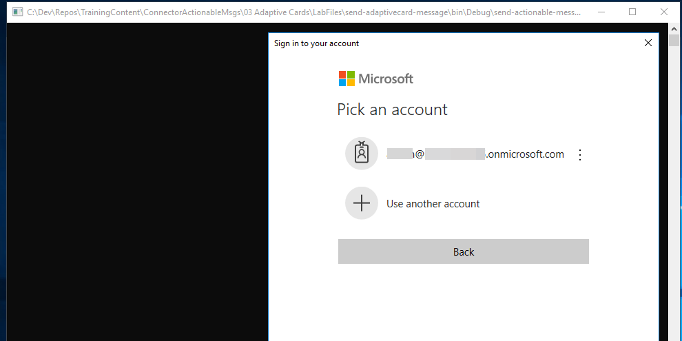

# Adaptive Cards – 300 Level

----------------
In this lab, you will walk through building an Adaptive Card, sending it to an inbox, and refreshing the card based on actions.

## Table of Contents

1. [Adaptive Card design and MessageCard Playground](#messagecardplayground)
1. [Adaptive Cards with Actions and Inputs](#actionsinputs)
1. [Card refresh](#cardrefresh)

## Prerequisites

This lab will require an Office 365 Tenant and a user account that has a mailbox.

> **NOTE - As of March, 2018, not all Office 365 Tenants support adaptive cards in Outlook.**

### Install developer tools

The developer workstation requires the following tools for this lab.

#### Download ngrok

The Connector registration process requires an endpoint accessible from the internet via HTTPS. To enable the exercises to work correctly, a tunneling application is required.

This lab uses [ngrok](https://ngrok.com) for tunneling publicly-available HTTPS endpoints to a web server running locally on the developer workstation. ngrok is a single-file download that is run from a console.

<a name="messagecardplayground"></a>

## Exercise 1. Adaptive Card design and MessageCard Playground

This exercise will walk you through designing an Adaptive Card and sending it via the Message Card Playground.

### Visit the MessageCard Playground

Visit the [MessageCard Playground](https://messagecardplayground.azurewebsites.net/) app.

The MessageCard Playground provides a sandboxed environment with which to design and test your cards. You can choose from a list of existing samples or load your own sample. You can make modifications within the page that are shown visually, enabling you to quickly modify a card's design.

There are several samples of Adaptive Cards shown on the [Samples section of the Adaptive Cards site](http://adaptivecards.io/samples/).

For this lab, a sample card is provided that will be used and extended throughout the lab. The card represents a ticket opened in a fictitious support system.

### Load the sample

1. On the [MessageCard Playground](https://messagecardplayground.azurewebsites.net/) page, click the **Load a Sample...** button.
1. In the **Open file** dialog, select the file **LabFiles/message-payground/supportTicketCard.json**.

    

1. Review the card source and preview.

### Modify the sample

The card contains the severity level of the support ticket. Adaptive Cards allows for card authors to style the card's content to properly convey the information. Since the severity level of the ticket is Critical, update the card to highlight this information.

1. Locate the TextBlock containing the severity level. This block starts at line 15.

    

1. Add the following properties to the TextBlock:

    ```json
    "color": "attention",
    "size": "large"
    ```

1. Be sure to include commas where necessary to ensure the card source is properly formatted as JSON. When complete, the TextBlock definition should match the following image:

    

1. The updated card now shows the severity level in large red text.

    

### Send the card

1. Click **Send via Email** to send the card to yourself. You will be prompted to log in. If this is the first time using the Message Card Playground, you will be prompted for consent to send messages as you.

1. After log in and consent, a confirmation message will display.

    

1. Open Outlook. Select the message titled "MessageCard Playground Test Card." The message will contain the card, footer text with links about the playground and card documentation, and will show the JSON payload of the card.

    

<a name="actionsinputs"></a>

## Exercise 2. Adaptive Cards with Actions and Inputs

This exercise will enhance the support ticket card from exercise 1 with Input and Action elements allowing comments on the support ticket directly from Outlook.

### Run the ngrok secure tunnel application

1. Open a new **Command Prompt** window.
1. Change to the directory that contains the ngrok.exe application.
1. run the command `ngrok http 8011 -host-header=localhost:8011`
1. The ngrok application will fill the entire prompt window. Make note of the Forwarding address using https. This address is required in the next step.
1. Minimize the ngrok Command Prompt window. It is no longer referenced in this exercise, but it must remain running.


### Update card and send via email

1. Launch Visual Studio 2017
1. Open the solution **LabFiles/SendAdaptiveCard/SendAdaptiveCard.sln**
1. Open the file **Card.json**.

We will extend the card with another element in the body as a header for comments.

1. Add a comma to the end of line 101.
1. Add the following snippet as lines 102 - 112.

    ````json
    {
      "type": "Container",
      "items": [
        {
          "type": "TextBlock",
          "text": "Comments",
          "size": "Large",
          "weight": "bolder"
        }
      ]
    }
    ````

We will add input and action controls to capture and submit the comments.

1. Add a comma to the end of line 113. (Line 113 is a closing bracket ']')
1. Add the following snippet as lines 114-142. This snippet should be outside of the **body** element. In the snippet, replace the token [ngrok-url-here] with the https address displayed in the ngrok window.

    ````json
    "actions": [
      {
        "type": "Action.ShowCard",
        "title": "Comment",
        "card": {
          "type": "AdaptiveCard",
          "body": [
            {
              "type": "Input.Text",
              "id": "comment",
              "isMultiline": true,
              "placeholder": "Enter your comment"
            }
          ],
          "actions": [
            {
              "type": "Action.Http",
              "method": "POST",
              "title": "OK",
              "url": "[ngrok-url-here]/api/ticket",
              "headers": {
                "content-type": "application/json"
              },
              "body": "{ 'comment' : '{{comment.value}}' }"
            }
          ]
        }
      }
    ]
    ````

The complete card JSON can be found at **/Demos/02-CardWithActionAndInput/supportTicketWithActionAndInput.json**.

Notice the **body** element of the **Action.Http** element. The body contains a token indicated with double braces ( ` '{{comment.value}}' ` ). Inside the braces is the name of the input control. When the action is performed, the value of the input control is inserted in this token.

### Review message format

1. In Visual Studio, open file **MessageBody.html**.
1. Notice that the `<head>` element contains a `<script>` tag. The type for the tag is `application/adaptivecard+json`. This value instructs Outlook that the following code should be interpreted as an Adaptive card.

### Register the application

1. Go to the [Application Registration Portal](https://apps.dev.microsoft.com) and sign in with either a Microsoft account or an Office 365 account.
1. Click the **Add an app** button. Enter a name for the application and click **Create**.
1. Click the **Add Platform** button and choose **Native Application**.
1. Click **Save**

Copy the value of **Application Id**

### Add the application ID to the project

1. Open the [App.config](App.config) file in Solution Explorer.
1. Find the following line:

    ```xml
    <add key="applicationId" value="[your-app-id-here]" />
    ```
1. Paste the application ID you copied from the portal into the `value`, replacing the token `[your-app-id-here]` and save the file.

### Send card via email

Compile and run the **SendAdaptiveCard** solution. The solution is a console application. The application will present an Azure Active Directory login prompt. Log in with your credentials. (It is not necessary to have any specific permissions. The application will send a mail to the inbox associated to the account used to log in.)



The first time the application is run, you will be asked to consent the application.

The program will send the message and prompt to press any key to exit.

### View and interact with Adaptive Card

1. Open [Outlook for Web](https://outlook.office.com). Log in with the same credentials used to send the message.
1. Open the message. Notice the input box and OK button at the bottom of the message.


1. Enter a comment an click **OK**. Outlook will submit the card to the endpoint specified in the card. This submission will fail, since there is no web server listening at that address.


### Inspect Http POST message

The ngrok tunnel application received the submission from Outlook. We can view the POST message using the ngrok web interface.

1. Open a browser window to `http://localhost:4040`.
1. Click on the first request in the left column. In the right column, click on the link titled **Raw**.
1. Observe that the request contains an Authorization header and the body contains the value as defined in the card.


<a name="cardrefresh"></a>

## Exercise 3 - Card refresh

In this exercise, a web service will handle the calls from Outlook in support of the Adaptive Card.

1. Open Visual Studio 2017.
1. In Visual Studio 2017, select **File | New | Project**
1. Create a new Visual C# project using the **ASP.Net Web Application (.NET Framework) Template**
1. Choose the **WebAPI** template.
1. Click OK.

### Update the web address of the Web API project

1. In solution explorer, double click on the **Properties** node of the Web API project.
1. In the Properties design tab, click **Web** item in the left navigation.
1. Change the **Project Url** value to **http://localhost:8011/**
1. Click the **Create Virtual Directory** button.


1. Save and close the Properties design tab.

### Add the required NuGet package

1. Click **Tools | NuGet Package Manager | Package Manager Console**
1. In the **Package Manager console**, enter the command `Install-Package Microsoft.O365.ActionableMessages.Utilities`
1. Close the **Package Manager Console**.

### Add a WebAPI controller to the project for the support ticket processing

1. In Solution Explorer, right-click on the **Controllers** folder and choose **Add | Controller**.


1. Choose the **Web API 2 Controller - Empty** template. Name the controller **TicketController.
1. Add the following statements to the top of the **TicketController.cs** file.

    ```csharp
    using Microsoft.O365.ActionableMessages.Authentication;
    using System.Diagnostics;
    using System.Threading.Tasks;
    ```

1. Add the following code to the **TicketController** class. (The code can be found in file **LabFiles/support-desk/TicketController.cs**.) In the snippet, replace the token https://api.ngrok.io with the https address displayed in the ngrok window. Replace the token yourdomain.onmicrosoft.com with the email domain used to send the Adaptive Card to Outlook.

    ```csharp
    public class TicketController : ApiController
    {

      // Replace https://api.ngrok.io with your service domain URL.
      // For example, if the service URL is https://api.xyz.com/finance/expense?id=1234,
      // then replace https://api.ngrok.io with https://api.xyz.com
      private const string WebServiceHost = "https://api.ngrok.io";

      // Replace yourdomain.onmicrosoft.com with your email domain.
      private const string SenderEmailDomain = "yourdomain.onmicrosoft.com";

      /// <summary>
      /// The 'Bearer' token type.
      /// </summary>
      private const string BearerTokenType = "bearer";

      /// <summary>
      /// The POST method for the ticket controller.
      /// </summary>
      /// <param name="value">Value from the POST request body.</param>
      /// <returns>The asynchronous task.</returns>
      // POST api/ticket
      public async Task<HttpResponseMessage> Post([FromBody]string value)
      {
        HttpRequestMessage request = this.ActionContext.Request;

        // Validate that we have a bearer token.
        if (request.Headers.Authorization == null ||
          !string.Equals(request.Headers.Authorization.Scheme, BearerTokenType, StringComparison.OrdinalIgnoreCase) ||
          string.IsNullOrEmpty(request.Headers.Authorization.Parameter))
        {
          return request.CreateErrorResponse(HttpStatusCode.Unauthorized, new HttpError());
        }

        string bearerToken = request.Headers.Authorization.Parameter;
        ActionableMessageTokenValidator validator = new ActionableMessageTokenValidator();

        // ValidateTokenAsync will verify the following
        // 1. The token is issued by Microsoft and its digital signature is valid.
        // 2. The token has not expired.
        // 3. The audience claim matches the service domain URL.
        ActionableMessageTokenValidationResult result = await validator.ValidateTokenAsync(bearerToken, WebServiceHost);

        if (!result.ValidationSucceeded)
        {
          if (result.Exception != null)
          {
            Trace.TraceError(result.Exception.ToString());
          }

          return request.CreateErrorResponse(HttpStatusCode.Unauthorized, new HttpError());
        }

        // We have a valid token. Your application should verify the sender and/or the ActionPerformer
        //
        // You should also return the CARD-ACTION-STATUS header in the response.
        // The value of the header will be displayed to the user.
        if (!result.Sender.ToLower().EndsWith(SenderEmailDomain))
        {
          HttpResponseMessage errorResponse = request.CreateErrorResponse(HttpStatusCode.Forbidden, new HttpError());
          errorResponse.Headers.Add("CARD-ACTION-STATUS", "Invalid sender or the action performer is not allowed.");
          return errorResponse;
        }

        // prepare the response
        HttpResponseMessage response = Request.CreateResponse(HttpStatusCode.OK);
        response.Headers.Add("CARD-ACTION-STATUS", "Comment recorded...");

        // Further business logic code here to process the support ticket.

        return response;
      }
    }
    ```

## Work-around

> The Adaptive Card processing in OWA does not send the Headers. We need to process a content type of "text/plain"

1. Right-click on the project and choose **Add | Class**. Name the class **TextMediaTypeFormatter**.
1. Update the content of the **TextMediaTypeFormatter** class with the code from the file **LabFiles/support-desk/TextMediaTypeFormatter.cs**.
1. Update the **Global.asax.cs** class, adding the following to the end of the **Application_Start** method.

    ```csharp
    // Work-around until Outlook sends headers.
    // Add a reference here to the new MediaTypeFormatter that adds text/plain support
    GlobalConfiguration.Configuration.Formatters.Insert(0, new TextMediaTypeFormatter());
    ```

Run the web project. If prompted, choose to trust the development certificate.

### Interact with the Card

Return to Outlook for Web. Enter a comment in the box and click **OK**.

Outlook will POST the input from the card to the ngrok tunnel, which will forward the request to the WebAPI project. The project simply replies with a specific header:

`response.Headers.Add("CARD-ACTION-STATUS", "Comment recorded...");`

The value of the header is rendered at the bottom of the card.


## Exercise 4 - Update card from service

The card can be updated from the service in response to an Action. This exercise will use the Authoring SDK to build a refreshed card and update the message in Outlook.

### Add NuGet package

1. Click **Tools | NuGet Package Manager | Package Manager Console**
1. In the **Package Manager console**, enter the command `Install-Package AdaptiveCards -IncludePrerelease`
1. Close the **Package Manager Console**.

### Create class for Action.Http

The Action.Http element is not part of the Adaptive Cards SDK. (This action is an extension created for Outlook.) Create a class to model this action:

1. Right-click on the project file and choose **Add | Class**
1. Name the class **AdaptiveHttpAction**
1. In the **AdaptiveHttpAction.cs** class, replace the class definition with the following (the code is available in the **LabFiles/RefreshAdaptiveCard/AdaptiveHttpAction.cs** file):

    ```csharp
    public class AdaptiveHttpAction : AdaptiveAction
    {
      public const string TypeName = "Action.Http";

      public override string Type { get; set; } = TypeName;

      [JsonProperty("Url", Required=Required.Always)]
      public string UrlString { get; set; }

      [JsonProperty(Required = Required.Always)]
      public string Method { get; set; }

      [DefaultValue(null)]
      [JsonRequired]
      public string Body { get; set; }

      public StringDictionary Headers { get; set; }

      public AdaptiveHttpAction()
      {
        Headers = new StringDictionary();
      }
    }
    ```

### Create the data model

1. Right-click on the **Models** folder and choose **Add | Class**.
1. Name the class **Comment**.
1. In the **Comment.cs** class, replace the class definition with the following:

    ```csharp
    public class Comment
    {
      public string ActionPerformer { get; set; }
      public DateTime CommentDate { get; set; }
      public string CommentText { get; set; }
    }
    ```

### Add base card definition

The refresh card follows a format similar to the rest of the lab. The base definition of the refresh card will be added to the project as an embedded resource.

1. Right-click on the project and choose **Add | JSON File**.
1. Name the file **refreshCard.json**.
1. Replace the contents of the **refreshCard.json** file with the code from file **LabFiles/RefreshAdaptiveCard/refreshCard.json**.
1. Select the **refreshCard.json** file in **Solution Explorer** and press **F4**.
1. In the **Properties Pane**, set the **Build Action** of the file to **Embedded Resource**.

### Extend the TicketController

1. Add the following `using` statements to the top of the **TicketController.cs** file:

    ```csharp
    using Newtonsoft.Json;
    using Newtonsoft.Json.Linq;
    using System.IO;
    using System.Reflection;
    ```

1. In the **TicketController.cs** file, locate the following code region:

    ```csharp
    #region Business logic code here to process the support ticket.
    #endregion
    ```

1. Insert the following code below that line in Business Logic region:

    ```csharp
    #region Business logic code here to process the support ticket.
    List<Models.Comment> comments = new List<Models.Comment>();

    JObject requestObject = JObject.Parse(value);
    string newComment = (string)requestObject["comment"];

    JArray cachedComments = (JArray)requestObject["cachedComments"];
    if (cachedComments != null)
    {
      comments.AddRange(cachedComments.ToObject<List<Models.Comment>>());
    }

    // add this comment
    comments.Add(new Models.Comment() { ActionPerformer = result.ActionPerformer, CommentDate = DateTime.Now, CommentText = newComment });

    // create the card
    AdaptiveCards.AdaptiveCard refreshCard = CreateRefreshCard(comments);
    if (refreshCard != null)
    {
      // add the Action.Http block to the card.
      refreshCard.Actions.Add(CreateHttpAction(comments));
      response.Headers.Add("CARD-UPDATE-IN-BODY", "true");

      response.Content = new StringContent(refreshCard.ToJson());
    }
    #endregion
    ```

1. The business logic code references two helper methods. Add these methods to the **TicketController** class (the code is available in the **LabFiles/RefreshAdapterCard/CardHelperFunctions.cs** file):

    ```csharp
    private AdaptiveCard CreateRefreshCard(List<Models.Comment> comments)
    {
      Assembly _assembly;
      StreamReader _textStreamReader;

      _assembly = Assembly.GetExecutingAssembly();
      _textStreamReader = new StreamReader(_assembly.GetManifestResourceStream("WebApplication1.refreshCard.json"));

      AdaptiveCard refreshCard = AdaptiveCard.FromJson(_textStreamReader.ReadToEnd()).Card;

      AdaptiveContainer commentContainer = (AdaptiveContainer)refreshCard.Body.FirstOrDefault(e => e.Id != null && e.Id.Equals("comments"));

      if (commentContainer != null)
      {
        foreach (var comment in comments)
        {
          commentContainer.Items.Add(new AdaptiveTextBlock
          {
            Separator = true,
            Wrap = true,
            Text = comment.CommentText
          });

          commentContainer.Items.Add(new AdaptiveTextBlock
          {
            IsSubtle = true,
            Size = AdaptiveTextSize.Small,
            HorizontalAlignment = AdaptiveHorizontalAlignment.Right,
            Text = $"Entered by {comment.ActionPerformer} on {comment.CommentDate}"
          });
        }
        return refreshCard;
      }
      else
      {
        return null;
      }

    }

    private AdaptiveAction CreateHttpAction(List<Models.Comment> comments)
    {
      try
      {
        dynamic httpBody = new JObject();
        httpBody.cachedComments = JArray.FromObject(comments.ToArray<Models.Comment>());
        httpBody.comment = "{{comment.value}}";

        return new AdaptiveShowCardAction()
        {
          Title = "Comment",
          Card = new AdaptiveCard()
          {
            Body = new List<AdaptiveElement>()
            {
              {
                new AdaptiveTextInput()
                {
                  Id ="comment",
                  IsMultiline =true,
                  Placeholder ="Enter your comment"
                }
              }
            },
            Actions = new List<AdaptiveAction>()
            {
              {
                new AdaptiveHttpAction()
                {
                  Method ="POST",
                  Headers = new System.Collections.Specialized.StringDictionary()
                  {
                    {
                      "Content-Type","application/json"
                    }
                  },
                  Title ="OK",
                  UrlString =$"{WebServiceHost}/api/Ticket",
                  Body = httpBody.ToString()
                }
              }
            }
          }
        };
      }
      catch (Exception ex)
      {
        var x = ex.Message;
      }
      return null;
    }
    ```

### Add comments in Outlook and view refreshed card

1. Return to Outlook for Web.
1. Locate the message containing the Adaptive Card.
1. Enter a message in the comment box and click **OK**.
1. Observe the card update with the comment added.

  