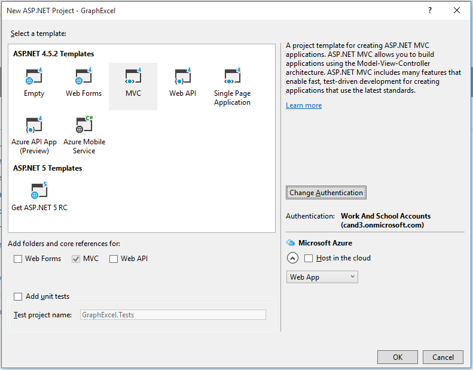
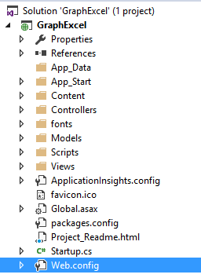
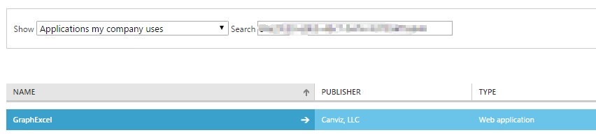
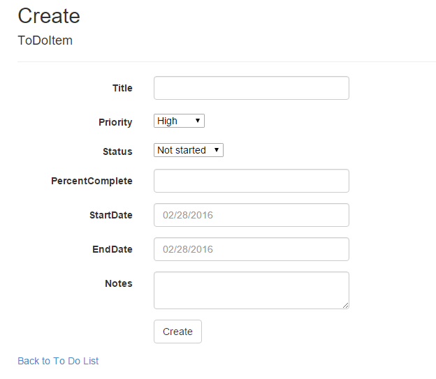

# Deep Dive into Excel - Microsoft Graph
In this lab, you will use Microsoft Graph to work with an Excel workbook stored in OneDrive.

## Prerequisites
1. You must have an Office 365 tenant and Microsoft Azure subscription to complete this lab. If you do not have one, the lab for **O3651-7 Setting up your Developer environment in Office 365** shows you how to obtain a trial. 
2. You must have Visual Studio 2015.

## Exercise 1: Create an ASP.NET MVC5 Application
In this exercise, you will create the ASP.NET MVC5 application and register it with Azure active Directory.

1. Launch **Visual Studio 2015** as administrator.
1. In Visual Studio, click **File/New/Project**.
1. In the **New Project** dialog
   	1. Select **Templates/Visual C#/Web**.
   	2. Select **ASP.NET Web Application**.
   	3. Enter **GraphExcel** in the **Name** textbox.
	4. Click **OK**.

	

	> **Note:** Make sure you enter the exact same name for the Visual Studio Project that is specified in these lab instructions. The Visual Studio Project name becomes part of the namespace in the code. The code inside these instructions depends on the namespace matching the Visual Studio Project name specified in these instructions. If you use a different project name the code will not compile unless you adjust all the namespaces to match the Visual Studio Project name you enter when you create the project.

1. In the **New ASP.NET Project** dialog
   1. Click **MVC**.
   2. Click **Change Authentication**.
   3. Select **Work And School Accounts**.
   4. Select **Cloud - Single Organization**
   5. Input **Domain** of your O365 tenancy
   6. Check **Read directory data** under Directory Access Permissions
   7. Click **OK**.
   8. Uncheck **Host in the cloud**
   9. Click **OK**.
      
      
      

5. At this point you can test the authentication flow for your application.
   1. In Visual Studio, press **F5**. The browser will automatically launch taking you to the HTTPS start page for the web application.
   
   > **Note:** If you receive an error that indicates ASP.NET could not connect to the SQL database, please see the [SQL Server Database Connection Error Resolution document](../../SQL-DB-Connection-Error-Resolution.md) to quickly resolve the issue. 

   2. To sign in, click the **Sign In** link in the upper-right corner.
   3. Login using your **Organizational Account**.
   4. Upon a successful login, since this will be the first time you have logged into this app, Azure AD will present you with the common consent dialog that looks similar to the following image:
      
   5. Click **Accept** to approve the app's permission request on your data in Office 365.
   6. You will then be redirected back to your web application. However notice in the upper right corner, it now shows your email address & the **Sign Out** link.

Congratulations... at this point your app is configured with Azure AD and leverages OpenID Connect and OWIN to facilitate the authentication process!

## Exercise 2: Configure Web Application to use Azure AD and OWIN
In this exercise you will take the ASP.NET MVC web application you created in the previous exercise and configure it to use Azure AD & OpenID Connect for user & app authentication to the Microsoft Graph. You will do this by utilizing the OWIN framework. Once authenticated, you can use the access token returned by Azure AD to access the Microsoft Graph.

1. Grant App Necessary Permissions.
   1. Open the **GraphExcel** solution that you created in Exercise 1.
   2. Open the **Web.config** file.
      
   3. Find the **ida:ClientId** app setting, then copy the value to use later.  
      
   
   4. Browse to the [Azure Management Portal](https://manage.windowsazure.com) and sign in with your **Organizational Account**.
   5. In the left-hand navigation, click **Active Directory**.
   6. Select the directory you share with your Office 365 subscription.
   7. Go to the **APPLICATIONS** tab. 
      

   8. Enter the **ClientId** value that you copied above and search.
      

   9. Select the application.
   10. Open the **Configure** tab.
   11. Scroll down to the **permissions to other applications** section. 
   12. Click the **Add Application** button.
   13. In the **Permissions to other applications** dialog, click the **PLUS** icon next to the **Microsoft Graph** option.
   14. Click the **CHECK** icon in the lower right corner.
   15. For the new **Microsoft Graph** application permission entry, select the **Delegated Permissions** dropdown on the same line and then select the following permissions:
       * **Have full access to user files and files shared with user**    
   16. Click the **Save** button at the bottom of the page.
       

2. Upload the Excel workbook to OneDrive, we will access the Excel workbook in later exercises. 
   1. Open your SharePoint site and click the **OneDrive** button to go to the OneDrive site.
      

   2. Locate the [\\\O3653\O3653-16 Excel - Microsoft Graph\Lab Files](Lab Files) folder provided with this lab and find the [`ToDoListFinal.xlsx`](Lab Files/ToDoListFinal.xlsx) file. Drag the [`ToDoListFinal.xlsx`](Lab Files/ToDoListFinal.xlsx) file to OneDrive's Root folder.
      
    
3. Update **_Layout** file to add **To Do List** link:
   1. In Visual Studio, open the **_Layout.cshtml** file found in the **Views/Shared** folder.
      1. Locate the part of the file that includes a few links at the top of the page... it should look similar to the following code:
      
        ````asp
        <div class="navbar-collapse collapse">
            <ul class="nav navbar-nav">
                <li>@Html.ActionLink("Home", "Index", "Home")</li>
                <li>@Html.ActionLink("About", "About", "Home")</li>
                <li>@Html.ActionLink("Contact", "Contact", "Home")</li>
            </ul>
            @Html.Partial("_LoginPartial")
        </div>
        ````
      2. Add a new link that says To Do List to the menu.  When you are done the code will look like this.
      
        ````asp
        <div class="navbar-collapse collapse">
            <ul class="nav navbar-nav">
                <li>@Html.ActionLink("Home", "Index", "Home")</li>
                <li>@Html.ActionLink("About", "About", "Home")</li>
                <li>@Html.ActionLink("Contact", "Contact", "Home")</li>
                <li>@Html.ActionLink("To Do List", "Index", "ToDoList")</li>
            </ul>
            @Html.Partial("_LoginPartial")
        </div>
        ````

        > **Note:** The **To Do List** link will not work yet... you will add that in the next exercise.

## Exercise 3: Code For  Excel API
In this exercise, we will use Microsoft Graph to access the **ToDoListFinal** Excel workbook that we uploaded to OneDrive in Exercise 2.

1. In the **Solution Explorer**, locate the **Models** folder in the **GraphExcel** project.
2. Right-click the **Models** folder and select **Add/Class**.
3. In the **Add New Item** dialog, name the new class **ToDoItem** and click **Add** to create the new source file for the class.
4. At the top of the source file **ToDoItem.cs**, replace the existing using statements with these using statements.

	````c#
	using System;
    using Newtonsoft.Json.Serialization;
    using Newtonsoft.Json;
    using System.ComponentModel.DataAnnotations;	
	````

5. Implement the new class **ToDoItem** using the following class definition.
		
    ````c#
    public class ToDoItem
    {
        [JsonProperty("index")]
        public int Id { get; set; }
        [Required]
        public string Title { get; set; }
        [Required]
        public string Status { get; set; }
        [Required]
        public string Priority { get; set; }
        [Required]
        public string PercentComplete { get; set; }
        [Required]
        public string StartDate { get; set; }
        [Required]
        public string EndDate { get; set; }
        [DataType(DataType.MultilineText)]
        public string Notes { get; set; }
        public ToDoItem(
            int id,
            string title,
            string priority,
            string status,
            string percentComplete,
            string startDate,
            string endDate,
            string notes)
        {
            Id = Convert.ToInt32(id);
            Title = title;
            Priority = priority;
            Status = status;
            if (!percentComplete.EndsWith("%"))
                PercentComplete = percentComplete + "%";
            else
                PercentComplete = percentComplete;
            StartDate = startDate;
            EndDate = endDate;
            Notes = notes;
        }
        public ToDoItem() { }
    }
    ````

6. Right-click the project and select **Add/New Folder**. Give the folder the name **Helpers**. 
7. Right-click the **Helpers** folder and select **Add/Class**.
8. In the **Add New Item** dialog, name the new class **ExcelAPIHelper** and click **Add** to create the new source file for the class.
9. At the top of the source file **ExcelAPIHelper.cs**, replace the existing using statements with these using statements.

	````c#
	using System;
	using System.Collections.Generic;
	using System.Drawing;
	using System.Linq;
	using System.IO;
	using System.Web.Mvc;
	using System.Net.Http;
	using System.Net.Http.Headers;
	using System.Threading.Tasks;
	using System.Security.Claims;
	using Microsoft.IdentityModel.Clients.ActiveDirectory;
	using System.Configuration;
	using Newtonsoft.Json;
	using Newtonsoft.Json.Linq;
	using GraphExcel.Models;
	````
10. **Add** a method named **GetGraphAccessTokenAsync** to the **ExcelAPIHelper** class to get the access token for Microsoft Graph authentication.

    ````c#
    public async Task<string> GetGraphAccessTokenAsync()
    {
        var AzureAdGraphResourceURL = "https://graph.microsoft.com/";
        var Authority = ConfigurationManager.AppSettings["ida:AADInstance"] + ConfigurationManager.AppSettings["ida:TenantId"];
        var signInUserId = ClaimsPrincipal.Current.FindFirst(ClaimTypes.NameIdentifier).Value;
        var userObjectId = ClaimsPrincipal.Current.FindFirst("http://schemas.microsoft.com/identity/claims/objectidentifier").Value;
        var clientCredential = new ClientCredential(ConfigurationManager.AppSettings["ida:ClientId"], ConfigurationManager.AppSettings["ida:ClientSecret"]);
        var userIdentifier = new UserIdentifier(userObjectId, UserIdentifierType.UniqueId);

        AuthenticationContext authContext = new AuthenticationContext(Authority, new ADALTokenCache(signInUserId));
        var result = await authContext.AcquireTokenSilentAsync(AzureAdGraphResourceURL, clientCredential, userIdentifier);
        return result.AccessToken;
    }
    ````
11. **Add** a method named **GetFileId** to the **ExcelAPIHelper** class to get the file Id of the **ToDoListFinal.xlsx** Excel workbook.

    ````c#
    public async Task<string> GetFileId(string accessToken)
    {
        string excelName = "ToDoListFinal.xlsx";
        string ret = "";
        using (var client = new HttpClient())
        {
            client.DefaultRequestHeaders.Accept.Clear();
            client.DefaultRequestHeaders.Authorization = new AuthenticationHeaderValue("Bearer", accessToken);
            client.DefaultRequestHeaders.Accept.Add(new MediaTypeWithQualityHeaderValue("application/json"));

            // New code:
            HttpResponseMessage response = await client.GetAsync("https://graph.microsoft.com/testexcel/me/drive/root/children?$select=id&$filter=name eq '" + excelName + "'");
            if (response.IsSuccessStatusCode)
            {
                string resultString = await response.Content.ReadAsStringAsync();

                dynamic x = Newtonsoft.Json.JsonConvert.DeserializeObject(resultString);
                var y = x.value[0];
                ret = y.id;
            }
        }
        return ret;
    }
    ````
12. **Add** a method named **GetToDoItems** to the **ExcelAPIHelper** class to get table rows from the **ToDoListFinal.xlsx** Excel workbook.

    ````c#
    public async Task<List<ToDoItem>> GetToDoItems()
    {
        string accessToken = await GetGraphAccessTokenAsync();
        string fileId = await GetFileId(accessToken);

        List<ToDoItem> todoItems = new List<ToDoItem>();

        using (var client = new HttpClient())
        {
            client.BaseAddress = new Uri("https://graph.microsoft.com/testexcel/me/drive/items/"+fileId+ "/workbook/worksheets('ToDoList')/");
            client.DefaultRequestHeaders.Accept.Clear();
            client.DefaultRequestHeaders.Authorization = new AuthenticationHeaderValue("Bearer", accessToken);
            client.DefaultRequestHeaders.Accept.Add(new MediaTypeWithQualityHeaderValue("application/json"));

            // New code:
            HttpResponseMessage response = await client.GetAsync("tables('ToDoList')/Rows");
            if (response.IsSuccessStatusCode)
            {
                string resultString = await response.Content.ReadAsStringAsync();

                dynamic x = Newtonsoft.Json.JsonConvert.DeserializeObject(resultString);
                JArray y = x.value;

                todoItems = BuildList(todoItems, y);
            }
        }

        return todoItems;
    }
    ````

13. **Add** a method named **BuildList** to the **ExcelAPIHelper** class to create a generic list of type **ToDoItem**.

    ````c#
    private List<ToDoItem> BuildList(List<ToDoItem> todoItems, JArray y)
    {
        foreach (var item in y.Children())
        {
            var itemProperties = item.Children<JProperty>();
            var element = itemProperties.FirstOrDefault(xx => xx.Name == "values");
            JProperty index = itemProperties.FirstOrDefault(xxx => xxx.Name == "index");
            JToken values = element.Value;
            var stringValues = from stringValue in values select stringValue;
            foreach (JToken thing in stringValues)
            {
                IEnumerable<string> rowValues = thing.Values<string>();
                string[] stringArray = rowValues.Cast<string>().ToArray();
                try
                {
                    ToDoItem todoItem = new ToDoItem(
                         Convert.ToInt32(index.Value),
                         stringArray[1],
                         stringArray[3],
                         stringArray[4],
                         stringArray[2],
                         stringArray[5],
                         stringArray[6],
                    stringArray[7]);
                    todoItems.Add(todoItem);
                }
                catch (FormatException f)
                {
                    Console.WriteLine(f.Message);
                }
            }
        }
        return todoItems;
    }
    ````
14. **Add** a method named **CreateToDoItem** to insert a row into the table in the  **ToDoListFinal.xlsx** Excel workbook.

	````c#
	public async Task CreateToDoItem(string title, string priority, string status, string percentComplete, string startDate, string endDate, string notes)
    {
        string accessToken = await GetGraphAccessTokenAsync();
        string fileId = await GetFileId(accessToken);

        int id = new Random().Next(1, 1000);
        var priorityString = "";
        switch (priority)
        {
            case "1":
                priorityString = "High";
                break;
            case "2":
                priorityString = "Normal";
                break;
            case "3":
                priorityString = "Low";
                break;
        }

        var statusString = "";
        switch (status)
        {
            case "1":
                statusString = "Not started";
                break;
            case "2":
                statusString = "In-progress";
                break;
            case "3":
                statusString = "Completed";
                break;
        }
        using (var client = new HttpClient())
        {
            client.BaseAddress = new Uri("https://graph.microsoft.com/testexcel/me/drive/items/" + fileId + "/workbook/worksheets('ToDoList')/");
            client.DefaultRequestHeaders.Authorization = new AuthenticationHeaderValue("Bearer", accessToken);
            using (var request = new HttpRequestMessage(HttpMethod.Post, client.BaseAddress))
            {
                object[,] valuesArray = new object[1, 8] { { id, title, percentComplete.ToString(), priorityString, statusString, startDate, endDate, notes } };
                RequestBodyHelper requestBodyHelper = new RequestBodyHelper();
                requestBodyHelper.index = null;
                requestBodyHelper.values = valuesArray;
                string postPayload = JsonConvert.SerializeObject(requestBodyHelper);
                request.Content = new StringContent(postPayload, System.Text.Encoding.UTF8);

                using (HttpResponseMessage response = await client.PostAsync("tables('ToDoList')/rows", request.Content))
                {
                    if (response.IsSuccessStatusCode)
                    {
                        string resultString = await response.Content.ReadAsStringAsync();
                        dynamic x = JsonConvert.DeserializeObject(resultString);
                    }
                }
            }
        }
    }
    ````
15. **Add** a class named **RequestBodyHelper** that is used to post row data to Microsoft Graph.

	````c#
    public class RequestBodyHelper
    {
        public object index;
        public object[,] values;
    }
    ````
16. **Add** a method named **GetCharId** to get the chart Id of the chart in the **ToDoListFinal.xlsx** Excel workbook.

	````c#
	public async Task<string> GetCharId( string accessToken, string excelId, string chartName)
    {
        string ret = "";
        using (var client = new HttpClient())
        {
            client.DefaultRequestHeaders.Accept.Clear();
            client.DefaultRequestHeaders.Authorization = new AuthenticationHeaderValue("Bearer", accessToken);
            client.DefaultRequestHeaders.Accept.Add(new MediaTypeWithQualityHeaderValue("application/json"));

            HttpResponseMessage response = await client.GetAsync("https://graph.microsoft.com/testexcel/me/drive/items/"+ excelId+ "/workbook/worksheets('Summary')/charts");
            if (response.IsSuccessStatusCode)
            {
                string resultString = await response.Content.ReadAsStringAsync();

                dynamic x = JsonConvert.DeserializeObject(resultString);
                JArray array = x.value;
                var y = array.FirstOrDefault(xx=> xx["name"].ToString().Equals(chartName));
                ret = y["id"].ToString();
            }
        }
        return ret;
    }
    ````
17.  **Add** a method named **getChartImage** to get the chart image of the chart  in the **ToDoListFinal.xlsx** Excel workbook.

	````c#
    public async Task<FileContentResult> getChartImage()
    {
        string accessToken = await GetGraphAccessTokenAsync();
        string fileId = await GetFileId(accessToken);
        string chartId = await GetCharId(accessToken, fileId, "Chart 1");

        FileContentResult returnValue = null;
        using (var client = new HttpClient())
        {
            client.BaseAddress = new Uri("https://graph.microsoft.com/testexcel/me/drive/items/" + fileId + "/workbook/worksheets('Summary')/");
            client.DefaultRequestHeaders.Accept.Clear();
            client.DefaultRequestHeaders.Accept.Add(new MediaTypeWithQualityHeaderValue("application/json"));
            client.DefaultRequestHeaders.Authorization = new AuthenticationHeaderValue("Bearer", accessToken);

            HttpResponseMessage response = await client.GetAsync("charts('" + chartId + "')/Image(width=0,height=0,fittingMode='fit')");
            if (response.IsSuccessStatusCode)
            {
                string resultString = await response.Content.ReadAsStringAsync();

                dynamic x = JsonConvert.DeserializeObject(resultString);
                JToken y = x.Last;
                Bitmap imageBitmap = StringToBitmap(x["value"].ToString());
                ImageConverter converter = new ImageConverter();
                byte[] bytes = (byte[])converter.ConvertTo(imageBitmap, typeof(byte[]));
                returnValue = new FileContentResult(bytes, "image/bmp");
            }
            return returnValue;
        }
    }
    ````

18.  **Add** a method named **StringToBitmap** to convert the string returned from the Graph API to a Bitmap image.
	````c#
    public Bitmap StringToBitmap(string base64ImageString)
    {
        Bitmap bmpReturn = null;
        byte[] byteBuffer = Convert.FromBase64String(base64ImageString);
        MemoryStream memoryStream = new MemoryStream(byteBuffer);

        memoryStream.Position = 0;

        bmpReturn = (Bitmap)Bitmap.FromStream(memoryStream);
        memoryStream.Close();
        memoryStream = null;
        byteBuffer = null;
        return bmpReturn;
    }
    ````

At this point you have created the **ExcelAPIHelper** that will be used to communicate with the Microsoft Graph.

## Exercise 4: Code the MVC Application to display Excel table data and the chart image
In this exercise, you will code the **ToDoListController** and **ChartController** in the MVC application to display table data and the chart image in the Excel workbook.  You will also add the capability to add new rows of data to the table in the Excel workbook.

1. Right-click the **Controllers** folder and select **Add/Controller**.
   1. In the **Add Scaffold** dialog, select **MVC 5 Controller - Empty**.
   2. Click **Add**.
   3. When prompted for a name, enter **ToDoListController**.
   4. Click **Add**.
2. Within the **ToDoListController** file, replace the existing using statements with these using statements.

    ````c#
	using System.Web.Mvc;
	using System.Threading.Tasks;
	using GraphExcel.Helpers;
    ````

3. Within the `ToDoListController` class, add the following variable to create a new instance of the **ExcelAPIHelper** class you previously created:

    ````c#
    ExcelAPIHelper _restAPIHelper = new ExcelAPIHelper();
    ````

4. Within the `ToDoListController` class, add a route handler and view to list all the table rows in the **ToDoListFinal.xlsx** Excel workbook:
  1. **Replace** the **Index** method with the following code to read table rows.
      
    ````c#
    [Authorize]
    public async Task<ActionResult>Index()
    {
        return View(await _restAPIHelper.GetToDoItems());
    }
    ````

  2. Finally, update the view to display the table rows.
     1. Within the `ToDoListController` class, put the mouse focus on the `Index()` action method, **right click** and select **Add View**.
     2. Within the **Add View** dialog, set the following values:
        + View Name: **Index**.
        + Template: **Empty (without model)**.        
           > Leave all other fields blank & unchecked.      
        + Click **Add**.

     3. Within the **Views/ToDoList/Index.cshtml** file, delete all the code in the file and replace it with the following code:
        ````html
        @model IEnumerable<GraphExcel.Models.ToDoItem>
		@{
		    ViewBag.Title = "Index";
		    Layout = "~/Views/Shared/_Layout.cshtml";
		}
		<h2>To Do List</h2>
		<table class="table">
		    <tr>
		        <th>
		            @Html.DisplayNameFor(model => model.Title)
		        </th>
		        <th>
		            @Html.DisplayNameFor(model => model.Priority)
		        </th>
		        <th>
		            @Html.DisplayNameFor(model => model.Status)
		        </th>
		        <th>
		            @Html.DisplayNameFor(model => model.PercentComplete)
		        </th>
		        <th>
		            @Html.DisplayNameFor(model => model.StartDate)
		        </th>
		        <th>
		            @Html.DisplayNameFor(model => model.EndDate)
		        </th>
		        <th>
		            @Html.DisplayNameFor(model => model.Notes)
		        </th>
		        <th></th>
		    </tr>
		    @foreach (var item in Model)
		    {
		        <tr>
		            <td>
		                @Html.DisplayFor(modelItem => item.Title)
		            </td>
		            <td>
		                @Html.DisplayFor(modelItem => item.Priority)
		            </td>
		            <td>
		                @Html.DisplayFor(modelItem => item.Status)
		            </td>
		            <td>
		                @Html.DisplayFor(modelItem => item.PercentComplete)
		            </td>
		            <td>
		                @Html.DisplayFor(modelItem => item.StartDate)
		            </td>
		            <td>
		                @Html.DisplayFor(modelItem => item.EndDate)
		            </td>
		            <td>
		                @Html.DisplayFor(modelItem => item.Notes)
		            </td>
		        </tr>
		    }
		</table>
		<p>
		    @Html.ActionLink("Charts", "Index", "Chart")
		</p>
		<p>
		    <span>@Html.ActionLink("Refresh", "Index")</span><span> | </span><span></span>@Html.ActionLink("Add new", "Create")<span></span>
		</p>
        ````  
5. Test the new view:
   1. In **Visual Studio**, press **F5** to begin debugging.
   2. When prompted, log in with your **Organizational Account**.
   3. Once the application is loaded click the **To Do List** link in the top menu bar.
      > **Note:** If you receive an error that indicates ASP.NET could not connect to the SQL database, please see the [SQL Server Database Connection Error Resolution document](../../SQL-DB-Connection-Error-Resolution.md) to quickly resolve the issue. 

   4. Verify that your application displays table row data from the Excel workbook you uploaded to OneDrive..  
      

   5. Close the browser window, terminate the debugging session and return to Visual Studio.

6. Open the **Global.asax** file in the **GraphExcel** project.
   1. At the top of the source file **Global.asax**, add the following using statements just after the using statements that are already there.
      ````c#
      using System.Web.Helpers;
      using System.IdentityModel.Claims;
      ````
   2. Add the following code to the bottom of **Application_Start** method.
      ````c#
      AntiForgeryConfig.UniqueClaimTypeIdentifier = ClaimTypes.NameIdentifier;
      ````

7. Add a route handler and views to handle creating a table row:
   1. In the **ToDoListController.cs** file, add an action method named **Create** by using the following code to create a table row. Notice how you are adding two items, when the create form is requested (the `HttpGet` option) and one for when the form is submitted (the `HttpPost` option).

    ````c#
    [Authorize]
    [HttpGet]
    public ActionResult Create()
    {
        var priorityList = new SelectList(new[]
                                      {
                                          new {ID="1",Name="High"},
                                          new{ID="2",Name="Normal"},
                                          new{ID="3",Name="Low"},
                                      },
                        "ID", "Name", 1);
        ViewData["priorityList"] = priorityList;

        var statusList = new SelectList(new[]
                          {
                                          new {ID="1",Name="Not started"},
                                          new{ID="2",Name="In-progress"},
                                          new{ID="3",Name="Completed"},
                                      },
            "ID", "Name", 1);
        ViewData["statusList"] = statusList;

        return View();
    }
    [Authorize]
    [HttpPost]
    public async Task<ActionResult> Create(FormCollection collection)
    {
        try
        {

            await _restAPIHelper.CreateToDoItem(
                collection["Title"],
                collection["PriorityDD"],
                collection["StatusDD"],
                collection["PercentComplete"],
                collection["StartDate"],
                collection["EndDate"],
                collection["Notes"]);
            return RedirectToAction("Index");
        }
        catch
        {
            return View();
        }
    }
    ````

   2. Within the **ToDoListController** class, put the mouse focus on the `Create()` action method that has the `HttpGet` option, **right click** and select **Add View**.
   3. In the **Add View** dialog, set the following options on the dialog and click **Add**.
      + View Name: **Create**.
      + Template: **Empty (without model)**.        
        > Leave all other fields blank & unchecked.    
      + Click **Add**.

   4. Open the **Views/ToDoList/Create.cshtml** file. Delete all the code in the file and replace it with the following code:
      ````html
		@model GraphExcel.Models.ToDoItem
		@{
		    ViewBag.Title = "Create";
		    Layout = "~/Views/Shared/_Layout.cshtml";
		}
		<h2>Create</h2>
		@using (Html.BeginForm())
		{
		    @Html.AntiForgeryToken()
		
		    <div class="form-horizontal">
		        <h4>ToDoItem</h4>
		        <hr />
		        @Html.ValidationSummary(true, "", new { @class = "text-danger" })
		        <div class="form-group">
		            @Html.LabelFor(model => model.Title, htmlAttributes: new { @class = "control-label col-md-2" })
		            <div class="col-md-10">
		                @Html.EditorFor(model => model.Title, new { htmlAttributes = new { @class = "form-control" } })
		                @Html.ValidationMessageFor(model => model.Title, "", new { @class = "text-danger" })
		            </div>
		        </div>
		        <div class="form-group">
		            @Html.LabelFor(model => model.Priority, htmlAttributes: new { @class = "control-label col-md-2" })
		            <div class="col-md-10" style="padding-top:5px">
		                @Html.DropDownList("PriorityDD", ViewData["priorityList"] as SelectList)
		            </div>
		        </div>
		        <div class="form-group">
		            @Html.LabelFor(model => model.Status, htmlAttributes: new { @class = "control-label col-md-2" })
		            <div class="col-md-10" style="padding-top:5px">
		                @Html.DropDownList("StatusDD", ViewData["statusList"] as SelectList)
		            </div>
		        </div>
		        <div class="form-group">
		            @Html.LabelFor(model => model.PercentComplete, htmlAttributes: new { @class = "control-label col-md-2" })
		            <div class="col-md-10">
		                @Html.EditorFor(model => model.PercentComplete, new { htmlAttributes = new { @class = "form-control" } })
		            </div>
		        </div>
		        <div class="form-group">
		            @Html.LabelFor(model => model.StartDate, htmlAttributes: new { @class = "control-label col-md-2" })
		            <div class="col-md-10">
		                @Html.EditorFor(model => model.StartDate, new { htmlAttributes = new { @class = "form-control", @placeholder = "02/28/2016" } })
		                @Html.ValidationMessageFor(model => model.StartDate, "", new { @class = "text-danger" })
		            </div>
		        </div>
		        <div class="form-group">
		            @Html.LabelFor(model => model.EndDate, htmlAttributes: new { @class = "control-label col-md-2" })
		            <div class="col-md-10">
		                @Html.EditorFor(model => model.EndDate, new { htmlAttributes = new { @class = "form-control" , @placeholder = "02/28/2016" } })
		                @Html.ValidationMessageFor(model => model.EndDate, "", new { @class = "text-danger" })
		            </div>
		        </div>
		        <div class="form-group">
		            @Html.LabelFor(model => model.Notes, htmlAttributes: new { @class = "control-label col-md-2" })
		            <div class="col-md-10">
		                @Html.EditorFor(model => model.Notes, new { htmlAttributes = new { @class = "form-control" } })
		                @Html.ValidationMessageFor(model => model.Notes, "", new { @class = "text-danger" })
		            </div>
		        </div>
		        <div class="form-group">
		            <div class="col-md-offset-2 col-md-10">
		                <input type="submit" value="Create" class="btn btn-default" />
		            </div>
		        </div>
		    </div>
		}
		<div>
		    @Html.ActionLink("Back to To Do List", "Index")
		</div>
	  ````

8. Test the new view:
   1. In **Visual Studio**, press **F5** to begin debugging.
   2. When Prompted, log in with your **Organizational Account**.
   3. Once the application is loaded click the **To Do List** link in the top menu bar.
      > **Note:** If you receive an error that indicates ASP.NET could not connect to the SQL database, please see the [SQL Server Database Connection Error Resolution document](../../SQL-DB-Connection-Error-Resolution.md) to quickly resolve the issue. 

   4. Click the **Add New** link. You should see the form below. Fill the form out to add a new item and click the **Create** button.

      
   
   5. Notice the page refreshes and the new row is displayed.
   6. Close the browser window, terminate the debugging session and return to Visual Studio.

9. Right-click the **Controllers** folder and select **Add/Controller**.
   1. In the **Add Scaffold** dialog, select **MVC 5 Controller - Empty**.
   2. Click **Add**.
   3. When prompted for a name, enter **ChartController**.
   4. Click **Add**.

10. Add a route handler and views to work with the chart in the **ToDoListFinal.xlsx** Excel workbook:
    1. At the top of the source file **ChartController.cs**, replace the existing using statements with these using statements.
      ````c#
	  using System.Web.Mvc;
	  using System.Threading.Tasks;
	  using GraphExcel.Helpers;
      ````
    2. Within the **ChartController** class, **Replace** the **Index** method with the following code to read table rows from the Excel workbook.
       ````c#
       [Authorize]
       public ActionResult Index()
       {
           return View();
       }
       ````
    3. Within the **ChartController** class, add the method named `GetChart()` to get the chart image from the Excel workbook.
       ````c#
        public async Task<FileResult> GetChart()
        {
            ExcelAPIHelper _restAPIHelper = new ExcelAPIHelper();
            return await _restAPIHelper.getChartImage();
        }
       ````

    4. Within the `ChartController` class, right click the `Index()` method and select **Add View**.
    5. In the **Add View** dialog, set the following options on the dialog and click **Add**.
       + View Name: **Index**.
       + Template: **Empty (without model)**.        
         > Leave all other fields blank & unchecked.    
       + Click **Add**.
 
    6. Open the **Chart/Index.cshtml** file. Delete all the code in the file and replace it with the following code:
       ````html
		@{
		    ViewBag.Title = "View";
		    Layout = "~/Views/Shared/_Layout.cshtml";
		}
		<h2>Percent Complete Chart</h2>
		
		
		<div>
		    @Html.ActionLink("Back to To Do List", "Index", "ToDoList")
		</div>
       ````
11. Test the new view:
  1. In **Visual Studio**, press **F5** to begin debugging.
  2. When Prompted, log in with your **Organizational Account**.
  3. Once the application is loaded click the **To Do List** link in the top menu bar.
     > **Note:** If you receive an error that indicates ASP.NET could not connect to the SQL database, please see the [SQL Server Database Connection Error Resolution document](../../SQL-DB-Connection-Error-Resolution.md) to quickly resolve the issue. 

  4. Click the **Charts** link. Verify the chart from the Excel workbook is displayed in the web application.
     

  5. Close the browser window, terminate the debugging session and return to Visual Studio.

Congratulations! You have completed working with Excel workbooks via the Microsoft Graph.
