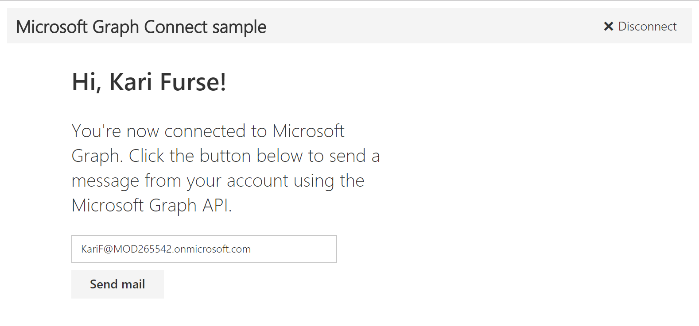

# Microsoft Graph: Building Microsoft Graph Applications - 200 Level
----------------
In this demo, you will through building applications that connect with the Microsoft Graph using multiple technologies. 

# Running the project
The finished solution is provided in this folder to simplify demonstrations. Configure the application as stated below. Update the config.js file with the **Application Id** from your registered application.  

# Microsoft Graph Connect Sample for AngularJS (REST)

## Table of contents

* [Introduction](#introduction)
* [Prerequisites](#prerequisites)
* [Register the application](#register-the-application)
* [Build and run the sample](#build-and-run-the-sample)
* [Questions and comments](#questions-and-comments)
* [Contributing](#contributing)
* [Additional resources](#additional-resources)

## Introduction

This sample shows how to connect an AngularJS app to a Microsoft work or school (Azure Active Directory) or personal (Microsoft) account  using the Microsoft Graph API to send an email. In addition, the sample uses the Office Fabric UI for styling and formatting the user experience.  We also have an [Angular connect sample](https://github.com/microsoftgraph/angular-connect-sample) that uses that [Microsoft Graph JavaScript SDK](https://github.com/microsoftgraph/msgraph-sdk-javascript).



This sample uses the [Microsoft Authentication Library Preview for JavaScript (msal.js)](https://github.com/AzureAD/microsoft-authentication-library-for-js) to get an access token.

## Prerequisites

To use the Microsoft Graph Connect sample for AngularJS, you need the following:

* [Node.js](https://nodejs.org/). Node is required to run the sample on a development server and to install dependencies.
* Either a [Microsoft account](https://www.outlook.com) or [Office 365 for business account](https://msdn.microsoft.com/en-us/office/office365/howto/setup-development-environment#bk_Office365Account)

## Register the application

1. Sign into the [App Registration Portal](https://apps.dev.microsoft.com/) using either your personal or work or school account.
1. Choose **Add an app**.
1. Enter a name for the app, and choose **Create application**.
   - The registration page displays, listing the properties of your app.
1. Copy the Application Id. This is the unique identifier for your app.
1. Under **Platforms**, choose **Add Platform**.
1. Choose **Web**.
1. Make sure the **Allow Implicit Flow** check box is selected, and enter *http://localhost:8080* as the Redirect URI. 
1. Choose **Save**.

## Build and run the sample

1. Download or clone the [Microsoft Graph Connect Sample for AngularJS](https://github.com/microsoftgraph/angular-connect-rest-sample).
1. Using your favorite IDE, open `config.js` in *public/scripts*.
1. Replace the **clientID** placeholder value with the application ID of your registered Azure application.
1. In a command prompt, run the following command in the root directory. This installs project dependencies.

    ```shell
    npm install
    ```

1. Run `npm start` to start the development server.
1. Navigate to `http://localhost:8080` in your web browser.
1. Choose the **Connect** button.
1. Sign in with your personal or work or school account and grant the requested permissions.
1. Optionally edit the recipient's email address, and then choose the **Send mail** button. When the mail is sent, a Success message is displayed below the button.

## Contributing

If you'd like to contribute to this sample, see [CONTRIBUTING.MD](/CONTRIBUTING.md).

This project has adopted the [Microsoft Open Source Code of Conduct](https://opensource.microsoft.com/codeofconduct/). For more information see the [Code of Conduct FAQ](https://opensource.microsoft.com/codeofconduct/faq/) or contact [opencode@microsoft.com](mailto:opencode@microsoft.com) with any additional questions or comments.

## Questions and comments

We'd love to get your feedback about this sample. You can send your questions and suggestions in the [Issues](https://github.com/microsoftgraph/angular-connect-rest-sample/issues) section of this repository.

Questions about Microsoft Graph development in general should be posted to [Stack Overflow](https://stackoverflow.com/questions/tagged/microsoftgraph). Make sure that your questions or comments are tagged with `[microsoftgraph]`.

## Additional resources

- [Other Microsoft Graph Connect samples](https://github.com/MicrosoftGraph?utf8=%E2%9C%93&query=-Connect)
- [Microsoft Graph](http://graph.microsoft.io)