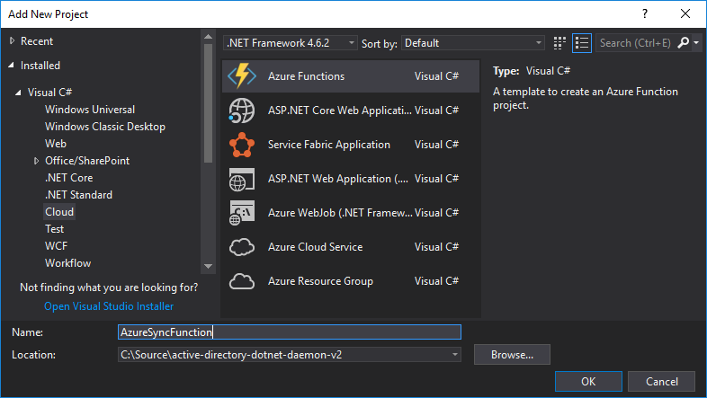
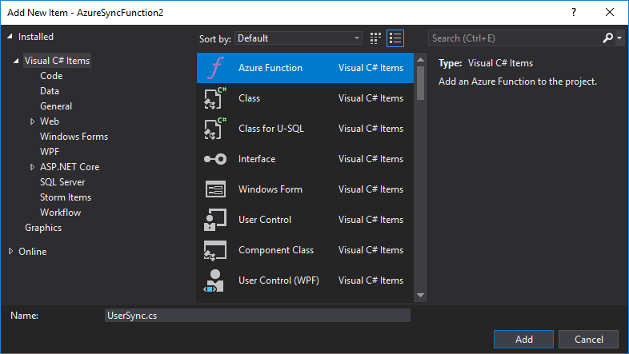
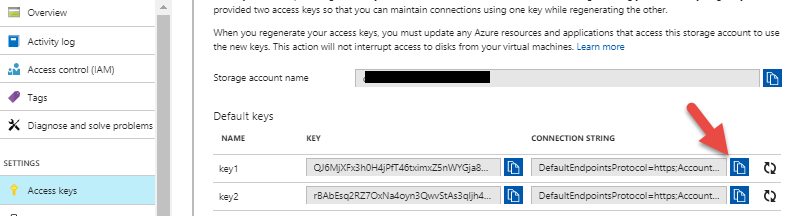
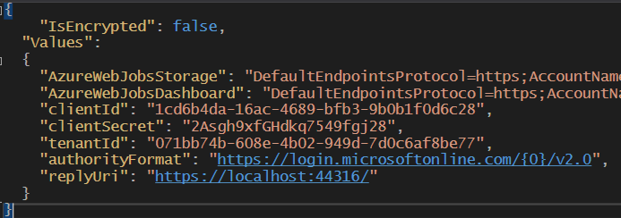
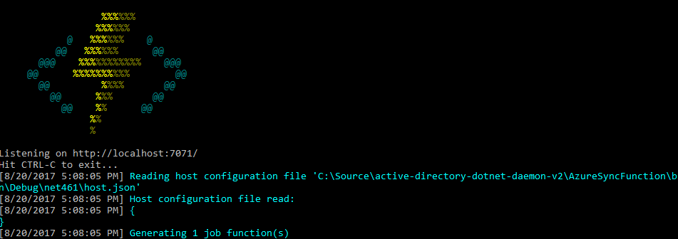
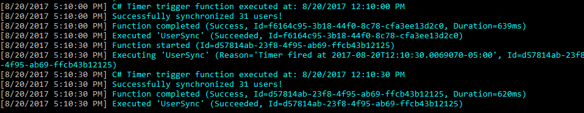
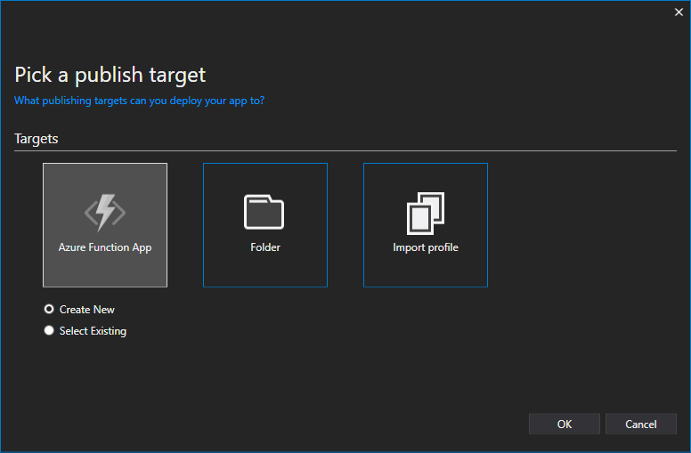
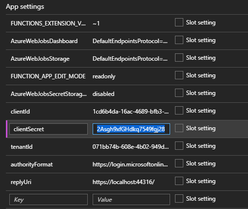
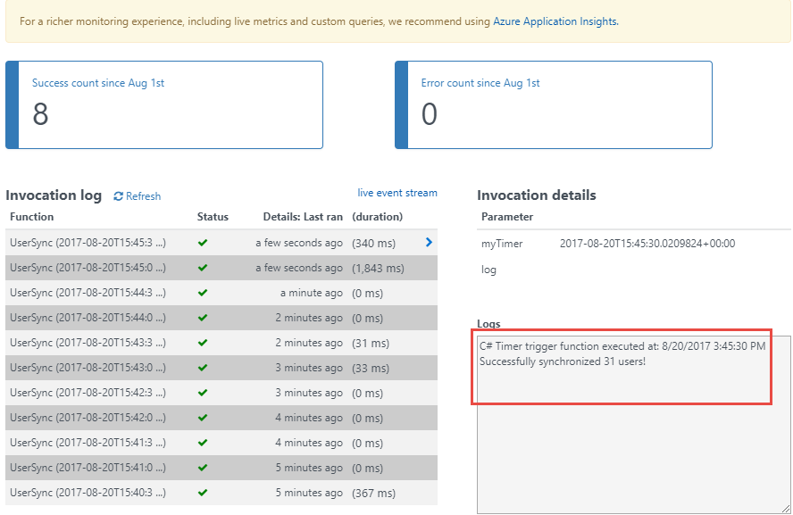

# Microsoft Graph: Building Microsoft Graph Applications - 200 Level
----------------
In this demo, you will through building applications that connect with the Microsoft Graph using multiple technologies. 

# Running the project

The finished solution is provided in this folder. Configure the application as stated below. Update the UserSync web project's **web.config** file with the configuration settings, and update the **local.settings.json** file in the AzureSyncFunction project. 

> **Note:** There is approximately a 20 minute data replication delay between the time when an application is granted admin consent and when the data can successfully synchronize. For more information, see: https://github.com/Azure-Samples/active-directory-dotnet-daemon-v2/issues/1

# Build a multi-tenant daemon with the v2.0 endpoint

This sample application shows how to use the [Azure AD v2.0 endpoint](http://aka.ms/aadv2) to access the data of Microsoft business customers in a long-running, non-interactive process. It uses the OAuth2 client credentials grant to acquire an access token which can be used to call the [Microsoft Graph](https://graph.microsoft.io) and access organizational data.

The app is built as an ASP.NET 4.5 MVC application, using the OWIN OpenID Connect middleware to sign-in users. Its "daemon" component is simply an API controller which, when called, syncs a list of users from the customer's Azure AD tenant. This `SyncController.cs` is triggered by an ajax call in the web application, and uses the preview Microsoft Authentication Library (MSAL) to perform token acquisition.

Because the app is a multi-tenant app intended for use by any Microsoft business customer, it must provide a way for customers to "sign up" or "connect" the application to their company data. During the connect flow, a company administrator can grant **application permissions** directly to the app so that it can access company data in a non-interactive fashion, without the presence of a signed-in user. The majority of the logic in this sample shows how to achieve this connect flow using the v2.0 **admin consent** endpoint.

For more information on the concepts used in this sample, be sure to read the [v2.0 endpoint client credentials protocol documentation](https://azure.microsoft.com/documentation/articles/active-directory-v2-protocols-oauth-client-creds).

> Looking for previous versions of this code sample? Check out the tags on the [releases](../../releases) GitHub page.

## Running the sample app

Follow the steps below to run the application and create your own multi-tenant daemon. We reccommend using Visual Studio 2015 to do so.

### Register an app

Create a new app at [apps.dev.microsoft.com](https://apps.dev.microsoft.com), or follow these [detailed steps](https://docs.microsoft.com/azure/active-directory/develop/active-directory-v2-app-registration). Make sure to:

- Copy down the **Application Id** assigned to your app, you'll need it soon.
- Add the **Web** platform for your app.
- Enter two **Redirect URI**s. The base URL for this sample, `https://localhost:44316/`, as well as `https://localhost:44316/Account/GrantPermissions`. These are the locations which the v2.0 endpoint will be allowed to return to after authentication.
- Generate an **Application Secret** of the type **password**, and copy it for later. Note that in production apps you should always use certificates as your application secrets, but for this sample we will use a simple shared secret password.

If you have an existing application that you have registered in the past, feel free to use that instead of creating a new registration.

### Configure your app for admin consent

In order to use the v2.0 admin consent endpoint, you'll need to declare the application permissions your app will use ahead of time. While still in the registration portal,

- Locate the **Microsoft Graph Permissions** section on your app registration.
- Under **Application Permissions**, add the `User.Read.All` permission.
- Be sure to **Save** your app registration.

### Download & configure the sample code

You can download this repo as a `*.zip` file using the button above, or run the following command:

`git clone https://github.com/Azure-Samples/active-directory-dotnet-daemon-v2.git`

Once you've downloaded the sample, open it using Visual Studio. Open the `web.config` file, and replace the following values:

- Replace the `clientId` value with the application ID you copied above.
- Replace the `clientSecret` value with the application secret you copied above.

### Run the sample

Start the UserSync application, and begin by signing in as an administrator in your Azure AD tenant. If you don't have an Azure AD tenant for testing, you can [follow these instructions](https://azure.microsoft.com/documentation/articles/active-directory-howto-tenant/) to get one.

When you sign in, the app will first ask you for permission to sign you in & read your user profile. This allows the application to ensure that you are a business user. The application will then try to sync a list of users from your Azure AD tenant via the Microsoft Graph. If it is unable to do so, it will ask you (the tenant administrator) to connect your tenant to the application.

The application will then ask for permission to read the list of users in your tenant. When you grant the permission, the application will then be able to query for users at any point. You can verify this by clicking the **Sync Users** button on the users page, refreshing the list of users. Try adding or removing a user and re-syncing the list (but note that it only syncs the first page of users!).

> **Note:** There is approximately a 20 minute data replication delay between the time when an application is granted admin consent and when the data can successfully synchronize. For more information, see: https://github.com/Azure-Samples/active-directory-dotnet-daemon-v2/issues/1

The relevant code for this sample is in the following files:

- Initial sign-in: `App_Start\Startup.Auth.cs`, `Controllers\AccountController.cs`
- Syncing the list of users to the local in-memory store: `Controllers\SyncController.cs`
- Displaying the list of users from the local in-memory store: `Controllers\UserController.cs`
- Acquiring permissions from the tenant admin using the admin consent endpoint: `Controllers\AccountController.cs`

### Create the Azure Function project##

Visual Studio 2017 provides new tooling to simplify the creation of Azure Functions while enabling local debugging. Under the "Visual C#" node in the tree, choose the "Azure Functions" project template.



For details on creating Azure Functions using Visual Studio, see [Azure Functions Tools for Visual Studio](https://docs.microsoft.com/en-us/azure/azure-functions/functions-develop-vs).

**Right-click** on the new function project and add a new function.



When prompted, set the trigger to a **Timer trigger** and change the schedule to the following format:

````
*/30 * * * * *
````


In the **NuGet Package Manager Console**, run the following commands to install the required packages.

````powershell
Install-Package "Microsoft.Graph"
Install-Package "Microsoft.Identity.Client" -pre
Install-Package "System.Configuration.ConfigurationManager"
````

Azure Functions that run on a schedule require an Azure storage account. Log into your Azure subscription and create a new storage account. Once created, copy its connection string.



Edit the `local.settings.json` file and provide the following items to use while debugging locally:

- **AzureWebJobsStorage**: Azure storage connection string
- **AzureWebJobsDashboard**: Azure storage connection string
- **clientId**: The Application Id of the registered application with AAD
- **clientSecret**: The secret key of the registered application with AAD
- **tenantId**: The tenant Id of the AAD directory
- **authorityFormat**: https://login.microsoftonline.com/{0}/v2.0
- **replyUri**: https://localhost:44316/

Refer to the following image to verify settings:


**Add** a class named `MsGraphUser.cs` to the project with the following contents:

````csharp
using System.Collections.Generic;
using Newtonsoft.Json;

namespace AzureSyncFunction.Models
{
    public class MsGraphUser
    {
        [JsonProperty(PropertyName = "@odata.type")]
        public string odataType { get; set; }
        [JsonProperty(PropertyName = "@odata.id")]
        public string odataId { get; set; }
        public List<string> businessPhones { get; set; }
        public string displayName { get; set; }
        public string givenName { get; set; }
        public string jobTitle { get; set; }
        public string mail { get; set; }
        public string mobilePhone { get; set; }
        public string officeLocation { get; set; }
        public string preferredLanguage { get; set; }
        public string surname { get; set; }
        public string userPrincipalName { get; set; }
        public string id { get; set; }
    }

    public class MsGraphUserListResponse
    {
        [JsonProperty(PropertyName = "@odata.context")]
        public string context { get; set; }
        public List<MsGraphUser> value { get; set; }
    }
}
````

**Replace** the contents of the function class with the following:

````csharp
using System;
using Microsoft.Azure.WebJobs;
using Microsoft.Azure.WebJobs.Host;
using Microsoft.Identity.Client;
using System.Net;
using AzureSyncFunction.Models;
using System.Collections.Concurrent;
using System.Collections.Generic;
using System.Net.Http;
using System.Net.Http.Headers;
using Newtonsoft.Json;
using System.Configuration;

namespace AzureSyncFunction
{
    public static class UserSync
    {
        private static string tenantId = ConfigurationManager.AppSettings["tenantId"];
        private static string authorityFormat = ConfigurationManager.AppSettings["authorityFormat"];

        private static string msGraphScope = "https://graph.microsoft.com/.default";
        private static string msGraphQuery = "https://graph.microsoft.com/v1.0/users";

        private static ConcurrentDictionary<string, List<MsGraphUser>> usersByTenant = new ConcurrentDictionary<string, List<MsGraphUser>>();

        [FunctionName("UserSync")]
        public static void Run([TimerTrigger("*/30 * * * * *")]TimerInfo myTimer, TraceWriter log)
        {
            log.Info($"C# Timer trigger function executed at: {DateTime.Now}");
            try
            {
                ConfidentialClientApplication daemonClient = new ConfidentialClientApplication(ConfigurationManager.AppSettings["clientId"],
                    String.Format(authorityFormat, tenantId),
                    ConfigurationManager.AppSettings["replyUri"],
                    new ClientCredential(ConfigurationManager.AppSettings["clientSecret"]),
                    null, new TokenCache());

                AuthenticationResult authResult = daemonClient.AcquireTokenForClientAsync(new string[] { msGraphScope }).GetAwaiter().GetResult();

                // Query for list of users in the tenant
                HttpClient client = new HttpClient();
                HttpRequestMessage request = new HttpRequestMessage(HttpMethod.Get, msGraphQuery);
                request.Headers.Authorization = new AuthenticationHeaderValue("Bearer", authResult.AccessToken);
                HttpResponseMessage response = client.SendAsync(request).GetAwaiter().GetResult();

                // If the token we used was insufficient to make the query, drop the token from the cache.
                // The Users page of the website will show a message to the user instructing them to grant
                // permissions to the app (see User/Index.cshtml).
                if (response.StatusCode == System.Net.HttpStatusCode.Forbidden)
                {
                    // BUG: Here, we should clear MSAL's app token cache to ensure that on a subsequent call
                    // to SyncController, MSAL does not return the same access token that resulted in this 403.
                    // By clearing the cache, MSAL will be forced to retrieve a new access token from AAD, 
                    // which will contain the most up-to-date set of permissions granted to the app. Since MSAL
                    // currently does not provide a way to clear the app token cache, we have commented this line
                    // out. Thankfully, since this app uses the default in-memory app token cache, the app still
                    // works correctly, since the in-memory cache is not persistent across calls to SyncController
                    // anyway. If you build a persistent app token cache for MSAL, you should make sure to clear 
                    // it at this point in the code.
                    //
                    //daemonClient.AppTokenCache.Clear(Startup.clientId);
                    log.Error("Unable to issue query: Received " + response.StatusCode + " in Run method");
                }

                if (!response.IsSuccessStatusCode)
                {
                    log.Error("Unable to issue query: Received " + response.StatusCode + " in Run method");
                }

                // Record users in the data store (note that this only records the first page of users)
                string json = response.Content.ReadAsStringAsync().GetAwaiter().GetResult();
                MsGraphUserListResponse users = JsonConvert.DeserializeObject<MsGraphUserListResponse>(json);
                usersByTenant[tenantId] = users.value;
                log.Info("Successfully synchronized " + users.value.Count + " users!");

            }
            catch (Exception oops)
            {
                log.Error(oops.Message, oops, "AzureSyncFunction.UserSync.Run");
            }
        }
    }
}
````

### Debug the Azure Function project locally##

Now that the project is coded and settings are configured, run the Azure Function project locally. A command window appears and provides output from the running function.



As the timer fires once every 30 seconds, the display will show the successful execution of the Azure Function.



### Deploy the Azure Function project to Microsoft Azure##

Right-click the Azure Function project and choose **Publish**. Choose the **Azure Function App**, and create a new publish target.



Choose your Azure subscription, a resource group, an app service plan, and a storage account and then click Create. The function is published to your Azure subscription.


The local configuration settings are not published to the Azure Function. Open the Azure Function and choose **Application Settings**. Provide the same key and value pairs that you used within your local debug session.



Finally, click on the **Monitor** node to monitor the Azure Function as it runs every 30 seconds. In the Logs window, verify that you are successfully synchronizing users.


